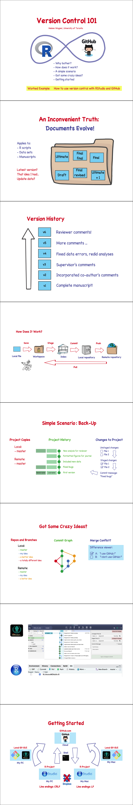

--- 
bookdown::gitbook:
  includes:
      in_header: header.html
---

# GitHub for Group Projects


If you joined a group project in the DGS Landscape Genetics and want to collaborate with your team on GitHub, this part is for you!

It contains an introductory video and a series of tutorials to help get you started with GitHub and collaborative coding. 

- [Why use GitHub?](#github)
- [Installation](#install)
- [Workflow](#workflow)


## Why use GitHub? {#github}

Helene Wagner

### 1. Goals {-}

This section explains the basics of version control: why it is important, and how it works. This will help you better understand the tutorials on installation and workflow. Here you can:

- [Watch course video](#version)
- [Preview and download the slides](#slides)

### 2. Watch course video: Version Control 101 {-#version}

Note: the video mentions a worked example. This has been replaced by the external tutorials listed above.

- External link: [Week 0 video](https://sho.co/19EFD)
- Transcript: [Download transcript](https://github.com/hhwagner1/DGS_LG_Labs/raw/master/transcripts/Week0_Script.pdf)


Embedded video:

<iframe width="560" height="315" src="https://www.youtube.com/embed/prXFvulWRGw" title="YouTube video player" frameborder="0" allow="accelerometer; autoplay; clipboard-write; encrypted-media; gyroscope; picture-in-picture" allowfullscreen></iframe>

### 3. Preview slides {-#slides}

[Download slides](https://github.com/hhwagner1/DGS_LG_Labs/raw/master/docs/Video_slides/Week0_Slides.pdf)


```
## Warning: The `size` argument of `element_rect()` is deprecated as of ggplot2 3.4.0.
## ℹ Please use the `linewidth` argument instead.
## This warning is displayed once every 8 hours.
## Call `lifecycle::last_lifecycle_warnings()` to see where this warning was
## generated.
```



### 4. Next steps {-} 

Continue to the [Installation](#install) page.


## Installation {#install}

Helene Wagner

### 1. Goals {-}

This section provides step-by-step video instructions how to install git and make it interact with RStudio and GitKraken. 

- [Video tutorials](#gitvideos) walk you through a typical installation process. They assume that you have received an invitation to join a GitHub project, e.g., for a DGS Landscape Genetics group project. 
- [Happy Git with R](#happygit) - this external tutorial is more general and can be very useful for trouble shooting during installation. 
- [Joining your group's project](#join) on GitHub is explained with screenshots in a brief tutorial (Google Doc). 
- [Setting up a group project](#repo) as a collaborative GitHub repo is explained in an external tutorial.

There are various ways to install git, and various ways to interact with it. While many tutorials available online rely heavily on git commands in the Terminal, here we avoid using the Terminal as far as reasonably possible (and when we use it, we demonstrate it in a video). 

### 2. How to get GitHub and GitKraken for free

For students: [GitHub Student Developer Pack](https://education.github.com/pack?utm_source=github+gitkraken)

For teachers: [GitHub Teacher Toolbox](https://education.github.com/teachers)
 https://education.github.com/pack?utm_source=github+gitkraken

[How to get GitKraken through these packs](https://www.gitkraken.com/github-student-developer-pack) 


### 3. Happy Git with R {-#happygit}

This excellent external resource explains the installation process and contains useful information for trouble-shooting:

[Happy Git and Github for the useR](https://happygitwithr.com/)

- The videos below refer to numbered sections of this tutorial.
- Refer to the tutorial if you run into issues with the installation, as not everything could be covered in the videos.


### 4. Video tutorials: installation {-#gitvideos}

These videos show the installation process step-by-step, focusing on the most important numbered sections of the [Happy Git with R](#happygit) tutorial listed above. If you run into problems, please consult the tutorial. 

1. Register GitHub account: [4 Register GitHub account](https://www.youtube.com/watch?v=QJ8mpuWU3m4)
2. Install Git and GitKraken: [6-8 Install Git and GitKraken](https://www.youtube.com/watch?v=PPU-sNUXDlw)
3. Connect to GitHub with PAT: [9-11 Connect to GitHub with PAT](https://www.youtube.com/watch?v=GnIMndjweMQ)

Embedded videos:

<iframe width="560" height="315" src="https://www.youtube.com/embed/QJ8mpuWU3m4" title="YouTube video player" frameborder="0" allow="accelerometer; autoplay; clipboard-write; encrypted-media; gyroscope; picture-in-picture" allowfullscreen></iframe>


<iframe width="560" height="315" src="https://www.youtube.com/embed/PPU-sNUXDlw" title="YouTube video player" frameborder="0" allow="accelerometer; autoplay; clipboard-write; encrypted-media; gyroscope; picture-in-picture" allowfullscreen></iframe>


<iframe width="560" height="315" src="https://www.youtube.com/embed/GnIMndjweMQ" title="YouTube video player" frameborder="0" allow="accelerometer; autoplay; clipboard-write; encrypted-media; gyroscope; picture-in-picture" allowfullscreen></iframe>

### 5. Joining your group's project on GitHub {-#join}

There are different ways to start a project in RStudio that uses GitHub for version control. Here we focus on the case where you have been invited to join an existing GitHub project. The following tutorial explains how to get a copy (clone) of your team's GitHub project (repo = repository) into RStudio on your local computer.

- Tutorial: [How to join a collaborative Github project: clone a repo](https://docs.google.com/document/d/1dUPDMcYVdGPBwcvhkuJ0pA9dIbZnEA_U/edit?usp=sharing&ouid=112774497919476559192&rtpof=true&sd=true)

In addition, the [Happy Git with R](#happygit) tutorial provides instructions for a wider range of use cases:

- [New project, GitHub first](https://happygitwithr.com/new-github-first.html)
- [Existing project, GitHub first](https://happygitwithr.com/existing-github-first.html) (the case covered by the above tutorial on cloning a repo)
- [Existing project, GitHub last](https://happygitwithr.com/existing-github-last.html)

### 6. Setting up a group repo {-#repo}

This is for the folks who want to start a project and invite others to it. 

- External tutorial: [The Ultimate Github Collaboration Guide](https://medium.com/@jonathanmines/the-ultimate-github-collaboration-guide-df816e98fb67)

### 7. Next steps {-}

Continue to the [Workflows](#workflow) page.


## Workflows {#workflow}

Helene Wagner

### 1. Goals {-}

The main goal of this section is to help you get over the most intimidating first steps and become familiar with workflows that will get you started on a collaborative research project using R and GitHub.

- Master a basic workflow (fine if working alone)
- Embrace a safe workflow (recommended for collaboration)
- Learn to resolve a merge conflict 

The tutorials provide step-by-step instructions, illustrated with screenshots. In addition, they introduce key concepts and provide some recommendations to get you, and your group, off to a safe start. 

The focus lies on workflows that use RStudio's built-in git functionality and complement it with GitKraken. We thus avoid using git commands in the Terminal.


### 2. Step-by-step tutorials {-}

These tutorials build on each other and should be worked through in sequence, unless you have prior experience with these topics.

1. Basic workflow tutorial: [First steps with your cloned repo: pull, commit, push](https://docs.google.com/document/d/1aEg9PSbpcMj0A22dZr8hQKqvATj6xsAI/edit?usp=sharing&ouid=112774497919476559192&rtpof=true&sd=true)
2. Safe workflow tutorial: [A safe workflow for collaboration: branch, pull request, merge, delete](https://docs.google.com/document/d/13qdHYfIPgye3Ieea3BeYDLQWnpQFNtqv/edit?usp=sharing&ouid=112774497919476559192&rtpof=true&sd=true)
3. Merge conflict tutorial: [Surviving your first merge conflicts](https://docs.google.com/document/d/14T6pSuVWnYdQteGpv1gq6VuOVvGxHpSe/edit?usp=sharing&ouid=112774497919476559192&rtpof=true&sd=true)

These tutorials are currently in a beta version. Please use the "Comment" feature in the Google docs to suggests changes that could help other users. Thanks!


### 3. Further resources {-}

GitKraken is providing a series of brief videos that explain relevant concepts and show specific actions: 

[Git Tutorials by GitKraken](https://www.gitkraken.com/learn/git/tutorials) 

These videos are organized in three lists:

- **Beginner videos**: what is a repository, what is a commit, how to commit, etc.
- **Intermediate videos**: how to merge, how to stash, how to cherry pick, etc.
- **Advanced videos**: how to resolve a merge conflict, etc.
