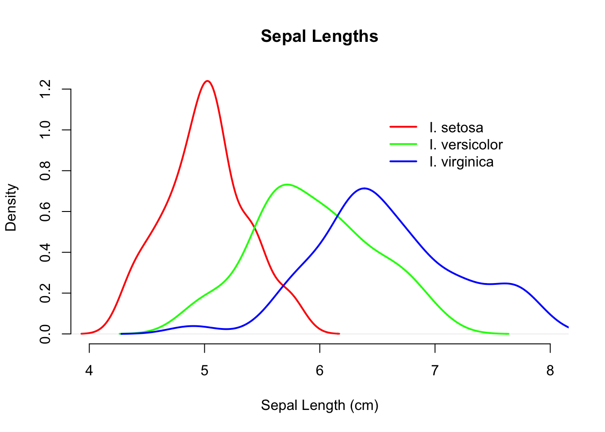
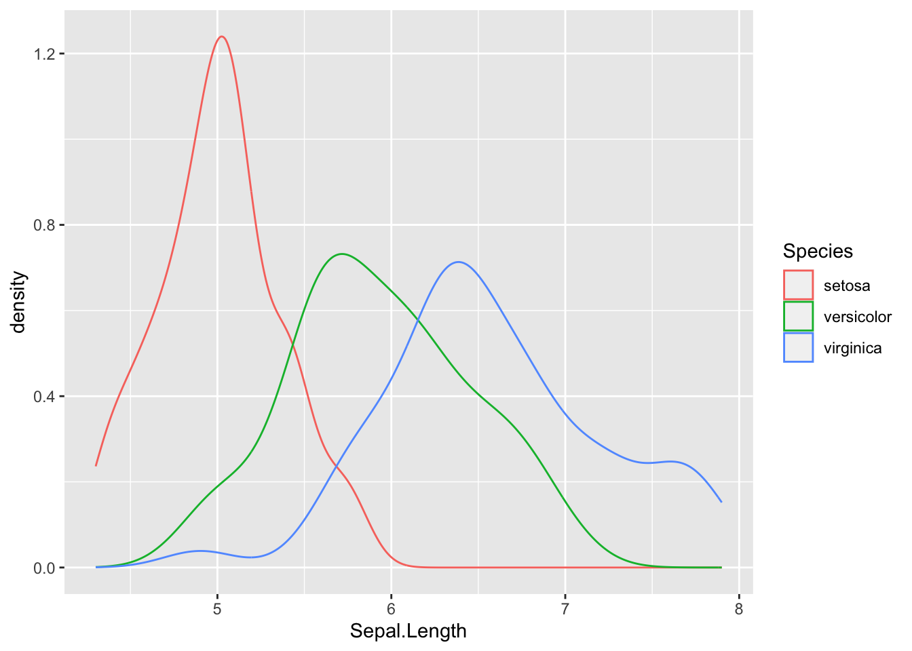

--- 
bookdown::gitbook:
  includes:
      in_header: header.html
---

# Review of R Skills


This part contains two optional vignettes that will help you brush up your basic R programming skills and get a head-start on R graphics.

- [Basic R Programming](#basic-r)
- [R Graphics](#r-graphics)
- [Further R Resources](#resources)


## Basic R Programming {#basic-r}

Rodney Dyer (worked example) and Helene Wagner (adaptation)


### 1. Overview {-}

This worked example is adapted from "Applied Population Genetics" by Rodney Dyer. The entire book is available here: http://dyerlab.github.io/applied_population_genetics/index.html 

R is a statistical programming language, and it thus requires users to work with code. This can be intimidating at first. Working through this document will help you get up to speed with basic R concepts and notation. Whether you are new to R or need a refresher, this worked example will get you to the level expected for the 'Landscape Genetics with R' lab course. The main topics covered here are:

- R data types (how data are stored in R: numeric, character, etc.)
- R containers (how data are organized: vectors, data frames, etc.)
- R functions (how to tell R what to do)

See also video "Week 0: Intro to R Notebooks" for options how to work this this document as .html or .Rmd.

Install packages needed for this worked example. Note: `popgraph` needs to be installed before installing `gstudio`.


``` r
if(!requireNamespace("popgraph", quietly = TRUE))
{
  install.packages(c("RgoogleMaps", "geosphere", "proto", "sampling", 
                      "seqinr", "spacetime", "spdep"), dependencies=TRUE)
  remotes::install_github("dyerlab/popgraph")
}
  
if(!requireNamespace("gstudio", quietly = TRUE)) remotes::install_github("dyerlab/gstudio")
```


### 2. Data Types {-} 

The data we work with comes in many forms—integers, stratum, categories, genotypes, etc.—all of which we need to be able to work with in our analyses. In this chapter, the basic data types we will commonly use in population genetic analyses.  This section covers some of the basic types of data we will use in R.  These include numbers, character, factors, and logical data types.  We will also introduce the locus object from the gstudio library and see how it is just another data type that we can manipulate in R.  

The very first hurdle you need to get over is the oddness in the way in which R assigns values to variables.


``` r
variable <- value
```

Yes that is a less-than and dash character.  This is the assignment operator that historically has been used and it is the one that I will stick with.  In some cases you can use the ‘=' to assign variables instead but then it takes away the R-ness of R itself.  For decision making, the equality operator (e.g., is this equal to that) is the double equals sign ‘=='.  We will get into that below where we talk about logical types and later in decision making.

If you are unaware of what type a particular variable may be, you can always use the `type()` function and R will tell you.


``` r
class( variable )
```

R also has a pretty good help system built into itself.  You can get help for any function by typing a question mark in front of the function name.  This is a particularly awesome features because at the end of the help file, there is often examples of its usage, which are priceless.  Here is the documentation for the ‘help' function as given by:


``` r
?help
```

There are also package vignettes available (for most packages you download) that provide additional information on the routines, data sets, and other items included in these packages. You can get a list of vignettes currently installed on your machine by:


``` r
vignette()
```

and vignettes for a particular package by passing the package name as an argument to the function itself.

#### 2.1. Numeric Data Types {-}

##### a. Numeric data {-}

The quantitative measurements we make are often numeric, in that they can be represented as as a number with a decimal component (think weight, height, latitude, soil moisture, ear wax viscosity, etc.).  The most basic type of data in R, is the numeric type and represents both integers and floating point numbers (n.b., there is a strict integer data type but it is often only needed when interfacing with other C libraries and can for what we are doing be disregarded).  

Assigning a value to a variable is easy


``` r
x <- 3
x
```

```
## [1] 3
```

By default, R automatically outputs whole numbers numbers within decimal values appropriately.


``` r
y <- 22/7
y
```

```
## [1] 3.142857
```

If there is a mix of whole numbers and numbers with decimals together in a container such as


``` r
c(x,y)
```

```
## [1] 3.000000 3.142857
```

then both are shown with decimals. The `c()` part here is a function that combines several data objects together into a vector and is very useful.  In fact, the use of vectors are are central to working in R and functions almost all the functions we use on individual variables can also be applied to vectors.

A word of caution should be made about numeric data types on any computer.  Consider the following example.


``` r
x <- .3 / 3
x
```

```
## [1] 0.1
```

which is exactly what we'd expect.  However, the way in which computers store decimal numbers plays off our notion of significant digits pretty well.  Look what happens when I print out x but carry out the number of decimal places.


``` r
print(x, digits=20)
```

```
## [1] 0.099999999999999991673
```

Not quite 0.1 is it?  Not that far away from it but not exact.  That is a general problem, not one that R has any more claim to than any other language and/or implementation.  Does this matter much, probably not in the realm of the kinds of things we do in population genetics, it is just something that you should be aware of.
You can make random sets of numeric data by using using functions describing various distributions.  For example, some random numbers from the normal distribution are:


``` r
rnorm(10)
```

```
##  [1] -0.79157820  0.64983440 -1.32962235 -0.50246365  1.08349866  0.12816213
##  [7]  0.88600990  0.92590182  0.01727144 -0.51566101
```

from the normal distribution with designated mean and standard deviation:


``` r
rnorm(10,mean=42,sd=12)
```

```
##  [1] 38.58979 38.13407 60.11725 48.01066 42.69456 48.54586 53.59720 45.01358
##  [9] 45.73550 40.32697
```

A poisson distribution with mean 2:


``` r
rpois(10,lambda = 2)
```

```
##  [1] 6 3 2 1 2 5 1 2 1 2
```

and the $\chi^2$ distribution with 1 degree of freedom:


``` r
rchisq(10, df=1)
```

```
##  [1] 0.01094670 0.00732484 0.14994298 2.10658821 0.07749988 0.43336323
##  [7] 3.72981901 1.53207955 0.49904789 0.14133199
```

There are several more distributions that if you need to access random numbers, quantiles, probability densities, and cumulative density values are available.

##### b. Coercion to Numeric {-}

All data types have the potential ability to take another variable and coerce it into their type.  Some combinations make sense, and some do not.  For example, if you load in a CSV data file using read_csv(), and at some point a stray non-numeric character was inserted into one of the cells on your spreadsheet, R will interpret the entire column as a character type rather than as a numeric type.  This can be a very frustrating thing, spreadsheets should generally be considered evil as they do all kinds of stuff behind the scenes and make your life less awesome.

Here is an example of coercion of some data that is initially defined as a set of characters


``` r
x <- c("42","99")
x
```

```
## [1] "42" "99"
```

and is coerced into a numeric type using the as.numeric() function. 


``` r
y <- as.numeric( x )
y
```

```
## [1] 42 99
```


It is a built-in feature of the data types in R that they all have (or should have if someone is producing a new data type and is being courteous to their users) an `as.X()` function.  This is where the data type decides if the values asked to be coerced are reasonable or if you need to be reminded that what you are asking is not possible.  Here is an example where I try to coerce a non-numeric variable into a number.


``` r
x <- "The night is dark and full of terrors..."
as.numeric( x )
```

```
## Warning: NAs introduced by coercion
```

```
## [1] NA
```


By default, the result should be NA (missing data/non-applicable) if you ask for things that are not possible.

#### 2.2. Characters {-}

##### a. Character data {-}

A collection of letters, number, and or punctuation is represented as a character data type.  These are enclosed in either single or double quotes and are considered a single entity.  For example, my name can be represented as:


``` r
prof <- "Rodney J. Dyer"
prof
```

```
## [1] "Rodney J. Dyer"
```

In R, character variables are considered to be a single entity, that is the entire prof variable is a single unit, not a collection of characters.  This is in part due to the way in which vectors of variables are constructed in the language.  For example, if you are looking at the length of the variable I assigned my name to you see


``` r
length(prof)
```

```
## [1] 1
```

which shows that there is only one ‘character' variable.  If, as is often the case, you are interested in knowing how many characters are in the variable prof, then you use the 


``` r
nchar(prof)
```

```
## [1] 14
```


function instead.  This returns the number of characters (even the non-printing ones like tabs and spaces.


``` r
nchar(" \t ")
```

```
## [1] 3
```

As all other data types, you can define a vector of character values using the `c()` function.


``` r
x <- "I am"
y <- "not"
z <- 'a looser'
terms <- c(x,y,z)
terms
```

```
## [1] "I am"     "not"      "a looser"
```

And looking at the `length()` and `nchar()` of this you can see how these operations differ.

``` r
length(terms)
```

```
## [1] 3
```

``` r
nchar(terms)
```

```
## [1] 4 3 8
```


##### b. Concatenation of Characters {-}

Another common use of characters is concatenating them into single sequences.  Here we use the function `paste()` and can set the separators (or characters that are inserted between entities when we collapse vectors).  Here is an example, entirely fictional and only provided for instructional purposes only.


``` r
paste(terms, collapse=" ")
```

```
## [1] "I am not a looser"
```


``` r
paste(x,z)
```

```
## [1] "I am a looser"
```


``` r
paste(x,z,sep=" not ")
```

```
## [1] "I am not a looser"
```

##### c. Coercion to Characters {-}

A character data type is often the most basal type of data you can work with.  For example, consider the case where you have named sample locations.  These can be kept as a character data type or as a factor (see below).  There are benefits and drawbacks to each representation of the same data (see below).  By default (as of the version of R I am currently using when writing this book), if you use a function like read_table() to load in an external file, columns of character data will be treated as factors.  This can be good behavior if all you are doing is loading in data and running an analysis, or it can be a total pain in the backside if you are doing more manipulative analyses.

Here is an example of coercing a numeric type into a character type using the `as.character()` function.  


``` r
x <- 42
x
```

```
## [1] 42
```


``` r
y <- as.character(x)
y
```

```
## [1] "42"
```

#### 2.3. Factors {-}

##### a. Factor vs. Character {-}

A factor is a categorical data type.  If you are coming from SAS, these are class variables.  If you are not, then perhaps you can think of them as mutually exclusive classifications.  For example, an sample may be assigned to one particular locale, one particular region, and one particular species.  Across all the data you may have several species, regions, and locales.  These are finite, and defined, sets of categories. One of the more common headaches encountered by people new to R is working with factor types and trying to add categories that are not already defined.

Since factors are categorical, it is in your best interest to make sure you label them in as descriptive as a fashion as possible.  You are not saving space or cutting down on computational time to take shortcuts and label the locale for Rancho Santa Maria as RSN or pop3d or 5.  Our computers are fast and large enough, and our programmers are cleaver enough, to not have to rename our populations in numeric format to make them work (hello STRUCTURE I'm calling you out here).  The only thing you have to loose by adopting a reasonable naming scheme is confusion in your output.

To define a factor type, you use the function `factor()` and pass it a vector of values.


``` r
region <- c("North","North","South","East","East","South","West","West","West")
region <- factor( region )
region
```

```
## [1] North North South East  East  South West  West  West 
## Levels: East North South West
```


When you print out the values, it shows you all the levels present for the factor.  If you have levels that are not present in your data set, when you define it, you can tell R to consider additional levels of this factor by passing the optional levels= argument as:


``` r
region <- factor( region, levels=c("North","South","East","West","Central"))
region
```

```
## [1] North North South East  East  South West  West  West 
## Levels: North South East West Central
```

If you try to add a data point to a factor list that does not have the factor that you are adding, it will give you an error (or ‘barf' as I like to say).


``` r
region[1] <- "Bob"
```

```
## Warning in `[<-.factor`(`*tmp*`, 1, value = "Bob"): invalid factor level, NA
## generated
```

Now, I have to admit that the Error message in its entirety, with its `“[<-.factor`(`*tmp*`, 1, value = "Bob")"` part is, perhaps, not the most informative.  Agreed.  However, the “invalid factor level" does tell you something useful.  Unfortunately, the programmers that put in the error handling system in R did not quite adhere to the spirit of the “fail loudly" mantra.  It is something you will have to get good at.  Google is your friend, and if you post a questions to (http://stackoverflow.org) or the R user list without doing serious homework, put on your asbestos shorts!

Unfortunately, the error above changed the first element of the region vector to NA (missing data). I'll turn it back before we move too much further.


``` r
region[1] <- "North"
```

Factors in R can be either unordered (as say locale may be since locale A is not `>`, `=`, or `<` locale B) or they may be ordered categories as in `Small < Medium < Large < X-Large`.  When you create the factor, you need to indicate if it is an ordered type (by default it is not).   If the factors are ordered in some way, you can also create an ordination on the data.  If you do not pass a levels= option to the `factors()` function, it will take the order in which they occur in data you pass to it.  If you want to specify an order for the factors specifically, pass the optional `levels=` and they will be ordinated in the order given there.


``` r
region <- factor( region, ordered=TRUE, levels = c("West", "North", "South", "East") )
region
```

```
## [1] North North South East  East  South West  West  West 
## Levels: West < North < South < East
```

##### b. Missing Levels in Factors {-}

There are times when you have a subset of data that do not have all the potential categories. 


``` r
subregion <- region[ 3:9 ]
subregion
```

```
## [1] South East  East  South West  West  West 
## Levels: West < North < South < East
```


``` r
table( subregion )
```

```
## subregion
##  West North South  East 
##     3     0     2     2
```


#### 2.4. Logical Types {-}

A logical type is either TRUE or FALSE, there is no in-between.  It is common to use these types in making decisions (see if-else decisions) to check a specific condition being satisfied.  To define logical variables you can either use the TRUE or FALSE directly


``` r
canThrow <- c(FALSE, TRUE, FALSE, FALSE, FALSE)
canThrow
```

```
## [1] FALSE  TRUE FALSE FALSE FALSE
```

or can implement some logical condition


``` r
stable <- c( "RGIII" == 0, nchar("Marshawn") == 8)
stable
```

```
## [1] FALSE  TRUE
```

on the variables.  Notice here how each of the items is actually evaluated as to determine the truth of each expression.  In the first case, the character is not equal to zero and in the second, the number of characters (what `nchar()` does) is indeed equal to 8 for the character string “Marshawn".

It is common to use logical types to serve as indices for vectors.  Say for example, you have a vector of data that you want to select some subset from.


``` r
data <- rnorm(20)
data
```

```
##  [1] -0.9348844  0.8203106 -1.6352834  0.1502384  0.6057883 -0.4257914
##  [7]  2.1458429 -2.0645585  0.4874247 -0.5602449 -0.6403197 -2.4885485
## [13]  1.3607995 -0.5153664  0.7724645  1.0403607 -0.3148372  0.6555180
## [19] -1.5640644 -0.1097257
```


Perhaps you are on interested in the non-negative values


``` r
data[ data > 0 ]
```

```
## [1] 0.8203106 0.1502384 0.6057883 2.1458429 0.4874247 1.3607995 0.7724645
## [8] 1.0403607 0.6555180
```

If you look at the condition being passed to as the index


``` r
data > 0
```

```
##  [1] FALSE  TRUE FALSE  TRUE  TRUE FALSE  TRUE FALSE  TRUE FALSE FALSE FALSE
## [13]  TRUE FALSE  TRUE  TRUE FALSE  TRUE FALSE FALSE
```

you see that individually, each value in the data vector is being evaluated as a logical value, satisfying the condition that it is strictly greater than zero.  When you pass that as indices to a vector it only shows the indices that are `TRUE`.  

You can coerce a value into a logical if you understand the rules.  Numeric types that equal 0 (zero) are `FALSE`, always.  Any non-zero value is considered `TRUE`.  Here I use the modulus operator, `%%`, which provides the remainder of a division. 


``` r
1:20 %% 2
```

```
##  [1] 1 0 1 0 1 0 1 0 1 0 1 0 1 0 1 0 1 0 1 0
```

which used as indices give us


``` r
data[ (1:20 %% 2) > 0 ]
```

```
##  [1] -0.9348844 -1.6352834  0.6057883  2.1458429  0.4874247 -0.6403197
##  [7]  1.3607995  0.7724645 -0.3148372 -1.5640644
```

You can get as complicated in the creation of indices as you like, even using logical operators such as OR and AND. I leave that as an example for you to play with.  


### 3. Data Containers {-} 

We almost never work with a single datum^[The word *data* is plural, datum is singular], rather we keep lots of data.  Moreover, the kinds of data are often heterogeneous, including categorical (Populations, Regions),  continuous (coordinates, rainfall, elevation), imagry (hyperspectral, LiDAR), and perhaps even genetic.  R has a very rich set of containers into which we can stuff our data as we work with it.  Here these container types are examined and the restrictions and benefits associated with each type are explained.

#### 3.1. Vectors {-}

We have already seen several examples of several vectors in action (see the introduction to Numeric data types for example).  A vector of objects is simply a collection of them, often created using the `c()` function (*c* for combine).  Vectorized data is restricted to having homogeneous data types---you cannot mix character and numeric types in the same vector.  If you try to mix types, R will either coerce your data into a reasonable type


``` r
x <- c(1,2,3)
x
```

```
## [1] 1 2 3
```

``` r
y <- c(TRUE,TRUE,FALSE)
y
```

```
## [1]  TRUE  TRUE FALSE
```

``` r
z <- c("I","am","not","a","looser")
z
```

```
## [1] "I"      "am"     "not"    "a"      "looser"
```


or coearce them into one type that is amenable to all the types of data that you have given it.  In this example, a Logical, Character, Constant, and Function are combined resulting in a vector output of type Character.


``` r
w <- c(TRUE, "1", pi, ls())
w
```

```
##  [1] "TRUE"             "1"                "3.14159265358979" "canThrow"        
##  [5] "data"             "prof"             "region"           "rmd_file"        
##  [9] "stable"           "subregion"        "terms"            "x"               
## [13] "y"                "yml_metadata"     "z"
```

``` r
class(w)
```

```
## [1] "character"
```

Accessing elements within a vector are done using the square bracket `[]` notation.  All indices (for vectors and matrices) start at 1 (not zero as is the case for some languages).  Getting and setting the components within a vector are accomplished using numeric indices with the assignment operators just like we do for variables containing a single value.


``` r
x
```

```
## [1] 1 2 3
```

``` r
x[1] <- 2
x[3] <- 1
x
```

```
## [1] 2 2 1
```

``` r
x[2]
```

```
## [1] 2
```

A common type of vector is that of a sequences.  We use sequences all the time, to iterate through a list, to counting generations, etc.  There are a few ways to generate sequences, depending upon the step sequence.  For a sequence of whole numbers, the easiest is through the use of the colon operator.


``` r
x <- 1:6
x
```

```
## [1] 1 2 3 4 5 6
```

This provides a nice shorthand for getting the values X:Y from X to Y, inclusive.  It is also possible to go backwards using this operator, counting down from X to Y as in:


``` r
x <- 5:2
x
```

```
## [1] 5 4 3 2
```

The only constraint here is that we are limited to a step size of 1.0.  It is possible to use non-integers as the bounds, it will just count up by 1.0 each time.


``` r
x <- 3.2:8.4
x
```

```
## [1] 3.2 4.2 5.2 6.2 7.2 8.2
```

If you are interested in making a sequence with a step other than 1.0, you can use the `seq()` function.  If you do not provide a step value, it defaults to 1.0.


``` r
y <- seq(1,6)
y
```

```
## [1] 1 2 3 4 5 6
```

But if you do, it will use that instead.


``` r
z <- seq(1,20,by=2)
z
```

```
##  [1]  1  3  5  7  9 11 13 15 17 19
```

It is also possible to create a vector of objects as repetitions using the `rep()` (for repeat) function.


``` r
rep("Beetlejuice",3)
```

```
## [1] "Beetlejuice" "Beetlejuice" "Beetlejuice"
```

If you pass a vector of items to `rep()`, it can repeat these as either a vector being repeated (the default value)


``` r
x <- c("No","Free","Lunch")
rep(x,time=3)
```

```
## [1] "No"    "Free"  "Lunch" "No"    "Free"  "Lunch" "No"    "Free"  "Lunch"
```

or as each item in the vector repeated.


``` r
rep(x,each=3)
```

```
## [1] "No"    "No"    "No"    "Free"  "Free"  "Free"  "Lunch" "Lunch" "Lunch"
```


#### 3.2. Matrices {-} 

A matrix is a 2- or higher dimensional container, most commonly used to store numeric data types.  There are some libraries that use matrices in more than two dimensions (rows and columns and sheets), though you will not run across them too often.  Here I restrict myself to only 2-dimensional matrices.

You can define a matrix by giving it a set of values and an indication of the number of rows and columns you want.  The easiest matrix to try is one with empty values:


``` r
matrix(nrow=2, ncol=2)
```

```
##      [,1] [,2]
## [1,]   NA   NA
## [2,]   NA   NA
```

Perhaps more useful is one that is pre-populated with values.


``` r
matrix(1:4, nrow=2 )
```

```
##      [,1] [,2]
## [1,]    1    3
## [2,]    2    4
```

Notice that here, there were four entries and I only specified the number of rows required.  By default the ‘filling-in' of the matrix will proceed down column (*by-column*).  In this example, we have the first column with the first two entries and the last two entries down the second column.  If you want it to fill by row, you can pass the optional argument


``` r
matrix(1:4, nrow=2, byrow=TRUE)
```

```
##      [,1] [,2]
## [1,]    1    2
## [2,]    3    4
```

and it will fill *by-row*.

When filling matrices, the default size and the size of the data being added to the matrix are critical.  For example, I can create a matrix as:


``` r
Y <- matrix(c(1,2,3,4,5,6),ncol=2,byrow=TRUE)
Y
```

```
##      [,1] [,2]
## [1,]    1    2
## [2,]    3    4
## [3,]    5    6
```

or 


``` r
X <- matrix(c(1,2,3,4,5,6),nrow=2)
X
```

```
##      [,1] [,2] [,3]
## [1,]    1    3    5
## [2,]    2    4    6
```

and both produce a similar matrix, only transposed.


``` r
X == t(Y)
```

```
##      [,1] [,2] [,3]
## [1,] TRUE TRUE TRUE
## [2,] TRUE TRUE TRUE
```

In the example above, the number of rows (or columns) was a clean multiple of the number of entries.  However, if it is not, R will fill in values.


``` r
X <- matrix(c(1,2,3,4,5,6),ncol=4, byrow=TRUE)
```

```
## Warning in matrix(c(1, 2, 3, 4, 5, 6), ncol = 4, byrow = TRUE): data length [6]
## is not a sub-multiple or multiple of the number of columns [4]
```

Notice how you get a warning from the interpreter.  But that does not stop it from filling in the remaining slots by starting over in the sequence of numbers you passed to it.


``` r
X
```

```
##      [,1] [,2] [,3] [,4]
## [1,]    1    2    3    4
## [2,]    5    6    1    2
```

The dimensionality of a matrix (and `data.frame` as we will see shortly) is returned by the `dim()` function.  This will provide the number of rows and columns as a vector.


``` r
dim(X)
```

```
## [1] 2 4
```

Accessing elements to retrieve or set their values within a matrix is done using the square brackets just like for a vector but you need to give `[row,col]` indices.  Again, these are 1-based so that 


``` r
X[1,3]
```

```
## [1] 3
```

is the entry in the 1st row and 3rd column.

You can also use ‘slices' through a matrix to get the rows


``` r
X[1,]
```

```
## [1] 1 2 3 4
```

or columns


``` r
X[,3]
```

```
## [1] 3 1
```

of data. Here you just omit the index for the entity you want to span.  Notice that when you grab a slice, even if it is a column, is given as a vector.  


``` r
length(X[,3])
```

```
## [1] 2
```

You can grab a sub-matrix using slices if you give a range (or sequence) of indices.


``` r
X[,2:3]
```

```
##      [,1] [,2]
## [1,]    2    3
## [2,]    6    1
```

If you ask for values from a matrix that exceed its dimensions, R will give you an error.
 

``` r
X[1,8]
```

```
## Error in X[1, 8] : subscript out of bounds
## Calls: <Anonymous> ... handle -> withCallingHandlers -> withVisible -> eval -> eval
## Execution halted
```

There are a few cool extensions of the `rep()` function that can be used to create matrices as well.  They are optional values that can be passed to the function. 

* `times=x`: This is the default option that was occupied by the ‘3' in the example above and represents the number of times that first argument will be repeated.  
* `each=x` This will take each element in the first argument are repeat them `each` times.   
* `length.out=x`: This make the result equal in length to `x`.  

In combination, these can be quite helpful.  Here is an example using numeric sequences in which it is necessary to find the index of all entries in a 3x2 matrix.  To make the indices, I bind two columns together using `cbind()`.  There is a matching row binding function, denoted as `rbind()` (perhaps not so surprisingly).  What is returned is a matrix


``` r
indices <- cbind( rep(1:2, each=3), rep(1:3,times=2), rep(5,length.out=6)  )
indices
```

```
##      [,1] [,2] [,3]
## [1,]    1    1    5
## [2,]    1    2    5
## [3,]    1    3    5
## [4,]    2    1    5
## [5,]    2    2    5
## [6,]    2    3    5
```


#### 3.3. Lists {-}

A list is a type of vector but is indexed by ‘keys' rather than by numeric indices.  Moreover, lists can contain heterogeneous types of data (e.g., values of different `class`), which is not possible in a vector type.  For example, consider the list


``` r
theList <- list( x=seq(2,40, by=2), dog=LETTERS[1:5], hasStyle=logical(5) )
summary(theList)
```

```
##          Length Class  Mode     
## x        20     -none- numeric  
## dog       5     -none- character
## hasStyle  5     -none- logical
```

which is defined with a numeric, a character, and a logical component.  Each of these entries can be different in length as well as type.  Once defined, the entries may be observed as:


``` r
theList
```

```
## $x
##  [1]  2  4  6  8 10 12 14 16 18 20 22 24 26 28 30 32 34 36 38 40
## 
## $dog
## [1] "A" "B" "C" "D" "E"
## 
## $hasStyle
## [1] FALSE FALSE FALSE FALSE FALSE
```

Once created, you can add variables to the list using the $-operator followed by the name of the key for the new entry.


``` r
theList$my_favoriate_number <- 2.9 + 3i
```

or use double brackets and the name of the variable as a character string.


``` r
theList[["lotto numbers"]] <- rpois(7,lambda=42)
```

The keys currently in the list are given by the `names()` function


``` r
names(theList)
```

```
## [1] "x"                   "dog"                 "hasStyle"           
## [4] "my_favoriate_number" "lotto numbers"
```

Getting and setting values within a list are done the same way using either the `$`-operator


``` r
theList$x
```

```
##  [1]  2  4  6  8 10 12 14 16 18 20 22 24 26 28 30 32 34 36 38 40
```

``` r
theList$x[2] <- 42
theList$x
```

```
##  [1]  2 42  6  8 10 12 14 16 18 20 22 24 26 28 30 32 34 36 38 40
```

or the double brackets


``` r
theList[["x"]]
```

```
##  [1]  2 42  6  8 10 12 14 16 18 20 22 24 26 28 30 32 34 36 38 40
```

or using a numeric index, but that numeric index is looks to the results of `names()` to figure out which key to use.


``` r
theList[[2]]
```

```
## [1] "A" "B" "C" "D" "E"
```

The use of the double brackets in essence provides a direct link to the variable in the list whose name is second in the `names()` function (*dog* in this case).  If you want to access elements within that variable, then you add a second set of brackets on after the double ones.  


``` r
theList[[1]][3]
```

```
## [1] 6
```

This deviates from the matrix approach as well as from how we access entries in a `data.frame` (described next).  It is not a single square bracket with two indices, that gives you an error:


``` r
theList[1,3] 
```

```
## Error in theList[1, 3] : incorrect number of dimensions
## Calls: <Anonymous> ... handle -> withCallingHandlers -> withVisible -> eval -> eval
## Execution halted
```

List are rather robust objects that allow you to store a wide variety of data types (including nested lists).  Once you get the indexing scheme down, it they will provide nice solutions for many of your computational needs.

#### 3.4. Data Frames {-}

##### a. Data Frames as spreadsheets {-}

The `data.frame` is the default data container in R.   It is analogous to both a spreadsheet, at least in the way that I have used spreadsheets in the past, as well as a database.  If you consider a single spreadsheet containing measurements and observations from your research, you may have many columns of data, each of which may be a different kind of data.  There may be `factors` representing designations such as species, regions, populations, sex, flower color, etc.  Other columns may contain numeric data types for items such as latitude, longitude, dbh, and nectar sugar content.  You may also have specialized columns such as dates collected, genetic loci, and any other information you may be collecting.  

On a spreadsheet, each column has a unified data type, either quantified with a value or as a missing value, `NA`, in each row.  Rows typically represent the sampling unit, perhaps individual or site, along which all of these various items have been measured or determined.  A `data.frame` is similar to this, at least conceptually.  You define a `data.frame` by designating the columns of data to be used.  You do not need to define all of them, more can be added later.  The values passed can be sequences, collections of values, or computed parameters.  For example:


``` r
df <- data.frame( ID=1:5, Names=c("Bob","Alice","Vicki","John","Sarah"), Score=100 - rpois(5,lambda=10))
df
```

```
##   ID Names Score
## 1  1   Bob    93
## 2  2 Alice    94
## 3  3 Vicki    89
## 4  4  John    91
## 5  5 Sarah    88
```

You can see that each column is a unified type of data and each row is equivalent to a record.  Additional data columns may be added to an existing data.frame as:


``` r
df$Passed_Class <- c(TRUE,TRUE,TRUE,FALSE,TRUE)
```

Since we may have many (thousands?) of rows of observations, a `summary()` of the data.frame can provide a more compact description.


``` r
summary(df)
```

```
##        ID       Names               Score    Passed_Class   
##  Min.   :1   Length:5           Min.   :88   Mode :logical  
##  1st Qu.:2   Class :character   1st Qu.:89   FALSE:1        
##  Median :3   Mode  :character   Median :91   TRUE :4        
##  Mean   :3                      Mean   :91                  
##  3rd Qu.:4                      3rd Qu.:93                  
##  Max.   :5                      Max.   :94
```


We can add columns of data to the data.frame after the fact using the `$`-operator to indicate the column name. Depending upon the data type, the summary will provide an overview of what is there.

##### b. Indexing Data Frames {-}

You can access individual items within a `data.frame` by numeric index such as:


``` r
df[1,3]
```

```
## [1] 93
```

You can slide indices along rows (which return a new `data.frame` for you)


``` r
df[1,]
```

```
##   ID Names Score Passed_Class
## 1  1   Bob    93         TRUE
```

or along columns (which give you a vector of data)


``` r
df[,3]
```

```
## [1] 93 94 89 91 88
```

or use the `$`-operator as you did for the list data type to get direct access to a either all the data or a specific subset therein.


``` r
df$Names[3]
```

```
## [1] "Vicki"
```

Indices are ordered just like for matrices, rows first then columns.  You can also pass a set of indices such as:


``` r
df[1:3,]
```

```
##   ID Names Score Passed_Class
## 1  1   Bob    93         TRUE
## 2  2 Alice    94         TRUE
## 3  3 Vicki    89         TRUE
```

It is also possible to use logical operators as indices.  Here I select only those names in the data.frame whose score was >90 and they passed popgen.


``` r
df$Names[df$Score > 90 & df$Passed_Class==TRUE]
```

```
## [1] "Bob"   "Alice"
```


This is why `data.frame` objects are very database like.  They can contain lots of data and you can extract from them subsets that you need to work on.  This is a VERY important feature, one that is vital for reproducible research.  Keep you data in one and only one place.

### 4. Programming {-} 

One of the strengths of R as an analysis platform is that it is a language rather than a program.  With programs, such as SPSS & JMP, you are limited by the functionality that the designers thought would be necessary to meet the broadest audience.  In R, you can rely upon simple functions or you can create entire analysis and simulation programs de novo.  To do this, we need to dig into flow control and decision making processes, both of which you need for doing more in-depth programming.

#### 4.1. Function Writing {-}

Here we look at how to create an R function.  Writing small functions like this is a huge benefit to you as an analyst and this is a great place to start.  A function in R is defined as:


``` r
function_name <- function( arguments ) { Stuff you want the function to do }
```

You define a function name for whatever you like and assign it the stuff to the right.  In R, the function named `function()` is a special one, it tells R that you are about to create a little routine and you want that set of code to be available to you for later use under the name of whatever you named it.  This allows a tremendous amount of flexibility as you develop your own set of routines and analyses for your work.  The part that actually does stuff is after the function call.  It may be that the function that you create does need some data (those are the arguments) or you may not need any input in to the function (in which you pass no arguments). It all depends upon what you are creating.

The key to understanding functions is that they are encapsulations of code—a shortcut for a sequence of instructions if you will not have to type over and over again.  The less typing you do, the lower the probability that you will have errors (and all code has errors).  

Here is an example of some code that I'm going to develop into a function.  This function will allow me to determine if one genotype could possibly be the offspring of the other genotype.  


``` r
library(gstudio)
loc1 <- locus( c(128,130) )
loc2 <- locus( c(128,128) )
cat( loc1, loc2 )
```

```
## 128:130 128:128
```


We start out with two loci, a `128:130` heterozygote and a `128:128` homozygote.  These may represent repeat motifs at a microsatellite locus or some other co-dominant genotype.  First, I'll break the locus into a vector of genotypes.


``` r
off.alleles <- alleles( loc1 )
off.alleles
```

```
## [1] "128" "130"
```

``` r
mom.alleles <- alleles( loc2 )
mom.alleles
```

```
## [1] "128" "128"
```


To be a valid potential offspring there should be at least one of the alleles in the parent that matches the allele in the offspring.  The `intersect()` function returns the set of values common to both vectors.


``` r
shared <- intersect( off.alleles, mom.alleles )
shared
```

```
## [1] "128"
```


If it has at least one of the alleles present (it could have both if parent and offspring are both the same heterozygote) then you cannot exclude this individual as a potential offspring.  If there are no alleles in common, then the value returned is an empty vector.


``` r
loc3 <- locus( c(132,132))
dad.alleles <- alleles( loc3 )
intersect( mom.alleles, dad.alleles )
```

```
## character(0)
```

This logic can be shoved into a function.  You have to wrap it into a set of curly brackets.  I use the length of the result from the intersect() to return from the function.  Potential values for 


``` r
potential_offspring <- function( parent, offspring ) {
  off <- alleles( offspring )
  par <- alleles( loc2 )
  shared <- intersect( off, par )
  return( length( shared ) > 0 )
}
```
Now, you can call this function anytime you need, just passing it two genotypes.  If they can be offspring it returns TRUE, as in the comparison between 128:130 and 128:128 genotypes.


``` r
potential_offspring(loc1, loc2)
```

```
## [1] TRUE
```
And it returns FALSE for the comparison between 128:128 and 132:132.

``` r
potential_offspring(loc2, loc3)
```

```
## [1] FALSE
```

#### 4.2. Variable Scope {-}

There is a lot more information on writing functions and we will get into that as we progress through the text.  However, it is important that I bring this up now.  The value assigned to a variable is defined by its scope.  Consider the following code

``` r
x <- 10
```

and the function defined as 


``` r
do_it <- function( x ) {
  x <- x + 10
  return( x )
}
```

When I call the function, the variable x that is the argument of the function is not the same variable that is in the environment that I assigned a value of 10.  The x in the function argument is what we call “local to that function" in that within the curly brackets that follow (and any number of curly brackets nested within those, the value of x is given whatever was passed to the function.

#### 4.3. Decision Making {-}

We interact with our data in many ways and introspection of the values we have in the variables we are working with are of prime importance.  Decision making in your code is where you evaluate your data and make a choice of outcomes based upon some criteria.  Here is some example data that we can use as we explore the basics of `if()`, `if(){} else{}`, and `if(){} elif(){} else{}` coding patterns.

##### a. The if Pattern {-}  

The most basic version of decision making is asking a single question and if the answer is TRUE then do something.  The `if(){}` function does this and has the form


``` r
if( CRITERIA ) {
	DO_SOMETHING
}
```

You pass a logical statement (or something that can be coerced into a logical type) to the function as the CRITERIA and if it evaluates to `TRUE`, then the contents of the `DO_SOMETHING` are executed.  If the value of `CRITERIA` is not `TRUE` the `DO_SOMETHING` is skipped entirely—it is not even seen by the interpreter.  

Here we can test this out using the loci defined above along with the is_heterozygote() function.  This function takes one or more locus objects and returns TRUE/FALSE if they are or are not a heterozygote.


``` r
is_heterozygote( c(loc1, loc2) )
```

```
## [1]  TRUE FALSE
```

If we shove that function into the `if()` parameters we can use its evaluation of the heterozygous state of the locus to do something interesting, say tell us it is a heterozygote—it is admittedly a contrived example, but hey you try to make easy examples, it is not easy.


``` r
if( is_heterozygote(loc1) ){
  print("It's a het!")
}
```

```
## [1] "It's a het!"
```

If the `is_heterozygote()` function returns a value of FALSE, then the contents of the `if()` function (the stuff within the curly brackets is skipped entirely.


``` r
if( is_heterozygote(loc2) ){
  print("It's a het!")
}
```

Notice, there was no indication of any of that code inside the curly brackets.
The if-else Pattern
If there are more than on thing you want to potentially do when making a decision, you can add an else clause after the if pattern.  Here if is_heterozygote() returns FALSE, the contents of the else{} clause will be executed.  Here is the heterozygote example


``` r
if( is_heterozygote(loc1) ) {
  cat(loc1, "is a heterozygote")
} else {
  cat(loc1, "is a homozygote")
}
```

```
## 128:130 is a heterozygote
```

and the homozygote one


``` r
if( is_heterozygote(loc2) ) {
  cat(loc2, "is a heterozygote")
} else {
  cat(loc2, "is a homozygote")
}
```

```
## 128:128 is a homozygote
```

There is a slightly shorter version of this that is available for the lazy programmer and lets be honest, all programmers are lazy and the more you can accomplish with fewer strokes on the keyboard the better (this is how we got emacs and vim).  I generally don't teach the shortcuts up front, but this one is short and readily apparent so it may be more helpful than confusing.  The `ifelse()` function has three parts, the condition, the result if `TRUE`, and the result if `FALSE`.


``` r
ans <- ifelse( is_heterozygote( c(loc1, loc2)) , "heterozygote", "Not")
ans
```

```
## [1] "heterozygote" "Not"
```

So iterating through the x vector, the condition `x>0` is evaluated and if TRUE the sqrt() of the value is returned, else the NA is given. It is compact and easy to use so you may run into it often.

##### b. The `if-else` Pattern {-}

It is possible to test many conditions in a single sequence by stringing together else-if conditions.  The point that is important here is that the first condition that evaluates to TRUE will be executed and all remaining ones will be skipped, even if they also are logically TRUE.  This means that it is important to figure out the proper order of asking your conditions.  Here is an example function that determines if none, one, or both of the genotypes passed to it are heterozygotes.  By default, I step through every one of the potential options of available on this comparison.    
1. The first is a heterozygote and the second one isn't
2. The first one isn't and the second one is
3. Both are heterozygotes
4. The last state (both are not) 

Here is the function.


``` r
which_is_het <- function( A, B) {
  if( is_heterozygote(A) & !is_heterozygote(B) ) {
    print("First is heterozygote")
  } else if( !is_heterozygote(A) & is_heterozygote(B) ){
    print("Second is heterozygote")
  } else if( is_heterozygote(A) & is_heterozygote(B) ){
    print("Both are heterozygotes")
  } else {
    print( "Neither are heterozygotes")
  }
}
```

It is possible that the order of these CRITERIA could be changed, the important thing to remember is that the sequence of if - else if - else if etc. will terminate the very first time one of the CRITERIA is evaluated to be `TRUE`.

#### 4.4. Flow Control {-}

Flow control is the process of iterating across objects and perhaps doing operations on those objects.  The R language has several mechanisms that you can use to control the flow of a script or bit of code.  

##### a. The `for()` Loop {-}


``` r
x <- c(3,8,5,4,6)
x
```

```
## [1] 3 8 5 4 6
```

You can iterate through this vector using a for() loop.  This is a simple function that has the form:


``` r
for( SOME_SEQUENCE ){
  DO_SOMETHING
}
```


Where the `SOME_SEQUENCE` component is a sequence of values either specified OR calculated and the `DO_SOMETHING` is the thing you want to do with each of the values in the sequence.  Usually, there is a variable defined in the `SOME_SEQUENCE` component and the value of that variable is used.  Here are a few examples. The first goes through the existing vector directly and assigns (in sequential order) the entries of ‘x' to the variable val. We can then do whatever we want with the value in val (though if we change it, nothing happens to the original x vector).


``` r
for( val in x ){
  print(val)
}
```

```
## [1] 3
## [1] 8
## [1] 5
## [1] 4
## [1] 6
```

We can also specify a sequence directly and then use it as an index.  Here I use an index variable named i to take on the integer seqeunce equal in length to the length of the original `x` variable.  Then I can iterate through the original vector and use that index variable to grab the value I want.


``` r
for( i in 1:length(x)){
  print( x[i] )
}
```

```
## [1] 3
## [1] 8
## [1] 5
## [1] 4
## [1] 6
```


Both give us the same output, namely a way to go through the variable `x`. However, there may be a need to use the latter approach in your calculations.  For example, perhaps I want to do some other operation on the values.  In this very contrived example that follows, I want to perform operations on the values in `x` depending on if they are even or odd.  For the odd ones, I add the corresponding value in `y` and if not I subtract it.  Sure, this is totally contrived and I cannot think of a reason why I would be doing this, but if I need to know what index (row, column or whatever) an entry is during the iteration process, then I need to use this approach over the `for( val in x)` approach.


``` r
y <- 1:5
for( i in 1:length(x)){
  if( x[i] %% 2)
    print( x[i] + y[i])
  else
    print( x[i] - y[i] )
}
```

```
## [1] 4
## [1] 6
## [1] 8
## [1] 0
## [1] 1
```

##### b. Short Circuiting the Loop {-}

It is possible to short circuit the looping process using the keywords next and break, though in my programming style, I consider their use in my source files as evidence of inelegant code.  That said, you may need them on occasion.  

The next keyword basically stops all commands after that during the current iteration of the loop.  It does not terminate the loop itself, it just stops the commands that follow it this time through.  Here is an example that uses the modulus operator, `%%` (e.g., the remainder after division), to print out only those numbers that are divisible by three.


``` r
for( i in 1:20 ){
  if( i %% 3 )
    next
  cat("The value of i =",i,"\n")
}
```

```
## The value of i = 3 
## The value of i = 6 
## The value of i = 9 
## The value of i = 12 
## The value of i = 15 
## The value of i = 18
```

The use of break to exit the loop entirely is perhaps more commonly encountered.  When this keyword is encountered, the loop terminates immediately, as if it reached the send of the sequence.  


``` r
for( i in 1:10){
  if( i > 2 )
    break
  cat("The value of i=",i,"\n")
}
```

```
## The value of i= 1 
## The value of i= 2
```


## R Graphics {#r-graphics}

Rodney Dyer (worked example) and Helene Wagner (adaptation)


### 1. Overview {-} 

This worked example is adapted from "Applied Population Genetics" by Rodney Dyer. The entire book is available here: http://dyerlab.github.io/applied_population_genetics/index.html 

One of the most critical features of data analysis is the ability to present your results in a logical and meaningful fashion.  R has built-in functions that can provide you graphical output that will suffice for your understanding and interpretations.  However, there are also third-party packages that make some truly beautiful output.  In this section, both built-in graphics and graphical output from the ggplot2 library are explained and highlighted.  

We are going to use the venerable iris dataset that was used by Anderson (1935) and Fisher (1936). These data are measurements of four morphological variables (Sepal Length, Sepal Width, Petal Length, and Petal Width) measured on fifty individual iris plants from three recognized species.  Here is a summary of this data set.


``` r
summary(iris)
```

```
##   Sepal.Length    Sepal.Width     Petal.Length    Petal.Width   
##  Min.   :4.300   Min.   :2.000   Min.   :1.000   Min.   :0.100  
##  1st Qu.:5.100   1st Qu.:2.800   1st Qu.:1.600   1st Qu.:0.300  
##  Median :5.800   Median :3.000   Median :4.350   Median :1.300  
##  Mean   :5.843   Mean   :3.057   Mean   :3.758   Mean   :1.199  
##  3rd Qu.:6.400   3rd Qu.:3.300   3rd Qu.:5.100   3rd Qu.:1.800  
##  Max.   :7.900   Max.   :4.400   Max.   :6.900   Max.   :2.500  
##        Species  
##  setosa    :50  
##  versicolor:50  
##  virginica :50  
##                 
##                 
## 
```

I will also provide examples using two different plotting approaches. R has a robust set of built-in graphical routines that you can use.  However, the development community has also provided several additional graphics libraries available for creating output.  The one I prefer is `ggplot2` written by Hadley Wickham.  His approach in designing this library a philosophy of graphics depicted in Leland Wilkson's (2005) book *The Grammar of Graphics*. As I understand it, the idea is that a graphical display consists of several layers of information. These layers may include:

* The underlying data.  
* Mapping of the data onto one or more axes.  
* Geometric representations of data as points, lines, and/or areas.  
* Transformations of the axes into different coordinate spaces (e.g., cartesian, polar, etc.) or the data onto different scales (e.g., logrithmic)  
* Specification of subplots.

In the normal plotting routines discussed before, configuration of these layers were specified as arguments passed to the plotting function (`plot()`, `boxplot()`, etc.). The ggplot2 library takes a different approach, allowing you to specify these components separately and literally add them together like components of a linear model.

Required packages:


``` r
library(ggplot2)
library(RColorBrewer)
```

### 2. Univariate plots {-}

#### 2.1. Barplots and histograms {-}

Univariate data can represent either counts (e.g., integers) of items or vectors of data that have decimal components (e.g., frequency distributions, etc.).  If the sampling units are discrete, then a the `barplot()` function can make a nice visual representation.  Here is an example using some fictions data.


``` r
x <- c(2, 3, 6, 3, 2, 4)
names(x) <- c("Bob", "Alice", "Jane", "Fred", "Barney", "Lucy")
x
```

```
##    Bob  Alice   Jane   Fred Barney   Lucy 
##      2      3      6      3      2      4
```

From this, a barplot can be constructed where the x-axis has discrete entities for each name and the y-axis represents the magnitude of whatever it is we are measuring.


``` r
barplot(x, xlab = "People", ylab = "Thinn-A-Ma-Jigs")
```


Notice here that I included labels for both the x- and y-axes.  You do this by inserting these arguments into the parameters passed to the `barplot()` (it is the same for all built-in plotting as we will see below).

To use `ggplot` for displaying this, you have to present the data in a slightly different way.  There are shortcuts using the `qplot()` function but I prefer to use the more verbose approach.  Here is how we would plot the same output using ggplot.


``` r
library(ggplot2)
df <- data.frame(Thinn_A_Ma_Jigs=x,names=names(x))
ggplot( df, aes(x=names,y=Thinn_A_Ma_Jigs)) + geom_bar(stat="identity")
```


There are a couple of things to point out about this.   

1. This is a compound statement, the plotting commands are literally 'added together'.
2. The `ggplot()` function specifies a `data.frame` from which your data will be extracted.
3. The `aes()` component within the `ggplot()` function describes the aesthetics of the plot.  This is how you designate which variable columns in the `data.frame` will be on the x- and y- axes, colors, plot shapes, categories, etc.
4. To the basic description of the data and aesthetics, a geometry is added, that of a barplot.  If necessary, you can pass additional information to the `geom_bar()` function.  In this case, I had to tell it that you use the raw data `stat='identity'` instead of trying to summarize many observations.  
5. The axis labels are taken directly from the names of the columns in the `data.frame`.

If the data on the x-axis is not discrete but measured on a single variable, then the `hist()` function can take the data and categorize it into groups based upon the density of the underlying data.


``` r
h <- hist(iris$Sepal.Length)
```


The `hist()` function itself returns a bit of information that may be of interest.  It is not necessary that you capture these data, R will ignore it if you do not assign it to a variable.  What is of interest though is that it returns a `list()` object with the following keys:


``` r
names(h)
```

```
## [1] "breaks"   "counts"   "density"  "mids"     "xname"    "equidist"
```

The data within these keys can be accessed directly as:


``` r
h
```

```
## $breaks
## [1] 4.0 4.5 5.0 5.5 6.0 6.5 7.0 7.5 8.0
## 
## $counts
## [1]  5 27 27 30 31 18  6  6
## 
## $density
## [1] 0.06666667 0.36000000 0.36000000 0.40000000 0.41333333 0.24000000 0.08000000
## [8] 0.08000000
## 
## $mids
## [1] 4.25 4.75 5.25 5.75 6.25 6.75 7.25 7.75
## 
## $xname
## [1] "iris$Sepal.Length"
## 
## $equidist
## [1] TRUE
## 
## attr(,"class")
## [1] "histogram"
```

and provide the basic information on how to construct the histogram as shown below.  The values defined for the break locations for each of the bars and the midpoints are the default ones for the `hist()` function.  If you wish, you can provide the number of breaks in the data, the location of the breaks, including the lowest and highest terms, plot as a count versus a frequency, etc.  

The corresponding `ggplot` approach is


``` r
ggplot( iris, aes(x=Sepal.Length)) + geom_bar()
```


which also takes a few liberties with the default binning parameters.  

By default, both the R and `ggplot` approches make a stab at creating enough of the meta data around the plot to make it somewhat useful.  However, it is helpful if we add a bit to that and create graphics that suck just a little bit less. There are many options that we can add to the standard plot command to make it more informative and/or appropriate for your use.  The most common ones include:

* `xlab` Change the label on the x-axis  
* `ylab` Change the lable on the y-axis 
* `main` Change the title of the graph
* `col` Either a single value, or a vector of values, indicating the color to be plot.
* `xlim/ylim` The limits for the x- and y-axes.

Additional options are given in tabular form in the next section.  

Here is another plot of the same data but spiffied up a bit. 


``` r
x <- hist( iris$Sepal.Length,xlab="Sepal Length (cm)", 
           ylab="Count", main="", col="lightblue")
```


A few things to notice:

1. The main title over the top of the image was visually removed by assigning an empty characters string to it.   
2. The color parameter refers to the fill color of the bars, not the border color.

In `ggplot` we add those additional components either to the geometry where it is defined (e.g., the color in the geom_bar) or to the overall plot (as in the addition of labels on the axes).


``` r
ggplot( iris, aes(x=Sepal.Length)) + geom_bar(fill="lightblue") + 
  xlab("Sepal Length (cm)") + ylab("Count")
```


#### 2.2. Plotting Parameters {-}

There are several parameters common to the various plotting functions used in the basic R plotting functions.  Here is a short table of the most commonly used ones.

Command  |  Usage           | Description
---------|------------------|-------------------------------------------------
bg       | bg="white"       | Sets the background color for the entire figure.
bty      | bty="n"	        | Sets the style of the box type around the graph. Useful values are "o" for complete box (the default), "l", "7", "c", "u", "]" which will make a box with sides around the plot area resembling the upper case version of these letters, and "n" for no box.
cex      | cex=2            | Magnifies the default font size by the corresponding factor.
cex.axis | cex.axis=2       | Magnifies the font size on the axes.
col      | col="blue"       | Sets the plot color for the points, lines, etc.
fg       | fg="blue"        | Sets the foreground color for the image.
lty      | lty=1            | Sets the type of line as 0-none, 1-solid, 2-dashed, 3-dotted, etc.
lwd      | lwd=3            | Specifies the width of the line.
main     | main="title"     | Sets the title to be displayed over the top of the graph.
mfrow    | mfrow=c(2,2)     | Creates a ‘matrix' of plots in a single figure.
pch      | pch=16	          | Sets the type of symbol to be used in a scatter plot.
sub      | sub="subtitle"   | Sets the subtitle under the main title on the graph.
type     | type="l"         | Specifies the type of the graph to be shown using a generic plot() command.  Types are “p" for points (default), “l" for lines, and “b" for both.
xlab     | xlab="Size (m)"  | Sets the label attached to the x-axis.
ylab     | ylab="Frequency" | Sets the label attached to the y-axis.


#### 2.3. Density Plots {-}

Another way of looking at the distribution of univariate data is through the use of the `density()` function. This function takes a vector of values and creates a probability density function of it returning an object of class "density". 


``` r
d <- density( iris$Sepal.Length) 
attributes(d)
```

```
## $names
## [1] "x"          "y"          "bw"         "n"          "old.coords"
## [6] "call"       "data.name"  "has.na"    
## 
## $class
## [1] "density"
```

The `density()` function takes the univariate data and fits its density (internally represented by `d$y`) along the range of values (in `d$x`).

A plot can be produced using d as the variables as follows (with a bit of extra plotting parameters as depicted in the previous table).


``` r
plot( d, col = "red", lwd = 2, 
      xlab = "Value of X", ylab = "Frequency", 
      bty = "n", main = "Density Plot")
```


The corresponding `ggplot` approach is:


``` r
ggplot( iris, aes(x=Sepal.Length)) + geom_density()
```


### 3. Bivariate plots {-}

#### 3.1. Overlaying Plots by grouping {-}

The data in the previous density plot represents the sepal lengths across all three iris species.  It may be more useful to plot them as the density of each species instead of combined.  Overlaying plots is a pretty easy feature built into the default R plotting functionalities.

Lets look at the data and see if the mean length differs across species. I do this using the `by()` command, which takes three parameters; the first parameter is the raw data you want to examine, the second one is the way you would like to partition that data, and the third one is the function you want to call on those groupings of raw data.  This general form


``` r
by( data, grouping, function )
```

mixing both data and functions to be used, is pretty common in R and you will see it over and over again.  The generic call below asks to take the sepal data and partition it by species and estimate the mean.


``` r
by( iris$Sepal.Length, iris$Species, mean)
```

```
## iris$Species: setosa
## [1] 5.006
## ------------------------------------------------------------ 
## iris$Species: versicolor
## [1] 5.936
## ------------------------------------------------------------ 
## iris$Species: virginica
## [1] 6.588
```

So there may be differences.  Lets pull the data out and create density plots for each.


``` r
d.setosa <- iris$Sepal.Length[ iris$Species=="setosa" ]
d.versicolor <- iris$Sepal.Length[ iris$Species=="versicolor" ]
d.virginica <- iris$Sepal.Length[ iris$Species=="virginica" ]
d.se <- density( d.setosa )
d.ve <- density( d.versicolor )
d.vi <- density( d.virginica )
```

I can now plot the densities independently.  After the first `plot()` function is called, you can add to it by using `lines()` or `points()` function calls.  They will overlay the subsequent plots over the first one.  One of the things you need to be careful of is that you need to make sure the x- and y-axes are properly scaled so that subsequent calls to `points()` or `lines()` does not plot stuff outside the boundaries of your initial plot.

Here I plot the setosa data first, specify the `xlim` (limits of the x-axis), set the color, and labels.  On subsequent plotting calls, I do not specify labels but set alternative colors.  Then a nice legend is placed on the graph, the coordinates of which are specified on the values of the x- and y-axis (I also dislike the boxes around graphic so I remove them as well with `bty="n"`).


``` r
plot(d.se,xlim=c(4,8),col="red", lwd=2, bty="n", 
     xlab="Sepal Length (cm)", main="Sepal Lengths")
lines( d.ve, xlim=c(4,8), col="green",lwd=2, bty="n")
lines( d.vi, xlim=c(4,8), col="blue", lwd=2, bty="n")
legend( 6.5,1.1,c("I. setosa", "I. versicolor", "I. virginica"), 
        col=c("red","green","blue"), lwd=2,bty="n")
```



A lot of that background material is unnecessary using `geom_density()` because we can specify to the plotting commands that the data are partitioned by the values contained in the `Species` column of the `data.frame`. This allows us to make this plot


``` r
ggplot(iris, aes(Sepal.Length,color=Species)) + geom_density()
```



or a correpsonding one using `fill=Species` instead (I set the alpha transparency to allow you to see the plots in the background).


``` r
ggplot(iris, aes(Sepal.Length,fill=Species)) + geom_density( alpha=0.8)
```


We can use the `barplot()` function here as well and either stack or stagger the density of sepal lengths using discrete bars.   

Here I make a matrix of bins using the `hist()` function with a specified set of breaks and then use it to plot discrete bin counts using the `barplot()` function.  I include this example here because there are times when you want to produce a stacked bar plot (rarely) or a staggered barplot (more common) for some univariate data source and I always forget how to specifically do that.


``` r
breaks <- seq(4,8,by=0.2)
h.se <- hist(d.setosa, breaks=breaks, plot = FALSE)
h.ve <- hist(d.versicolor, breaks=breaks, plot=FALSE)
h.vi <- hist(d.virginica, breaks=breaks, plot=FALSE)
vals <- rbind( h.se$counts, h.ve$counts, h.vi$counts )
rownames(vals) <- levels(iris$Species)
colnames(vals) <- breaks[1:20]
vals
```

```
##            4 4.2 4.4 4.6 4.8  5 5.2 5.4 5.6 5.8 6 6.2 6.4 6.6 6.8 7 7.2 7.4 7.6
## setosa     0   4   5   7  12 11   6   2   3   0 0   0   0   0   0 0   0   0   0
## versicolor 0   0   0   0   3  2   1  10   8   6 6   5   3   4   2 0   0   0   0
## virginica  0   0   0   0   1  0   0   1   4   3 4  11   4   7   3 4   2   1   4
##            7.8
## setosa       0
## versicolor   0
## virginica    1
```

The matrix of data 


``` r
barplot(vals,xlab="Sepal Length", ylab="Frequency")
```


Stacked barplots may or may not be that informative, depending upon the complexity of your underlying data.  It is helpful though to be able to stagger them.  In the basic `barplot()` function allows you to specify the bars to be spaced beside each other as:


``` r
barplot(vals,xlab="Sepal Length", ylab="Frequency", col=c("red","green","blue"), beside=TRUE)
legend(60, 10, c("I. setosa", "I. versicolor", "I. virginica"), fill = c("red", "green", "blue"), bty="n")
```


For plotting onto a barplot object, the x-axis number is not based upon the labels on the x-axis. It is an integer that relates to the number of bar-widths and separations. In this example, there are three bars for each category plus one separator (e.g., the area between two categories). So I had to plot the legend at 60 units on the x-coordinate, which puts it just after the 15th category (e.g., 15*4=60).


We can do the same thing with `geom_histogram()`, though again with a bit less typing involved.  Here is the raw plot (which by default stacks just like in the `barplot()` example)


``` r
ggplot( iris, aes(x=Sepal.Length, fill=Species)) + geom_histogram()
```

```
## `stat_bin()` using `bins = 30`. Pick better value `binwidth`.
```


and the correspondingly staggered plot with bars positioned next to eachother.


``` r
ggplot( iris, aes(x=Sepal.Length, fill=Species)) + geom_histogram(position="dodge")
```

```
## `stat_bin()` using `bins = 30`. Pick better value `binwidth`.
```


Notice how we add the fill color to the `aes()` function because the categories for assigning colors will be extracted from the `data.frame`, whereas when we just wanted to set them all light blue, the color is specified outside the `aes()` function.  Also notice when we specify something to the `aes()` command in this way, we do not quote the name of the column, we call it just as if it were a normal variable.


#### 3.2. Boxplots {-}

Boxplots are a display of distributions of continuous data within categories, much like what we displayed in the previous staggered barplot.  It is often the case that boxplots depict differences in mean values while giving some indication of the dispersal around that mean.  This can be done in the staggered barplot as above but not quite as specifically.

The default display for boxplots in R provides the requires a factor and a numeric data type.  The factor will be used as the categories for the x-axis on which the following visual components will be displayed:

* The median of the data for each factor,  
* An optional 5% confidence interval (shown by passing notch=TRUE) around the mean.
* The inner 50th percentile of the data,  
* Outlier data points.

Here is how the sepal length can be plot as a function of the Iris species.


``` r
boxplot(Sepal.Length ~ Species, data=iris, notch=TRUE, 
        xlab="Species", ylab="Sepal Length (cm)", 
        frame.plot=FALSE)
```


A couple of things should be noted on this plot call.  First, I used a ‘functional' form for the relationship between the continuous variable (`Sepal.Length`) and the factor (`Species`) with the response variable indicated on the left side of the tilde and the predictor variables on the right side.  It is just as reasonable to use `boxplot(Species,Sepal.Length, ...)` in the call as x- and y- variables in the first two positions.  However, it reads a bit better to do it as a function, like a regression.  Also, it should be noted that I added the optional term, `data=iris`, to the call.  This allowed me to reference the columns in the iris data.frame without the dollar sign notation.  Without that I would have had to write `boxplot( data$Sepal.Length ~ data$Species, ...)`, a much more verbose way of doing it but most programmers are relatively lazy and anything they can do to get more functionality out of less typing...  Finally, I set `frame.plot=FALSE` to remove the box around the plot since the `bty="n"` does not work on boxplots (big shout out for consistency!).  I don't know why these are different, I just hate the box.

The corresponding `ggplot` approach is the same as the `boxplot()` one, we just have to specify the `notch=TRUE` in the `geom_boxplot()` function.


``` r
ggplot(iris, aes(x=Species, y=Sepal.Length)) + 
  geom_boxplot(notch = TRUE) + 
  xlab("Iris Species") + ylab("Sepal Width (cm)")
```


#### 3.3. Scatter Plots {-}

With two sets of continuous data, we can produce scatter plots.  These consist of 2- (or 3-) coordinates where we can plot our data.  With the addition of alternative colors (`col=`) and/or plot shapes (`pch=`) passed to the generic plot() command, we can make really informative graphical output. Here I plot two characteristics of the iris data set, sepal length and width, and use the species to indicate alternative symbols.


``` r
plot( iris$Sepal.Length, iris$Sepal.Width, 
      pch=as.numeric(iris$Species), bty="n", 
      xlab="Sepal Length (cm)", ylab="Sepal Width (cm)")
legend( 6.75, 4.3, c("I. setosa", "I. versicolor", "I. virginica"), 
        pch=1:3, bty="n")
```


The call to `pch=` that I used coerced a factor into a numeric data type.  By default, this will create a numeric sequence (starting at 1) for all levels of the factor, including ones that may not be in the data you are doing the conversion on.  The parameter passed to `pch` is an integer that determines the shape of the symbol being plot. I typically forget which numbers correspond to which symbols (there are 25 of them in total ) and have to look them up when I need them.  One of the easiest ways is just to plot them as:


``` r
plot(1:25,1:25,pch=1:25, bty="n", xlab="pch", ylab="pch")
```


which produces the following figure where you can choose the appropriate symbols for your plotting needs.

A scatter plot in `ggplot` is created using the `geom_point()` layer.


``` r
ggplot(iris,aes(x=Sepal.Length,y=Sepal.Width, shape=Species)) + geom_point()
```


and the shapes are specified automatically.

### 4. Advanced plotting {-}

#### 4.1. Multiple Plots {-}

The last figure was a bit confusing.  You can see a few points where the three species have the same measurements for both sepal length and width—both *I. versicolor* and *I. virginica* have examples with sepal widths of 3.0cm and lengths of 6.7cm.  For some of these it would be difficult to determine using a graphical output like this if there were more overlap.  In this case, it may be a more informative approach to make plots for each species rather than using different symbols.  

In `ggplot`, there is a facet geometry that can be added to a plot that can pull apart the individual species plots (in this case) and plot them either next to each other (if you are looking at y-axis differences), on top of each other (for x-axis comparisons), or as a grid (for both x- and y- axis comparisons).  This layer is added to the plot using `facet_grid()` and take a functional argument (as I used for the boxplot example above) on which factors will define rows and columns of plots.  Here is an example where I stack plots by species.


``` r
ggplot( iris, aes(x=Sepal.Width, y=Sepal.Length ) ) + 
  geom_point() + facet_grid(Species~.) + 
  xlab("Sepal Width (cm)") + ylab("Sepal Length")
```


The `Species ~ .` means that the rows will be defined by the levels indicatd in `iris$Species` and all the plotting (the period part) will be done as columns.  If you have more than one factor, you can specify `RowFactor ~ ColumnFactor` and it will make the corresponding grid. 

I would argue that this is a much more intuitive display of differences in width than the previous plot.

You can achieve a similar effect using built-in plotting functions as well.  To do this, we need to mess around a bit with the plotting attributes.  These are default parameters (hence the name `par`) for plotting that are used each time we make a new graphic.  Here are all of them (consult with the previous Table for some of the meanings).


``` r
names( par() )
```

```
##  [1] "xlog"      "ylog"      "adj"       "ann"       "ask"       "bg"       
##  [7] "bty"       "cex"       "cex.axis"  "cex.lab"   "cex.main"  "cex.sub"  
## [13] "cin"       "col"       "col.axis"  "col.lab"   "col.main"  "col.sub"  
## [19] "cra"       "crt"       "csi"       "cxy"       "din"       "err"      
## [25] "family"    "fg"        "fig"       "fin"       "font"      "font.axis"
## [31] "font.lab"  "font.main" "font.sub"  "lab"       "las"       "lend"     
## [37] "lheight"   "ljoin"     "lmitre"    "lty"       "lwd"       "mai"      
## [43] "mar"       "mex"       "mfcol"     "mfg"       "mfrow"     "mgp"      
## [49] "mkh"       "new"       "oma"       "omd"       "omi"       "page"     
## [55] "pch"       "pin"       "plt"       "ps"        "pty"       "smo"      
## [61] "srt"       "tck"       "tcl"       "usr"       "xaxp"      "xaxs"     
## [67] "xaxt"      "xpd"       "yaxp"      "yaxs"      "yaxt"      "ylbias"
```

To create multiple plots on one graphic, we need to modify either the mfrow or mfcol property (either will do).  They represent the number of figures to plot as a 2-integer vector for rows and columns.  By default, it is set to


``` r
par()$mfrow
```

```
## [1] 1 1
```

because there is only 1 row and 1 column in the plot.  To change this, we simply pass a new value to the `par()` command and then do the plotting.  In the following example, I plot the results of a linear model (`lm()`) function call. This returns four plots looking at the normality of the data, residuals, etc.  This time, instead of seeing them one at a time, I'm going to plot all four into one figure.


``` r
par(mfrow=c(2,2))
plot( lm( Sepal.Length ~ Sepal.Width, data=iris))
```


#### 4.2. Color Palettes {-}

The default plotting colors in R are black and white.  However, there is a rich set of colors available for your plotting needs.  The easiest set are named colors.  At the time of this writing, there are 


``` r
length(colors())
```

```
## [1] 657
```

different colors available for your use. Not all are distinct as some overlap.  However the benefit of these colors is that they have specific names, making it easier for you to remember than RGB or hex representations.  Here are a random set of 20 color names.


``` r
colors()[ sample.int( length(colors()), size=20) ]
```

```
##  [1] "gray75"         "orchid4"        "grey62"         "khaki1"        
##  [5] "darkslategray2" "gray61"         "grey39"         "gray45"        
##  [9] "gray43"         "grey94"         "darkcyan"       "grey58"        
## [13] "plum1"          "deepskyblue1"   "grey40"         "indianred3"    
## [17] "ivory1"         "darkslategray4" "burlywood2"     "darkseagreen3"
```

To use these colors you can call them by name in the col= option to a plot.  Here is an example where I define three named colors and then coerce the `iris$Species` variable into an integer to select the color by species and plot it in a scatter plot (another version of the `pch=` example previously).


``` r
colors <- c("royalblue1", "orange1", "green3")
cols <- colors[ iris$Species ]
plot( Sepal.Width ~ Sepal.Length, data=iris, 
      col=cols, xlab="Sepal Length (cm)", ylab="Sepal Width (cm)", 
      bty="n", pch=16)
```


There is a lot of colors to choose from, and you are undoubtedly able to fit any color scheme on any presentation you may encounter.

In addition to named colors, there are color palettes available for you to grab the hex value for individual color along a pre-defined gradient.  These colors ramps are:

* `rainbow()`:  A palette covering the visible spectrum  
* `heat.colors()`: A palette ranging from red, through orange and yellow, to white.  
* `terrain.colors()`: A palette for plotting topography with lower values as green and increasing through yellow, brown, and finally white.   
* `topo.colors()`: A palette starting at dark blue (water) and going through green (land) and yellow to beige (mountains).   
* `cm.colors()`: A palette going from light blue through white to pink.  

and are displayed in the following figure.

The individual palette functions return the hex value for an equally separated number of colors along the palette, you only need to ask for the number of colors you are requesting.  Here is an example from the `rainbow()` function.


``` r
rainbow(10)
```

```
##  [1] "#FF0000" "#FF9900" "#CCFF00" "#33FF00" "#00FF66" "#00FFFF" "#0066FF"
##  [8] "#3300FF" "#CC00FF" "#FF0099"
```


#### 4.3. RColorBrewer {-}

The ggplot2 library has a slightly more interesting color palette, but it too is often a bit lacking.  You have total control over the colors you produce and can specify them as RGB, hex (e.g. the way the web makes colors), or CMYK.  You can also define your own color palettes.  

To start, the RColorBrewer library provides several palettes for plotting either quantitative, qualitative, or divergent data.  These three groups and the names of individual color palettes can be viewed as:


``` r
library(RColorBrewer)
display.brewer.all()
```


In ggplot, we can use these palettes as follows.

You can change the default palette in ggplot output adding the `scale_color_brewer()` (and `scale_fill_brewer()` if you are doing fill colors like in a barplot) to the plot.  Here is an example where I change the default palette to the 6th divergent palette.


``` r
p <- ggplot(iris,aes(x=Sepal.Length,y=Sepal.Width, color=Species)) + geom_point() 
p <- p + xlab("Sepal Length (cm)") + ylab("Sepal Width (cm)")
p + scale_color_brewer(type="div", palette=6)
```


#### 4.4. Saving Imagery {-}

Creating a graphic for display on your screen is only the first step.  For it to be truly useful, you need to save it to a file, often with specific parameters such as DPI or image size, so that you can use it outside of R.  

For normal R graphics, you can copy the current graphical device to a file using `dev.copy()` or you can create a graphic file object and plot directly to it instead of the display.  In both cases, you will need to make sure that you have your graphic formatted the way you like.  Once you have the file configured the way you like, decide on the image format you will want.  Common ones are jpg, png, tiff and pdf.  Here are the function arguments for each of the formats.

Notes: png is preferred over jpg because jpg compression results in loss. The command 'pdf' does not take a 'units' argument, it assumes that the unit is inches. Only the most commonly used arguments are listed here, for further arguments, see the help file for each function.

```
jpeg(filename = "Rplot%03d.jpeg",
     width = 480, height = 480, units = "px", pointsize = 12)

png(filename = "Rplot%03d.png",
    width = 480, height = 480, units = "px", pointsize = 12, 
    bg = "white",  res = 300)

tiff(filename = "Rplot%03d.tiff",
     width = 480, height = 480, units = "px", pointsize = 12, 
     compression = "none", bg = "white")
     
pdf(file = "Rplot%03d.pdf",
    width = 6, height = 6, pointsize = 12, bg = "white")
```
     
These are the default values.  If you need a transparent background, it is easiest to use the png file and set `bg="transparent"`.  If you are producing an image for a publication, you will most likely be given specific parameters about the image format in terms of DPI, pointsize, dimensions, etc.  They can be set here.

To create the image, call the appropriate function above, and a file will be created for your plotting.  You must then call the plotting functions to create your graphic.  Instead of showing up in a graphical display window, they will instead be plot to the file. When done you must tell R that your plotting is now finished and it can close the graphics file.  This is done by calling dev.off().  Here is an example workflow saving an image of a scatter plot with a smoothed line through it using ggplot.


``` r
png( filename = "MyCoolGraphic.png", quality=300, bg="transparent", width=1080, height=1080)
ggplot( df, aes(x=PredictorVar, y=ResponseVar)) + geom_point() + stat_smooth(method="loess") + theme_bw()
dev.off()
```

This will create a file MyCoolGraphic.png saved in the same folder as the current working directory.  

To use `dev.copy()` instead, you first make the graphic and then copy the current graphic to a file.  For this example, it would be:


``` r
ggplot( df, aes(x=PredictorVar, y=ResponseVar)) + geom_point() + stat_smooth(method="loess") + theme_bw()
dev.copy(device=png,file="MyDevCopyGraphic.png")
dev.off()
```

In general, I prefer the first method as it allows me to specify the specifics of the file in an easier fashion than the second approach.

If you are using ggplot2 graphics, there is a built-in function ggsave() that can also be used to save your currently displaying graphic (or others if you so specify) to file.  Here are the specifics on that function call.


``` r
ggsave(filename = default_name(plot), plot = last_plot(),
  device = default_device(filename), path = NULL, scale = 1,
  width = par("din")[1], height = par("din")[2], units = c("in", "cm",
  "mm"), dpi = 300, limitsize = TRUE, ...)
```

Either approach will allow you to produce publication quality graphics.


#### 4.5. Interactive Graphics {-}

There are several other libraries available for creating useful plots in R.  The most dynamical ones are based on javascript and as such are restricted to web or ebook displays.  Throughout this book, I will be showing how you can use various libraries to create interactive content as well as providing some 'widgets' that will demonstrate how some feature of popualtion or landscape structure changes under a specified model.  These widgets are also written in R and are hosted online as a [shiny](http://shiny.rstudio.org) application.  I would encourage you to look into creating dynamcial reports using these techniques, they *can* facilitate a better understanding of the underlying biology than static approaches.


## Further R resources {#resources}

Links to some excellent external resources:

- [Applied Population Genetics](https://dyerlab.github.io/applied_population_genetics/index.html)  bz Rodney Dyer
- [Efficient R Programming](https://csgillespie.github.io/efficientR/)  by Colin Gillespie and Robin Lovelace


