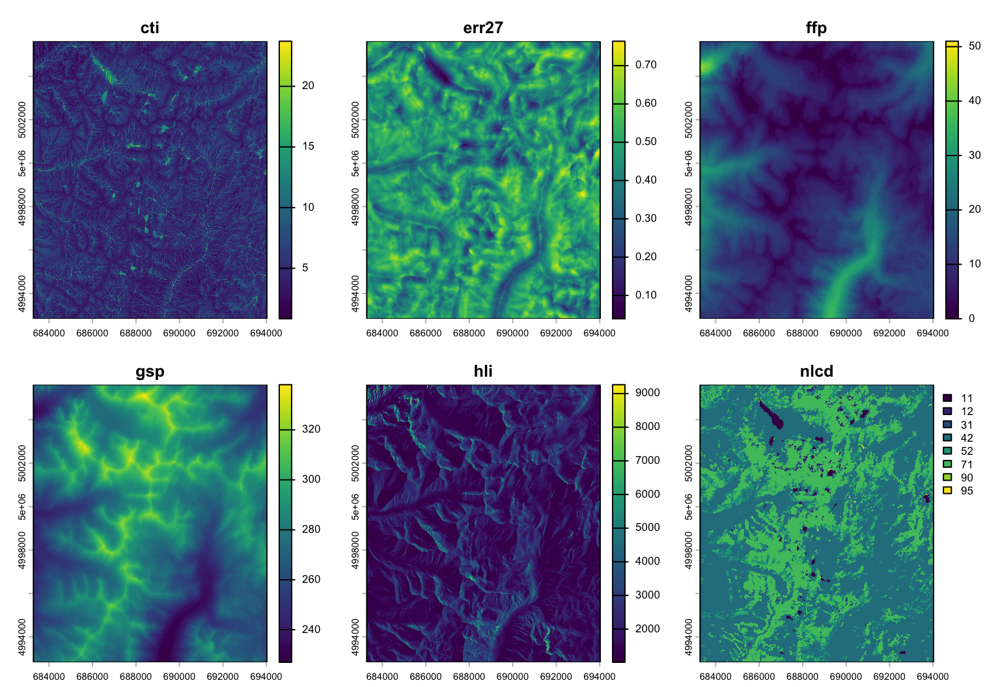
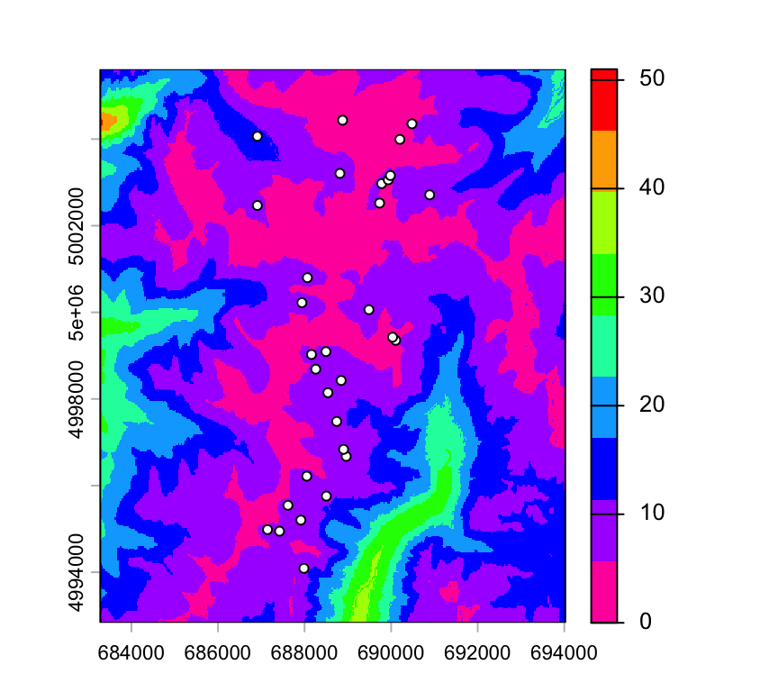
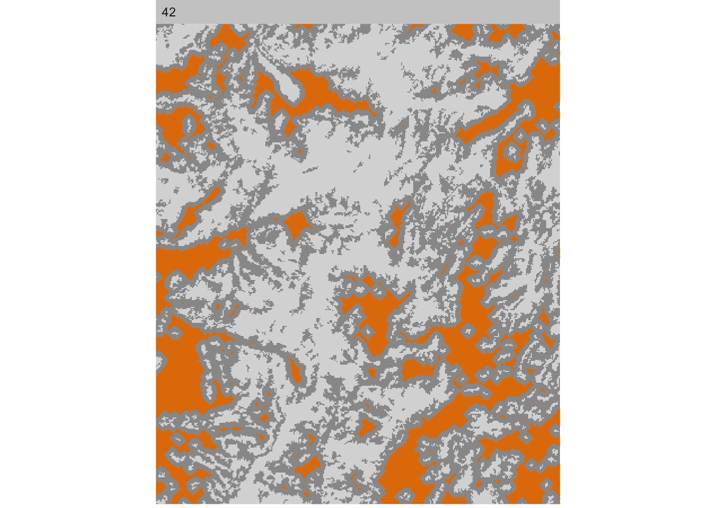
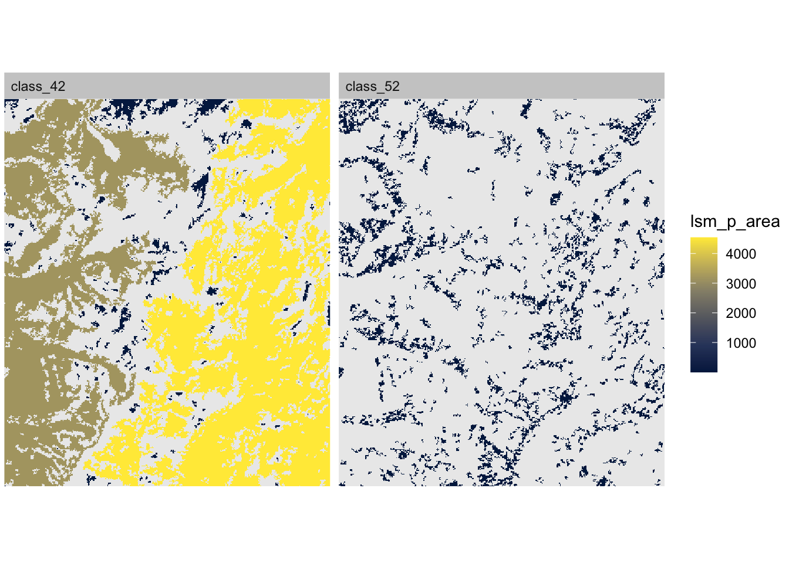
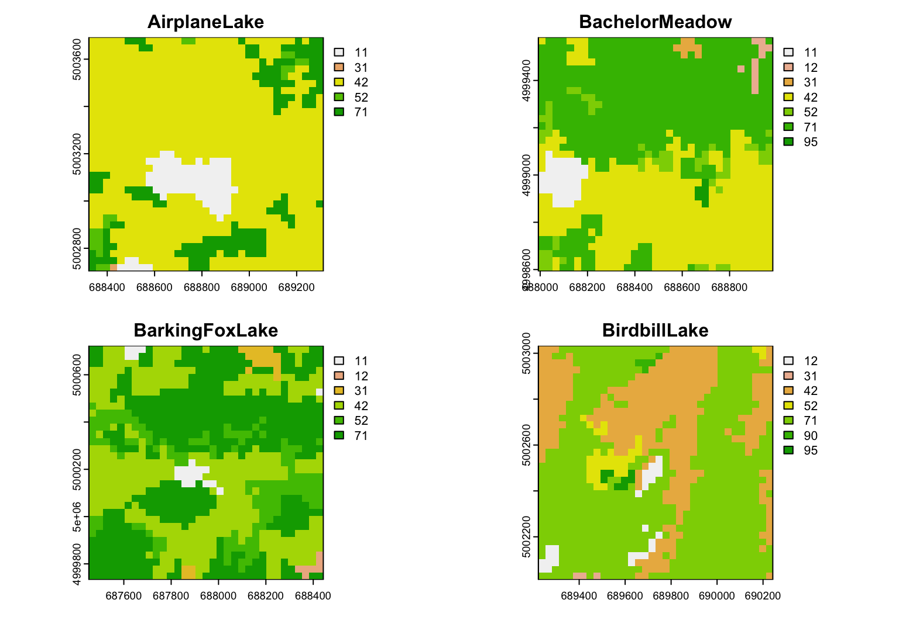
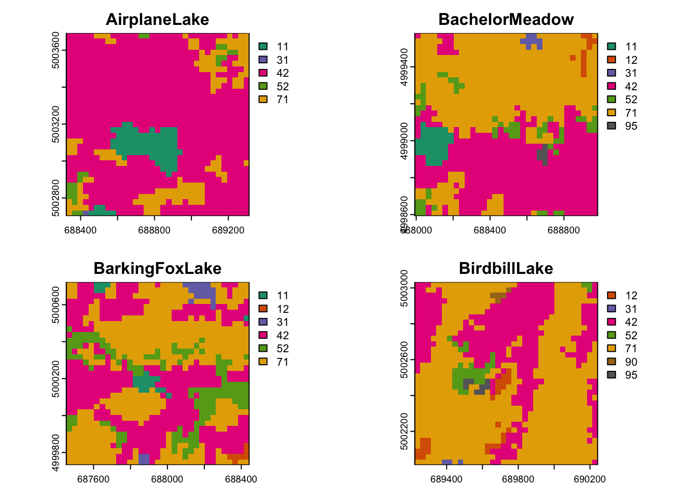

# Lab 2: Spatial Data {#Week2}


In this second regular computer lab of the course, we will learn about how to analyze land cover with landscape metrics in R. Along the way, we will learn about how to handle spatial data in R.  

- [View Course Video](#video_2)
- [Interactive Tutorial 2](#tutorial_2)
- [Worked Example](#WE_2)
- [R Exercise Week 2](#r-exercise-week-2)
- [Bonus Vignette](#bonus-2a): 'sf' package, plotting categorical maps

Note: Weeks 1 - 8 (Basic Topics) form a streamlined program to aimed at building your R skills. These skills are required for the Advanced Topics. 


## View Course Video{#video_2}

### 1. Embedded Video {-}

- External link: [Week 2 video](https://play.library.utoronto.ca/watch/e29069e14039807f0216e22175317260)
- Transcript: [Download transcript](https://github.com/hhwagner1/DGS_LG_Labs/raw/master/transcripts/Week2_script.pdf)

<iframe width="560" height="315" src="https://play.library.utoronto.ca/embed/e29069e14039807f0216e22175317260" frameborder="0" allowfullscreen> iframe not supported </iframe>


### 2. Preview Slides {-}


[Download slides](https://raw.githubusercontent.com/hhwagner1/DGS_LG_Labs/master/docs/Video_slides/Week2_Slides.pdf)


```
## Warning: The `size` argument of `element_rect()` is deprecated as of ggplot2 3.4.0.
## ℹ Please use the `linewidth` argument instead.
## This warning is displayed once per session.
## Call `lifecycle::last_lifecycle_warnings()` to see where this warning was
## generated.
```


## Interactive Tutorial 2{#tutorial_2}


### 1. List of R commands covered this week {-}

<table class="table table-bordered table-striped table-condensed table-responsive table" style="margin-left: auto; margin-right: auto; width: auto !important; margin-left: auto; margin-right: auto;">
 <thead>
  <tr>
   <th style="text-align:left;position: sticky; top:0; background-color: #FFFFFF;"> Function </th>
   <th style="text-align:left;position: sticky; top:0; background-color: #FFFFFF;"> Package </th>
  </tr>
 </thead>
<tbody>
  <tr>
   <td style="text-align:left;"> %&gt;% </td>
   <td style="text-align:left;"> dplyr </td>
  </tr>
  <tr>
   <td style="text-align:left;"> group_by </td>
   <td style="text-align:left;"> dplyr </td>
  </tr>
  <tr>
   <td style="text-align:left;"> summarize </td>
   <td style="text-align:left;"> dplyr </td>
  </tr>
  <tr>
   <td style="text-align:left;"> n </td>
   <td style="text-align:left;"> dplyr </td>
  </tr>
  <tr>
   <td style="text-align:left;"> filter </td>
   <td style="text-align:left;"> dplyr </td>
  </tr>
  <tr>
   <td style="text-align:left;"> left_join </td>
   <td style="text-align:left;"> dplyr </td>
  </tr>
  <tr>
   <td style="text-align:left;"> ==, &gt;, &lt;= </td>
   <td style="text-align:left;"> base </td>
  </tr>
  <tr>
   <td style="text-align:left;"> != </td>
   <td style="text-align:left;"> base </td>
  </tr>
  <tr>
   <td style="text-align:left;"> sum </td>
   <td style="text-align:left;"> base </td>
  </tr>
  <tr>
   <td style="text-align:left;"> merge </td>
   <td style="text-align:left;"> base </td>
  </tr>
  <tr>
   <td style="text-align:left;"> names </td>
   <td style="text-align:left;"> base </td>
  </tr>
  <tr>
   <td style="text-align:left;"> st_coordinates </td>
   <td style="text-align:left;"> sf </td>
  </tr>
  <tr>
   <td style="text-align:left;"> st_drop_geometry </td>
   <td style="text-align:left;"> sf </td>
  </tr>
  <tr>
   <td style="text-align:left;"> st_as_sf </td>
   <td style="text-align:left;"> sf </td>
  </tr>
  <tr>
   <td style="text-align:left;"> st_crs </td>
   <td style="text-align:left;"> sf </td>
  </tr>
  <tr>
   <td style="text-align:left;"> extract </td>
   <td style="text-align:left;"> terra </td>
  </tr>
</tbody>
</table>

### 2. General Instructions {-}

#### a) How to access tutorials {-}

Through RStudio Add-in:

- Install course Addins in RStudio: `library(LandGenCourse)`
- In RStudio, click on `Addins` (top menu bar)
- Follow instructions in the Console:
  - type: `require(swirl)` 
  - type: `swirl()` 
  - follow prompts 
  - select course ("Landscape_Genetics_R_Course") and tutorial (Weeks 1 - 8)


#### b) How to complete tutorial {-}

Follow prompts in the RStudio Console.

To stop and resume a tutorial: 

 - to stop and exit swirl, type: `bye()` 
 - to resume where you stopped, type: `swirl()` 

To restart tutorial from beginning: 

 - type:` swirl()` 
 - use a different name 
   (simply add a number, like this: 'MyName2')

#### c) How to submit answers (participating institutions only) {-}

The last prompt will ask whether you would like to submit the log of your tutorial session to Google Forms so that your instructor may evaluate your progress. **This feature is only available for students from participating institutions.**

If you choose 'yes', a form will open in your web browser. Complete and submit the form. 
    
You can submit multiple attempts and the best attempt will be graded. You will receive full marks as long as you answered all questions (i.e. did not use 'skip'). If you used 'skip' because you could not answer a question, please contact your instructor for advice.


	


## Worked Example{#WE_2}

Helene Wagner and Max Hesselbarth


### 1. Overview of Worked Example {-}

#### a. Background on spatial packages in R

There has been a lot of development recently in R regarding object types for geospatial data. We are currently in a transition period, where some packages still expect the "old" object types (based e.g. on packages `raster` and `sp`), others expect the "new" object types (based e.g. on packages `terra` and `sf`), and some accept both. This vignette uses the newer packages `terra` and `sf`. The bonus vignette includes code for converting between `sf` and `sp`, and between `terra` and `raster`. 

Further resources: 

- **Intro GIS with R**: to learn about GIS functionality using R, https://bookdown.org/michael_bcalles/gis-crash-course-in-r/data.html#vector-data

- **R Tutorial**: For an introductory tutorial on spatial data analysis with R, which explains object types in more detail than this worked example, see: https://rpubs.com/jguelat/fdsfd 

- **Advanced**: For a thorough resource on spatial data analysis with R, see this excellent Gitbook: https://geocompr.robinlovelace.net/index.html.


#### b. Goals {-} 

This worked example shows:

- How to import spatial coordinates and site attributes as spatially referenced data.  
- How to plot raster data in R and overlay sampling locations.
- How to calculate landscape metrics.
- How to extract landscape data at sampling locations and within a buffer around them.

Try modifying the code to import your own data!

#### c. Data set {-}

This code builds on data and code from the `GeNetIt` package by Jeff Evans and Melanie Murphy. Landscape metrics will be calculated with the `landscapemetrics` package described in: Hesselbarth et al. (2019), Ecography 42: 1648-1657.

This code uses landscape data and spatial coordinates from 30 locations where Colombia spotted frogs (*Rana luteiventris*) were sampled for the full data set analyzed by Funk et al. (2005) and Murphy et al. (2010). Please see the separate introduction to the data set.

- `ralu.site`: `sf` object with UTM coordinates (zone 11) and 17 site variables for 31 sites. The data are included in the 'GeNetIt' package, for meta data type: ?ralu.site

We will extract values at sampling point locations and within a local neighborhood (buffer) from six raster maps (see Murphy et al. 2010 for definitions), which are included with the `GeNetIt` package as a SpatialPixelsDataFrame called 'rasters':

- cti:   Compound Topographic Index ("wetness")
- err27: Elevation Relief Ratio 
- ffp:   Frost Free Period
- gsp:   Growing Season Precipitation
- hli:   Heat Load Index
- nlcd:  USGS Landcover (categorical map)

#### d. Required R packages {-}

Install some packages needed for this worked example.


``` r
if(!requireNamespace("GeNetIt", quietly = TRUE)) remotes::install_github("jeffreyevans/GeNetIt")
```


``` r
library(LandGenCourse)
library(here)
library(landscapemetrics)
library(dplyr)
library(sf)
library(terra)
library(GeNetIt)
library(tibble)
library(tmap)
library(RColorBrewer)
```

### 2. Import site data from .csv file {-}

#### a. Import data into an `sf` object {-}

The site data are already in an `sf` object named `ralu.site` that comes with the package `GeNetIt`. Use `data(ralu.site)` to load it. This will create an object `ralu.site`. 


``` r
data(ralu.site)
class(ralu.site)
```

```
## [1] "sf"         "data.frame"
```

To demonstrate how to create an `sf` object from two data frames (one with the coordinates and one with the attribute data), we'll extract these data frames from the `sf` object `ralu.site` and then recreate the `sf` object (we'll call it `Sites`) from the two data frames.

We can extract the coordinates with the function `st_coordinates`:


``` r
Coordinates <- st_coordinates(ralu.site)
head(Coordinates)
```

```
##             X       Y
## [1,] 688816.6 5003207
## [2,] 688494.4 4999093
## [3,] 687938.4 5000223
## [4,] 689732.8 5002522
## [5,] 690104.0 4999355
## [6,] 688742.5 4997481
```

**Question**: What are the variable names for the spatial coordinates?

Similarly, we can drop the geometry (spatial information) from the `sf` object to reduce it to a data frame:


``` r
Data <- st_drop_geometry(ralu.site)
class(Data)
```

```
## [1] "data.frame"
```

Now we can create an `sf` object again. Here, we: 

- combine the two data frames `Data` and `Coordinates` into a single data frame with function `data.frame`,
- use the function `st_as_sf` from the `sf` package to convert this data frame to an `sf` object,
- tell R that the variables with the coordinates are called "X" and "Y". 


``` r
Sites <- data.frame(Data, Coordinates)
Sites.sf <- st_as_sf(Sites, coords=c("X", "Y"))
head(Sites.sf)
```

```
## Simple feature collection with 6 features and 17 fields
## Geometry type: POINT
## Dimension:     XY
## Bounding box:  xmin: 687938.4 ymin: 4997481 xmax: 690104 ymax: 5003207
## CRS:           NA
##         SiteName        Drainage      Basin Substrate
## 1   AirplaneLake ShipIslandCreek Sheepeater      Silt
## 2 BachelorMeadow     WilsonCreek    Skyhigh      Silt
## 3 BarkingFoxLake  WaterfallCreek    Terrace      Silt
## 4   BirdbillLake      ClearCreek   Birdbill      Sand
## 5        BobLake     WilsonCreek     Harbor      Silt
## 6      CacheLake     WilsonCreek    Skyhigh      Silt
##                               NWI AREA_m2 PERI_m Depth_m  TDS FISH ACB   AUC
## 1                      Lacustrine 62582.2 1142.8   21.64  2.5    1   0 0.411
## 2 Riverine_Intermittent_Streambed   225.0   60.0    0.40  0.0    0   0 0.000
## 3                      Lacustrine 12000.0  435.0    5.00 13.8    1   0 0.300
## 4                      Lacustrine 12358.6  572.3    3.93  6.4    1   0 0.283
## 5                      Palustrine  4600.0  321.4    2.00 14.3    0   0 0.000
## 6                      Palustrine  2268.8  192.0    1.86 10.9    0   0 0.000
##   AUCV  AUCC   AUF AWOOD  AUFV                 geometry
## 1    0 0.411 0.063 0.063 0.464 POINT (688816.6 5003207)
## 2    0 0.000 1.000 0.000 0.000 POINT (688494.4 4999093)
## 3    0 0.300 0.700 0.000 0.000 POINT (687938.4 5000223)
## 4    0 0.283 0.717 0.000 0.000 POINT (689732.8 5002522)
## 5    0 0.000 0.500 0.000 0.500   POINT (690104 4999355)
## 6    0 0.000 0.556 0.093 0.352 POINT (688742.5 4997481)
```

**Question**: Where and how are the spatial coordinates shown in the `sf` object `Sites.sf`?


To illustrate importing spatial data from Excel, here we export the combined data frame as a csv file, import it again as a data frame, then convert it to an `sf` object. First we create a folder `output` if it does not yet exist. 

Note: to run the code below, remove all the hashtags `#` at the beginning of the lines to un-comment them. This part assumes that you have writing permission on your computer. Alternatively, try setting up your R project folder on an external drive where you have writing permission.

The code below does the following:

- Line 1: Load package here that helps with file paths.
- Line 2: Check if folder output exists, and if not, create it.
- Line 3: Export the combined data frame as a .csv file.
- Line 4: Re-imports the .csv file as a `data.frame` object `Sites`.
- Line 5: Create `sf` object `Sites.sf` from df`.


``` r
#require(here)
#if(!dir.exists(here("output"))) dir.create(here("output"))
#write.csv(data.frame(Data, Coordinates), file=here("output/ralu.site.csv"), quote=FALSE, row.names=FALSE)
#Sites <- read.csv(here("output/ralu.site.csv"), header=TRUE)
#Sites.sf <- st_as_sf(df, coords=c("X", "Y"))
```

The `sf` object `Sites.sf` contains 17 attribute variables and one variable `geometry` that contains the spatial information. Now R knows these are spatial data and knows how to handle them. 

#### b. Add spatial reference data {-}

Before we can combine the sampling locations with other spatial datasets, such as raster data, we need to tell R where on Earth these locations are (georeferencing). This is done by specifying the "Coordinate Reference System" (CRS).

For a great explanation of projections, see:
https://michaelminn.net/tutorials/gis-projections/index.html

For more information on CRS, see: https://www.nceas.ucsb.edu/~frazier/RSpatialGuides/OverviewCoordinateReferenceSystems.pdf

We know that these coordinates are UTM zone 11 (Northern hemisphere) coordinates. We define it here by its EPSG code (32611). You can search for EPSG codes here: https://epsg.io/32611.

Here we call the function and the package simultaneously (this is good practice, as it helps keep track of where the functions in your code come from).


``` r
st_crs(Sites.sf) <- 32611
```

**Question:** Print `Sites.sf` and check what CRS is listed in the header.

**Important**: the code above, using function `st_crs`,  only **declares** the existing projection, it does not change the coordinates to that projection! 

However, the `ralu.site` dataset uses a slightly different definition of the projection (the difference is in the `datum` argument `WGS84` vs. `NAD83`). Hence it may be safer to simply copy the crs information from ralu.site to Sites.sf. Again, this does not change the projection but declares that Sites.sf has the same projection as ralu.site. R even prints a warning to remind us of this:


``` r
st_crs(Sites.sf) <- st_crs(ralu.site)
```

```
## Warning: st_crs<- : replacing crs does not reproject data; use st_transform for
## that
```


#### c. Change projection {-}

In case we needed to **transform** the projection, e.g., from UTM zone 11 to longitude/latitude (EPSG code: 4326), we could create a new `sf` object `Sites.sf.longlat`. We use the function `st_transform` to change the projection from the projection of the old object `Sites.sf` to the "longlat" coordinate system, which we define by the argument `crs`.

With 

``` r
Sites.sf.longlat <- st_transform(Sites.sf, crs = 4326)
head(Sites.sf.longlat)
```

```
## Simple feature collection with 6 features and 17 fields
## Geometry type: POINT
## Dimension:     XY
## Bounding box:  xmin: -114.61 ymin: 45.1056 xmax: -114.5828 ymax: 45.15708
## Geodetic CRS:  WGS 84
##         SiteName        Drainage      Basin Substrate
## 1   AirplaneLake ShipIslandCreek Sheepeater      Silt
## 2 BachelorMeadow     WilsonCreek    Skyhigh      Silt
## 3 BarkingFoxLake  WaterfallCreek    Terrace      Silt
## 4   BirdbillLake      ClearCreek   Birdbill      Sand
## 5        BobLake     WilsonCreek     Harbor      Silt
## 6      CacheLake     WilsonCreek    Skyhigh      Silt
##                               NWI AREA_m2 PERI_m Depth_m  TDS FISH ACB   AUC
## 1                      Lacustrine 62582.2 1142.8   21.64  2.5    1   0 0.411
## 2 Riverine_Intermittent_Streambed   225.0   60.0    0.40  0.0    0   0 0.000
## 3                      Lacustrine 12000.0  435.0    5.00 13.8    1   0 0.300
## 4                      Lacustrine 12358.6  572.3    3.93  6.4    1   0 0.283
## 5                      Palustrine  4600.0  321.4    2.00 14.3    0   0 0.000
## 6                      Palustrine  2268.8  192.0    1.86 10.9    0   0 0.000
##   AUCV  AUCC   AUF AWOOD  AUFV                   geometry
## 1    0 0.411 0.063 0.063 0.464 POINT (-114.5977 45.15708)
## 2    0 0.000 1.000 0.000 0.000 POINT (-114.6034 45.12016)
## 3    0 0.300 0.700 0.000 0.000   POINT (-114.61 45.13047)
## 4    0 0.283 0.717 0.000 0.000 POINT (-114.5864 45.15067)
## 5    0 0.000 0.500 0.000 0.500 POINT (-114.5828 45.12208)
## 6    0 0.000 0.556 0.093 0.352  POINT (-114.6008 45.1056)
```

**Question**: What has changed in the summary?

#### d. Map sampling sites on world map {-}

Where on earth is this? You could enter the coordinates from the "longlat" projection in Google maps. Note that Google expects the Latitude (Y coordinate) first, then the Longitude (X coordinate). In the variable `geometry`, longitude (e.g., -114.5977 for the first data point) is listed before latitude (45.15708 for the first data point). Thus, to locate the first site in Google maps, you will need to enter `45.15708, -114.5977`. 

There is a much easier way to find out where on Earth the sampling points are located. And we don't even need to change the coordinates to longitude/latitude - R will do this for us internally.

- We load the R package `tmap` (which stands for "thematic maps")
- With `tmap_mode("view")`, we indicate that we want to create an interactive map.
- With `tm_shape(Sites.sf)` we select the data set (Sites.sf`) to be displayed. For now, we only plot the location, no attribute information. 
- With `tm_sf`, we specify how the points should be displayed (color, size).


``` r
require(tmap)

tmap_mode("view")
```

```
## ℹ tmap modes "plot" - "view"
## ℹ toggle with `tmap::ttm()`
```

``` r
tm_shape(Sites.sf) + tm_sf(col="red", size=1)
```

```{=html}
<div class="leaflet html-widget html-fill-item" id="htmlwidget-ebfcd3400c70478c7a53" style="width:672px;height:480px;"></div>
<script type="application/json" data-for="htmlwidget-ebfcd3400c70478c7a53">{"x":{"options":{"crs":{"crsClass":"L.CRS.EPSG3857","code":null,"proj4def":null,"projectedBounds":null,"options":{}},"attributionControl":true},"calls":[{"method":"createMapPane","args":["tmap403",403]},{"method":"addLayersControl","args":[["Esri.WorldGrayCanvas","OpenStreetMap","Esri.WorldTopoMap"],"Sites.sf",{"collapsed":true,"autoZIndex":true,"position":"topleft"}]},{"method":"addProviderTiles","args":["Esri.WorldGrayCanvas",null,"Esri.WorldGrayCanvas",{"minZoom":0,"maxZoom":18,"maxNativeZoom":17,"tileSize":256,"subdomains":"abc","errorTileUrl":"","tms":false,"noWrap":false,"zoomOffset":0,"zoomReverse":false,"opacity":1,"zIndex":1,"detectRetina":false,"pane":"tilePane"}]},{"method":"addProviderTiles","args":["OpenStreetMap",null,"OpenStreetMap",{"minZoom":0,"maxZoom":18,"maxNativeZoom":17,"tileSize":256,"subdomains":"abc","errorTileUrl":"","tms":false,"noWrap":false,"zoomOffset":0,"zoomReverse":false,"opacity":1,"zIndex":1,"detectRetina":false,"pane":"tilePane"}]},{"method":"addProviderTiles","args":["Esri.WorldTopoMap",null,"Esri.WorldTopoMap",{"minZoom":0,"maxZoom":18,"maxNativeZoom":17,"tileSize":256,"subdomains":"abc","errorTileUrl":"","tms":false,"noWrap":false,"zoomOffset":0,"zoomReverse":false,"opacity":1,"zIndex":1,"detectRetina":false,"pane":"tilePane"}]},{"method":"addCircleMarkers","args":[[45.15707850945083,45.12016062430876,45.1304727987641,45.15066982354276,45.12208200955106,45.10559714362714,45.0982893066227,45.11162597727552,45.16810160930147,45.09975785083597,45.11407808030845,45.15469735448928,45.15545452687273,45.1637644385459,45.09441390148887,45.1165823853642,45.15207319555835,45.09016340391857,45.08848338859229,45.15092837107155,45.08316146635691,45.08356480981284,45.16692667954503,45.08533324650074,45.16529181498381,45.11965875884201,45.15632923267202,45.13562787813084,45.12274430524,45.07529212294912,45.12860201067411],[-114.5977396540216,-114.6033865250272,-114.6100248049217,-114.5863531992181,-114.5828399817001,-114.6008430385362,-114.5983541778665,-114.6031733879995,-114.5964858515769,-114.5990662195857,-114.599181207082,-114.585563173993,-114.5835998180092,-114.5798359744075,-114.6100936916924,-114.6065382479126,-114.5715719888294,-114.6045327001424,-114.6158701947446,-114.6222594992278,-114.6185682698232,-114.622073588037,-114.5761415003057,-114.6122166396044,-114.6216736368122,-114.6076631577064,-114.5829370604914,-114.6082003751046,-114.5837103287136,-114.6117283040945,-114.5904058421169],[7,7,7,7,7,7,7,7,7,7,7,7,7,7,7,7,7,7,7,7,7,7,7,7,7,7,7,7,7,7,7],["0000001","0000002","0000003","0000004","0000005","0000006","0000007","0000008","0000009","0000010","0000011","0000012","0000013","0000014","0000015","0000016","0000017","0000018","0000019","0000020","0000021","0000022","0000023","0000024","0000025","0000026","0000027","0000028","0000029","0000030","0000031"],"Sites.sf",{"interactive":true,"className":"","pane":"tmap403","stroke":true,"color":["#FF0000","#FF0000","#FF0000","#FF0000","#FF0000","#FF0000","#FF0000","#FF0000","#FF0000","#FF0000","#FF0000","#FF0000","#FF0000","#FF0000","#FF0000","#FF0000","#FF0000","#FF0000","#FF0000","#FF0000","#FF0000","#FF0000","#FF0000","#FF0000","#FF0000","#FF0000","#FF0000","#FF0000","#FF0000","#FF0000","#FF0000"],"weight":[1,1,1,1,1,1,1,1,1,1,1,1,1,1,1,1,1,1,1,1,1,1,1,1,1,1,1,1,1,1,1],"opacity":[1,1,1,1,1,1,1,1,1,1,1,1,1,1,1,1,1,1,1,1,1,1,1,1,1,1,1,1,1,1,1],"fill":true,"fillColor":["#999999","#999999","#999999","#999999","#999999","#999999","#999999","#999999","#999999","#999999","#999999","#999999","#999999","#999999","#999999","#999999","#999999","#999999","#999999","#999999","#999999","#999999","#999999","#999999","#999999","#999999","#999999","#999999","#999999","#999999","#999999"],"fillOpacity":[1,1,1,1,1,1,1,1,1,1,1,1,1,1,1,1,1,1,1,1,1,1,1,1,1,1,1,1,1,1,1]},null,null,["<style> div.leaflet-popup-content {width:auto !important;overflow-y:auto; overflow-x:hidden;}<\/style><div style=\"max-height:25em;padding-right:15px;\"><table>\n\t\t\t   <thead><tr><th colspan=\"2\"><b>0000001<\/b><\/th><\/thead><\/tr><tr><td style=\"color: #888888;\"><nobr>SiteName<\/nobr><\/td><td align=\"right\"><nobr>AirplaneLake<\/nobr><\/td><\/tr><tr><td style=\"color: #888888;\"><nobr>Drainage<\/nobr><\/td><td align=\"right\"><nobr>ShipIslandCreek<\/nobr><\/td><\/tr><tr><td style=\"color: #888888;\"><nobr>Basin<\/nobr><\/td><td align=\"right\"><nobr>Sheepeater<\/nobr><\/td><\/tr><tr><td style=\"color: #888888;\"><nobr>Substrate<\/nobr><\/td><td align=\"right\"><nobr>Silt<\/nobr><\/td><\/tr><tr><td style=\"color: #888888;\"><nobr>NWI<\/nobr><\/td><td align=\"right\"><nobr>Lacustrine<\/nobr><\/td><\/tr><tr><td style=\"color: #888888;\"><nobr>AREA_m2<\/nobr><\/td><td align=\"right\"><nobr>62,582<\/nobr><\/td><\/tr><tr><td style=\"color: #888888;\"><nobr>PERI_m<\/nobr><\/td><td align=\"right\"><nobr>1,143<\/nobr><\/td><\/tr><tr><td style=\"color: #888888;\"><nobr>Depth_m<\/nobr><\/td><td align=\"right\"><nobr>21.64<\/nobr><\/td><\/tr><tr><td style=\"color: #888888;\"><nobr>TDS<\/nobr><\/td><td align=\"right\"><nobr>2.5<\/nobr><\/td><\/tr><tr><td style=\"color: #888888;\"><nobr>FISH<\/nobr><\/td><td align=\"right\"><nobr>1<\/nobr><\/td><\/tr><tr><td style=\"color: #888888;\"><nobr>ACB<\/nobr><\/td><td align=\"right\"><nobr>0.000<\/nobr><\/td><\/tr><tr><td style=\"color: #888888;\"><nobr>AUC<\/nobr><\/td><td align=\"right\"><nobr>0.411<\/nobr><\/td><\/tr><tr><td style=\"color: #888888;\"><nobr>AUCV<\/nobr><\/td><td align=\"right\"><nobr>0.000<\/nobr><\/td><\/tr><tr><td style=\"color: #888888;\"><nobr>AUCC<\/nobr><\/td><td align=\"right\"><nobr>0.411<\/nobr><\/td><\/tr><tr><td style=\"color: #888888;\"><nobr>AUF<\/nobr><\/td><td align=\"right\"><nobr>0.063<\/nobr><\/td><\/tr><tr><td style=\"color: #888888;\"><nobr>AWOOD<\/nobr><\/td><td align=\"right\"><nobr>0.063<\/nobr><\/td><\/tr><tr><td style=\"color: #888888;\"><nobr>AUFV<\/nobr><\/td><td align=\"right\"><nobr>0.464<\/nobr><\/td><\/tr><\/table><\/div>","<style> div.leaflet-popup-content {width:auto !important;overflow-y:auto; overflow-x:hidden;}<\/style><div style=\"max-height:25em;padding-right:15px;\"><table>\n\t\t\t   <thead><tr><th colspan=\"2\"><b>0000002<\/b><\/th><\/thead><\/tr><tr><td style=\"color: #888888;\"><nobr>SiteName<\/nobr><\/td><td align=\"right\"><nobr>BachelorMeadow<\/nobr><\/td><\/tr><tr><td style=\"color: #888888;\"><nobr>Drainage<\/nobr><\/td><td align=\"right\"><nobr>WilsonCreek<\/nobr><\/td><\/tr><tr><td style=\"color: #888888;\"><nobr>Basin<\/nobr><\/td><td align=\"right\"><nobr>Skyhigh<\/nobr><\/td><\/tr><tr><td style=\"color: #888888;\"><nobr>Substrate<\/nobr><\/td><td align=\"right\"><nobr>Silt<\/nobr><\/td><\/tr><tr><td style=\"color: #888888;\"><nobr>NWI<\/nobr><\/td><td align=\"right\"><nobr>Riverine_Intermittent_Streambed<\/nobr><\/td><\/tr><tr><td style=\"color: #888888;\"><nobr>AREA_m2<\/nobr><\/td><td align=\"right\"><nobr>225<\/nobr><\/td><\/tr><tr><td style=\"color: #888888;\"><nobr>PERI_m<\/nobr><\/td><td align=\"right\"><nobr>60<\/nobr><\/td><\/tr><tr><td style=\"color: #888888;\"><nobr>Depth_m<\/nobr><\/td><td align=\"right\"><nobr>0.40<\/nobr><\/td><\/tr><tr><td style=\"color: #888888;\"><nobr>TDS<\/nobr><\/td><td align=\"right\"><nobr>0.0<\/nobr><\/td><\/tr><tr><td style=\"color: #888888;\"><nobr>FISH<\/nobr><\/td><td align=\"right\"><nobr>0<\/nobr><\/td><\/tr><tr><td style=\"color: #888888;\"><nobr>ACB<\/nobr><\/td><td align=\"right\"><nobr>0.000<\/nobr><\/td><\/tr><tr><td style=\"color: #888888;\"><nobr>AUC<\/nobr><\/td><td align=\"right\"><nobr>0.000<\/nobr><\/td><\/tr><tr><td style=\"color: #888888;\"><nobr>AUCV<\/nobr><\/td><td align=\"right\"><nobr>0.000<\/nobr><\/td><\/tr><tr><td style=\"color: #888888;\"><nobr>AUCC<\/nobr><\/td><td align=\"right\"><nobr>0.000<\/nobr><\/td><\/tr><tr><td style=\"color: #888888;\"><nobr>AUF<\/nobr><\/td><td align=\"right\"><nobr>1.000<\/nobr><\/td><\/tr><tr><td style=\"color: #888888;\"><nobr>AWOOD<\/nobr><\/td><td align=\"right\"><nobr>0.000<\/nobr><\/td><\/tr><tr><td style=\"color: #888888;\"><nobr>AUFV<\/nobr><\/td><td align=\"right\"><nobr>0.000<\/nobr><\/td><\/tr><\/table><\/div>","<style> div.leaflet-popup-content {width:auto !important;overflow-y:auto; overflow-x:hidden;}<\/style><div style=\"max-height:25em;padding-right:15px;\"><table>\n\t\t\t   <thead><tr><th colspan=\"2\"><b>0000003<\/b><\/th><\/thead><\/tr><tr><td style=\"color: #888888;\"><nobr>SiteName<\/nobr><\/td><td align=\"right\"><nobr>BarkingFoxLake<\/nobr><\/td><\/tr><tr><td style=\"color: #888888;\"><nobr>Drainage<\/nobr><\/td><td align=\"right\"><nobr>WaterfallCreek<\/nobr><\/td><\/tr><tr><td style=\"color: #888888;\"><nobr>Basin<\/nobr><\/td><td align=\"right\"><nobr>Terrace<\/nobr><\/td><\/tr><tr><td style=\"color: #888888;\"><nobr>Substrate<\/nobr><\/td><td align=\"right\"><nobr>Silt<\/nobr><\/td><\/tr><tr><td style=\"color: #888888;\"><nobr>NWI<\/nobr><\/td><td align=\"right\"><nobr>Lacustrine<\/nobr><\/td><\/tr><tr><td style=\"color: #888888;\"><nobr>AREA_m2<\/nobr><\/td><td align=\"right\"><nobr>12,000<\/nobr><\/td><\/tr><tr><td style=\"color: #888888;\"><nobr>PERI_m<\/nobr><\/td><td align=\"right\"><nobr>435<\/nobr><\/td><\/tr><tr><td style=\"color: #888888;\"><nobr>Depth_m<\/nobr><\/td><td align=\"right\"><nobr>5.00<\/nobr><\/td><\/tr><tr><td style=\"color: #888888;\"><nobr>TDS<\/nobr><\/td><td align=\"right\"><nobr>13.8<\/nobr><\/td><\/tr><tr><td style=\"color: #888888;\"><nobr>FISH<\/nobr><\/td><td align=\"right\"><nobr>1<\/nobr><\/td><\/tr><tr><td style=\"color: #888888;\"><nobr>ACB<\/nobr><\/td><td align=\"right\"><nobr>0.000<\/nobr><\/td><\/tr><tr><td style=\"color: #888888;\"><nobr>AUC<\/nobr><\/td><td align=\"right\"><nobr>0.300<\/nobr><\/td><\/tr><tr><td style=\"color: #888888;\"><nobr>AUCV<\/nobr><\/td><td align=\"right\"><nobr>0.000<\/nobr><\/td><\/tr><tr><td style=\"color: #888888;\"><nobr>AUCC<\/nobr><\/td><td align=\"right\"><nobr>0.300<\/nobr><\/td><\/tr><tr><td style=\"color: #888888;\"><nobr>AUF<\/nobr><\/td><td align=\"right\"><nobr>0.700<\/nobr><\/td><\/tr><tr><td style=\"color: #888888;\"><nobr>AWOOD<\/nobr><\/td><td align=\"right\"><nobr>0.000<\/nobr><\/td><\/tr><tr><td style=\"color: #888888;\"><nobr>AUFV<\/nobr><\/td><td align=\"right\"><nobr>0.000<\/nobr><\/td><\/tr><\/table><\/div>","<style> div.leaflet-popup-content {width:auto !important;overflow-y:auto; overflow-x:hidden;}<\/style><div style=\"max-height:25em;padding-right:15px;\"><table>\n\t\t\t   <thead><tr><th colspan=\"2\"><b>0000004<\/b><\/th><\/thead><\/tr><tr><td style=\"color: #888888;\"><nobr>SiteName<\/nobr><\/td><td align=\"right\"><nobr>BirdbillLake<\/nobr><\/td><\/tr><tr><td style=\"color: #888888;\"><nobr>Drainage<\/nobr><\/td><td align=\"right\"><nobr>ClearCreek<\/nobr><\/td><\/tr><tr><td style=\"color: #888888;\"><nobr>Basin<\/nobr><\/td><td align=\"right\"><nobr>Birdbill<\/nobr><\/td><\/tr><tr><td style=\"color: #888888;\"><nobr>Substrate<\/nobr><\/td><td align=\"right\"><nobr>Sand<\/nobr><\/td><\/tr><tr><td style=\"color: #888888;\"><nobr>NWI<\/nobr><\/td><td align=\"right\"><nobr>Lacustrine<\/nobr><\/td><\/tr><tr><td style=\"color: #888888;\"><nobr>AREA_m2<\/nobr><\/td><td align=\"right\"><nobr>12,359<\/nobr><\/td><\/tr><tr><td style=\"color: #888888;\"><nobr>PERI_m<\/nobr><\/td><td align=\"right\"><nobr>572<\/nobr><\/td><\/tr><tr><td style=\"color: #888888;\"><nobr>Depth_m<\/nobr><\/td><td align=\"right\"><nobr>3.93<\/nobr><\/td><\/tr><tr><td style=\"color: #888888;\"><nobr>TDS<\/nobr><\/td><td align=\"right\"><nobr>6.4<\/nobr><\/td><\/tr><tr><td style=\"color: #888888;\"><nobr>FISH<\/nobr><\/td><td align=\"right\"><nobr>1<\/nobr><\/td><\/tr><tr><td style=\"color: #888888;\"><nobr>ACB<\/nobr><\/td><td align=\"right\"><nobr>0.000<\/nobr><\/td><\/tr><tr><td style=\"color: #888888;\"><nobr>AUC<\/nobr><\/td><td align=\"right\"><nobr>0.283<\/nobr><\/td><\/tr><tr><td style=\"color: #888888;\"><nobr>AUCV<\/nobr><\/td><td align=\"right\"><nobr>0.000<\/nobr><\/td><\/tr><tr><td style=\"color: #888888;\"><nobr>AUCC<\/nobr><\/td><td align=\"right\"><nobr>0.283<\/nobr><\/td><\/tr><tr><td style=\"color: #888888;\"><nobr>AUF<\/nobr><\/td><td align=\"right\"><nobr>0.717<\/nobr><\/td><\/tr><tr><td style=\"color: #888888;\"><nobr>AWOOD<\/nobr><\/td><td align=\"right\"><nobr>0.000<\/nobr><\/td><\/tr><tr><td style=\"color: #888888;\"><nobr>AUFV<\/nobr><\/td><td align=\"right\"><nobr>0.000<\/nobr><\/td><\/tr><\/table><\/div>","<style> div.leaflet-popup-content {width:auto !important;overflow-y:auto; overflow-x:hidden;}<\/style><div style=\"max-height:25em;padding-right:15px;\"><table>\n\t\t\t   <thead><tr><th colspan=\"2\"><b>0000005<\/b><\/th><\/thead><\/tr><tr><td style=\"color: #888888;\"><nobr>SiteName<\/nobr><\/td><td align=\"right\"><nobr>BobLake<\/nobr><\/td><\/tr><tr><td style=\"color: #888888;\"><nobr>Drainage<\/nobr><\/td><td align=\"right\"><nobr>WilsonCreek<\/nobr><\/td><\/tr><tr><td style=\"color: #888888;\"><nobr>Basin<\/nobr><\/td><td align=\"right\"><nobr>Harbor<\/nobr><\/td><\/tr><tr><td style=\"color: #888888;\"><nobr>Substrate<\/nobr><\/td><td align=\"right\"><nobr>Silt<\/nobr><\/td><\/tr><tr><td style=\"color: #888888;\"><nobr>NWI<\/nobr><\/td><td align=\"right\"><nobr>Palustrine<\/nobr><\/td><\/tr><tr><td style=\"color: #888888;\"><nobr>AREA_m2<\/nobr><\/td><td align=\"right\"><nobr>4,600<\/nobr><\/td><\/tr><tr><td style=\"color: #888888;\"><nobr>PERI_m<\/nobr><\/td><td align=\"right\"><nobr>321<\/nobr><\/td><\/tr><tr><td style=\"color: #888888;\"><nobr>Depth_m<\/nobr><\/td><td align=\"right\"><nobr>2.00<\/nobr><\/td><\/tr><tr><td style=\"color: #888888;\"><nobr>TDS<\/nobr><\/td><td align=\"right\"><nobr>14.3<\/nobr><\/td><\/tr><tr><td style=\"color: #888888;\"><nobr>FISH<\/nobr><\/td><td align=\"right\"><nobr>0<\/nobr><\/td><\/tr><tr><td style=\"color: #888888;\"><nobr>ACB<\/nobr><\/td><td align=\"right\"><nobr>0.000<\/nobr><\/td><\/tr><tr><td style=\"color: #888888;\"><nobr>AUC<\/nobr><\/td><td align=\"right\"><nobr>0.000<\/nobr><\/td><\/tr><tr><td style=\"color: #888888;\"><nobr>AUCV<\/nobr><\/td><td align=\"right\"><nobr>0.000<\/nobr><\/td><\/tr><tr><td style=\"color: #888888;\"><nobr>AUCC<\/nobr><\/td><td align=\"right\"><nobr>0.000<\/nobr><\/td><\/tr><tr><td style=\"color: #888888;\"><nobr>AUF<\/nobr><\/td><td align=\"right\"><nobr>0.500<\/nobr><\/td><\/tr><tr><td style=\"color: #888888;\"><nobr>AWOOD<\/nobr><\/td><td align=\"right\"><nobr>0.000<\/nobr><\/td><\/tr><tr><td style=\"color: #888888;\"><nobr>AUFV<\/nobr><\/td><td align=\"right\"><nobr>0.500<\/nobr><\/td><\/tr><\/table><\/div>","<style> div.leaflet-popup-content {width:auto !important;overflow-y:auto; overflow-x:hidden;}<\/style><div style=\"max-height:25em;padding-right:15px;\"><table>\n\t\t\t   <thead><tr><th colspan=\"2\"><b>0000006<\/b><\/th><\/thead><\/tr><tr><td style=\"color: #888888;\"><nobr>SiteName<\/nobr><\/td><td align=\"right\"><nobr>CacheLake<\/nobr><\/td><\/tr><tr><td style=\"color: #888888;\"><nobr>Drainage<\/nobr><\/td><td align=\"right\"><nobr>WilsonCreek<\/nobr><\/td><\/tr><tr><td style=\"color: #888888;\"><nobr>Basin<\/nobr><\/td><td align=\"right\"><nobr>Skyhigh<\/nobr><\/td><\/tr><tr><td style=\"color: #888888;\"><nobr>Substrate<\/nobr><\/td><td align=\"right\"><nobr>Silt<\/nobr><\/td><\/tr><tr><td style=\"color: #888888;\"><nobr>NWI<\/nobr><\/td><td align=\"right\"><nobr>Palustrine<\/nobr><\/td><\/tr><tr><td style=\"color: #888888;\"><nobr>AREA_m2<\/nobr><\/td><td align=\"right\"><nobr>2,269<\/nobr><\/td><\/tr><tr><td style=\"color: #888888;\"><nobr>PERI_m<\/nobr><\/td><td align=\"right\"><nobr>192<\/nobr><\/td><\/tr><tr><td style=\"color: #888888;\"><nobr>Depth_m<\/nobr><\/td><td align=\"right\"><nobr>1.86<\/nobr><\/td><\/tr><tr><td style=\"color: #888888;\"><nobr>TDS<\/nobr><\/td><td align=\"right\"><nobr>10.9<\/nobr><\/td><\/tr><tr><td style=\"color: #888888;\"><nobr>FISH<\/nobr><\/td><td align=\"right\"><nobr>0<\/nobr><\/td><\/tr><tr><td style=\"color: #888888;\"><nobr>ACB<\/nobr><\/td><td align=\"right\"><nobr>0.000<\/nobr><\/td><\/tr><tr><td style=\"color: #888888;\"><nobr>AUC<\/nobr><\/td><td align=\"right\"><nobr>0.000<\/nobr><\/td><\/tr><tr><td style=\"color: #888888;\"><nobr>AUCV<\/nobr><\/td><td align=\"right\"><nobr>0.000<\/nobr><\/td><\/tr><tr><td style=\"color: #888888;\"><nobr>AUCC<\/nobr><\/td><td align=\"right\"><nobr>0.000<\/nobr><\/td><\/tr><tr><td style=\"color: #888888;\"><nobr>AUF<\/nobr><\/td><td align=\"right\"><nobr>0.556<\/nobr><\/td><\/tr><tr><td style=\"color: #888888;\"><nobr>AWOOD<\/nobr><\/td><td align=\"right\"><nobr>0.093<\/nobr><\/td><\/tr><tr><td style=\"color: #888888;\"><nobr>AUFV<\/nobr><\/td><td align=\"right\"><nobr>0.352<\/nobr><\/td><\/tr><\/table><\/div>","<style> div.leaflet-popup-content {width:auto !important;overflow-y:auto; overflow-x:hidden;}<\/style><div style=\"max-height:25em;padding-right:15px;\"><table>\n\t\t\t   <thead><tr><th colspan=\"2\"><b>0000007<\/b><\/th><\/thead><\/tr><tr><td style=\"color: #888888;\"><nobr>SiteName<\/nobr><\/td><td align=\"right\"><nobr>DoeLake<\/nobr><\/td><\/tr><tr><td style=\"color: #888888;\"><nobr>Drainage<\/nobr><\/td><td align=\"right\"><nobr>WilsonCreek<\/nobr><\/td><\/tr><tr><td style=\"color: #888888;\"><nobr>Basin<\/nobr><\/td><td align=\"right\"><nobr>Skyhigh<\/nobr><\/td><\/tr><tr><td style=\"color: #888888;\"><nobr>Substrate<\/nobr><\/td><td align=\"right\"><nobr>Silt<\/nobr><\/td><\/tr><tr><td style=\"color: #888888;\"><nobr>NWI<\/nobr><\/td><td align=\"right\"><nobr>Lacustrine<\/nobr><\/td><\/tr><tr><td style=\"color: #888888;\"><nobr>AREA_m2<\/nobr><\/td><td align=\"right\"><nobr>13,035<\/nobr><\/td><\/tr><tr><td style=\"color: #888888;\"><nobr>PERI_m<\/nobr><\/td><td align=\"right\"><nobr>463<\/nobr><\/td><\/tr><tr><td style=\"color: #888888;\"><nobr>Depth_m<\/nobr><\/td><td align=\"right\"><nobr>6.03<\/nobr><\/td><\/tr><tr><td style=\"color: #888888;\"><nobr>TDS<\/nobr><\/td><td align=\"right\"><nobr>10.0<\/nobr><\/td><\/tr><tr><td style=\"color: #888888;\"><nobr>FISH<\/nobr><\/td><td align=\"right\"><nobr>1<\/nobr><\/td><\/tr><tr><td style=\"color: #888888;\"><nobr>ACB<\/nobr><\/td><td align=\"right\"><nobr>0.000<\/nobr><\/td><\/tr><tr><td style=\"color: #888888;\"><nobr>AUC<\/nobr><\/td><td align=\"right\"><nobr>0.415<\/nobr><\/td><\/tr><tr><td style=\"color: #888888;\"><nobr>AUCV<\/nobr><\/td><td align=\"right\"><nobr>0.171<\/nobr><\/td><\/tr><tr><td style=\"color: #888888;\"><nobr>AUCC<\/nobr><\/td><td align=\"right\"><nobr>0.585<\/nobr><\/td><\/tr><tr><td style=\"color: #888888;\"><nobr>AUF<\/nobr><\/td><td align=\"right\"><nobr>0.341<\/nobr><\/td><\/tr><tr><td style=\"color: #888888;\"><nobr>AWOOD<\/nobr><\/td><td align=\"right\"><nobr>0.000<\/nobr><\/td><\/tr><tr><td style=\"color: #888888;\"><nobr>AUFV<\/nobr><\/td><td align=\"right\"><nobr>0.073<\/nobr><\/td><\/tr><\/table><\/div>","<style> div.leaflet-popup-content {width:auto !important;overflow-y:auto; overflow-x:hidden;}<\/style><div style=\"max-height:25em;padding-right:15px;\"><table>\n\t\t\t   <thead><tr><th colspan=\"2\"><b>0000008<\/b><\/th><\/thead><\/tr><tr><td style=\"color: #888888;\"><nobr>SiteName<\/nobr><\/td><td align=\"right\"><nobr>EggWhiteLake<\/nobr><\/td><\/tr><tr><td style=\"color: #888888;\"><nobr>Drainage<\/nobr><\/td><td align=\"right\"><nobr>WilsonCreek<\/nobr><\/td><\/tr><tr><td style=\"color: #888888;\"><nobr>Basin<\/nobr><\/td><td align=\"right\"><nobr>Skyhigh<\/nobr><\/td><\/tr><tr><td style=\"color: #888888;\"><nobr>Substrate<\/nobr><\/td><td align=\"right\"><nobr>Silt<\/nobr><\/td><\/tr><tr><td style=\"color: #888888;\"><nobr>NWI<\/nobr><\/td><td align=\"right\"><nobr>Palustrine<\/nobr><\/td><\/tr><tr><td style=\"color: #888888;\"><nobr>AREA_m2<\/nobr><\/td><td align=\"right\"><nobr>4,544<\/nobr><\/td><\/tr><tr><td style=\"color: #888888;\"><nobr>PERI_m<\/nobr><\/td><td align=\"right\"><nobr>292<\/nobr><\/td><\/tr><tr><td style=\"color: #888888;\"><nobr>Depth_m<\/nobr><\/td><td align=\"right\"><nobr>3.30<\/nobr><\/td><\/tr><tr><td style=\"color: #888888;\"><nobr>TDS<\/nobr><\/td><td align=\"right\"><nobr>2.4<\/nobr><\/td><\/tr><tr><td style=\"color: #888888;\"><nobr>FISH<\/nobr><\/td><td align=\"right\"><nobr>0<\/nobr><\/td><\/tr><tr><td style=\"color: #888888;\"><nobr>ACB<\/nobr><\/td><td align=\"right\"><nobr>0.000<\/nobr><\/td><\/tr><tr><td style=\"color: #888888;\"><nobr>AUC<\/nobr><\/td><td align=\"right\"><nobr>0.000<\/nobr><\/td><\/tr><tr><td style=\"color: #888888;\"><nobr>AUCV<\/nobr><\/td><td align=\"right\"><nobr>0.047<\/nobr><\/td><\/tr><tr><td style=\"color: #888888;\"><nobr>AUCC<\/nobr><\/td><td align=\"right\"><nobr>0.047<\/nobr><\/td><\/tr><tr><td style=\"color: #888888;\"><nobr>AUF<\/nobr><\/td><td align=\"right\"><nobr>0.686<\/nobr><\/td><\/tr><tr><td style=\"color: #888888;\"><nobr>AWOOD<\/nobr><\/td><td align=\"right\"><nobr>0.209<\/nobr><\/td><\/tr><tr><td style=\"color: #888888;\"><nobr>AUFV<\/nobr><\/td><td align=\"right\"><nobr>0.058<\/nobr><\/td><\/tr><\/table><\/div>","<style> div.leaflet-popup-content {width:auto !important;overflow-y:auto; overflow-x:hidden;}<\/style><div style=\"max-height:25em;padding-right:15px;\"><table>\n\t\t\t   <thead><tr><th colspan=\"2\"><b>0000009<\/b><\/th><\/thead><\/tr><tr><td style=\"color: #888888;\"><nobr>SiteName<\/nobr><\/td><td align=\"right\"><nobr>ElenasLake<\/nobr><\/td><\/tr><tr><td style=\"color: #888888;\"><nobr>Drainage<\/nobr><\/td><td align=\"right\"><nobr>ShipIslandCreek<\/nobr><\/td><\/tr><tr><td style=\"color: #888888;\"><nobr>Basin<\/nobr><\/td><td align=\"right\"><nobr>Sheepeater<\/nobr><\/td><\/tr><tr><td style=\"color: #888888;\"><nobr>Substrate<\/nobr><\/td><td align=\"right\"><nobr>Sand<\/nobr><\/td><\/tr><tr><td style=\"color: #888888;\"><nobr>NWI<\/nobr><\/td><td align=\"right\"><nobr>Palustrine<\/nobr><\/td><\/tr><tr><td style=\"color: #888888;\"><nobr>AREA_m2<\/nobr><\/td><td align=\"right\"><nobr>0<\/nobr><\/td><\/tr><tr><td style=\"color: #888888;\"><nobr>PERI_m<\/nobr><\/td><td align=\"right\"><nobr>0<\/nobr><\/td><\/tr><tr><td style=\"color: #888888;\"><nobr>Depth_m<\/nobr><\/td><td align=\"right\"><nobr>0.00<\/nobr><\/td><\/tr><tr><td style=\"color: #888888;\"><nobr>TDS<\/nobr><\/td><td align=\"right\"><nobr>0.0<\/nobr><\/td><\/tr><tr><td style=\"color: #888888;\"><nobr>FISH<\/nobr><\/td><td align=\"right\"><nobr>0<\/nobr><\/td><\/tr><tr><td style=\"color: #888888;\"><nobr>ACB<\/nobr><\/td><td align=\"right\"><nobr>0.000<\/nobr><\/td><\/tr><tr><td style=\"color: #888888;\"><nobr>AUC<\/nobr><\/td><td align=\"right\"><nobr>0.000<\/nobr><\/td><\/tr><tr><td style=\"color: #888888;\"><nobr>AUCV<\/nobr><\/td><td align=\"right\"><nobr>0.000<\/nobr><\/td><\/tr><tr><td style=\"color: #888888;\"><nobr>AUCC<\/nobr><\/td><td align=\"right\"><nobr>0.000<\/nobr><\/td><\/tr><tr><td style=\"color: #888888;\"><nobr>AUF<\/nobr><\/td><td align=\"right\"><nobr>0.000<\/nobr><\/td><\/tr><tr><td style=\"color: #888888;\"><nobr>AWOOD<\/nobr><\/td><td align=\"right\"><nobr>0.000<\/nobr><\/td><\/tr><tr><td style=\"color: #888888;\"><nobr>AUFV<\/nobr><\/td><td align=\"right\"><nobr>0.000<\/nobr><\/td><\/tr><\/table><\/div>","<style> div.leaflet-popup-content {width:auto !important;overflow-y:auto; overflow-x:hidden;}<\/style><div style=\"max-height:25em;padding-right:15px;\"><table>\n\t\t\t   <thead><tr><th colspan=\"2\"><b>0000010<\/b><\/th><\/thead><\/tr><tr><td style=\"color: #888888;\"><nobr>SiteName<\/nobr><\/td><td align=\"right\"><nobr>FawnLake<\/nobr><\/td><\/tr><tr><td style=\"color: #888888;\"><nobr>Drainage<\/nobr><\/td><td align=\"right\"><nobr>WilsonCreek<\/nobr><\/td><\/tr><tr><td style=\"color: #888888;\"><nobr>Basin<\/nobr><\/td><td align=\"right\"><nobr>Skyhigh<\/nobr><\/td><\/tr><tr><td style=\"color: #888888;\"><nobr>Substrate<\/nobr><\/td><td align=\"right\"><nobr>Silt<\/nobr><\/td><\/tr><tr><td style=\"color: #888888;\"><nobr>NWI<\/nobr><\/td><td align=\"right\"><nobr>Palustrine<\/nobr><\/td><\/tr><tr><td style=\"color: #888888;\"><nobr>AREA_m2<\/nobr><\/td><td align=\"right\"><nobr>3,866<\/nobr><\/td><\/tr><tr><td style=\"color: #888888;\"><nobr>PERI_m<\/nobr><\/td><td align=\"right\"><nobr>238<\/nobr><\/td><\/tr><tr><td style=\"color: #888888;\"><nobr>Depth_m<\/nobr><\/td><td align=\"right\"><nobr>1.98<\/nobr><\/td><\/tr><tr><td style=\"color: #888888;\"><nobr>TDS<\/nobr><\/td><td align=\"right\"><nobr>3.6<\/nobr><\/td><\/tr><tr><td style=\"color: #888888;\"><nobr>FISH<\/nobr><\/td><td align=\"right\"><nobr>0<\/nobr><\/td><\/tr><tr><td style=\"color: #888888;\"><nobr>ACB<\/nobr><\/td><td align=\"right\"><nobr>0.000<\/nobr><\/td><\/tr><tr><td style=\"color: #888888;\"><nobr>AUC<\/nobr><\/td><td align=\"right\"><nobr>0.000<\/nobr><\/td><\/tr><tr><td style=\"color: #888888;\"><nobr>AUCV<\/nobr><\/td><td align=\"right\"><nobr>0.000<\/nobr><\/td><\/tr><tr><td style=\"color: #888888;\"><nobr>AUCC<\/nobr><\/td><td align=\"right\"><nobr>0.000<\/nobr><\/td><\/tr><tr><td style=\"color: #888888;\"><nobr>AUF<\/nobr><\/td><td align=\"right\"><nobr>1.000<\/nobr><\/td><\/tr><tr><td style=\"color: #888888;\"><nobr>AWOOD<\/nobr><\/td><td align=\"right\"><nobr>0.000<\/nobr><\/td><\/tr><tr><td style=\"color: #888888;\"><nobr>AUFV<\/nobr><\/td><td align=\"right\"><nobr>0.000<\/nobr><\/td><\/tr><\/table><\/div>","<style> div.leaflet-popup-content {width:auto !important;overflow-y:auto; overflow-x:hidden;}<\/style><div style=\"max-height:25em;padding-right:15px;\"><table>\n\t\t\t   <thead><tr><th colspan=\"2\"><b>0000011<\/b><\/th><\/thead><\/tr><tr><td style=\"color: #888888;\"><nobr>SiteName<\/nobr><\/td><td align=\"right\"><nobr>FrogPondLake<\/nobr><\/td><\/tr><tr><td style=\"color: #888888;\"><nobr>Drainage<\/nobr><\/td><td align=\"right\"><nobr>WilsonCreek<\/nobr><\/td><\/tr><tr><td style=\"color: #888888;\"><nobr>Basin<\/nobr><\/td><td align=\"right\"><nobr>Skyhigh<\/nobr><\/td><\/tr><tr><td style=\"color: #888888;\"><nobr>Substrate<\/nobr><\/td><td align=\"right\"><nobr>Silt<\/nobr><\/td><\/tr><tr><td style=\"color: #888888;\"><nobr>NWI<\/nobr><\/td><td align=\"right\"><nobr>Palustrine<\/nobr><\/td><\/tr><tr><td style=\"color: #888888;\"><nobr>AREA_m2<\/nobr><\/td><td align=\"right\"><nobr>2,094<\/nobr><\/td><\/tr><tr><td style=\"color: #888888;\"><nobr>PERI_m<\/nobr><\/td><td align=\"right\"><nobr>171<\/nobr><\/td><\/tr><tr><td style=\"color: #888888;\"><nobr>Depth_m<\/nobr><\/td><td align=\"right\"><nobr>3.07<\/nobr><\/td><\/tr><tr><td style=\"color: #888888;\"><nobr>TDS<\/nobr><\/td><td align=\"right\"><nobr>9.0<\/nobr><\/td><\/tr><tr><td style=\"color: #888888;\"><nobr>FISH<\/nobr><\/td><td align=\"right\"><nobr>0<\/nobr><\/td><\/tr><tr><td style=\"color: #888888;\"><nobr>ACB<\/nobr><\/td><td align=\"right\"><nobr>0.000<\/nobr><\/td><\/tr><tr><td style=\"color: #888888;\"><nobr>AUC<\/nobr><\/td><td align=\"right\"><nobr>0.000<\/nobr><\/td><\/tr><tr><td style=\"color: #888888;\"><nobr>AUCV<\/nobr><\/td><td align=\"right\"><nobr>0.000<\/nobr><\/td><\/tr><tr><td style=\"color: #888888;\"><nobr>AUCC<\/nobr><\/td><td align=\"right\"><nobr>0.000<\/nobr><\/td><\/tr><tr><td style=\"color: #888888;\"><nobr>AUF<\/nobr><\/td><td align=\"right\"><nobr>0.500<\/nobr><\/td><\/tr><tr><td style=\"color: #888888;\"><nobr>AWOOD<\/nobr><\/td><td align=\"right\"><nobr>0.000<\/nobr><\/td><\/tr><tr><td style=\"color: #888888;\"><nobr>AUFV<\/nobr><\/td><td align=\"right\"><nobr>0.500<\/nobr><\/td><\/tr><\/table><\/div>","<style> div.leaflet-popup-content {width:auto !important;overflow-y:auto; overflow-x:hidden;}<\/style><div style=\"max-height:25em;padding-right:15px;\"><table>\n\t\t\t   <thead><tr><th colspan=\"2\"><b>0000012<\/b><\/th><\/thead><\/tr><tr><td style=\"color: #888888;\"><nobr>SiteName<\/nobr><\/td><td align=\"right\"><nobr>GentianLake<\/nobr><\/td><\/tr><tr><td style=\"color: #888888;\"><nobr>Drainage<\/nobr><\/td><td align=\"right\"><nobr>ClearCreek<\/nobr><\/td><\/tr><tr><td style=\"color: #888888;\"><nobr>Basin<\/nobr><\/td><td align=\"right\"><nobr>Birdbill<\/nobr><\/td><\/tr><tr><td style=\"color: #888888;\"><nobr>Substrate<\/nobr><\/td><td align=\"right\"><nobr>Sand<\/nobr><\/td><\/tr><tr><td style=\"color: #888888;\"><nobr>NWI<\/nobr><\/td><td align=\"right\"><nobr>Lacustrine<\/nobr><\/td><\/tr><tr><td style=\"color: #888888;\"><nobr>AREA_m2<\/nobr><\/td><td align=\"right\"><nobr>26,276<\/nobr><\/td><\/tr><tr><td style=\"color: #888888;\"><nobr>PERI_m<\/nobr><\/td><td align=\"right\"><nobr>1,046<\/nobr><\/td><\/tr><tr><td style=\"color: #888888;\"><nobr>Depth_m<\/nobr><\/td><td align=\"right\"><nobr>3.57<\/nobr><\/td><\/tr><tr><td style=\"color: #888888;\"><nobr>TDS<\/nobr><\/td><td align=\"right\"><nobr>3.3<\/nobr><\/td><\/tr><tr><td style=\"color: #888888;\"><nobr>FISH<\/nobr><\/td><td align=\"right\"><nobr>1<\/nobr><\/td><\/tr><tr><td style=\"color: #888888;\"><nobr>ACB<\/nobr><\/td><td align=\"right\"><nobr>0.000<\/nobr><\/td><\/tr><tr><td style=\"color: #888888;\"><nobr>AUC<\/nobr><\/td><td align=\"right\"><nobr>0.597<\/nobr><\/td><\/tr><tr><td style=\"color: #888888;\"><nobr>AUCV<\/nobr><\/td><td align=\"right\"><nobr>0.000<\/nobr><\/td><\/tr><tr><td style=\"color: #888888;\"><nobr>AUCC<\/nobr><\/td><td align=\"right\"><nobr>0.597<\/nobr><\/td><\/tr><tr><td style=\"color: #888888;\"><nobr>AUF<\/nobr><\/td><td align=\"right\"><nobr>0.260<\/nobr><\/td><\/tr><tr><td style=\"color: #888888;\"><nobr>AWOOD<\/nobr><\/td><td align=\"right\"><nobr>0.143<\/nobr><\/td><\/tr><tr><td style=\"color: #888888;\"><nobr>AUFV<\/nobr><\/td><td align=\"right\"><nobr>0.000<\/nobr><\/td><\/tr><\/table><\/div>","<style> div.leaflet-popup-content {width:auto !important;overflow-y:auto; overflow-x:hidden;}<\/style><div style=\"max-height:25em;padding-right:15px;\"><table>\n\t\t\t   <thead><tr><th colspan=\"2\"><b>0000013<\/b><\/th><\/thead><\/tr><tr><td style=\"color: #888888;\"><nobr>SiteName<\/nobr><\/td><td align=\"right\"><nobr>GentianPonds<\/nobr><\/td><\/tr><tr><td style=\"color: #888888;\"><nobr>Drainage<\/nobr><\/td><td align=\"right\"><nobr>ClearCreek<\/nobr><\/td><\/tr><tr><td style=\"color: #888888;\"><nobr>Basin<\/nobr><\/td><td align=\"right\"><nobr>Birdbill<\/nobr><\/td><\/tr><tr><td style=\"color: #888888;\"><nobr>Substrate<\/nobr><\/td><td align=\"right\"><nobr>Silt<\/nobr><\/td><\/tr><tr><td style=\"color: #888888;\"><nobr>NWI<\/nobr><\/td><td align=\"right\"><nobr>Palustrine<\/nobr><\/td><\/tr><tr><td style=\"color: #888888;\"><nobr>AREA_m2<\/nobr><\/td><td align=\"right\"><nobr>225<\/nobr><\/td><\/tr><tr><td style=\"color: #888888;\"><nobr>PERI_m<\/nobr><\/td><td align=\"right\"><nobr>60<\/nobr><\/td><\/tr><tr><td style=\"color: #888888;\"><nobr>Depth_m<\/nobr><\/td><td align=\"right\"><nobr>2.00<\/nobr><\/td><\/tr><tr><td style=\"color: #888888;\"><nobr>TDS<\/nobr><\/td><td align=\"right\"><nobr>6.7<\/nobr><\/td><\/tr><tr><td style=\"color: #888888;\"><nobr>FISH<\/nobr><\/td><td align=\"right\"><nobr>0<\/nobr><\/td><\/tr><tr><td style=\"color: #888888;\"><nobr>ACB<\/nobr><\/td><td align=\"right\"><nobr>0.000<\/nobr><\/td><\/tr><tr><td style=\"color: #888888;\"><nobr>AUC<\/nobr><\/td><td align=\"right\"><nobr>0.000<\/nobr><\/td><\/tr><tr><td style=\"color: #888888;\"><nobr>AUCV<\/nobr><\/td><td align=\"right\"><nobr>0.000<\/nobr><\/td><\/tr><tr><td style=\"color: #888888;\"><nobr>AUCC<\/nobr><\/td><td align=\"right\"><nobr>0.000<\/nobr><\/td><\/tr><tr><td style=\"color: #888888;\"><nobr>AUF<\/nobr><\/td><td align=\"right\"><nobr>1.000<\/nobr><\/td><\/tr><tr><td style=\"color: #888888;\"><nobr>AWOOD<\/nobr><\/td><td align=\"right\"><nobr>0.000<\/nobr><\/td><\/tr><tr><td style=\"color: #888888;\"><nobr>AUFV<\/nobr><\/td><td align=\"right\"><nobr>0.000<\/nobr><\/td><\/tr><\/table><\/div>","<style> div.leaflet-popup-content {width:auto !important;overflow-y:auto; overflow-x:hidden;}<\/style><div style=\"max-height:25em;padding-right:15px;\"><table>\n\t\t\t   <thead><tr><th colspan=\"2\"><b>0000014<\/b><\/th><\/thead><\/tr><tr><td style=\"color: #888888;\"><nobr>SiteName<\/nobr><\/td><td align=\"right\"><nobr>GoldenLake<\/nobr><\/td><\/tr><tr><td style=\"color: #888888;\"><nobr>Drainage<\/nobr><\/td><td align=\"right\"><nobr>ClearCreek<\/nobr><\/td><\/tr><tr><td style=\"color: #888888;\"><nobr>Basin<\/nobr><\/td><td align=\"right\"><nobr>Glacier<\/nobr><\/td><\/tr><tr><td style=\"color: #888888;\"><nobr>Substrate<\/nobr><\/td><td align=\"right\"><nobr>Silt<\/nobr><\/td><\/tr><tr><td style=\"color: #888888;\"><nobr>NWI<\/nobr><\/td><td align=\"right\"><nobr>Lacustrine<\/nobr><\/td><\/tr><tr><td style=\"color: #888888;\"><nobr>AREA_m2<\/nobr><\/td><td align=\"right\"><nobr>3,526<\/nobr><\/td><\/tr><tr><td style=\"color: #888888;\"><nobr>PERI_m<\/nobr><\/td><td align=\"right\"><nobr>264<\/nobr><\/td><\/tr><tr><td style=\"color: #888888;\"><nobr>Depth_m<\/nobr><\/td><td align=\"right\"><nobr>2.00<\/nobr><\/td><\/tr><tr><td style=\"color: #888888;\"><nobr>TDS<\/nobr><\/td><td align=\"right\"><nobr>0.0<\/nobr><\/td><\/tr><tr><td style=\"color: #888888;\"><nobr>FISH<\/nobr><\/td><td align=\"right\"><nobr>1<\/nobr><\/td><\/tr><tr><td style=\"color: #888888;\"><nobr>ACB<\/nobr><\/td><td align=\"right\"><nobr>0.000<\/nobr><\/td><\/tr><tr><td style=\"color: #888888;\"><nobr>AUC<\/nobr><\/td><td align=\"right\"><nobr>0.111<\/nobr><\/td><\/tr><tr><td style=\"color: #888888;\"><nobr>AUCV<\/nobr><\/td><td align=\"right\"><nobr>0.000<\/nobr><\/td><\/tr><tr><td style=\"color: #888888;\"><nobr>AUCC<\/nobr><\/td><td align=\"right\"><nobr>0.111<\/nobr><\/td><\/tr><tr><td style=\"color: #888888;\"><nobr>AUF<\/nobr><\/td><td align=\"right\"><nobr>0.889<\/nobr><\/td><\/tr><tr><td style=\"color: #888888;\"><nobr>AWOOD<\/nobr><\/td><td align=\"right\"><nobr>0.000<\/nobr><\/td><\/tr><tr><td style=\"color: #888888;\"><nobr>AUFV<\/nobr><\/td><td align=\"right\"><nobr>0.000<\/nobr><\/td><\/tr><\/table><\/div>","<style> div.leaflet-popup-content {width:auto !important;overflow-y:auto; overflow-x:hidden;}<\/style><div style=\"max-height:25em;padding-right:15px;\"><table>\n\t\t\t   <thead><tr><th colspan=\"2\"><b>0000015<\/b><\/th><\/thead><\/tr><tr><td style=\"color: #888888;\"><nobr>SiteName<\/nobr><\/td><td align=\"right\"><nobr>GreggsLake<\/nobr><\/td><\/tr><tr><td style=\"color: #888888;\"><nobr>Drainage<\/nobr><\/td><td align=\"right\"><nobr>WilsonCreek<\/nobr><\/td><\/tr><tr><td style=\"color: #888888;\"><nobr>Basin<\/nobr><\/td><td align=\"right\"><nobr>TipTop<\/nobr><\/td><\/tr><tr><td style=\"color: #888888;\"><nobr>Substrate<\/nobr><\/td><td align=\"right\"><nobr>Cobble<\/nobr><\/td><\/tr><tr><td style=\"color: #888888;\"><nobr>NWI<\/nobr><\/td><td align=\"right\"><nobr>Palustrine<\/nobr><\/td><\/tr><tr><td style=\"color: #888888;\"><nobr>AREA_m2<\/nobr><\/td><td align=\"right\"><nobr>6,556<\/nobr><\/td><\/tr><tr><td style=\"color: #888888;\"><nobr>PERI_m<\/nobr><\/td><td align=\"right\"><nobr>305<\/nobr><\/td><\/tr><tr><td style=\"color: #888888;\"><nobr>Depth_m<\/nobr><\/td><td align=\"right\"><nobr>4.70<\/nobr><\/td><\/tr><tr><td style=\"color: #888888;\"><nobr>TDS<\/nobr><\/td><td align=\"right\"><nobr>0.0<\/nobr><\/td><\/tr><tr><td style=\"color: #888888;\"><nobr>FISH<\/nobr><\/td><td align=\"right\"><nobr>0<\/nobr><\/td><\/tr><tr><td style=\"color: #888888;\"><nobr>ACB<\/nobr><\/td><td align=\"right\"><nobr>0.000<\/nobr><\/td><\/tr><tr><td style=\"color: #888888;\"><nobr>AUC<\/nobr><\/td><td align=\"right\"><nobr>0.000<\/nobr><\/td><\/tr><tr><td style=\"color: #888888;\"><nobr>AUCV<\/nobr><\/td><td align=\"right\"><nobr>0.351<\/nobr><\/td><\/tr><tr><td style=\"color: #888888;\"><nobr>AUCC<\/nobr><\/td><td align=\"right\"><nobr>0.351<\/nobr><\/td><\/tr><tr><td style=\"color: #888888;\"><nobr>AUF<\/nobr><\/td><td align=\"right\"><nobr>0.455<\/nobr><\/td><\/tr><tr><td style=\"color: #888888;\"><nobr>AWOOD<\/nobr><\/td><td align=\"right\"><nobr>0.000<\/nobr><\/td><\/tr><tr><td style=\"color: #888888;\"><nobr>AUFV<\/nobr><\/td><td align=\"right\"><nobr>0.195<\/nobr><\/td><\/tr><\/table><\/div>","<style> div.leaflet-popup-content {width:auto !important;overflow-y:auto; overflow-x:hidden;}<\/style><div style=\"max-height:25em;padding-right:15px;\"><table>\n\t\t\t   <thead><tr><th colspan=\"2\"><b>0000016<\/b><\/th><\/thead><\/tr><tr><td style=\"color: #888888;\"><nobr>SiteName<\/nobr><\/td><td align=\"right\"><nobr>InandOutLake<\/nobr><\/td><\/tr><tr><td style=\"color: #888888;\"><nobr>Drainage<\/nobr><\/td><td align=\"right\"><nobr>WilsonCreek<\/nobr><\/td><\/tr><tr><td style=\"color: #888888;\"><nobr>Basin<\/nobr><\/td><td align=\"right\"><nobr>Skyhigh<\/nobr><\/td><\/tr><tr><td style=\"color: #888888;\"><nobr>Substrate<\/nobr><\/td><td align=\"right\"><nobr>Sand<\/nobr><\/td><\/tr><tr><td style=\"color: #888888;\"><nobr>NWI<\/nobr><\/td><td align=\"right\"><nobr>Lacustrine<\/nobr><\/td><\/tr><tr><td style=\"color: #888888;\"><nobr>AREA_m2<\/nobr><\/td><td align=\"right\"><nobr>13,043<\/nobr><\/td><\/tr><tr><td style=\"color: #888888;\"><nobr>PERI_m<\/nobr><\/td><td align=\"right\"><nobr>438<\/nobr><\/td><\/tr><tr><td style=\"color: #888888;\"><nobr>Depth_m<\/nobr><\/td><td align=\"right\"><nobr>8.00<\/nobr><\/td><\/tr><tr><td style=\"color: #888888;\"><nobr>TDS<\/nobr><\/td><td align=\"right\"><nobr>5.2<\/nobr><\/td><\/tr><tr><td style=\"color: #888888;\"><nobr>FISH<\/nobr><\/td><td align=\"right\"><nobr>0<\/nobr><\/td><\/tr><tr><td style=\"color: #888888;\"><nobr>ACB<\/nobr><\/td><td align=\"right\"><nobr>0.000<\/nobr><\/td><\/tr><tr><td style=\"color: #888888;\"><nobr>AUC<\/nobr><\/td><td align=\"right\"><nobr>0.279<\/nobr><\/td><\/tr><tr><td style=\"color: #888888;\"><nobr>AUCV<\/nobr><\/td><td align=\"right\"><nobr>0.403<\/nobr><\/td><\/tr><tr><td style=\"color: #888888;\"><nobr>AUCC<\/nobr><\/td><td align=\"right\"><nobr>0.682<\/nobr><\/td><\/tr><tr><td style=\"color: #888888;\"><nobr>AUF<\/nobr><\/td><td align=\"right\"><nobr>0.287<\/nobr><\/td><\/tr><tr><td style=\"color: #888888;\"><nobr>AWOOD<\/nobr><\/td><td align=\"right\"><nobr>0.031<\/nobr><\/td><\/tr><tr><td style=\"color: #888888;\"><nobr>AUFV<\/nobr><\/td><td align=\"right\"><nobr>0.000<\/nobr><\/td><\/tr><\/table><\/div>","<style> div.leaflet-popup-content {width:auto !important;overflow-y:auto; overflow-x:hidden;}<\/style><div style=\"max-height:25em;padding-right:15px;\"><table>\n\t\t\t   <thead><tr><th colspan=\"2\"><b>0000017<\/b><\/th><\/thead><\/tr><tr><td style=\"color: #888888;\"><nobr>SiteName<\/nobr><\/td><td align=\"right\"><nobr>MeadowLake<\/nobr><\/td><\/tr><tr><td style=\"color: #888888;\"><nobr>Drainage<\/nobr><\/td><td align=\"right\"><nobr>ClearCreek<\/nobr><\/td><\/tr><tr><td style=\"color: #888888;\"><nobr>Basin<\/nobr><\/td><td align=\"right\"><nobr>Birdbill<\/nobr><\/td><\/tr><tr><td style=\"color: #888888;\"><nobr>Substrate<\/nobr><\/td><td align=\"right\"><nobr>Silt<\/nobr><\/td><\/tr><tr><td style=\"color: #888888;\"><nobr>NWI<\/nobr><\/td><td align=\"right\"><nobr>Palustrine<\/nobr><\/td><\/tr><tr><td style=\"color: #888888;\"><nobr>AREA_m2<\/nobr><\/td><td align=\"right\"><nobr>12,000<\/nobr><\/td><\/tr><tr><td style=\"color: #888888;\"><nobr>PERI_m<\/nobr><\/td><td align=\"right\"><nobr>460<\/nobr><\/td><\/tr><tr><td style=\"color: #888888;\"><nobr>Depth_m<\/nobr><\/td><td align=\"right\"><nobr>3.00<\/nobr><\/td><\/tr><tr><td style=\"color: #888888;\"><nobr>TDS<\/nobr><\/td><td align=\"right\"><nobr>10.0<\/nobr><\/td><\/tr><tr><td style=\"color: #888888;\"><nobr>FISH<\/nobr><\/td><td align=\"right\"><nobr>1<\/nobr><\/td><\/tr><tr><td style=\"color: #888888;\"><nobr>ACB<\/nobr><\/td><td align=\"right\"><nobr>0.000<\/nobr><\/td><\/tr><tr><td style=\"color: #888888;\"><nobr>AUC<\/nobr><\/td><td align=\"right\"><nobr>0.000<\/nobr><\/td><\/tr><tr><td style=\"color: #888888;\"><nobr>AUCV<\/nobr><\/td><td align=\"right\"><nobr>0.000<\/nobr><\/td><\/tr><tr><td style=\"color: #888888;\"><nobr>AUCC<\/nobr><\/td><td align=\"right\"><nobr>0.000<\/nobr><\/td><\/tr><tr><td style=\"color: #888888;\"><nobr>AUF<\/nobr><\/td><td align=\"right\"><nobr>0.045<\/nobr><\/td><\/tr><tr><td style=\"color: #888888;\"><nobr>AWOOD<\/nobr><\/td><td align=\"right\"><nobr>0.000<\/nobr><\/td><\/tr><tr><td style=\"color: #888888;\"><nobr>AUFV<\/nobr><\/td><td align=\"right\"><nobr>0.955<\/nobr><\/td><\/tr><\/table><\/div>","<style> div.leaflet-popup-content {width:auto !important;overflow-y:auto; overflow-x:hidden;}<\/style><div style=\"max-height:25em;padding-right:15px;\"><table>\n\t\t\t   <thead><tr><th colspan=\"2\"><b>0000018<\/b><\/th><\/thead><\/tr><tr><td style=\"color: #888888;\"><nobr>SiteName<\/nobr><\/td><td align=\"right\"><nobr>MooseLake<\/nobr><\/td><\/tr><tr><td style=\"color: #888888;\"><nobr>Drainage<\/nobr><\/td><td align=\"right\"><nobr>WilsonCreek<\/nobr><\/td><\/tr><tr><td style=\"color: #888888;\"><nobr>Basin<\/nobr><\/td><td align=\"right\"><nobr>TipTop<\/nobr><\/td><\/tr><tr><td style=\"color: #888888;\"><nobr>Substrate<\/nobr><\/td><td align=\"right\"><nobr>Silt<\/nobr><\/td><\/tr><tr><td style=\"color: #888888;\"><nobr>NWI<\/nobr><\/td><td align=\"right\"><nobr>Palustrine<\/nobr><\/td><\/tr><tr><td style=\"color: #888888;\"><nobr>AREA_m2<\/nobr><\/td><td align=\"right\"><nobr>3,445<\/nobr><\/td><\/tr><tr><td style=\"color: #888888;\"><nobr>PERI_m<\/nobr><\/td><td align=\"right\"><nobr>220<\/nobr><\/td><\/tr><tr><td style=\"color: #888888;\"><nobr>Depth_m<\/nobr><\/td><td align=\"right\"><nobr>2.00<\/nobr><\/td><\/tr><tr><td style=\"color: #888888;\"><nobr>TDS<\/nobr><\/td><td align=\"right\"><nobr>0.0<\/nobr><\/td><\/tr><tr><td style=\"color: #888888;\"><nobr>FISH<\/nobr><\/td><td align=\"right\"><nobr>0<\/nobr><\/td><\/tr><tr><td style=\"color: #888888;\"><nobr>ACB<\/nobr><\/td><td align=\"right\"><nobr>0.000<\/nobr><\/td><\/tr><tr><td style=\"color: #888888;\"><nobr>AUC<\/nobr><\/td><td align=\"right\"><nobr>0.000<\/nobr><\/td><\/tr><tr><td style=\"color: #888888;\"><nobr>AUCV<\/nobr><\/td><td align=\"right\"><nobr>0.067<\/nobr><\/td><\/tr><tr><td style=\"color: #888888;\"><nobr>AUCC<\/nobr><\/td><td align=\"right\"><nobr>0.067<\/nobr><\/td><\/tr><tr><td style=\"color: #888888;\"><nobr>AUF<\/nobr><\/td><td align=\"right\"><nobr>0.437<\/nobr><\/td><\/tr><tr><td style=\"color: #888888;\"><nobr>AWOOD<\/nobr><\/td><td align=\"right\"><nobr>0.042<\/nobr><\/td><\/tr><tr><td style=\"color: #888888;\"><nobr>AUFV<\/nobr><\/td><td align=\"right\"><nobr>0.454<\/nobr><\/td><\/tr><\/table><\/div>","<style> div.leaflet-popup-content {width:auto !important;overflow-y:auto; overflow-x:hidden;}<\/style><div style=\"max-height:25em;padding-right:15px;\"><table>\n\t\t\t   <thead><tr><th colspan=\"2\"><b>0000019<\/b><\/th><\/thead><\/tr><tr><td style=\"color: #888888;\"><nobr>SiteName<\/nobr><\/td><td align=\"right\"><nobr>Mt.WilsonLake<\/nobr><\/td><\/tr><tr><td style=\"color: #888888;\"><nobr>Drainage<\/nobr><\/td><td align=\"right\"><nobr>WilsonCreek<\/nobr><\/td><\/tr><tr><td style=\"color: #888888;\"><nobr>Basin<\/nobr><\/td><td align=\"right\"><nobr>TipTop<\/nobr><\/td><\/tr><tr><td style=\"color: #888888;\"><nobr>Substrate<\/nobr><\/td><td align=\"right\"><nobr>Silt<\/nobr><\/td><\/tr><tr><td style=\"color: #888888;\"><nobr>NWI<\/nobr><\/td><td align=\"right\"><nobr>Palustrine<\/nobr><\/td><\/tr><tr><td style=\"color: #888888;\"><nobr>AREA_m2<\/nobr><\/td><td align=\"right\"><nobr>6,089<\/nobr><\/td><\/tr><tr><td style=\"color: #888888;\"><nobr>PERI_m<\/nobr><\/td><td align=\"right\"><nobr>300<\/nobr><\/td><\/tr><tr><td style=\"color: #888888;\"><nobr>Depth_m<\/nobr><\/td><td align=\"right\"><nobr>3.89<\/nobr><\/td><\/tr><tr><td style=\"color: #888888;\"><nobr>TDS<\/nobr><\/td><td align=\"right\"><nobr>5.0<\/nobr><\/td><\/tr><tr><td style=\"color: #888888;\"><nobr>FISH<\/nobr><\/td><td align=\"right\"><nobr>0<\/nobr><\/td><\/tr><tr><td style=\"color: #888888;\"><nobr>ACB<\/nobr><\/td><td align=\"right\"><nobr>0.000<\/nobr><\/td><\/tr><tr><td style=\"color: #888888;\"><nobr>AUC<\/nobr><\/td><td align=\"right\"><nobr>0.441<\/nobr><\/td><\/tr><tr><td style=\"color: #888888;\"><nobr>AUCV<\/nobr><\/td><td align=\"right\"><nobr>0.000<\/nobr><\/td><\/tr><tr><td style=\"color: #888888;\"><nobr>AUCC<\/nobr><\/td><td align=\"right\"><nobr>0.441<\/nobr><\/td><\/tr><tr><td style=\"color: #888888;\"><nobr>AUF<\/nobr><\/td><td align=\"right\"><nobr>0.441<\/nobr><\/td><\/tr><tr><td style=\"color: #888888;\"><nobr>AWOOD<\/nobr><\/td><td align=\"right\"><nobr>0.118<\/nobr><\/td><\/tr><tr><td style=\"color: #888888;\"><nobr>AUFV<\/nobr><\/td><td align=\"right\"><nobr>0.000<\/nobr><\/td><\/tr><\/table><\/div>","<style> div.leaflet-popup-content {width:auto !important;overflow-y:auto; overflow-x:hidden;}<\/style><div style=\"max-height:25em;padding-right:15px;\"><table>\n\t\t\t   <thead><tr><th colspan=\"2\"><b>0000020<\/b><\/th><\/thead><\/tr><tr><td style=\"color: #888888;\"><nobr>SiteName<\/nobr><\/td><td align=\"right\"><nobr>NopezLake<\/nobr><\/td><\/tr><tr><td style=\"color: #888888;\"><nobr>Drainage<\/nobr><\/td><td align=\"right\"><nobr>ShipIslandCreek<\/nobr><\/td><\/tr><tr><td style=\"color: #888888;\"><nobr>Basin<\/nobr><\/td><td align=\"right\"><nobr>Nopez<\/nobr><\/td><\/tr><tr><td style=\"color: #888888;\"><nobr>Substrate<\/nobr><\/td><td align=\"right\"><nobr>silt<\/nobr><\/td><\/tr><tr><td style=\"color: #888888;\"><nobr>NWI<\/nobr><\/td><td align=\"right\"><nobr>Lacustrine<\/nobr><\/td><\/tr><tr><td style=\"color: #888888;\"><nobr>AREA_m2<\/nobr><\/td><td align=\"right\"><nobr>12,003<\/nobr><\/td><\/tr><tr><td style=\"color: #888888;\"><nobr>PERI_m<\/nobr><\/td><td align=\"right\"><nobr>511<\/nobr><\/td><\/tr><tr><td style=\"color: #888888;\"><nobr>Depth_m<\/nobr><\/td><td align=\"right\"><nobr>5.00<\/nobr><\/td><\/tr><tr><td style=\"color: #888888;\"><nobr>TDS<\/nobr><\/td><td align=\"right\"><nobr>0.0<\/nobr><\/td><\/tr><tr><td style=\"color: #888888;\"><nobr>FISH<\/nobr><\/td><td align=\"right\"><nobr>0<\/nobr><\/td><\/tr><tr><td style=\"color: #888888;\"><nobr>ACB<\/nobr><\/td><td align=\"right\"><nobr>0.000<\/nobr><\/td><\/tr><tr><td style=\"color: #888888;\"><nobr>AUC<\/nobr><\/td><td align=\"right\"><nobr>0.000<\/nobr><\/td><\/tr><tr><td style=\"color: #888888;\"><nobr>AUCV<\/nobr><\/td><td align=\"right\"><nobr>0.000<\/nobr><\/td><\/tr><tr><td style=\"color: #888888;\"><nobr>AUCC<\/nobr><\/td><td align=\"right\"><nobr>0.000<\/nobr><\/td><\/tr><tr><td style=\"color: #888888;\"><nobr>AUF<\/nobr><\/td><td align=\"right\"><nobr>0.882<\/nobr><\/td><\/tr><tr><td style=\"color: #888888;\"><nobr>AWOOD<\/nobr><\/td><td align=\"right\"><nobr>0.118<\/nobr><\/td><\/tr><tr><td style=\"color: #888888;\"><nobr>AUFV<\/nobr><\/td><td align=\"right\"><nobr>0.000<\/nobr><\/td><\/tr><\/table><\/div>","<style> div.leaflet-popup-content {width:auto !important;overflow-y:auto; overflow-x:hidden;}<\/style><div style=\"max-height:25em;padding-right:15px;\"><table>\n\t\t\t   <thead><tr><th colspan=\"2\"><b>0000021<\/b><\/th><\/thead><\/tr><tr><td style=\"color: #888888;\"><nobr>SiteName<\/nobr><\/td><td align=\"right\"><nobr>ParagonLake<\/nobr><\/td><\/tr><tr><td style=\"color: #888888;\"><nobr>Drainage<\/nobr><\/td><td align=\"right\"><nobr>WilsonCreek<\/nobr><\/td><\/tr><tr><td style=\"color: #888888;\"><nobr>Basin<\/nobr><\/td><td align=\"right\"><nobr>TipTop<\/nobr><\/td><\/tr><tr><td style=\"color: #888888;\"><nobr>Substrate<\/nobr><\/td><td align=\"right\"><nobr>Silt<\/nobr><\/td><\/tr><tr><td style=\"color: #888888;\"><nobr>NWI<\/nobr><\/td><td align=\"right\"><nobr>Lacustrine<\/nobr><\/td><\/tr><tr><td style=\"color: #888888;\"><nobr>AREA_m2<\/nobr><\/td><td align=\"right\"><nobr>36,915<\/nobr><\/td><\/tr><tr><td style=\"color: #888888;\"><nobr>PERI_m<\/nobr><\/td><td align=\"right\"><nobr>917<\/nobr><\/td><\/tr><tr><td style=\"color: #888888;\"><nobr>Depth_m<\/nobr><\/td><td align=\"right\"><nobr>12.70<\/nobr><\/td><\/tr><tr><td style=\"color: #888888;\"><nobr>TDS<\/nobr><\/td><td align=\"right\"><nobr>0.0<\/nobr><\/td><\/tr><tr><td style=\"color: #888888;\"><nobr>FISH<\/nobr><\/td><td align=\"right\"><nobr>1<\/nobr><\/td><\/tr><tr><td style=\"color: #888888;\"><nobr>ACB<\/nobr><\/td><td align=\"right\"><nobr>0.110<\/nobr><\/td><\/tr><tr><td style=\"color: #888888;\"><nobr>AUC<\/nobr><\/td><td align=\"right\"><nobr>0.000<\/nobr><\/td><\/tr><tr><td style=\"color: #888888;\"><nobr>AUCV<\/nobr><\/td><td align=\"right\"><nobr>0.463<\/nobr><\/td><\/tr><tr><td style=\"color: #888888;\"><nobr>AUCC<\/nobr><\/td><td align=\"right\"><nobr>0.463<\/nobr><\/td><\/tr><tr><td style=\"color: #888888;\"><nobr>AUF<\/nobr><\/td><td align=\"right\"><nobr>0.088<\/nobr><\/td><\/tr><tr><td style=\"color: #888888;\"><nobr>AWOOD<\/nobr><\/td><td align=\"right\"><nobr>0.000<\/nobr><\/td><\/tr><tr><td style=\"color: #888888;\"><nobr>AUFV<\/nobr><\/td><td align=\"right\"><nobr>0.338<\/nobr><\/td><\/tr><\/table><\/div>","<style> div.leaflet-popup-content {width:auto !important;overflow-y:auto; overflow-x:hidden;}<\/style><div style=\"max-height:25em;padding-right:15px;\"><table>\n\t\t\t   <thead><tr><th colspan=\"2\"><b>0000022<\/b><\/th><\/thead><\/tr><tr><td style=\"color: #888888;\"><nobr>SiteName<\/nobr><\/td><td align=\"right\"><nobr>ParagonWetland<\/nobr><\/td><\/tr><tr><td style=\"color: #888888;\"><nobr>Drainage<\/nobr><\/td><td align=\"right\"><nobr>WilsonCreek<\/nobr><\/td><\/tr><tr><td style=\"color: #888888;\"><nobr>Basin<\/nobr><\/td><td align=\"right\"><nobr>TipTop<\/nobr><\/td><\/tr><tr><td style=\"color: #888888;\"><nobr>Substrate<\/nobr><\/td><td align=\"right\"><nobr>Silt<\/nobr><\/td><\/tr><tr><td style=\"color: #888888;\"><nobr>NWI<\/nobr><\/td><td align=\"right\"><nobr>Riverine_UpperPerennial_UnconsolidatedBottom<\/nobr><\/td><\/tr><tr><td style=\"color: #888888;\"><nobr>AREA_m2<\/nobr><\/td><td align=\"right\"><nobr>1,000<\/nobr><\/td><\/tr><tr><td style=\"color: #888888;\"><nobr>PERI_m<\/nobr><\/td><td align=\"right\"><nobr>120<\/nobr><\/td><\/tr><tr><td style=\"color: #888888;\"><nobr>Depth_m<\/nobr><\/td><td align=\"right\"><nobr>0.25<\/nobr><\/td><\/tr><tr><td style=\"color: #888888;\"><nobr>TDS<\/nobr><\/td><td align=\"right\"><nobr>0.0<\/nobr><\/td><\/tr><tr><td style=\"color: #888888;\"><nobr>FISH<\/nobr><\/td><td align=\"right\"><nobr>0<\/nobr><\/td><\/tr><tr><td style=\"color: #888888;\"><nobr>ACB<\/nobr><\/td><td align=\"right\"><nobr>0.000<\/nobr><\/td><\/tr><tr><td style=\"color: #888888;\"><nobr>AUC<\/nobr><\/td><td align=\"right\"><nobr>0.000<\/nobr><\/td><\/tr><tr><td style=\"color: #888888;\"><nobr>AUCV<\/nobr><\/td><td align=\"right\"><nobr>0.000<\/nobr><\/td><\/tr><tr><td style=\"color: #888888;\"><nobr>AUCC<\/nobr><\/td><td align=\"right\"><nobr>0.000<\/nobr><\/td><\/tr><tr><td style=\"color: #888888;\"><nobr>AUF<\/nobr><\/td><td align=\"right\"><nobr>0.500<\/nobr><\/td><\/tr><tr><td style=\"color: #888888;\"><nobr>AWOOD<\/nobr><\/td><td align=\"right\"><nobr>0.000<\/nobr><\/td><\/tr><tr><td style=\"color: #888888;\"><nobr>AUFV<\/nobr><\/td><td align=\"right\"><nobr>0.500<\/nobr><\/td><\/tr><\/table><\/div>","<style> div.leaflet-popup-content {width:auto !important;overflow-y:auto; overflow-x:hidden;}<\/style><div style=\"max-height:25em;padding-right:15px;\"><table>\n\t\t\t   <thead><tr><th colspan=\"2\"><b>0000023<\/b><\/th><\/thead><\/tr><tr><td style=\"color: #888888;\"><nobr>SiteName<\/nobr><\/td><td align=\"right\"><nobr>PotholeLake<\/nobr><\/td><\/tr><tr><td style=\"color: #888888;\"><nobr>Drainage<\/nobr><\/td><td align=\"right\"><nobr>ClearCreek<\/nobr><\/td><\/tr><tr><td style=\"color: #888888;\"><nobr>Basin<\/nobr><\/td><td align=\"right\"><nobr>Glacier<\/nobr><\/td><\/tr><tr><td style=\"color: #888888;\"><nobr>Substrate<\/nobr><\/td><td align=\"right\"><nobr>Silt<\/nobr><\/td><\/tr><tr><td style=\"color: #888888;\"><nobr>NWI<\/nobr><\/td><td align=\"right\"><nobr>Lacustrine<\/nobr><\/td><\/tr><tr><td style=\"color: #888888;\"><nobr>AREA_m2<\/nobr><\/td><td align=\"right\"><nobr>5,994<\/nobr><\/td><\/tr><tr><td style=\"color: #888888;\"><nobr>PERI_m<\/nobr><\/td><td align=\"right\"><nobr>293<\/nobr><\/td><\/tr><tr><td style=\"color: #888888;\"><nobr>Depth_m<\/nobr><\/td><td align=\"right\"><nobr>3.35<\/nobr><\/td><\/tr><tr><td style=\"color: #888888;\"><nobr>TDS<\/nobr><\/td><td align=\"right\"><nobr>0.0<\/nobr><\/td><\/tr><tr><td style=\"color: #888888;\"><nobr>FISH<\/nobr><\/td><td align=\"right\"><nobr>1<\/nobr><\/td><\/tr><tr><td style=\"color: #888888;\"><nobr>ACB<\/nobr><\/td><td align=\"right\"><nobr>0.000<\/nobr><\/td><\/tr><tr><td style=\"color: #888888;\"><nobr>AUC<\/nobr><\/td><td align=\"right\"><nobr>0.097<\/nobr><\/td><\/tr><tr><td style=\"color: #888888;\"><nobr>AUCV<\/nobr><\/td><td align=\"right\"><nobr>0.000<\/nobr><\/td><\/tr><tr><td style=\"color: #888888;\"><nobr>AUCC<\/nobr><\/td><td align=\"right\"><nobr>0.097<\/nobr><\/td><\/tr><tr><td style=\"color: #888888;\"><nobr>AUF<\/nobr><\/td><td align=\"right\"><nobr>0.778<\/nobr><\/td><\/tr><tr><td style=\"color: #888888;\"><nobr>AWOOD<\/nobr><\/td><td align=\"right\"><nobr>0.000<\/nobr><\/td><\/tr><tr><td style=\"color: #888888;\"><nobr>AUFV<\/nobr><\/td><td align=\"right\"><nobr>0.125<\/nobr><\/td><\/tr><\/table><\/div>","<style> div.leaflet-popup-content {width:auto !important;overflow-y:auto; overflow-x:hidden;}<\/style><div style=\"max-height:25em;padding-right:15px;\"><table>\n\t\t\t   <thead><tr><th colspan=\"2\"><b>0000024<\/b><\/th><\/thead><\/tr><tr><td style=\"color: #888888;\"><nobr>SiteName<\/nobr><\/td><td align=\"right\"><nobr>RamshornLake<\/nobr><\/td><\/tr><tr><td style=\"color: #888888;\"><nobr>Drainage<\/nobr><\/td><td align=\"right\"><nobr>WilsonCreek<\/nobr><\/td><\/tr><tr><td style=\"color: #888888;\"><nobr>Basin<\/nobr><\/td><td align=\"right\"><nobr>TipTop<\/nobr><\/td><\/tr><tr><td style=\"color: #888888;\"><nobr>Substrate<\/nobr><\/td><td align=\"right\"><nobr>Silt<\/nobr><\/td><\/tr><tr><td style=\"color: #888888;\"><nobr>NWI<\/nobr><\/td><td align=\"right\"><nobr>Lacustrine<\/nobr><\/td><\/tr><tr><td style=\"color: #888888;\"><nobr>AREA_m2<\/nobr><\/td><td align=\"right\"><nobr>38,913<\/nobr><\/td><\/tr><tr><td style=\"color: #888888;\"><nobr>PERI_m<\/nobr><\/td><td align=\"right\"><nobr>922<\/nobr><\/td><\/tr><tr><td style=\"color: #888888;\"><nobr>Depth_m<\/nobr><\/td><td align=\"right\"><nobr>16.97<\/nobr><\/td><\/tr><tr><td style=\"color: #888888;\"><nobr>TDS<\/nobr><\/td><td align=\"right\"><nobr>5.0<\/nobr><\/td><\/tr><tr><td style=\"color: #888888;\"><nobr>FISH<\/nobr><\/td><td align=\"right\"><nobr>1<\/nobr><\/td><\/tr><tr><td style=\"color: #888888;\"><nobr>ACB<\/nobr><\/td><td align=\"right\"><nobr>0.000<\/nobr><\/td><\/tr><tr><td style=\"color: #888888;\"><nobr>AUC<\/nobr><\/td><td align=\"right\"><nobr>0.000<\/nobr><\/td><\/tr><tr><td style=\"color: #888888;\"><nobr>AUCV<\/nobr><\/td><td align=\"right\"><nobr>0.000<\/nobr><\/td><\/tr><tr><td style=\"color: #888888;\"><nobr>AUCC<\/nobr><\/td><td align=\"right\"><nobr>0.000<\/nobr><\/td><\/tr><tr><td style=\"color: #888888;\"><nobr>AUF<\/nobr><\/td><td align=\"right\"><nobr>0.135<\/nobr><\/td><\/tr><tr><td style=\"color: #888888;\"><nobr>AWOOD<\/nobr><\/td><td align=\"right\"><nobr>0.099<\/nobr><\/td><\/tr><tr><td style=\"color: #888888;\"><nobr>AUFV<\/nobr><\/td><td align=\"right\"><nobr>0.766<\/nobr><\/td><\/tr><\/table><\/div>","<style> div.leaflet-popup-content {width:auto !important;overflow-y:auto; overflow-x:hidden;}<\/style><div style=\"max-height:25em;padding-right:15px;\"><table>\n\t\t\t   <thead><tr><th colspan=\"2\"><b>0000025<\/b><\/th><\/thead><\/tr><tr><td style=\"color: #888888;\"><nobr>SiteName<\/nobr><\/td><td align=\"right\"><nobr>ShipIslandLake<\/nobr><\/td><\/tr><tr><td style=\"color: #888888;\"><nobr>Drainage<\/nobr><\/td><td align=\"right\"><nobr>ShipIslandCreek<\/nobr><\/td><\/tr><tr><td style=\"color: #888888;\"><nobr>Basin<\/nobr><\/td><td align=\"right\"><nobr>Nopez<\/nobr><\/td><\/tr><tr><td style=\"color: #888888;\"><nobr>Substrate<\/nobr><\/td><td align=\"right\"><nobr>Sand<\/nobr><\/td><\/tr><tr><td style=\"color: #888888;\"><nobr>NWI<\/nobr><\/td><td align=\"right\"><nobr>Lacustrine<\/nobr><\/td><\/tr><tr><td style=\"color: #888888;\"><nobr>AREA_m2<\/nobr><\/td><td align=\"right\"><nobr>353,898<\/nobr><\/td><\/tr><tr><td style=\"color: #888888;\"><nobr>PERI_m<\/nobr><\/td><td align=\"right\"><nobr>4,313<\/nobr><\/td><\/tr><tr><td style=\"color: #888888;\"><nobr>Depth_m<\/nobr><\/td><td align=\"right\"><nobr>22.86<\/nobr><\/td><\/tr><tr><td style=\"color: #888888;\"><nobr>TDS<\/nobr><\/td><td align=\"right\"><nobr>5.0<\/nobr><\/td><\/tr><tr><td style=\"color: #888888;\"><nobr>FISH<\/nobr><\/td><td align=\"right\"><nobr>1<\/nobr><\/td><\/tr><tr><td style=\"color: #888888;\"><nobr>ACB<\/nobr><\/td><td align=\"right\"><nobr>0.036<\/nobr><\/td><\/tr><tr><td style=\"color: #888888;\"><nobr>AUC<\/nobr><\/td><td align=\"right\"><nobr>0.405<\/nobr><\/td><\/tr><tr><td style=\"color: #888888;\"><nobr>AUCV<\/nobr><\/td><td align=\"right\"><nobr>0.012<\/nobr><\/td><\/tr><tr><td style=\"color: #888888;\"><nobr>AUCC<\/nobr><\/td><td align=\"right\"><nobr>0.417<\/nobr><\/td><\/tr><tr><td style=\"color: #888888;\"><nobr>AUF<\/nobr><\/td><td align=\"right\"><nobr>0.357<\/nobr><\/td><\/tr><tr><td style=\"color: #888888;\"><nobr>AWOOD<\/nobr><\/td><td align=\"right\"><nobr>0.071<\/nobr><\/td><\/tr><tr><td style=\"color: #888888;\"><nobr>AUFV<\/nobr><\/td><td align=\"right\"><nobr>0.119<\/nobr><\/td><\/tr><\/table><\/div>","<style> div.leaflet-popup-content {width:auto !important;overflow-y:auto; overflow-x:hidden;}<\/style><div style=\"max-height:25em;padding-right:15px;\"><table>\n\t\t\t   <thead><tr><th colspan=\"2\"><b>0000026<\/b><\/th><\/thead><\/tr><tr><td style=\"color: #888888;\"><nobr>SiteName<\/nobr><\/td><td align=\"right\"><nobr>SkyhighLake<\/nobr><\/td><\/tr><tr><td style=\"color: #888888;\"><nobr>Drainage<\/nobr><\/td><td align=\"right\"><nobr>WilsonCreek<\/nobr><\/td><\/tr><tr><td style=\"color: #888888;\"><nobr>Basin<\/nobr><\/td><td align=\"right\"><nobr>Skyhigh<\/nobr><\/td><\/tr><tr><td style=\"color: #888888;\"><nobr>Substrate<\/nobr><\/td><td align=\"right\"><nobr>Silt<\/nobr><\/td><\/tr><tr><td style=\"color: #888888;\"><nobr>NWI<\/nobr><\/td><td align=\"right\"><nobr>Lacustrine<\/nobr><\/td><\/tr><tr><td style=\"color: #888888;\"><nobr>AREA_m2<\/nobr><\/td><td align=\"right\"><nobr>39,087<\/nobr><\/td><\/tr><tr><td style=\"color: #888888;\"><nobr>PERI_m<\/nobr><\/td><td align=\"right\"><nobr>764<\/nobr><\/td><\/tr><tr><td style=\"color: #888888;\"><nobr>Depth_m<\/nobr><\/td><td align=\"right\"><nobr>24.30<\/nobr><\/td><\/tr><tr><td style=\"color: #888888;\"><nobr>TDS<\/nobr><\/td><td align=\"right\"><nobr>0.0<\/nobr><\/td><\/tr><tr><td style=\"color: #888888;\"><nobr>FISH<\/nobr><\/td><td align=\"right\"><nobr>1<\/nobr><\/td><\/tr><tr><td style=\"color: #888888;\"><nobr>ACB<\/nobr><\/td><td align=\"right\"><nobr>0.000<\/nobr><\/td><\/tr><tr><td style=\"color: #888888;\"><nobr>AUC<\/nobr><\/td><td align=\"right\"><nobr>0.630<\/nobr><\/td><\/tr><tr><td style=\"color: #888888;\"><nobr>AUCV<\/nobr><\/td><td align=\"right\"><nobr>0.000<\/nobr><\/td><\/tr><tr><td style=\"color: #888888;\"><nobr>AUCC<\/nobr><\/td><td align=\"right\"><nobr>0.630<\/nobr><\/td><\/tr><tr><td style=\"color: #888888;\"><nobr>AUF<\/nobr><\/td><td align=\"right\"><nobr>0.151<\/nobr><\/td><\/tr><tr><td style=\"color: #888888;\"><nobr>AWOOD<\/nobr><\/td><td align=\"right\"><nobr>0.151<\/nobr><\/td><\/tr><tr><td style=\"color: #888888;\"><nobr>AUFV<\/nobr><\/td><td align=\"right\"><nobr>0.068<\/nobr><\/td><\/tr><\/table><\/div>","<style> div.leaflet-popup-content {width:auto !important;overflow-y:auto; overflow-x:hidden;}<\/style><div style=\"max-height:25em;padding-right:15px;\"><table>\n\t\t\t   <thead><tr><th colspan=\"2\"><b>0000027<\/b><\/th><\/thead><\/tr><tr><td style=\"color: #888888;\"><nobr>SiteName<\/nobr><\/td><td align=\"right\"><nobr>StockingCapLake<\/nobr><\/td><\/tr><tr><td style=\"color: #888888;\"><nobr>Drainage<\/nobr><\/td><td align=\"right\"><nobr>ClearCreek<\/nobr><\/td><\/tr><tr><td style=\"color: #888888;\"><nobr>Basin<\/nobr><\/td><td align=\"right\"><nobr>Birdbill<\/nobr><\/td><\/tr><tr><td style=\"color: #888888;\"><nobr>Substrate<\/nobr><\/td><td align=\"right\"><nobr>Cobble<\/nobr><\/td><\/tr><tr><td style=\"color: #888888;\"><nobr>NWI<\/nobr><\/td><td align=\"right\"><nobr>Palustrine<\/nobr><\/td><\/tr><tr><td style=\"color: #888888;\"><nobr>AREA_m2<\/nobr><\/td><td align=\"right\"><nobr>5,814<\/nobr><\/td><\/tr><tr><td style=\"color: #888888;\"><nobr>PERI_m<\/nobr><\/td><td align=\"right\"><nobr>353<\/nobr><\/td><\/tr><tr><td style=\"color: #888888;\"><nobr>Depth_m<\/nobr><\/td><td align=\"right\"><nobr>4.02<\/nobr><\/td><\/tr><tr><td style=\"color: #888888;\"><nobr>TDS<\/nobr><\/td><td align=\"right\"><nobr>6.8<\/nobr><\/td><\/tr><tr><td style=\"color: #888888;\"><nobr>FISH<\/nobr><\/td><td align=\"right\"><nobr>1<\/nobr><\/td><\/tr><tr><td style=\"color: #888888;\"><nobr>ACB<\/nobr><\/td><td align=\"right\"><nobr>0.000<\/nobr><\/td><\/tr><tr><td style=\"color: #888888;\"><nobr>AUC<\/nobr><\/td><td align=\"right\"><nobr>0.430<\/nobr><\/td><\/tr><tr><td style=\"color: #888888;\"><nobr>AUCV<\/nobr><\/td><td align=\"right\"><nobr>0.000<\/nobr><\/td><\/tr><tr><td style=\"color: #888888;\"><nobr>AUCC<\/nobr><\/td><td align=\"right\"><nobr>0.430<\/nobr><\/td><\/tr><tr><td style=\"color: #888888;\"><nobr>AUF<\/nobr><\/td><td align=\"right\"><nobr>0.494<\/nobr><\/td><\/tr><tr><td style=\"color: #888888;\"><nobr>AWOOD<\/nobr><\/td><td align=\"right\"><nobr>0.000<\/nobr><\/td><\/tr><tr><td style=\"color: #888888;\"><nobr>AUFV<\/nobr><\/td><td align=\"right\"><nobr>0.076<\/nobr><\/td><\/tr><\/table><\/div>","<style> div.leaflet-popup-content {width:auto !important;overflow-y:auto; overflow-x:hidden;}<\/style><div style=\"max-height:25em;padding-right:15px;\"><table>\n\t\t\t   <thead><tr><th colspan=\"2\"><b>0000028<\/b><\/th><\/thead><\/tr><tr><td style=\"color: #888888;\"><nobr>SiteName<\/nobr><\/td><td align=\"right\"><nobr>Terrace1Lake<\/nobr><\/td><\/tr><tr><td style=\"color: #888888;\"><nobr>Drainage<\/nobr><\/td><td align=\"right\"><nobr>WaterfallCreek<\/nobr><\/td><\/tr><tr><td style=\"color: #888888;\"><nobr>Basin<\/nobr><\/td><td align=\"right\"><nobr>Terrace<\/nobr><\/td><\/tr><tr><td style=\"color: #888888;\"><nobr>Substrate<\/nobr><\/td><td align=\"right\"><nobr>Silt<\/nobr><\/td><\/tr><tr><td style=\"color: #888888;\"><nobr>NWI<\/nobr><\/td><td align=\"right\"><nobr>Lacustrine<\/nobr><\/td><\/tr><tr><td style=\"color: #888888;\"><nobr>AREA_m2<\/nobr><\/td><td align=\"right\"><nobr>16,601<\/nobr><\/td><\/tr><tr><td style=\"color: #888888;\"><nobr>PERI_m<\/nobr><\/td><td align=\"right\"><nobr>520<\/nobr><\/td><\/tr><tr><td style=\"color: #888888;\"><nobr>Depth_m<\/nobr><\/td><td align=\"right\"><nobr>6.00<\/nobr><\/td><\/tr><tr><td style=\"color: #888888;\"><nobr>TDS<\/nobr><\/td><td align=\"right\"><nobr>0.0<\/nobr><\/td><\/tr><tr><td style=\"color: #888888;\"><nobr>FISH<\/nobr><\/td><td align=\"right\"><nobr>1<\/nobr><\/td><\/tr><tr><td style=\"color: #888888;\"><nobr>ACB<\/nobr><\/td><td align=\"right\"><nobr>0.000<\/nobr><\/td><\/tr><tr><td style=\"color: #888888;\"><nobr>AUC<\/nobr><\/td><td align=\"right\"><nobr>0.396<\/nobr><\/td><\/tr><tr><td style=\"color: #888888;\"><nobr>AUCV<\/nobr><\/td><td align=\"right\"><nobr>0.000<\/nobr><\/td><\/tr><tr><td style=\"color: #888888;\"><nobr>AUCC<\/nobr><\/td><td align=\"right\"><nobr>0.396<\/nobr><\/td><\/tr><tr><td style=\"color: #888888;\"><nobr>AUF<\/nobr><\/td><td align=\"right\"><nobr>0.604<\/nobr><\/td><\/tr><tr><td style=\"color: #888888;\"><nobr>AWOOD<\/nobr><\/td><td align=\"right\"><nobr>0.000<\/nobr><\/td><\/tr><tr><td style=\"color: #888888;\"><nobr>AUFV<\/nobr><\/td><td align=\"right\"><nobr>0.000<\/nobr><\/td><\/tr><\/table><\/div>","<style> div.leaflet-popup-content {width:auto !important;overflow-y:auto; overflow-x:hidden;}<\/style><div style=\"max-height:25em;padding-right:15px;\"><table>\n\t\t\t   <thead><tr><th colspan=\"2\"><b>0000029<\/b><\/th><\/thead><\/tr><tr><td style=\"color: #888888;\"><nobr>SiteName<\/nobr><\/td><td align=\"right\"><nobr>TobiasLake<\/nobr><\/td><\/tr><tr><td style=\"color: #888888;\"><nobr>Drainage<\/nobr><\/td><td align=\"right\"><nobr>WilsonCreek<\/nobr><\/td><\/tr><tr><td style=\"color: #888888;\"><nobr>Basin<\/nobr><\/td><td align=\"right\"><nobr>Harbor<\/nobr><\/td><\/tr><tr><td style=\"color: #888888;\"><nobr>Substrate<\/nobr><\/td><td align=\"right\"><nobr>Silt<\/nobr><\/td><\/tr><tr><td style=\"color: #888888;\"><nobr>NWI<\/nobr><\/td><td align=\"right\"><nobr>Palustrine<\/nobr><\/td><\/tr><tr><td style=\"color: #888888;\"><nobr>AREA_m2<\/nobr><\/td><td align=\"right\"><nobr>0<\/nobr><\/td><\/tr><tr><td style=\"color: #888888;\"><nobr>PERI_m<\/nobr><\/td><td align=\"right\"><nobr>0<\/nobr><\/td><\/tr><tr><td style=\"color: #888888;\"><nobr>Depth_m<\/nobr><\/td><td align=\"right\"><nobr>0.00<\/nobr><\/td><\/tr><tr><td style=\"color: #888888;\"><nobr>TDS<\/nobr><\/td><td align=\"right\"><nobr>0.0<\/nobr><\/td><\/tr><tr><td style=\"color: #888888;\"><nobr>FISH<\/nobr><\/td><td align=\"right\"><nobr>0<\/nobr><\/td><\/tr><tr><td style=\"color: #888888;\"><nobr>ACB<\/nobr><\/td><td align=\"right\"><nobr>0.000<\/nobr><\/td><\/tr><tr><td style=\"color: #888888;\"><nobr>AUC<\/nobr><\/td><td align=\"right\"><nobr>0.000<\/nobr><\/td><\/tr><tr><td style=\"color: #888888;\"><nobr>AUCV<\/nobr><\/td><td align=\"right\"><nobr>0.000<\/nobr><\/td><\/tr><tr><td style=\"color: #888888;\"><nobr>AUCC<\/nobr><\/td><td align=\"right\"><nobr>0.000<\/nobr><\/td><\/tr><tr><td style=\"color: #888888;\"><nobr>AUF<\/nobr><\/td><td align=\"right\"><nobr>0.000<\/nobr><\/td><\/tr><tr><td style=\"color: #888888;\"><nobr>AWOOD<\/nobr><\/td><td align=\"right\"><nobr>0.000<\/nobr><\/td><\/tr><tr><td style=\"color: #888888;\"><nobr>AUFV<\/nobr><\/td><td align=\"right\"><nobr>0.000<\/nobr><\/td><\/tr><\/table><\/div>","<style> div.leaflet-popup-content {width:auto !important;overflow-y:auto; overflow-x:hidden;}<\/style><div style=\"max-height:25em;padding-right:15px;\"><table>\n\t\t\t   <thead><tr><th colspan=\"2\"><b>0000030<\/b><\/th><\/thead><\/tr><tr><td style=\"color: #888888;\"><nobr>SiteName<\/nobr><\/td><td align=\"right\"><nobr>WalkaboutLake<\/nobr><\/td><\/tr><tr><td style=\"color: #888888;\"><nobr>Drainage<\/nobr><\/td><td align=\"right\"><nobr>WilsonCreek<\/nobr><\/td><\/tr><tr><td style=\"color: #888888;\"><nobr>Basin<\/nobr><\/td><td align=\"right\"><nobr>TipTop<\/nobr><\/td><\/tr><tr><td style=\"color: #888888;\"><nobr>Substrate<\/nobr><\/td><td align=\"right\"><nobr>Cobble<\/nobr><\/td><\/tr><tr><td style=\"color: #888888;\"><nobr>NWI<\/nobr><\/td><td align=\"right\"><nobr>Lacustrine<\/nobr><\/td><\/tr><tr><td style=\"color: #888888;\"><nobr>AREA_m2<\/nobr><\/td><td align=\"right\"><nobr>6,856<\/nobr><\/td><\/tr><tr><td style=\"color: #888888;\"><nobr>PERI_m<\/nobr><\/td><td align=\"right\"><nobr>336<\/nobr><\/td><\/tr><tr><td style=\"color: #888888;\"><nobr>Depth_m<\/nobr><\/td><td align=\"right\"><nobr>5.70<\/nobr><\/td><\/tr><tr><td style=\"color: #888888;\"><nobr>TDS<\/nobr><\/td><td align=\"right\"><nobr>10.0<\/nobr><\/td><\/tr><tr><td style=\"color: #888888;\"><nobr>FISH<\/nobr><\/td><td align=\"right\"><nobr>0<\/nobr><\/td><\/tr><tr><td style=\"color: #888888;\"><nobr>ACB<\/nobr><\/td><td align=\"right\"><nobr>0.083<\/nobr><\/td><\/tr><tr><td style=\"color: #888888;\"><nobr>AUC<\/nobr><\/td><td align=\"right\"><nobr>0.817<\/nobr><\/td><\/tr><tr><td style=\"color: #888888;\"><nobr>AUCV<\/nobr><\/td><td align=\"right\"><nobr>0.000<\/nobr><\/td><\/tr><tr><td style=\"color: #888888;\"><nobr>AUCC<\/nobr><\/td><td align=\"right\"><nobr>0.817<\/nobr><\/td><\/tr><tr><td style=\"color: #888888;\"><nobr>AUF<\/nobr><\/td><td align=\"right\"><nobr>0.000<\/nobr><\/td><\/tr><tr><td style=\"color: #888888;\"><nobr>AWOOD<\/nobr><\/td><td align=\"right\"><nobr>0.100<\/nobr><\/td><\/tr><tr><td style=\"color: #888888;\"><nobr>AUFV<\/nobr><\/td><td align=\"right\"><nobr>0.000<\/nobr><\/td><\/tr><\/table><\/div>","<style> div.leaflet-popup-content {width:auto !important;overflow-y:auto; overflow-x:hidden;}<\/style><div style=\"max-height:25em;padding-right:15px;\"><table>\n\t\t\t   <thead><tr><th colspan=\"2\"><b>0000031<\/b><\/th><\/thead><\/tr><tr><td style=\"color: #888888;\"><nobr>SiteName<\/nobr><\/td><td align=\"right\"><nobr>WelcomeLake<\/nobr><\/td><\/tr><tr><td style=\"color: #888888;\"><nobr>Drainage<\/nobr><\/td><td align=\"right\"><nobr>WilsonCreek<\/nobr><\/td><\/tr><tr><td style=\"color: #888888;\"><nobr>Basin<\/nobr><\/td><td align=\"right\"><nobr>Harbor<\/nobr><\/td><\/tr><tr><td style=\"color: #888888;\"><nobr>Substrate<\/nobr><\/td><td align=\"right\"><nobr>Silt<\/nobr><\/td><\/tr><tr><td style=\"color: #888888;\"><nobr>NWI<\/nobr><\/td><td align=\"right\"><nobr>Lacustrine<\/nobr><\/td><\/tr><tr><td style=\"color: #888888;\"><nobr>AREA_m2<\/nobr><\/td><td align=\"right\"><nobr>17,159<\/nobr><\/td><\/tr><tr><td style=\"color: #888888;\"><nobr>PERI_m<\/nobr><\/td><td align=\"right\"><nobr>915<\/nobr><\/td><\/tr><tr><td style=\"color: #888888;\"><nobr>Depth_m<\/nobr><\/td><td align=\"right\"><nobr>3.08<\/nobr><\/td><\/tr><tr><td style=\"color: #888888;\"><nobr>TDS<\/nobr><\/td><td align=\"right\"><nobr>20.0<\/nobr><\/td><\/tr><tr><td style=\"color: #888888;\"><nobr>FISH<\/nobr><\/td><td align=\"right\"><nobr>1<\/nobr><\/td><\/tr><tr><td style=\"color: #888888;\"><nobr>ACB<\/nobr><\/td><td align=\"right\"><nobr>0.022<\/nobr><\/td><\/tr><tr><td style=\"color: #888888;\"><nobr>AUC<\/nobr><\/td><td align=\"right\"><nobr>0.034<\/nobr><\/td><\/tr><tr><td style=\"color: #888888;\"><nobr>AUCV<\/nobr><\/td><td align=\"right\"><nobr>0.000<\/nobr><\/td><\/tr><tr><td style=\"color: #888888;\"><nobr>AUCC<\/nobr><\/td><td align=\"right\"><nobr>0.034<\/nobr><\/td><\/tr><tr><td style=\"color: #888888;\"><nobr>AUF<\/nobr><\/td><td align=\"right\"><nobr>0.820<\/nobr><\/td><\/tr><tr><td style=\"color: #888888;\"><nobr>AWOOD<\/nobr><\/td><td align=\"right\"><nobr>0.067<\/nobr><\/td><\/tr><tr><td style=\"color: #888888;\"><nobr>AUFV<\/nobr><\/td><td align=\"right\"><nobr>0.056<\/nobr><\/td><\/tr><\/table><\/div>"],null,null,{"interactive":false,"permanent":false,"direction":"auto","opacity":1,"offset":[0,0],"textsize":"10px","textOnly":false,"className":"","sticky":true},null]}],"fitBounds":[45.07343593322206,-114.6232732494357,45.16995779902852,-114.5705582386215,[]],"limits":{"lat":[45.07529212294912,45.16810160930147],"lng":[-114.6222594992278,-114.5715719888294]}},"evals":[],"jsHooks":[]}</script>
```

**Question:** Try changing the basemap by clicking on the Layers symbol and selecting a different map. Which map is most informative for these data? Zoom in and out to find out where on Earth the sampling points are located. 

Note: see this week's bonus materials to learn more about creating maps with `tmap`.

### 3. Display raster data and overlay sampling locations, extract data {-} 

#### a. Display raster data {-}

The raster data for this project are already available in the package `GeNetIt`. They are stored as a `SpatRaster` object from package `terra`. 


``` r
RasterMaps <- rast(system.file("extdata/covariates.tif", package="GeNetIt"))
class(RasterMaps)
```

```
## [1] "SpatRaster"
## attr(,"package")
## [1] "terra"
```

Printing the name of the `SpatRaster` object displays a summary. A few explanations:

- **dimensions**: number of rows (nrow), number of columns (ncol), number of layers (nlyr). So we see there are 6 layers (i.e., variables).
- **resolution**: cell size is 30 m both in x and y directions (typical for Landsat-derived remote sensing data)
- extent: the bounding box that defines the spatial extent of the raster data.
- **coord.ref**: projected in UTM zone 11, with 'datum' (NAD83). 
- **source**: the file from which the data were imported.
- **names, min values, max values**: summary of the layers (variables).


``` r
RasterMaps
```

```
## class       : SpatRaster 
## size        : 426, 358, 6  (nrow, ncol, nlyr)
## resolution  : 30, 30  (x, y)
## extent      : 683282.5, 694022.5, 4992833, 5005613  (xmin, xmax, ymin, ymax)
## coord. ref. : NAD83 / UTM zone 11N (EPSG:26911) 
## source      : covariates.tif 
## names       :        cti,      err27, ffp,      gsp,  hli, nlcd 
## min values  :  0.8429851, 0.03906551,   0, 227.0000, 1014,   11 
## max values  : 23.7147598, 0.76376426,  51, 338.0697, 9263,   95
```

Now we can use `plot`, which knows what to do with a raster `SpatRaster` object.

Note: layer `nlcd` is a categorical map of land cover types. See this week's bonus materials for how to better display a categorical map in R.


``` r
plot(RasterMaps)
```



Some layers seem to show a similar pattern. It is easy to calculate the correlation between quantitative raster layers. Here, the last layer `ncld`, is in fact categorical (land cover type), and it's correlation here is meaningless.


``` r
layerCor(RasterMaps, "pearson", na.rm=TRUE)$pearson
```

```
## NULL
```

**Questions**: 

- What does each value in this table represent?
- Which layers are most strongly correlated? 
- What do these variables (layers) represent?
- Is the correlation positive or negative? 

#### b. Change color ramp, add sampling locations {-} 

We can specify a color ramp by setting the `col` argument. The default is `terrain.colors(255)`. Here we change it to `rainbow(9)`, a rainbow color palette with 9 color levels.

Note: To learn about options for the `plot` function for `SpatRaster` objects, access the help file by typing `?plot` and select `Make a map`.

We can add the sampling locations (if we plot only a single raster layer). Here we use `rev` to reverse the color ramp for plotting raster layer `ffp`, and add the sites as white circles with black outlines.


``` r
par(mar=c(3,3,1,2))
plot(RasterMaps, "ffp", col=rev(rainbow(9)))
points(Sites.sf, pch=21, col="black", bg="white")
```



**Question**: Recall that 'ffp' stands for frost free period (in days). What do you think is the average length of the frost free period at theses sampling sites?

#### c. Extract raster values at sampling locations {-}

The following code adds six variables to `Sites.sf`. However, it automatically changes the object type to a `SpatVector` object, which we'll call `Sites.terra` to remind us of the object type. Technically we combine the columns of the existing data frame `Sites.sf` with the new columns in a new data frame with the same name. 


``` r
Sites.terra <- terra::extract(RasterMaps, Sites.sf, bind=TRUE)
```

We can convert back to an `sf` object:


``` r
Sites.sf <- sf::st_as_sf(Sites.terra)
Sites.sf
```

```
## Simple feature collection with 31 features and 23 fields
## Geometry type: POINT
## Dimension:     XY
## Bounding box:  xmin: 686908.5 ymin: 4994089 xmax: 690890.1 ymax: 5004435
## Projected CRS: PROJCRS["unknown",
##     BASEGEOGCRS["unknown",
##         DATUM["North American Datum 1983",
##             ELLIPSOID["GRS 1980",6378137,298.257222101,
##                 LENGTHUNIT["metre",1]],
##             ID["EPSG",6269]],
##         PRIMEM["Greenwich",0,
##             ANGLEUNIT["degree",0.0174532925199433],
##             ID["EPSG",8901]]],
##     CONVERSION["UTM zone 11N",
##         METHOD["Transverse Mercator",
##             ID["EPSG",9807]],
##         PARAMETER["Latitude of natural origin",0,
##             ANGLEUNIT["degree",0.0174532925199433],
##             ID["EPSG",8801]],
##         PARAMETER["Longitude of natural origin",-117,
##             ANGLEUNIT["degree",0.0174532925199433],
##             ID["EPSG",8802]],
##         PARAMETER["Scale factor at natural origin",0.9996,
##             SCALEUNIT["unity",1],
##             ID["EPSG",8805]],
##         PARAMETER["False easting",500000,
##             LENGTHUNIT["metre",1],
##             ID["EPSG",8806]],
##         PARAMETER["False northing",0,
##             LENGTHUNIT["metre",1],
##             ID["EPSG",8807]],
##         ID["EPSG",16011]],
##     CS[Cartesian,2],
##         AXIS["(E)",east,
##             ORDER[1],
##             LENGTHUNIT["metre",1,
##                 ID["EPSG",9001]]],
##         AXIS["(N)",north,
##             ORDER[2],
##             LENGTHUNIT["metre",1,
##                 ID["EPSG",9001]]]]
## First 10 features:
##          SiteName        Drainage      Basin Substrate
## 1    AirplaneLake ShipIslandCreek Sheepeater      Silt
## 2  BachelorMeadow     WilsonCreek    Skyhigh      Silt
## 3  BarkingFoxLake  WaterfallCreek    Terrace      Silt
## 4    BirdbillLake      ClearCreek   Birdbill      Sand
## 5         BobLake     WilsonCreek     Harbor      Silt
## 6       CacheLake     WilsonCreek    Skyhigh      Silt
## 7         DoeLake     WilsonCreek    Skyhigh      Silt
## 8    EggWhiteLake     WilsonCreek    Skyhigh      Silt
## 9      ElenasLake ShipIslandCreek Sheepeater      Sand
## 10       FawnLake     WilsonCreek    Skyhigh      Silt
##                                NWI AREA_m2 PERI_m Depth_m  TDS FISH ACB   AUC
## 1                       Lacustrine 62582.2 1142.8   21.64  2.5    1   0 0.411
## 2  Riverine_Intermittent_Streambed   225.0   60.0    0.40  0.0    0   0 0.000
## 3                       Lacustrine 12000.0  435.0    5.00 13.8    1   0 0.300
## 4                       Lacustrine 12358.6  572.3    3.93  6.4    1   0 0.283
## 5                       Palustrine  4600.0  321.4    2.00 14.3    0   0 0.000
## 6                       Palustrine  2268.8  192.0    1.86 10.9    0   0 0.000
## 7                       Lacustrine 13034.9  463.2    6.03 10.0    1   0 0.415
## 8                       Palustrine  4544.5  291.9    3.30  2.4    0   0 0.000
## 9                       Palustrine     0.0    0.0    0.00  0.0    0   0 0.000
## 10                      Palustrine  3865.9  237.7    1.98  3.6    0   0 0.000
##     AUCV  AUCC   AUF AWOOD  AUFV       cti     err27 ffp      gsp  hli nlcd
## 1  0.000 0.411 0.063 0.063 0.464  6.551698 0.2211860   8 286.0000 1438   42
## 2  0.000 0.000 1.000 0.000 0.000  7.257386 0.3399709   8 286.0000 1718   71
## 3  0.000 0.300 0.700 0.000 0.000  7.587409 0.2636720   9 283.0000 1308   42
## 4  0.000 0.283 0.717 0.000 0.000  4.864036 0.3027736   5 294.1377 1416   12
## 5  0.000 0.000 0.500 0.000 0.500 10.962278 0.5830295   6 290.0000 1685   42
## 6  0.000 0.000 0.556 0.093 0.352  7.817918 0.4895256  11 274.0000 1277   42
## 7  0.171 0.585 0.341 0.000 0.073  6.940942 0.1684043  11 273.0000 1306   42
## 8  0.047 0.047 0.686 0.209 0.058  6.560551 0.4499388  10 279.0000 1244   42
## 9  0.000 0.000 0.000 0.000 0.000  4.031181 0.3834549   2 308.0000 1169   71
## 10 0.000 0.000 1.000 0.000 0.000 10.988009 0.1625656  11 273.0000 1296   42
##                    geometry
## 1  POINT (688816.6 5003207)
## 2  POINT (688494.4 4999093)
## 3  POINT (687938.4 5000223)
## 4  POINT (689732.8 5002522)
## 5    POINT (690104 4999355)
## 6  POINT (688742.5 4997481)
## 7  POINT (688962.4 4996675)
## 8  POINT (688539.3 4998146)
## 9  POINT (688878.7 5004435)
## 10 POINT (688901.5 4996837)
```

Let's calculate the mean length of the frost free period for these sites:


``` r
mean(Sites.sf$ffp)
```

```
## [1] 8.0963
```

What land cover type is assigned to the most sampling units? Let's tabulate them.


``` r
table(Sites.sf$nlcd)
```

```
## 
## 11 12 42 52 71 90 
##  3  1 21  1  4  1
```

Note: the land cover types are coded by numbers. Check here what the numbers mean: https://www.mrlc.gov/data/legends/national-land-cover-database-2016-nlcd2016-legend

**Question**: A total of 21 sites are classified as `42`. What is this most frequent land cover type? 


### 4. Calculate landscape metrics {-}

We are going to use the package [`landscapemetrics`](https://r-spatialecology.github.io/landscapemetrics/). It is an R package to calculate landscape metrics in a tidy workflow (for more information about tidy data see [here](https://www.jstatsoft.org/article/view/v059i10/)). `landscapemetrics` is basically a reimplementation of ['FRAGSTATS'](https://www.umass.edu/landeco/research/fragstats/fragstats.html), which allows an integration into larger workflows within the R environment. The core of the package are functions to calculate landscape metrics, but also several auxiliary functions exist.

To facilitate an integration into larger workflows, `landscapemetrics` is based on the `terra` and `stars` packages. It expects a raster with integers that represent land cover classes. To check if a raster is suitable for `landscapemetrics`, run the `check_landscape()` function first. The function checks the coordinate reference system (and mainly if units are in meters) and if the raster values are discrete classes. If the check fails, the calculation of metrics is still possible, however, especially metrics that are based on area and distances must be used with caution.


``` r
landscapemetrics::check_landscape(RasterMaps)
```

```
## Warning: Caution: Land-cover classes must be decoded as integer values.
```

```
## Warning: Caution: More than 30 land cover-classes - Please check if discrete
## land-cover classes are present.
```

```
## Warning: Caution: Land-cover classes must be decoded as integer values.
```

```
## Warning: Caution: More than 30 land cover-classes - Please check if discrete
## land-cover classes are present.
```

```
## Warning: Caution: Land-cover classes must be decoded as integer values.
```

```
## Warning: Caution: More than 30 land cover-classes - Please check if discrete
## land-cover classes are present.
```

```
## Warning: Caution: Land-cover classes must be decoded as integer values.
```

```
## Warning: Caution: More than 30 land cover-classes - Please check if discrete
## land-cover classes are present.
## Warning: Caution: More than 30 land cover-classes - Please check if discrete
## land-cover classes are present.
```

```
##   layer       crs units       class n_classes OK
## 1     1 projected     m non-integer    150973  ✖
## 2     2 projected     m non-integer    151161  ✖
## 3     3 projected     m non-integer     37266  ✖
## 4     4 projected     m non-integer     79335  ✖
## 5     5 projected     m     integer      4776 ❓
## 6     6 projected     m     integer         8  ✔
```

**Question**: Which raster layer(s) are suitable for calculating landscape metrics? Why are the others not suitable? 


There are three different levels of landscape metrics. Firstly, metrics can be calculated for each single patch (a patch is defined as neighbouring cells of the same class). Secondly, metrics can be calculated for a certain class (i.e. all patches belonging to the same class) and lastly for the whole landscape. All these levels are implemented and easily accessible in `landscapemetrics`. 

All functions to calculate metrics start with `lsm_` (for landscapemetrics). The second part of the name specifies the level (patch - `p`, class - `c` or landscape - `l`). Lastly, the final part of the function name is the abbreviation of the corresponding metric (e.g. `enn` for the Euclidean nearest-neighbor distance). To list all available metrics, you can use the `list_lsm()` function. The function also allows to show metrics filtered by level, type or metric name. For more information about the metrics, please see either the corresponding helpfile(s) or [https://r-spatialecology.github.io/landscapemetrics](https://r-spatialecology.github.io/landscapemetrics/reference/index.html).

List available diversity metrics: 


``` r
landscapemetrics::list_lsm(level = "landscape", type = "diversity metric")
```

```
## # A tibble: 9 × 5
##   metric name                               type             level function_name
##   <chr>  <chr>                              <chr>            <chr> <chr>        
## 1 msidi  modified simpson's diversity index diversity metric land… lsm_l_msidi  
## 2 msiei  modified simpson's evenness index  diversity metric land… lsm_l_msiei  
## 3 pr     patch richness                     diversity metric land… lsm_l_pr     
## 4 prd    patch richness density             diversity metric land… lsm_l_prd    
## 5 rpr    relative patch richness            diversity metric land… lsm_l_rpr    
## 6 shdi   shannon's diversity index          diversity metric land… lsm_l_shdi   
## 7 shei   shannon's evenness index           diversity metric land… lsm_l_shei   
## 8 sidi   simpson's diversity index          diversity metric land… lsm_l_sidi   
## 9 siei   simspon's evenness index           diversity metric land… lsm_l_siei
```

List available area metrics: 


``` r
landscapemetrics::list_lsm(metric = "area")
```

```
## # A tibble: 7 × 5
##   metric  name       type                 level     function_name
##   <chr>   <chr>      <chr>                <chr>     <chr>        
## 1 area    patch area area and edge metric patch     lsm_p_area   
## 2 area_cv patch area area and edge metric class     lsm_c_area_cv
## 3 area_mn patch area area and edge metric class     lsm_c_area_mn
## 4 area_sd patch area area and edge metric class     lsm_c_area_sd
## 5 area_cv patch area area and edge metric landscape lsm_l_area_cv
## 6 area_mn patch area area and edge metric landscape lsm_l_area_mn
## 7 area_sd patch area area and edge metric landscape lsm_l_area_sd
```

List available aggregation metrics:


``` r
landscapemetrics::list_lsm(level = c("class", "landscape"), type = "aggregation metric", 
                           simplify = TRUE)
```

```
##  [1] "lsm_c_ai"       "lsm_c_clumpy"   "lsm_c_cohesion" "lsm_c_division"
##  [5] "lsm_c_enn_cv"   "lsm_c_enn_mn"   "lsm_c_enn_sd"   "lsm_c_iji"     
##  [9] "lsm_c_lsi"      "lsm_c_mesh"     "lsm_c_nlsi"     "lsm_c_np"      
## [13] "lsm_c_pd"       "lsm_c_pladj"    "lsm_c_split"    "lsm_l_ai"      
## [17] "lsm_l_cohesion" "lsm_l_contag"   "lsm_l_division" "lsm_l_enn_cv"  
## [21] "lsm_l_enn_mn"   "lsm_l_enn_sd"   "lsm_l_iji"      "lsm_l_lsi"     
## [25] "lsm_l_mesh"     "lsm_l_np"       "lsm_l_pd"       "lsm_l_pladj"   
## [29] "lsm_l_split"
```

#### a. Calculate patch-, class- and landscape level landscape metrics {-}

Note: This section explains different ways of calculating a selection of landscape metrics from a raster map with 'landscapemetrics'. If this seems too technical for a first go, you may jump to section 4b.

To calculate a single metric, just use the corresponding function. The result of all landscape metric functions is always an identically structured `tibble` (i.e. an advanced `data.frame`). The first coloumn is the layer id (only interesting for e.g. a `RasterStack`). The second coloumn specifies the level ('patch', 'class' or 'landscape'). The third coloumn is the class ID (`NA` on landscape level) and the fourth coloumn is the patch ID (`NA` on class- and landscape level). Lastly, The fith coloumn is the abbreviation of the metric and finally the corresponding value in the last coloumn.


``` r
## c.lculate percentage of landscape of class
percentage_class <- lsm_c_pland(landscape = RasterMaps$nlcd)

percentage_class
```

```
## # A tibble: 8 × 6
##   layer level class    id metric   value
##   <int> <chr> <int> <int> <chr>    <dbl>
## 1     1 class    11    NA pland   0.948 
## 2     1 class    12    NA pland   0.441 
## 3     1 class    31    NA pland   0.394 
## 4     1 class    42    NA pland  59.1   
## 5     1 class    52    NA pland  11.0   
## 6     1 class    71    NA pland  28.1   
## 7     1 class    90    NA pland   0.0557
## 8     1 class    95    NA pland   0.0210
```

**Questions**:

- What percentage of the overall landscape (total map) is evergreen forest (class 42)?
- What percentage of the landscape is classified as wetlands (classes 90 and 95)?

Because the resulting `tibble` is type stable, you can easily row-bind (`rbind`) different metrics (even of different levels): 


``` r
metrics <- rbind(
  landscapemetrics::lsm_c_pladj(RasterMaps$nlcd), 
  landscapemetrics::lsm_l_pr(RasterMaps$nlcd),
  landscapemetrics::lsm_l_shdi(RasterMaps$nlcd)
  )

metrics
```

```
## # A tibble: 10 × 6
##    layer level     class    id metric value
##    <int> <chr>     <int> <int> <chr>  <dbl>
##  1     1 class        11    NA pladj  77.9 
##  2     1 class        12    NA pladj  52.5 
##  3     1 class        31    NA pladj  48.8 
##  4     1 class        42    NA pladj  89.9 
##  5     1 class        52    NA pladj  58.6 
##  6     1 class        71    NA pladj  81.6 
##  7     1 class        90    NA pladj  41.8 
##  8     1 class        95    NA pladj  32.8 
##  9     1 landscape    NA    NA pr      8   
## 10     1 landscape    NA    NA shdi    1.01
```

To calculate a larger set of landscape metrics, you can just use the wrapper `calculate_lsm()`. The arguments are similar to `list_lsm()`, e.g. you can specify the level or the type of metrics to calculate. Alternatively, you can also provide a vector with the function names of metrics to calculate to the `what` argument. 

However, watch out, for large rasters and many metrics, this can be rather slow (set `progress = TRUE` to get an progress report on the console). Also, we suggest to not just calculate all available metrics, but rather think about which ones might be actually suitable for your research question.

Calculate all patch-level metrics using wrapper:


``` r
nlcd_patch <- landscapemetrics::calculate_lsm(landscape = RasterMaps$nlcd,
                                              level = "patch")
nlcd_patch
```

```
## # A tibble: 19,776 × 6
##    layer level class    id metric value
##    <int> <chr> <int> <int> <chr>  <dbl>
##  1     1 patch    11     1 area    0.45
##  2     1 patch    11     2 area    0.45
##  3     1 patch    11     3 area   41.7 
##  4     1 patch    11     4 area    0.72
##  5     1 patch    11     5 area    6.12
##  6     1 patch    11     6 area    0.9 
##  7     1 patch    11     7 area    0.9 
##  8     1 patch    11     8 area    1.89
##  9     1 patch    11     9 area    0.09
## 10     1 patch    11    10 area    1.17
## # ℹ 19,766 more rows
```
           
Show abbreviation of all calculated metrics:    


``` r
unique(nlcd_patch$metric)
```

```
##  [1] "area"   "cai"    "circle" "contig" "core"   "enn"    "frac"   "gyrate"
##  [9] "ncore"  "para"   "perim"  "shape"
```

Calculate all aggregation metrics on landscape level:


``` r
nlcd_landscape_aggr <- landscapemetrics::calculate_lsm(landscape = RasterMaps$nlcd, 
                                                       level = "landscape", 
                                                       type = "aggregation metric")
nlcd_landscape_aggr
```

```
## # A tibble: 14 × 6
##    layer level     class    id metric      value
##    <int> <chr>     <int> <int> <chr>       <dbl>
##  1     1 landscape    NA    NA ai         84.1  
##  2     1 landscape    NA    NA cohesion   99.2  
##  3     1 landscape    NA    NA contag     62.7  
##  4     1 landscape    NA    NA division    0.804
##  5     1 landscape    NA    NA enn_cv    218.   
##  6     1 landscape    NA    NA enn_mn    129.   
##  7     1 landscape    NA    NA enn_sd    281.   
##  8     1 landscape    NA    NA iji        43.0  
##  9     1 landscape    NA    NA lsi        32.3  
## 10     1 landscape    NA    NA mesh     2694.   
## 11     1 landscape    NA    NA np       1648    
## 12     1 landscape    NA    NA pd         12.0  
## 13     1 landscape    NA    NA pladj      83.7  
## 14     1 landscape    NA    NA split       5.09
```

Calculate specific metrics:


``` r
nlcd_subset <- landscapemetrics::calculate_lsm(landscape = RasterMaps$nlcd, 
                                               what = c("lsm_c_pladj", 
                                                        "lsm_l_pr", 
                                                        "lsm_l_shdi"))
nlcd_subset
```

```
## # A tibble: 10 × 6
##    layer level     class    id metric value
##    <int> <chr>     <int> <int> <chr>  <dbl>
##  1     1 class        11    NA pladj  77.9 
##  2     1 class        12    NA pladj  52.5 
##  3     1 class        31    NA pladj  48.8 
##  4     1 class        42    NA pladj  89.9 
##  5     1 class        52    NA pladj  58.6 
##  6     1 class        71    NA pladj  81.6 
##  7     1 class        90    NA pladj  41.8 
##  8     1 class        95    NA pladj  32.8 
##  9     1 landscape    NA    NA pr      8   
## 10     1 landscape    NA    NA shdi    1.01
```

The resulting `tibble` is easy to integrate into a workflow. For example, to get the ordered patch IDs of the 5% largest patches, the following code could be used.

The pipe operator %>% from the `dplyr` package passes the resulting object automatically to the next function as first argument. 

Note: the last step (pulling the id variable only) could be done by adding this to the pipe: `%>% dplyr::pull(id)`. Due to some package inconsistencies, this sometimes created an error. Here we extract the id variable in a separate step as a work-around.


``` r
id_largest <- nlcd_patch %>% # previously calculated patch metrics
  dplyr::filter(metric == "area") %>% # only patch area
  dplyr::arrange(-value) %>% # order by decreasing size
  dplyr::filter(value > quantile(value, probs = 0.95)) ## g.t only patches larger than 95% quantile

id_largest <- id_largest$id ## g.t only patch id
id_largest
```

```
##  [1]  206  166 1265 1459 1549 1558 1421  427 1434 1385  226    3  386 1205  589
## [16] 1441  426 1059 1206  324  433 1195  315 1225  712 1266 1377  389  753 1528
## [31]  894 1510  286  563  240 1411  478 1364  435 1336  812  640 1376 1523  786
## [46]  467  485 1559 1244  284 1537 1574  718  814  499  864  955 1015 1430  443
## [61]  393  930 1250  548  851  885 1481  928 1554   43  164  281 1608  716  514
## [76]  802 1614  729  977 1488   37  357 1353
```

Because the metric names are only abbreviated, there is also a way to include the full name in the results. For the wrapper, just set `full_name = TRUE`. For the rowbinded `tibble`, you can use the provided `tibble` called `lsm_abbreviations_names` that comes with the package and use e.g. `dplyr::left_join()` to combine it with your results. 

Add full metrics name to result:


``` r
nlcd_subset_full_a <- landscapemetrics::calculate_lsm(RasterMaps$nlcd, 
                                                      what = c("lsm_c_pladj", 
                                                               "lsm_l_pr", 
                                                               "lsm_l_shdi"), 
                                                      full_name = TRUE)
nlcd_subset_full_a
```

```
## # A tibble: 10 × 9
##    layer level     class    id metric value name             type  function_name
##    <int> <chr>     <int> <int> <chr>  <dbl> <chr>            <chr> <chr>        
##  1     1 class        11    NA pladj  77.9  percentage of l… aggr… lsm_c_pladj  
##  2     1 class        12    NA pladj  52.5  percentage of l… aggr… lsm_c_pladj  
##  3     1 class        31    NA pladj  48.8  percentage of l… aggr… lsm_c_pladj  
##  4     1 class        42    NA pladj  89.9  percentage of l… aggr… lsm_c_pladj  
##  5     1 class        52    NA pladj  58.6  percentage of l… aggr… lsm_c_pladj  
##  6     1 class        71    NA pladj  81.6  percentage of l… aggr… lsm_c_pladj  
##  7     1 class        90    NA pladj  41.8  percentage of l… aggr… lsm_c_pladj  
##  8     1 class        95    NA pladj  32.8  percentage of l… aggr… lsm_c_pladj  
##  9     1 landscape    NA    NA pr      8    patch richness   dive… lsm_l_pr     
## 10     1 landscape    NA    NA shdi    1.01 shannon's diver… dive… lsm_l_shdi
```

Add full metrics name to results calculated previously using `left_join()`:


``` r
nlcd_subset_full_b <- dplyr::left_join(x = nlcd_subset,
                                       y = lsm_abbreviations_names,
                                       by = c("metric", "level"))

nlcd_subset_full_b
```

```
## # A tibble: 10 × 9
##    layer level     class    id metric value name             type  function_name
##    <int> <chr>     <int> <int> <chr>  <dbl> <chr>            <chr> <chr>        
##  1     1 class        11    NA pladj  77.9  percentage of l… aggr… lsm_c_pladj  
##  2     1 class        12    NA pladj  52.5  percentage of l… aggr… lsm_c_pladj  
##  3     1 class        31    NA pladj  48.8  percentage of l… aggr… lsm_c_pladj  
##  4     1 class        42    NA pladj  89.9  percentage of l… aggr… lsm_c_pladj  
##  5     1 class        52    NA pladj  58.6  percentage of l… aggr… lsm_c_pladj  
##  6     1 class        71    NA pladj  81.6  percentage of l… aggr… lsm_c_pladj  
##  7     1 class        90    NA pladj  41.8  percentage of l… aggr… lsm_c_pladj  
##  8     1 class        95    NA pladj  32.8  percentage of l… aggr… lsm_c_pladj  
##  9     1 landscape    NA    NA pr      8    patch richness   dive… lsm_l_pr     
## 10     1 landscape    NA    NA shdi    1.01 shannon's diver… dive… lsm_l_shdi
```

#### b. Calculate patch-level landscape metrics for 'Evergreen Forest' {-}

To only get the results for class 42 (evergreen forest), you can just `dplyr::filter()` the `tibble` (or use any other subset method you prefer). 


``` r
forest_patch_metrics <- dplyr::filter(nlcd_patch, class == 42)
forest_patch_metrics
```

```
## # A tibble: 2,664 × 6
##    layer level class    id metric   value
##    <int> <chr> <int> <int> <chr>    <dbl>
##  1     1 patch    42   164 area      8.1 
##  2     1 patch    42   165 area      0.18
##  3     1 patch    42   166 area   3180.  
##  4     1 patch    42   167 area      0.27
##  5     1 patch    42   168 area      3.51
##  6     1 patch    42   169 area      1.71
##  7     1 patch    42   170 area      0.18
##  8     1 patch    42   171 area      0.09
##  9     1 patch    42   172 area      0.09
## 10     1 patch    42   173 area      1.98
## # ℹ 2,654 more rows
```

All functions make heavy use of connected components labeling to delineate patches (neighbouring cells of the same class). To get all patches of every class you can just use `get_patches()`. This returns a list of layers (one layer per input raster map, here only one) with a separate SpatRaster for each class within the layer.


``` r
## c.nnected components labeling of landscape
cc_nlcd <- landscapemetrics::get_patches(RasterMaps$nlcd, directions = 8)

# summarize the SpatRaster for class 42: 
cc_nlcd$layer_1$class_42
```

```
## class       : SpatRaster 
## size        : 426, 358, 1  (nrow, ncol, nlyr)
## resolution  : 30, 30  (x, y)
## extent      : 683282.5, 694022.5, 4992833, 5005613  (xmin, xmax, ymin, ymax)
## coord. ref. : NAD83 / UTM zone 11N (EPSG:26911) 
## source(s)   : memory
## name        : lyr.1 
## min value   :   164 
## max value   :   385
```

To get only a certain class, just specify the `class` argument and the neighbourhood rule can be chosen between 8-neighbour rule or 4-neighbour rule with the argument `directions`.

Note: although we only process a single class, the resulting object still is a list with the same structure as above. Thus, we access the SpatRaster for class 42 the same way:


``` r
cc_forest <- landscapemetrics::get_patches(RasterMaps$nlcd, class = 42)

cc_forest$layer_1$class_42
```

```
## class       : SpatRaster 
## size        : 426, 358, 1  (nrow, ncol, nlyr)
## resolution  : 30, 30  (x, y)
## extent      : 683282.5, 694022.5, 4992833, 5005613  (xmin, xmax, ymin, ymax)
## coord. ref. : NAD83 / UTM zone 11N (EPSG:26911) 
## source(s)   : memory
## name        : lyr.1 
## min value   :   164 
## max value   :   385
```

To plot the patches you can use the `show_patches()` function. Here we show patches of class 42 (forest) and class 52 (shrubland). Note that the color indicates patch ID!


``` r
show_patches(landscape = RasterMaps$nlcd, class = c(42, 52), labels = FALSE)
```

```
## $layer_1
```


It is also possible to visualize only the core area of each patch using `show_cores()`. The core area is defined as all cells that are further away from the edge of each patch than a specified edge depth (e.g. 5 cells). Here we show core area with edge depth = 5 for class 42; try edge_depth = 1 for comparison:


``` r
show_cores(landscape = RasterMaps$nlcd, class = c(42), edge_depth = 5, labels = FALSE)
```

```
## $layer_1
```



Note: this may create a warning "no non-missing arguments to min; returning Inf" for each patch that does not have any core area. Here we suppressed the warnings for the chunk with the chunk option `warning=FALSE`.

Lastly, you can plot the map and fill each patch with the corresponding metric value, e.g. patch size, using `show_lsm()`. Notice that there are two very large patches in class 42:


``` r
show_lsm(landscape = RasterMaps$nlcd, class = c(42, 52), what = "lsm_p_area", labels = FALSE)
```

```
## $layer_1
```



#### c. Extract forest patch size at sampling locations {-}

Let's add forest patch size to the `Sites.sf` data. To extract landscape metrics of the patch in which each sampling point is located, use `extract_lsm()`. Which metrics are extracted can be specified by the `what` argument (similar to `calculate_lsm()`). However, only patch-level metrics are available. Please be aware that the resulting `tibble` now has a new column, namely the ID of the sampling point (in the same order as the input points).


``` r
## e.tract patch area of all classes:
patch_size_sf <- extract_lsm(landscape = RasterMaps$nlcd, y = Sites.sf, what = "lsm_p_area")

## b.cause we are only interested in the forest patch size, we set all area of class != 42 to 0:
patch_size_sf_forest <- dplyr::mutate(patch_size_sf, 
                                      value = dplyr::case_when(class == 42 ~ value, 
                                                               class != 42 ~ 0))
## a.d data to sf object:
Sites.sf$ForestPatchSize <- patch_size_sf_forest$value
Sites.sf$ForestPatchSize
```

```
##  [1] 3179.88    0.00 3179.88    0.00    6.66 4539.33 4539.33 4539.33    0.00
## [10] 4539.33 4539.33   23.76   23.76    0.00    0.00 4539.33    0.00 4539.33
## [19]    3.60 3179.88    0.00 4539.33    3.87 4539.33    0.00    0.00   23.76
## [28] 3179.88    0.00 4539.33    0.09
```

#### d. Plot a bubble map of forest patch size at sampling locations {-}


``` r
tmap_mode("view")
```

```
## ℹ tmap modes "plot" - "view"
```

``` r
tm_shape(Sites.sf) + tm_bubbles(col="ForestPatchSize") 
```

```{=html}
<style>#legend01 { background: #FFFFFF; opacity: 1}</style>
<div class="leaflet html-widget html-fill-item" id="htmlwidget-b3e6fdbee522ac30c772" style="width:427.2px;height:384px;"></div>
<script type="application/json" data-for="htmlwidget-b3e6fdbee522ac30c772">{"x":{"options":{"crs":{"crsClass":"L.CRS.EPSG3857","code":null,"proj4def":null,"projectedBounds":null,"options":{}},"attributionControl":true},"calls":[{"method":"createMapPane","args":["tmap401",401]},{"method":"addLayersControl","args":[["Esri.WorldGrayCanvas","OpenStreetMap","Esri.WorldTopoMap"],"Sites.sf",{"collapsed":true,"autoZIndex":true,"position":"topleft"}]},{"method":"addProviderTiles","args":["Esri.WorldGrayCanvas",null,"Esri.WorldGrayCanvas",{"minZoom":0,"maxZoom":18,"maxNativeZoom":17,"tileSize":256,"subdomains":"abc","errorTileUrl":"","tms":false,"noWrap":false,"zoomOffset":0,"zoomReverse":false,"opacity":1,"zIndex":1,"detectRetina":false,"pane":"tilePane"}]},{"method":"addProviderTiles","args":["OpenStreetMap",null,"OpenStreetMap",{"minZoom":0,"maxZoom":18,"maxNativeZoom":17,"tileSize":256,"subdomains":"abc","errorTileUrl":"","tms":false,"noWrap":false,"zoomOffset":0,"zoomReverse":false,"opacity":1,"zIndex":1,"detectRetina":false,"pane":"tilePane"}]},{"method":"addProviderTiles","args":["Esri.WorldTopoMap",null,"Esri.WorldTopoMap",{"minZoom":0,"maxZoom":18,"maxNativeZoom":17,"tileSize":256,"subdomains":"abc","errorTileUrl":"","tms":false,"noWrap":false,"zoomOffset":0,"zoomReverse":false,"opacity":1,"zIndex":1,"detectRetina":false,"pane":"tilePane"}]},{"method":"addCircleMarkers","args":[[45.15707850945083,45.12016062430876,45.1304727987641,45.15066982354276,45.12208200955106,45.10559714362714,45.0982893066227,45.11162597727552,45.16810160930147,45.09975785083597,45.11407808030845,45.15469735448928,45.15545452687273,45.1637644385459,45.09441390148887,45.1165823853642,45.15207319555835,45.09016340391857,45.08848338859229,45.15092837107155,45.08316146635691,45.08356480981284,45.16692667954503,45.08533324650074,45.16529181498381,45.11965875884201,45.15632923267202,45.13562787813084,45.12274430524,45.07529212294912,45.12860201067411],[-114.5977396540216,-114.6033865250272,-114.6100248049217,-114.5863531992181,-114.5828399817001,-114.6008430385362,-114.5983541778665,-114.6031733879995,-114.5964858515769,-114.5990662195857,-114.599181207082,-114.585563173993,-114.5835998180092,-114.5798359744075,-114.6100936916924,-114.6065382479126,-114.5715719888294,-114.6045327001424,-114.6158701947446,-114.6222594992278,-114.6185682698232,-114.622073588037,-114.5761415003057,-114.6122166396044,-114.6216736368122,-114.6076631577064,-114.5829370604914,-114.6082003751046,-114.5837103287136,-114.6117283040945,-114.5904058421169],[9.3331,9.3331,9.3331,9.3331,9.3331,9.3331,9.3331,9.3331,9.3331,9.3331,9.3331,9.3331,9.3331,9.3331,9.3331,9.3331,9.3331,9.3331,9.3331,9.3331,9.3331,9.3331,9.3331,9.3331,9.3331,9.3331,9.3331,9.3331,9.3331,9.3331,9.3331],["0000001","0000002","0000003","0000004","0000005","0000006","0000007","0000008","0000009","0000010","0000011","0000012","0000013","0000014","0000015","0000016","0000017","0000018","0000019","0000020","0000021","0000022","0000023","0000024","0000025","0000026","0000027","0000028","0000029","0000030","0000031"],"Sites.sf",{"interactive":true,"className":"","pane":"tmap401","stroke":true,"color":["#2082C7","#DFEDFF","#2082C7","#DFEDFF","#DFEDFF","#00548F","#00548F","#00548F","#DFEDFF","#00548F","#00548F","#DFEDFF","#DFEDFF","#DFEDFF","#DFEDFF","#00548F","#DFEDFF","#00548F","#DFEDFF","#2082C7","#DFEDFF","#00548F","#DFEDFF","#00548F","#DFEDFF","#DFEDFF","#DFEDFF","#2082C7","#DFEDFF","#00548F","#DFEDFF"],"weight":[1,1,1,1,1,1,1,1,1,1,1,1,1,1,1,1,1,1,1,1,1,1,1,1,1,1,1,1,1,1,1],"opacity":[1,1,1,1,1,1,1,1,1,1,1,1,1,1,1,1,1,1,1,1,1,1,1,1,1,1,1,1,1,1,1],"fill":true,"fillColor":["#999999","#999999","#999999","#999999","#999999","#999999","#999999","#999999","#999999","#999999","#999999","#999999","#999999","#999999","#999999","#999999","#999999","#999999","#999999","#999999","#999999","#999999","#999999","#999999","#999999","#999999","#999999","#999999","#999999","#999999","#999999"],"fillOpacity":[1,1,1,1,1,1,1,1,1,1,1,1,1,1,1,1,1,1,1,1,1,1,1,1,1,1,1,1,1,1,1]},null,null,["<style> div.leaflet-popup-content {width:auto !important;overflow-y:auto; overflow-x:hidden;}<\/style><div style=\"max-height:25em;padding-right:15px;\"><table>\n\t\t\t   <thead><tr><th colspan=\"2\"><b>0000001<\/b><\/th><\/thead><\/tr><tr><td style=\"color: #888888;\"><nobr>SiteName<\/nobr><\/td><td align=\"right\"><nobr>AirplaneLake<\/nobr><\/td><\/tr><tr><td style=\"color: #888888;\"><nobr>Drainage<\/nobr><\/td><td align=\"right\"><nobr>ShipIslandCreek<\/nobr><\/td><\/tr><tr><td style=\"color: #888888;\"><nobr>Basin<\/nobr><\/td><td align=\"right\"><nobr>Sheepeater<\/nobr><\/td><\/tr><tr><td style=\"color: #888888;\"><nobr>Substrate<\/nobr><\/td><td align=\"right\"><nobr>Silt<\/nobr><\/td><\/tr><tr><td style=\"color: #888888;\"><nobr>NWI<\/nobr><\/td><td align=\"right\"><nobr>Lacustrine<\/nobr><\/td><\/tr><tr><td style=\"color: #888888;\"><nobr>AREA_m2<\/nobr><\/td><td align=\"right\"><nobr>62,582<\/nobr><\/td><\/tr><tr><td style=\"color: #888888;\"><nobr>PERI_m<\/nobr><\/td><td align=\"right\"><nobr>1,143<\/nobr><\/td><\/tr><tr><td style=\"color: #888888;\"><nobr>Depth_m<\/nobr><\/td><td align=\"right\"><nobr>21.64<\/nobr><\/td><\/tr><tr><td style=\"color: #888888;\"><nobr>TDS<\/nobr><\/td><td align=\"right\"><nobr>2.5<\/nobr><\/td><\/tr><tr><td style=\"color: #888888;\"><nobr>FISH<\/nobr><\/td><td align=\"right\"><nobr>1<\/nobr><\/td><\/tr><tr><td style=\"color: #888888;\"><nobr>ACB<\/nobr><\/td><td align=\"right\"><nobr>0.000<\/nobr><\/td><\/tr><tr><td style=\"color: #888888;\"><nobr>AUC<\/nobr><\/td><td align=\"right\"><nobr>0.411<\/nobr><\/td><\/tr><tr><td style=\"color: #888888;\"><nobr>AUCV<\/nobr><\/td><td align=\"right\"><nobr>0.000<\/nobr><\/td><\/tr><tr><td style=\"color: #888888;\"><nobr>AUCC<\/nobr><\/td><td align=\"right\"><nobr>0.411<\/nobr><\/td><\/tr><tr><td style=\"color: #888888;\"><nobr>AUF<\/nobr><\/td><td align=\"right\"><nobr>0.063<\/nobr><\/td><\/tr><tr><td style=\"color: #888888;\"><nobr>AWOOD<\/nobr><\/td><td align=\"right\"><nobr>0.063<\/nobr><\/td><\/tr><tr><td style=\"color: #888888;\"><nobr>AUFV<\/nobr><\/td><td align=\"right\"><nobr>0.464<\/nobr><\/td><\/tr><tr><td style=\"color: #888888;\"><nobr>cti<\/nobr><\/td><td align=\"right\"><nobr>6.55<\/nobr><\/td><\/tr><tr><td style=\"color: #888888;\"><nobr>err27<\/nobr><\/td><td align=\"right\"><nobr>0.2212<\/nobr><\/td><\/tr><tr><td style=\"color: #888888;\"><nobr>ffp<\/nobr><\/td><td align=\"right\"><nobr>8.00<\/nobr><\/td><\/tr><tr><td style=\"color: #888888;\"><nobr>gsp<\/nobr><\/td><td align=\"right\"><nobr>286.000<\/nobr><\/td><\/tr><tr><td style=\"color: #888888;\"><nobr>hli<\/nobr><\/td><td align=\"right\"><nobr>1,438<\/nobr><\/td><\/tr><tr><td style=\"color: #888888;\"><nobr>nlcd<\/nobr><\/td><td align=\"right\"><nobr>42<\/nobr><\/td><\/tr><tr><td style=\"color: #888888;\"><nobr>ForestPatchSize<\/nobr><\/td><td align=\"right\"><nobr>3,179.88<\/nobr><\/td><\/tr><\/table><\/div>","<style> div.leaflet-popup-content {width:auto !important;overflow-y:auto; overflow-x:hidden;}<\/style><div style=\"max-height:25em;padding-right:15px;\"><table>\n\t\t\t   <thead><tr><th colspan=\"2\"><b>0000002<\/b><\/th><\/thead><\/tr><tr><td style=\"color: #888888;\"><nobr>SiteName<\/nobr><\/td><td align=\"right\"><nobr>BachelorMeadow<\/nobr><\/td><\/tr><tr><td style=\"color: #888888;\"><nobr>Drainage<\/nobr><\/td><td align=\"right\"><nobr>WilsonCreek<\/nobr><\/td><\/tr><tr><td style=\"color: #888888;\"><nobr>Basin<\/nobr><\/td><td align=\"right\"><nobr>Skyhigh<\/nobr><\/td><\/tr><tr><td style=\"color: #888888;\"><nobr>Substrate<\/nobr><\/td><td align=\"right\"><nobr>Silt<\/nobr><\/td><\/tr><tr><td style=\"color: #888888;\"><nobr>NWI<\/nobr><\/td><td align=\"right\"><nobr>Riverine_Intermittent_Streambed<\/nobr><\/td><\/tr><tr><td style=\"color: #888888;\"><nobr>AREA_m2<\/nobr><\/td><td align=\"right\"><nobr>225<\/nobr><\/td><\/tr><tr><td style=\"color: #888888;\"><nobr>PERI_m<\/nobr><\/td><td align=\"right\"><nobr>60<\/nobr><\/td><\/tr><tr><td style=\"color: #888888;\"><nobr>Depth_m<\/nobr><\/td><td align=\"right\"><nobr>0.40<\/nobr><\/td><\/tr><tr><td style=\"color: #888888;\"><nobr>TDS<\/nobr><\/td><td align=\"right\"><nobr>0.0<\/nobr><\/td><\/tr><tr><td style=\"color: #888888;\"><nobr>FISH<\/nobr><\/td><td align=\"right\"><nobr>0<\/nobr><\/td><\/tr><tr><td style=\"color: #888888;\"><nobr>ACB<\/nobr><\/td><td align=\"right\"><nobr>0.000<\/nobr><\/td><\/tr><tr><td style=\"color: #888888;\"><nobr>AUC<\/nobr><\/td><td align=\"right\"><nobr>0.000<\/nobr><\/td><\/tr><tr><td style=\"color: #888888;\"><nobr>AUCV<\/nobr><\/td><td align=\"right\"><nobr>0.000<\/nobr><\/td><\/tr><tr><td style=\"color: #888888;\"><nobr>AUCC<\/nobr><\/td><td align=\"right\"><nobr>0.000<\/nobr><\/td><\/tr><tr><td style=\"color: #888888;\"><nobr>AUF<\/nobr><\/td><td align=\"right\"><nobr>1.000<\/nobr><\/td><\/tr><tr><td style=\"color: #888888;\"><nobr>AWOOD<\/nobr><\/td><td align=\"right\"><nobr>0.000<\/nobr><\/td><\/tr><tr><td style=\"color: #888888;\"><nobr>AUFV<\/nobr><\/td><td align=\"right\"><nobr>0.000<\/nobr><\/td><\/tr><tr><td style=\"color: #888888;\"><nobr>cti<\/nobr><\/td><td align=\"right\"><nobr>7.26<\/nobr><\/td><\/tr><tr><td style=\"color: #888888;\"><nobr>err27<\/nobr><\/td><td align=\"right\"><nobr>0.3400<\/nobr><\/td><\/tr><tr><td style=\"color: #888888;\"><nobr>ffp<\/nobr><\/td><td align=\"right\"><nobr>8.00<\/nobr><\/td><\/tr><tr><td style=\"color: #888888;\"><nobr>gsp<\/nobr><\/td><td align=\"right\"><nobr>286.000<\/nobr><\/td><\/tr><tr><td style=\"color: #888888;\"><nobr>hli<\/nobr><\/td><td align=\"right\"><nobr>1,718<\/nobr><\/td><\/tr><tr><td style=\"color: #888888;\"><nobr>nlcd<\/nobr><\/td><td align=\"right\"><nobr>71<\/nobr><\/td><\/tr><tr><td style=\"color: #888888;\"><nobr>ForestPatchSize<\/nobr><\/td><td align=\"right\"><nobr>0.00<\/nobr><\/td><\/tr><\/table><\/div>","<style> div.leaflet-popup-content {width:auto !important;overflow-y:auto; overflow-x:hidden;}<\/style><div style=\"max-height:25em;padding-right:15px;\"><table>\n\t\t\t   <thead><tr><th colspan=\"2\"><b>0000003<\/b><\/th><\/thead><\/tr><tr><td style=\"color: #888888;\"><nobr>SiteName<\/nobr><\/td><td align=\"right\"><nobr>BarkingFoxLake<\/nobr><\/td><\/tr><tr><td style=\"color: #888888;\"><nobr>Drainage<\/nobr><\/td><td align=\"right\"><nobr>WaterfallCreek<\/nobr><\/td><\/tr><tr><td style=\"color: #888888;\"><nobr>Basin<\/nobr><\/td><td align=\"right\"><nobr>Terrace<\/nobr><\/td><\/tr><tr><td style=\"color: #888888;\"><nobr>Substrate<\/nobr><\/td><td align=\"right\"><nobr>Silt<\/nobr><\/td><\/tr><tr><td style=\"color: #888888;\"><nobr>NWI<\/nobr><\/td><td align=\"right\"><nobr>Lacustrine<\/nobr><\/td><\/tr><tr><td style=\"color: #888888;\"><nobr>AREA_m2<\/nobr><\/td><td align=\"right\"><nobr>12,000<\/nobr><\/td><\/tr><tr><td style=\"color: #888888;\"><nobr>PERI_m<\/nobr><\/td><td align=\"right\"><nobr>435<\/nobr><\/td><\/tr><tr><td style=\"color: #888888;\"><nobr>Depth_m<\/nobr><\/td><td align=\"right\"><nobr>5.00<\/nobr><\/td><\/tr><tr><td style=\"color: #888888;\"><nobr>TDS<\/nobr><\/td><td align=\"right\"><nobr>13.8<\/nobr><\/td><\/tr><tr><td style=\"color: #888888;\"><nobr>FISH<\/nobr><\/td><td align=\"right\"><nobr>1<\/nobr><\/td><\/tr><tr><td style=\"color: #888888;\"><nobr>ACB<\/nobr><\/td><td align=\"right\"><nobr>0.000<\/nobr><\/td><\/tr><tr><td style=\"color: #888888;\"><nobr>AUC<\/nobr><\/td><td align=\"right\"><nobr>0.300<\/nobr><\/td><\/tr><tr><td style=\"color: #888888;\"><nobr>AUCV<\/nobr><\/td><td align=\"right\"><nobr>0.000<\/nobr><\/td><\/tr><tr><td style=\"color: #888888;\"><nobr>AUCC<\/nobr><\/td><td align=\"right\"><nobr>0.300<\/nobr><\/td><\/tr><tr><td style=\"color: #888888;\"><nobr>AUF<\/nobr><\/td><td align=\"right\"><nobr>0.700<\/nobr><\/td><\/tr><tr><td style=\"color: #888888;\"><nobr>AWOOD<\/nobr><\/td><td align=\"right\"><nobr>0.000<\/nobr><\/td><\/tr><tr><td style=\"color: #888888;\"><nobr>AUFV<\/nobr><\/td><td align=\"right\"><nobr>0.000<\/nobr><\/td><\/tr><tr><td style=\"color: #888888;\"><nobr>cti<\/nobr><\/td><td align=\"right\"><nobr>7.59<\/nobr><\/td><\/tr><tr><td style=\"color: #888888;\"><nobr>err27<\/nobr><\/td><td align=\"right\"><nobr>0.2637<\/nobr><\/td><\/tr><tr><td style=\"color: #888888;\"><nobr>ffp<\/nobr><\/td><td align=\"right\"><nobr>9.00<\/nobr><\/td><\/tr><tr><td style=\"color: #888888;\"><nobr>gsp<\/nobr><\/td><td align=\"right\"><nobr>283.000<\/nobr><\/td><\/tr><tr><td style=\"color: #888888;\"><nobr>hli<\/nobr><\/td><td align=\"right\"><nobr>1,308<\/nobr><\/td><\/tr><tr><td style=\"color: #888888;\"><nobr>nlcd<\/nobr><\/td><td align=\"right\"><nobr>42<\/nobr><\/td><\/tr><tr><td style=\"color: #888888;\"><nobr>ForestPatchSize<\/nobr><\/td><td align=\"right\"><nobr>3,179.88<\/nobr><\/td><\/tr><\/table><\/div>","<style> div.leaflet-popup-content {width:auto !important;overflow-y:auto; overflow-x:hidden;}<\/style><div style=\"max-height:25em;padding-right:15px;\"><table>\n\t\t\t   <thead><tr><th colspan=\"2\"><b>0000004<\/b><\/th><\/thead><\/tr><tr><td style=\"color: #888888;\"><nobr>SiteName<\/nobr><\/td><td align=\"right\"><nobr>BirdbillLake<\/nobr><\/td><\/tr><tr><td style=\"color: #888888;\"><nobr>Drainage<\/nobr><\/td><td align=\"right\"><nobr>ClearCreek<\/nobr><\/td><\/tr><tr><td style=\"color: #888888;\"><nobr>Basin<\/nobr><\/td><td align=\"right\"><nobr>Birdbill<\/nobr><\/td><\/tr><tr><td style=\"color: #888888;\"><nobr>Substrate<\/nobr><\/td><td align=\"right\"><nobr>Sand<\/nobr><\/td><\/tr><tr><td style=\"color: #888888;\"><nobr>NWI<\/nobr><\/td><td align=\"right\"><nobr>Lacustrine<\/nobr><\/td><\/tr><tr><td style=\"color: #888888;\"><nobr>AREA_m2<\/nobr><\/td><td align=\"right\"><nobr>12,359<\/nobr><\/td><\/tr><tr><td style=\"color: #888888;\"><nobr>PERI_m<\/nobr><\/td><td align=\"right\"><nobr>572<\/nobr><\/td><\/tr><tr><td style=\"color: #888888;\"><nobr>Depth_m<\/nobr><\/td><td align=\"right\"><nobr>3.93<\/nobr><\/td><\/tr><tr><td style=\"color: #888888;\"><nobr>TDS<\/nobr><\/td><td align=\"right\"><nobr>6.4<\/nobr><\/td><\/tr><tr><td style=\"color: #888888;\"><nobr>FISH<\/nobr><\/td><td align=\"right\"><nobr>1<\/nobr><\/td><\/tr><tr><td style=\"color: #888888;\"><nobr>ACB<\/nobr><\/td><td align=\"right\"><nobr>0.000<\/nobr><\/td><\/tr><tr><td style=\"color: #888888;\"><nobr>AUC<\/nobr><\/td><td align=\"right\"><nobr>0.283<\/nobr><\/td><\/tr><tr><td style=\"color: #888888;\"><nobr>AUCV<\/nobr><\/td><td align=\"right\"><nobr>0.000<\/nobr><\/td><\/tr><tr><td style=\"color: #888888;\"><nobr>AUCC<\/nobr><\/td><td align=\"right\"><nobr>0.283<\/nobr><\/td><\/tr><tr><td style=\"color: #888888;\"><nobr>AUF<\/nobr><\/td><td align=\"right\"><nobr>0.717<\/nobr><\/td><\/tr><tr><td style=\"color: #888888;\"><nobr>AWOOD<\/nobr><\/td><td align=\"right\"><nobr>0.000<\/nobr><\/td><\/tr><tr><td style=\"color: #888888;\"><nobr>AUFV<\/nobr><\/td><td align=\"right\"><nobr>0.000<\/nobr><\/td><\/tr><tr><td style=\"color: #888888;\"><nobr>cti<\/nobr><\/td><td align=\"right\"><nobr>4.86<\/nobr><\/td><\/tr><tr><td style=\"color: #888888;\"><nobr>err27<\/nobr><\/td><td align=\"right\"><nobr>0.3028<\/nobr><\/td><\/tr><tr><td style=\"color: #888888;\"><nobr>ffp<\/nobr><\/td><td align=\"right\"><nobr>5.00<\/nobr><\/td><\/tr><tr><td style=\"color: #888888;\"><nobr>gsp<\/nobr><\/td><td align=\"right\"><nobr>294.138<\/nobr><\/td><\/tr><tr><td style=\"color: #888888;\"><nobr>hli<\/nobr><\/td><td align=\"right\"><nobr>1,416<\/nobr><\/td><\/tr><tr><td style=\"color: #888888;\"><nobr>nlcd<\/nobr><\/td><td align=\"right\"><nobr>12<\/nobr><\/td><\/tr><tr><td style=\"color: #888888;\"><nobr>ForestPatchSize<\/nobr><\/td><td align=\"right\"><nobr>0.00<\/nobr><\/td><\/tr><\/table><\/div>","<style> div.leaflet-popup-content {width:auto !important;overflow-y:auto; overflow-x:hidden;}<\/style><div style=\"max-height:25em;padding-right:15px;\"><table>\n\t\t\t   <thead><tr><th colspan=\"2\"><b>0000005<\/b><\/th><\/thead><\/tr><tr><td style=\"color: #888888;\"><nobr>SiteName<\/nobr><\/td><td align=\"right\"><nobr>BobLake<\/nobr><\/td><\/tr><tr><td style=\"color: #888888;\"><nobr>Drainage<\/nobr><\/td><td align=\"right\"><nobr>WilsonCreek<\/nobr><\/td><\/tr><tr><td style=\"color: #888888;\"><nobr>Basin<\/nobr><\/td><td align=\"right\"><nobr>Harbor<\/nobr><\/td><\/tr><tr><td style=\"color: #888888;\"><nobr>Substrate<\/nobr><\/td><td align=\"right\"><nobr>Silt<\/nobr><\/td><\/tr><tr><td style=\"color: #888888;\"><nobr>NWI<\/nobr><\/td><td align=\"right\"><nobr>Palustrine<\/nobr><\/td><\/tr><tr><td style=\"color: #888888;\"><nobr>AREA_m2<\/nobr><\/td><td align=\"right\"><nobr>4,600<\/nobr><\/td><\/tr><tr><td style=\"color: #888888;\"><nobr>PERI_m<\/nobr><\/td><td align=\"right\"><nobr>321<\/nobr><\/td><\/tr><tr><td style=\"color: #888888;\"><nobr>Depth_m<\/nobr><\/td><td align=\"right\"><nobr>2.00<\/nobr><\/td><\/tr><tr><td style=\"color: #888888;\"><nobr>TDS<\/nobr><\/td><td align=\"right\"><nobr>14.3<\/nobr><\/td><\/tr><tr><td style=\"color: #888888;\"><nobr>FISH<\/nobr><\/td><td align=\"right\"><nobr>0<\/nobr><\/td><\/tr><tr><td style=\"color: #888888;\"><nobr>ACB<\/nobr><\/td><td align=\"right\"><nobr>0.000<\/nobr><\/td><\/tr><tr><td style=\"color: #888888;\"><nobr>AUC<\/nobr><\/td><td align=\"right\"><nobr>0.000<\/nobr><\/td><\/tr><tr><td style=\"color: #888888;\"><nobr>AUCV<\/nobr><\/td><td align=\"right\"><nobr>0.000<\/nobr><\/td><\/tr><tr><td style=\"color: #888888;\"><nobr>AUCC<\/nobr><\/td><td align=\"right\"><nobr>0.000<\/nobr><\/td><\/tr><tr><td style=\"color: #888888;\"><nobr>AUF<\/nobr><\/td><td align=\"right\"><nobr>0.500<\/nobr><\/td><\/tr><tr><td style=\"color: #888888;\"><nobr>AWOOD<\/nobr><\/td><td align=\"right\"><nobr>0.000<\/nobr><\/td><\/tr><tr><td style=\"color: #888888;\"><nobr>AUFV<\/nobr><\/td><td align=\"right\"><nobr>0.500<\/nobr><\/td><\/tr><tr><td style=\"color: #888888;\"><nobr>cti<\/nobr><\/td><td align=\"right\"><nobr>10.96<\/nobr><\/td><\/tr><tr><td style=\"color: #888888;\"><nobr>err27<\/nobr><\/td><td align=\"right\"><nobr>0.5830<\/nobr><\/td><\/tr><tr><td style=\"color: #888888;\"><nobr>ffp<\/nobr><\/td><td align=\"right\"><nobr>6.00<\/nobr><\/td><\/tr><tr><td style=\"color: #888888;\"><nobr>gsp<\/nobr><\/td><td align=\"right\"><nobr>290.000<\/nobr><\/td><\/tr><tr><td style=\"color: #888888;\"><nobr>hli<\/nobr><\/td><td align=\"right\"><nobr>1,685<\/nobr><\/td><\/tr><tr><td style=\"color: #888888;\"><nobr>nlcd<\/nobr><\/td><td align=\"right\"><nobr>42<\/nobr><\/td><\/tr><tr><td style=\"color: #888888;\"><nobr>ForestPatchSize<\/nobr><\/td><td align=\"right\"><nobr>6.66<\/nobr><\/td><\/tr><\/table><\/div>","<style> div.leaflet-popup-content {width:auto !important;overflow-y:auto; overflow-x:hidden;}<\/style><div style=\"max-height:25em;padding-right:15px;\"><table>\n\t\t\t   <thead><tr><th colspan=\"2\"><b>0000006<\/b><\/th><\/thead><\/tr><tr><td style=\"color: #888888;\"><nobr>SiteName<\/nobr><\/td><td align=\"right\"><nobr>CacheLake<\/nobr><\/td><\/tr><tr><td style=\"color: #888888;\"><nobr>Drainage<\/nobr><\/td><td align=\"right\"><nobr>WilsonCreek<\/nobr><\/td><\/tr><tr><td style=\"color: #888888;\"><nobr>Basin<\/nobr><\/td><td align=\"right\"><nobr>Skyhigh<\/nobr><\/td><\/tr><tr><td style=\"color: #888888;\"><nobr>Substrate<\/nobr><\/td><td align=\"right\"><nobr>Silt<\/nobr><\/td><\/tr><tr><td style=\"color: #888888;\"><nobr>NWI<\/nobr><\/td><td align=\"right\"><nobr>Palustrine<\/nobr><\/td><\/tr><tr><td style=\"color: #888888;\"><nobr>AREA_m2<\/nobr><\/td><td align=\"right\"><nobr>2,269<\/nobr><\/td><\/tr><tr><td style=\"color: #888888;\"><nobr>PERI_m<\/nobr><\/td><td align=\"right\"><nobr>192<\/nobr><\/td><\/tr><tr><td style=\"color: #888888;\"><nobr>Depth_m<\/nobr><\/td><td align=\"right\"><nobr>1.86<\/nobr><\/td><\/tr><tr><td style=\"color: #888888;\"><nobr>TDS<\/nobr><\/td><td align=\"right\"><nobr>10.9<\/nobr><\/td><\/tr><tr><td style=\"color: #888888;\"><nobr>FISH<\/nobr><\/td><td align=\"right\"><nobr>0<\/nobr><\/td><\/tr><tr><td style=\"color: #888888;\"><nobr>ACB<\/nobr><\/td><td align=\"right\"><nobr>0.000<\/nobr><\/td><\/tr><tr><td style=\"color: #888888;\"><nobr>AUC<\/nobr><\/td><td align=\"right\"><nobr>0.000<\/nobr><\/td><\/tr><tr><td style=\"color: #888888;\"><nobr>AUCV<\/nobr><\/td><td align=\"right\"><nobr>0.000<\/nobr><\/td><\/tr><tr><td style=\"color: #888888;\"><nobr>AUCC<\/nobr><\/td><td align=\"right\"><nobr>0.000<\/nobr><\/td><\/tr><tr><td style=\"color: #888888;\"><nobr>AUF<\/nobr><\/td><td align=\"right\"><nobr>0.556<\/nobr><\/td><\/tr><tr><td style=\"color: #888888;\"><nobr>AWOOD<\/nobr><\/td><td align=\"right\"><nobr>0.093<\/nobr><\/td><\/tr><tr><td style=\"color: #888888;\"><nobr>AUFV<\/nobr><\/td><td align=\"right\"><nobr>0.352<\/nobr><\/td><\/tr><tr><td style=\"color: #888888;\"><nobr>cti<\/nobr><\/td><td align=\"right\"><nobr>7.82<\/nobr><\/td><\/tr><tr><td style=\"color: #888888;\"><nobr>err27<\/nobr><\/td><td align=\"right\"><nobr>0.4895<\/nobr><\/td><\/tr><tr><td style=\"color: #888888;\"><nobr>ffp<\/nobr><\/td><td align=\"right\"><nobr>11.00<\/nobr><\/td><\/tr><tr><td style=\"color: #888888;\"><nobr>gsp<\/nobr><\/td><td align=\"right\"><nobr>274.000<\/nobr><\/td><\/tr><tr><td style=\"color: #888888;\"><nobr>hli<\/nobr><\/td><td align=\"right\"><nobr>1,277<\/nobr><\/td><\/tr><tr><td style=\"color: #888888;\"><nobr>nlcd<\/nobr><\/td><td align=\"right\"><nobr>42<\/nobr><\/td><\/tr><tr><td style=\"color: #888888;\"><nobr>ForestPatchSize<\/nobr><\/td><td align=\"right\"><nobr>4,539.33<\/nobr><\/td><\/tr><\/table><\/div>","<style> div.leaflet-popup-content {width:auto !important;overflow-y:auto; overflow-x:hidden;}<\/style><div style=\"max-height:25em;padding-right:15px;\"><table>\n\t\t\t   <thead><tr><th colspan=\"2\"><b>0000007<\/b><\/th><\/thead><\/tr><tr><td style=\"color: #888888;\"><nobr>SiteName<\/nobr><\/td><td align=\"right\"><nobr>DoeLake<\/nobr><\/td><\/tr><tr><td style=\"color: #888888;\"><nobr>Drainage<\/nobr><\/td><td align=\"right\"><nobr>WilsonCreek<\/nobr><\/td><\/tr><tr><td style=\"color: #888888;\"><nobr>Basin<\/nobr><\/td><td align=\"right\"><nobr>Skyhigh<\/nobr><\/td><\/tr><tr><td style=\"color: #888888;\"><nobr>Substrate<\/nobr><\/td><td align=\"right\"><nobr>Silt<\/nobr><\/td><\/tr><tr><td style=\"color: #888888;\"><nobr>NWI<\/nobr><\/td><td align=\"right\"><nobr>Lacustrine<\/nobr><\/td><\/tr><tr><td style=\"color: #888888;\"><nobr>AREA_m2<\/nobr><\/td><td align=\"right\"><nobr>13,035<\/nobr><\/td><\/tr><tr><td style=\"color: #888888;\"><nobr>PERI_m<\/nobr><\/td><td align=\"right\"><nobr>463<\/nobr><\/td><\/tr><tr><td style=\"color: #888888;\"><nobr>Depth_m<\/nobr><\/td><td align=\"right\"><nobr>6.03<\/nobr><\/td><\/tr><tr><td style=\"color: #888888;\"><nobr>TDS<\/nobr><\/td><td align=\"right\"><nobr>10.0<\/nobr><\/td><\/tr><tr><td style=\"color: #888888;\"><nobr>FISH<\/nobr><\/td><td align=\"right\"><nobr>1<\/nobr><\/td><\/tr><tr><td style=\"color: #888888;\"><nobr>ACB<\/nobr><\/td><td align=\"right\"><nobr>0.000<\/nobr><\/td><\/tr><tr><td style=\"color: #888888;\"><nobr>AUC<\/nobr><\/td><td align=\"right\"><nobr>0.415<\/nobr><\/td><\/tr><tr><td style=\"color: #888888;\"><nobr>AUCV<\/nobr><\/td><td align=\"right\"><nobr>0.171<\/nobr><\/td><\/tr><tr><td style=\"color: #888888;\"><nobr>AUCC<\/nobr><\/td><td align=\"right\"><nobr>0.585<\/nobr><\/td><\/tr><tr><td style=\"color: #888888;\"><nobr>AUF<\/nobr><\/td><td align=\"right\"><nobr>0.341<\/nobr><\/td><\/tr><tr><td style=\"color: #888888;\"><nobr>AWOOD<\/nobr><\/td><td align=\"right\"><nobr>0.000<\/nobr><\/td><\/tr><tr><td style=\"color: #888888;\"><nobr>AUFV<\/nobr><\/td><td align=\"right\"><nobr>0.073<\/nobr><\/td><\/tr><tr><td style=\"color: #888888;\"><nobr>cti<\/nobr><\/td><td align=\"right\"><nobr>6.94<\/nobr><\/td><\/tr><tr><td style=\"color: #888888;\"><nobr>err27<\/nobr><\/td><td align=\"right\"><nobr>0.1684<\/nobr><\/td><\/tr><tr><td style=\"color: #888888;\"><nobr>ffp<\/nobr><\/td><td align=\"right\"><nobr>11.00<\/nobr><\/td><\/tr><tr><td style=\"color: #888888;\"><nobr>gsp<\/nobr><\/td><td align=\"right\"><nobr>273.000<\/nobr><\/td><\/tr><tr><td style=\"color: #888888;\"><nobr>hli<\/nobr><\/td><td align=\"right\"><nobr>1,306<\/nobr><\/td><\/tr><tr><td style=\"color: #888888;\"><nobr>nlcd<\/nobr><\/td><td align=\"right\"><nobr>42<\/nobr><\/td><\/tr><tr><td style=\"color: #888888;\"><nobr>ForestPatchSize<\/nobr><\/td><td align=\"right\"><nobr>4,539.33<\/nobr><\/td><\/tr><\/table><\/div>","<style> div.leaflet-popup-content {width:auto !important;overflow-y:auto; overflow-x:hidden;}<\/style><div style=\"max-height:25em;padding-right:15px;\"><table>\n\t\t\t   <thead><tr><th colspan=\"2\"><b>0000008<\/b><\/th><\/thead><\/tr><tr><td style=\"color: #888888;\"><nobr>SiteName<\/nobr><\/td><td align=\"right\"><nobr>EggWhiteLake<\/nobr><\/td><\/tr><tr><td style=\"color: #888888;\"><nobr>Drainage<\/nobr><\/td><td align=\"right\"><nobr>WilsonCreek<\/nobr><\/td><\/tr><tr><td style=\"color: #888888;\"><nobr>Basin<\/nobr><\/td><td align=\"right\"><nobr>Skyhigh<\/nobr><\/td><\/tr><tr><td style=\"color: #888888;\"><nobr>Substrate<\/nobr><\/td><td align=\"right\"><nobr>Silt<\/nobr><\/td><\/tr><tr><td style=\"color: #888888;\"><nobr>NWI<\/nobr><\/td><td align=\"right\"><nobr>Palustrine<\/nobr><\/td><\/tr><tr><td style=\"color: #888888;\"><nobr>AREA_m2<\/nobr><\/td><td align=\"right\"><nobr>4,544<\/nobr><\/td><\/tr><tr><td style=\"color: #888888;\"><nobr>PERI_m<\/nobr><\/td><td align=\"right\"><nobr>292<\/nobr><\/td><\/tr><tr><td style=\"color: #888888;\"><nobr>Depth_m<\/nobr><\/td><td align=\"right\"><nobr>3.30<\/nobr><\/td><\/tr><tr><td style=\"color: #888888;\"><nobr>TDS<\/nobr><\/td><td align=\"right\"><nobr>2.4<\/nobr><\/td><\/tr><tr><td style=\"color: #888888;\"><nobr>FISH<\/nobr><\/td><td align=\"right\"><nobr>0<\/nobr><\/td><\/tr><tr><td style=\"color: #888888;\"><nobr>ACB<\/nobr><\/td><td align=\"right\"><nobr>0.000<\/nobr><\/td><\/tr><tr><td style=\"color: #888888;\"><nobr>AUC<\/nobr><\/td><td align=\"right\"><nobr>0.000<\/nobr><\/td><\/tr><tr><td style=\"color: #888888;\"><nobr>AUCV<\/nobr><\/td><td align=\"right\"><nobr>0.047<\/nobr><\/td><\/tr><tr><td style=\"color: #888888;\"><nobr>AUCC<\/nobr><\/td><td align=\"right\"><nobr>0.047<\/nobr><\/td><\/tr><tr><td style=\"color: #888888;\"><nobr>AUF<\/nobr><\/td><td align=\"right\"><nobr>0.686<\/nobr><\/td><\/tr><tr><td style=\"color: #888888;\"><nobr>AWOOD<\/nobr><\/td><td align=\"right\"><nobr>0.209<\/nobr><\/td><\/tr><tr><td style=\"color: #888888;\"><nobr>AUFV<\/nobr><\/td><td align=\"right\"><nobr>0.058<\/nobr><\/td><\/tr><tr><td style=\"color: #888888;\"><nobr>cti<\/nobr><\/td><td align=\"right\"><nobr>6.56<\/nobr><\/td><\/tr><tr><td style=\"color: #888888;\"><nobr>err27<\/nobr><\/td><td align=\"right\"><nobr>0.4499<\/nobr><\/td><\/tr><tr><td style=\"color: #888888;\"><nobr>ffp<\/nobr><\/td><td align=\"right\"><nobr>10.00<\/nobr><\/td><\/tr><tr><td style=\"color: #888888;\"><nobr>gsp<\/nobr><\/td><td align=\"right\"><nobr>279.000<\/nobr><\/td><\/tr><tr><td style=\"color: #888888;\"><nobr>hli<\/nobr><\/td><td align=\"right\"><nobr>1,244<\/nobr><\/td><\/tr><tr><td style=\"color: #888888;\"><nobr>nlcd<\/nobr><\/td><td align=\"right\"><nobr>42<\/nobr><\/td><\/tr><tr><td style=\"color: #888888;\"><nobr>ForestPatchSize<\/nobr><\/td><td align=\"right\"><nobr>4,539.33<\/nobr><\/td><\/tr><\/table><\/div>","<style> div.leaflet-popup-content {width:auto !important;overflow-y:auto; overflow-x:hidden;}<\/style><div style=\"max-height:25em;padding-right:15px;\"><table>\n\t\t\t   <thead><tr><th colspan=\"2\"><b>0000009<\/b><\/th><\/thead><\/tr><tr><td style=\"color: #888888;\"><nobr>SiteName<\/nobr><\/td><td align=\"right\"><nobr>ElenasLake<\/nobr><\/td><\/tr><tr><td style=\"color: #888888;\"><nobr>Drainage<\/nobr><\/td><td align=\"right\"><nobr>ShipIslandCreek<\/nobr><\/td><\/tr><tr><td style=\"color: #888888;\"><nobr>Basin<\/nobr><\/td><td align=\"right\"><nobr>Sheepeater<\/nobr><\/td><\/tr><tr><td style=\"color: #888888;\"><nobr>Substrate<\/nobr><\/td><td align=\"right\"><nobr>Sand<\/nobr><\/td><\/tr><tr><td style=\"color: #888888;\"><nobr>NWI<\/nobr><\/td><td align=\"right\"><nobr>Palustrine<\/nobr><\/td><\/tr><tr><td style=\"color: #888888;\"><nobr>AREA_m2<\/nobr><\/td><td align=\"right\"><nobr>0<\/nobr><\/td><\/tr><tr><td style=\"color: #888888;\"><nobr>PERI_m<\/nobr><\/td><td align=\"right\"><nobr>0<\/nobr><\/td><\/tr><tr><td style=\"color: #888888;\"><nobr>Depth_m<\/nobr><\/td><td align=\"right\"><nobr>0.00<\/nobr><\/td><\/tr><tr><td style=\"color: #888888;\"><nobr>TDS<\/nobr><\/td><td align=\"right\"><nobr>0.0<\/nobr><\/td><\/tr><tr><td style=\"color: #888888;\"><nobr>FISH<\/nobr><\/td><td align=\"right\"><nobr>0<\/nobr><\/td><\/tr><tr><td style=\"color: #888888;\"><nobr>ACB<\/nobr><\/td><td align=\"right\"><nobr>0.000<\/nobr><\/td><\/tr><tr><td style=\"color: #888888;\"><nobr>AUC<\/nobr><\/td><td align=\"right\"><nobr>0.000<\/nobr><\/td><\/tr><tr><td style=\"color: #888888;\"><nobr>AUCV<\/nobr><\/td><td align=\"right\"><nobr>0.000<\/nobr><\/td><\/tr><tr><td style=\"color: #888888;\"><nobr>AUCC<\/nobr><\/td><td align=\"right\"><nobr>0.000<\/nobr><\/td><\/tr><tr><td style=\"color: #888888;\"><nobr>AUF<\/nobr><\/td><td align=\"right\"><nobr>0.000<\/nobr><\/td><\/tr><tr><td style=\"color: #888888;\"><nobr>AWOOD<\/nobr><\/td><td align=\"right\"><nobr>0.000<\/nobr><\/td><\/tr><tr><td style=\"color: #888888;\"><nobr>AUFV<\/nobr><\/td><td align=\"right\"><nobr>0.000<\/nobr><\/td><\/tr><tr><td style=\"color: #888888;\"><nobr>cti<\/nobr><\/td><td align=\"right\"><nobr>4.03<\/nobr><\/td><\/tr><tr><td style=\"color: #888888;\"><nobr>err27<\/nobr><\/td><td align=\"right\"><nobr>0.3835<\/nobr><\/td><\/tr><tr><td style=\"color: #888888;\"><nobr>ffp<\/nobr><\/td><td align=\"right\"><nobr>2.00<\/nobr><\/td><\/tr><tr><td style=\"color: #888888;\"><nobr>gsp<\/nobr><\/td><td align=\"right\"><nobr>308.000<\/nobr><\/td><\/tr><tr><td style=\"color: #888888;\"><nobr>hli<\/nobr><\/td><td align=\"right\"><nobr>1,169<\/nobr><\/td><\/tr><tr><td style=\"color: #888888;\"><nobr>nlcd<\/nobr><\/td><td align=\"right\"><nobr>71<\/nobr><\/td><\/tr><tr><td style=\"color: #888888;\"><nobr>ForestPatchSize<\/nobr><\/td><td align=\"right\"><nobr>0.00<\/nobr><\/td><\/tr><\/table><\/div>","<style> div.leaflet-popup-content {width:auto !important;overflow-y:auto; overflow-x:hidden;}<\/style><div style=\"max-height:25em;padding-right:15px;\"><table>\n\t\t\t   <thead><tr><th colspan=\"2\"><b>0000010<\/b><\/th><\/thead><\/tr><tr><td style=\"color: #888888;\"><nobr>SiteName<\/nobr><\/td><td align=\"right\"><nobr>FawnLake<\/nobr><\/td><\/tr><tr><td style=\"color: #888888;\"><nobr>Drainage<\/nobr><\/td><td align=\"right\"><nobr>WilsonCreek<\/nobr><\/td><\/tr><tr><td style=\"color: #888888;\"><nobr>Basin<\/nobr><\/td><td align=\"right\"><nobr>Skyhigh<\/nobr><\/td><\/tr><tr><td style=\"color: #888888;\"><nobr>Substrate<\/nobr><\/td><td align=\"right\"><nobr>Silt<\/nobr><\/td><\/tr><tr><td style=\"color: #888888;\"><nobr>NWI<\/nobr><\/td><td align=\"right\"><nobr>Palustrine<\/nobr><\/td><\/tr><tr><td style=\"color: #888888;\"><nobr>AREA_m2<\/nobr><\/td><td align=\"right\"><nobr>3,866<\/nobr><\/td><\/tr><tr><td style=\"color: #888888;\"><nobr>PERI_m<\/nobr><\/td><td align=\"right\"><nobr>238<\/nobr><\/td><\/tr><tr><td style=\"color: #888888;\"><nobr>Depth_m<\/nobr><\/td><td align=\"right\"><nobr>1.98<\/nobr><\/td><\/tr><tr><td style=\"color: #888888;\"><nobr>TDS<\/nobr><\/td><td align=\"right\"><nobr>3.6<\/nobr><\/td><\/tr><tr><td style=\"color: #888888;\"><nobr>FISH<\/nobr><\/td><td align=\"right\"><nobr>0<\/nobr><\/td><\/tr><tr><td style=\"color: #888888;\"><nobr>ACB<\/nobr><\/td><td align=\"right\"><nobr>0.000<\/nobr><\/td><\/tr><tr><td style=\"color: #888888;\"><nobr>AUC<\/nobr><\/td><td align=\"right\"><nobr>0.000<\/nobr><\/td><\/tr><tr><td style=\"color: #888888;\"><nobr>AUCV<\/nobr><\/td><td align=\"right\"><nobr>0.000<\/nobr><\/td><\/tr><tr><td style=\"color: #888888;\"><nobr>AUCC<\/nobr><\/td><td align=\"right\"><nobr>0.000<\/nobr><\/td><\/tr><tr><td style=\"color: #888888;\"><nobr>AUF<\/nobr><\/td><td align=\"right\"><nobr>1.000<\/nobr><\/td><\/tr><tr><td style=\"color: #888888;\"><nobr>AWOOD<\/nobr><\/td><td align=\"right\"><nobr>0.000<\/nobr><\/td><\/tr><tr><td style=\"color: #888888;\"><nobr>AUFV<\/nobr><\/td><td align=\"right\"><nobr>0.000<\/nobr><\/td><\/tr><tr><td style=\"color: #888888;\"><nobr>cti<\/nobr><\/td><td align=\"right\"><nobr>10.99<\/nobr><\/td><\/tr><tr><td style=\"color: #888888;\"><nobr>err27<\/nobr><\/td><td align=\"right\"><nobr>0.1626<\/nobr><\/td><\/tr><tr><td style=\"color: #888888;\"><nobr>ffp<\/nobr><\/td><td align=\"right\"><nobr>11.00<\/nobr><\/td><\/tr><tr><td style=\"color: #888888;\"><nobr>gsp<\/nobr><\/td><td align=\"right\"><nobr>273.000<\/nobr><\/td><\/tr><tr><td style=\"color: #888888;\"><nobr>hli<\/nobr><\/td><td align=\"right\"><nobr>1,296<\/nobr><\/td><\/tr><tr><td style=\"color: #888888;\"><nobr>nlcd<\/nobr><\/td><td align=\"right\"><nobr>42<\/nobr><\/td><\/tr><tr><td style=\"color: #888888;\"><nobr>ForestPatchSize<\/nobr><\/td><td align=\"right\"><nobr>4,539.33<\/nobr><\/td><\/tr><\/table><\/div>","<style> div.leaflet-popup-content {width:auto !important;overflow-y:auto; overflow-x:hidden;}<\/style><div style=\"max-height:25em;padding-right:15px;\"><table>\n\t\t\t   <thead><tr><th colspan=\"2\"><b>0000011<\/b><\/th><\/thead><\/tr><tr><td style=\"color: #888888;\"><nobr>SiteName<\/nobr><\/td><td align=\"right\"><nobr>FrogPondLake<\/nobr><\/td><\/tr><tr><td style=\"color: #888888;\"><nobr>Drainage<\/nobr><\/td><td align=\"right\"><nobr>WilsonCreek<\/nobr><\/td><\/tr><tr><td style=\"color: #888888;\"><nobr>Basin<\/nobr><\/td><td align=\"right\"><nobr>Skyhigh<\/nobr><\/td><\/tr><tr><td style=\"color: #888888;\"><nobr>Substrate<\/nobr><\/td><td align=\"right\"><nobr>Silt<\/nobr><\/td><\/tr><tr><td style=\"color: #888888;\"><nobr>NWI<\/nobr><\/td><td align=\"right\"><nobr>Palustrine<\/nobr><\/td><\/tr><tr><td style=\"color: #888888;\"><nobr>AREA_m2<\/nobr><\/td><td align=\"right\"><nobr>2,094<\/nobr><\/td><\/tr><tr><td style=\"color: #888888;\"><nobr>PERI_m<\/nobr><\/td><td align=\"right\"><nobr>171<\/nobr><\/td><\/tr><tr><td style=\"color: #888888;\"><nobr>Depth_m<\/nobr><\/td><td align=\"right\"><nobr>3.07<\/nobr><\/td><\/tr><tr><td style=\"color: #888888;\"><nobr>TDS<\/nobr><\/td><td align=\"right\"><nobr>9.0<\/nobr><\/td><\/tr><tr><td style=\"color: #888888;\"><nobr>FISH<\/nobr><\/td><td align=\"right\"><nobr>0<\/nobr><\/td><\/tr><tr><td style=\"color: #888888;\"><nobr>ACB<\/nobr><\/td><td align=\"right\"><nobr>0.000<\/nobr><\/td><\/tr><tr><td style=\"color: #888888;\"><nobr>AUC<\/nobr><\/td><td align=\"right\"><nobr>0.000<\/nobr><\/td><\/tr><tr><td style=\"color: #888888;\"><nobr>AUCV<\/nobr><\/td><td align=\"right\"><nobr>0.000<\/nobr><\/td><\/tr><tr><td style=\"color: #888888;\"><nobr>AUCC<\/nobr><\/td><td align=\"right\"><nobr>0.000<\/nobr><\/td><\/tr><tr><td style=\"color: #888888;\"><nobr>AUF<\/nobr><\/td><td align=\"right\"><nobr>0.500<\/nobr><\/td><\/tr><tr><td style=\"color: #888888;\"><nobr>AWOOD<\/nobr><\/td><td align=\"right\"><nobr>0.000<\/nobr><\/td><\/tr><tr><td style=\"color: #888888;\"><nobr>AUFV<\/nobr><\/td><td align=\"right\"><nobr>0.500<\/nobr><\/td><\/tr><tr><td style=\"color: #888888;\"><nobr>cti<\/nobr><\/td><td align=\"right\"><nobr>6.68<\/nobr><\/td><\/tr><tr><td style=\"color: #888888;\"><nobr>err27<\/nobr><\/td><td align=\"right\"><nobr>0.3341<\/nobr><\/td><\/tr><tr><td style=\"color: #888888;\"><nobr>ffp<\/nobr><\/td><td align=\"right\"><nobr>10.16<\/nobr><\/td><\/tr><tr><td style=\"color: #888888;\"><nobr>gsp<\/nobr><\/td><td align=\"right\"><nobr>276.155<\/nobr><\/td><\/tr><tr><td style=\"color: #888888;\"><nobr>hli<\/nobr><\/td><td align=\"right\"><nobr>1,170<\/nobr><\/td><\/tr><tr><td style=\"color: #888888;\"><nobr>nlcd<\/nobr><\/td><td align=\"right\"><nobr>42<\/nobr><\/td><\/tr><tr><td style=\"color: #888888;\"><nobr>ForestPatchSize<\/nobr><\/td><td align=\"right\"><nobr>4,539.33<\/nobr><\/td><\/tr><\/table><\/div>","<style> div.leaflet-popup-content {width:auto !important;overflow-y:auto; overflow-x:hidden;}<\/style><div style=\"max-height:25em;padding-right:15px;\"><table>\n\t\t\t   <thead><tr><th colspan=\"2\"><b>0000012<\/b><\/th><\/thead><\/tr><tr><td style=\"color: #888888;\"><nobr>SiteName<\/nobr><\/td><td align=\"right\"><nobr>GentianLake<\/nobr><\/td><\/tr><tr><td style=\"color: #888888;\"><nobr>Drainage<\/nobr><\/td><td align=\"right\"><nobr>ClearCreek<\/nobr><\/td><\/tr><tr><td style=\"color: #888888;\"><nobr>Basin<\/nobr><\/td><td align=\"right\"><nobr>Birdbill<\/nobr><\/td><\/tr><tr><td style=\"color: #888888;\"><nobr>Substrate<\/nobr><\/td><td align=\"right\"><nobr>Sand<\/nobr><\/td><\/tr><tr><td style=\"color: #888888;\"><nobr>NWI<\/nobr><\/td><td align=\"right\"><nobr>Lacustrine<\/nobr><\/td><\/tr><tr><td style=\"color: #888888;\"><nobr>AREA_m2<\/nobr><\/td><td align=\"right\"><nobr>26,276<\/nobr><\/td><\/tr><tr><td style=\"color: #888888;\"><nobr>PERI_m<\/nobr><\/td><td align=\"right\"><nobr>1,046<\/nobr><\/td><\/tr><tr><td style=\"color: #888888;\"><nobr>Depth_m<\/nobr><\/td><td align=\"right\"><nobr>3.57<\/nobr><\/td><\/tr><tr><td style=\"color: #888888;\"><nobr>TDS<\/nobr><\/td><td align=\"right\"><nobr>3.3<\/nobr><\/td><\/tr><tr><td style=\"color: #888888;\"><nobr>FISH<\/nobr><\/td><td align=\"right\"><nobr>1<\/nobr><\/td><\/tr><tr><td style=\"color: #888888;\"><nobr>ACB<\/nobr><\/td><td align=\"right\"><nobr>0.000<\/nobr><\/td><\/tr><tr><td style=\"color: #888888;\"><nobr>AUC<\/nobr><\/td><td align=\"right\"><nobr>0.597<\/nobr><\/td><\/tr><tr><td style=\"color: #888888;\"><nobr>AUCV<\/nobr><\/td><td align=\"right\"><nobr>0.000<\/nobr><\/td><\/tr><tr><td style=\"color: #888888;\"><nobr>AUCC<\/nobr><\/td><td align=\"right\"><nobr>0.597<\/nobr><\/td><\/tr><tr><td style=\"color: #888888;\"><nobr>AUF<\/nobr><\/td><td align=\"right\"><nobr>0.260<\/nobr><\/td><\/tr><tr><td style=\"color: #888888;\"><nobr>AWOOD<\/nobr><\/td><td align=\"right\"><nobr>0.143<\/nobr><\/td><\/tr><tr><td style=\"color: #888888;\"><nobr>AUFV<\/nobr><\/td><td align=\"right\"><nobr>0.000<\/nobr><\/td><\/tr><tr><td style=\"color: #888888;\"><nobr>cti<\/nobr><\/td><td align=\"right\"><nobr>5.60<\/nobr><\/td><\/tr><tr><td style=\"color: #888888;\"><nobr>err27<\/nobr><\/td><td align=\"right\"><nobr>0.2248<\/nobr><\/td><\/tr><tr><td style=\"color: #888888;\"><nobr>ffp<\/nobr><\/td><td align=\"right\"><nobr>6.00<\/nobr><\/td><\/tr><tr><td style=\"color: #888888;\"><nobr>gsp<\/nobr><\/td><td align=\"right\"><nobr>292.000<\/nobr><\/td><\/tr><tr><td style=\"color: #888888;\"><nobr>hli<\/nobr><\/td><td align=\"right\"><nobr>1,370<\/nobr><\/td><\/tr><tr><td style=\"color: #888888;\"><nobr>nlcd<\/nobr><\/td><td align=\"right\"><nobr>42<\/nobr><\/td><\/tr><tr><td style=\"color: #888888;\"><nobr>ForestPatchSize<\/nobr><\/td><td align=\"right\"><nobr>23.76<\/nobr><\/td><\/tr><\/table><\/div>","<style> div.leaflet-popup-content {width:auto !important;overflow-y:auto; overflow-x:hidden;}<\/style><div style=\"max-height:25em;padding-right:15px;\"><table>\n\t\t\t   <thead><tr><th colspan=\"2\"><b>0000013<\/b><\/th><\/thead><\/tr><tr><td style=\"color: #888888;\"><nobr>SiteName<\/nobr><\/td><td align=\"right\"><nobr>GentianPonds<\/nobr><\/td><\/tr><tr><td style=\"color: #888888;\"><nobr>Drainage<\/nobr><\/td><td align=\"right\"><nobr>ClearCreek<\/nobr><\/td><\/tr><tr><td style=\"color: #888888;\"><nobr>Basin<\/nobr><\/td><td align=\"right\"><nobr>Birdbill<\/nobr><\/td><\/tr><tr><td style=\"color: #888888;\"><nobr>Substrate<\/nobr><\/td><td align=\"right\"><nobr>Silt<\/nobr><\/td><\/tr><tr><td style=\"color: #888888;\"><nobr>NWI<\/nobr><\/td><td align=\"right\"><nobr>Palustrine<\/nobr><\/td><\/tr><tr><td style=\"color: #888888;\"><nobr>AREA_m2<\/nobr><\/td><td align=\"right\"><nobr>225<\/nobr><\/td><\/tr><tr><td style=\"color: #888888;\"><nobr>PERI_m<\/nobr><\/td><td align=\"right\"><nobr>60<\/nobr><\/td><\/tr><tr><td style=\"color: #888888;\"><nobr>Depth_m<\/nobr><\/td><td align=\"right\"><nobr>2.00<\/nobr><\/td><\/tr><tr><td style=\"color: #888888;\"><nobr>TDS<\/nobr><\/td><td align=\"right\"><nobr>6.7<\/nobr><\/td><\/tr><tr><td style=\"color: #888888;\"><nobr>FISH<\/nobr><\/td><td align=\"right\"><nobr>0<\/nobr><\/td><\/tr><tr><td style=\"color: #888888;\"><nobr>ACB<\/nobr><\/td><td align=\"right\"><nobr>0.000<\/nobr><\/td><\/tr><tr><td style=\"color: #888888;\"><nobr>AUC<\/nobr><\/td><td align=\"right\"><nobr>0.000<\/nobr><\/td><\/tr><tr><td style=\"color: #888888;\"><nobr>AUCV<\/nobr><\/td><td align=\"right\"><nobr>0.000<\/nobr><\/td><\/tr><tr><td style=\"color: #888888;\"><nobr>AUCC<\/nobr><\/td><td align=\"right\"><nobr>0.000<\/nobr><\/td><\/tr><tr><td style=\"color: #888888;\"><nobr>AUF<\/nobr><\/td><td align=\"right\"><nobr>1.000<\/nobr><\/td><\/tr><tr><td style=\"color: #888888;\"><nobr>AWOOD<\/nobr><\/td><td align=\"right\"><nobr>0.000<\/nobr><\/td><\/tr><tr><td style=\"color: #888888;\"><nobr>AUFV<\/nobr><\/td><td align=\"right\"><nobr>0.000<\/nobr><\/td><\/tr><tr><td style=\"color: #888888;\"><nobr>cti<\/nobr><\/td><td align=\"right\"><nobr>5.18<\/nobr><\/td><\/tr><tr><td style=\"color: #888888;\"><nobr>err27<\/nobr><\/td><td align=\"right\"><nobr>0.5897<\/nobr><\/td><\/tr><tr><td style=\"color: #888888;\"><nobr>ffp<\/nobr><\/td><td align=\"right\"><nobr>6.00<\/nobr><\/td><\/tr><tr><td style=\"color: #888888;\"><nobr>gsp<\/nobr><\/td><td align=\"right\"><nobr>292.005<\/nobr><\/td><\/tr><tr><td style=\"color: #888888;\"><nobr>hli<\/nobr><\/td><td align=\"right\"><nobr>1,471<\/nobr><\/td><\/tr><tr><td style=\"color: #888888;\"><nobr>nlcd<\/nobr><\/td><td align=\"right\"><nobr>42<\/nobr><\/td><\/tr><tr><td style=\"color: #888888;\"><nobr>ForestPatchSize<\/nobr><\/td><td align=\"right\"><nobr>23.76<\/nobr><\/td><\/tr><\/table><\/div>","<style> div.leaflet-popup-content {width:auto !important;overflow-y:auto; overflow-x:hidden;}<\/style><div style=\"max-height:25em;padding-right:15px;\"><table>\n\t\t\t   <thead><tr><th colspan=\"2\"><b>0000014<\/b><\/th><\/thead><\/tr><tr><td style=\"color: #888888;\"><nobr>SiteName<\/nobr><\/td><td align=\"right\"><nobr>GoldenLake<\/nobr><\/td><\/tr><tr><td style=\"color: #888888;\"><nobr>Drainage<\/nobr><\/td><td align=\"right\"><nobr>ClearCreek<\/nobr><\/td><\/tr><tr><td style=\"color: #888888;\"><nobr>Basin<\/nobr><\/td><td align=\"right\"><nobr>Glacier<\/nobr><\/td><\/tr><tr><td style=\"color: #888888;\"><nobr>Substrate<\/nobr><\/td><td align=\"right\"><nobr>Silt<\/nobr><\/td><\/tr><tr><td style=\"color: #888888;\"><nobr>NWI<\/nobr><\/td><td align=\"right\"><nobr>Lacustrine<\/nobr><\/td><\/tr><tr><td style=\"color: #888888;\"><nobr>AREA_m2<\/nobr><\/td><td align=\"right\"><nobr>3,526<\/nobr><\/td><\/tr><tr><td style=\"color: #888888;\"><nobr>PERI_m<\/nobr><\/td><td align=\"right\"><nobr>264<\/nobr><\/td><\/tr><tr><td style=\"color: #888888;\"><nobr>Depth_m<\/nobr><\/td><td align=\"right\"><nobr>2.00<\/nobr><\/td><\/tr><tr><td style=\"color: #888888;\"><nobr>TDS<\/nobr><\/td><td align=\"right\"><nobr>0.0<\/nobr><\/td><\/tr><tr><td style=\"color: #888888;\"><nobr>FISH<\/nobr><\/td><td align=\"right\"><nobr>1<\/nobr><\/td><\/tr><tr><td style=\"color: #888888;\"><nobr>ACB<\/nobr><\/td><td align=\"right\"><nobr>0.000<\/nobr><\/td><\/tr><tr><td style=\"color: #888888;\"><nobr>AUC<\/nobr><\/td><td align=\"right\"><nobr>0.111<\/nobr><\/td><\/tr><tr><td style=\"color: #888888;\"><nobr>AUCV<\/nobr><\/td><td align=\"right\"><nobr>0.000<\/nobr><\/td><\/tr><tr><td style=\"color: #888888;\"><nobr>AUCC<\/nobr><\/td><td align=\"right\"><nobr>0.111<\/nobr><\/td><\/tr><tr><td style=\"color: #888888;\"><nobr>AUF<\/nobr><\/td><td align=\"right\"><nobr>0.889<\/nobr><\/td><\/tr><tr><td style=\"color: #888888;\"><nobr>AWOOD<\/nobr><\/td><td align=\"right\"><nobr>0.000<\/nobr><\/td><\/tr><tr><td style=\"color: #888888;\"><nobr>AUFV<\/nobr><\/td><td align=\"right\"><nobr>0.000<\/nobr><\/td><\/tr><tr><td style=\"color: #888888;\"><nobr>cti<\/nobr><\/td><td align=\"right\"><nobr>9.61<\/nobr><\/td><\/tr><tr><td style=\"color: #888888;\"><nobr>err27<\/nobr><\/td><td align=\"right\"><nobr>0.2898<\/nobr><\/td><\/tr><tr><td style=\"color: #888888;\"><nobr>ffp<\/nobr><\/td><td align=\"right\"><nobr>5.00<\/nobr><\/td><\/tr><tr><td style=\"color: #888888;\"><nobr>gsp<\/nobr><\/td><td align=\"right\"><nobr>294.000<\/nobr><\/td><\/tr><tr><td style=\"color: #888888;\"><nobr>hli<\/nobr><\/td><td align=\"right\"><nobr>1,476<\/nobr><\/td><\/tr><tr><td style=\"color: #888888;\"><nobr>nlcd<\/nobr><\/td><td align=\"right\"><nobr>52<\/nobr><\/td><\/tr><tr><td style=\"color: #888888;\"><nobr>ForestPatchSize<\/nobr><\/td><td align=\"right\"><nobr>0.00<\/nobr><\/td><\/tr><\/table><\/div>","<style> div.leaflet-popup-content {width:auto !important;overflow-y:auto; overflow-x:hidden;}<\/style><div style=\"max-height:25em;padding-right:15px;\"><table>\n\t\t\t   <thead><tr><th colspan=\"2\"><b>0000015<\/b><\/th><\/thead><\/tr><tr><td style=\"color: #888888;\"><nobr>SiteName<\/nobr><\/td><td align=\"right\"><nobr>GreggsLake<\/nobr><\/td><\/tr><tr><td style=\"color: #888888;\"><nobr>Drainage<\/nobr><\/td><td align=\"right\"><nobr>WilsonCreek<\/nobr><\/td><\/tr><tr><td style=\"color: #888888;\"><nobr>Basin<\/nobr><\/td><td align=\"right\"><nobr>TipTop<\/nobr><\/td><\/tr><tr><td style=\"color: #888888;\"><nobr>Substrate<\/nobr><\/td><td align=\"right\"><nobr>Cobble<\/nobr><\/td><\/tr><tr><td style=\"color: #888888;\"><nobr>NWI<\/nobr><\/td><td align=\"right\"><nobr>Palustrine<\/nobr><\/td><\/tr><tr><td style=\"color: #888888;\"><nobr>AREA_m2<\/nobr><\/td><td align=\"right\"><nobr>6,556<\/nobr><\/td><\/tr><tr><td style=\"color: #888888;\"><nobr>PERI_m<\/nobr><\/td><td align=\"right\"><nobr>305<\/nobr><\/td><\/tr><tr><td style=\"color: #888888;\"><nobr>Depth_m<\/nobr><\/td><td align=\"right\"><nobr>4.70<\/nobr><\/td><\/tr><tr><td style=\"color: #888888;\"><nobr>TDS<\/nobr><\/td><td align=\"right\"><nobr>0.0<\/nobr><\/td><\/tr><tr><td style=\"color: #888888;\"><nobr>FISH<\/nobr><\/td><td align=\"right\"><nobr>0<\/nobr><\/td><\/tr><tr><td style=\"color: #888888;\"><nobr>ACB<\/nobr><\/td><td align=\"right\"><nobr>0.000<\/nobr><\/td><\/tr><tr><td style=\"color: #888888;\"><nobr>AUC<\/nobr><\/td><td align=\"right\"><nobr>0.000<\/nobr><\/td><\/tr><tr><td style=\"color: #888888;\"><nobr>AUCV<\/nobr><\/td><td align=\"right\"><nobr>0.351<\/nobr><\/td><\/tr><tr><td style=\"color: #888888;\"><nobr>AUCC<\/nobr><\/td><td align=\"right\"><nobr>0.351<\/nobr><\/td><\/tr><tr><td style=\"color: #888888;\"><nobr>AUF<\/nobr><\/td><td align=\"right\"><nobr>0.455<\/nobr><\/td><\/tr><tr><td style=\"color: #888888;\"><nobr>AWOOD<\/nobr><\/td><td align=\"right\"><nobr>0.000<\/nobr><\/td><\/tr><tr><td style=\"color: #888888;\"><nobr>AUFV<\/nobr><\/td><td align=\"right\"><nobr>0.195<\/nobr><\/td><\/tr><tr><td style=\"color: #888888;\"><nobr>cti<\/nobr><\/td><td align=\"right\"><nobr>10.47<\/nobr><\/td><\/tr><tr><td style=\"color: #888888;\"><nobr>err27<\/nobr><\/td><td align=\"right\"><nobr>0.2835<\/nobr><\/td><\/tr><tr><td style=\"color: #888888;\"><nobr>ffp<\/nobr><\/td><td align=\"right\"><nobr>8.00<\/nobr><\/td><\/tr><tr><td style=\"color: #888888;\"><nobr>gsp<\/nobr><\/td><td align=\"right\"><nobr>282.000<\/nobr><\/td><\/tr><tr><td style=\"color: #888888;\"><nobr>hli<\/nobr><\/td><td align=\"right\"><nobr>1,293<\/nobr><\/td><\/tr><tr><td style=\"color: #888888;\"><nobr>nlcd<\/nobr><\/td><td align=\"right\"><nobr>71<\/nobr><\/td><\/tr><tr><td style=\"color: #888888;\"><nobr>ForestPatchSize<\/nobr><\/td><td align=\"right\"><nobr>0.00<\/nobr><\/td><\/tr><\/table><\/div>","<style> div.leaflet-popup-content {width:auto !important;overflow-y:auto; overflow-x:hidden;}<\/style><div style=\"max-height:25em;padding-right:15px;\"><table>\n\t\t\t   <thead><tr><th colspan=\"2\"><b>0000016<\/b><\/th><\/thead><\/tr><tr><td style=\"color: #888888;\"><nobr>SiteName<\/nobr><\/td><td align=\"right\"><nobr>InandOutLake<\/nobr><\/td><\/tr><tr><td style=\"color: #888888;\"><nobr>Drainage<\/nobr><\/td><td align=\"right\"><nobr>WilsonCreek<\/nobr><\/td><\/tr><tr><td style=\"color: #888888;\"><nobr>Basin<\/nobr><\/td><td align=\"right\"><nobr>Skyhigh<\/nobr><\/td><\/tr><tr><td style=\"color: #888888;\"><nobr>Substrate<\/nobr><\/td><td align=\"right\"><nobr>Sand<\/nobr><\/td><\/tr><tr><td style=\"color: #888888;\"><nobr>NWI<\/nobr><\/td><td align=\"right\"><nobr>Lacustrine<\/nobr><\/td><\/tr><tr><td style=\"color: #888888;\"><nobr>AREA_m2<\/nobr><\/td><td align=\"right\"><nobr>13,043<\/nobr><\/td><\/tr><tr><td style=\"color: #888888;\"><nobr>PERI_m<\/nobr><\/td><td align=\"right\"><nobr>438<\/nobr><\/td><\/tr><tr><td style=\"color: #888888;\"><nobr>Depth_m<\/nobr><\/td><td align=\"right\"><nobr>8.00<\/nobr><\/td><\/tr><tr><td style=\"color: #888888;\"><nobr>TDS<\/nobr><\/td><td align=\"right\"><nobr>5.2<\/nobr><\/td><\/tr><tr><td style=\"color: #888888;\"><nobr>FISH<\/nobr><\/td><td align=\"right\"><nobr>0<\/nobr><\/td><\/tr><tr><td style=\"color: #888888;\"><nobr>ACB<\/nobr><\/td><td align=\"right\"><nobr>0.000<\/nobr><\/td><\/tr><tr><td style=\"color: #888888;\"><nobr>AUC<\/nobr><\/td><td align=\"right\"><nobr>0.279<\/nobr><\/td><\/tr><tr><td style=\"color: #888888;\"><nobr>AUCV<\/nobr><\/td><td align=\"right\"><nobr>0.403<\/nobr><\/td><\/tr><tr><td style=\"color: #888888;\"><nobr>AUCC<\/nobr><\/td><td align=\"right\"><nobr>0.682<\/nobr><\/td><\/tr><tr><td style=\"color: #888888;\"><nobr>AUF<\/nobr><\/td><td align=\"right\"><nobr>0.287<\/nobr><\/td><\/tr><tr><td style=\"color: #888888;\"><nobr>AWOOD<\/nobr><\/td><td align=\"right\"><nobr>0.031<\/nobr><\/td><\/tr><tr><td style=\"color: #888888;\"><nobr>AUFV<\/nobr><\/td><td align=\"right\"><nobr>0.000<\/nobr><\/td><\/tr><tr><td style=\"color: #888888;\"><nobr>cti<\/nobr><\/td><td align=\"right\"><nobr>8.65<\/nobr><\/td><\/tr><tr><td style=\"color: #888888;\"><nobr>err27<\/nobr><\/td><td align=\"right\"><nobr>0.5372<\/nobr><\/td><\/tr><tr><td style=\"color: #888888;\"><nobr>ffp<\/nobr><\/td><td align=\"right\"><nobr>7.00<\/nobr><\/td><\/tr><tr><td style=\"color: #888888;\"><nobr>gsp<\/nobr><\/td><td align=\"right\"><nobr>287.000<\/nobr><\/td><\/tr><tr><td style=\"color: #888888;\"><nobr>hli<\/nobr><\/td><td align=\"right\"><nobr>1,290<\/nobr><\/td><\/tr><tr><td style=\"color: #888888;\"><nobr>nlcd<\/nobr><\/td><td align=\"right\"><nobr>42<\/nobr><\/td><\/tr><tr><td style=\"color: #888888;\"><nobr>ForestPatchSize<\/nobr><\/td><td align=\"right\"><nobr>4,539.33<\/nobr><\/td><\/tr><\/table><\/div>","<style> div.leaflet-popup-content {width:auto !important;overflow-y:auto; overflow-x:hidden;}<\/style><div style=\"max-height:25em;padding-right:15px;\"><table>\n\t\t\t   <thead><tr><th colspan=\"2\"><b>0000017<\/b><\/th><\/thead><\/tr><tr><td style=\"color: #888888;\"><nobr>SiteName<\/nobr><\/td><td align=\"right\"><nobr>MeadowLake<\/nobr><\/td><\/tr><tr><td style=\"color: #888888;\"><nobr>Drainage<\/nobr><\/td><td align=\"right\"><nobr>ClearCreek<\/nobr><\/td><\/tr><tr><td style=\"color: #888888;\"><nobr>Basin<\/nobr><\/td><td align=\"right\"><nobr>Birdbill<\/nobr><\/td><\/tr><tr><td style=\"color: #888888;\"><nobr>Substrate<\/nobr><\/td><td align=\"right\"><nobr>Silt<\/nobr><\/td><\/tr><tr><td style=\"color: #888888;\"><nobr>NWI<\/nobr><\/td><td align=\"right\"><nobr>Palustrine<\/nobr><\/td><\/tr><tr><td style=\"color: #888888;\"><nobr>AREA_m2<\/nobr><\/td><td align=\"right\"><nobr>12,000<\/nobr><\/td><\/tr><tr><td style=\"color: #888888;\"><nobr>PERI_m<\/nobr><\/td><td align=\"right\"><nobr>460<\/nobr><\/td><\/tr><tr><td style=\"color: #888888;\"><nobr>Depth_m<\/nobr><\/td><td align=\"right\"><nobr>3.00<\/nobr><\/td><\/tr><tr><td style=\"color: #888888;\"><nobr>TDS<\/nobr><\/td><td align=\"right\"><nobr>10.0<\/nobr><\/td><\/tr><tr><td style=\"color: #888888;\"><nobr>FISH<\/nobr><\/td><td align=\"right\"><nobr>1<\/nobr><\/td><\/tr><tr><td style=\"color: #888888;\"><nobr>ACB<\/nobr><\/td><td align=\"right\"><nobr>0.000<\/nobr><\/td><\/tr><tr><td style=\"color: #888888;\"><nobr>AUC<\/nobr><\/td><td align=\"right\"><nobr>0.000<\/nobr><\/td><\/tr><tr><td style=\"color: #888888;\"><nobr>AUCV<\/nobr><\/td><td align=\"right\"><nobr>0.000<\/nobr><\/td><\/tr><tr><td style=\"color: #888888;\"><nobr>AUCC<\/nobr><\/td><td align=\"right\"><nobr>0.000<\/nobr><\/td><\/tr><tr><td style=\"color: #888888;\"><nobr>AUF<\/nobr><\/td><td align=\"right\"><nobr>0.045<\/nobr><\/td><\/tr><tr><td style=\"color: #888888;\"><nobr>AWOOD<\/nobr><\/td><td align=\"right\"><nobr>0.000<\/nobr><\/td><\/tr><tr><td style=\"color: #888888;\"><nobr>AUFV<\/nobr><\/td><td align=\"right\"><nobr>0.955<\/nobr><\/td><\/tr><tr><td style=\"color: #888888;\"><nobr>cti<\/nobr><\/td><td align=\"right\"><nobr>8.95<\/nobr><\/td><\/tr><tr><td style=\"color: #888888;\"><nobr>err27<\/nobr><\/td><td align=\"right\"><nobr>0.1511<\/nobr><\/td><\/tr><tr><td style=\"color: #888888;\"><nobr>ffp<\/nobr><\/td><td align=\"right\"><nobr>11.00<\/nobr><\/td><\/tr><tr><td style=\"color: #888888;\"><nobr>gsp<\/nobr><\/td><td align=\"right\"><nobr>274.000<\/nobr><\/td><\/tr><tr><td style=\"color: #888888;\"><nobr>hli<\/nobr><\/td><td align=\"right\"><nobr>1,329<\/nobr><\/td><\/tr><tr><td style=\"color: #888888;\"><nobr>nlcd<\/nobr><\/td><td align=\"right\"><nobr>90<\/nobr><\/td><\/tr><tr><td style=\"color: #888888;\"><nobr>ForestPatchSize<\/nobr><\/td><td align=\"right\"><nobr>0.00<\/nobr><\/td><\/tr><\/table><\/div>","<style> div.leaflet-popup-content {width:auto !important;overflow-y:auto; overflow-x:hidden;}<\/style><div style=\"max-height:25em;padding-right:15px;\"><table>\n\t\t\t   <thead><tr><th colspan=\"2\"><b>0000018<\/b><\/th><\/thead><\/tr><tr><td style=\"color: #888888;\"><nobr>SiteName<\/nobr><\/td><td align=\"right\"><nobr>MooseLake<\/nobr><\/td><\/tr><tr><td style=\"color: #888888;\"><nobr>Drainage<\/nobr><\/td><td align=\"right\"><nobr>WilsonCreek<\/nobr><\/td><\/tr><tr><td style=\"color: #888888;\"><nobr>Basin<\/nobr><\/td><td align=\"right\"><nobr>TipTop<\/nobr><\/td><\/tr><tr><td style=\"color: #888888;\"><nobr>Substrate<\/nobr><\/td><td align=\"right\"><nobr>Silt<\/nobr><\/td><\/tr><tr><td style=\"color: #888888;\"><nobr>NWI<\/nobr><\/td><td align=\"right\"><nobr>Palustrine<\/nobr><\/td><\/tr><tr><td style=\"color: #888888;\"><nobr>AREA_m2<\/nobr><\/td><td align=\"right\"><nobr>3,445<\/nobr><\/td><\/tr><tr><td style=\"color: #888888;\"><nobr>PERI_m<\/nobr><\/td><td align=\"right\"><nobr>220<\/nobr><\/td><\/tr><tr><td style=\"color: #888888;\"><nobr>Depth_m<\/nobr><\/td><td align=\"right\"><nobr>2.00<\/nobr><\/td><\/tr><tr><td style=\"color: #888888;\"><nobr>TDS<\/nobr><\/td><td align=\"right\"><nobr>0.0<\/nobr><\/td><\/tr><tr><td style=\"color: #888888;\"><nobr>FISH<\/nobr><\/td><td align=\"right\"><nobr>0<\/nobr><\/td><\/tr><tr><td style=\"color: #888888;\"><nobr>ACB<\/nobr><\/td><td align=\"right\"><nobr>0.000<\/nobr><\/td><\/tr><tr><td style=\"color: #888888;\"><nobr>AUC<\/nobr><\/td><td align=\"right\"><nobr>0.000<\/nobr><\/td><\/tr><tr><td style=\"color: #888888;\"><nobr>AUCV<\/nobr><\/td><td align=\"right\"><nobr>0.067<\/nobr><\/td><\/tr><tr><td style=\"color: #888888;\"><nobr>AUCC<\/nobr><\/td><td align=\"right\"><nobr>0.067<\/nobr><\/td><\/tr><tr><td style=\"color: #888888;\"><nobr>AUF<\/nobr><\/td><td align=\"right\"><nobr>0.437<\/nobr><\/td><\/tr><tr><td style=\"color: #888888;\"><nobr>AWOOD<\/nobr><\/td><td align=\"right\"><nobr>0.042<\/nobr><\/td><\/tr><tr><td style=\"color: #888888;\"><nobr>AUFV<\/nobr><\/td><td align=\"right\"><nobr>0.454<\/nobr><\/td><\/tr><tr><td style=\"color: #888888;\"><nobr>cti<\/nobr><\/td><td align=\"right\"><nobr>5.91<\/nobr><\/td><\/tr><tr><td style=\"color: #888888;\"><nobr>err27<\/nobr><\/td><td align=\"right\"><nobr>0.4592<\/nobr><\/td><\/tr><tr><td style=\"color: #888888;\"><nobr>ffp<\/nobr><\/td><td align=\"right\"><nobr>11.00<\/nobr><\/td><\/tr><tr><td style=\"color: #888888;\"><nobr>gsp<\/nobr><\/td><td align=\"right\"><nobr>273.000<\/nobr><\/td><\/tr><tr><td style=\"color: #888888;\"><nobr>hli<\/nobr><\/td><td align=\"right\"><nobr>1,215<\/nobr><\/td><\/tr><tr><td style=\"color: #888888;\"><nobr>nlcd<\/nobr><\/td><td align=\"right\"><nobr>42<\/nobr><\/td><\/tr><tr><td style=\"color: #888888;\"><nobr>ForestPatchSize<\/nobr><\/td><td align=\"right\"><nobr>4,539.33<\/nobr><\/td><\/tr><\/table><\/div>","<style> div.leaflet-popup-content {width:auto !important;overflow-y:auto; overflow-x:hidden;}<\/style><div style=\"max-height:25em;padding-right:15px;\"><table>\n\t\t\t   <thead><tr><th colspan=\"2\"><b>0000019<\/b><\/th><\/thead><\/tr><tr><td style=\"color: #888888;\"><nobr>SiteName<\/nobr><\/td><td align=\"right\"><nobr>Mt.WilsonLake<\/nobr><\/td><\/tr><tr><td style=\"color: #888888;\"><nobr>Drainage<\/nobr><\/td><td align=\"right\"><nobr>WilsonCreek<\/nobr><\/td><\/tr><tr><td style=\"color: #888888;\"><nobr>Basin<\/nobr><\/td><td align=\"right\"><nobr>TipTop<\/nobr><\/td><\/tr><tr><td style=\"color: #888888;\"><nobr>Substrate<\/nobr><\/td><td align=\"right\"><nobr>Silt<\/nobr><\/td><\/tr><tr><td style=\"color: #888888;\"><nobr>NWI<\/nobr><\/td><td align=\"right\"><nobr>Palustrine<\/nobr><\/td><\/tr><tr><td style=\"color: #888888;\"><nobr>AREA_m2<\/nobr><\/td><td align=\"right\"><nobr>6,089<\/nobr><\/td><\/tr><tr><td style=\"color: #888888;\"><nobr>PERI_m<\/nobr><\/td><td align=\"right\"><nobr>300<\/nobr><\/td><\/tr><tr><td style=\"color: #888888;\"><nobr>Depth_m<\/nobr><\/td><td align=\"right\"><nobr>3.89<\/nobr><\/td><\/tr><tr><td style=\"color: #888888;\"><nobr>TDS<\/nobr><\/td><td align=\"right\"><nobr>5.0<\/nobr><\/td><\/tr><tr><td style=\"color: #888888;\"><nobr>FISH<\/nobr><\/td><td align=\"right\"><nobr>0<\/nobr><\/td><\/tr><tr><td style=\"color: #888888;\"><nobr>ACB<\/nobr><\/td><td align=\"right\"><nobr>0.000<\/nobr><\/td><\/tr><tr><td style=\"color: #888888;\"><nobr>AUC<\/nobr><\/td><td align=\"right\"><nobr>0.441<\/nobr><\/td><\/tr><tr><td style=\"color: #888888;\"><nobr>AUCV<\/nobr><\/td><td align=\"right\"><nobr>0.000<\/nobr><\/td><\/tr><tr><td style=\"color: #888888;\"><nobr>AUCC<\/nobr><\/td><td align=\"right\"><nobr>0.441<\/nobr><\/td><\/tr><tr><td style=\"color: #888888;\"><nobr>AUF<\/nobr><\/td><td align=\"right\"><nobr>0.441<\/nobr><\/td><\/tr><tr><td style=\"color: #888888;\"><nobr>AWOOD<\/nobr><\/td><td align=\"right\"><nobr>0.118<\/nobr><\/td><\/tr><tr><td style=\"color: #888888;\"><nobr>AUFV<\/nobr><\/td><td align=\"right\"><nobr>0.000<\/nobr><\/td><\/tr><tr><td style=\"color: #888888;\"><nobr>cti<\/nobr><\/td><td align=\"right\"><nobr>9.76<\/nobr><\/td><\/tr><tr><td style=\"color: #888888;\"><nobr>err27<\/nobr><\/td><td align=\"right\"><nobr>0.5196<\/nobr><\/td><\/tr><tr><td style=\"color: #888888;\"><nobr>ffp<\/nobr><\/td><td align=\"right\"><nobr>8.00<\/nobr><\/td><\/tr><tr><td style=\"color: #888888;\"><nobr>gsp<\/nobr><\/td><td align=\"right\"><nobr>284.000<\/nobr><\/td><\/tr><tr><td style=\"color: #888888;\"><nobr>hli<\/nobr><\/td><td align=\"right\"><nobr>1,548<\/nobr><\/td><\/tr><tr><td style=\"color: #888888;\"><nobr>nlcd<\/nobr><\/td><td align=\"right\"><nobr>42<\/nobr><\/td><\/tr><tr><td style=\"color: #888888;\"><nobr>ForestPatchSize<\/nobr><\/td><td align=\"right\"><nobr>3.60<\/nobr><\/td><\/tr><\/table><\/div>","<style> div.leaflet-popup-content {width:auto !important;overflow-y:auto; overflow-x:hidden;}<\/style><div style=\"max-height:25em;padding-right:15px;\"><table>\n\t\t\t   <thead><tr><th colspan=\"2\"><b>0000020<\/b><\/th><\/thead><\/tr><tr><td style=\"color: #888888;\"><nobr>SiteName<\/nobr><\/td><td align=\"right\"><nobr>NopezLake<\/nobr><\/td><\/tr><tr><td style=\"color: #888888;\"><nobr>Drainage<\/nobr><\/td><td align=\"right\"><nobr>ShipIslandCreek<\/nobr><\/td><\/tr><tr><td style=\"color: #888888;\"><nobr>Basin<\/nobr><\/td><td align=\"right\"><nobr>Nopez<\/nobr><\/td><\/tr><tr><td style=\"color: #888888;\"><nobr>Substrate<\/nobr><\/td><td align=\"right\"><nobr>silt<\/nobr><\/td><\/tr><tr><td style=\"color: #888888;\"><nobr>NWI<\/nobr><\/td><td align=\"right\"><nobr>Lacustrine<\/nobr><\/td><\/tr><tr><td style=\"color: #888888;\"><nobr>AREA_m2<\/nobr><\/td><td align=\"right\"><nobr>12,003<\/nobr><\/td><\/tr><tr><td style=\"color: #888888;\"><nobr>PERI_m<\/nobr><\/td><td align=\"right\"><nobr>511<\/nobr><\/td><\/tr><tr><td style=\"color: #888888;\"><nobr>Depth_m<\/nobr><\/td><td align=\"right\"><nobr>5.00<\/nobr><\/td><\/tr><tr><td style=\"color: #888888;\"><nobr>TDS<\/nobr><\/td><td align=\"right\"><nobr>0.0<\/nobr><\/td><\/tr><tr><td style=\"color: #888888;\"><nobr>FISH<\/nobr><\/td><td align=\"right\"><nobr>0<\/nobr><\/td><\/tr><tr><td style=\"color: #888888;\"><nobr>ACB<\/nobr><\/td><td align=\"right\"><nobr>0.000<\/nobr><\/td><\/tr><tr><td style=\"color: #888888;\"><nobr>AUC<\/nobr><\/td><td align=\"right\"><nobr>0.000<\/nobr><\/td><\/tr><tr><td style=\"color: #888888;\"><nobr>AUCV<\/nobr><\/td><td align=\"right\"><nobr>0.000<\/nobr><\/td><\/tr><tr><td style=\"color: #888888;\"><nobr>AUCC<\/nobr><\/td><td align=\"right\"><nobr>0.000<\/nobr><\/td><\/tr><tr><td style=\"color: #888888;\"><nobr>AUF<\/nobr><\/td><td align=\"right\"><nobr>0.882<\/nobr><\/td><\/tr><tr><td style=\"color: #888888;\"><nobr>AWOOD<\/nobr><\/td><td align=\"right\"><nobr>0.118<\/nobr><\/td><\/tr><tr><td style=\"color: #888888;\"><nobr>AUFV<\/nobr><\/td><td align=\"right\"><nobr>0.000<\/nobr><\/td><\/tr><tr><td style=\"color: #888888;\"><nobr>cti<\/nobr><\/td><td align=\"right\"><nobr>8.64<\/nobr><\/td><\/tr><tr><td style=\"color: #888888;\"><nobr>err27<\/nobr><\/td><td align=\"right\"><nobr>0.4418<\/nobr><\/td><\/tr><tr><td style=\"color: #888888;\"><nobr>ffp<\/nobr><\/td><td align=\"right\"><nobr>8.00<\/nobr><\/td><\/tr><tr><td style=\"color: #888888;\"><nobr>gsp<\/nobr><\/td><td align=\"right\"><nobr>286.000<\/nobr><\/td><\/tr><tr><td style=\"color: #888888;\"><nobr>hli<\/nobr><\/td><td align=\"right\"><nobr>1,309<\/nobr><\/td><\/tr><tr><td style=\"color: #888888;\"><nobr>nlcd<\/nobr><\/td><td align=\"right\"><nobr>42<\/nobr><\/td><\/tr><tr><td style=\"color: #888888;\"><nobr>ForestPatchSize<\/nobr><\/td><td align=\"right\"><nobr>3,179.88<\/nobr><\/td><\/tr><\/table><\/div>","<style> div.leaflet-popup-content {width:auto !important;overflow-y:auto; overflow-x:hidden;}<\/style><div style=\"max-height:25em;padding-right:15px;\"><table>\n\t\t\t   <thead><tr><th colspan=\"2\"><b>0000021<\/b><\/th><\/thead><\/tr><tr><td style=\"color: #888888;\"><nobr>SiteName<\/nobr><\/td><td align=\"right\"><nobr>ParagonLake<\/nobr><\/td><\/tr><tr><td style=\"color: #888888;\"><nobr>Drainage<\/nobr><\/td><td align=\"right\"><nobr>WilsonCreek<\/nobr><\/td><\/tr><tr><td style=\"color: #888888;\"><nobr>Basin<\/nobr><\/td><td align=\"right\"><nobr>TipTop<\/nobr><\/td><\/tr><tr><td style=\"color: #888888;\"><nobr>Substrate<\/nobr><\/td><td align=\"right\"><nobr>Silt<\/nobr><\/td><\/tr><tr><td style=\"color: #888888;\"><nobr>NWI<\/nobr><\/td><td align=\"right\"><nobr>Lacustrine<\/nobr><\/td><\/tr><tr><td style=\"color: #888888;\"><nobr>AREA_m2<\/nobr><\/td><td align=\"right\"><nobr>36,915<\/nobr><\/td><\/tr><tr><td style=\"color: #888888;\"><nobr>PERI_m<\/nobr><\/td><td align=\"right\"><nobr>917<\/nobr><\/td><\/tr><tr><td style=\"color: #888888;\"><nobr>Depth_m<\/nobr><\/td><td align=\"right\"><nobr>12.70<\/nobr><\/td><\/tr><tr><td style=\"color: #888888;\"><nobr>TDS<\/nobr><\/td><td align=\"right\"><nobr>0.0<\/nobr><\/td><\/tr><tr><td style=\"color: #888888;\"><nobr>FISH<\/nobr><\/td><td align=\"right\"><nobr>1<\/nobr><\/td><\/tr><tr><td style=\"color: #888888;\"><nobr>ACB<\/nobr><\/td><td align=\"right\"><nobr>0.110<\/nobr><\/td><\/tr><tr><td style=\"color: #888888;\"><nobr>AUC<\/nobr><\/td><td align=\"right\"><nobr>0.000<\/nobr><\/td><\/tr><tr><td style=\"color: #888888;\"><nobr>AUCV<\/nobr><\/td><td align=\"right\"><nobr>0.463<\/nobr><\/td><\/tr><tr><td style=\"color: #888888;\"><nobr>AUCC<\/nobr><\/td><td align=\"right\"><nobr>0.463<\/nobr><\/td><\/tr><tr><td style=\"color: #888888;\"><nobr>AUF<\/nobr><\/td><td align=\"right\"><nobr>0.088<\/nobr><\/td><\/tr><tr><td style=\"color: #888888;\"><nobr>AWOOD<\/nobr><\/td><td align=\"right\"><nobr>0.000<\/nobr><\/td><\/tr><tr><td style=\"color: #888888;\"><nobr>AUFV<\/nobr><\/td><td align=\"right\"><nobr>0.338<\/nobr><\/td><\/tr><tr><td style=\"color: #888888;\"><nobr>cti<\/nobr><\/td><td align=\"right\"><nobr>9.87<\/nobr><\/td><\/tr><tr><td style=\"color: #888888;\"><nobr>err27<\/nobr><\/td><td align=\"right\"><nobr>0.4724<\/nobr><\/td><\/tr><tr><td style=\"color: #888888;\"><nobr>ffp<\/nobr><\/td><td align=\"right\"><nobr>7.00<\/nobr><\/td><\/tr><tr><td style=\"color: #888888;\"><nobr>gsp<\/nobr><\/td><td align=\"right\"><nobr>285.308<\/nobr><\/td><\/tr><tr><td style=\"color: #888888;\"><nobr>hli<\/nobr><\/td><td align=\"right\"><nobr>1,298<\/nobr><\/td><\/tr><tr><td style=\"color: #888888;\"><nobr>nlcd<\/nobr><\/td><td align=\"right\"><nobr>11<\/nobr><\/td><\/tr><tr><td style=\"color: #888888;\"><nobr>ForestPatchSize<\/nobr><\/td><td align=\"right\"><nobr>0.00<\/nobr><\/td><\/tr><\/table><\/div>","<style> div.leaflet-popup-content {width:auto !important;overflow-y:auto; overflow-x:hidden;}<\/style><div style=\"max-height:25em;padding-right:15px;\"><table>\n\t\t\t   <thead><tr><th colspan=\"2\"><b>0000022<\/b><\/th><\/thead><\/tr><tr><td style=\"color: #888888;\"><nobr>SiteName<\/nobr><\/td><td align=\"right\"><nobr>ParagonWetland<\/nobr><\/td><\/tr><tr><td style=\"color: #888888;\"><nobr>Drainage<\/nobr><\/td><td align=\"right\"><nobr>WilsonCreek<\/nobr><\/td><\/tr><tr><td style=\"color: #888888;\"><nobr>Basin<\/nobr><\/td><td align=\"right\"><nobr>TipTop<\/nobr><\/td><\/tr><tr><td style=\"color: #888888;\"><nobr>Substrate<\/nobr><\/td><td align=\"right\"><nobr>Silt<\/nobr><\/td><\/tr><tr><td style=\"color: #888888;\"><nobr>NWI<\/nobr><\/td><td align=\"right\"><nobr>Riverine_UpperPerennial_UnconsolidatedBottom<\/nobr><\/td><\/tr><tr><td style=\"color: #888888;\"><nobr>AREA_m2<\/nobr><\/td><td align=\"right\"><nobr>1,000<\/nobr><\/td><\/tr><tr><td style=\"color: #888888;\"><nobr>PERI_m<\/nobr><\/td><td align=\"right\"><nobr>120<\/nobr><\/td><\/tr><tr><td style=\"color: #888888;\"><nobr>Depth_m<\/nobr><\/td><td align=\"right\"><nobr>0.25<\/nobr><\/td><\/tr><tr><td style=\"color: #888888;\"><nobr>TDS<\/nobr><\/td><td align=\"right\"><nobr>0.0<\/nobr><\/td><\/tr><tr><td style=\"color: #888888;\"><nobr>FISH<\/nobr><\/td><td align=\"right\"><nobr>0<\/nobr><\/td><\/tr><tr><td style=\"color: #888888;\"><nobr>ACB<\/nobr><\/td><td align=\"right\"><nobr>0.000<\/nobr><\/td><\/tr><tr><td style=\"color: #888888;\"><nobr>AUC<\/nobr><\/td><td align=\"right\"><nobr>0.000<\/nobr><\/td><\/tr><tr><td style=\"color: #888888;\"><nobr>AUCV<\/nobr><\/td><td align=\"right\"><nobr>0.000<\/nobr><\/td><\/tr><tr><td style=\"color: #888888;\"><nobr>AUCC<\/nobr><\/td><td align=\"right\"><nobr>0.000<\/nobr><\/td><\/tr><tr><td style=\"color: #888888;\"><nobr>AUF<\/nobr><\/td><td align=\"right\"><nobr>0.500<\/nobr><\/td><\/tr><tr><td style=\"color: #888888;\"><nobr>AWOOD<\/nobr><\/td><td align=\"right\"><nobr>0.000<\/nobr><\/td><\/tr><tr><td style=\"color: #888888;\"><nobr>AUFV<\/nobr><\/td><td align=\"right\"><nobr>0.500<\/nobr><\/td><\/tr><tr><td style=\"color: #888888;\"><nobr>cti<\/nobr><\/td><td align=\"right\"><nobr>7.28<\/nobr><\/td><\/tr><tr><td style=\"color: #888888;\"><nobr>err27<\/nobr><\/td><td align=\"right\"><nobr>0.3022<\/nobr><\/td><\/tr><tr><td style=\"color: #888888;\"><nobr>ffp<\/nobr><\/td><td align=\"right\"><nobr>7.00<\/nobr><\/td><\/tr><tr><td style=\"color: #888888;\"><nobr>gsp<\/nobr><\/td><td align=\"right\"><nobr>287.000<\/nobr><\/td><\/tr><tr><td style=\"color: #888888;\"><nobr>hli<\/nobr><\/td><td align=\"right\"><nobr>1,628<\/nobr><\/td><\/tr><tr><td style=\"color: #888888;\"><nobr>nlcd<\/nobr><\/td><td align=\"right\"><nobr>42<\/nobr><\/td><\/tr><tr><td style=\"color: #888888;\"><nobr>ForestPatchSize<\/nobr><\/td><td align=\"right\"><nobr>4,539.33<\/nobr><\/td><\/tr><\/table><\/div>","<style> div.leaflet-popup-content {width:auto !important;overflow-y:auto; overflow-x:hidden;}<\/style><div style=\"max-height:25em;padding-right:15px;\"><table>\n\t\t\t   <thead><tr><th colspan=\"2\"><b>0000023<\/b><\/th><\/thead><\/tr><tr><td style=\"color: #888888;\"><nobr>SiteName<\/nobr><\/td><td align=\"right\"><nobr>PotholeLake<\/nobr><\/td><\/tr><tr><td style=\"color: #888888;\"><nobr>Drainage<\/nobr><\/td><td align=\"right\"><nobr>ClearCreek<\/nobr><\/td><\/tr><tr><td style=\"color: #888888;\"><nobr>Basin<\/nobr><\/td><td align=\"right\"><nobr>Glacier<\/nobr><\/td><\/tr><tr><td style=\"color: #888888;\"><nobr>Substrate<\/nobr><\/td><td align=\"right\"><nobr>Silt<\/nobr><\/td><\/tr><tr><td style=\"color: #888888;\"><nobr>NWI<\/nobr><\/td><td align=\"right\"><nobr>Lacustrine<\/nobr><\/td><\/tr><tr><td style=\"color: #888888;\"><nobr>AREA_m2<\/nobr><\/td><td align=\"right\"><nobr>5,994<\/nobr><\/td><\/tr><tr><td style=\"color: #888888;\"><nobr>PERI_m<\/nobr><\/td><td align=\"right\"><nobr>293<\/nobr><\/td><\/tr><tr><td style=\"color: #888888;\"><nobr>Depth_m<\/nobr><\/td><td align=\"right\"><nobr>3.35<\/nobr><\/td><\/tr><tr><td style=\"color: #888888;\"><nobr>TDS<\/nobr><\/td><td align=\"right\"><nobr>0.0<\/nobr><\/td><\/tr><tr><td style=\"color: #888888;\"><nobr>FISH<\/nobr><\/td><td align=\"right\"><nobr>1<\/nobr><\/td><\/tr><tr><td style=\"color: #888888;\"><nobr>ACB<\/nobr><\/td><td align=\"right\"><nobr>0.000<\/nobr><\/td><\/tr><tr><td style=\"color: #888888;\"><nobr>AUC<\/nobr><\/td><td align=\"right\"><nobr>0.097<\/nobr><\/td><\/tr><tr><td style=\"color: #888888;\"><nobr>AUCV<\/nobr><\/td><td align=\"right\"><nobr>0.000<\/nobr><\/td><\/tr><tr><td style=\"color: #888888;\"><nobr>AUCC<\/nobr><\/td><td align=\"right\"><nobr>0.097<\/nobr><\/td><\/tr><tr><td style=\"color: #888888;\"><nobr>AUF<\/nobr><\/td><td align=\"right\"><nobr>0.778<\/nobr><\/td><\/tr><tr><td style=\"color: #888888;\"><nobr>AWOOD<\/nobr><\/td><td align=\"right\"><nobr>0.000<\/nobr><\/td><\/tr><tr><td style=\"color: #888888;\"><nobr>AUFV<\/nobr><\/td><td align=\"right\"><nobr>0.125<\/nobr><\/td><\/tr><tr><td style=\"color: #888888;\"><nobr>cti<\/nobr><\/td><td align=\"right\"><nobr>10.49<\/nobr><\/td><\/tr><tr><td style=\"color: #888888;\"><nobr>err27<\/nobr><\/td><td align=\"right\"><nobr>0.4085<\/nobr><\/td><\/tr><tr><td style=\"color: #888888;\"><nobr>ffp<\/nobr><\/td><td align=\"right\"><nobr>6.00<\/nobr><\/td><\/tr><tr><td style=\"color: #888888;\"><nobr>gsp<\/nobr><\/td><td align=\"right\"><nobr>292.000<\/nobr><\/td><\/tr><tr><td style=\"color: #888888;\"><nobr>hli<\/nobr><\/td><td align=\"right\"><nobr>1,368<\/nobr><\/td><\/tr><tr><td style=\"color: #888888;\"><nobr>nlcd<\/nobr><\/td><td align=\"right\"><nobr>42<\/nobr><\/td><\/tr><tr><td style=\"color: #888888;\"><nobr>ForestPatchSize<\/nobr><\/td><td align=\"right\"><nobr>3.87<\/nobr><\/td><\/tr><\/table><\/div>","<style> div.leaflet-popup-content {width:auto !important;overflow-y:auto; overflow-x:hidden;}<\/style><div style=\"max-height:25em;padding-right:15px;\"><table>\n\t\t\t   <thead><tr><th colspan=\"2\"><b>0000024<\/b><\/th><\/thead><\/tr><tr><td style=\"color: #888888;\"><nobr>SiteName<\/nobr><\/td><td align=\"right\"><nobr>RamshornLake<\/nobr><\/td><\/tr><tr><td style=\"color: #888888;\"><nobr>Drainage<\/nobr><\/td><td align=\"right\"><nobr>WilsonCreek<\/nobr><\/td><\/tr><tr><td style=\"color: #888888;\"><nobr>Basin<\/nobr><\/td><td align=\"right\"><nobr>TipTop<\/nobr><\/td><\/tr><tr><td style=\"color: #888888;\"><nobr>Substrate<\/nobr><\/td><td align=\"right\"><nobr>Silt<\/nobr><\/td><\/tr><tr><td style=\"color: #888888;\"><nobr>NWI<\/nobr><\/td><td align=\"right\"><nobr>Lacustrine<\/nobr><\/td><\/tr><tr><td style=\"color: #888888;\"><nobr>AREA_m2<\/nobr><\/td><td align=\"right\"><nobr>38,913<\/nobr><\/td><\/tr><tr><td style=\"color: #888888;\"><nobr>PERI_m<\/nobr><\/td><td align=\"right\"><nobr>922<\/nobr><\/td><\/tr><tr><td style=\"color: #888888;\"><nobr>Depth_m<\/nobr><\/td><td align=\"right\"><nobr>16.97<\/nobr><\/td><\/tr><tr><td style=\"color: #888888;\"><nobr>TDS<\/nobr><\/td><td align=\"right\"><nobr>5.0<\/nobr><\/td><\/tr><tr><td style=\"color: #888888;\"><nobr>FISH<\/nobr><\/td><td align=\"right\"><nobr>1<\/nobr><\/td><\/tr><tr><td style=\"color: #888888;\"><nobr>ACB<\/nobr><\/td><td align=\"right\"><nobr>0.000<\/nobr><\/td><\/tr><tr><td style=\"color: #888888;\"><nobr>AUC<\/nobr><\/td><td align=\"right\"><nobr>0.000<\/nobr><\/td><\/tr><tr><td style=\"color: #888888;\"><nobr>AUCV<\/nobr><\/td><td align=\"right\"><nobr>0.000<\/nobr><\/td><\/tr><tr><td style=\"color: #888888;\"><nobr>AUCC<\/nobr><\/td><td align=\"right\"><nobr>0.000<\/nobr><\/td><\/tr><tr><td style=\"color: #888888;\"><nobr>AUF<\/nobr><\/td><td align=\"right\"><nobr>0.135<\/nobr><\/td><\/tr><tr><td style=\"color: #888888;\"><nobr>AWOOD<\/nobr><\/td><td align=\"right\"><nobr>0.099<\/nobr><\/td><\/tr><tr><td style=\"color: #888888;\"><nobr>AUFV<\/nobr><\/td><td align=\"right\"><nobr>0.766<\/nobr><\/td><\/tr><tr><td style=\"color: #888888;\"><nobr>cti<\/nobr><\/td><td align=\"right\"><nobr>9.60<\/nobr><\/td><\/tr><tr><td style=\"color: #888888;\"><nobr>err27<\/nobr><\/td><td align=\"right\"><nobr>0.3983<\/nobr><\/td><\/tr><tr><td style=\"color: #888888;\"><nobr>ffp<\/nobr><\/td><td align=\"right\"><nobr>11.00<\/nobr><\/td><\/tr><tr><td style=\"color: #888888;\"><nobr>gsp<\/nobr><\/td><td align=\"right\"><nobr>273.915<\/nobr><\/td><\/tr><tr><td style=\"color: #888888;\"><nobr>hli<\/nobr><\/td><td align=\"right\"><nobr>1,293<\/nobr><\/td><\/tr><tr><td style=\"color: #888888;\"><nobr>nlcd<\/nobr><\/td><td align=\"right\"><nobr>42<\/nobr><\/td><\/tr><tr><td style=\"color: #888888;\"><nobr>ForestPatchSize<\/nobr><\/td><td align=\"right\"><nobr>4,539.33<\/nobr><\/td><\/tr><\/table><\/div>","<style> div.leaflet-popup-content {width:auto !important;overflow-y:auto; overflow-x:hidden;}<\/style><div style=\"max-height:25em;padding-right:15px;\"><table>\n\t\t\t   <thead><tr><th colspan=\"2\"><b>0000025<\/b><\/th><\/thead><\/tr><tr><td style=\"color: #888888;\"><nobr>SiteName<\/nobr><\/td><td align=\"right\"><nobr>ShipIslandLake<\/nobr><\/td><\/tr><tr><td style=\"color: #888888;\"><nobr>Drainage<\/nobr><\/td><td align=\"right\"><nobr>ShipIslandCreek<\/nobr><\/td><\/tr><tr><td style=\"color: #888888;\"><nobr>Basin<\/nobr><\/td><td align=\"right\"><nobr>Nopez<\/nobr><\/td><\/tr><tr><td style=\"color: #888888;\"><nobr>Substrate<\/nobr><\/td><td align=\"right\"><nobr>Sand<\/nobr><\/td><\/tr><tr><td style=\"color: #888888;\"><nobr>NWI<\/nobr><\/td><td align=\"right\"><nobr>Lacustrine<\/nobr><\/td><\/tr><tr><td style=\"color: #888888;\"><nobr>AREA_m2<\/nobr><\/td><td align=\"right\"><nobr>353,898<\/nobr><\/td><\/tr><tr><td style=\"color: #888888;\"><nobr>PERI_m<\/nobr><\/td><td align=\"right\"><nobr>4,313<\/nobr><\/td><\/tr><tr><td style=\"color: #888888;\"><nobr>Depth_m<\/nobr><\/td><td align=\"right\"><nobr>22.86<\/nobr><\/td><\/tr><tr><td style=\"color: #888888;\"><nobr>TDS<\/nobr><\/td><td align=\"right\"><nobr>5.0<\/nobr><\/td><\/tr><tr><td style=\"color: #888888;\"><nobr>FISH<\/nobr><\/td><td align=\"right\"><nobr>1<\/nobr><\/td><\/tr><tr><td style=\"color: #888888;\"><nobr>ACB<\/nobr><\/td><td align=\"right\"><nobr>0.036<\/nobr><\/td><\/tr><tr><td style=\"color: #888888;\"><nobr>AUC<\/nobr><\/td><td align=\"right\"><nobr>0.405<\/nobr><\/td><\/tr><tr><td style=\"color: #888888;\"><nobr>AUCV<\/nobr><\/td><td align=\"right\"><nobr>0.012<\/nobr><\/td><\/tr><tr><td style=\"color: #888888;\"><nobr>AUCC<\/nobr><\/td><td align=\"right\"><nobr>0.417<\/nobr><\/td><\/tr><tr><td style=\"color: #888888;\"><nobr>AUF<\/nobr><\/td><td align=\"right\"><nobr>0.357<\/nobr><\/td><\/tr><tr><td style=\"color: #888888;\"><nobr>AWOOD<\/nobr><\/td><td align=\"right\"><nobr>0.071<\/nobr><\/td><\/tr><tr><td style=\"color: #888888;\"><nobr>AUFV<\/nobr><\/td><td align=\"right\"><nobr>0.119<\/nobr><\/td><\/tr><tr><td style=\"color: #888888;\"><nobr>cti<\/nobr><\/td><td align=\"right\"><nobr>8.18<\/nobr><\/td><\/tr><tr><td style=\"color: #888888;\"><nobr>err27<\/nobr><\/td><td align=\"right\"><nobr>0.1198<\/nobr><\/td><\/tr><tr><td style=\"color: #888888;\"><nobr>ffp<\/nobr><\/td><td align=\"right\"><nobr>13.00<\/nobr><\/td><\/tr><tr><td style=\"color: #888888;\"><nobr>gsp<\/nobr><\/td><td align=\"right\"><nobr>273.000<\/nobr><\/td><\/tr><tr><td style=\"color: #888888;\"><nobr>hli<\/nobr><\/td><td align=\"right\"><nobr>1,300<\/nobr><\/td><\/tr><tr><td style=\"color: #888888;\"><nobr>nlcd<\/nobr><\/td><td align=\"right\"><nobr>11<\/nobr><\/td><\/tr><tr><td style=\"color: #888888;\"><nobr>ForestPatchSize<\/nobr><\/td><td align=\"right\"><nobr>0.00<\/nobr><\/td><\/tr><\/table><\/div>","<style> div.leaflet-popup-content {width:auto !important;overflow-y:auto; overflow-x:hidden;}<\/style><div style=\"max-height:25em;padding-right:15px;\"><table>\n\t\t\t   <thead><tr><th colspan=\"2\"><b>0000026<\/b><\/th><\/thead><\/tr><tr><td style=\"color: #888888;\"><nobr>SiteName<\/nobr><\/td><td align=\"right\"><nobr>SkyhighLake<\/nobr><\/td><\/tr><tr><td style=\"color: #888888;\"><nobr>Drainage<\/nobr><\/td><td align=\"right\"><nobr>WilsonCreek<\/nobr><\/td><\/tr><tr><td style=\"color: #888888;\"><nobr>Basin<\/nobr><\/td><td align=\"right\"><nobr>Skyhigh<\/nobr><\/td><\/tr><tr><td style=\"color: #888888;\"><nobr>Substrate<\/nobr><\/td><td align=\"right\"><nobr>Silt<\/nobr><\/td><\/tr><tr><td style=\"color: #888888;\"><nobr>NWI<\/nobr><\/td><td align=\"right\"><nobr>Lacustrine<\/nobr><\/td><\/tr><tr><td style=\"color: #888888;\"><nobr>AREA_m2<\/nobr><\/td><td align=\"right\"><nobr>39,087<\/nobr><\/td><\/tr><tr><td style=\"color: #888888;\"><nobr>PERI_m<\/nobr><\/td><td align=\"right\"><nobr>764<\/nobr><\/td><\/tr><tr><td style=\"color: #888888;\"><nobr>Depth_m<\/nobr><\/td><td align=\"right\"><nobr>24.30<\/nobr><\/td><\/tr><tr><td style=\"color: #888888;\"><nobr>TDS<\/nobr><\/td><td align=\"right\"><nobr>0.0<\/nobr><\/td><\/tr><tr><td style=\"color: #888888;\"><nobr>FISH<\/nobr><\/td><td align=\"right\"><nobr>1<\/nobr><\/td><\/tr><tr><td style=\"color: #888888;\"><nobr>ACB<\/nobr><\/td><td align=\"right\"><nobr>0.000<\/nobr><\/td><\/tr><tr><td style=\"color: #888888;\"><nobr>AUC<\/nobr><\/td><td align=\"right\"><nobr>0.630<\/nobr><\/td><\/tr><tr><td style=\"color: #888888;\"><nobr>AUCV<\/nobr><\/td><td align=\"right\"><nobr>0.000<\/nobr><\/td><\/tr><tr><td style=\"color: #888888;\"><nobr>AUCC<\/nobr><\/td><td align=\"right\"><nobr>0.630<\/nobr><\/td><\/tr><tr><td style=\"color: #888888;\"><nobr>AUF<\/nobr><\/td><td align=\"right\"><nobr>0.151<\/nobr><\/td><\/tr><tr><td style=\"color: #888888;\"><nobr>AWOOD<\/nobr><\/td><td align=\"right\"><nobr>0.151<\/nobr><\/td><\/tr><tr><td style=\"color: #888888;\"><nobr>AUFV<\/nobr><\/td><td align=\"right\"><nobr>0.068<\/nobr><\/td><\/tr><tr><td style=\"color: #888888;\"><nobr>cti<\/nobr><\/td><td align=\"right\"><nobr>12.25<\/nobr><\/td><\/tr><tr><td style=\"color: #888888;\"><nobr>err27<\/nobr><\/td><td align=\"right\"><nobr>0.2938<\/nobr><\/td><\/tr><tr><td style=\"color: #888888;\"><nobr>ffp<\/nobr><\/td><td align=\"right\"><nobr>6.83<\/nobr><\/td><\/tr><tr><td style=\"color: #888888;\"><nobr>gsp<\/nobr><\/td><td align=\"right\"><nobr>290.000<\/nobr><\/td><\/tr><tr><td style=\"color: #888888;\"><nobr>hli<\/nobr><\/td><td align=\"right\"><nobr>1,316<\/nobr><\/td><\/tr><tr><td style=\"color: #888888;\"><nobr>nlcd<\/nobr><\/td><td align=\"right\"><nobr>11<\/nobr><\/td><\/tr><tr><td style=\"color: #888888;\"><nobr>ForestPatchSize<\/nobr><\/td><td align=\"right\"><nobr>0.00<\/nobr><\/td><\/tr><\/table><\/div>","<style> div.leaflet-popup-content {width:auto !important;overflow-y:auto; overflow-x:hidden;}<\/style><div style=\"max-height:25em;padding-right:15px;\"><table>\n\t\t\t   <thead><tr><th colspan=\"2\"><b>0000027<\/b><\/th><\/thead><\/tr><tr><td style=\"color: #888888;\"><nobr>SiteName<\/nobr><\/td><td align=\"right\"><nobr>StockingCapLake<\/nobr><\/td><\/tr><tr><td style=\"color: #888888;\"><nobr>Drainage<\/nobr><\/td><td align=\"right\"><nobr>ClearCreek<\/nobr><\/td><\/tr><tr><td style=\"color: #888888;\"><nobr>Basin<\/nobr><\/td><td align=\"right\"><nobr>Birdbill<\/nobr><\/td><\/tr><tr><td style=\"color: #888888;\"><nobr>Substrate<\/nobr><\/td><td align=\"right\"><nobr>Cobble<\/nobr><\/td><\/tr><tr><td style=\"color: #888888;\"><nobr>NWI<\/nobr><\/td><td align=\"right\"><nobr>Palustrine<\/nobr><\/td><\/tr><tr><td style=\"color: #888888;\"><nobr>AREA_m2<\/nobr><\/td><td align=\"right\"><nobr>5,814<\/nobr><\/td><\/tr><tr><td style=\"color: #888888;\"><nobr>PERI_m<\/nobr><\/td><td align=\"right\"><nobr>353<\/nobr><\/td><\/tr><tr><td style=\"color: #888888;\"><nobr>Depth_m<\/nobr><\/td><td align=\"right\"><nobr>4.02<\/nobr><\/td><\/tr><tr><td style=\"color: #888888;\"><nobr>TDS<\/nobr><\/td><td align=\"right\"><nobr>6.8<\/nobr><\/td><\/tr><tr><td style=\"color: #888888;\"><nobr>FISH<\/nobr><\/td><td align=\"right\"><nobr>1<\/nobr><\/td><\/tr><tr><td style=\"color: #888888;\"><nobr>ACB<\/nobr><\/td><td align=\"right\"><nobr>0.000<\/nobr><\/td><\/tr><tr><td style=\"color: #888888;\"><nobr>AUC<\/nobr><\/td><td align=\"right\"><nobr>0.430<\/nobr><\/td><\/tr><tr><td style=\"color: #888888;\"><nobr>AUCV<\/nobr><\/td><td align=\"right\"><nobr>0.000<\/nobr><\/td><\/tr><tr><td style=\"color: #888888;\"><nobr>AUCC<\/nobr><\/td><td align=\"right\"><nobr>0.430<\/nobr><\/td><\/tr><tr><td style=\"color: #888888;\"><nobr>AUF<\/nobr><\/td><td align=\"right\"><nobr>0.494<\/nobr><\/td><\/tr><tr><td style=\"color: #888888;\"><nobr>AWOOD<\/nobr><\/td><td align=\"right\"><nobr>0.000<\/nobr><\/td><\/tr><tr><td style=\"color: #888888;\"><nobr>AUFV<\/nobr><\/td><td align=\"right\"><nobr>0.076<\/nobr><\/td><\/tr><tr><td style=\"color: #888888;\"><nobr>cti<\/nobr><\/td><td align=\"right\"><nobr>4.67<\/nobr><\/td><\/tr><tr><td style=\"color: #888888;\"><nobr>err27<\/nobr><\/td><td align=\"right\"><nobr>0.5196<\/nobr><\/td><\/tr><tr><td style=\"color: #888888;\"><nobr>ffp<\/nobr><\/td><td align=\"right\"><nobr>6.00<\/nobr><\/td><\/tr><tr><td style=\"color: #888888;\"><nobr>gsp<\/nobr><\/td><td align=\"right\"><nobr>292.000<\/nobr><\/td><\/tr><tr><td style=\"color: #888888;\"><nobr>hli<\/nobr><\/td><td align=\"right\"><nobr>1,214<\/nobr><\/td><\/tr><tr><td style=\"color: #888888;\"><nobr>nlcd<\/nobr><\/td><td align=\"right\"><nobr>42<\/nobr><\/td><\/tr><tr><td style=\"color: #888888;\"><nobr>ForestPatchSize<\/nobr><\/td><td align=\"right\"><nobr>23.76<\/nobr><\/td><\/tr><\/table><\/div>","<style> div.leaflet-popup-content {width:auto !important;overflow-y:auto; overflow-x:hidden;}<\/style><div style=\"max-height:25em;padding-right:15px;\"><table>\n\t\t\t   <thead><tr><th colspan=\"2\"><b>0000028<\/b><\/th><\/thead><\/tr><tr><td style=\"color: #888888;\"><nobr>SiteName<\/nobr><\/td><td align=\"right\"><nobr>Terrace1Lake<\/nobr><\/td><\/tr><tr><td style=\"color: #888888;\"><nobr>Drainage<\/nobr><\/td><td align=\"right\"><nobr>WaterfallCreek<\/nobr><\/td><\/tr><tr><td style=\"color: #888888;\"><nobr>Basin<\/nobr><\/td><td align=\"right\"><nobr>Terrace<\/nobr><\/td><\/tr><tr><td style=\"color: #888888;\"><nobr>Substrate<\/nobr><\/td><td align=\"right\"><nobr>Silt<\/nobr><\/td><\/tr><tr><td style=\"color: #888888;\"><nobr>NWI<\/nobr><\/td><td align=\"right\"><nobr>Lacustrine<\/nobr><\/td><\/tr><tr><td style=\"color: #888888;\"><nobr>AREA_m2<\/nobr><\/td><td align=\"right\"><nobr>16,601<\/nobr><\/td><\/tr><tr><td style=\"color: #888888;\"><nobr>PERI_m<\/nobr><\/td><td align=\"right\"><nobr>520<\/nobr><\/td><\/tr><tr><td style=\"color: #888888;\"><nobr>Depth_m<\/nobr><\/td><td align=\"right\"><nobr>6.00<\/nobr><\/td><\/tr><tr><td style=\"color: #888888;\"><nobr>TDS<\/nobr><\/td><td align=\"right\"><nobr>0.0<\/nobr><\/td><\/tr><tr><td style=\"color: #888888;\"><nobr>FISH<\/nobr><\/td><td align=\"right\"><nobr>1<\/nobr><\/td><\/tr><tr><td style=\"color: #888888;\"><nobr>ACB<\/nobr><\/td><td align=\"right\"><nobr>0.000<\/nobr><\/td><\/tr><tr><td style=\"color: #888888;\"><nobr>AUC<\/nobr><\/td><td align=\"right\"><nobr>0.396<\/nobr><\/td><\/tr><tr><td style=\"color: #888888;\"><nobr>AUCV<\/nobr><\/td><td align=\"right\"><nobr>0.000<\/nobr><\/td><\/tr><tr><td style=\"color: #888888;\"><nobr>AUCC<\/nobr><\/td><td align=\"right\"><nobr>0.396<\/nobr><\/td><\/tr><tr><td style=\"color: #888888;\"><nobr>AUF<\/nobr><\/td><td align=\"right\"><nobr>0.604<\/nobr><\/td><\/tr><tr><td style=\"color: #888888;\"><nobr>AWOOD<\/nobr><\/td><td align=\"right\"><nobr>0.000<\/nobr><\/td><\/tr><tr><td style=\"color: #888888;\"><nobr>AUFV<\/nobr><\/td><td align=\"right\"><nobr>0.000<\/nobr><\/td><\/tr><tr><td style=\"color: #888888;\"><nobr>cti<\/nobr><\/td><td align=\"right\"><nobr>9.21<\/nobr><\/td><\/tr><tr><td style=\"color: #888888;\"><nobr>err27<\/nobr><\/td><td align=\"right\"><nobr>0.1673<\/nobr><\/td><\/tr><tr><td style=\"color: #888888;\"><nobr>ffp<\/nobr><\/td><td align=\"right\"><nobr>8.00<\/nobr><\/td><\/tr><tr><td style=\"color: #888888;\"><nobr>gsp<\/nobr><\/td><td align=\"right\"><nobr>286.000<\/nobr><\/td><\/tr><tr><td style=\"color: #888888;\"><nobr>hli<\/nobr><\/td><td align=\"right\"><nobr>1,310<\/nobr><\/td><\/tr><tr><td style=\"color: #888888;\"><nobr>nlcd<\/nobr><\/td><td align=\"right\"><nobr>42<\/nobr><\/td><\/tr><tr><td style=\"color: #888888;\"><nobr>ForestPatchSize<\/nobr><\/td><td align=\"right\"><nobr>3,179.88<\/nobr><\/td><\/tr><\/table><\/div>","<style> div.leaflet-popup-content {width:auto !important;overflow-y:auto; overflow-x:hidden;}<\/style><div style=\"max-height:25em;padding-right:15px;\"><table>\n\t\t\t   <thead><tr><th colspan=\"2\"><b>0000029<\/b><\/th><\/thead><\/tr><tr><td style=\"color: #888888;\"><nobr>SiteName<\/nobr><\/td><td align=\"right\"><nobr>TobiasLake<\/nobr><\/td><\/tr><tr><td style=\"color: #888888;\"><nobr>Drainage<\/nobr><\/td><td align=\"right\"><nobr>WilsonCreek<\/nobr><\/td><\/tr><tr><td style=\"color: #888888;\"><nobr>Basin<\/nobr><\/td><td align=\"right\"><nobr>Harbor<\/nobr><\/td><\/tr><tr><td style=\"color: #888888;\"><nobr>Substrate<\/nobr><\/td><td align=\"right\"><nobr>Silt<\/nobr><\/td><\/tr><tr><td style=\"color: #888888;\"><nobr>NWI<\/nobr><\/td><td align=\"right\"><nobr>Palustrine<\/nobr><\/td><\/tr><tr><td style=\"color: #888888;\"><nobr>AREA_m2<\/nobr><\/td><td align=\"right\"><nobr>0<\/nobr><\/td><\/tr><tr><td style=\"color: #888888;\"><nobr>PERI_m<\/nobr><\/td><td align=\"right\"><nobr>0<\/nobr><\/td><\/tr><tr><td style=\"color: #888888;\"><nobr>Depth_m<\/nobr><\/td><td align=\"right\"><nobr>0.00<\/nobr><\/td><\/tr><tr><td style=\"color: #888888;\"><nobr>TDS<\/nobr><\/td><td align=\"right\"><nobr>0.0<\/nobr><\/td><\/tr><tr><td style=\"color: #888888;\"><nobr>FISH<\/nobr><\/td><td align=\"right\"><nobr>0<\/nobr><\/td><\/tr><tr><td style=\"color: #888888;\"><nobr>ACB<\/nobr><\/td><td align=\"right\"><nobr>0.000<\/nobr><\/td><\/tr><tr><td style=\"color: #888888;\"><nobr>AUC<\/nobr><\/td><td align=\"right\"><nobr>0.000<\/nobr><\/td><\/tr><tr><td style=\"color: #888888;\"><nobr>AUCV<\/nobr><\/td><td align=\"right\"><nobr>0.000<\/nobr><\/td><\/tr><tr><td style=\"color: #888888;\"><nobr>AUCC<\/nobr><\/td><td align=\"right\"><nobr>0.000<\/nobr><\/td><\/tr><tr><td style=\"color: #888888;\"><nobr>AUF<\/nobr><\/td><td align=\"right\"><nobr>0.000<\/nobr><\/td><\/tr><tr><td style=\"color: #888888;\"><nobr>AWOOD<\/nobr><\/td><td align=\"right\"><nobr>0.000<\/nobr><\/td><\/tr><tr><td style=\"color: #888888;\"><nobr>AUFV<\/nobr><\/td><td align=\"right\"><nobr>0.000<\/nobr><\/td><\/tr><tr><td style=\"color: #888888;\"><nobr>cti<\/nobr><\/td><td align=\"right\"><nobr>7.91<\/nobr><\/td><\/tr><tr><td style=\"color: #888888;\"><nobr>err27<\/nobr><\/td><td align=\"right\"><nobr>0.5567<\/nobr><\/td><\/tr><tr><td style=\"color: #888888;\"><nobr>ffp<\/nobr><\/td><td align=\"right\"><nobr>5.00<\/nobr><\/td><\/tr><tr><td style=\"color: #888888;\"><nobr>gsp<\/nobr><\/td><td align=\"right\"><nobr>291.000<\/nobr><\/td><\/tr><tr><td style=\"color: #888888;\"><nobr>hli<\/nobr><\/td><td align=\"right\"><nobr>1,515<\/nobr><\/td><\/tr><tr><td style=\"color: #888888;\"><nobr>nlcd<\/nobr><\/td><td align=\"right\"><nobr>71<\/nobr><\/td><\/tr><tr><td style=\"color: #888888;\"><nobr>ForestPatchSize<\/nobr><\/td><td align=\"right\"><nobr>0.00<\/nobr><\/td><\/tr><\/table><\/div>","<style> div.leaflet-popup-content {width:auto !important;overflow-y:auto; overflow-x:hidden;}<\/style><div style=\"max-height:25em;padding-right:15px;\"><table>\n\t\t\t   <thead><tr><th colspan=\"2\"><b>0000030<\/b><\/th><\/thead><\/tr><tr><td style=\"color: #888888;\"><nobr>SiteName<\/nobr><\/td><td align=\"right\"><nobr>WalkaboutLake<\/nobr><\/td><\/tr><tr><td style=\"color: #888888;\"><nobr>Drainage<\/nobr><\/td><td align=\"right\"><nobr>WilsonCreek<\/nobr><\/td><\/tr><tr><td style=\"color: #888888;\"><nobr>Basin<\/nobr><\/td><td align=\"right\"><nobr>TipTop<\/nobr><\/td><\/tr><tr><td style=\"color: #888888;\"><nobr>Substrate<\/nobr><\/td><td align=\"right\"><nobr>Cobble<\/nobr><\/td><\/tr><tr><td style=\"color: #888888;\"><nobr>NWI<\/nobr><\/td><td align=\"right\"><nobr>Lacustrine<\/nobr><\/td><\/tr><tr><td style=\"color: #888888;\"><nobr>AREA_m2<\/nobr><\/td><td align=\"right\"><nobr>6,856<\/nobr><\/td><\/tr><tr><td style=\"color: #888888;\"><nobr>PERI_m<\/nobr><\/td><td align=\"right\"><nobr>336<\/nobr><\/td><\/tr><tr><td style=\"color: #888888;\"><nobr>Depth_m<\/nobr><\/td><td align=\"right\"><nobr>5.70<\/nobr><\/td><\/tr><tr><td style=\"color: #888888;\"><nobr>TDS<\/nobr><\/td><td align=\"right\"><nobr>10.0<\/nobr><\/td><\/tr><tr><td style=\"color: #888888;\"><nobr>FISH<\/nobr><\/td><td align=\"right\"><nobr>0<\/nobr><\/td><\/tr><tr><td style=\"color: #888888;\"><nobr>ACB<\/nobr><\/td><td align=\"right\"><nobr>0.083<\/nobr><\/td><\/tr><tr><td style=\"color: #888888;\"><nobr>AUC<\/nobr><\/td><td align=\"right\"><nobr>0.817<\/nobr><\/td><\/tr><tr><td style=\"color: #888888;\"><nobr>AUCV<\/nobr><\/td><td align=\"right\"><nobr>0.000<\/nobr><\/td><\/tr><tr><td style=\"color: #888888;\"><nobr>AUCC<\/nobr><\/td><td align=\"right\"><nobr>0.817<\/nobr><\/td><\/tr><tr><td style=\"color: #888888;\"><nobr>AUF<\/nobr><\/td><td align=\"right\"><nobr>0.000<\/nobr><\/td><\/tr><tr><td style=\"color: #888888;\"><nobr>AWOOD<\/nobr><\/td><td align=\"right\"><nobr>0.100<\/nobr><\/td><\/tr><tr><td style=\"color: #888888;\"><nobr>AUFV<\/nobr><\/td><td align=\"right\"><nobr>0.000<\/nobr><\/td><\/tr><tr><td style=\"color: #888888;\"><nobr>cti<\/nobr><\/td><td align=\"right\"><nobr>6.23<\/nobr><\/td><\/tr><tr><td style=\"color: #888888;\"><nobr>err27<\/nobr><\/td><td align=\"right\"><nobr>0.5010<\/nobr><\/td><\/tr><tr><td style=\"color: #888888;\"><nobr>ffp<\/nobr><\/td><td align=\"right\"><nobr>11.00<\/nobr><\/td><\/tr><tr><td style=\"color: #888888;\"><nobr>gsp<\/nobr><\/td><td align=\"right\"><nobr>272.986<\/nobr><\/td><\/tr><tr><td style=\"color: #888888;\"><nobr>hli<\/nobr><\/td><td align=\"right\"><nobr>1,256<\/nobr><\/td><\/tr><tr><td style=\"color: #888888;\"><nobr>nlcd<\/nobr><\/td><td align=\"right\"><nobr>42<\/nobr><\/td><\/tr><tr><td style=\"color: #888888;\"><nobr>ForestPatchSize<\/nobr><\/td><td align=\"right\"><nobr>4,539.33<\/nobr><\/td><\/tr><\/table><\/div>","<style> div.leaflet-popup-content {width:auto !important;overflow-y:auto; overflow-x:hidden;}<\/style><div style=\"max-height:25em;padding-right:15px;\"><table>\n\t\t\t   <thead><tr><th colspan=\"2\"><b>0000031<\/b><\/th><\/thead><\/tr><tr><td style=\"color: #888888;\"><nobr>SiteName<\/nobr><\/td><td align=\"right\"><nobr>WelcomeLake<\/nobr><\/td><\/tr><tr><td style=\"color: #888888;\"><nobr>Drainage<\/nobr><\/td><td align=\"right\"><nobr>WilsonCreek<\/nobr><\/td><\/tr><tr><td style=\"color: #888888;\"><nobr>Basin<\/nobr><\/td><td align=\"right\"><nobr>Harbor<\/nobr><\/td><\/tr><tr><td style=\"color: #888888;\"><nobr>Substrate<\/nobr><\/td><td align=\"right\"><nobr>Silt<\/nobr><\/td><\/tr><tr><td style=\"color: #888888;\"><nobr>NWI<\/nobr><\/td><td align=\"right\"><nobr>Lacustrine<\/nobr><\/td><\/tr><tr><td style=\"color: #888888;\"><nobr>AREA_m2<\/nobr><\/td><td align=\"right\"><nobr>17,159<\/nobr><\/td><\/tr><tr><td style=\"color: #888888;\"><nobr>PERI_m<\/nobr><\/td><td align=\"right\"><nobr>915<\/nobr><\/td><\/tr><tr><td style=\"color: #888888;\"><nobr>Depth_m<\/nobr><\/td><td align=\"right\"><nobr>3.08<\/nobr><\/td><\/tr><tr><td style=\"color: #888888;\"><nobr>TDS<\/nobr><\/td><td align=\"right\"><nobr>20.0<\/nobr><\/td><\/tr><tr><td style=\"color: #888888;\"><nobr>FISH<\/nobr><\/td><td align=\"right\"><nobr>1<\/nobr><\/td><\/tr><tr><td style=\"color: #888888;\"><nobr>ACB<\/nobr><\/td><td align=\"right\"><nobr>0.022<\/nobr><\/td><\/tr><tr><td style=\"color: #888888;\"><nobr>AUC<\/nobr><\/td><td align=\"right\"><nobr>0.034<\/nobr><\/td><\/tr><tr><td style=\"color: #888888;\"><nobr>AUCV<\/nobr><\/td><td align=\"right\"><nobr>0.000<\/nobr><\/td><\/tr><tr><td style=\"color: #888888;\"><nobr>AUCC<\/nobr><\/td><td align=\"right\"><nobr>0.034<\/nobr><\/td><\/tr><tr><td style=\"color: #888888;\"><nobr>AUF<\/nobr><\/td><td align=\"right\"><nobr>0.820<\/nobr><\/td><\/tr><tr><td style=\"color: #888888;\"><nobr>AWOOD<\/nobr><\/td><td align=\"right\"><nobr>0.067<\/nobr><\/td><\/tr><tr><td style=\"color: #888888;\"><nobr>AUFV<\/nobr><\/td><td align=\"right\"><nobr>0.056<\/nobr><\/td><\/tr><tr><td style=\"color: #888888;\"><nobr>cti<\/nobr><\/td><td align=\"right\"><nobr>13.24<\/nobr><\/td><\/tr><tr><td style=\"color: #888888;\"><nobr>err27<\/nobr><\/td><td align=\"right\"><nobr>0.1871<\/nobr><\/td><\/tr><tr><td style=\"color: #888888;\"><nobr>ffp<\/nobr><\/td><td align=\"right\"><nobr>9.00<\/nobr><\/td><\/tr><tr><td style=\"color: #888888;\"><nobr>gsp<\/nobr><\/td><td align=\"right\"><nobr>281.113<\/nobr><\/td><\/tr><tr><td style=\"color: #888888;\"><nobr>hli<\/nobr><\/td><td align=\"right\"><nobr>1,310<\/nobr><\/td><\/tr><tr><td style=\"color: #888888;\"><nobr>nlcd<\/nobr><\/td><td align=\"right\"><nobr>42<\/nobr><\/td><\/tr><tr><td style=\"color: #888888;\"><nobr>ForestPatchSize<\/nobr><\/td><td align=\"right\"><nobr>0.09<\/nobr><\/td><\/tr><\/table><\/div>"],null,null,{"interactive":false,"permanent":false,"direction":"auto","opacity":1,"offset":[0,0],"textsize":"10px","textOnly":false,"className":"","sticky":true},null]},{"method":"addControl","args":["<div>\n  <div style=\"font-size: 14px; text-align: left; margin-bottom: 5px; color: #000000;\">ForestPatchSize<\/div>\n<\/div>\n<div>\n  \n  <span style=\"font-size: 14px; vertical-align: middle; margin: 0px;\">0 - 999<\/span>\n<\/div>\n<div>\n  \n  <span style=\"font-size: 14px; vertical-align: middle; margin: 0px;\">1,000 - 1,999<\/span>\n<\/div>\n<div>\n  \n  <span style=\"font-size: 14px; vertical-align: middle; margin: 0px;\">2,000 - 2,999<\/span>\n<\/div>\n<div>\n  \n  <span style=\"font-size: 14px; vertical-align: middle; margin: 0px;\">3,000 - 3,999<\/span>\n<\/div>\n<div>\n  \n  <span style=\"font-size: 14px; vertical-align: middle; margin: 0px;\">4,000 - 5,000<\/span>\n<\/div>","bottomright","legend01","info legend Sites.sf leaflegend-group-Sitessf"]}],"fitBounds":[45.07343593322206,-114.6232732494357,45.16995779902852,-114.5705582386215,[]],"limits":{"lat":[45.07529212294912,45.16810160930147],"lng":[-114.6222594992278,-114.5715719888294]}},"evals":[],"jsHooks":{"render":[{"code":"function(el, x, data) {\n  return (\nfunction(el, x) {\n  var updateLeafLegend = function() {\n    var controlGroups = document.querySelectorAll(\n      'input.leaflet-control-layers-selector');\n    controlGroups.forEach(g => {\n      var groupName = g.nextSibling.innerText.substr(1);\n      var className = 'leaflegend-group-' +\n        groupName.replace(/[^a-zA-Z0-9]/g, '');\n      var checked = g.checked;\n      document.querySelectorAll('.legend.' + className).forEach(l => {\n        l.hidden = !checked;\n      })\n    })\n  }\n\n  updateLeafLegend();\n  this.on('baselayerchange', el => updateLeafLegend())\n  this.on('overlayadd', el => updateLeafLegend());\n  this.on('overlayremove', el => updateLeafLegend());\n}\n                        ).call(this.getMap(), el, x, data);\n}","data":null}]}}</script>
```


### 5. Sample landscape metrics within buffer around sampling locations {-}

The package `landscapemetrics` has a built-in function `sample_lsm` to sample metrics in a buffer around sampling locations, which are provided with argument `y`. You can choose the `shape` of the buffer window (either a circle or a square) and, with the argument `what`, which metrics to sample (similar to `calculate_lsm()`).

The argument `size` specifies the buffer size in map units (e.g., meters): radius for circles, half of the side length for squares. Here, the value `size = 500` results in a square window of 1000 m x 1000 m centered at the sampling location. 


``` r
nlcd_sampled <- landscapemetrics::sample_lsm(landscape = RasterMaps$nlcd, 
                                             what = c("lsm_l_ta", 
                                                      "lsm_c_np",
                                                      "lsm_c_pland", 
                                                      "lsm_c_ai"),
                                             shape = "square",
                                             y = Sites.sf, 
                                             size = 500)
nlcd_sampled
```

```
## # A tibble: 493 × 8
##    layer level class    id metric value plot_id percentage_inside
##    <int> <chr> <int> <int> <chr>  <dbl>   <int>             <dbl>
##  1     1 class    11    NA ai      88.6       1              98.0
##  2     1 class    31    NA ai      NA         1              98.0
##  3     1 class    42    NA ai      93.3       1              98.0
##  4     1 class    52    NA ai      50         1              98.0
##  5     1 class    71    NA ai      65.9       1              98.0
##  6     1 class    11    NA np       2         1              98.0
##  7     1 class    31    NA np       1         1              98.0
##  8     1 class    42    NA np       2         1              98.0
##  9     1 class    52    NA np       4         1              98.0
## 10     1 class    71    NA np       8         1              98.0
## # ℹ 483 more rows
```

The `tibble` now contains two additional columns. Firstly, the `plot_id` (in the same order as the input points) and secondly, the `percentage_inside`, i.e. what percentage of the buffer around the sampling location lies within the map. (In cases where the sampling location is on the edge of the landscape, the buffer around the sampling location could be only partly within the map). The value can also deviate from 100 % because the sampling locations are not necessarily in the cell center and the actually clipped cells lead to a slightly smaller or larger buffer area. A circular buffer shape increases this effect.

It is also possible to get the clippings of the buffer around sampling locations as a `RasterLayer`. For this, just set `return_raster = TRUE`.


``` r
# sample some metrics within buffer around sample location and returning sample
# plots as raster

nlcd_sampled_plots <- landscapemetrics::sample_lsm(landscape = RasterMaps$nlcd, 
                                                   what = c("lsm_l_ta",
                                                            "lsm_c_np",
                                                            "lsm_c_pland",
                                                            "lsm_c_ai"),
                                                   shape = "square",
                                                   y = Sites.sf, 
                                                   size = 500, 
                                                   return_raster = TRUE)

nlcd_sampled_plots
```

```
## # A tibble: 493 × 9
##    layer level class    id metric value plot_id percentage_inside
##    <int> <chr> <int> <int> <chr>  <dbl>   <int>             <dbl>
##  1     1 class    11    NA ai      88.6       1              98.0
##  2     1 class    31    NA ai      NA         1              98.0
##  3     1 class    42    NA ai      93.3       1              98.0
##  4     1 class    52    NA ai      50         1              98.0
##  5     1 class    71    NA ai      65.9       1              98.0
##  6     1 class    11    NA np       2         1              98.0
##  7     1 class    31    NA np       1         1              98.0
##  8     1 class    42    NA np       2         1              98.0
##  9     1 class    52    NA np       4         1              98.0
## 10     1 class    71    NA np       8         1              98.0
## # ℹ 483 more rows
## # ℹ 1 more variable: raster_sample_plots <list>
```

The result will be a nested `tibble` containing the `plot_id`, the metrics and a `RasterLayer` with the clipped buffers (as a `list`). Attention: Because several metrics on class- and landscape-level the clipped buffers will be "repeated" several times.

Here we show results for the first four sampling locations. We use a for loop to avoid repeating code.
  

``` r
unique_plots <- unique(nlcd_sampled_plots$raster_sample_plots)[1:4]

par(mfrow = c(2,2))
for(i in 1:4)
{
  plot(unique_plots[[i]], type="classes",
     main = paste(Sites.sf$SiteName[i]))
}
```



``` r
par(mfrow = c(1,1))
```

To use consistent colors for the land cover types, we need to tweak things a bit.

- Determine how many colors are needed (`nColor`): number of cover types in raster `nlcd`.
- Define a set of `nColor` colors, using a categorical color ramp from package `RColorBrewer`: `Colors`
- For each clipped buffer, we use the function `is.element` to determine for each land cover type if it is present in the buffer. The vector Present is of type logical (TRUE/FALSE). 
- Then we specify the colors to be used as the subset of Colors for which Present is TRUE. (A shorter alternative would be: `col=Colors[Present]`).


``` r
nColors <- nrow(unique(RasterMaps$nlcd))
Colors <- RColorBrewer::brewer.pal(n = nColors, name = "Dark2") 

par(mfrow = c(2,2))
for(i in 1:4)
{
  Present <- is.element(unique(RasterMaps$nlcd)$nlcd, unique(unique_plots[[i]])$nlcd)
  plot(unique_plots[[i]], type="classes",
       col=Colors[Present==TRUE],
     main = paste(Sites.sf$SiteName[i]))
}
```



``` r
par(mfrow = c(1,1))
```


#### b. Extract landscape metric of choice for a single cover type (as vector) {-}

To extract a metrics you can just `dplyr::filter()` the resulting `tibble` and pull the `value` column.
Here we filter the results for class == 42 (forest) and metric `pland` (percentage of landscape) and pull the results as a vector:


``` r
percentage_forest_500_a <- dplyr::pull(dplyr::filter(nlcd_sampled, 
                                                     class == 42, 
                                                     metric == "pland"), value)
percentage_forest_500_a
```

```
##  [1] 77.50230 39.57759 38.01653 31.40138 40.40404 83.30450 69.16221 86.80927
##  [9] 10.19284 72.81910 92.19467 34.04635 34.84848 27.09447 31.37255 56.23886
## [17] 59.77961 58.73440 37.64922 60.12111 46.16756 32.32323 23.35640 50.44563
## [25] 66.93405 30.57851 33.70064 26.53811 45.18717 38.05704 62.47772
```

As an alternative, here's the same workflow again, but using a pipe:


``` r
percentage_forest_500_b <- nlcd_sampled %>% 
  dplyr::filter(class == 42, 
                metric == "pland") %>% 
  dplyr::pull(value)
percentage_forest_500_b
```

```
##  [1] 77.50230 39.57759 38.01653 31.40138 40.40404 83.30450 69.16221 86.80927
##  [9] 10.19284 72.81910 92.19467 34.04635 34.84848 27.09447 31.37255 56.23886
## [17] 59.77961 58.73440 37.64922 60.12111 46.16756 32.32323 23.35640 50.44563
## [25] 66.93405 30.57851 33.70064 26.53811 45.18717 38.05704 62.47772
```

#### c. Extract landscape metric of choice for all cover types (as data frame) {-} 

To extract the landscape metric 'prop.landscape' for all cover types as a `tibble`, just filter `dplyr::filter()` the `tibble` again, but only use the `metric` as filter. 


``` r
## f.lter for percentage of landscape
percentage_forest_500_df <- dplyr::filter(nlcd_sampled,
                                          metric == "pland")

percentage_forest_500_df
```

```
## # A tibble: 154 × 8
##    layer level class    id metric   value plot_id percentage_inside
##    <int> <chr> <int> <int> <chr>    <dbl>   <int>             <dbl>
##  1     1 class    11    NA pland   7.25         1              98.0
##  2     1 class    31    NA pland   0.0918       1              98.0
##  3     1 class    42    NA pland  77.5          1              98.0
##  4     1 class    52    NA pland   1.93         1              98.0
##  5     1 class    71    NA pland  13.2          1              98.0
##  6     1 class    11    NA pland   3.49         2              98.0
##  7     1 class    12    NA pland   1.01         2              98.0
##  8     1 class    31    NA pland   0.735        2              98.0
##  9     1 class    42    NA pland  39.6          2              98.0
## 10     1 class    52    NA pland   5.33         2              98.0
## # ℹ 144 more rows
```

The percent cover of all cover types should add up to ~ 100% (i.e., 1) for each site. We can check this with the function `dplyr::summarize()`. First, we need to group the data using the `plot_id`, then sum all percentages.


``` r
## g.oup by plot_id and sum all percentages
pland_sum_a <- dplyr::summarize(dplyr::group_by(percentage_forest_500_df, 
                                                by = plot_id), 
                                sum_pland = sum(value))
pland_sum_a
```

```
## # A tibble: 31 × 2
##       by sum_pland
##    <int>     <dbl>
##  1     1       100
##  2     2       100
##  3     3       100
##  4     4       100
##  5     5       100
##  6     6       100
##  7     7       100
##  8     8       100
##  9     9       100
## 10    10       100
## # ℹ 21 more rows
```

Same workflow, but using a pipe:


``` r
pland_sum_b <- percentage_forest_500_df %>% 
  dplyr::group_by(plot_id) %>% 
  dplyr::summarize(sum_pland = sum(value))
pland_sum_b
```

```
## # A tibble: 31 × 2
##    plot_id sum_pland
##      <int>     <dbl>
##  1       1       100
##  2       2       100
##  3       3       100
##  4       4       100
##  5       5       100
##  6       6       100
##  7       7       100
##  8       8       100
##  9       9       100
## 10      10       100
## # ℹ 21 more rows
```

#### d. Extract all landscape metrics for a single cover type (as data frame) {-}

Filter`dplyr::filter()` for `class == 42` and add the sites names as coloumn to the resulting `tibble`.


``` r
## f.lter for class == 42 (forest)
forest_500_df <- dplyr::filter(nlcd_sampled,
                               class == 42)

## d.ta.frame with id and name of site
SiteName_df <- data.frame(id = 1:length(Sites.sf$SiteName), site_name = Sites.sf$SiteName)

## a.d site_name to metrics using plot_id and id of sampling sites
forest_500_df <- dplyr::left_join(forest_500_df, SiteName_df, by = c("plot_id" = "id"))

forest_500_df
```

```
## # A tibble: 93 × 9
##    layer level class    id metric value plot_id percentage_inside site_name     
##    <int> <chr> <int> <int> <chr>  <dbl>   <int>             <dbl> <chr>         
##  1     1 class    42    NA ai      93.3       1              98.0 AirplaneLake  
##  2     1 class    42    NA np       2         1              98.0 AirplaneLake  
##  3     1 class    42    NA pland   77.5       1              98.0 AirplaneLake  
##  4     1 class    42    NA ai      89.4       2              98.0 BachelorMeadow
##  5     1 class    42    NA np       7         2              98.0 BachelorMeadow
##  6     1 class    42    NA pland   39.6       2              98.0 BachelorMeadow
##  7     1 class    42    NA ai      79.4       3              98.0 BarkingFoxLake
##  8     1 class    42    NA np      10         3              98.0 BarkingFoxLake
##  9     1 class    42    NA pland   38.0       3              98.0 BarkingFoxLake
## 10     1 class    42    NA ai      81.2       4             104.  BirdbillLake  
## # ℹ 83 more rows
```

Done! 

Check out this week's bonus material to see:

- More details on how to create static and interactive maps of an `sf` object with `tmap`. 
- How to import and export ESRI shapefiles.
- How to plot a categorical raster map with a predefined color scheme, using `tmap` and `terra`. package).

## R Exercise Week 2

**Task:** Create a bubble plot of the number of genotyped individuals in the dataset `pulsatilla_genotypes.csv`, using Latitude/Longitude coordinates.

**Hints:**

a) **Load libraries**: Load libraries `gstudio`, `dplyr`, `tibble` and `sf`. 
b) **Import data**: Re-use your code from Week 1 exercise to import the dataset `pulsatilla_genotypes.csv` into `gstudio`. Recall that the resulting object is a data.frame. Check the variables with function `str`. Which variables contain the sites and the spatial coordinates?
c) **Summarize by site**: Use the function `group_by` from library `dplyr` to group individuals (rows) by site (using pipe notation: `%>%`), and add the function `summarize` to count the number of genotyped individuals per population (i.e., sampling site). Recall that this can be done with nesting the function `n` within `summarize`:  
`summarize(nIndiv = n())`.   
Write the result into a new object `Pulsatilla`.
d) **Add mean coordinates**: You can nest multiple functions within `summarize` and separate them with a comma. E.g., to calculate both sample size and the mean of a variable `myVar`, you could write:  
`summarize(nIndiv = n(), myMean = mean(myVar))`  
Modify your code to calculate the number of genotyped individuals for each site and their mean X and Y coordinates. Your object 'Pulsatilla' should now have three columns, one with the number of individuals and two with the mean coordinates. Display the dataset with `as_tibble` to check.
e) **Convert to sf object**: Modify code from section 2.a to convert your data frame `Pulsatilla` to an `sf` object. Make sure to adjust the variable names for the coordinates (i.e., use the variable names that you assigned in the previous step for the mean X and Y coordinates).
f) **Specify known projection**: The correct EPSG number for this dataset is: 31468. You can specify the CRS with: 
`st_crs(Pulsatilla) <- 31468`.
g) **Transform projection**: Adapt code from section 2.c to transform the projection to the "longlat" coordinate system, and write it into an object `Pulsatilla.longlat`. 
h) **Create bubble plot**: Adapt code from section 4.d to create a bubble plot of the number of individuals per population. Note: you may drop the argument `key.entries` as it has a default.
i) **Save data as R object**: Save the object `Pulsatilla.longlat` as an R object using the following code:  
`saveRDS(Pulsatilla.longlat, file = here::here("output/Pulsatilla.longlat.rds"))`.  
We will need it for a later R exercise.

**Question:** Where on earth are the sites in the *Pulsatilla* dataset located?


## Bonus: 'sf' and 'terra' {#bonus_2a}

Helene Wagner


### 1. Overview {-}

This bonus vignette uses the packages `sf`, `terra`, and `tmap`, yet it can only scratch the surface. For a thorough introduction to geocomputation with R, see this excellent Gitbook: https://geocompr.robinlovelace.net/index.html. 


#### a. Goals {-} 

This bonus material expands the Worked Example to show:

- How to import and export ESRI shapefiles.
- Compatibility with packages `sp` and `raster`
- How to create static and interactive maps with `tmap`. 
- How to plot a categorical raster with a predefined color scheme.

Try modifying the code to import your own data!

#### b. Required R packages {-}


``` r
library(LandGenCourse)
library(sf)
library(GeNetIt)
library(terra)
library(tmap)
library(dplyr)
library(tibble)
library(here)
```

### 2. Import and export ESRI shapefiles {-}

ESRI shapefiles are a widely used data format for sharing geospatial vector data. With the package sf, they are easy to import and export. Here' we will export Sites.sf to a shapefile and then import it again. 

#### a. Export 'sf' object to shapefile

The following code may produce a warning that column names were abbreviated. It writes the component files for the ESRI shapefile into the pre-existing folder `output` (the first line will create it if does not exist yet). Remember to remove the hashtags '#' to un-comment the code before running it.

The argument `delete_dsn` specifies whether any existing file with the same name should be deleted first (i.e., overwritten). 


``` r
data(ralu.site)
#if(!dir.exists(here("output"))) dir.create(here("output"))
#dir.create(here("output/Sites"))
#st_write(ralu.site, here("output/Sites/Sites.shp"), delete_dsn = TRUE)
```

Navigate to the `Sites` folder in the `output` folder (Files tab). You should now see four component files of the shapefile. These four files are required parts of the shapefile, always keep (or share) them together! Some shapefiles will have additional, optional component files.

- Sites.dbf
- Sites.prj
- Sites.shp
- Sites.shx

#### b. Import shapefile to 'sf' object

Importing a shapefile is very easy with the function `st_read` from the `sf` package. While you only need to provide the path to the `.shp` file, the other files listed above must be in the same folder.


``` r
#Sites.sf_a <- st_read(here("output/Sites/Sites.shp"))
#Sites.sf_a 
```

### 3. Compatibility with `sp` and `raster` objects {-} 

The packages sf and terra recently replaced the older packages sp and raster. You may still encounter code that requires objects from these packages. Here we show how to convert between sf and sp, and between terra and raster. The conversion is easy, though please note that sp objects are S4 objects. 

#### a. Converting between `sf` and `sp`

It is easy to convert an `sf` object into a `Spatial` object of package `sp`, using the function `as_Spatial` of the `sf` package. For point data, the resulting class will be a `SpatialPointsDataFrame`. 


``` r
data(ralu.site)
Sites.sp <- sf::as_Spatial(ralu.site)
Sites.sp
```

```
## class       : SpatialPointsDataFrame 
## features    : 31 
## extent      : 686908.5, 690890.1, 4994089, 5004435  (xmin, xmax, ymin, ymax)
## crs         : +proj=utm +zone=11 +datum=NAD83 +units=m +no_defs 
## variables   : 17
## names       :     SiteName,    Drainage,    Basin, Substrate,                                          NWI,  AREA_m2, PERI_m, Depth_m, TDS, FISH,  ACB,   AUC,  AUCV,  AUCC, AUF, ... 
## min values  : AirplaneLake,  ClearCreek, Birdbill,    Cobble,                                   Lacustrine,        0,      0,       0,   0,    0,    0,     0,     0,     0,   0, ... 
## max values  :  WelcomeLake, WilsonCreek,   TipTop,      Silt, Riverine_UpperPerennial_UnconsolidatedBottom, 353898.1, 4312.9,    24.3,  20,    1, 0.11, 0.817, 0.463, 0.817,   1, ...
```
We can convert the `Spatial` object back to an `sf` object with the function `st_as_sf` of the `sf` package:


``` r
Sites.sf_b <- sf::st_as_sf(Sites.sp)
Sites.sf_b
```

```
## Simple feature collection with 31 features and 17 fields
## Geometry type: POINT
## Dimension:     XY
## Bounding box:  xmin: 686908.5 ymin: 4994089 xmax: 690890.1 ymax: 5004435
## Projected CRS: +proj=utm +zone=11 +datum=NAD83 +units=m +no_defs
## First 10 features:
##          SiteName        Drainage      Basin Substrate
## 1    AirplaneLake ShipIslandCreek Sheepeater      Silt
## 2  BachelorMeadow     WilsonCreek    Skyhigh      Silt
## 3  BarkingFoxLake  WaterfallCreek    Terrace      Silt
## 4    BirdbillLake      ClearCreek   Birdbill      Sand
## 5         BobLake     WilsonCreek     Harbor      Silt
## 6       CacheLake     WilsonCreek    Skyhigh      Silt
## 7         DoeLake     WilsonCreek    Skyhigh      Silt
## 8    EggWhiteLake     WilsonCreek    Skyhigh      Silt
## 9      ElenasLake ShipIslandCreek Sheepeater      Sand
## 10       FawnLake     WilsonCreek    Skyhigh      Silt
##                                NWI AREA_m2 PERI_m Depth_m  TDS FISH ACB   AUC
## 1                       Lacustrine 62582.2 1142.8   21.64  2.5    1   0 0.411
## 2  Riverine_Intermittent_Streambed   225.0   60.0    0.40  0.0    0   0 0.000
## 3                       Lacustrine 12000.0  435.0    5.00 13.8    1   0 0.300
## 4                       Lacustrine 12358.6  572.3    3.93  6.4    1   0 0.283
## 5                       Palustrine  4600.0  321.4    2.00 14.3    0   0 0.000
## 6                       Palustrine  2268.8  192.0    1.86 10.9    0   0 0.000
## 7                       Lacustrine 13034.9  463.2    6.03 10.0    1   0 0.415
## 8                       Palustrine  4544.5  291.9    3.30  2.4    0   0 0.000
## 9                       Palustrine     0.0    0.0    0.00  0.0    0   0 0.000
## 10                      Palustrine  3865.9  237.7    1.98  3.6    0   0 0.000
##     AUCV  AUCC   AUF AWOOD  AUFV                 geometry
## 1  0.000 0.411 0.063 0.063 0.464 POINT (688816.6 5003207)
## 2  0.000 0.000 1.000 0.000 0.000 POINT (688494.4 4999093)
## 3  0.000 0.300 0.700 0.000 0.000 POINT (687938.4 5000223)
## 4  0.000 0.283 0.717 0.000 0.000 POINT (689732.8 5002522)
## 5  0.000 0.000 0.500 0.000 0.500   POINT (690104 4999355)
## 6  0.000 0.000 0.556 0.093 0.352 POINT (688742.5 4997481)
## 7  0.171 0.585 0.341 0.000 0.073 POINT (688962.4 4996675)
## 8  0.047 0.047 0.686 0.209 0.058 POINT (688539.3 4998146)
## 9  0.000 0.000 0.000 0.000 0.000 POINT (688878.7 5004435)
## 10 0.000 0.000 1.000 0.000 0.000 POINT (688901.5 4996837)
```

#### b. Converting between `terra` and `raster`

To convert a `SpatRaster` (`terra`) with multiple layers into `RasterStack` of the package `raster`, we use the function `stack` of the `raster` package:


``` r
RasterMaps <- rast(system.file("extdata/covariates.tif", package="GeNetIt"))

RasterMaps.r <- raster::stack(RasterMaps)
RasterMaps.r 
```

```
## class      : RasterStack 
## dimensions : 426, 358, 152508, 6  (nrow, ncol, ncell, nlayers)
## resolution : 30, 30  (x, y)
## extent     : 683282.5, 694022.5, 4992833, 5005613  (xmin, xmax, ymin, ymax)
## crs        : +proj=utm +zone=11 +datum=NAD83 +units=m +no_defs 
## names      :          cti,        err27,          ffp,          gsp,          hli,         nlcd 
## min values : 8.429851e-01, 3.906551e-02, 0.000000e+00, 2.270000e+02, 1.014000e+03, 1.100000e+01 
## max values :   23.7147598,    0.7637643,   51.0000000,  338.0696716, 9263.0000000,   95.0000000
```

To convert a single layer into a `RasterLayer` of the package `raster`, we would use the function `raster`:


``` r
nlcd.r <- raster::raster(RasterMaps$nlcd)
nlcd.r 
```

```
## class      : RasterLayer 
## band       : 6  (of  6  bands)
## dimensions : 426, 358, 152508  (nrow, ncol, ncell)
## resolution : 30, 30  (x, y)
## extent     : 683282.5, 694022.5, 4992833, 5005613  (xmin, xmax, ymin, ymax)
## crs        : +proj=utm +zone=11 +datum=NAD83 +units=m +no_defs 
## source     : covariates.tif 
## names      : nlcd 
## values     : 11, 95  (min, max)
```

To convert from a `RasterLayer` (package `raster`) to a SpatRaster (package `terra`), we use the function `rast` of the `terra` package:


``` r
nlcd <- terra::rast(nlcd.r)
nlcd
```

```
## class       : SpatRaster 
## size        : 426, 358, 1  (nrow, ncol, nlyr)
## resolution  : 30, 30  (x, y)
## extent      : 683282.5, 694022.5, 4992833, 5005613  (xmin, xmax, ymin, ymax)
## coord. ref. : +proj=utm +zone=11 +datum=NAD83 +units=m +no_defs 
## source      : covariates.tif 
## name        : nlcd 
## min value   :   11 
## max value   :   95
```

We can use the same function to convert from a `RasterStack` (package `raster`) to a SpatRaster with multiple layers (package `terra`):


``` r
RasterMaps_b <- terra::rast(RasterMaps.r)
RasterMaps_b
```

```
## class       : SpatRaster 
## size        : 426, 358, 6  (nrow, ncol, nlyr)
## resolution  : 30, 30  (x, y)
## extent      : 683282.5, 694022.5, 4992833, 5005613  (xmin, xmax, ymin, ymax)
## coord. ref. : +proj=utm +zone=11 +datum=NAD83 +units=m +no_defs 
## source      : covariates.tif 
## names       :        cti,      err27, ffp,      gsp,  hli, nlcd 
## min values  :  0.8429851, 0.03906551,   0, 227.0000, 1014,   11 
## max values  : 23.7147598, 0.76376426,  51, 338.0697, 9263,   95
```

### 4. Plotting spatial data with `tmap` {-}

#### a. Plot geometry {-}

The package `sf` makes a clear distinction between the geometry information (spatial coordinates: where in space) and attribute information (what's at these locations). Hence, when using the function `plot` with `sf` objects, we need to decide what we want to plot: geometry or attributes?

To plot the geometry, we use function `st_geometry` to extract the geometry information from the `sf` object:


``` r
data(ralu.site)
Sites.sf_c <- ralu.site
plot(st_geometry(Sites.sf_c))
```


#### b. Plot attributes in space {-}

If we don't extract the geometry, then R will assume that we want to plot attribute data. The default is to plot the first ten attributes. 

Here we set the point character `pch` to a filled circle, which is symbol #16. With `cex=2`, we define the symbol size.

For an overview of 'pch' symbol numbers, and colors, check: http://vis.supstat.com/2013/04/plotting-symbols-and-color-palettes/


``` r
par(mar=c(2,2,2,2))
plot(Sites.sf_c, pch=16, cex=2)
```

```
## Warning: plotting the first 10 out of 17 attributes; use max.plot = 17 to plot
## all
```


This is pretty cool! Let's have a closer look at two of the variables. 

- `Basin` (left): this is a factor, and each factor level is assigned a different color.
- `Depth_m` (right): this is a quantitative variable, and R automatically uses a color ramp (from blue to pink to orange) to indicate variation in the values.

Note: To learn about options for the `plot` function for `sf` objects, access the help file by typing `?plot` and select 'Plot sf object'.


``` r
plot(Sites.sf_c[,c("Basin", "Depth_m")], pch=16)
```


#### c. Create a static bubble plot with 'tmap' {-}

The `tmap` package (for plotting thematic maps) is a great tool for plotting maps. It is based on the grammar of graphics concepts, which take a bit of getting used to. Most importantly, we need the following parts:

- `tmap_mode("plot")`: to plot a static map (default)
- `tm_shape`: this function defines the data to be used.
- `tm_sf`: this function defines what information should be plotted and how.

Note: for the second part, there are many other functions for various types of data.

If we use `tm_sf` without arguments (i.e., with the default settings), we get a plot of the geometry:


``` r
tmap_mode("plot")
tm_shape(Sites.sf_c) + tm_sf()
```


We can indicate an attribute to plot it. Also, there is a special function `tm_bubbles` for bubble plots. Here we define the bubble size by wetland depth and bubble color by basin. In addition, we specify that the legend should be placed outside of the plot, on the right.


``` r
tmap_mode("plot")
tm_shape(Sites.sf_c) + tm_bubbles(size="Depth_m", col="Basin") +
  tm_layout(legend.outside=TRUE, legend.outside.position="right") 
```


Let's make the boundary box (map extent) a little larger so that the symbols are not cut off. First we extract the boundary box of `Sites.sf_c` and save it as `Bbox`.


``` r
Bbox = st_bbox(Sites.sf_c)
Bbox
```

```
##      xmin      ymin      xmax      ymax 
##  686908.5 4994089.3  690890.1 5004435.0
```

Then we define the range along x and y coordinates (`delta.x`, `delta.y`), set a zoom factor (`Zoom`) and add that fraction of the range on each side. Unfortunately, there is no dedicated function for this so we do this manually:


``` r
delta.x <- Bbox[3] - Bbox[1]
delta.y <- Bbox[4] - Bbox[2]
Zoom <- 0.1
Bbox2 <- Bbox + c(-delta.x, -delta.y, delta.x, delta.y) * Zoom
Bbox2
```

```
##      xmin      ymin      xmax      ymax 
##  686510.4 4993054.7  691288.2 5005469.6
```

Now we add the boundary box information as an argument `bbox` in function `tm_shape`. 

Note that we write the figure into an object, `Map1`, then plot the `Map1`. This will help e.g. with exporting the map, or we can later add more layers to this map object with `+`.


``` r
tmap_mode("plot")
Map1 <- tm_shape(Sites.sf_c, bbox=Bbox2) + 
  tm_bubbles(size="Depth_m", col="Basin") +
  tm_layout(legend.outside=TRUE, legend.outside.position="right") 
Map1
```


#### d. Create an interactive bubble plot with 'tmap' {-}

Creating an interactive map with a basemap from the internet is not difficult. Un-comment the code below by removing the hashtag (#) and run it. Go ahead and play with the interactive map!


``` r
#tmap_mode("view")
#tm_shape(Sites.sf_c) + tm_bubbles(size="Depth_m", col="Basin") 
```

By default, R will include an interactive menu to toggle between "Esri.WorldGrayCanvas", "OpenStreetMap", and "Esri.WorldTopoMap". We can add more base maps to this selection by providing a list of servers with the function `tm_basemap`. The first one listed will be shown by default.


``` r
#tm_shape(Sites.sf_c) + tm_bubbles(size="Depth_m", col="Basin") +
#tm_basemap(server = c("Esri.WorldTopoMap", "Esri.WorldGrayCanvas", 
#                        "OpenStreetMap", "OpenTopoMap", "Esri.WorldImagery"))
```

Let's make a few more changes:

- We change the symbolization to fixed-size, filled circles with a black border, and plot them on top of filled circles that indicate the basin. Note that although both attributes are in the same dataset `Sites.sf_c`, we need to include a data statement for each attribute we add to the map (i.e., map layer), using `tm_shape(Sites.sf)`.
- We include the argument `bbox=Bbox2` for at least one of the map layers. This is not needed for the interactive map but will look better when exporting it as a static map.

Un-comment the code below by removing the hashtag (#) and run it. Go ahead and toggle between the base maps in the map below! Different base maps are suitable for different situations (data type, symbol type, size of study area) and purposes.


``` r
#tmap_mode("view")

#Map2 <- tm_shape(Sites.sf_c, bbox=Bbox2) +  tm_sf("Basin", size=2, border.col="black") +
#  tm_shape(Sites.sf_c) + tm_sf(size=0.8, col="Depth_m", 
#                             palette = "Blues", border.col="black") +
#  tm_basemap(server = c("Esri.WorldTopoMap", "Esri.WorldGrayCanvas", 
#                        "OpenStreetMap", "OpenTopoMap", "Esri.WorldImagery"))
#Map2
```

#### e. Export maps {-}

Save the map to folder `output`:

- Remember to un-comment the code by removing the hashtags (#).
- Interactive map saved to `html` file. This includes all the features of the interactive map `Map2`. 
- Static map saved to `png` file, with height = 7 inches. This drops the base map and retains only the symbolized data.

Go ahead and check out the two files!


``` r
#if(!dir.exists(here("output"))) dir.create(here("output"))
#tmap_save(Map1, here::here("output/StaticMap.png"), height=7)
#tmap_save(Map2, here::here("output/InteractiveMap.html"))
```

Navigate to the folder `output` (Files tab) and check out the saved maps! For the dynamic map (Map2), select "open in a web browser". You can share this file with others, who can open it in their browser and interact with the map without access to R or your data! 

### 5. Plot a categorical map with predefined color scheme {-}

#### a. Define the raster attribute table {-}

Now to a more tricky topic. Recall that the last raster layer in the Worked Example, `nlcd`, contains categorical land cover data that are coded numerically. The `terra` package actually misinterpreted them as numeric data. 

Let's extract the categorical raster layer into a new object 'NLCD'. We can use `as.factor` to tell R that this is a categorical raster layer. 

Here, we save the (numerical) raster layer `nlcd` as categorical raster (factor) `NLCD`.


``` r
RasterMaps <- rast(system.file("extdata/covariates.tif", package="GeNetIt"))
NLCD <- terra::as.factor(RasterMaps$nlcd)
```

What values occur in the raster? These are codes for cover types.

Here is a description of the cover types: https://www.mrlc.gov/data/legends/national-land-cover-database-2019-nlcd2019-legend


``` r
levels(NLCD)[[1]]
```

```
##   ID nlcd
## 1 11   11
## 2 12   12
## 3 31   31
## 4 42   42
## 5 52   52
## 6 71   71
## 7 90   90
## 8 95   95
```

We will import a table with predefined colors (using hex color code) from the file `Colortable_LULC.csv` that is included with `LandGenCourse`. 

This list has more entries (e.g., 21-24) than we need, because not all US land cover classes occur in the study area. 

Check in the table below that the colors and cover types are stored as 'character'. (Luckily, since R 4.0, this is the new default for function `read.csv`). If they were coded as factors that could lead to errors later on.


``` r
ColTab <- read.csv(system.file("extdata", "Colortable_LULC.csv", 
                            package = "LandGenCourse"), header=TRUE)
ColTab
```

```
##    value   color                    attribute
## 1     11 #456DA8                   Open Water
## 2     12 #E6EEF9           Perennial Ice/Snow
## 3     21 #E1CBCD        Developed, Open Space
## 4     22 #DC9786     Developed, Low Intensity
## 5     23 #F40100  Developed, Medium Intensity
## 6     24 #B00206    Developed, High Intensity
## 7     31 #B2AEA3 Barren Land (Rock/Sand/Clay)
## 8     41 #6BA95C             Deciduous Forest
## 9     42 #16692E             Evergreen Forest
## 10    43 #B9CA8F                 Mixed Forest
## 11    51 #AD9439                  Dwarf Scrub
## 12    52 #D5B883                  Shrub/Scrub
## 13    71 #EDEFCA         Grassland/Herbaceous
## 14    72 #D3D27C             Sedge/Herbaceous
## 15    73 #A5CD53                      Lichens
## 16    74 #88B8A1                         Moss
## 17    81 #DED73E                  Pasture/Hay
## 18    82 #AD722C             Cultivated Crops
## 19    90 #BED8F6               Woody Wetlands
## 20    95 #6EA5C4 Emergent Herbaceous Wetlands
```

We join this list with the list of factor levels of `NLCD` to create a raster attribute table (RAT). An RAT is a table that contains attributes for each distinct value in a raster.

- Use function `left_join` to extract the corresponding row from `ColTab` for each row in `Levels(NLCD)`
- Indicate which columns should be used to match the rows: `by=c("ID"="value")`. Note that `ID` is of type `numeric` whereas `nlcd` is `character`. As `value` is numeric, we match it with `ID`.
- Copy the values from variable `attribute` to variable `nlcd`
- Select the variables that we will need.


``` r
RAT <- dplyr::left_join(levels(NLCD)[[1]], ColTab, by=c("ID"="value")) %>%
  mutate(nlcd=attribute) %>% 
  dplyr::select(ID, nlcd, color)
```

We replace the list of levels by the RAT:


``` r
levels(NLCD) <- RAT
NLCD
```

```
## class       : SpatRaster 
## size        : 426, 358, 1  (nrow, ncol, nlyr)
## resolution  : 30, 30  (x, y)
## extent      : 683282.5, 694022.5, 4992833, 5005613  (xmin, xmax, ymin, ymax)
## coord. ref. : NAD83 / UTM zone 11N (EPSG:26911) 
## source      : covariates.tif 
## categories  : nlcd, color 
## name        :                         nlcd 
## min value   :                   Open Water 
## max value   : Emergent Herbaceous Wetlands
```

#### b. Plot the map with `terra::plot`

Now we can plot the map with the predefined color palette, using the `plot` function for `SpatRaster` objects:


``` r
plot(NLCD, col=RAT$color)
points(Sites.sf_c, pch=21, col="black", bg="white", cex=1)
```


#### c. Plot the map with `tmap`

- We first define the dataset with `tm_shape`
- With `tm_raster`, we tell `tmap` that we want to plot raster values
  - `style="cat"` tells `tmap` to interpret values as categories 
  - `palette` defines the colors
  - `labels` defines the labels to be used for the categories
  - `title` defines the legend caption for the categories
- With tm_layout, we tell tmap where to place the legend (outside to the right of map)
- With `tm_grid(lines=FALSE)` we tell `tmap` to show the coordinates along x and y axes but to suppress grid lines that would be drawn on top of the map (change it to TRUE to see the effect)


``` r
Map3 <- tm_shape(NLCD) + 
  tm_raster(style="cat", palette=RAT$color, labels=RAT$nlcd,
            title="Land cover") +
  tm_layout(legend.outside=TRUE, legend.outside.position="right") 
```

```
## 
```

```
## ── tmap v3 code detected ───────────────────────────────────────────────────────
```

```
## [v3->v4] `tm_raster()`: instead of `style = "cat"`, use col.scale =
## `tm_scale_categorical()`.
## ℹ Migrate the argument(s) 'palette' (rename to 'values'), 'labels' to
##   'tm_scale_categorical(<HERE>)'
## [v3->v4] `tm_raster()`: migrate the argument(s) related to the legend of the
## visual variable `col` namely 'title' to 'col.legend = tm_legend(<HERE>)'
```

``` r
Map3
```


Let's beef it up a bit. We can do so by adding layers to `Map3`:

- To add an additional layer with the sampling sites to the map, we define the data for the layer with `tm_shape`.
- We define how the points should be symbolized with `tm_symbols`. 
- We add a North arrow with `tm_compass` , using default settings.
- We add a scale bar with `tm_scale_bar` and set the background to a semitransparent (`bg.alpha=0.5`) light gray (`bg.color="lightgray"`).


``` r
Map4 <- Map3 + tm_shape(Sites.sf_c) +
  tm_symbols(size=0.4, col="yellow", border.col="red") +
  tm_compass() + tm_scale_bar(bg.color="lightgray", bg.alpha=0.5)
```

```
## 
```

```
## ── tmap v3 code detected ───────────────────────────────────────────────────────
```

```
## [v3->v4] `symbols()`: use 'fill' for the fill color of polygons/symbols
## (instead of 'col'), and 'col' for the outlines (instead of 'border.col').
## ! `tm_scale_bar()` is deprecated. Please use `tm_scalebar()` instead.
## This message is displayed once every 8 hours.
```

``` r
Map4
```


This time, we'll export the map to a PDF file.


``` r
#if(!dir.exists(here("output"))) dir.create(here("output"))
#tmap_save(Map4, here::here("output/RasterMap.pdf"), height=6, width=8)
```


