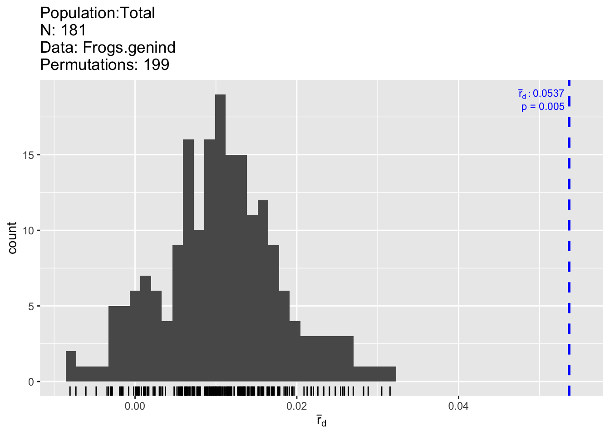
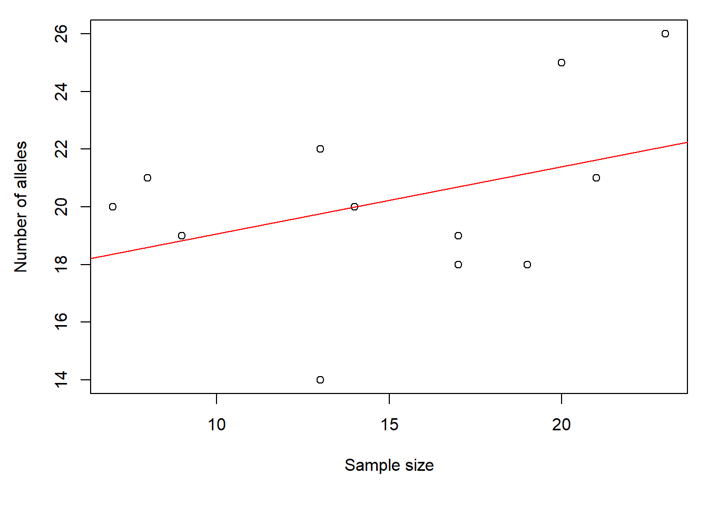
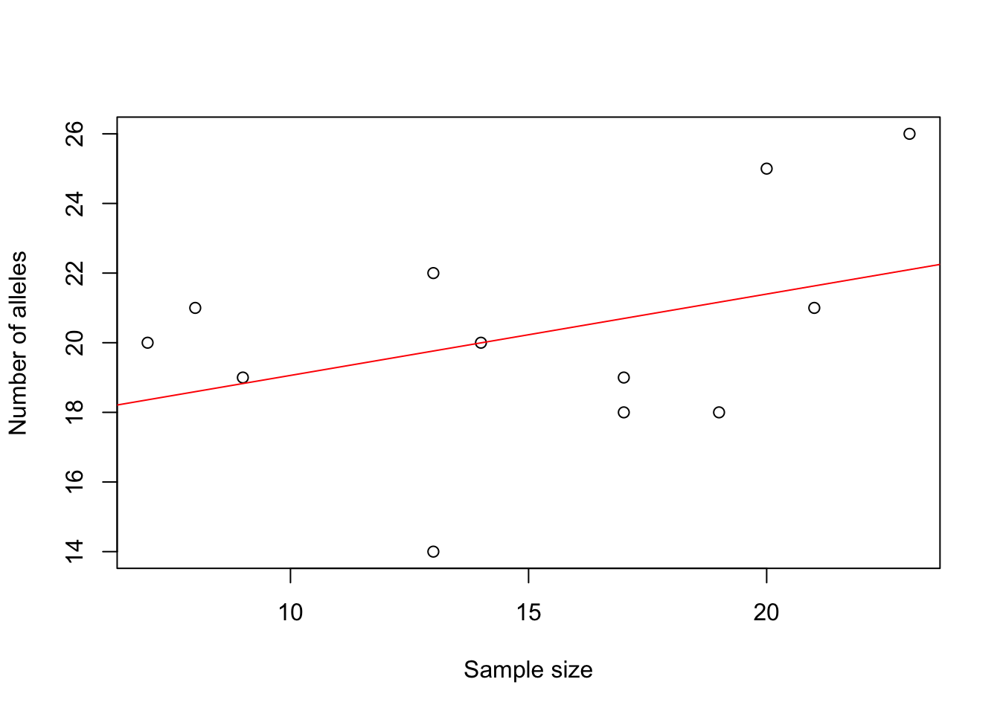

# Week 3: Genetic Diversity {#Week3}

In this week's computer lab, we will learn about how to perform basic population genetic analyses and quantify genetic diversity. Along the way, we will review hypothesis testing and learn about data manipulation in R.  

- [View Course Video](#video_3)
- [Interactive Tutorial 3](#tutorial_3)
- [Worked Example](#WE_3)
- [R Exercise Week 3](#r-exercise-week-3)

Note: Weeks 1 - 8 (Basic Topics) form a streamlined program to aimed at building your R skills. These skills are required for the Advanced Topics. 


## View Course Video{#video_3}


### 1. Embedded Video {-}

- External link: [Week 3 video (Part 1)](https://sho.co/19UT5);  [Week 3 video (Part 2)](https://sho.co/19YDM)
- Transcript: [Download transcript](https://github.com/hhwagner1/DGS_LG_Labs/raw/master/transcripts/Week3_script_v2.pdf)


### Video, Part 1 {-}

<iframe width="800" height="513" src="https://sho.co/19UT5" frameborder="0" allowfullscreen></iframe>

### Video, Part 2 {-}

<iframe width="800" height="513" src="https://sho.co/19YDM" frameborder="0" allowfullscreen></iframe>

### Preview Slides {-}

[Download slides](https://raw.githubusercontent.com/hhwagner1/DGS_LG_Labs/master/docs/Video_slides/Week3_Slides.pdf)


```
## Warning: The `size` argument of `element_rect()` is deprecated as of ggplot2 3.4.0.
## ℹ Please use the `linewidth` argument instead.
## This warning is displayed once every 8 hours.
## Call `lifecycle::last_lifecycle_warnings()` to see where this warning was
## generated.
```


## Interactive Tutorial 3{#tutorial_3}

### 1. List of R commands covered this week {-}

<table class="table table-bordered table-striped table-condensed table-responsive table" style="margin-left: auto; margin-right: auto; width: auto !important; margin-left: auto; margin-right: auto;">
 <thead>
  <tr>
   <th style="text-align:left;position: sticky; top:0; background-color: #FFFFFF;"> Function </th>
   <th style="text-align:left;position: sticky; top:0; background-color: #FFFFFF;"> Package </th>
  </tr>
 </thead>
<tbody>
  <tr>
   <td style="text-align:left;"> table </td>
   <td style="text-align:left;"> base </td>
  </tr>
  <tr>
   <td style="text-align:left;"> range </td>
   <td style="text-align:left;"> base </td>
  </tr>
  <tr>
   <td style="text-align:left;"> split </td>
   <td style="text-align:left;"> base </td>
  </tr>
  <tr>
   <td style="text-align:left;"> length </td>
   <td style="text-align:left;"> base </td>
  </tr>
  <tr>
   <td style="text-align:left;"> nrow, ncol </td>
   <td style="text-align:left;"> base </td>
  </tr>
  <tr>
   <td style="text-align:left;"> sapply </td>
   <td style="text-align:left;"> base </td>
  </tr>
  <tr>
   <td style="text-align:left;"> matrix </td>
   <td style="text-align:left;"> base </td>
  </tr>
  <tr>
   <td style="text-align:left;"> dimnames </td>
   <td style="text-align:left;"> base </td>
  </tr>
  <tr>
   <td style="text-align:left;"> Reduce </td>
   <td style="text-align:left;"> base </td>
  </tr>
  <tr>
   <td style="text-align:left;"> rbind, cbind </td>
   <td style="text-align:left;"> base </td>
  </tr>
  <tr>
   <td style="text-align:left;"> list </td>
   <td style="text-align:left;"> base </td>
  </tr>
  <tr>
   <td style="text-align:left;"> t </td>
   <td style="text-align:left;"> base </td>
  </tr>
  <tr>
   <td style="text-align:left;"> [ , ] </td>
   <td style="text-align:left;"> base </td>
  </tr>
  <tr>
   <td style="text-align:left;"> is.na </td>
   <td style="text-align:left;"> base </td>
  </tr>
  <tr>
   <td style="text-align:left;"> != </td>
   <td style="text-align:left;"> base </td>
  </tr>
  <tr>
   <td style="text-align:left;"> seppop </td>
   <td style="text-align:left;"> adegenet </td>
  </tr>
  <tr>
   <td style="text-align:left;"> propTyped </td>
   <td style="text-align:left;"> adegenet </td>
  </tr>
  <tr>
   <td style="text-align:left;"> apply </td>
   <td style="text-align:left;"> base </td>
  </tr>
  <tr>
   <td style="text-align:left;"> mean </td>
   <td style="text-align:left;"> base </td>
  </tr>
</tbody>
</table>

### 2. General Instructions {-}

#### a) How to access tutorials {-}

Through RStudio Add-in:

- Install course Addins in RStudio: `library(LandGenCourse)`
- In RStudio, click on `Addins` (top menu bar)
- Follow instructions in the Console:
  - type: `require(swirl)` 
  - type: `swirl()` 
  - follow prompts 
  - select course ("Landscape_Genetics_R_Course") and tutorial (Weeks 1 - 8)


#### b) How to complete tutorial {-}

Follow prompts in the RStudio Console.

To stop and resume a tutorial: 

 - to stop and exit swirl, type: `bye()` 
 - to resume where you stopped, type: `swirl()` 

To restart tutorial from beginning: 

 - type:` swirl()` 
 - use a different name 
   (simply add a number, like this: 'MyName2')

#### c) How to submit answers (participating institutions only) {-}

The last prompt will ask whether you would like to submit the log of your tutorial session to Google Forms so that your instructor may evaluate your progress. **This feature is only available for students from participating institutions.**

If you choose 'yes', a form will open in your web browser. Complete and submit the form. 
    
You can submit multiple attempts and the best attempt will be graded. You will receive full marks as long as you answered all questions (i.e. did not use 'skip'). If you used 'skip' because you could not answer a question, please contact your instructor for advice.


	


## Worked Example{#WE_3}

Helene Wagner


#### 1. Overview of Worked Example {-}

##### a. Goals {-} 

This worked example shows how to:

- Check markers and populations (polymorphism, HWE, linkage, null alleles). 
- Assess genetic diversity.
- Aggregate genetic data at the population level.

##### b. Data set {-} 

This is the same data set as used in Weeks 1 & 2.

Microsatellite data for 181 individuals of Colombia spotted frogs (Rana luteiventris) from 12 populations. Site-level spatial coordinates and attributes. The data are a subsample of the full data set analyzed in Funk et al. (2005) and Murphy et al. (2010). Please see the separate introduction to the data set. 

- **ralu.loci**: Data frame with populations and genetic data (181 rows x 9 columns). Included in package 'LandGenCourse'. To load it, type: data(ralu.loci)
- **ralu.site**: Spatial points data frame with spatial coordinates and site variables Included in package GeNetIt'. To load it, type: data(ralu.site)

##### c. Required R packages {-}

All required packages should have been installed already when you installed 'LandGenCourse'.


```r
#require(adegenet)
require(LandGenCourse)
#require(pegas)       
#require(PopGenReport)
require(dplyr)
require(poppr) 
```

#### 2. Basic checking of markers and populations {-}

Before we do landscape genetic analysis, we need to perform a basic population genetic analysis of the genetic data, in order to better understand the nature and quality of the data and to check for underlying assumptions of population genetic models and corresponding methods. 

##### a. Re-create genind object {-} 

Adapted from Week 1 tutorial: 

Note: we use the double colon notation 'package::function(argument)' to indicate, for each function, which package it belongs to (see Week 2 video).


```r
data(ralu.loci, package="LandGenCourse")
Frogs <- data.frame(FrogID = paste(substr(ralu.loci$Pop, 1, 3), 
                                   row.names(ralu.loci), sep="."), ralu.loci)
Frogs.genind <- adegenet::df2genind(X=Frogs[,c(4:11)], sep=":", ncode=NULL, 
                          ind.names= Frogs$FrogID, loc.names=NULL, 
                          pop=Frogs$Pop, NA.char="NA", ploidy=2, 
                          type="codom", strata=NULL, hierarchy=NULL)
Frogs.genind
```

```
## /// GENIND OBJECT /////////
## 
##  // 181 individuals; 8 loci; 39 alleles; size: 55.5 Kb
## 
##  // Basic content
##    @tab:  181 x 39 matrix of allele counts
##    @loc.n.all: number of alleles per locus (range: 3-9)
##    @loc.fac: locus factor for the 39 columns of @tab
##    @all.names: list of allele names for each locus
##    @ploidy: ploidy of each individual  (range: 2-2)
##    @type:  codom
##    @call: adegenet::df2genind(X = Frogs[, c(4:11)], sep = ":", ncode = NULL, 
##     ind.names = Frogs$FrogID, loc.names = NULL, pop = Frogs$Pop, 
##     NA.char = "NA", ploidy = 2, type = "codom", strata = NULL, 
##     hierarchy = NULL)
## 
##  // Optional content
##    @pop: population of each individual (group size range: 7-23)
```

##### b. Check that markers are polymorphic {-}

The genetic resolution depends on the number of markers and their polymorphism. The table above and the summary function for genind objects together provide this information. Now we run the summary function:


```r
summary(Frogs.genind)
```

```
## 
## // Number of individuals: 181
## // Group sizes: 21 8 14 13 7 17 9 20 19 13 17 23
## // Number of alleles per locus: 3 4 4 4 9 3 4 8
## // Number of alleles per group: 21 21 20 22 20 19 19 25 18 14 18 26
## // Percentage of missing data: 10.64 %
## // Observed heterozygosity: 0.1 0.4 0.09 0.36 0.68 0.02 0.38 0.68
## // Expected heterozygosity: 0.17 0.47 0.14 0.59 0.78 0.02 0.48 0.74
```
The output of the summary function shows us the following:

- 8 loci with 3 - 9 alleles (39 in total)
- Expected heterozygosity varies between 0.14 (locus C) and 0.78 (locus E)
- There's a reasonable level of missing values (10.6%) 

##### c. Check for deviations from Hardy-Weinberg equilibrium (HWE) {-}

See also: http://dyerlab.github.io/applied_population_genetics/hardy-weinberg-equilibrium.html

For a very large population (no drift) with random mating and non-overlapping generations (plus a few more assumptions about the mating system), and in the absence of mutation, migration (gene flow) and selection, we can predict offspring genotype frequencies from allele frequencies of the parent generation (Hardy-Weinberg equilibrium). 
In general, we don't expect all of these assumptions to be met (e.g., if we want to study gene flow or selection, we kind of expect that these processes are present). Note: plants often show higher levels of departure from HWE than animals. 

Here are p-values for two alternative tests of deviation from HWE for each locus. Columns:

- **chi^2**: value of the classical chi-squared test statistic
- **df**: degrees of freedom of the chi-squared test
- **Pr(chi^2 >)**: p-value of the chi-squared test ('>' indicates that the alternative is 'greater', which is always the case for a chi-squared test)
- **Pr.exact**: p-value from an exact test based on Monte Carlo permutation of alleles (for diploids only). The default is B = 1000 permutations (set B = 0 to skip this test). 
Here we use the function 'round' with argument 'digits = 3' to round all values to 3 decimals. 


```r
round(pegas::hw.test(Frogs.genind, B = 1000), digits = 3)
```

```
##     chi^2 df Pr(chi^2 >) Pr.exact
## A  40.462  3       0.000    0.000
## B  17.135  6       0.009    0.029
## C 136.522  6       0.000    0.000
## D  83.338  6       0.000    0.000
## E 226.803 36       0.000    0.000
## F   0.024  3       0.999    1.000
## G  12.349  6       0.055    0.006
## H  76.813 28       0.000    0.000
```

Both tests suggest that all loci except for locus "F" are out of HWE globally (across all 181 individuals). Next, we check for HWE of each locus in each population.

Notes on the code: The curly brackets '{ }' below are used to keep the output from multiple lines together in the html file. Function 'seppop' splits the genind object by population. We use 'sapply' to apply the function 'hw.test' from package 'pegas' to each population (see this week's video and tutorial). We set 'B=0' to specify that we don't need any permutations right now. The function 't' takes the transpose of the resulting matrix, which means it flips rows and columns. This works on a matrix, not a data frame, hence we use 'data.matrix' to temporarily interpret the data frame as a matrix. 


```r
# Chi-squared test: p-value
HWE.test <- data.frame(sapply(seppop(Frogs.genind), 
                              function(ls) pegas::hw.test(ls, B=0)[,3]))
HWE.test.chisq <- t(data.matrix(HWE.test))
{cat("Chi-squared test (p-values):", "\n")
round(HWE.test.chisq,3)}
```

```
## Chi-squared test (p-values):
```

```
##                A     B     C     D     E     F     G     H
## Airplane   0.092 0.359 1.000 0.427 0.680 1.000 0.178 0.051
## Bachelor   1.000 0.557 0.576 0.686 0.716 1.000 0.414 0.609
## BarkingFox 0.890 0.136 0.005 0.533 0.739 0.890 0.708 0.157
## Bob        0.764 0.864 0.362 0.764 0.033 1.000 0.860 0.287
## Cache      1.000 0.325 0.046 0.659 0.753 1.000 0.709 0.402
## Egg        1.000 0.812 1.000 1.000 0.156 1.000 0.477 0.470
## Frog       1.000 0.719 0.070 0.722 0.587 1.000 0.564 0.172
## GentianL   0.809 0.059 1.000 0.028 0.560 0.717 0.474 0.108
## ParagonL   1.000 0.054 0.885 0.709 0.868 1.000 0.291 0.000
## Pothole    1.000 1.000 1.000 0.488 0.248 1.000 0.296 0.850
## ShipIsland 0.807 0.497 1.000 0.521 0.006 1.000 0.498 0.403
## Skyhigh    0.915 0.493 0.063 0.001 0.155 1.000 0.126 0.078
```

Let's repeat this with a Monte Carlo permutation test with B = 1000 replicates:


```r
# Monte Carlo: p-value
HWE.test <- data.frame(sapply(seppop(Frogs.genind), 
                              function(ls) pegas::hw.test(ls, B=1000)[,4]))
HWE.test.MC <- t(data.matrix(HWE.test))
{cat("MC permuation test (p-values):", "\n")
round(HWE.test.MC,3)}
```

```
## MC permuation test (p-values):
```

```
##                A     B     C     D     E F     G     H
## Airplane   0.023 1.000 1.000 0.415 0.622 1 0.261 0.004
## Bachelor   1.000 0.448 1.000 1.000 0.871 1 0.497 0.614
## BarkingFox 1.000 0.210 0.074 1.000 0.733 1 1.000 0.163
## Bob        1.000 1.000 1.000 1.000 0.018 1 1.000 0.271
## Cache      1.000 0.395 0.153 1.000 1.000 1 1.000 0.587
## Egg        1.000 1.000 1.000 1.000 0.103 1 0.546 0.445
## Frog       1.000 1.000 0.072 1.000 0.447 1 1.000 0.159
## GentianL   1.000 0.063 1.000 0.071 0.651 1 0.649 0.167
## ParagonL   1.000 0.131 1.000 1.000 1.000 1 0.334 0.077
## Pothole    1.000 1.000 1.000 1.000 0.532 1 0.535 1.000
## ShipIsland 1.000 0.614 1.000 0.683 0.127 1 0.552 0.498
## Skyhigh    1.000 0.374 0.167 0.097 0.127 1 0.072 0.030
```

To summarize, let's calculate, for each locus, the proportion of populations where it was out of HWE. Here we'll use the conservative cut-off of alpha = 0.05 for each test. There are various ways of modifying this, including a simple Bonferroni correction, where we divide alpha by the number of tests, which you can activate here by removing the ### i. front of the line.

We write the results into a data frame 'Prop.loci.out.of.HWE' and use '=' to specify the name for each column. 


```r
alpha=0.05 # /96
Prop.loci.out.of.HWE <- data.frame(Chisq=apply(HWE.test.chisq<alpha, 2, mean), 
           MC=apply(HWE.test.MC<alpha, 2, mean))
Prop.loci.out.of.HWE             # Type this line again to see results table
```

```
##        Chisq         MC
## A 0.00000000 0.08333333
## B 0.00000000 0.00000000
## C 0.16666667 0.00000000
## D 0.16666667 0.00000000
## E 0.16666667 0.08333333
## F 0.00000000 0.00000000
## G 0.00000000 0.00000000
## H 0.08333333 0.16666667
```

And similarly, for each population, the proportion of loci that were out of HWE:


```r
Prop.pops.out.of.HWE <- data.frame(Chisq=apply(HWE.test.chisq<alpha, 1, mean), 
           MC=apply(HWE.test.MC<alpha, 1, mean))
Prop.pops.out.of.HWE             
```

```
##            Chisq    MC
## Airplane   0.000 0.250
## Bachelor   0.000 0.000
## BarkingFox 0.125 0.000
## Bob        0.125 0.125
## Cache      0.125 0.000
## Egg        0.000 0.000
## Frog       0.000 0.000
## GentianL   0.125 0.000
## ParagonL   0.125 0.000
## Pothole    0.000 0.000
## ShipIsland 0.125 0.000
## Skyhigh    0.125 0.125
```
The results suggest that:

- While most loci are out of HWE globally, this is largely explained by subdivision (variation in allele frequencies among local populations indicating limited gene flow). 
- No locus is consistently out of HWE across populations (loci probably not affected by selection).
- No population is consistently out of HWE across loci (probably no recent major bottlenecks/ founder effects).

Let's repeat this with 'false discovery rate' correction for the number of tests. Here we use the function 'p.adjust' with the argument 'method="fdr"' to adjust the p-values from the previous tests. This returns a vector of length 96 (the number of p-values used), which we convert back into a matrix of 12 rows (pops) by 8 columns (loci). Then we procede as above.


```r
Chisq.fdr <- matrix(p.adjust(HWE.test.chisq,method="fdr"), 
                    nrow=nrow(HWE.test.chisq))
MC.fdr <- matrix(p.adjust(HWE.test.MC, method="fdr"), 
                    nrow=nrow(HWE.test.MC))

Prop.pops.out.of.HWE <- data.frame(Chisq=apply(HWE.test.chisq<alpha, 1, mean), 
           MC=apply(HWE.test.MC<alpha, 1, mean),
           Chisq.fdr=apply(Chisq.fdr<alpha, 1, mean),
           MC.fdr=apply(MC.fdr<alpha, 1, mean))
Prop.pops.out.of.HWE             
```

```
##            Chisq    MC Chisq.fdr MC.fdr
## Airplane   0.000 0.250     0.000      0
## Bachelor   0.000 0.000     0.000      0
## BarkingFox 0.125 0.000     0.000      0
## Bob        0.125 0.125     0.000      0
## Cache      0.125 0.000     0.000      0
## Egg        0.000 0.000     0.000      0
## Frog       0.000 0.000     0.000      0
## GentianL   0.125 0.000     0.000      0
## ParagonL   0.125 0.000     0.125      0
## Pothole    0.000 0.000     0.000      0
## ShipIsland 0.125 0.000     0.000      0
## Skyhigh    0.125 0.125     0.125      0
```

After using false discovery rate correction for the 8 * 12 = 96 tests performed, very few combinations of locus and population were out of HWE based on the chi-squared test, and none with the MC test. 

Note: exact results are likely to differ somewhat between runs due to the permutation tests.


##### d. Check for linkage disequilibrium (LD) {-}
See also: https://grunwaldlab.github.io/Population_Genetics_in_R/Linkage_disequilibrium.html

For microsatellite markers, we typically don't know where on the genome they are located. The closer together two markers are on a chromosome, the more likely they are inherited together, which means that they don't really provide independent information. Testing for linkage disequilibrium assesses this, for each pair of loci, by checking whether alleles of two loci are statistically associated.

This step is especially important when developing a new set of markers. You may want to drop (the less informative) one marker of any pair of linked loci. 

Here, we start with performing an overall test of linkage disequilibrium (the null hypothesis is that there is no linkage among the set of markers). Two indices are calculated and tested: an index of association (Ia; Brown et al. 1980) and a measure of correlation (rbarD; Agapow and Burt 2001), which is less biased (see URL above). The number of permutations is specified by 'sample = 199'.

Overall, there is statistically significant association among the markers (p-value: prD = 0.005; also left figure). Recall that the power of a statistical test increases with sample size, and here we have n = 181, hence even a small effect may be statistically significant. Hence we look at effect size, i.e., the actual strength of the pairwise associations (right figure). 


```r
poppr::ia(Frogs.genind, sample=199)
```

```
##         Ia       p.Ia      rbarD       p.rD 
## 0.33744318 0.00500000 0.05366542 0.00500000
```

```r
LD.pair <- poppr::pair.ia(Frogs.genind)
LD.pair
```

```
##          Ia   rbarD
## A:B  0.0485  0.0492
## A:C -0.0314 -0.0335
## A:D  0.1886  0.1966
## A:E  0.0560  0.0569
## A:F -0.0272 -0.0452
## A:G  0.0931  0.0935
## A:H  0.0294  0.0304
## B:C -0.0329 -0.0375
## B:D  0.0903  0.0911
## B:E  0.0910  0.0910
## B:F -0.0013 -0.0025
## B:G  0.0451  0.0452
## B:H  0.0621  0.0623
## C:D -0.0859 -0.1049
## C:E  0.0247  0.0284
## C:F -0.0311 -0.0397
## C:G -0.0107 -0.0118
## C:H  0.0012  0.0015
## D:E  0.0455  0.0458
## D:F  0.0094  0.0199
## D:G  0.0069  0.0070
## D:H  0.0461  0.0462
## E:F  0.0013  0.0025
## E:G  0.0453  0.0454
## E:H  0.2153  0.2159
## F:G  0.0167  0.0299
## F:H  0.0296  0.0606
## G:H  0.0942  0.0953
```



The strongest correlation is around 0.2, for markers E and H. 

Effect size: If rbarD can be interpreted similarly to a linear correlation coefficient r, that would mean that less than 5% of the variation in one marker is shared with the other marker (recall from stats: the amount of variance explained in regression, Rsquared, is the square of the linear correlation coefficient). This is probably not large enough to worry about.  

##### e. Check for null alleles {-}

See also Dakin and Avise (2004): http://www.nature.com/articles/6800545

One potential drawback for microsatellites as molecular markers is the presence of null alleles that fail to amplify, thus they couldn't be detected in the PCR assays.

The function 'null.all' takes a genind object and returns a list with two components ('homozygotes' and 'null.allele.freq'), and each of these is again a list. See '?null.all' for details and choice of method.

List 'homozygotes':
  
- **homozygotes$observed**: observed number of homozygotes for each allele at each locus
- **homozygotes$bootstrap**: distribution of the expected number of homozygotes
- **homozygotes$probability.obs**: probability of observing the number of homozygotes

Note: we are turning off warnings here (currently the code throws a warning for each sample, though results don't seem to be affected).


```r
# Null alleles: depends on method! See help file.
Null.alleles <- PopGenReport::null.all(Frogs.genind)
```

```
## Registered S3 method overwritten by 'GGally':
##   method from   
##   +.gg   ggplot2
```

```
## Registered S3 method overwritten by 'genetics':
##   method      from 
##   [.haplotype pegas
```

```r
Null.alleles$homozygotes$probability.obs
```

```
##   Allele-1 Allele-2 Allele-3 Allele-4 Allele-5 Allele-6 Allele-7 Allele-8
## A    0.128    0.000    0.028       NA       NA       NA       NA       NA
## B    0.144    0.042    0.066    0.007       NA       NA       NA       NA
## C    0.190    0.002    0.000    0.000       NA       NA       NA       NA
## D    0.000    0.001    0.195    0.005       NA       NA       NA       NA
## E    0.050    0.013    0.031    0.260    0.069    0.039    0.729    0.507
## F    0.466    0.005    0.010       NA       NA       NA       NA       NA
## G    0.092    0.077    0.021    0.000       NA       NA       NA       NA
## H    0.463    0.085    0.007    0.024    0.271    0.307    0.003    0.000
##   Allele-9
## A       NA
## B       NA
## C       NA
## D       NA
## E        0
## F       NA
## G       NA
## H       NA
```

List 'null.allele.freq': 
  
- **null.allele.freq$summary1**: null allele frequency estimates based upon the forumulas of Chakraborty et al. (1994)
- **null.allele.freq$summary2**: null allele frequency estimates based upon the forumulas of Brookfield (1996)

From the help file: "Brookfield (1996) provides a brief discussion on which estimator should be used. In summary, it was recommended that Chakraborty et al. (1994)'s method (e.g. summary1) be used if there are individuals with no bands at a locus seen, but they are discounted as possible artefacts. If all individuals have one or more bands at a locus then Brookfield (1996)'s method (e.g. summary2) should be used." In this case, we have many individuals with missing values for both alleles, hence better use summary1.

Each summary table contains a summary with observed, median, 2.5th percentile and 97.5the percentile. The percentiles form a 95% confidence interval. From the help file: "If the 95% confidence interval includes zero, it indicates that the frequency of null alleles at a locus does not significantly differ from zero."


```r
{cat(" summary1 (Chakraborty et al. 1994):", "\n")
round(Null.alleles$null.allele.freq$summary1,2)} 
```

```
##  summary1 (Chakraborty et al. 1994):
```

```
##                       A    B    C    D    E     F    G    H
## Observed frequency 0.24 0.08 0.23 0.25 0.06  0.00 0.11 0.04
## Median frequency   0.24 0.08 0.23 0.24 0.06  0.00 0.11 0.04
## 2.5th percentile   0.08 0.01 0.02 0.17 0.02 -0.01 0.01 0.00
## 97.5th percentile  0.44 0.15 0.48 0.33 0.11  0.00 0.23 0.09
```


```r
{cat("summary2 (Brookfield et al. 1996):", "\n")
round(Null.alleles$null.allele.freq$summary2,2)}   
```

```
## summary2 (Brookfield et al. 1996):
```

```
##                       A    B    C    D    E F    G    H
## Observed frequency 0.06 0.05 0.05 0.17 0.05 0 0.07 0.04
## Median frequency   0.06 0.05 0.05 0.17 0.05 0 0.07 0.03
## 2.5th percentile   0.02 0.01 0.00 0.12 0.02 0 0.01 0.00
## 97.5th percentile  0.11 0.09 0.10 0.23 0.09 0 0.14 0.08
```

For this example, both methods suggest that there may be null alleles in most loci. However, the estimates of the frequency of null alleles differ a lot between the two methods. 

A different approach for estimating null alleles at microsatellite loci, based on the Estimation-Maximization algorithm, is implemented in `FreeNA` (outside of the R environment). `FreeNA` will directly provide Fst values and some other measurements using the corrected allele frequencies: https://www1.montpellier.inra.fr/CBGP/software/FreeNA/

Relevant papers for the Estimation-Maximization algorithm:

- Kalinowski et al. (2006), Conservation Genetics 7:991–995, doi: 10.1007/s10592-006-9134-9.
- Chapuis and Estoup (2007), Mol. Biol. Evol. 24:621–631, doi: 10.1093/molbev/msl191.


##### f. Overall interpretation {-}

- **Spatial genetic structure**: The Columbia spotted frog data used in this lab come from a study area with a great deal of genetic structure.  If we use a population assignment test (see Week 9), each basin is a separate unit with significant substructure within basins. Testing for significant genetic distance, most pairs of ponds have a genetic distance that is significantly different from zero. 
- **HWE**: Therefore, we expect global estimates (i.e., the whole dataset) of He to be out of HWE due to population substructure (HWE assumes panmictic populations). We would also expect data to be out of HWE when analyzing data by basin due to population substructure. We could, then, test HWE and linkage disequilibrium at the pond level (as shown here). However, some ponds have low sample sizes (which refleect a low number of individuals: based on repeated surveys of sites, most if not nearly all animals were captured). 
- **Linkage**: These low samples sizes can result in deviations from HWE and in linkage disequilibrium as an artifact of sample size and/or breeding structure (if one male is responsible for all breeding, his genes would appear “linked” in offspring genotypes, even though they are not physically linked in the genome).  In addition, each pond may not represent a “population”, but only a portion of a population. 

So, what do we do? We can look for patterns.  Are there loci that are consistently out of HWE across samples sites while other loci are not out of HWE suggesting that there are null alleles or other data quality control issues?  With the full data set, this was not the case. Are there loci that are consistently linked across different ponds (while others are not), suggesting that they are linked?  With the full dataset, this was not the case.  

- **Null alleles**: Missing data can imply null (non-amplifying) alleles. In this case, while there are loci that have higher “drop-out” rates than others, this is more likely due to some loci being more difficult to call (the authors were very strict in removing any questionable data; equivocal calls resulting in no data). In addition, some of the samples used in this study were toe clips which with low yields of DNA, resulting in incomplete genotypes. While presence of null alleles is a possibility, genetic structure, breeding patterns at low population size and aggressive quality control of genotypes can all explain the results. Finally, with all of the structure in these data, there are examples (at the basin level and pond level) of unique alleles that are fixed or nearly fixed. When the data are assessed globally, this will result in a similar pattern to the presence of null alleles and will result in positive null allele tests.

#### 3. Assess genetic diversity {-} 

These measures are typically quantified per population. 

##### a. Rarefied allelic richness {-} 

Both nominal sample size (number of frogs sampled) and valid sample size (e.g., for each locus, the number of frogs with non-missing genetic data) vary between sites. We would expect the number of alleles found in a population to increase with the number of individuals genotyped. 

We can check this by plotting the number of alleles against sample size. Here we create an object 'Sum' that contains the summary of the genind object, then we can access its elements by '$' to plot what we need. The function 'names' lists the names of the elements, which reduced the guesswork.


```r
Sum <- adegenet::summary(Frogs.genind)
names(Sum)
```

```
## [1] "n"         "n.by.pop"  "loc.n.all" "pop.n.all" "NA.perc"   "Hobs"     
## [7] "Hexp"
```

The site names are quite long, hence we print the labels vertically by setting 'las=3', and we modify the margins ('mar'). The four numbers give the size of each margin in the following order: bottom, left, top, right. 

We add a regression line to the scatterplot with the function 'abline', where we specify the linear regression model with the function 'lm'. In this case, we model the response 'pop.n.all' as a function of predictor 'n.by.pop'.

The barchart (left) shows that there is considerable variation among ponds in the number of alleles observed across all loci. The scatterplot (right) with the red regression line shows that the number of alleles increases with sample size. 


```r
par(mar=c(5.5, 4.5,1,1))
barplot(Sum$pop.n.all, las=3, 
       xlab = "", ylab = "Number of alleles")
```


```r
plot(Sum$n.by.pop, Sum$pop.n.all, 
       xlab = "Sample size", ylab = "Number of alleles")
abline(lm(Sum$pop.n.all ~ Sum$n.by.pop), col = "red")
```



Hence we should not compare the number of alleles directly. Instead, we'll use rarefied allelic richness (Ar). 

By default, the function 'allel.rich' finds the lowest valid sample size across all populations and loci, and multiplies it by the ploidy level. The number is stored as 'Richness$alleles.sampled' (here: 3 individuals * 2 alleles = 6 alleles). Alternatively, this number can be set with the 'min.alleles' argument.  


```r
Richness <- PopGenReport::allel.rich(Frogs.genind, min.alleles = NULL)
Richness$alleles.sampled
```

```
## [1] 6
```

Populations with more alleles are resampled to determine the average allelic richness among the minimum number of alleles. Here, this means that 6 alleles are sampled from each population, allelic richness is calculated, and the process is repeated many times to determine the average).

Let's plot the results again. The barchart shows that there is considerable variation in genetic diversity among ponds. The scatterplot against sample size (here: for each population, the average number of valid alleles across loci) suggests that the variation is not related to sample size. The regression line (red) is almost horizontal.

Here we plot the average Ar across loci, so that the result does not depend on the number of loci used.


```r
par(mar=c(5.5, 4.5,1,1))
barplot(Richness$mean.richness, las=3, ylab="Rarefied allelic richness (Ar)")
plot(colMeans(Richness$pop.sizes), Richness$mean.richness,
     xlab="Valid sample size", 
     ylab="Rarefied allelic richness (Ar)")
abline(lm(Richness$mean.richness ~ colMeans(Richness$pop.sizes)), col="red")
```


##### b. Observed and expected heterozygosity {-} 

Note: Writing the 'genind' summary into an object 'Sum' allows accessing its attributes by name.


```r
  Sum <- summary(Frogs.genind)
  names(Sum)
```

```
## [1] "n"         "n.by.pop"  "loc.n.all" "pop.n.all" "NA.perc"   "Hobs"     
## [7] "Hexp"
```
  
Expected heterozygosity (here: Hexp) is the heterozygosity expected in a population under HWE, and observed heterozygosity (here: Hobs) is the observed number of heterozygotes at a locus divided by the total number of genotyped individuals. Here are the global values (pooled across all populations):


```r
  par(mar=c(3, 4.5,1,1))
  barplot(Sum$Hexp, ylim=c(0,1), ylab="Expected heterozygosity")
  barplot(Sum$Hobs, ylim=c(0,1), ylab="Observed heterozygosity")
```


By locus and population:

Here we use 'seppop' to split the genind object by population, then 'sapply' to apply function 'summary' to each population.


```r
  Hobs <- t(sapply(seppop(Frogs.genind), function(ls) summary(ls)$Hobs))
  Hexp <- t(sapply(seppop(Frogs.genind), function(ls) summary(ls)$Hexp))
  {cat("Expected heterozygosity (Hexp):", "\n")
  round(Hexp, 2)}
```

```
## Expected heterozygosity (Hexp):
```

```
##               A    B    C    D    E    F    G    H
## Airplane   0.49 0.28 0.00 0.36 0.67 0.00 0.23 0.72
## Bachelor   0.00 0.54 0.32 0.22 0.70 0.00 0.50 0.65
## BarkingFox 0.07 0.25 0.22 0.49 0.63 0.07 0.20 0.33
## Bob        0.14 0.33 0.33 0.14 0.79 0.00 0.10 0.70
## Cache      0.00 0.57 0.38 0.24 0.77 0.00 0.48 0.70
## Egg        0.00 0.39 0.00 0.00 0.79 0.00 0.46 0.72
## Frog       0.00 0.43 0.36 0.44 0.62 0.00 0.50 0.58
## GentianL   0.10 0.66 0.00 0.72 0.80 0.14 0.48 0.73
## ParagonL   0.00 0.19 0.07 0.15 0.29 0.00 0.50 0.57
## Pothole    0.00 0.00 0.00 0.28 0.38 0.00 0.58 0.63
## ShipIsland 0.44 0.49 0.00 0.51 0.60 0.00 0.44 0.66
## Skyhigh    0.04 0.49 0.20 0.34 0.63 0.00 0.52 0.62
```

```r
  {cat("\n", "Observed heterozygosity (Hobs):", "\n")
  round(Hobs, 2)}
```

```
## 
##  Observed heterozygosity (Hobs):
```

```
##               A    B    C    D    E    F    G    H
## Airplane   0.25 0.33 0.00 0.33 0.62 0.00 0.16 0.74
## Bachelor   0.00 0.38 0.40 0.25 0.88 0.00 0.33 0.75
## BarkingFox 0.07 0.14 0.00 0.57 0.79 0.07 0.22 0.23
## Bob        0.15 0.38 0.42 0.15 0.92 0.00 0.11 0.67
## Cache      0.00 0.83 0.00 0.29 1.00 0.00 0.40 0.86
## Egg        0.00 0.41 0.00 0.00 0.87 0.00 0.36 0.87
## Frog       0.00 0.38 0.14 0.56 0.86 0.00 0.33 1.00
## GentianL   0.11 0.95 0.00 0.74 0.90 0.15 0.56 0.84
## ParagonL   0.00 0.11 0.08 0.16 0.33 0.00 0.36 0.47
## Pothole    0.00 0.00 0.00 0.33 0.50 0.00 0.57 0.73
## ShipIsland 0.41 0.41 0.00 0.59 0.53 0.00 0.36 0.71
## Skyhigh    0.04 0.57 0.11 0.30 0.52 0.00 0.77 0.59
```
Locus F shows variation only in two populations (i.e., Hexp = 0 in 10 populations). 

Let's plot the average across all loci for each population:

Here we use 'apply' to apply the function 'mean' to the rows (MARGIN = 1). For columns, use 'MARGIN = 2'.


```r
  par(mar=c(5.5, 4.5, 1, 1))
  Hobs.pop <- apply(Hobs, MARGIN = 1, FUN = mean)
  Hexp.pop <- apply(Hexp, 1, mean) 
  barplot(Hexp.pop, ylim=c(0,1), las=3, ylab="Expected heterozygosity")
  barplot(Hobs.pop, ylim=c(0,1), las=3, ylab="Observed heterozygosity")
```


##### c. Create table with sitel-level genetic diversity measures {-}


```r
Frogs.diversity <- data.frame(Pop = names(Hobs.pop),
                              n = Sum$n.by.pop,
                              Hobs = Hobs.pop,
                              Hexp = Hexp.pop,
                              Ar = Richness$mean.richness)
Frogs.diversity
```

```
##                   Pop  n      Hobs      Hexp       Ar
## Airplane     Airplane 21 0.3038064 0.3433019 1.939629
## Bachelor     Bachelor  8 0.3729167 0.3651953 2.003673
## BarkingFox BarkingFox 14 0.2619811 0.2818609 1.741904
## Bob               Bob 13 0.3504274 0.3171011 1.961791
## Cache           Cache  7 0.4220238 0.3923413 2.085115
## Egg               Egg 17 0.3135918 0.2951215 1.841382
## Frog             Frog  9 0.4079861 0.3659439 1.925469
## GentianL     GentianL 20 0.5296418 0.4529000 2.331599
## ParagonL     ParagonL 19 0.1880302 0.2200536 1.539923
## Pothole       Pothole 13 0.2665043 0.2328137 1.597687
## ShipIsland ShipIsland 17 0.3755252 0.3918983 1.949255
## Skyhigh       Skyhigh 23 0.3632542 0.3552167 1.953610
```

You can save the R object 'Frogs.diversity' with the code below (need to uncomment by removing the hashtags '#'):


```r
#require(here)
#if(!dir.exists(paste0(here(),"/output"))) dir.create(paste0(here(),"/output"))
#save(Frogs.diversity, file = paste0(here(),"/output/Frogs.diversity.RData"))
#load(paste0(here(),"/output/Frogs.diversity.RData"))
```


#### 4. Aggregate genetic data at population level (allele frequencies) {-}

For some analyses, we will need to aggregate data from the individual to the population level, e.g. as a table of allele frequencies per population.

Here we convert the 'genind' object to a 'genpop' object (NOT the same as a 'genepop' object!). This is defined in the package 'adegenet' to hold population-level genetic data. The function 'genind2genpop' obviously converts from 'genind' to 'genpop'.


```r
Frogs.genpop <- adegenet::genind2genpop(Frogs.genind)
```

```
## 
##  Converting data from a genind to a genpop object... 
## 
## ...done.
```

The function 'makefreq' extracts the table with allele frequencies from the 'genpop' object. We'll plot just a few lines and alleles. 


```r
Freq <- adegenet::makefreq(Frogs.genpop)
```

```
## 
##  Finding allelic frequencies from a genpop object... 
## 
## ...done.
```

```r
round(Freq[1:6,1:10], 2)
```

```
##             A.1  A.2  A.3  B.1  B.3  B.2  B.4  C.1  C.2 C.4
## Airplane   0.62 0.35 0.03 0.83 0.17 0.00 0.00 1.00 0.00   0
## Bachelor   1.00 0.00 0.00 0.56 0.06 0.38 0.00 0.80 0.20   0
## BarkingFox 0.96 0.00 0.04 0.86 0.04 0.11 0.00 0.88 0.12   0
## Bob        0.92 0.00 0.08 0.81 0.00 0.12 0.08 0.79 0.21   0
## Cache      1.00 0.00 0.00 0.42 0.00 0.50 0.08 0.75 0.25   0
## Egg        1.00 0.00 0.00 0.74 0.00 0.26 0.00 1.00 0.00   0
```

The allele frequencies of all alleles from the same locus (e.g., A.1, A.2 and A.3) should sum to 1 for each population. With eight loci, the row sums should thus add to 8.


```r
apply(Freq, MARGIN = 1, FUN = sum)    # Just checking
```

```
##   Airplane   Bachelor BarkingFox        Bob      Cache        Egg       Frog 
##          8          8          8          8          8          8          8 
##   GentianL   ParagonL    Pothole ShipIsland    Skyhigh 
##          8          8          8          8          8
```

## R Exercise Week 3

**Task:** Drop offspring (seeds) from dataset `pulsatilla_genotypes.csv`, check for HWE by site and locus and calculate Hexp for each site. 

**Hints:**

a) **Load packages**: Make sure the packages `gstudio`, `dplyr` and `adegenet` are loaded.
b) **Import data**: Re-use your code from Week 1 exercise to import the dataset `pulsatilla_genotypes.csv` into `gstudio`. 
c) **Count genotyped individuals**. Determine the number of rows (and thus genotyped individuals). The dataset contains adults (`OffID == 0`) and genotyped seeds (`OffID != 0`). Determine the number of adults in the dataset. You can achieve this either by subsetting with square brackets [ ], or as a pipe using the function `filter` from the `dplyr` package, followed by `nrow()`.  
d) **Drop offspring from dataset**: Subset the data to retain only the adults, and call it `Pulsatilla.adults`. Again, you can achieve this either by indexing with square brackets, or by using the function `filter` from the `dplyr` package. Check the number of rows (adults).
e) **Split dataset by site**. Use function `split` to split the data by site (population) and create an object `Adults.by.site`. Determine the length of the resulting list, i.e., the number of sub-datasets, one for each site.
f) **Count adults per site with sapply**:  Use `sapply` to calculate the number of rows (and thus genotyped individuals) per site (population). What is the range of sample sizes for adults?
g) **Convert to genind object**: adapt your code from Week 1 exercise to convert the dataset with all adults, `Pulsatilla.adults`, to a `genind` object. Print the object to check that the data have been correctly imported. Is the number of rows equal to the number of adults that you found above? 
h) **Check polymorphism**: Use function `summary` (section 2.b) to check whether markers are polymorphic: what is the range of expected heterozygosity among the loci?
i) **Test for HWE by site and locus**: adapt the code from section 2.c to test for HWE deviations across by site and locus (using chi-square or Monte-Carlo test). How many tests were significant (p-value < 0.05)? Is there a systematic pattern of deviations for a specific locus, or for a specific site? 
k) **Calculate Hexp and Hobs by site**: adapt code from section 3.b to calculate `Hexp` and `Hobs` by site and locus, then take the mean across all loci (`Hexp.pop`, `Hobs.pop`) and combine them into a dataframe `H.pop`. Include the population name as a variable. 
l) **Save result as R object**: Save the object `H.pop` as an R object using the following code:   
`saveRDS(H.pop, file = paste0(here::here(), "/output/H.pop.rds"))`.   
We will need it for a later R exercise.

**Question:** Which site had the lowest expected heterozygosity?


