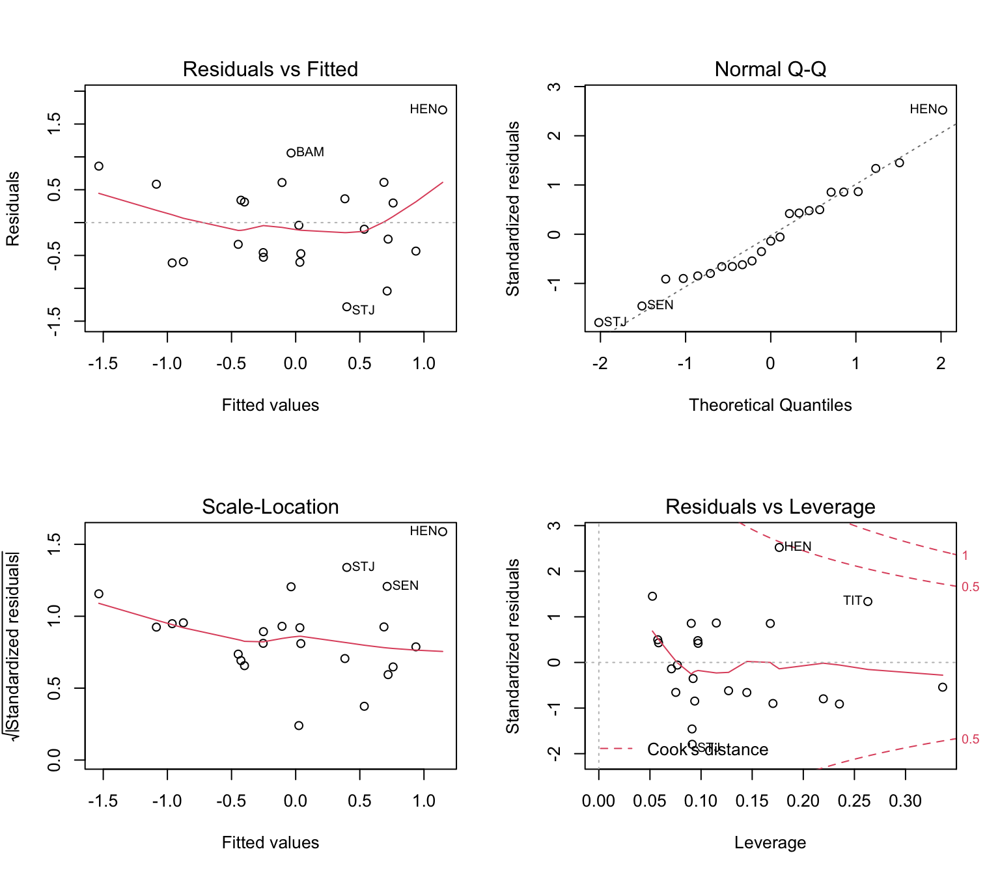
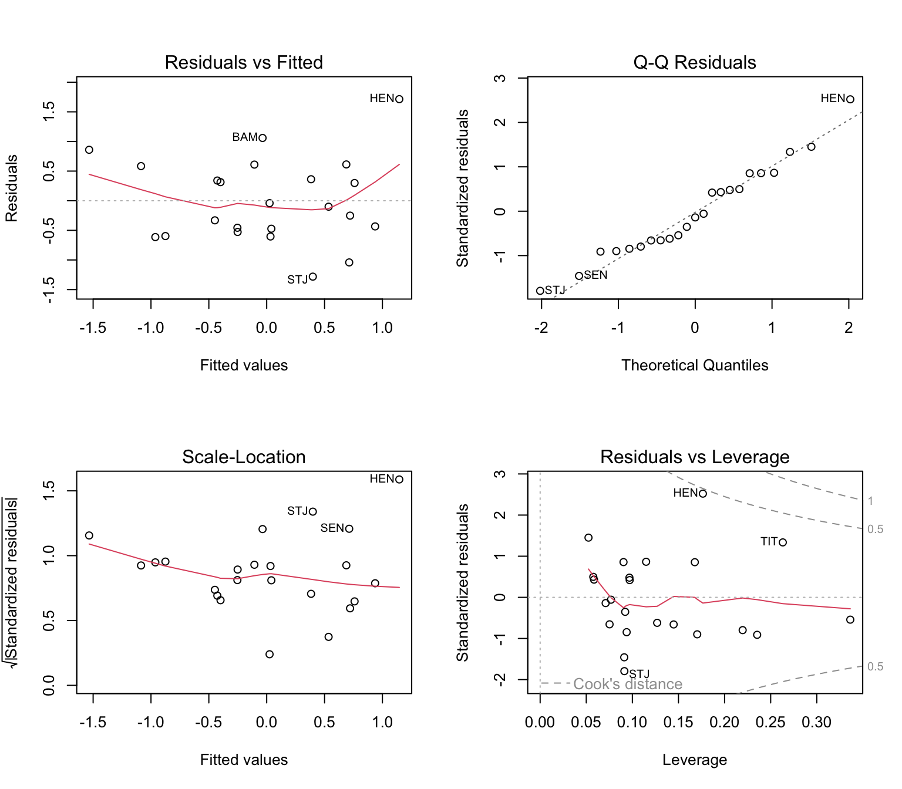
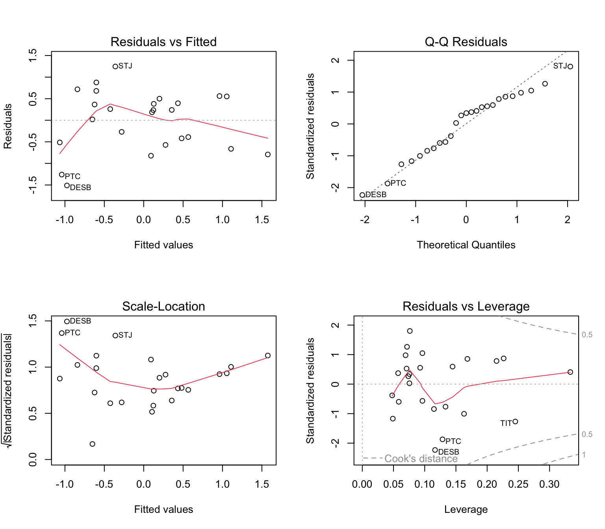
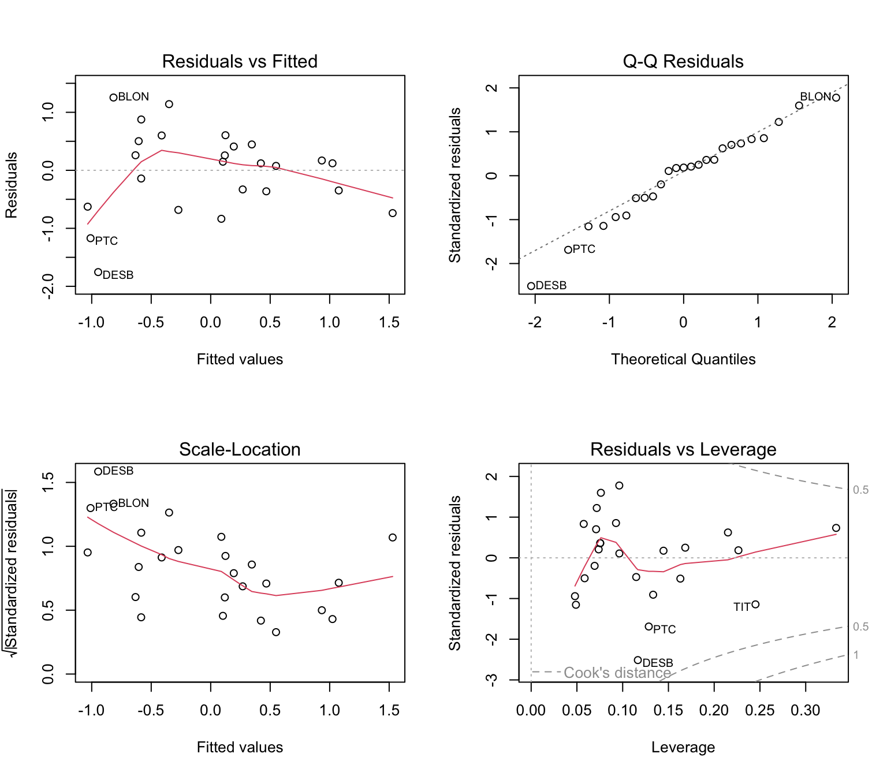

# Week 4: Metapopulations {#Week4}

In this week's computer lab, we will test for genetic effects of metapopulation dynamics. Along the way, we will review regression analysis and learn how to create plots with the `ggplot2` package.  

- [View Course Video](#video_4)
- [Interactive Tutorial 4](#tutorial_4)
- [Worked Example](#WE_4)
- [R Exercise Week 4](#r-exercise-week-4)

Note: Weeks 1 - 8 (Basic Topics) form a streamlined program to aimed at building your R skills. These skills are required for the Advanced Topics. 


## View Course Video{#video_4}


### 1. Embedded Video {-}

- External link: [Week 4 video (Part 1)](https://sho.co/19Y08);  [Week 4 video (Part 2)](https://sho.co/19Y09)
- Transcript: [Download transcript](https://github.com/hhwagner1/DGS_LG_Labs/raw/master/transcripts/Week4_script_v3.pdf)


### Video, Part 1 {-}

<iframe width="800" height="513" src="https://sho.co/19Y08" frameborder="0" allowfullscreen></iframe>

### Video, Part 2 {-}

<iframe width="800" height="513" src="https://sho.co/19Y09" frameborder="0" allowfullscreen></iframe>

### Preview Slides {-}

[Download slides](https://raw.githubusercontent.com/hhwagner1/DGS_LG_Labs/master/docs/Video_slides/Week4_Slides.pdf)


```
## Warning: The `size` argument of `element_rect()` is deprecated as of ggplot2 3.4.0.
## ℹ Please use the `linewidth` argument instead.
## This warning is displayed once every 8 hours.
## Call `lifecycle::last_lifecycle_warnings()` to see where this warning was
## generated.
```


## Interactive Tutorial 4{#tutorial_4}

### 1. List of R commands covered this week {-}

<table class="table table-bordered table-striped table-condensed table-responsive table" style="margin-left: auto; margin-right: auto; width: auto !important; margin-left: auto; margin-right: auto;">
 <thead>
  <tr>
   <th style="text-align:left;position: sticky; top:0; background-color: #FFFFFF;"> Function </th>
   <th style="text-align:left;position: sticky; top:0; background-color: #FFFFFF;"> Package </th>
  </tr>
 </thead>
<tbody>
  <tr>
   <td style="text-align:left;"> ecoslot.SlotName </td>
   <td style="text-align:left;"> EcoGenetics </td>
  </tr>
  <tr>
   <td style="text-align:left;"> sort </td>
   <td style="text-align:left;"> base </td>
  </tr>
  <tr>
   <td style="text-align:left;"> order </td>
   <td style="text-align:left;"> base </td>
  </tr>
  <tr>
   <td style="text-align:left;"> row.names </td>
   <td style="text-align:left;"> base </td>
  </tr>
  <tr>
   <td style="text-align:left;"> rank </td>
   <td style="text-align:left;"> base </td>
  </tr>
  <tr>
   <td style="text-align:left;"> sample </td>
   <td style="text-align:left;"> base </td>
  </tr>
  <tr>
   <td style="text-align:left;"> is.numeric </td>
   <td style="text-align:left;"> base </td>
  </tr>
  <tr>
   <td style="text-align:left;"> cor </td>
   <td style="text-align:left;"> stats </td>
  </tr>
  <tr>
   <td style="text-align:left;"> plot </td>
   <td style="text-align:left;"> graphics </td>
  </tr>
  <tr>
   <td style="text-align:left;"> with </td>
   <td style="text-align:left;"> base </td>
  </tr>
  <tr>
   <td style="text-align:left;"> lm </td>
   <td style="text-align:left;"> stats </td>
  </tr>
  <tr>
   <td style="text-align:left;"> summary </td>
   <td style="text-align:left;"> base </td>
  </tr>
  <tr>
   <td style="text-align:left;"> abline </td>
   <td style="text-align:left;"> graphics </td>
  </tr>
  <tr>
   <td style="text-align:left;"> points </td>
   <td style="text-align:left;"> graphics </td>
  </tr>
  <tr>
   <td style="text-align:left;"> qplot </td>
   <td style="text-align:left;"> ggplot2 </td>
  </tr>
  <tr>
   <td style="text-align:left;"> ggplot </td>
   <td style="text-align:left;"> ggplot2 </td>
  </tr>
  <tr>
   <td style="text-align:left;"> aes </td>
   <td style="text-align:left;"> ggplot2 </td>
  </tr>
  <tr>
   <td style="text-align:left;"> geom_point </td>
   <td style="text-align:left;"> ggplot2 </td>
  </tr>
  <tr>
   <td style="text-align:left;"> geom_smooth </td>
   <td style="text-align:left;"> ggplot2 </td>
  </tr>
  <tr>
   <td style="text-align:left;"> xlab, ylab </td>
   <td style="text-align:left;"> ggplot2 </td>
  </tr>
</tbody>
</table>

### 2. General Instructions {-}

#### a) How to access tutorials {-}

Through RStudio Add-in:

- Install course Addins in RStudio: `library(LandGenCourse)`
- In RStudio, click on `Addins` (top menu bar)
- Follow instructions in the Console:
  - type: `require(swirl)` 
  - type: `swirl()` 
  - follow prompts 
  - select course ("Landscape_Genetics_R_Course") and tutorial (Weeks 1 - 8)


#### b) How to complete tutorial {-}

Follow prompts in the RStudio Console.

To stop and resume a tutorial: 

 - to stop and exit swirl, type: `bye()` 
 - to resume where you stopped, type: `swirl()` 

To restart tutorial from beginning: 

 - type:` swirl()` 
 - use a different name 
   (simply add a number, like this: 'MyName2')

#### c) How to submit answers (participating institutions only) {-}

The last prompt will ask whether you would like to submit the log of your tutorial session to Google Forms so that your instructor may evaluate your progress. **This feature is only available for students from participating institutions.**

If you choose 'yes', a form will open in your web browser. Complete and submit the form. 
    
You can submit multiple attempts and the best attempt will be graded. You will receive full marks as long as you answered all questions (i.e. did not use 'skip'). If you used 'skip' because you could not answer a question, please contact your instructor for advice.


## Worked Example{#WE_4}

Nusha Keyghobadi, Thomas Lamy and Helene Wagner


### 1. Overview of Worked Example {-}

#### a. Goals {-} 

This worked example shows how to:

- Assess the spatial distribution of genetic structure in a metapopulation using hierarchical AMOVA
- Relate site-specific Fst to patch connectivity and population size
- Relate site-specific genetic diversity to explanatory variables (node-level analysis)
- Assess temporal changes (between years for same site) and evidence for extinction events 
- Perform power analysis and sample size calculation for the temporal study

#### b. Data set {-} 

Lamy et al. (2012) sampled the freshwater snail *Drepanotrema depressissimum* in a fragmented landscape of tropical ponds on the island of Guadeloupe in the French West Indies. They used a spatially and temporally stratified sampling design with a total of 25 sites, where 12 sites formed four well-separated clusters of three neighbouring sites each, to study spatial variability, and 12 sites spread across the island were sampled in multiple years to study temporal variability. For each site and year, 22 - 34 individuals were genotyped at ten microsatellite loci. The species is diploid, hermaphroditic, and outcrossed.  

A key characteristic of this system is the presence of a dry and a rainy season. In the dry season, many ponds can dry out, possibly causing extinction of the local snail populations. During the rainy season, ponds refill and can even overflow, thereby becoming connected through the hydrological network. During this rainy season, dispersal between ponds may occur. 

- **dd.genind**: The dataset 'dd.genind' with genetic data for 1270 snails from 42 populations is included in package 'LandGenCourse'. To load it, type: data(dd.genind). 

- **dd.site**: Population-level data from Tables 2 - 5 of Lamy et al. (2012) are available in dataset `dd.site` (with 25 variables) in package `LandGenCourse`. To load it, type: `data(dd.site)`. 

#### Reference {-}

Lamy, T., Pointier, J. P., Jarne, P. and David, P. (2012), Testing metapopulation dynamics using genetic, demographic and ecological data. Molecular Ecology, 21: 1394–1410. doi:10.1111/j.1365-294X.2012.05478.x

#### c. Required R libraries {-}


```r
library(LandGenCourse)
library(methods)
library(dplyr)
#require(tibble)
#require(poppr)
#require(ade4)
#require(pwr)
#require(effsize)
require(sf)
#require(car) 
library(ggplot2)
library(tmap)
```


#### d. Import data {-}

Let's import the genetic data (spatial and temporal data sets combined, 42 combinations of site and year). 

The 'genind' object 'dd.genind' contains individual-level data in the following slots:

- **tab**: a matrix of allele frequencies (one column per allele)
- **loc.fac**: a factor that identifies the locus for each allele
- **loc.n.all**: a vector with the number of alleles per locus
- **all.names**: a list with allele names
- **ploidy**: a vector with the ploidy of each individual (row)
- **type**: marker type (here: "codom" as microsatellites are codominant)
- **other**: a list with additional variables, here: spatial coordinates
  - **xy**: a data frame with spatial coordinates (lat-long format)
- **call**: call that created the object. Here it is empty.
- **pop*: a factor with the population of each individual. Here it is empty as the information is in @strata.
- **strata**: a data frame with structure variables, here: SiteID, SITE, YEAR, Cluster
- **hierarchy**: a hierarchy. Here it is empty as the information is in @strata.


```r
data(dd.genind, package = "LandGenCourse")
dd.genind
```

```
## Loading required package: adegenet
```

```
## Loading required package: ade4
```

```
## 
##    /// adegenet 2.1.10 is loaded ////////////
## 
##    > overview: '?adegenet'
##    > tutorials/doc/questions: 'adegenetWeb()' 
##    > bug reports/feature requests: adegenetIssues()
```

```
## /// GENIND OBJECT /////////
## 
##  // 1,270 individuals; 10 loci; 372 alleles; size: 2.2 Mb
## 
##  // Basic content
##    @tab:  1270 x 372 matrix of allele counts
##    @loc.n.all: number of alleles per locus (range: 18-50)
##    @loc.fac: locus factor for the 372 columns of @tab
##    @all.names: list of allele names for each locus
##    @ploidy: ploidy of each individual  (range: 2-2)
##    @type:  codom
##    @call: NULL
## 
##  // Optional content
##    @strata: a data frame with 4 columns ( SiteID, SITE, YEAR, Cluster )
##    @other: a list containing: xy
```

We also import site-level data from Tables 2 - 5 in Lamy et al. (2012). This is a (spatial) `sf` object. Use '?dd.site' to check the helpfile with the data set description of the variables (atribute data).


```r
data(dd.site, package = "LandGenCourse")
tibble::as_tibble(dd.site)
```

```
## # A tibble: 42 × 23
##    SiteID   SITE   YEAR Spatial MultiYear APE   Cluster     n    RA    He      f
##    <chr>    <fct> <int> <lgl>   <lgl>     <lgl> <fct>   <int> <dbl> <dbl>  <dbl>
##  1 PICO2006 PICO   2006 FALSE   TRUE      FALSE <NA>       34  11.2 0.897  0.038
##  2 PICO2007 PICO   2007 FALSE   TRUE      FALSE <NA>       24  11.4 0.911  0.022
##  3 PICO2009 PICO   2009 TRUE    TRUE      FALSE <NA>       32  11.4 0.896  0.024
##  4 ROC2006  ROC    2006 TRUE    TRUE      FALSE <NA>       32  11.2 0.831  0.005
##  5 ROC2007  ROC    2007 FALSE   TRUE      FALSE <NA>       32  11.0 0.82   0.018
##  6 SEN2006  SEN    2006 FALSE   TRUE      FALSE <NA>       32  11.2 0.876 -0.008
##  7 SEN2007  SEN    2007 TRUE    TRUE      FALSE <NA>       30  11.6 0.88   0.046
##  8 VEE2006  VEE    2006 FALSE   TRUE      FALSE <NA>       31  10.5 0.864  0.034
##  9 VEE2007  VEE    2007 FALSE   TRUE      FALSE <NA>       32  11.3 0.854  0.044
## 10 VEE2008  VEE    2008 TRUE    TRUE      FALSE <NA>       31  11.2 0.871  0.014
## # ℹ 32 more rows
## # ℹ 12 more variables: s <dbl>, Type <fct>, FST.GESTE <dbl>, Size <dbl>,
## #   V <dbl>, C <dbl>, Stab <dbl>, D <int>, APA <int>, NLT <dbl>,
## #   Fst.temp <dbl>, geometry <POINT [°]>
```

```r
?dd.site
```

**Questions**: with the help file for 'dd.site', check the meaning of the following explanatory variables:

- What does 'APE' refer to, and how is it different from 'APA'?
- What does 'NLT' represent, and is it calculated independently from 'Size'?
- What does 'Type' mean, and what about 'V' and 'D'?
- To understand how connectivity 'C' and stability 'Stab' were calculated, you'll need to consult Lamy et al. (2012).

**Your hypothesis**: which explanatory variables would you expect to affect:

- Genetic diversity within local populations?
- Genetic differentiation among local populations?
- Both?

In the following, we'll perform three types of analyses:

- Compare 25 populations in space, across the island of Guadeloupe.
- Compare 12 populations in 4 clusters: differentiation within vs. among clusters?
- Compare 12 sites over time, some of which experienced a local extinction event.

### 2. Spatial distribution of genetic structure {-}

How similar are populations from nearby habitat patches compared to populations across the island? To answer this question, we perform a hiearchical AMOVA (analysis of molecular variance) with individuals from 12 populations that form 4 clusters with 3 populations each. 

#### a. Subsetting the 'genind' object {-}

First, we need to extract the samples that belong to the hierarchical data set. There are four clusters: "North", "East", "Center" and "South". We are looking for the observations where the variable "Cluster" has one of these four values, all other observations will have a missing value for "Cluster". We can use '!is.na' to identify the rows with non-missing values. Because a genind object is at its core a data frame `@tab` with rows (individuals) and columns(alleles), we can subset rows or columns. Here we subset rows.


```r
dd.genind.Cluster <- dd.genind[!is.na(dd.genind@strata$Cluster),]
```

#### b. Hierarchical AMOVA {-} 

There are several implementations of AMOVA in R, e.g. in pacakges 'ade4', 'pegas' and 'vegan'. The 'ade4' implementation is closest to the original implementation in Arlequin. Package 'poppr' has a wrapper function 'poppr.amova' that makes it easy to perform AMOVA with the 'ade4' or with the 'pegas' implementation (see '?poppr.amova' for a discussion of their pros and cons). Here we'll use 'ade4'.

- The first argument is the 'genind' object. 
- The argument 'hier' defines the hierarchy, with the top level first  (i.e., here SITE is nested within Cluster). The variables are expected to be found in the `@strata` slot of the 'genind' object. 
- The argument 'within=FALSE' specifies that within-individual variance (i.e., observed heterozygosity) should not be tested. Setting this to 'TRUE' can lead to problems with missing values. 

First we run the AMOVA and estimate the percent of molecular variance at each hierarchical level.


```r
amova.result <- poppr::poppr.amova(dd.genind.Cluster, hier = ~ Cluster/SITE, 
                                   within=FALSE, method = "ade4")
```

```
## Registered S3 method overwritten by 'pegas':
##   method      from
##   print.amova ade4
```

```
## 
##  No missing values detected.
```

```r
amova.result
```

```
## $call
## ade4::amova(samples = xtab, distances = xdist, structures = xstruct)
## 
## $results
##                                 Df     Sum Sq   Mean Sq
## Between Cluster                  3   67.27429 22.424764
## Between samples Within Cluster   8  158.37917 19.797396
## Within samples                 353 1563.08216  4.427995
## Total                          364 1788.73562  4.914109
## 
## $componentsofcovariance
##                                                 Sigma           %
## Variations  Between Cluster                0.02770227   0.5582719
## Variations  Between samples Within Cluster 0.50644882  10.2062461
## Variations  Within samples                 4.42799478  89.2354820
## Total variations                           4.96214587 100.0000000
## 
## $statphi
##                             Phi
## Phi-samples-total   0.107645180
## Phi-samples-Cluster 0.102635446
## Phi-Cluster-total   0.005582719
```

Then we test whether each variance component is statistically significant (i.e., significantly larger than zero).

Note: if this takes very long, you can set `nrepet = 199` for this exercise (not for your research).


```r
amova.test <- ade4::randtest(amova.result, nrepet = 999)
amova.test
```

```
## class: krandtest lightkrandtest 
## Monte-Carlo tests
## Call: randtest.amova(xtest = amova.result, nrepet = 999)
## 
## Number of tests:   3 
## 
## Adjustment method for multiple comparisons:   none 
## Permutation number:   999 
##                         Test        Obs   Std.Obs   Alter Pvalue
## 1  Variations within samples 4.42799478 -83.02094    less  0.001
## 2 Variations between samples 0.50644882  57.00872 greater  0.001
## 3 Variations between Cluster 0.02770227   1.65192 greater  0.066
```

**Questions**: 

- At what level is there stronger differentiation, within or among clusters? 
- What does this mean biologically?
- Are both levels statistically significant?

### 3. What determines genetic differentiation among sites? {-} 

What factors explain site-specific Fst? Let's consider the key micro-evolutionary processes:

- **Genetic drift**: the smaller the population, the higher the rate of drift, hence we expect higher differention for small populations. Predictor: long-term population size 'NLT'.
- **Gene flow**: gene flow homogenizes allele frequencies, hence we expect less differentiation for well connected patches. Predictors: connectivity 'C', density of favorable habitat 'D' (within 2 km radius).

First, we create a new `sf` object with the subset of data for the spatial analysis (25 ponds, one year each).


```r
dd.spatial <- dd.site[dd.site$Spatial==TRUE,]
```

#### a. Correlation matrix {-}

Let's start with a correlation matrix. 

- First, we need to drop the geometry from the `sf` object with `st_drop_geometry`. This will return a data frame `dd.df` with the attribute data. 
- We select the variables that we want to correlate with the function `cor`.
- The attribute `use` of the function `cor` defines how to handle missing values. `use="pairwise.complete"` means that for each pair of variables, those individuals with no missing values for these variable will be used. See help file `?cor` for alternatives.


```r
dd.df <- st_drop_geometry(dd.spatial)
cor(dd.df[ , c("FST.GESTE", "NLT", "C", "D")], use="pairwise.complete")
```

```
##             FST.GESTE         NLT           C           D
## FST.GESTE  1.00000000 -0.48565247 -0.43104600  0.02768978
## NLT       -0.48565247  1.00000000 -0.08369541  0.10242973
## C         -0.43104600 -0.08369541  1.00000000 -0.32078070
## D          0.02768978  0.10242973 -0.32078070  1.00000000
```

**Questions**: 

- Is there genetic evidence for higher drift in small populations?
- Is there genetic evidence for higher gene flow among well connected patches?
- Are the two factors confounded for this data set?
- Would you prefer 'C' or 'D' to quantify patch connectivity? Does it matter? What does this mean biologically?

#### b. Scatterplots {-}

Let's plot the response variable FST.GESTE against each of the two predictors NLT and C. Here, we use functions from the package `ggplot2` (already loaded) to define two ggplot objects `NLT.plot` and `C.plot`, then we plot them side-by-side with the function `cowplot::plot_grid`. 

- For NLT.plot, we define the dataset as `dd.spatial@data`, the x-axis as variable NLT, the y-axis as variable FST.GESTE, and the labels as variable SITE. 
- We add points with geom_point.
- We add a regression line (`geom_smooth`), make it linear (`method = lm`) and add a shaded area for plus/minus 1 SE of the mean for a given value of x (`se = TRUE`).
- We add backfilled labels (`geom_label`), define their size (`size`), and move them up a little along the y-axis (`nudge_y`)


```r
NLT.plot <- ggplot(dd.df, aes(x=NLT, y=FST.GESTE)) + 
  geom_point() + 
  geom_smooth(formula = 'y ~ x', method = lm, se = TRUE) +
  geom_text(aes(x=NLT, y=FST.GESTE, label=SITE), size=2, nudge_x=0, nudge_y=0.01, check_overlap=TRUE)

C.plot <- ggplot(dd.df, aes(x=C, y=FST.GESTE)) + 
  geom_point() +
  geom_smooth(formula = 'y ~ x', method = lm, se = TRUE) +
  geom_text(aes(x=C, y=FST.GESTE, label=SITE), size=2.5, nudge_x=0, nudge_y=0.01, check_overlap=TRUE)

cowplot::plot_grid(NLT.plot, C.plot)
```


#### c. Regression model {-}

The two predictors 'NLT' and 'C' are not strongly correlated. We'll fit a regression model with both predictors. Here we use function 'scale' to standardize each variable, so that we can interpret the regression slope coefficients as partial correlation coefficients (beta coefficients). 


```r
mod.diff <- lm(scale(FST.GESTE) ~ scale(NLT) + scale(C), 
               data=dd.spatial)
summary(mod.diff)
```

```
## 
## Call:
## lm(formula = scale(FST.GESTE) ~ scale(NLT) + scale(C), data = dd.spatial)
## 
## Residuals:
##     Min      1Q  Median      3Q     Max 
## -1.0576 -0.4142 -0.1361  0.2653  2.2394 
## 
## Coefficients:
##               Estimate Std. Error t value Pr(>|t|)   
## (Intercept) -2.576e-17  1.535e-01   0.000  1.00000   
## scale(NLT)  -5.254e-01  1.572e-01  -3.342  0.00296 **
## scale(C)    -4.750e-01  1.572e-01  -3.021  0.00628 **
## ---
## Signif. codes:  0 '***' 0.001 '**' 0.01 '*' 0.05 '.' 0.1 ' ' 1
## 
## Residual standard error: 0.7676 on 22 degrees of freedom
## Multiple R-squared:  0.4599,	Adjusted R-squared:  0.4108 
## F-statistic: 9.367 on 2 and 22 DF,  p-value: 0.00114
```

Is the model valid? Let's check the residual plots. 

Here's a link to a great resource about the interpretation of these plots generated by R: http://strata.uga.edu/6370/rtips/regressionPlots.html


```r
par(mfrow=c(2,2))
plot(mod.diff, labels.id = dd.spatial$SITE)
```


```r
par(mfrow=c(1,1))
```

If we had more than two predictors, it would be a good idea to calculate variance inflation factors. The package 'car' has a function 'vif' that takes as argument a fitted model. Here, both predictors have VIF = 1.007, which indicates no collinearity. 


```r
car::vif(mod.diff)
```

```
## scale(NLT)   scale(C) 
##   1.007054   1.007054
```

#### d. Which populations don't fit the general pattern? {-}

Let's plot the residuals in space. The function `tm_bubbles` from the package 'sf' evaluates the projection information of the `sf` object 'dd.spatial'. First, we need to create some new variables:

- Add the residuals as variable to dd.spatial. 
- Add the absolute valuel of the residuals as another variable. 
- Create an index variable `a` that identifies potential outliers (here: absolute value > 1.5)


```r
dd.spatial$Residuals <- mod.diff$residuals
dd.spatial$Absolute <- abs(mod.diff$residuals)

a <- which(dd.spatial$Absolute > 1.5)
```

Now we can create a bubble plot with the size of the bubble proportional to the absolute value of the residual, and the color according to the sign (positive or negative). For the latter, we use the argument `breaks`. Here, any value between -Inf and 0 will be plotted in red, and any value between 0 and Inf will be plotted in blue. 

In addition, we label the two largest outliers (with absolute values >1.5) and position the labels with the argument `just`. Here, `just=c(0.7,2.5)` means that the labels are placed at 0.7 along the horizontal axes and at 2.5 along the vertical axis, compared to the point location. This requires some playing around with values.


```r
tmap_mode("plot")
```

```
## tmap mode set to plotting
```

```r
Map1 <- tm_shape(dd.spatial) + tm_bubbles(size="Absolute",col="Residuals", 
                                  breaks=c(-Inf, 0, Inf), palette=c("red", "blue")) +
  tm_shape(dd.spatial[a,]) + tm_text(text="SITE", size=0.8, just=c(0.7,2.5))

Map1
```



Export this map as a pdf file. (Un-comment the lines below to run the code below, i.e., remove the hashtag symsbols '#').


```r
#if(!dir.exists(here::here("output"))) dir.create(here::here("output"))
#tmap_save(Map1, file=here::here("output/ResidualMap.pdf"), width = 7, height = 5.5, units = "in",  dpi = 300)
```

By changing the mode to view, we can create convert the map into an interactive plot with a background map from the internet (see Week 2).

Un-comment the lines below to run the code.


```r
#tmap_mode("view")
#Map1
```


What might explain the large residuals for the two sites 'PTC' and 'DESB'?

- Site 'PTC' lies on the tip of a peninsula and thus is very isolated geographically.
- Site 'DESB' is a very instable site that can frequently dry out during the dry season, as it is shallow and lies in the comparatively dry northern part of the island. In addition, although 'DESB' is surrounded by many ponds, these ponds never get connected to 'DESB' hydrologically during the rainy season. Therefore, immigration can only occur via cattle or birds, which are much less important drivers of gene flow than immigration by hydrological connectivity during the rainy season.  

#### e. Regression model without outliers {-}

We can use the same index `a` to exclude the potential outliers from the regression model:


```r
mod.diff.minus2 <- lm(scale(FST.GESTE) ~ scale(NLT) + scale(C), 
               data=dd.spatial[-a,])
summary(mod.diff.minus2)
```

```
## 
## Call:
## lm(formula = scale(FST.GESTE) ~ scale(NLT) + scale(C), data = dd.spatial[-a, 
##     ])
## 
## Residuals:
##     Min      1Q  Median      3Q     Max 
## -1.2815 -0.5002 -0.1009  0.4732  1.7142 
## 
## Coefficients:
##               Estimate Std. Error t value Pr(>|t|)   
## (Intercept)  3.490e-17  1.562e-01   0.000  1.00000   
## scale(NLT)  -5.096e-01  1.622e-01  -3.142  0.00514 **
## scale(C)    -5.761e-01  1.622e-01  -3.552  0.00200 **
## ---
## Signif. codes:  0 '***' 0.001 '**' 0.01 '*' 0.05 '.' 0.1 ' ' 1
## 
## Residual standard error: 0.7493 on 20 degrees of freedom
## Multiple R-squared:  0.4896,	Adjusted R-squared:  0.4386 
## F-statistic: 9.593 on 2 and 20 DF,  p-value: 0.001199
```

- Did omitting the two sites improve model fit?
- Did it change the nature of the results?
- Does this affect the biological interpretation?


```r
par(mfrow=c(2,2))
plot(mod.diff.minus2, labels.id = dd.spatial$SITE[-a])
```



```r
par(mfrow=c(1,1))
```


### 4. What determines genetic diversity? {-}

- Can the same predictors (population size and connectivity) explain genetic diversity? 
- Is patch size ('Size') a good proxy for population size (as often used in ecological studies)?
- Which measure of genetic diversity shows the stronger response, allelic richness (rarefied) or expected heterozygosity?

#### a. Correlation matrix {-}


```r
cor(dd.df[, c("RA", "He", "Size", "NLT", "C", "D")],
    use="pairwise.complete")
```

```
##               RA          He       Size         NLT           C           D
## RA    1.00000000  0.95151016  0.3482453  0.51343861  0.46576979 -0.09856668
## He    0.95151016  1.00000000  0.3057086  0.49851503  0.45206733 -0.09593604
## Size  0.34824532  0.30570855  1.0000000  0.76128271 -0.17765815  0.30002700
## NLT   0.51343861  0.49851503  0.7612827  1.00000000 -0.08369541  0.10242973
## C     0.46576979  0.45206733 -0.1776581 -0.08369541  1.00000000 -0.32078070
## D    -0.09856668 -0.09593604  0.3000270  0.10242973 -0.32078070  1.00000000
```

**Questions**: 

- How strongly are the two diversity measures 'RA' and 'He' correlated?
- Are 'NLT' and 'C' strongly correlated with the diversity measures 'RA' and 'He'? 
- Is the correlation with 'Size' similarly strong as the correlation with 'NLT'? 
- How strongly are 'Size' and 'NLT' correlated with each other? 
- Does 'D' show a stronger correlation with diversity than with differentiation?

#### b. Regression models {-}

For allelic richness:


```r
mod.RA <- lm(scale(RA) ~ scale(NLT) + scale(C), data = dd.spatial)
summary(mod.RA)
```

```
## 
## Call:
## lm(formula = scale(RA) ~ scale(NLT) + scale(C), data = dd.spatial)
## 
## Residuals:
##     Min      1Q  Median      3Q     Max 
## -1.5115 -0.5140  0.2356  0.4995  1.2462 
## 
## Coefficients:
##               Estimate Std. Error t value Pr(>|t|)   
## (Intercept) -1.238e-16  1.441e-01   0.000  1.00000   
## scale(NLT)   5.563e-01  1.476e-01   3.770  0.00106 **
## scale(C)     5.123e-01  1.476e-01   3.472  0.00217 **
## ---
## Signif. codes:  0 '***' 0.001 '**' 0.01 '*' 0.05 '.' 0.1 ' ' 1
## 
## Residual standard error: 0.7204 on 22 degrees of freedom
## Multiple R-squared:  0.5243,	Adjusted R-squared:  0.481 
## F-statistic: 12.12 on 2 and 22 DF,  p-value: 0.0002825
```


```r
par(mfrow=c(2,2))
plot(mod.RA, labels.id = dd.spatial$SITE)
```



```r
par(mfrow=c(1,1))
```

For gene diversity (expected heterozygosity):


```r
mod.He <- lm(scale(He) ~ scale(NLT) + scale(C), data = dd.spatial)
summary(mod.He)
```

```
## 
## Call:
## lm(formula = scale(He) ~ scale(NLT) + scale(C), data = dd.spatial)
## 
## Residuals:
##     Min      1Q  Median      3Q     Max 
## -1.7545 -0.3619  0.1211  0.4458  1.2550 
## 
## Coefficients:
##               Estimate Std. Error t value Pr(>|t|)   
## (Intercept) -1.381e-16  1.486e-01   0.000  1.00000   
## scale(NLT)   5.401e-01  1.522e-01   3.549  0.00180 **
## scale(C)     4.973e-01  1.522e-01   3.268  0.00352 **
## ---
## Signif. codes:  0 '***' 0.001 '**' 0.01 '*' 0.05 '.' 0.1 ' ' 1
## 
## Residual standard error: 0.7429 on 22 degrees of freedom
## Multiple R-squared:  0.4941,	Adjusted R-squared:  0.4481 
## F-statistic: 10.74 on 2 and 22 DF,  p-value: 0.0005559
```


```r
par(mfrow=c(2,2))
plot(mod.He, labels.id = dd.spatial$SITE)
```



```r
par(mfrow=c(1,1))
```

### 5. Are genetic differentiation and diversity related? {-}

Would you expect a relationship between genetic diversity and genetic differentiation of individual patches?

Lets examine the correlation between gene diversity (He) and site-specific Fst:


```r
cor(dd.site$He, dd.site$FST.GESTE, use = "pairwise.complete")
```

```
## [1] -0.9567184
```

There are a number of possible reasons for such a correlation. Can you put forward some hypotheses to explain this relationship? See Lamy et al. (2012) for their interpretation.


### 6. Effect of recent extinction events {-}

Several patches fell dry between observation years, which is assumed to signify extinction of the local population. Does genetic evidence support this interpretation, i.e., is there genetic evidence of bottlenecks or founder effects in *D. depressissimum*?


#### a. Effect of patch extinction event (temporal data set) {-}


```r
dd.temporal <- dd.site[dd.site$MultiYear==TRUE,]
dd.temporal.df <- sf::st_drop_geometry(dd.temporal)
cor(dd.temporal.df[, c("Fst.temp", "APE", "NLT", "C")], use="pairwise.complete")
```

```
##            Fst.temp         APE         NLT          C
## Fst.temp  1.0000000  0.29379662 -0.10494809 -0.3356817
## APE       0.2937966  1.00000000 -0.07420821 -0.4927664
## NLT      -0.1049481 -0.07420821  1.00000000  0.3103541
## C        -0.3356817 -0.49276638  0.31035409  1.0000000
```

We can compare a number of competing models using the Akaike Information Criterion (AIC). Models with lower AIC are better (see Week 12).


```r
mod.Fst.temp <- lm(scale(Fst.temp) ~ scale(APE), data=dd.temporal.df)
summary(mod.Fst.temp)
```

```
## 
## Call:
## lm(formula = scale(Fst.temp) ~ scale(APE), data = dd.temporal.df)
## 
## Residuals:
##     Min      1Q  Median      3Q     Max 
## -1.0290 -0.5094 -0.3566  0.2140  2.0886 
## 
## Coefficients:
##             Estimate Std. Error t value Pr(>|t|)
## (Intercept) -0.04099    0.29246  -0.140    0.891
## scale(APE)   0.27599    0.28396   0.972    0.354
## 
## Residual standard error: 1.003 on 10 degrees of freedom
##   (17 observations deleted due to missingness)
## Multiple R-squared:  0.08632,	Adjusted R-squared:  -0.005052 
## F-statistic: 0.9447 on 1 and 10 DF,  p-value: 0.354
```

```r
mod.Fst.temp.C <- lm(scale(Fst.temp) ~ scale(APE) + scale(C), 
                     data=dd.temporal.df)
mod.Fst.temp.NLT <- lm(scale(Fst.temp) ~ scale(APE) + scale(NLT), 
                       data=dd.temporal.df)
mod.Fst.temp.both <- lm(scale(Fst.temp) ~ scale(APE) + scale(NLT) + scale(C),  
            data=dd.temporal.df)
AIC(mod.Fst.temp, mod.Fst.temp.C, mod.Fst.temp.NLT, mod.Fst.temp.both)
```

```
##                   df      AIC
## mod.Fst.temp       3 37.92714
## mod.Fst.temp.C     4 39.27770
## mod.Fst.temp.NLT   4 39.83549
## mod.Fst.temp.both  5 41.27462
```

The best model includes neither 'C' nor 'NLT'. Note that 'APE' is a binary variable, so in essence we're performing a t-test here.


```r
res.Fst.temp <- t.test(Fst.temp ~ APE, data=dd.temporal, alternative = "less")
res.Fst.temp
```

```
## 
## 	Welch Two Sample t-test
## 
## data:  Fst.temp by APE
## t = -0.94604, df = 7.893, p-value = 0.1861
## alternative hypothesis: true difference in means between group FALSE and group TRUE is less than 0
## 95 percent confidence interval:
##        -Inf 0.01085372
## sample estimates:
## mean in group FALSE  mean in group TRUE 
##              0.0080              0.0192
```

#### b. Power analysis {-}

The effect is not statistically significant. Does that mean that we found no effect of apparent population extinctions on temporal Fst? Let's check effect size. For means, Cohen's effect size is measured by d (which is measured in units of standard deviations):

- small effect: d > 0.2 (means at least 0.2 standard deviations apart)
- medium effect: d > 0.5
- large effect: d > 0.8 

We can let R calculate effect size for us:


```r
effsize::cohen.d(Fst.temp ~ factor(APE), data=dd.temporal.df)
```

```
## 
## Cohen's d
## 
## d estimate: -0.5691221 (medium)
## 95 percent confidence interval:
##      lower      upper 
## -1.8992165  0.7609722
```

So, we actually found a 'medium' effect (more than 0.5 standard deviations difference between group means). Maybe sample size was too small to have sufficient power?

Let's check sample size:


```r
table(dd.temporal$APE[!is.na(dd.temporal.df$Fst.temp)])
```

```
## 
## FALSE  TRUE 
##     7     5
```

Ah, that explains a lot. There were only 5 sites with apparent extinction, and 7 without.

Given that sample size, what was the statistical power of our test to detect at least a large effect (d = - 0.8), i.e., be able to reject the null hypothesis if such an effect is present in the population from which we sampled?


```r
pwr::pwr.t2n.test(n1=7, n2=5, d=-0.8, alternative = "less")
```

```
## 
##      t test power calculation 
## 
##              n1 = 7
##              n2 = 5
##               d = -0.8
##       sig.level = 0.05
##           power = 0.3552962
##     alternative = less
```

So the power to detect at least a large effect, if it exists in the population, was only 0.355, way below the 0.8 (or even 0.95) that we would want to see. For a medium effect, the power is even smaller.

#### c. Sample size calculation {-}

How large a sample would we have needed in each group to achieve a power of 0.8 to detect a large effect? And for a medium effect?


```r
pwr::pwr.t.test(power = 0.8, d = -0.8, alternative = "less")
```

```
## 
##      Two-sample t test power calculation 
## 
##               n = 20.03277
##               d = -0.8
##       sig.level = 0.05
##           power = 0.8
##     alternative = less
## 
## NOTE: n is number in *each* group
```

```r
pwr::pwr.t.test(power = 0.8, d = -0.5, alternative = "less")
```

```
## 
##      Two-sample t test power calculation 
## 
##               n = 50.1508
##               d = -0.5
##       sig.level = 0.05
##           power = 0.8
##     alternative = less
## 
## NOTE: n is number in *each* group
```

More than 20 sites in each group would have been needed to detect a large effect, or more than 50 per group to detect a medium effect, with a power of 80%.

Hence, these particular results are inconclusive. There was a trend showing a large effect size but power was very low. This aspect of the study should ideally be repeated with a larger sample size before reaching any conclusions. 

Note however that using additional evidence (e.g., population assignment tests), Lamy et al. (2012) concluded that extinctions were in fact less common in this system than previously assumed – in many cases of apparent extinction, individuals may still be present but just not detected.

## R Exercise Week 4 {-}

**Task:** Build on your previous exercises and plot the sites on a map downloaded from the internet. Explore the relationships between Hexp, census population size and percent forest cover within 500 m of the site (forest may act as a barrier for grassland plants). 

**Hints:**

a) **Load packages**: You may want to load the packages `dplyr` and `tmap`. Alternatively, you can use `::` to call functions from packages.
b) **Import your datasets from Weeks 2 & 3 R Exercises**. Here's an example for your code, adapt it as needed to import the R objects "Pulsatilla.longlat.rds" (`sf` object, Week 2) and "H.pop.rds" (Week 3) that you saved previously:
`Pulsatilla.longlat <- readRDS(here::here("output/Pulsatilla.longlat.rds"))` 
c) **Plot sites on map from internet**: adapt the code from section 3.d to plot the sampling locations on a background map from the internet. Next, modify code from section 3.d to add labels for all sites.
d) **Combine data**: Use the function `dplyr::left_join` to add the variables from the dataset `H.pop` to `Pulsatilla.longlat`. Notes: 

    - This is important, as the order of populations may not be the same in the two datasets. 
    - Remember to check the structure of the datasets (variable names and types) first so that you know which are the ID variables that you can use to match sites. 
    - If the two ID variables are not of the same type (e.g., one if a `factor`, the other is `character`), it is best to change the format of one (e.g., with `as.character`) before doing the left-join.

e) **Scatterplot with regression line**: Create a scatterplot of `Hexp` (y axis) plotted against `nIndiv` (x axis). Add a regression line and, if possible, label points. You may modify code from section 3.b or use base R functions.  
f) **Regression analysis**: Adapt code from section 3.c to perform a regression of `Hexp` (response variable) on the predictor `nIndiv`. Create residual plots and inspect them. What is the main issue here? 

**Questions:** There is one influential point in the regression analysis:

- Which site is it?
- Where is it located (north / east / south / west)?
- What makes it an influential point (large residual, leverage, or both)?
- What would happen to the regression line and the R-squared if this point was omitted?


