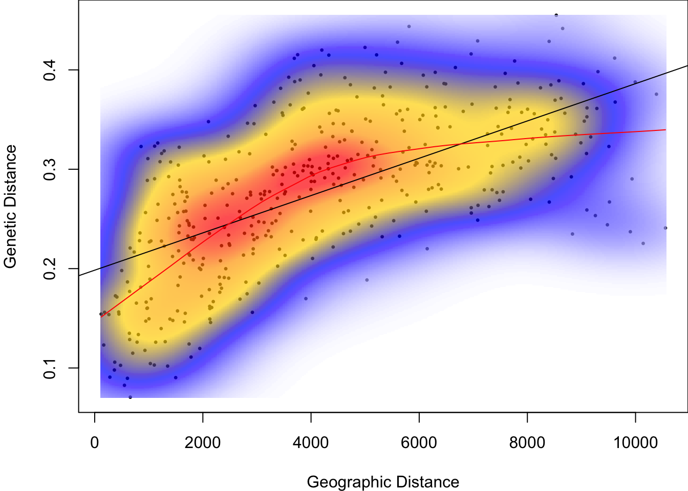

# Lab 5: Spatial Statistics {#Week5}

In this week's computer lab, we will test for spatial autocorrelation in genetic and landscape data. Along the way, we will learn how to calculate pairwise distances in R, how to define spatial weights, and how to work with two basic R object types: S3 vs. S4 objects.  

- [View Course Video](#video_5)
- [Interactive Tutorial 5](#tutorial_5)
- [Worked Example](#WE_5)
- [R Exercise Week 5](#r-exercise-week-5)

Note: Weeks 1 - 8 (Basic Topics) form a streamlined program to aimed at building your R skills. These skills are required for the Advanced Topics. 


## View Course Video{#video_5}


### 1. Embedded Video {-}

- External link: [Week 5 video](https://play.library.utoronto.ca/watch/516a408cced5cb70ea55513ccb205475);  [Week 5 video (Part 2)](https://sho.co/19Y09)
- Transcript: [Download transcript](https://github.com/hhwagner1/DGS_LG_Labs/raw/master/transcripts/Week5_script.pdf)


<iframe width="560" height="315" src="https://play.library.utoronto.ca/embed/516a408cced5cb70ea55513ccb205475" frameborder="0" allowfullscreen> iframe not supported </iframe>


### Preview Slides {-}

[Download slides](https://raw.githubusercontent.com/hhwagner1/DGS_LG_Labs/master/docs/Video_slides/Week5_Slides.pdf)


```
## Warning: The `size` argument of `element_rect()` is deprecated as of ggplot2 3.4.0.
## ℹ Please use the `linewidth` argument instead.
## This warning is displayed once per session.
## Call `lifecycle::last_lifecycle_warnings()` to see where this warning was
## generated.
```


## Interactive Tutorial 5{#tutorial_5}

### 1. List of R commands covered this week {-}

<table class="table table-bordered table-striped table-condensed table-responsive table" style="margin-left: auto; margin-right: auto; width: auto !important; margin-left: auto; margin-right: auto;">
 <thead>
  <tr>
   <th style="text-align:left;position: sticky; top:0; background-color: #FFFFFF;"> Function </th>
   <th style="text-align:left;position: sticky; top:0; background-color: #FFFFFF;"> Package </th>
  </tr>
 </thead>
<tbody>
  <tr>
   <td style="text-align:left;"> plot(asp = 1) </td>
   <td style="text-align:left;"> base </td>
  </tr>
  <tr>
   <td style="text-align:left;"> dist </td>
   <td style="text-align:left;"> stats </td>
  </tr>
  <tr>
   <td style="text-align:left;"> as.matrix </td>
   <td style="text-align:left;"> base </td>
  </tr>
  <tr>
   <td style="text-align:left;"> lower.tri </td>
   <td style="text-align:left;"> base </td>
  </tr>
  <tr>
   <td style="text-align:left;"> diag </td>
   <td style="text-align:left;"> base </td>
  </tr>
  <tr>
   <td style="text-align:left;"> dnearneigh </td>
   <td style="text-align:left;"> spdep </td>
  </tr>
  <tr>
   <td style="text-align:left;"> data.matrix </td>
   <td style="text-align:left;"> base </td>
  </tr>
  <tr>
   <td style="text-align:left;"> nb2listw </td>
   <td style="text-align:left;"> spdep </td>
  </tr>
  <tr>
   <td style="text-align:left;"> listw2mat </td>
   <td style="text-align:left;"> spdep </td>
  </tr>
  <tr>
   <td style="text-align:left;"> nbdists </td>
   <td style="text-align:left;"> spdep </td>
  </tr>
</tbody>
</table>

### 2. General Instructions {-}

#### a) How to access tutorials {-}

Through RStudio Add-in:

- Install course Addins in RStudio: `library(LandGenCourse)`
- In RStudio, click on `Addins` (top menu bar)
- Follow instructions in the Console:
  - type: `require(swirl)` 
  - type: `swirl()` 
  - follow prompts 
  - select course ("Landscape_Genetics_R_Course") and tutorial (Weeks 1 - 8)


#### b) How to complete tutorial {-}

Follow prompts in the RStudio Console.

To stop and resume a tutorial: 

 - to stop and exit swirl, type: `bye()` 
 - to resume where you stopped, type: `swirl()` 

To restart tutorial from beginning: 

 - type:` swirl()` 
 - use a different name 
   (simply add a number, like this: 'MyName2')

#### c) How to submit answers (participating institutions only) {-}

The last prompt will ask whether you would like to submit the log of your tutorial session to Google Forms so that your instructor may evaluate your progress. **This feature is only available for students from participating institutions.**

If you choose 'yes', a form will open in your web browser. Complete and submit the form. 
    
You can submit multiple attempts and the best attempt will be graded. You will receive full marks as long as you answered all questions (i.e. did not use 'skip'). If you used 'skip' because you could not answer a question, please contact your instructor for advice.


## Worked Example{#WE_5}

Helene Wagner


### 1. Overview of Worked Example {-}

#### a. Goals {-}

This worked example shows how to:

- Calculate genetic distance at population level.
- Perform a Mantel test to test for IBD.
- Create Mantel correlograms for the genetic data.
- Calculate and test Moran's I for population-level genetic diversity data.

#### b. Data set {-} 

This is a larger version of the frog data set used in Weeks 1 - 3.

Here, we will analyze microsatellite data from Funk et al. (2005) and Murphy et al. (2010) for 418 individuals of Colombia spotted frogs (Rana luteiventris) from 30 populations, together with site-level spatial coordinates. Please see the introductory video on the DGS course website, R lab page.  

- **ralu_loci_allpops.csv**: Data frame with populations and genetic data (406 rows x 9 columns). Included as external file in package `LandGenCourse`.
- **Frogs_diversity_allpops.csv**: Table with genetic diversity variables similar to Week 3. 
- **ralu_coords_allpops.csv**: Spatial coordinates (both in UTM and LongLat format), and basin.

#### c. Required R packages {-}

Install some packages (not on CRAN) that are needed for this worked example.


``` r
if(!requireNamespace("EcoGenetics", quietly = TRUE)) 
  remotes::install_github("leandroroser/EcoGenetics-devel")
if(!requireNamespace("GeNetIt", quietly = TRUE)) remotes::install_github("jeffreyevans/GeNetIt")
if(!requireNamespace("popgraph", quietly = TRUE))
{
  install.packages(c("RgoogleMaps", "geosphere", "proto", "sampling", 
                      "seqinr", "spacetime", "spdep"), dependencies=TRUE)
  remotes::install_github("dyerlab/popgraph")
}
if(!requireNamespace("gstudio", quietly = TRUE)) remotes::install_github("dyerlab/gstudio")
```


``` r
library(LandGenCourse)
library(GeNetIt)
library(dplyr)
library(EcoGenetics)
#require(adegenet)
#require(tibble)
#require(gstudio)
#require(hierfstat)
#require(PopGenReport)
#require(mmod)
#require(spdep)
```

### 2. Data import and manipulation {-}

#### a. Create an ecogen object {-}

Import the site data that we used before in Week 2. 


``` r
Frogs.coords <- read.csv(system.file("extdata", "ralu_coords_allpops.csv", 
                                     package = "LandGenCourse"))
```

In Week 3, we calculated population-level genetic data as a table `Frogs.diversity`. Here we import a table with the same diversity measures for all 29 sites from a system file in `LandGenCourse`. 


``` r
Frogs.diversity <- read.csv(system.file("extdata", "Frogs_diversity_allpops.csv", 
                                     package = "LandGenCourse"))
```

Import the genetic data for 29 sites: 


``` r
Frogs.loci <- read.csv(system.file("extdata", "ralu_loci_allpops.csv", 
                                     package = "LandGenCourse"))
```

We start building an `ecogen` object by assigning the genetic data to the `G` slot, and the structure (i.e., hierarchical sampling information, here site names) to the `S` slot. For the genetic data, we need to specify the type of data and coding. 

Note the tweak using `data.frame` when specifying `data.frame(ralu.loci[,1:2])`. This is necessary to import the multiple columns correctly and with their original names. 


``` r
Frogs.ecogen <- ecogen(G = Frogs.loci[,-c(1:2)], ploidy = 2, 
                       type = "codominant", sep = ":",
                       S = data.frame(Frogs.loci[,1:2]))
Frogs.ecogen
```

```
## 
##                    || ECOGEN CLASS OBJECT ||
## ----------------------------------------------------------------------------
##  Access to slots: <ecoslot.> + <name of the slot> + <(name of the object)> 
##  See: help("EcoGenetics accessors")
## ----------------------------------------------------------------------------
## 
##  | slot XY:    | --> 0 x 0          coordinates
##  | slot P:     | --> 0 x 0          phenotypic variables
##  | slot G:     | --> 413 x 8        loci         >> ploidy: 2 || codominant
##  | slot A:     | --> 413 x 43       alleles
##  | slot E:     | --> 0 x 0          environmental variables
##  | slot S:     | --> 413 x 2        structures   >> 2 structures found
##  | slot C:     | --> 0 x 0          variables
##  | slot OUT:   | --> 0              results
## ----------------------------------------------------------------------------
```

The summary confirms that we now have data in the `S` and `G` slots. In addition, EcoGenetics created a table of absolute frequencies (i.e. counts) of alleles for each individual in slot `A`. 

#### b. Aggregate to 'ecopop' {-}

Most of our analysis for this lab will be at the population level. The function `ecogen2ecopop` aggregates from individual to population-level data. 


``` r
Frogs.ecopop <- ecogen2ecopop(Frogs.ecogen, hier = "SiteName")
Frogs.ecopop
```

```
## 
##                    << ECOPOP CLASS OBJECT >>
## ****************************************************************************
##  Access to slots: <ecoslot.> + <name of the slot> + <(name of the object)> 
##  See: help("EcoGenetics accessors")
## ****************************************************************************
## 
##  # slot XY:    # =>  0 x 0          coordinates
##  # slot P:     # =>  0 x 0          phenotypic variables
##  # slot AF:    # =>  30 x 43        loci         >> ploidy: 2 || codominant
##  # slot E:     # =>  0 x 0          environmental variables
##  # slot S:     # =>  30 x 1         population found
##  # slot C:     # =>  0 x 0          variables
## ****************************************************************************
```

Instead of 413 individuals, we now have data for 30 populations. Slot `AF` contains the population-level absolute frequencies (counts) of alleles.  

#### b. Add site-level data {-}

Before importing the genetic diversity, spatial coordinates and site data into the `ecopop` object, we need to match the rows and extract the data for the sampled populations. 

Unfortunately, the datasets use different versions of the site name, both were include in the file `ralu_loci_allpops.csv` and thus in the `S` slot of `Frogs.ecogen`. 

- Here, we use `group_by` and `summarize` to get the unique set of site names in both versions. We save it as a data frame Subset.
- Then we join the genetic diversity data. Because the two data frames share a common variable, we dont' need to specify the argument `by`. R will confirm what ID variable it used to join.  


``` r
Subset <- ecoslot.S(Frogs.ecogen) %>% group_by(SiteName, Pop) %>% summarize()
```

```
## `summarise()` has grouped output by 'SiteName'. You can override using the
## `.groups` argument.
```

``` r
Subset <- left_join(Subset, Frogs.diversity)
```

```
## Joining with `by = join_by(Pop)`
```

R tells us that it used the shared ID variable `Pop` to join the data. 

Now we can join the site data. Note: with `as.data.frame`, we combine the `@data` and `@coords` slots of the SpatialPointsDataFrame `ralu.site` to a single data frame. 


``` r
Subset <- left_join(Subset, as.data.frame(Frogs.coords))
```

```
## Joining with `by = join_by(SiteName)`
```

This time, R used the shared ID variable `SiteName` to join the data. 

Now we have all site-level data in the data frame `Subset` that has the same row names as `Frogs.ecopop`. We check the names of the variables to decide which ones to put where. Then we assign them to their respective slots (`@C` for the custom data, here genetic diversity, `@E` for the environmental data, and `@XY` for the coordinates). 

The argument pop specifies the matching ID variable in the `@S` slot. When we aggregated from `Frogs.ecogen` to `Frogs.ecopop`, unfortunately EcoGenetics renamed the variable `SiteName` to `pop`. The argument `pop_levels` identifies the corresponding ID variable in `Subset`. 


``` r
names(Subset)
```

```
##  [1] "SiteName"  "Pop"       "n"         "Hobs"      "Hexp"      "Ar"       
##  [7] "UTM83_E"   "UTM83_N"   "Longitude" "Latitude"  "Basin"
```

``` r
Frogs.ecopop <- EcoGenetics::eco.fill_ecogen_with_df(Frogs.ecopop,
             pop ="pop", pop_levels = Subset$SiteName, 
             C = Subset[,3:6],
             XY = Subset[,7:10])
Frogs.ecopop
```

```
## 
##                    << ECOPOP CLASS OBJECT >>
## ****************************************************************************
##  Access to slots: <ecoslot.> + <name of the slot> + <(name of the object)> 
##  See: help("EcoGenetics accessors")
## ****************************************************************************
## 
##  # slot XY:    # =>  30 x 4         coordinates
##  # slot P:     # =>  0 x 0          phenotypic variables
##  # slot AF:    # =>  30 x 43        loci         >> ploidy: 2 || codominant
##  # slot E:     # =>  0 x 0          environmental variables
##  # slot S:     # =>  30 x 1         population found
##  # slot C:     # =>  30 x 4         variables
## ****************************************************************************
```

#### c. Export to 'adegenet' and 'gstudio' {-}

'EcoGenetics' provides convenient functions for converting genetic data to and from other packages.

Import into 'genind' object (package 'adegenet'): there is a dedicated function, but we need to separately declare the variable that represents the populations and write it into the `@pop` slot of the 'genind' object. 


``` r
Frogs.genind <- EcoGenetics::ecogen2genind(Frogs.ecogen)
```

```
## Loading required package: adegenet
```

```
## Loading required package: ade4
```

```
## 
##    /// adegenet 2.1.11 is loaded ////////////
## 
##    > overview: '?adegenet'
##    > tutorials/doc/questions: 'adegenetWeb()' 
##    > bug reports/feature requests: adegenetIssues()
```

``` r
Frogs.genind@pop <- ecoslot.S(Frogs.ecogen)$SiteName
```

For calculating population-level genetic distances, we aggregate the individual-level data to a `genpop` object with population-level allele frequencies.


``` r
Frogs.genpop <- adegenet::genind2genpop(Frogs.genind)
```

```
## 
##  Converting data from a genind to a genpop object... 
## 
## ...done.
```

``` r
Frogs.genpop
```

```
## /// GENPOP OBJECT /////////
## 
##  // 30 populations; 8 loci; 43 alleles; size: 18.2 Kb
## 
##  // Basic content
##    @tab:  30 x 43 matrix of allele counts
##    @loc.n.all: number of alleles per locus (range: 3-9)
##    @loc.fac: locus factor for the 43 columns of @tab
##    @all.names: list of allele names for each locus
##    @ploidy: ploidy of each individual  (range: 2-2)
##    @type:  codom
##    @call: adegenet::genind2genpop(x = Frogs.genind)
## 
##  // Optional content
##    - empty -
```

Note: Alternatively, we could directly import the `ecopop` object into a `genpop` object (`adegenet`) with `EcoGenetics::ecopop2genpop(Frogs.ecopop)`. However, this can create warnings later on when calculating genetic distances. 

The object 'Frogs.genpop' has 30 rows, each representing a population.

We will also use some functions from the package `gstudio`, hence we import the individual-level genetic data into `gstudio`. This should be easy with the function `EcoGenetics::ecogen2gstudio`. However, there seems to be an issue. The following chunk contains code adapted from within the `ecogen2gstudio` function, tweaked to work for our data. (You can view the original function with: `findMethods(ecogen2gstudio)`.)


``` r
#Frogs.gstudio <- EcoGenetics::ecogen2gstudio(Frogs.ecogen, type="codominant")

  dat <- eco.convert(Frogs.ecogen@G, "matrix", sep.in = ":", sep.out = ":")
  dat <- as.data.frame(dat, stringsAsFactors = FALSE)
  for (i in 1:ncol(dat)) {
     class(dat[, i]) <- "locus"
  }
  dat[is.na(dat)] <- gstudio::locus(NA)
  colnames(dat) <- colnames(Frogs.ecogen@G)

Frogs.gstudio <- data.frame(ecoslot.S(Frogs.ecogen), dat)
tibble::as_tibble(Frogs.gstudio)        
```

```
## # A tibble: 413 × 10
##    SiteName     Pop      A       B       C       D       E     F     G     H    
##    <fct>        <fct>    <locus> <locus> <locus> <locus> <loc> <loc> <loc> <loc>
##  1 AirplaneLake Airplane 1:1     1:1     1:1     1:1     1:2   1:1   1:1   4:5  
##  2 AirplaneLake Airplane 2:2     1:1             1:1     1:1         2:2        
##  3 AirplaneLake Airplane 1:1     1:1     1:1     1:1     3:3   1:1   1:1   3:3  
##  4 AirplaneLake Airplane 1:1     1:1             2:2     1:2                    
##  5 AirplaneLake Airplane 1:2     1:3     1:1     1:1     1:2   1:1   1:2   4:5  
##  6 AirplaneLake Airplane 1:2     1:1     1:1     1:3     1:1   1:1   1:2   4:5  
##  7 AirplaneLake Airplane 2:2     1:3     1:1     1:1     3:3   1:1   1:1   2:3  
##  8 AirplaneLake Airplane 2:2     1:3     1:1     1:1     3:3   1:1   1:1   2:3  
##  9 AirplaneLake Airplane 1:3     1:1     1:1     1:1     1:7   1:1   1:1   3:5  
## 10 AirplaneLake Airplane 2:2     1:3     1:1     1:1     3:7   1:1   1:1   3:3  
## # ℹ 403 more rows
```

### 3. Calculate genetic distances {-} 

Here, we'll calculate a number of different measures of genetic distance, using functions from several packages. Adding the package name to each distance matrix name helps keeping track of methods used. Normally you would not calculate all of them for your own data, and some are redundant, as we will see.

Note: Some functions provide an option `linearized = TRUE` to linearize distances `d` by calculating `d/(1-d)`. This should result in more linear relationships when plotted or correlated against geographic distance.Here we don't linearize, we can do so later manually.

#### a. Genetic distances calculated from genind object {-}

Pairwise Fst with package `hierfstat`:


``` r
GD.pop.PairwiseFst.hierfstat <- as.dist(hierfstat::pairwise.neifst(hierfstat::genind2hierfstat(Frogs.genind)))
```
 
Proportion of shared alleles with package 'PopGenReport':


``` r
GD.pop.propShared <- PopGenReport::pairwise.propShared(Frogs.genind)
```

```
## Registered S3 method overwritten by 'pegas':
##   method      from
##   print.amova ade4
```

```
## Registered S3 methods overwritten by 'genetics':
##   method      from   
##   print.locus gstudio
##   [.haplotype pegas
```
 
Several distance matrices with package 'adegenet':


``` r
GD.pop.Nei <- adegenet::dist.genpop(Frogs.genpop, method=1)   
GD.pop.Edwards <- adegenet::dist.genpop(Frogs.genpop, method=2)
GD.pop.Reynolds <- adegenet::dist.genpop(Frogs.genpop, method=3)  
GD.pop.Rogers <- adegenet::dist.genpop(Frogs.genpop, method=4)  
GD.pop.Provesti <- adegenet::dist.genpop(Frogs.genpop, method=5)
```

Additional distance matrices with package 'mmod':


``` r
GD.pop.Joost <- mmod::pairwise_D(Frogs.genind, linearized = FALSE)
GD.pop.Hedrick <- mmod::pairwise_Gst_Hedrick(Frogs.genind, linearized = FALSE)
GD.pop.NeiGst <- mmod::pairwise_Gst_Nei(Frogs.genind, linearized = FALSE)
```
 

#### b. More distance matrices with 'gstudio' {-}


``` r
GD.pop.Euclidean.gstudio <-gstudio::genetic_distance(Frogs.gstudio, mode = "Euclidean", stratum="SiteName")
```

```
## Multilous estimates of Euclidean distance are assumed to be additive.
```

``` r
GD.pop.cGD.gstudio <-gstudio::genetic_distance(Frogs.gstudio, mode = "cGD", stratum="SiteName")
GD.pop.Nei.gstudio <-gstudio::genetic_distance(Frogs.gstudio, mode = "Nei", stratum="SiteName")
GD.pop.Dps.gstudio <-gstudio::genetic_distance(Frogs.gstudio, mode = "Dps", stratum="SiteName")
```

```
## Bray distance will be assumed to be entirely additive across loci.
```

``` r
GD.pop.Jaccard.gstudio <-gstudio::genetic_distance(Frogs.gstudio, mode = "Jaccard", stratum="SiteName")
```

```
## Jaccard distance will be assumed to be entirely additive across loci.
```

#### c. Assemble distance matrices {-}

We'll store the population-level genetic distances in a list 'GD.pop'.

Note: a few measures return similarities (scaled between 0 and 1) instead of distances. For instance, 'proporition of shared alleles' is 1 if the alleles are identical, and zero of no alleles are shared. We convert these values to distances by subtracting them from 1.


``` r
GD.pop <- list(pairwiseFst.hierfstat = GD.pop.PairwiseFst.hierfstat,
               propShared.PopGenReport = 1 - GD.pop.propShared,
               Nei.adegenet = GD.pop.Nei,
               Edwards.adegenet = GD.pop.Edwards,
               Reynolds.adegenet = GD.pop.Reynolds,
               Rogers.adegenet = GD.pop.Rogers,
               Provesti.adegenet = GD.pop.Provesti,
               Joost.mmod = GD.pop.Joost,
               Hedrick.mmod = GD.pop.Hedrick,
               Nei.mmod = GD.pop.NeiGst,
               Euclidean.gstudio = as.dist(GD.pop.Euclidean.gstudio),
               cGD.gstudio = as.dist(GD.pop.cGD.gstudio),
               Nei.gstudio = as.dist(GD.pop.Nei.gstudio),
               Dps.gstudio = as.dist(1 - GD.pop.Dps.gstudio),
               Jaccard.gstudio = as.dist(1 - GD.pop.Jaccard.gstudio))
round(cor(sapply(GD.pop, function(ls) as.vector(ls))),2)[,1:2]
```

```
##                         pairwiseFst.hierfstat propShared.PopGenReport
## pairwiseFst.hierfstat                    1.00                    0.79
## propShared.PopGenReport                  0.79                    1.00
## Nei.adegenet                             0.85                    0.96
## Edwards.adegenet                         0.83                    0.93
## Reynolds.adegenet                        0.97                    0.82
## Rogers.adegenet                          0.83                    0.99
## Provesti.adegenet                        0.79                    1.00
## Joost.mmod                               0.90                    0.95
## Hedrick.mmod                             0.98                    0.88
## Nei.mmod                                 1.00                    0.77
## Euclidean.gstudio                        0.93                    0.95
## cGD.gstudio                              0.50                    0.62
## Nei.gstudio                              0.85                    0.96
## Dps.gstudio                              0.71                    0.90
## Jaccard.gstudio                          0.71                    0.90
```

Consider the correlations printed above (only the first two columns of the correlation matrix are shown). 

- Correlations are high in general, except for conditional genetic distance (cGD) (see Week 13). 
- There are some duplicate measures (with correlation = 1).

Note: the following functions calculate distance matrices at the individual level:

- PopGenReport::gd.smouse()
- adegenet::propShared()
- gstudio::genetic_distance(mode = "AMOVA")

#### d. Export genetic distance matrices {-}

Optional: You can use `save` to save an R object to your file system, and `load` to read it in again. Note: the default setting is that `save` will overwrite existing files with the same name.

The code is commented out with `#`. To run it, remove the `#`. The first part creates a folder `output` in your project folder if it does not yet exist. The function `save` writes the list `GD.pop` into a file "GD.pop.RData", and the function `load` imports it again. 


``` r
#require(here)
#if(!dir.exists(paste0(here::here(),"/output"))) dir.create(paste0(here::here(),"/output"))

#save(GD.pop, file = paste0(here::here(),"/output/GD.pop.RData"))
#load(paste0(here::here(),"/output/GD.pop.RData"))
```

### 4. Perform a Mantel test to test for IBD {-}

First, we calculate geographic (Euclidean) distances `Dgeo` with the `dist` function, using the spatial coordinates that we imported from ralu.site. These are UTM coordinates and thus metric. 


``` r
Dgeo <- as.vector(dist(ecoslot.XY(Frogs.ecopop)[,1:2]))
```

#### a. Visually check linearity {-}

Before we quantify the linear relationship between genetic and geographic distances, let's check visually whether the relationship is indeed linear. To start, we will define genetic distance `Dgen` based on proportion of shared alleles.


``` r
par(mar=c(4,4,0,0))

Dgen <- as.vector(GD.pop$propShared.PopGenReport)
dens <- MASS::kde2d(Dgeo, Dgen, n=300)
myPal <- colorRampPalette(c("white","blue","gold","orange","red"))
plot(Dgeo, Dgen, pch=20, cex=0.5,  
    xlab="Geographic Distance", ylab="Genetic Distance")
image(dens, col=transp(myPal(300), 0.7), add=TRUE)
abline(lm(Dgen ~ Dgeo))
lines(loess.smooth(Dgeo, Dgen), col="red")
```



There is clearly an increase of genetic distance with geographic distance. However, the red line, which is a smoothed local mean, indicates that the relationship is not linear. 

Let's take the natural logarithm of geographic distance:


``` r
par(mar=c(4,4,0,0))
dens <- MASS::kde2d(log(Dgeo), Dgen, n=300)
plot(log(Dgeo), Dgen, pch=20, cex=0.5,  
    xlab="Geographic Distance", ylab="Genetic Distance")
image(dens, col=transp(myPal(300), 0.7), add=TRUE)
abline(lm(Dgen ~ log(Dgeo)))
lines(loess.smooth(log(Dgeo), Dgen), col="red")
```


**Questions:**

- Is the relationship between Dgen and Dgeo more linear than before the transformation?
- What happened to the spread of points along the x axis (geographic distance)?
- What do the units of the x-axis represent, after the transformation?

#### b. Perform Mantel test {-}

Next, we perform a Mantel test with the function `mantel` from the `vegan` package.

We define Dgen and Dgeo anew, as we need them in 'dist' format this time, not as vectors.


``` r
Dgen <- GD.pop$propShared.PopGenReport
Dgeo <- dist(ecoslot.XY(Frogs.ecopop)[,1:2])

IBD <- vegan::mantel(Dgen,Dgeo, method="pearson")
IBD
```

```
## 
## Mantel statistic based on Pearson's product-moment correlation 
## 
## Call:
## vegan::mantel(xdis = Dgen, ydis = Dgeo, method = "pearson") 
## 
## Mantel statistic r: 0.6211 
##       Significance: 0.001 
## 
## Upper quantiles of permutations (null model):
##    90%    95%  97.5%    99% 
## 0.0779 0.1085 0.1263 0.1611 
## Permutation: free
## Number of permutations: 999
```

What happens if we take the log of geographic distance, which we saw above helps linearize the relationship for these data?


``` r
IBD <- vegan::mantel(Dgen,log(Dgeo), method="pearson")
IBD
```

```
## 
## Mantel statistic based on Pearson's product-moment correlation 
## 
## Call:
## vegan::mantel(xdis = Dgen, ydis = log(Dgeo), method = "pearson") 
## 
## Mantel statistic r: 0.6839 
##       Significance: 0.001 
## 
## Upper quantiles of permutations (null model):
##    90%    95%  97.5%    99% 
## 0.0629 0.0902 0.1124 0.1306 
## Permutation: free
## Number of permutations: 999
```

The statistical significance (p-value) didn't really change, but the strength of the Mantel correlation increased from r = 0.62 to r = 0.68. 

Instead of transforming variables, we could use Spearman rank correlation to quantify the strength of the association. Rank correlations can be used to quantify and test the strength of curvilinear relationships. 


``` r
IBD <- vegan::mantel(Dgen,Dgeo, method="spearman")
IBD
```

```
## 
## Mantel statistic based on Spearman's rank correlation rho 
## 
## Call:
## vegan::mantel(xdis = Dgen, ydis = Dgeo, method = "spearman") 
## 
## Mantel statistic r: 0.6512 
##       Significance: 0.001 
## 
## Upper quantiles of permutations (null model):
##    90%    95%  97.5%    99% 
## 0.0703 0.0979 0.1172 0.1454 
## Permutation: free
## Number of permutations: 999
```

For this measure of genetic diversity, the Mantel correlation was significant, quite strong, and the relationship not linear, hence the transformed data or the rank correlation performed better. What about the other measures?

Here we use `lapply` to apply the function `mantel` to each genetic distance matrix in `GD.pop`. Then we use `sapply` to extract two values for each distance matrix: `statistic` is the Mantel r statistic (here: Pearson linear correlation), and `signif` is the p-value. We can find these names with the function `attributes` (see above).


``` r
attributes(IBD)
```

```
## $names
## [1] "call"         "method"       "statistic"    "signif"       "perm"        
## [6] "permutations" "control"     
## 
## $class
## [1] "mantel"
```


``` r
Mantel.test <- lapply(GD.pop, function(x) vegan::mantel(x,Dgeo, method="pearson"))
data.frame(Mantel.r = sapply(Mantel.test, function(x) x$statistic),
           p.value = sapply(Mantel.test, function(x) x$signif))
```

```
##                          Mantel.r p.value
## pairwiseFst.hierfstat   0.6238025   0.001
## propShared.PopGenReport 0.6211335   0.001
## Nei.adegenet            0.6316224   0.001
## Edwards.adegenet        0.6639963   0.001
## Reynolds.adegenet       0.6162305   0.001
## Rogers.adegenet         0.6188092   0.001
## Provesti.adegenet       0.6211335   0.001
## Joost.mmod              0.6556870   0.001
## Hedrick.mmod            0.6520614   0.001
## Nei.mmod                0.6147866   0.001
## Euclidean.gstudio       0.6591863   0.001
## cGD.gstudio             0.5667087   0.001
## Nei.gstudio             0.6317948   0.001
## Dps.gstudio             0.5371591   0.001
## Jaccard.gstudio         0.5357096   0.001
```

The nature of the result did not depend on the measure of genetic diversity used. Let's repeat the analysis with log(Dgeo). 


``` r
Mantel.test <- lapply(GD.pop, function(x) ade4::mantel.randtest(x,log(Dgeo)))
data.frame(Mantel.r = sapply(Mantel.test, function(x) x$obs),
           p.value = sapply(Mantel.test, function(x) x$pvalue))
```

```
##                          Mantel.r p.value
## pairwiseFst.hierfstat   0.6218519   0.001
## propShared.PopGenReport 0.6839092   0.001
## Nei.adegenet            0.6547320   0.001
## Edwards.adegenet        0.7122499   0.001
## Reynolds.adegenet       0.6437788   0.001
## Rogers.adegenet         0.6718605   0.001
## Provesti.adegenet       0.6839092   0.001
## Joost.mmod              0.6748485   0.001
## Hedrick.mmod            0.6673508   0.001
## Nei.mmod                0.6034555   0.001
## Euclidean.gstudio       0.6967457   0.001
## cGD.gstudio             0.6008983   0.001
## Nei.gstudio             0.6548413   0.001
## Dps.gstudio             0.5911350   0.001
## Jaccard.gstudio         0.5880305   0.001
```

**Questions:** 
- Did the transformation lead to higher Mantel correlations for all measures of genetic distance used here? 
- Why was it higher?

### 5. Create Mantel correlogram for genetic data {-}

Let's look at the relationship between genetic distance and geographic distance in a different way, with a Mantel correlogram. Note that this method does not make the assumption of linearity. 

#### a. Create a first Mantel correlogram {-}

Here, we'll create a population-level Mantel correlogram with the proportion of shared alleles.

Note: The function `eco.cormantel` has an option `latlon=TRUE` that takes care of the distance calculation from lat-lon coordinates. To use this option, the coordinates must be in a matrix or data frame with the longitude in the first column and the latitude in the second. Here, we can set  we can set `latlon=FALSE` because the spatial coordinates are in UTM projection. 

The biological hypothesis of isolation-by-distance postulates that genetic distance increases with geographic distance. Hence it makes sense to use a one-sided alternative. Somewhat counter-intutitively, we use 'alternative="less"' to test for positive spatial autocorrelation.


``` r
corm <- EcoGenetics::eco.cormantel(M = GD.pop$propShared.PopGenReport, 
        XY = ecoslot.XY(Frogs.ecopop)[,1:2],  nsim = 199, latlon=FALSE, 
        alternative="less", method = "pearson")
```

```
## 
 interval 0 / 10 completed
 interval 1 / 10 completed
 interval 2 / 10 completed
 interval 3 / 10 completed
 interval 4 / 10 completed
 interval 5 / 10 completed
 interval 6 / 10 completed
 interval 7 / 10 completed
 interval 8 / 10 completed
 interval 9 / 10 completed
 interval 10 / 10 completed
```

``` r
corm
```

```
## 
##  ############################ 
##    Mantel statistic 
##  ############################ 
## 
##  > Correlation coefficient used -->  Pearson 
##   > Number of simulations -->  199 
##   > Random test -->  permutation 
##   > P-adjust method -->  holm -sequential: TRUE 
## 
##   >  ecoslot.OUT(x): results -->  
## 
## [[1]]
##                           d.mean     obs     exp p.val cardinal
## d= 0 - 1055.243          697.776 -0.4815  0.0020 0.005       45
## d= 1055.243 - 2110.485  1583.490 -0.2708 -0.0026 0.010       67
## d= 2110.485 - 3165.728  2622.371 -0.2043 -0.0047 0.015       64
## d= 3165.728 - 4220.97   3710.591  0.1302 -0.0032 0.990       64
## d= 4220.97 - 5276.213   4716.029  0.1719  0.0008 1.000       54
## d= 5276.213 - 6331.455  5824.450  0.2021 -0.0071 1.000       46
## d= 6331.455 - 7386.698  6856.457  0.1496 -0.0038 1.000       27
## d= 7386.698 - 8441.941  7883.679  0.2297 -0.0014 1.000       33
## d= 8441.941 - 9497.183  8882.536  0.1909 -0.0031 1.000       25
## d= 9497.183 - 10552.426 9847.000  0.0807  0.0025 1.000        9
## 
## 
##  Results table(s) in ecoslot.OUT(x) 
## --------------------------------------------------------------------------
##  Access to slots: <ecoslot.> + <name of the slot> + <(name of the object)> 
##  See: help("EcoGenetics accessors")
```

The table shows:

- Breaks of distance lag 'd': here in meters (default for lag definition: Sturges rule)
- Mean distance 'd.mean': mean distance of pairs in each lag.
- obs: observed value of the statistic 
- Expected value 'exp': expected if there is no autocorrelation.
- P-value 'p.val': default uses a two-sided permutation test with sequential Holm-Bonferroni adjustement of p-values. 
- Number of pairs 'cardinal': number of unique pairs per lag.

The result `corm` is an object of class `eco.correlog` (package: EcoGenetics). A safe way to access thet table is `ecoslot.OUT(corm)`.

Let's plot the correlogram:


``` r
EcoGenetics::eco.plotCorrelog(corm)
```

You can hover over individual points of the correlogram to see the test statistic and mean distance.

#### b. Vary distance class definition {-}

Under IBD, at least the first distance lag should show positive spatial autocorrelation. Here, it is the first two classes, as indicated by the red symbols. 

To what degree does this result depend on the following:

- The distance lag definition?
- The measure of genetic distance?
- Non-linear relationship between genetic and geographic distances?

There are several options of the `eco.cormantel` function to modify the definition of distance classes:

- `int`: distance interval in the units of XY
- `smin`: minimum class distance in the units of XY
- `smax`: maximum class distance in the units of XY
- `nclass`: number of classes
- `seqvec`: vector with breaks in the unites of XY
- `size`: number of individuals per class
- `bin`: rule for constructing intervals if no other parameters provided (default: Sturge's rule)

The easiest ones to modify are either `nclass` or `size`. Here we use `size` to specify that there should be at least 50 or 100 pairs in each distance class. (Note: for a reliable analysis, this should be 100 or more).


``` r
corm.50 <- EcoGenetics::eco.cormantel(M = GD.pop$propShared.PopGenReport, 
           XY = ecoslot.XY(Frogs.ecopop)[,1:2],  nsim = 199, latlon=FALSE,
           alternative="less", size=50)
```

```
## 
 interval 0 / 8 completed
 interval 1 / 8 completed
 interval 2 / 8 completed
 interval 3 / 8 completed
 interval 4 / 8 completed
 interval 5 / 8 completed
 interval 6 / 8 completed
 interval 7 / 8 completed
 interval 8 / 8 completed
```

``` r
EcoGenetics::ecoslot.OUT(corm.50)
```

```
## [[1]]
##                          d.mean     obs     exp p.val cardinal
## d= 0 - 1152.337         739.966 -0.4872  0.0012 0.005       50
## d= 1152.337 - 1821.843 1536.052 -0.2256 -0.0036 0.010       50
## d= 1821.843 - 2769.341 2286.134 -0.2307  0.0043 0.015       50
## d= 2769.341 - 3526.318 3169.188 -0.0411  0.0060 0.195       50
## d= 3526.318 - 4408.262 3992.072  0.1714 -0.0036 1.000       50
## d= 4408.262 - 5339.102 4863.176  0.1579  0.0075 1.000       50
## d= 5339.102 - 6668.986 6011.873  0.2404 -0.0036 1.000       50
## d= 6668.986 - 8434.883 7615.126  0.2429  0.0028 1.000       50
```

``` r
corm.100 <- EcoGenetics::eco.cormantel(M = GD.pop$propShared.PopGenReport, 
           XY = ecoslot.XY(Frogs.ecopop)[,1:2],  nsim = 199, latlon=FALSE,
           alternative="less", size=100)
```

```
## 
 interval 0 / 4 completed
 interval 1 / 4 completed
 interval 2 / 4 completed
 interval 3 / 4 completed
 interval 4 / 4 completed
```

``` r
EcoGenetics::ecoslot.OUT(corm.100)
```

```
## [[1]]
##                          d.mean     obs     exp p.val cardinal
## d= 0 - 1821.843        1138.009 -0.5403  0.0096 0.005      100
## d= 1821.843 - 3526.318 2727.661 -0.2060  0.0015 0.010      100
## d= 3526.318 - 5339.102 4427.624  0.2496 -0.0100 1.000      100
## d= 5339.102 - 8434.883 6813.499  0.3664 -0.0038 1.000      100
```

``` r
EcoGenetics::eco.plotCorrelog(corm.50)
EcoGenetics::eco.plotCorrelog(corm.100)
```

Let's compare the observed Mantel r statistic, p-value, number of pairs in the first distance class and their mean distance, as well as the definition of the first lag interval. We can get all of this by extracting the first line from each object. 

The lag intervals are stored only in the row names, and we need to extract those separately and add them as a colum.


``` r
Lag1.def <- data.frame(rbind(Sturge = EcoGenetics::ecoslot.OUT(corm)[[1]][1,],
      size.50 = EcoGenetics::ecoslot.OUT(corm.50)[[1]][1,],
      size.100 = EcoGenetics::ecoslot.OUT(corm.100)[[1]][1,]))
Lag1.def$bin <- c(row.names(EcoGenetics::ecoslot.OUT(corm)[[1]])[1],
              row.names(EcoGenetics::ecoslot.OUT(corm.50)[[1]])[1],
              row.names(EcoGenetics::ecoslot.OUT(corm.100)[[1]])[1])
Lag1.def
```

```
##            d.mean     obs    exp p.val cardinal             bin
## Sturge    697.776 -0.4815 0.0020 0.005       45 d= 0 - 1055.243
## size.50   739.966 -0.4872 0.0012 0.005       50 d= 0 - 1152.337
## size.100 1138.009 -0.5403 0.0096 0.005      100 d= 0 - 1821.843
```

- All three distance class definitions (Sturge's rule, size = 50, size = 100) resulted in statistically significant p-values.
- The Mantel correlation in the first distance lag was strongest for size.100. 
- For the first distance class, Sturge's rule resulted in 45 pairs and a mean distance similar to size.50 (for this specific dataset).

Overall, Sturge's rule to define distance classes seems to be a good compromise. What is the trade-off, i.e., what happens if distance lags are defined too narrowly or too widely?

It can be really helpful to plot the distribution of distances among the pairs and compare it to the distance intervals:


``` r
par(mfrow=c(3,1))

hist(Dgeo, nclass=50, main="Sturge's rule", axes=F, xlab="", ylab="")
for(i in 1:length(EcoGenetics::ecoslot.BREAKS(corm))){
  lines(rep(EcoGenetics::ecoslot.BREAKS(corm)[i], 2), c(0,50), col="blue")}

hist(Dgeo, nclass=50, main = "50 pairs per lag", axes=F)
for(i in 1:length(EcoGenetics::ecoslot.BREAKS(corm.50))){
  lines(rep(EcoGenetics::ecoslot.BREAKS(corm.50)[i], 2), c(0,50), col="blue")}

hist(Dgeo, nclass=50, main = "100 pairs per lag", axes=F)
for(i in 1:length(EcoGenetics::ecoslot.BREAKS(corm.100))){
  lines(rep(EcoGenetics::ecoslot.BREAKS(corm.100)[i], 2), c(0,50), col="blue")}
```


**Question:** Compare what happens at larger distances. Do you think Sturge's rule does a good job for these as well?

Unlike a Mantel test, where all pairs are considered, in geostatistics we typically interpret only values for  distances up to a certain threshold, e.g. half the maximum distance, for two reasons: 

- There are few pairs in of these bins, making estimates highly variable.
- Not all pairs contribute (equally) to the largest distance classes (those in the center of the study area are not involved in very large distances).

#### c. Alternative measures of genetic distances {-}

Which measure of genetic distance would provide the strongest Mantel correlation in the first distance class for this data set? 

Here we will cycle through all genetic distance matrices in `GD.pop` and calculate a Mantel correlogram with Sturge's rule (not linearized, method="pearson"). This may take a while. 

Note: the code that calculates `corm.GD.pop` is included here twice, first commented out, then with the option `include=FALSE`. This avoids printing out a lot of unnecessary output while still showing the (commented out) code in the .html version of the file.


``` r
#corm.GD.pop <- lapply(GD.pop, function(x) EcoGenetics::eco.cormantel(M = x, 
#                      XY = ecoslot.XY(Frogs.ecopop)[,1:2],  nsim = 199, latlon=FALSE,
#                      alternative="less"))
```


Next, we extract for each genetic distance matrix the observed value of the Mantel correlation for the first distance class and its p-value.


``` r
t(sapply(corm.GD.pop, function(x) EcoGenetics::ecoslot.OUT(x)[[1]][1,c(2,4)]))
```

```
##                             obs p.val
## pairwiseFst.hierfstat   -0.3908 0.005
## propShared.PopGenReport -0.4815 0.005
## Nei.adegenet            -0.4175 0.005
## Edwards.adegenet        -0.4782 0.005
## Reynolds.adegenet       -0.4337 0.005
## Rogers.adegenet         -0.4704 0.005
## Provesti.adegenet       -0.4815 0.005
## Joost.mmod              -0.4331 0.005
## Hedrick.mmod            -0.4331 0.005
## Nei.mmod                -0.3698 0.005
## Euclidean.gstudio       -0.4721 0.005
## cGD.gstudio             -0.3647 0.005
## Nei.gstudio             -0.4175 0.005
## Dps.gstudio             -0.4074 0.005
## Jaccard.gstudio         -0.4031 0.005
```

Compare the p-values: for this dataset, all genetic distance measures resulted in significant spatial autocorrelation (indicating IBD).  

Let's plot the Mantel correlogram for `Nei.adegenet`. Statistically significant lags are shown in a different color than non-significant ones.


``` r
EcoGenetics::eco.plotCorrelog(corm.GD.pop$Nei.adegenet)
```

**Questions:**

- Starting with the first distance class, how many consecutive distance classes showed significant spatial autocorrelation?
- At what distance (range), roughly, did the positive autocorrelation disappear?

### 6. Specify spatial weights and calculate Moran's I {-}

In this part, we'll quantify and test Moran's I for the genetic diversity data as calculated in Week 3 lab.

Note: Above, we used a distance lag approach from geostatistics, here we use spatial neighbours and weights (neighbor topology). Either approach could be used with either type of data.

For a detailed tutorial on defining spatial neighbors and weights, see: https://cran.r-project.org/web/packages/adespatial/vignettes/tutorial.html#irregular-samplings

#### a. Defining spatial neighbors {-}

The function `chooseCN` (package: `adegenet`) provides an interface for choosing a connection network, i.e., for defining spatial neighbors. The underlying functions are defined in package `spdep` (for defining spatial dependences). It can return the following graph types:

- Delaunay triangulation (type 1)
- Gabriel graph (type 2)
- Relative neighbours (type 3)
- Minimum spanning tree (type 4)
- Neighbourhood by distance (type 5)
- K nearests neighbours (type 6)
- Inverse distances (type 7)

Here we use types 1 - 6 to define neighbors in different ways. Then we plot each graph in geographic space. Lines indicate pairs of sites classified as neighbors. 

Note: this function expects metric spatial coordinates (e.g., UTM). 


``` r
nb.del <- adegenet::chooseCN(xy = ecoslot.XY(Frogs.ecopop)[,1:2], 
          result.type = "nb", plot.nb = FALSE, type = 1)
```

```
## Registered S3 method overwritten by 'spdep':
##   method   from
##   plot.mst ape
```

``` r
nb.gab <- adegenet::chooseCN(xy = ecoslot.XY(Frogs.ecopop)[,1:2], 
          result.type = "nb", plot.nb = FALSE, type = 2)
nb.rel <- adegenet::chooseCN(xy = ecoslot.XY(Frogs.ecopop)[,1:2], 
          result.type = "nb", plot.nb = FALSE, type = 3)
nb.mst <- adegenet::chooseCN(xy = ecoslot.XY(Frogs.ecopop)[,1:2], 
          result.type = "nb", plot.nb = FALSE, type = 4)
nb.nbd <- adegenet::chooseCN(xy = ecoslot.XY(Frogs.ecopop)[,1:2], 
          result.type = "nb", plot.nb = FALSE, type = 5, d1=100, d2=15000)
nb.4nn <- adegenet::chooseCN(xy = ecoslot.XY(Frogs.ecopop)[,1:2], 
          result.type = "nb", plot.nb = FALSE, type = 6, k = 4)

par(mfrow=c(2,3), mai=c(0.1,0.1,0.1, 0.1))
plot(nb.del, coords=ecoslot.XY(Frogs.ecopop)); title(main="Delaunay")
plot(nb.gab, coords=ecoslot.XY(Frogs.ecopop)); title(main="Gabriel")
plot(nb.rel, coords=ecoslot.XY(Frogs.ecopop)); title(main= "Rel. neighbors")
plot(nb.mst, coords=ecoslot.XY(Frogs.ecopop)); title(main= "Min spanning tree")
plot(nb.nbd, coords=ecoslot.XY(Frogs.ecopop)); title(main = "Neighbor distance")
plot(nb.4nn, coords=ecoslot.XY(Frogs.ecopop)); title(main = "4 nearest neighbors")
par(mfrow=c(1,1))
```


For spatial statistics, spatial neighbors are used to calculate a local mean. We want each site to have multiple neighbors, but they should be nearby only. Gabriel graph (type = 2) is often a good option, and we'll use it for the rest of this worked example.

#### b. Defining spatial weights {-}

By default, `chooseCN` returns row-standardized weights, so that for each site, the weights of its neighbors sum to 1. This means that a local mean can be calculated as a weighted mean of the other sites (non-neighboring sites have a weight of 0).

With the function `nb2mat` we can convert the neighbor object to a matrix of spatial weights. Let's look at the first five lines and columns:


``` r
spdep::nb2mat(nb.gab)[1:5,1:5]
```

```
##   1         2         3         4 5
## 1 0 0.0000000 0.0000000 0.0000000 0
## 2 0 0.0000000 0.1666667 0.1666667 0
## 3 0 0.2500000 0.0000000 0.0000000 0
## 4 0 0.3333333 0.0000000 0.0000000 0
## 5 0 0.0000000 0.0000000 0.0000000 0
```

Each row contains the weights for the neighbors of one site. We see that the third site is a neighbor of the second site and vice versa. However, the weights are not the same. It seems that site 2 has six neighbors, so each has a weight of 0.167, whereas site 3 has four neighbors, each with a weight of 0.25.

#### c. Calculating and testing Moran's I {-}

Let's see whether rarefied allelic richness, Ar, shows spatial autocorrelation among these sites.


``` r
spdep::moran.test(ecoslot.C(Frogs.ecopop)$Ar, spdep::nb2listw(nb.gab),
                  alternative="greater")
```

```
## 
## 	Moran I test under randomisation
## 
## data:  ecoslot.C(Frogs.ecopop)$Ar  
## weights: spdep::nb2listw(nb.gab)    
## 
## Moran I statistic standard deviate = 4.648, p-value = 1.676e-06
## alternative hypothesis: greater
## sample estimates:
## Moran I statistic       Expectation          Variance 
##        0.60990344       -0.03448276        0.01921995
```

The test statistic is 0.61, and the p-value for a one-sided alternative "greater" (i.e., positive spatial autocorrelation) is *p* < 0.0001. Thus, Ar showed strong and statistially significant spatial autocorrelation.  

Let's do this for all genetic diversity variables and extract the value of the Moran I statistics (for first neighbors) and its p-value.


``` r
Frogs.moran <- lapply(ecoslot.C(Frogs.ecopop), 
                       function(x) spdep::moran.test(x,
                       spdep::nb2listw(nb.gab), alternative="two.sided"))
round(data.frame(obs = sapply(Frogs.moran, function(x) as.vector(x$estimate[1])),  
p.value = sapply(Frogs.moran, function(x) x$p.value)),3)
```

```
##         obs p.value
## n    -0.109   0.606
## Hobs  0.507   0.000
## Hexp  0.551   0.000
## Ar    0.610   0.000
```

**Questions:**

- Which measure of genetic diversity showed the strongest autocorrelation? 
- Sample size n had a negative value of Moran's I (obs). What does this mean?
- Did all four variables show statistically significant spatial autocorrelation?

## R Exercise Week 5

**Task:** Assess fine-scale spatial genetic structure in *Pulsatilla vulgaris* within a single patch, A25: Test for IBD with Mantel rank correlation, and use a Mantel correlogram to assess the range of spatial autocorrelation. 

**Hints:**

a) **Load packages**: You may want to load the packages `dplyr`, `EcoGenetics` and `adegenet`. Alternatively, you can use `::` to call functions from packages.

b) **Import data, extract adults from A25**. 

    - Use the code below to import the data into gstudio. 
    - Inspect a few rows of the data.
    - Filter the dataset to retain adults (OffID == 0) from site A25 (Population == "A25").


``` r
Pulsatilla.gstudio <- gstudio::read_population(path=system.file("extdata",
                            "pulsatilla_genotypes.csv", 
                            package = "LandGenCourse"), 
                    type="column", locus.columns=c(6:19), 
                    phased=FALSE, sep=",", header=TRUE)
```

c) **Plot locations of individuals**: use `plot` with the argument `asp = 1` to plot the locations of the sampled individuals from site A25 to scale. 

d) **Convert to ecogen and genind**: use `EcoGenetics::gstudio2ecogen` to convert to an `ecogen` object. From there, use `EcoGenetics::ecogen2genind` to convert to a `genind` object.

e) **Calculate genetic and Euclidean distance**: 

    - Use `adegenet::propShared` to calculate the proportion of shared alleles at the individual level. (Do not convert to genpop). 
    - Convert to a distance measure by calculating `1 - propShared`.
    - Check object class. If it is not `dist`, use `as.dist` to convert to a `dist` object.
    - Use `dist` to calculate Euclidean distance between individuals.
  
f) **Mantel test**: 

    - Adapt code from section 4.a to plot pairwise genetic distance against Euclidean distance. 
    - Do you notice something unusial in the plot? Why are there so few different values of genetic distance?
    - Do you think there is spatial autocorrelation? If so, up to what distance?
    - Adapt code from section 4.b to test for IBD with a Mantel test, using Spearman rank correlation.

g) **Mantel correlogram**: adapt code from section 5.a to create and plot a Mantel correlogram. Interpret the results.

**Questions:** What is the range of spatial autocorrelation in *P. vulgaris* in site A25?

- Based on a plot of genetic distance against Euclidean distance?
- Based on where the Mantel correlogram reaches 0? 
- Based on statistical significance tests for the Mantel correlogram (with default settings: one-sided alternative "less", Holm's adjustment)?


