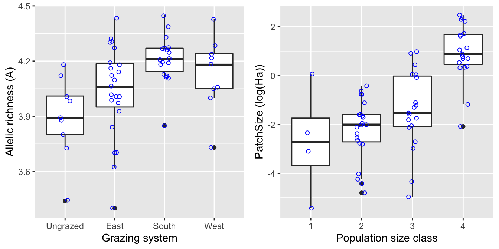
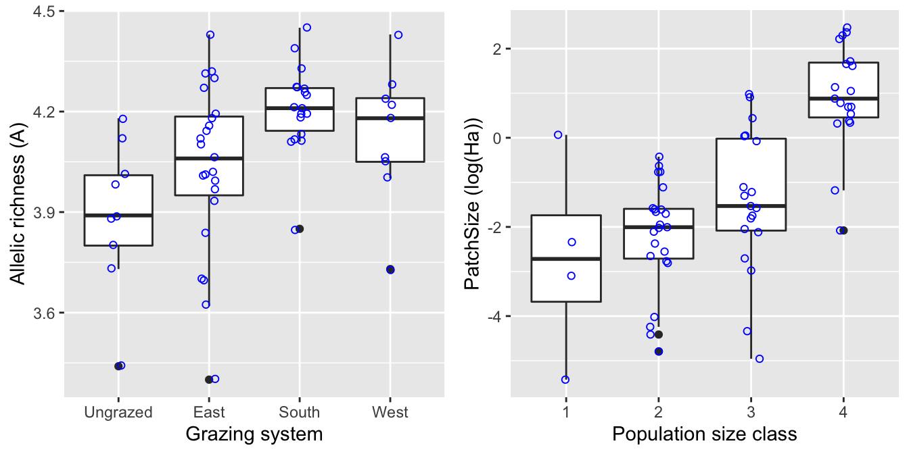
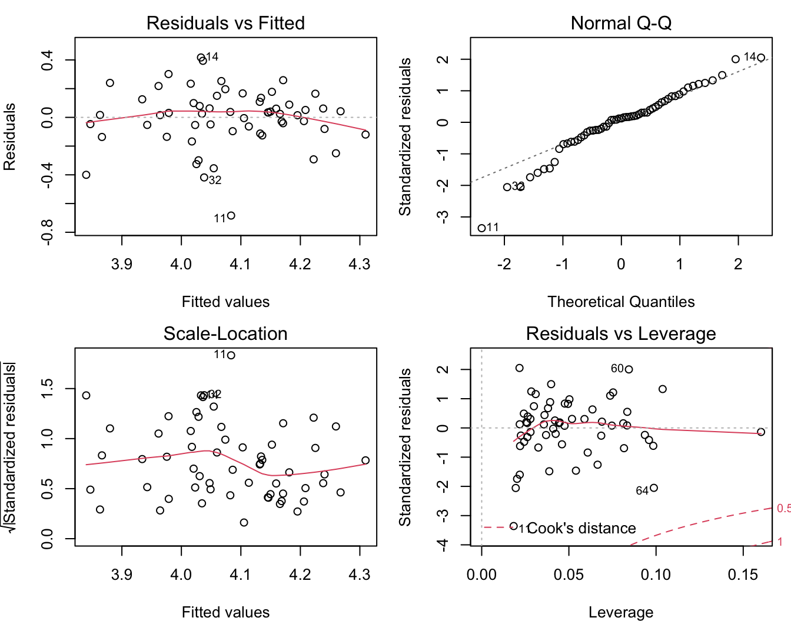
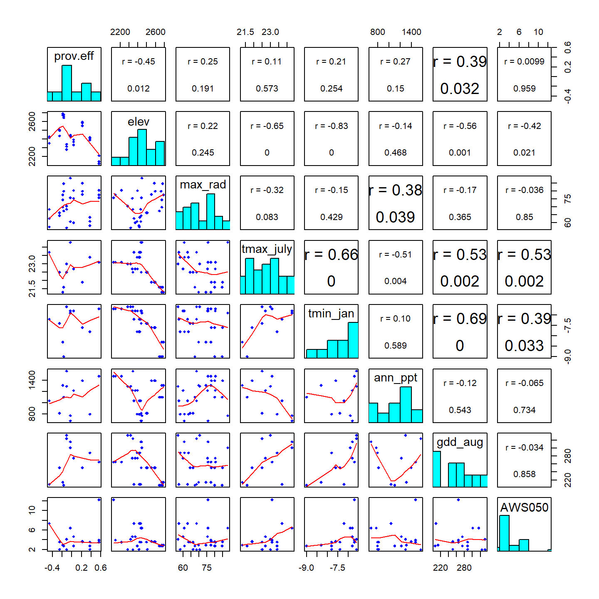
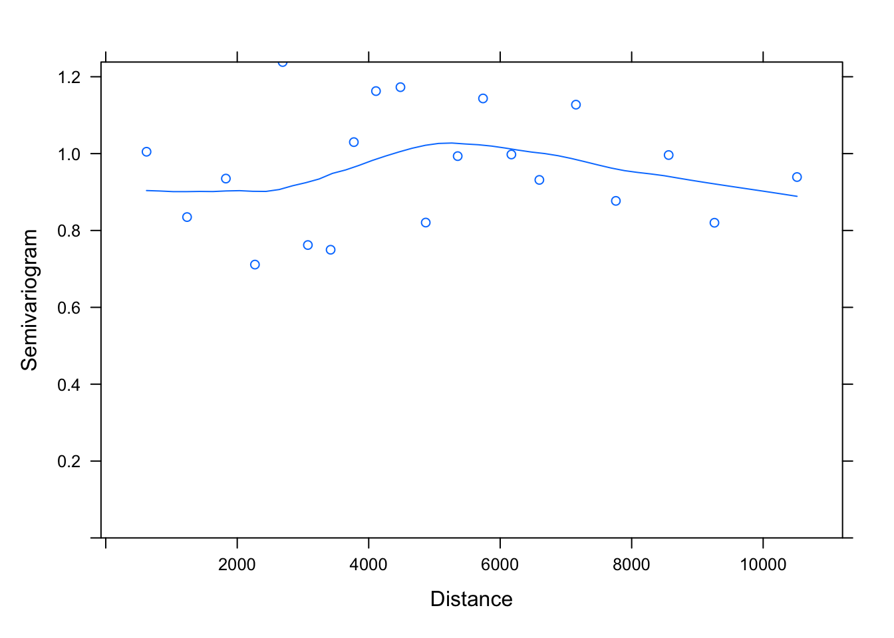
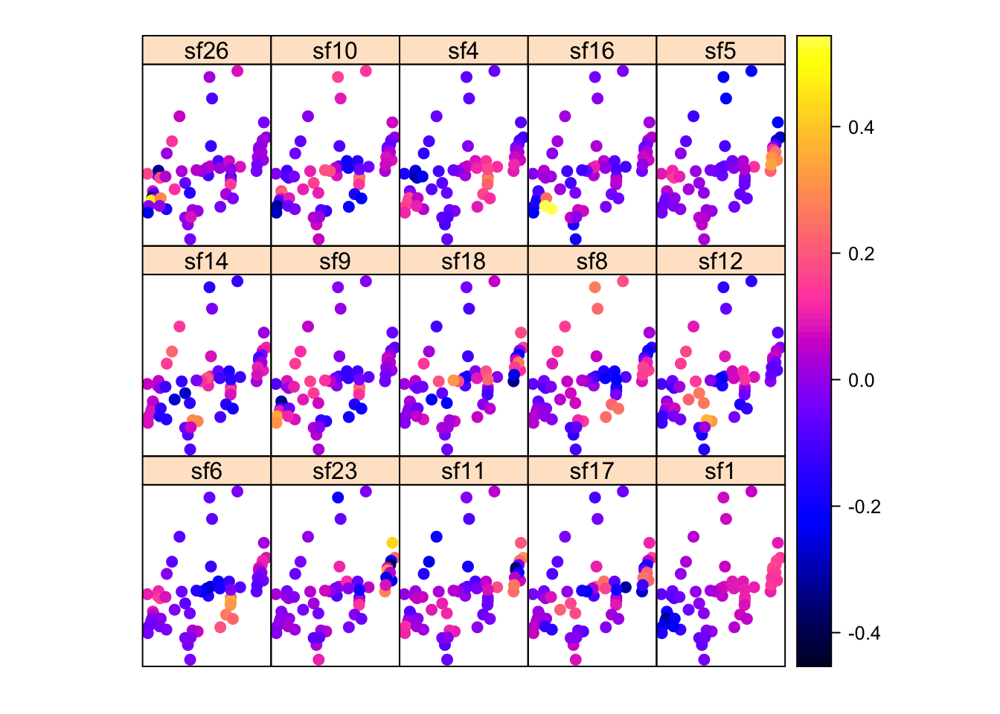
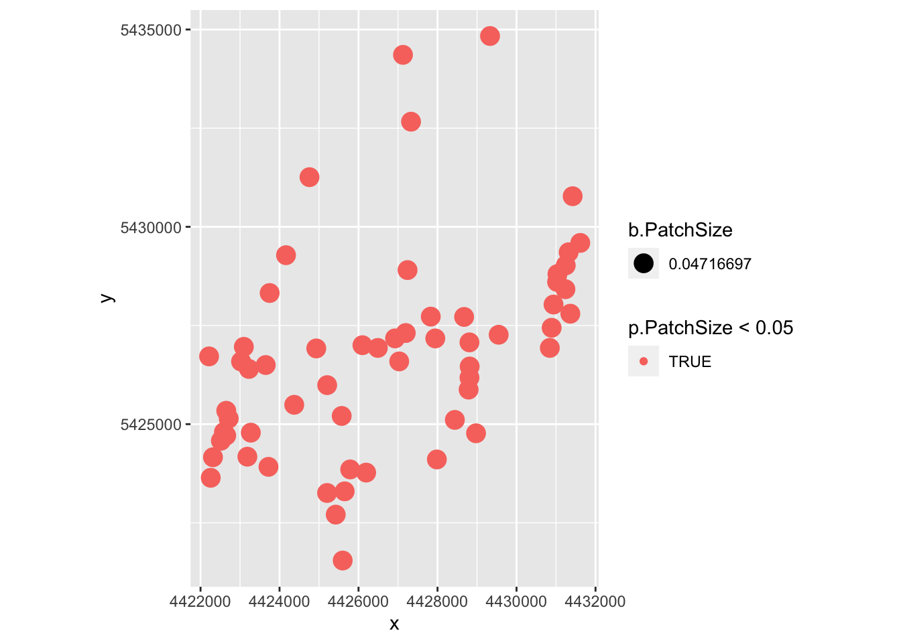
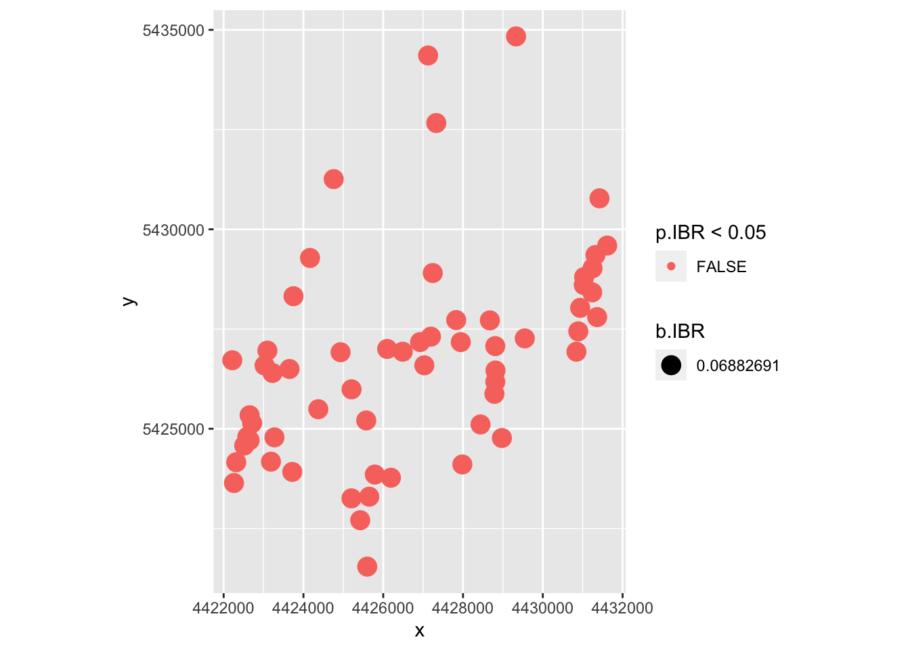

# Week 7: Spatial Linear Models {#Week7}

In this week's computer lab, we will test the effect of landscape data on genetic data. Along the way, we will explore different ways how to build spatial autocorrelation into statistical models.  

- [View Course Video](#video_7)
- [Interactive Tutorial 7](#tutorial_7)
- [Worked Example](#WE_7)
- [R Exercise Week 7](#r-exercise-week-7)
- [Bonus Vignette](#bonus_7): Calculate the Si index

Note: Weeks 1 - 8 (Basic Topics) form a streamlined program to aimed at building your R skills. These skills are required for the Advanced Topics. 


## View Course Video{#video_7}


### 1. Embedded Video {-}

- External link: [Week 7 video (Part 1)](https://sho.co/1A1KH);  [Week 7 video (Part 2)](https://sho.co/1A1K)
- Transcript: [Download transcript](https://github.com/hhwagner1/DGS_LG_Labs/raw/master/transcripts/Week7_script_v3.pdf)


### Video, Part 1 {-}

<iframe width="800" height="513" src="https://sho.co/1A1KH" frameborder="0" allowfullscreen></iframe>

### Video, Part 2 {-}

<iframe width="800" height="513" src="https://sho.co/1A1KF" frameborder="0" allowfullscreen></iframe>

### Preview Slides {-}

[Download slides](https://raw.githubusercontent.com/hhwagner1/DGS_LG_Labs/master/docs/Video_slides/Week7_Slides.pdf)


## Interactive Tutorial 7{#tutorial_7}

### 1. List of R commands covered this week {-}

<table class="table table-bordered table-striped table-condensed table-responsive table" style="margin-left: auto; margin-right: auto; width: auto !important; margin-left: auto; margin-right: auto;">
 <thead>
  <tr>
   <th style="text-align:left;position: sticky; top:0; background-color: #FFFFFF;"> Function </th>
   <th style="text-align:left;position: sticky; top:0; background-color: #FFFFFF;"> Package </th>
  </tr>
 </thead>
<tbody>
  <tr>
   <td style="text-align:left;"> gabrielneigh </td>
   <td style="text-align:left;"> spdep </td>
  </tr>
  <tr>
   <td style="text-align:left;"> graph2nb </td>
   <td style="text-align:left;"> spdep </td>
  </tr>
  <tr>
   <td style="text-align:left;"> log </td>
   <td style="text-align:left;"> base </td>
  </tr>
  <tr>
   <td style="text-align:left;"> coord_trans </td>
   <td style="text-align:left;"> ggplot2 </td>
  </tr>
  <tr>
   <td style="text-align:left;"> par(mfrow) </td>
   <td style="text-align:left;"> graphics </td>
  </tr>
  <tr>
   <td style="text-align:left;"> par(mar) </td>
   <td style="text-align:left;"> graphics </td>
  </tr>
  <tr>
   <td style="text-align:left;"> residuals </td>
   <td style="text-align:left;"> stats </td>
  </tr>
  <tr>
   <td style="text-align:left;"> fitted </td>
   <td style="text-align:left;"> stats </td>
  </tr>
  <tr>
   <td style="text-align:left;"> geom_histogram </td>
   <td style="text-align:left;"> ggplot2 </td>
  </tr>
  <tr>
   <td style="text-align:left;"> lm.morantest </td>
   <td style="text-align:left;"> spdep </td>
  </tr>
  <tr>
   <td style="text-align:left;"> errorsarlm </td>
   <td style="text-align:left;"> spdep </td>
  </tr>
  <tr>
   <td style="text-align:left;"> as.data.frame </td>
   <td style="text-align:left;"> base </td>
  </tr>
  <tr>
   <td style="text-align:left;"> gls </td>
   <td style="text-align:left;"> nlme </td>
  </tr>
  <tr>
   <td style="text-align:left;"> Variogram </td>
   <td style="text-align:left;"> nlme </td>
  </tr>
  <tr>
   <td style="text-align:left;"> corExp </td>
   <td style="text-align:left;"> nlme </td>
  </tr>
  <tr>
   <td style="text-align:left;"> update </td>
   <td style="text-align:left;"> stats </td>
  </tr>
</tbody>
</table>

### 2. General Instructions {-}

#### a) How to access tutorials {-}

Through RStudio Add-in:

- Install course Addins in RStudio: `library(LandGenCourse)`
- In RStudio, click on `Addins` (top menu bar)
- Follow instructions in the Console:
  - type: `require(swirl)` 
  - type: `swirl()` 
  - follow prompts 
  - select course ("Landscape_Genetics_R_Course") and tutorial (Weeks 1 - 8)


#### b) How to complete tutorial {-}

Follow prompts in the RStudio Console.

To stop and resume a tutorial: 

 - to stop and exit swirl, type: `bye()` 
 - to resume where you stopped, type: `swirl()` 

To restart tutorial from beginning: 

 - type:` swirl()` 
 - use a different name 
   (simply add a number, like this: 'MyName2')

#### c) How to submit answers (participating institutions only) {-}

The last prompt will ask whether you would like to submit the log of your tutorial session to Google Forms so that your instructor may evaluate your progress. **This feature is only available for students from participating institutions.**

If you choose 'yes', a form will open in your web browser. Complete and submit the form. 
    
You can submit multiple attempts and the best attempt will be graded. You will receive full marks as long as you answered all questions (i.e. did not use 'skip'). If you used 'skip' because you could not answer a question, please contact your instructor for advice.


## Worked Example{#WE_7}

Helene Wagner and Yessica Rico


### 1. Overview of Worked Example {-}

#### a. Goals {-} 

This worked example shows:

- How to test regression residuals for spatial autocorrelation.
- How to fit a model with spatially autocorrelated errors (GLS).
- How to fit a spatial simultaneous autoregressive error model (SAR).
- How to perform spatial filtering with Moran eigenvector maps (MEM).
- How to fit a spatially varying coefficients model (SVC).

#### b. Data set {-}

Here we analyze population-level data of the wildflower *Dianthus carthusianorum* (common name: Carthusian pink) in 65 calcareous grassland patches in the Franconian Jura, Germany (Rico et al. 2013): 

- **Dianthus**: Spatial point data frame with population-level data (patch characteristics, grazing regime, genetic diversity, 15 alternative connectivity indices Si), included in package 'LandGenCourse'. To load the data, type (without quotes): 'data(Dianthus)'. For a definition of the variables, type: '?Dianthus'.

#### c. Required R packages {-}

Note: the function 'library' will always load the package, even if it is already loaded, whereas 'require' will only load it if it is not yet loaded. Either will work.


```r
library(LandGenCourse)
#library(here)
#libraryspdep)
library(nlme)
#library(lattice)
#library(MuMIn)
#library(gridExtra)
library(dplyr)
library(spatialreg)
library(ggplot2)
library(ggmap)
source(system.file("extdata", "panel.cor.r", 
                            package = "LandGenCourse"))
```

Package 'spmoran' not automatically installed with 'LandGenCourse':


```r
if(!require(spmoran)) install.packages("spmoran", repos='http://cran.us.r-project.org')
#require(spmoran)
```

### 2. Explore data set {-}

We will model allelic richness 'A' as a function of the following predictors:

- **IBD**: connectivity index Si ('Eu_pj') based on Euclidean distance between source and focal patch. This represents a hypothesis of isolation by distance (IBD).
- **IBR**: connectivity index Si ('Sheint_pj') based on the number of continuously or intermittently grazed patches between source and focal patch. This represents a hypothesis of isolation by resistance (IBR). Specifically, this model assumes connectivity via sheep-mediated seed dispersal, where seeds are likely to be transported from patch to patch within the same grazing system (shepherding route). Seeds are assumed to disperse most likely to the next patch (in either direction) along the grazing route, and less likely to more remote patches along the route.
- **PatchSize**: Logarithm of calcareous grassland patch size in ha. 

**Bonus Materials**: The connectivity indices Si were calculated for each focal patch i, integrating over all other patches j where the species was present (potential source patches) using Hanski's incidence function. See the Week 7 Bonus Material for how this was done!

#### a. Import data {-}


```r
data(Dianthus)
```

Allelic richness 'A' was not calculate for populations with < 5 individuals. Here we extract only the patches with 'A' values, and the variables needed, and store them in a data frame 'Dianthus.df'.

#### b. Create a map {-}

The functions in package 'ggmap' expect the projection to be Longitude/Latitude. We could start by transforming the projection of the Dianthus dataset (ignore the warning about CRS object having no comment):


```r
Dianthus.longlat <- sp::spTransform(Dianthus, 
             CRSobj = sp::CRS(SRS_string = "EPSG:4326"))
```

```
## Warning in spTransform(xSP, CRSobj, ...): NULL source CRS comment, falling back
## to PROJ string
```

```
## Warning in spTransform(xSP, CRSobj, ...): +init dropped in PROJ string
```

```
## Warning in wkt(obj): CRS object has no comment

## Warning in wkt(obj): CRS object has no comment
```

```
## Warning in showSRID(uprojargs, format = "PROJ", multiline = "NO", prefer_proj = prefer_proj): Discarded datum Deutsches_Hauptdreiecksnetz in Proj4 definition,
##  but +towgs84= values preserved
```

```r
make_bbox(lon = Longitude, lat = Latitude, data = Dianthus@data, f = 0.2)
```

```
##     left   bottom    right      top 
## 10.91051 48.90282 11.08951 49.07073
```

Here, however, we use a shortcut as the `Dianthus@data` dataframe already contains variables with Longitude and Latitude. We use these to define the bounding box for the map, extending the map extent by 20% ('f=0.2'). 


```r
bbox <- make_bbox(lon = Longitude, lat = Latitude, data = Dianthus@data, f = 0.2)
```

Now we can obtain a stamen map for the study area from the internet and add points for the sampling sites. Here we use a terrain map. 

Note: here we use two types of maps from the source 'stamen', which is freely available: a `terrain` map and a `toner` map. Starting in mid 2018, accessing maps from Google with 'source = google' requires an API key.

To plot the maps side-by-side, we first write each map into an object, then use the function `gridExtra::grid.arrange` to plot them on the same row. This works for a wide range of figures, including `ggplot2` or `trellis`-type plots.


```r
StamenMap.terrain <- ggmap(get_stamenmap(bbox, maptype = "terrain", zoom=12)) + 
  geom_point(aes(x =  Longitude, y = Latitude), data = Dianthus.longlat@data, 
             colour = "black", size = 2)

StamenMap.toner <- ggmap::ggmap(get_stamenmap(bbox, maptype = "toner", zoom=12, force = TRUE)) + 
  geom_point(aes(x =  Longitude, y = Latitude), data = Dianthus.longlat@data, 
             colour = "black", size = 2) 

gridExtra::grid.arrange(StamenMap.terrain, StamenMap.toner, nrow=1)
```



As you can see from the terrain map, most sites lie on the steep slopes between an upper and a lower Jurassic plateau. A few sites lie at the forest edge on the upper plateau, typically in areas where the soil is too shallow to allow crop farming. With in the study area, all known sites were sampled. Additional sites are expected to be found mainly in the valley system in the Southwest.

There are three types of stamen maps: terrain, toner (black and white), and watercolor. Terrain and toner maps have three components each (background, labels, lines), which can be downloaded individually if needed. Hence, the argument 'maptype' has the following options:

- terrain
- terrain-background
- terrain-labels
- terrain-lines
- toner
- toner-2010
- toner-background
- toner-hybrid
- toner-labels
- toner-lines
- toner-lite
- watercolor

#### c. Explore correlations {-}

When fitting linear models, it is always a good idea to look at the correlations first. 


```r
Dianthus.df <- data.frame(A=Dianthus@data$A, IBD=Dianthus@data$Eu_pj, 
                          IBR=Dianthus@data$Sheint_pj,
                          PatchSize=log(Dianthus@data$Ha),
                          System=Dianthus@data$System,
                          Longitude=Dianthus@data$Longitude,
                          Latitude=Dianthus@data$Latitude,
                          x=Dianthus@coords[,1], y=Dianthus@coords[,2])

# Define 'System' for ungrazed patches
Dianthus.df$System=as.character(Dianthus@data$System)
Dianthus.df$System[is.na(Dianthus.df$System)] <- "Ungrazed"
Dianthus.df$System <- factor(Dianthus.df$System, 
                             levels=c("Ungrazed", "East", "South", "West"))

# Remove patches with missing values for A
Dianthus.df <- Dianthus.df[!is.na(Dianthus.df$A),]
dim(Dianthus.df)
```

```
## [1] 59  9
```

```r
pairs(Dianthus.df[,-c(5:7)], lower.panel=panel.smooth, 
      upper.panel=panel.cor, diag.panel=panel.hist)
```


**Questions:**

- How strong is the association between 'Eu_pj' and 'A'? What does this suggest about the hypothesis of IBD?
- How strong is the association between 'Sheint_pj' and 'A'? What does this suggest about the hypothesis of sheep-mediated gene flow (IBR)?
- Which variable seems to be a better predictor of allelic richness: patch size 'Ha' or the logarithm of patch size, 'PatchSize'?
- Is logHa correlated with 'IBD' or 'IBR'?
- Are any of the variables correlated with the spatial coordinates x and y?

Do the three grazing systems, and the ungrazed patches, differ in allelic richness A? Also, let's check the association between patch size and population size. Here we create boxplots that show the individual values as dots. We add a horizontal jitter to avoid overlapping points.


```r
Boxplot1 <- ggplot(Dianthus.df, aes(x=System, y=A)) + 
  geom_boxplot() + xlab("Grazing system") + ylab("Allelic richness (A)") +
  geom_jitter(shape=1, position=position_jitter(0.1), col="blue")

Boxplot2 <- ggplot(Dianthus@data, aes(x=factor(pop09), y=log(Ha))) + 
  geom_boxplot() + xlab("Population size class") + ylab("PatchSize (log(Ha))") +
  geom_jitter(shape=1, position=position_jitter(0.1), col="blue")

gridExtra::grid.arrange(Boxplot1, Boxplot2, nrow=1)
```



Even though the population size categories were very broad, there appears to be a strong relationship between populations size (category) and (the logarithm of) patch size. 

Despite this relationship, connectivity models Si that only considered *Dianthus carthusianorum* presence/absence ('pj') in source patches 'j' were better supported than those Si models that took into account source patch area ('Aj') or population size ('Nj'). 

We can check this by calculating the correlation of allelelic richness 'A' with each of the 15 connectivity models 'Si' in the data set. 


```r
round(matrix(cor(Dianthus@data$A, Dianthus@data[,15:29], 
                 use="pairwise.complete.obs"), 5, 3, byrow=TRUE, 
           dimnames=list(c("Eu", "Shecte", "Sheint", "Shenu", "Forest"), 
                         c("pj", "Aj", "Nj"))),3)
```

```
##           pj     Aj    Nj
## Eu     0.024  0.207 0.098
## Shecte 0.375  0.273 0.369
## Sheint 0.403  0.196 0.369
## Shenu  0.135 -0.045 0.105
## Forest 0.137  0.168 0.138
```

- Correlations with 'A' are highest for the two 'IBR' models that assume seed dispersal over a limited number of patches along shepherding routes ('Shecte' and 'Sheint'. These two models include only continuously grazed, or both continuously and intermittently grazed patches, respectively. 
- Correlations for models that take in to account population size ('Nj') are only slightly lower, whereas those that use patch size ('Aj') as a proxy for the size of the seed emigrant pool had lower correlations. 

### 3. Test regression residuals for spatial autocorrelation {-}

#### a. Fit regression models {-}

Here we fit three multiple regression models to explain variation in allelic richness:

- **mod.lm.IBD**: IBD model of connectivity 'Eu_pj'.
- **mod.lm.IBR**: IBR model shepherding connectivity 'Sheint_pj'.
- **mod.lm.PatchSize**: log patch size and IBR model.


```r
mod.lm.IBD <- lm(A ~ IBD, data = Dianthus.df)
summary(mod.lm.IBD)
```

```
## 
## Call:
## lm(formula = A ~ IBD, data = Dianthus.df)
## 
## Residuals:
##      Min       1Q   Median       3Q      Max 
## -0.68545 -0.10220  0.03883  0.16178  0.36100 
## 
## Coefficients:
##             Estimate Std. Error t value Pr(>|t|)    
## (Intercept) 4.070960   0.064061  63.549   <2e-16 ***
## IBD         0.008454   0.047460   0.178    0.859    
## ---
## Signif. codes:  0 '***' 0.001 '**' 0.01 '*' 0.05 '.' 0.1 ' ' 1
## 
## Residual standard error: 0.2324 on 57 degrees of freedom
## Multiple R-squared:  0.0005563,	Adjusted R-squared:  -0.01698 
## F-statistic: 0.03173 on 1 and 57 DF,  p-value: 0.8593
```

This model does not fit the data at all!


```r
mod.lm.IBR <- lm(A ~ IBR, data = Dianthus.df)
summary(mod.lm.IBR)
```

```
## 
## Call:
## lm(formula = A ~ IBR, data = Dianthus.df)
## 
## Residuals:
##      Min       1Q   Median       3Q      Max 
## -0.66844 -0.11251  0.03418  0.12219  0.41760 
## 
## Coefficients:
##             Estimate Std. Error t value Pr(>|t|)    
## (Intercept)  3.92306    0.05499  71.348  < 2e-16 ***
## IBR          0.25515    0.07672   3.326  0.00155 ** 
## ---
## Signif. codes:  0 '***' 0.001 '**' 0.01 '*' 0.05 '.' 0.1 ' ' 1
## 
## Residual standard error: 0.2128 on 57 degrees of freedom
## Multiple R-squared:  0.1625,	Adjusted R-squared:  0.1478 
## F-statistic: 11.06 on 1 and 57 DF,  p-value: 0.001547
```

This model fits much better. Let's check the residuals plots.


```r
par(mfrow=c(2,2), mar=c(4,4,2,1))
plot(mod.lm.IBR)
```


```r
par(mfrow=c(1,1))
```

The residuals show some deviation from a normal distribution. Specifically, the lowest values are lower than expected.


```r
mod.lm.PatchSize <- lm(A ~ PatchSize + IBR, data = Dianthus.df)
summary(mod.lm.PatchSize)
```

```
## 
## Call:
## lm(formula = A ~ PatchSize + IBR, data = Dianthus.df)
## 
## Residuals:
##      Min       1Q   Median       3Q      Max 
## -0.68359 -0.08844  0.02538  0.11705  0.41705 
## 
## Coefficients:
##             Estimate Std. Error t value Pr(>|t|)    
## (Intercept)  4.05158    0.07781  52.069   <2e-16 ***
## PatchSize    0.04266    0.01888   2.260   0.0277 *  
## IBR          0.11338    0.09709   1.168   0.2479    
## ---
## Signif. codes:  0 '***' 0.001 '**' 0.01 '*' 0.05 '.' 0.1 ' ' 1
## 
## Residual standard error: 0.2055 on 56 degrees of freedom
## Multiple R-squared:  0.2325,	Adjusted R-squared:  0.2051 
## F-statistic: 8.482 on 2 and 56 DF,  p-value: 0.0006058
```

This combinde model explains more variation in allelic richness than the IBR model alone. Moreover, after adding PatchSizes, the IBR term is no longer statistically significant!

Has the distribution of residuals improved as well?


```r
par(mfrow=c(2,2), mar=c(4,4,2,1))
plot(mod.lm.PatchSize)
```



```r
par(mfrow=c(1,1))
```

Not really!

#### b. Test for spatial autocorrelation (Moran's I) {-}

Before we interpret the models, let's check whether the assumption of independent residuals is violated by spatial autocorrelation in the residuals. 

To calculate and test Moran's I, we first need to define neighbours and spatial weights. Here we use a Gabriel graph to define neighbours. 

We define weights in three ways (see Week 5 video and tutorial for code explanation): 

- **listw.gab**: 1 = neighbour, 0 = not a neighbour.
- **listw.d1**: inverse distance weights: neighbour j with weight 1/dij
- **listw.d2**: inverse squared distance weights: neighbour j with weight 1/dij^2

In each case, we row-standardize the weights with the option 'style = "W"'.

Note: when using 'graph2nb', make sure to use the argument 'sym=TRUE'. This means that if A is a neighbour of B, B is also a neighbour of A. The default is 'sym=FALSE', which may result in some sites not having any neighbours assigned (though this would not be evident from the figure!).


```r
xy <- data.matrix(Dianthus.df[,c("x", "y")])
nb.gab <- spdep::graph2nb(spdep::gabrielneigh(xy), sym=TRUE)
par(mar=c(0,0,0,0))
plot(nb.gab, xy)
```


```r
listw.gab <- spdep::nb2listw(nb.gab)

dlist <- spdep::nbdists(nb.gab, xy)
dlist <- lapply(dlist, function(x) 1/x)
listw.d1 <- spdep::nb2listw(nb.gab, style = "W", glist=dlist)
dlist <- lapply(dlist, function(x) 1/x^2)
listw.d2 <- spdep::nb2listw(nb.gab, style = "W", glist=dlist)
```

Now we can quantify and test Moran's I for each variable to test for spatial autocorrelation in response and predictor variables. For now, we'll take the simple weights 'listw.gab'.


```r
spdep::moran.test(Dianthus.df$A, listw.gab)             
```

```
## 
## 	Moran I test under randomisation
## 
## data:  Dianthus.df$A  
## weights: listw.gab    
## 
## Moran I statistic standard deviate = 2.881, p-value = 0.001982
## alternative hypothesis: greater
## sample estimates:
## Moran I statistic       Expectation          Variance 
##        0.29180913       -0.01724138        0.01150691
```

```r
spdep::moran.test(Dianthus.df$IBD, listw.gab)
```

```
## 
## 	Moran I test under randomisation
## 
## data:  Dianthus.df$IBD  
## weights: listw.gab    
## 
## Moran I statistic standard deviate = 5.9689, p-value = 1.194e-09
## alternative hypothesis: greater
## sample estimates:
## Moran I statistic       Expectation          Variance 
##        0.62709841       -0.01724138        0.01165320
```

```r
spdep::moran.test(Dianthus.df$IBR, listw.gab) 
```

```
## 
## 	Moran I test under randomisation
## 
## data:  Dianthus.df$IBR  
## weights: listw.gab    
## 
## Moran I statistic standard deviate = 3.008, p-value = 0.001315
## alternative hypothesis: greater
## sample estimates:
## Moran I statistic       Expectation          Variance 
##        0.30918167       -0.01724138        0.01177588
```

```r
spdep::moran.test(Dianthus.df$PatchSize, listw.gab) 
```

```
## 
## 	Moran I test under randomisation
## 
## data:  Dianthus.df$PatchSize  
## weights: listw.gab    
## 
## Moran I statistic standard deviate = 3.4257, p-value = 0.0003066
## alternative hypothesis: greater
## sample estimates:
## Moran I statistic       Expectation          Variance 
##        0.35490160       -0.01724138        0.01180103
```

**Questions:**

- Which variables showed statistically signficant spatial autocorrelation?
- Which variables showed the strongest autocorrelation? Is this surprising?

Next, let's test each model for autocorrelation in the residuals:


```r
spdep::lm.morantest(mod.lm.IBD, listw.gab) 
```

```
## 
## 	Global Moran I for regression residuals
## 
## data:  
## model: lm(formula = A ~ IBD, data = Dianthus.df)
## weights: listw.gab
## 
## Moran I statistic standard deviate = 2.9439, p-value = 0.00162
## alternative hypothesis: greater
## sample estimates:
## Observed Moran I      Expectation         Variance 
##       0.28889983      -0.02854559       0.01162751
```

```r
spdep::lm.morantest(mod.lm.IBR, listw.gab)          
```

```
## 
## 	Global Moran I for regression residuals
## 
## data:  
## model: lm(formula = A ~ IBR, data = Dianthus.df)
## weights: listw.gab
## 
## Moran I statistic standard deviate = 1.883, p-value = 0.02985
## alternative hypothesis: greater
## sample estimates:
## Observed Moran I      Expectation         Variance 
##       0.18032443      -0.02296810       0.01165614
```

```r
spdep::lm.morantest(mod.lm.PatchSize, listw.gab)       
```

```
## 
## 	Global Moran I for regression residuals
## 
## data:  
## model: lm(formula = A ~ PatchSize + IBR, data = Dianthus.df)
## weights: listw.gab
## 
## Moran I statistic standard deviate = 1.7484, p-value = 0.04019
## alternative hypothesis: greater
## sample estimates:
## Observed Moran I      Expectation         Variance 
##       0.16223745      -0.02708922       0.01172530
```

Quite a bit of the spatial autocorrelation in allelic richness can be explained by the spatial structure in the predictors IBR and PatchSize. There is still statistically significant spatial autocorrelation in the residuals, though it is not strong any more. 

### 4. Fit models with spatially correlated error (GLS) with package 'nlme' {-}

One way to account for spatial autocorrelation in the residuals is to fit a Generalized Least Squares model (GLS) with a spatially autocorrelated error structure. 
See also: http://rfunctions.blogspot.ca/2017/06/how-to-identify-and-remove-spatial.html

#### a. Plot empirical variogram {-}

The error structure in a GLS is defined in a geostatistical framework, based on a variogram and as a function of distance between observations. Hence we start with plotting an empirical variogram of the residuals, with a smooth line. Here we specify 'resType = "normalized", which means that the variogram will be fitted to the normalized residuals of the model. 

The expected value of the semivariance will be 1. Hence it would make sense to add a horizontal line at 1. However, this is cumbersome with the trellis graphics (using package 'lattice') used by 'nlme'. 


```r
model.lm <- nlme::gls(A ~ IBR + PatchSize, data = Dianthus.df, method="REML")
semivario <- nlme::Variogram(model.lm, form = ~x  + y, resType = "normalized")
```

If you want to create your own figure, e.g. with 'ggplot2', you can access the values stores in the data frame 'semivario' to plot the points, and add a smooth line yourself. Then we can add a horizontal line with 'geom_hline'.


```r
ggplot(data=semivario, aes(x=dist, y=variog)) + geom_point() + geom_smooth(se=FALSE) +
  geom_hline(yintercept=1) + ylim(c(0,1.3)) + xlab("Distance") + ylab("Semivariance")
```

```
## `geom_smooth()` using method = 'loess' and formula 'y ~ x'
```



**Question:**

- What do you conclude from this empirical variogram? 
- Estimate the range of the variogram from the intersection of the smooth line with the horizontal line.
- Estimate the nugget effect from the intercept at Distance = 0.

#### b. Fit variogram models {-}

We can ask R to fit different types of variogram models to this empirical variogram. The model family (e.g., exponential, gaussian, spherical) determines the general shape of the curve that will be fitted. With 'nugget=T', we indicate that a nugget effect should be fitted. 

Note: Here we want to compare mixed models with the same fixed effects but different random effect structures defined by `correlation`. For this, we use REML. If we wanted to compare models with the same random effects but different fixed effects (as in Week 6), we should use maximum likelihood. 

- With function `lme4::lmer`, we can set `REML=TRUE` for REML and `REML=FALSE` for ML. 
- Here with `nlme::gls`, we set `method="REML"` for REML and `method="ML"` for ML.
- For update to work here, you'll need to load the library `nlme `(or use this, with three coons to access a function 'update', for 'lme' objects, that is not 'exported' from the package: `nlme:::update.lme`)


```r
model.lm <- nlme::gls(A ~ IBR + PatchSize, data = Dianthus.df, method="REML")

mod.corExp <- update(model.lm, correlation = nlme::corExp(form = ~ x + y, nugget=T))
mod.corGaus <- update(model.lm, correlation = nlme::corGaus(form = ~ x + y, nugget=T))
mod.corSpher <- update(model.lm, correlation = nlme::corSpher(form = ~ x + y, nugget=T))
mod.corRatio <- update(model.lm, correlation = nlme::corRatio(form = ~ x + y, nugget=T))
#mod.corLin <- update(model.lm, correlation = nlme::corLin(form = ~ x + y, nugget=T))
```

#### c. Select best-fitting model {-}

Now we compare all models for which we did not get an error message:


```r
MuMIn::model.sel(model.lm, mod.corExp, mod.corGaus, mod.corSpher, mod.corRatio)     
```

```
## Model selection table 
##              (Intrc)     IBR   PtchS  correlation df logLik AICc delta weight
## mod.corExp     4.044 0.08468 0.04269 n::cE(x+y,T)  6  6.283  1.1  0.00  0.336
## mod.corRatio   4.032 0.09704 0.04129 n::cR(x+y,T)  6  6.229  1.2  0.11  0.319
## model.lm       4.052 0.11340 0.04266               4  3.702  1.3  0.29  0.291
## mod.corGaus    4.047 0.11840 0.04247 n::cG(x+y,T)  6  3.763  6.1  5.04  0.027
## mod.corSpher   4.048 0.11710 0.04242 n::cS(x+y,T)  6  3.760  6.1  5.04  0.027
## Abbreviations:
##  correlation: n::cE(x+y,T) = 'nlme::corExp(~x+y,T)', 
##               n::cG(x+y,T) = 'nlme::corGaus(~x+y,T)', 
##               n::cR(x+y,T) = 'nlme::corRatio(~x+y,T)', 
##               n::cS(x+y,T) = 'nlme::corSpher(~x+y,T)'
## Models ranked by AICc(x)
```

The list sorts the models, with the best model on top. The last column 'weight' contains the model weight, which indicate how much support there is for each model, given all other models in the set (see Week 12). Here, the exponential model fitted best, though the ratio model and the model without a spatially correlated error structure fitted the data almost equally well. The top three models have delta values within 2 (in fact, close to 0).

We refit the best model with maximum likelihood to test the fixed effects.


```r
mod.corExp.ML <- nlme::gls( A ~ PatchSize + IBR, data = Dianthus.df, method="ML",
                            correlation = nlme::corExp(form = ~ x + y, nugget=T))
car::Anova(mod.corExp.ML) 
```

```
## Analysis of Deviance Table (Type II tests)
## 
## Response: A
##           Df  Chisq Pr(>Chisq)  
## PatchSize  1 5.4912    0.01911 *
## IBR        1 0.8710    0.35067  
## ---
## Signif. codes:  0 '***' 0.001 '**' 0.01 '*' 0.05 '.' 0.1 ' ' 1
```

The fitted model with the exponential error structure shows a significant effect for PatchSize but not for the IBR term.

We don't get an R-squared value directly, but we can calculate a pseudo R-squared from a regression of the response 'A' on the fitted values (using the model fitted with REML). Let's compare it to the R-squared from the `lm` model.


```r
summary(lm(A ~ fitted(mod.corExp), data = Dianthus.df))$r.squared
```

```
## [1] 0.2317629
```

```r
summary(mod.lm.PatchSize)$r.squared
```

```
## [1] 0.2324922
```

The pseudo R-squared is almost identical to the R-squared of the non-spatial `lm` model. 

Let's check the residual plots:


```r
predictmeans::residplot(mod.corExp)
```

The normal probability plot still looks about the same.

Note that the function `residplot` recognized that we have a `gls` model and added a plot of the auto-correlation function, ACF. Here we have a value of 1 for the distance lag 0, which is the comparison of each value with itself. All other values are low. Recall that the autcorrelation is inversely related to the semivariogram (which does not report the value for lag = 0):


```r
semivario <- nlme::Variogram(mod.corExp, form = ~ x + y, 
                             resType = "normalized")
plot(semivario, smooth = TRUE)
```



The variogram of the residuals (after accounting for spatial autocorrelation as modeled by the variogram model) does look better!

#### d. Plot fitted variogram model {-}

How can we plot the fitted variogram? Let's first store it in an object 'Fitted.variog', then plot it. Note that the fitted variogram itself has two classes, "Variogram" and "data.frame". The plot created by `plot(Fitted.variog)` is a "trellis" object. 


```r
Fitted.variog <- nlme::Variogram(mod.corExp)
class(Fitted.variog)
```

```
## [1] "Variogram"  "data.frame"
```

```r
class(plot(Fitted.variog))
```

```
## [1] "trellis"
```

```r
plot(Fitted.variog)
```


That was easy. However, `trellis` plots are difficult to tweak, and we may want to create our own plot with `ggplot2`. For this, we need to access the fitted variogram values (i.e. the exponential model curve values), which is a bit more involved. 

The object 'Fitted.variog' is a data frame (S3) with additional attributes. This raises a challenge, because we access attributes of S3 objects with `$`, but we also use `$` to access columns in a data frame. 

If we just print `Fitted.variog`, we only see the data frame. 


```r
head(Fitted.variog)
```

```
##      variog      dist n.pairs
## 1 0.6782704  620.5202      85
## 2 0.6112605 1236.8297      86
## 3 0.7415494 1827.3367      85
## 4 0.5751311 2269.6729      86
## 5 1.0503017 2691.2494      85
## 6 0.7493939 3074.7370      86
```

We can see the attributes listed by using `str`:


```r
str(Fitted.variog)
```

```
## Classes 'Variogram' and 'data.frame':	20 obs. of  3 variables:
##  $ variog : num  0.678 0.611 0.742 0.575 1.05 ...
##  $ dist   : num  621 1237 1827 2270 2691 ...
##  $ n.pairs: int [1:20(1d)] 85 86 85 86 85 86 85 86 85 86 ...
##  - attr(*, "modelVariog")=Classes 'Variogram' and 'data.frame':	50 obs. of  2 variables:
##   ..$ variog: num [1:50] 0.598 0.637 0.673 0.705 0.734 ...
##   ..$ dist  : num [1:50] 106 385 665 945 1224 ...
##  - attr(*, "collapse")= logi TRUE
```

The line we are looking for is:  `- attr(*, "modelVariog")`. The attribute `modelVariog` has 50 rows (obs.) and 2 variables: `$variog` and `$dist`. These are the fitted values (i.e., values of the exponential variogram model for 50 distance values).

The notation `attr(*, "modelVariog")` is a cryptic way of telling us how to access the attribute: use the function `attr` and provide two arguments: the object names `Fitted.variog` (represented by the asterisk), and the name of the attribute, in quotes: `attr(Fitted.variog, "modelVariog")`.


```r
tibble::as_tibble(attr(Fitted.variog, "modelVariog"))
```

```
## # A tibble: 50 × 2
##    variog  dist
##     <dbl> <dbl>
##  1  0.598  106.
##  2  0.637  385.
##  3  0.673  665.
##  4  0.705  945.
##  5  0.734 1224.
##  6  0.760 1504.
##  7  0.784 1783.
##  8  0.805 2063.
##  9  0.824 2342.
## 10  0.841 2622.
## # … with 40 more rows
```

This is useful to know if you want to create your own figures, e.g. with `ggplot2`.


```r
ggplot(data=Fitted.variog, aes(x=dist, y=variog)) + geom_point() + 
  ylim(c(0,1.3)) + xlab("Distance") + ylab("Semivariance") + 
  geom_line(data=attr(Fitted.variog, "modelVariog"), aes(x=dist, y=variog), color="blue") +
  geom_hline(yintercept=1,linetype="dashed")
```


#### e. Add random factor {-}

The package `nlme` allows us also to include random factors. Here we add `System` as a random factor and test whether this would improve the model fit.

- Instead of function `nlme::gls`, we use the function `nlme::lme`.
- In `nlme`, random effects are specified differently from `lmer::lme4` (Week6): `random = ~ 1 | System`.
- The correlation structure is specified exactly as with `gls`.


```r
mod.lme.corExp <- nlme::lme( A ~ PatchSize + IBR, 
                             random = ~ 1 | System, data = Dianthus.df, 
                            correlation = nlme::corExp(form = ~ x + y, nugget=T),
                            method="REML")
summary(mod.lme.corExp)
```

```
## Linear mixed-effects model fit by REML
##   Data: Dianthus.df 
##           AIC     BIC   logLik
##   -0.04236554 14.1351 7.021183
## 
## Random effects:
##  Formula: ~1 | System
##         (Intercept)  Residual
## StdDev:   0.0816568 0.1947089
## 
## Correlation Structure: Exponential spatial correlation
##  Formula: ~x + y | System 
##  Parameter estimate(s):
##       range      nugget 
## 385.7379808   0.1971837 
## Fixed effects:  A ~ PatchSize + IBR 
##                Value  Std.Error DF  t-value p-value
## (Intercept) 4.084490 0.08657381 53 47.17928  0.0000
## PatchSize   0.049722 0.01860186 53  2.67296  0.0100
## IBR         0.083831 0.10438753 53  0.80307  0.4255
##  Correlation: 
##           (Intr) PtchSz
## PatchSize  0.560       
## IBR       -0.782 -0.485
## 
## Standardized Within-Group Residuals:
##          Min           Q1          Med           Q3          Max 
## -3.156087748 -0.303811942  0.006632744  0.524431829  1.893761280 
## 
## Number of Observations: 59
## Number of Groups: 4
```
The nature of the results did not change: PatchSize is still significant but IBR is not.

As in Week 6, we can obtain marginal (fixed effects) and conditional R-squared values (fixed + random):


```r
MuMIn::r.squaredGLMM(mod.lme.corExp)
```

```
## Warning: 'r.squaredGLMM' now calculates a revised statistic. See the help page.
```

```
##            R2m       R2c
## [1,] 0.2294698 0.3447197
```

Now we can include this model in the model comparison from above. Notes:

- As discussed in the Week 6 video, we should fit the mixed model with maximum likelihood (method = "ML") to test fixed effects and to compare its AIC to the other models.
- The Week 6 video followed the philosphy that random effect should only be fitted for factors with >5 levels, whereas here, we are using a factor with 4 levels. 


```r
MuMIn::model.sel(model.lm, mod.corExp, mod.corRatio, mod.lme.corExp)  
```

```
## Model selection table 
##                (Intrc)     IBR   PtchS class  correlation random df logLik AICc
## mod.corExp       4.044 0.08468 0.04269   gls n::cE(x+y,T)         6  6.283  1.1
## mod.corRatio     4.032 0.09704 0.04129   gls n::cR(x+y,T)         6  6.229  1.2
## model.lm         4.052 0.11340 0.04266   gls                      4  3.702  1.3
## mod.lme.corExp   4.084 0.08383 0.04972   lme n::cE(x+y,T)      S  7  7.021  2.2
##                delta weight
## mod.corExp      0.00  0.295
## mod.corRatio    0.11  0.280
## model.lm        0.29  0.256
## mod.lme.corExp  1.10  0.170
## Abbreviations:
##  correlation: n::cE(x+y,T) = 'nlme::corExp(~x+y,T)', 
##               n::cR(x+y,T) = 'nlme::corRatio(~x+y,T)'
## Models ranked by AICc(x) 
## Random terms: 
##  S: 1 | System
```

**Questions:**

- How may degrees of freedom (df) were used for the random effect?
- How can you see from the table that System was fitted as a random effect, and what method was used (REML vs. ML)?
- Was the model with the random effect ranked higher than the model without it?
- Compare the estimates of the slope coefficients for IBR between the models. How did accounting for spatial autocorrelation affect the slope coefficient, compared to `model.lm`? How large was the difference due to using different variogram models? And how much of a difference was related to including the random effect? 
- How about the slope estimate for PatchSize? 


### 5. Fit spatial simultaneous autoregressive error models (SAR) {-}

An alternative way to account for spatial autocorrelation in the residuals is spatial regression with a simultaneous autoregressive error model (SAR).

#### a. Fit and compare alternative SAR models {-}

The method `errorsarlm` fits a simultaneous autoregressive model ('sar') to the error ('error') term of a 'lm' model. 

This approach is based on spatial neighbours and weights. We have already defined them in three versions of a `listw` object. Let's see which one fits the data best. First, we fit the three models:


```r
mod.sar.IBR.gab <- spatialreg::errorsarlm(A ~ PatchSize + IBR, data = Dianthus.df, 
                                 listw = listw.gab)
mod.sar.IBR.d1 <- spatialreg::errorsarlm(A ~ PatchSize + IBR, data = Dianthus.df, 
                                 listw = listw.d1)
mod.sar.IBR.d2 <- spatialreg::errorsarlm(A ~ PatchSize + IBR, data = Dianthus.df, 
                                 listw = listw.d2)
```
Due to some issues when using `model.sel` with these objects, here we manually compile AICc and delta values and sort the models by delta: 


```r
#MuMIn::model.sel(mod.lm.IBR, mod.sar.IBR.gab, mod.sar.IBR.d1, mod.sar.IBR.d2) 

Models <- list(mod.lm.IBR=mod.lm.IBR, mod.sar.IBR.gab=mod.sar.IBR.gab, 
               mod.sar.IBR.d1=mod.sar.IBR.d1, mod.sar.IBR.d2=mod.sar.IBR.d2)
data.frame(AICc = sapply(Models, MuMIn::AICc)) %>% 
  mutate(delta = AICc - min(AICc)) %>%
  arrange(delta)
```

```
##                      AICc     delta
## mod.sar.IBR.d1  -13.86736 0.0000000
## mod.sar.IBR.gab -13.29796 0.5694002
## mod.sar.IBR.d2  -11.96555 1.9018039
## mod.lm.IBR      -10.77004 3.0973135
```

The best model ('mod.sar.IBR.d1') is the one with (row-standardized) inverse-distance weights ('listw.d1'). It is only slightly better than the model with the (row-standardized) binary weights ('listw.gab'), whereas the nonspatial model and the one with (row-standardized) inverse squared distance weights have much less support. 

#### b. Interpret best-fitting SAR model {-}

Let's have a look at the best model. With the argument `Nagelkerke = TRUE`, we request a pseudo R-squared. 


```r
summary(mod.sar.IBR.d1, Nagelkerke = TRUE)
```

```
## 
## Call:spatialreg::errorsarlm(formula = A ~ PatchSize + IBR, data = Dianthus.df, 
##     listw = listw.d1)
## 
## Residuals:
##       Min        1Q    Median        3Q       Max 
## -0.654613 -0.085961  0.016066  0.091687  0.389419 
## 
## Type: error 
## Coefficients: (asymptotic standard errors) 
##             Estimate Std. Error z value Pr(>|z|)
## (Intercept) 4.067066   0.077809 52.2696   <2e-16
## PatchSize   0.041416   0.018554  2.2322   0.0256
## IBR         0.090578   0.094946  0.9540   0.3401
## 
## Lambda: 0.22322, LR test value: 2.6442, p-value: 0.10393
## Asymptotic standard error: 0.13659
##     z-value: 1.6343, p-value: 0.1022
## Wald statistic: 2.6708, p-value: 0.1022
## 
## Log likelihood: 12.49972 for error model
## ML residual variance (sigma squared): 0.037595, (sigma: 0.19389)
## Nagelkerke pseudo-R-squared: 0.26613 
## Number of observations: 59 
## Number of parameters estimated: 5 
## AIC: -14.999, (AIC for lm: -14.355)
```

- Again, PatchSize is significant but not IBR. 
- The section starting with 'Lamba' summarizes the fitted spatial autocorrelation term. It is not statistically significant (p-value = 0.1039 for the Likelihood Ratio test LR).

### 6. Spatial filtering with MEM using package 'spmoran' {-}

See tutorial for 'spmoran' package: https://arxiv.org/ftp/arxiv/papers/1703/1703.04467.pdf

Both GLS and SAR fitted a spatially correlated error structure of a relatively simple form to the data. Gene flow could be more complex and for example, could create spatial autocorrelation structure that is not the same in all directions or in all parts of the study area. Moran Eigenvector Maps (MEM) allows a more flexible modeling of spatial structure in the data. In spatial filtering, we use MEM spatial eigenvectors to account for any spatial structure while fitting and testing the effect of our predictors.

#### a. Default method {-}

The new package `spmoran` makes this really easy. First, we create the MEM spatial eigenvectors. This implies defining neighbors and weights, but this is well hidden in the code below. The function `meigen` here takes the coordinates, calculates a minimum spanning tree (so that each site has at least one neighbour), and finds the maximum distance 'h' from the spanning tree. It then calculates neighbor weights as `exp(-dij / h)`. 

Note: if you have many sites (> 200), the function `meigen_f` may be used instead of `meigen`, it should even work for >1000 sites.

The function `esf` then performs the spatial filtering. Here it uses stepwise selection of MEM spatial eigenvectors using an R-squared criterion (`fn = "r2"`).


```r
# lm model: using truncated distance matrix (max of min spanning tree distance)
meig <- spmoran::meigen(coords=xy)
```

```
##  9/59 eigen-pairs are extracted
```

```r
sfd.res <- spmoran::esf( y=Dianthus.df$A, x=Dianthus.df[,c("PatchSize", "IBR")],
                       meig=meig, fn = "r2" )
```

```
##   5/9 eigenvectors are selected
```

The objects created by functions 'meigen' and 'esf' contain a lot of information:

- **meigW:** a list returned by function 'meigen', with the following attributes:
    + **sf:** Matrix of retained spatial eigenvectors.
    + **ev:** Eigenvalues of retained spatial eigenvectors.
    + **ev_full:** All (n - 1) eigenvalues.
- **sfd.res:** a list returned by function 'esf', with the following attributes:
    + **b:** Table with regression results for predictors X.
    + **r:** Table with regression results the selected MEM spatial eigenvectors (based on step-wise eigenvector selection).
    + **e:** Summary statistics for the entire model.
    + **vif:** Variance inflation factors.
    + **sf:** Fitted spatially dependent component (i.e., fitted value based on significant MEM spatial eigenvectors)
    + **pred:** Fitted values.
    + **resid:** Residuals.
    
Let's look at the table 'b' with regression results for the predictors first:


```r
sfd.res$b
```

```
##               Estimate         SE    t_value      p_value
## (Intercept) 4.08678879 0.06759658 60.4585130 3.838659e-49
## PatchSize   0.03642554 0.01673612  2.1764625 3.417603e-02
## IBR         0.04687286 0.08602602  0.5448685 5.882188e-01
```
Again, PatchSize is statistically significant but not IBR.

Next, we look at the table 'r' with regression results for MEM spatial eigenvectors:


```r
sfd.res$r
```

```
##       Estimate        SE   t_value     p_value
## sf6  0.5938646 0.1782765  3.331144 0.001613967
## sf1  0.3962440 0.1788408  2.215624 0.031207615
## sf7 -0.4065267 0.1895836 -2.144313 0.036795842
## sf3 -0.3474148 0.1760289 -1.973624 0.053854181
## sf5 -0.3290397 0.1757533 -1.872168 0.066922529
```

Five MEM spatial eigenvectors were important enough to be included in the model. Here they are ranked by their (absolute value of) slope coefficient, and thus by the strength of their association with the response variable. Eigenvector 'sf6' was by far the most important.

Note: some eigenvectors are included despite having a p-value > 0.05. This may have two reasons. First, the eigenvectors were selected without taking into account predictors X. Second, a different test was used in the stepwise eigenvector selection. The type of test can be specified with an argument `fn` (see '?esf' helpfile and 'spmoran' tutorial).

Finally, let's look at the summary results for the fitted model:


```r
sfd.res$e
```

```
##                 stat
## resid_SE   0.1728755
## adjR2      0.4374576
## logLik    24.1369653
## AIC      -30.2739307
## BIC      -11.5760937
```

Here, 'adjR2' is rather high (0.437), but this includes the selected MEM spatial eigenvectors! 

#### b. Using a custom connectivity matrix {-}

We know already that `listw.d1` fit the data well, so let's re-run the model with our own definition of spatial weights. With the funciton 'listw2mat', we convert from `listw` format to a full connnectivity matrix. 


```r
cmat.d1    <- spdep::listw2mat( listw.d1) 
meigw  <- spmoran::meigen( cmat = cmat.d1 )
```

```
##  Note: cmat is symmetrized by ( cmat + t( cmat ) ) / 2
```

```
##  27/59 eigen-pairs are extracted
```

```r
sfw.res <- spmoran::esf( y=Dianthus.df$A, x=Dianthus.df[,c("PatchSize", "IBR")],
                       meig=meigw, fn = "r2" )
```

```
##   15/27 eigenvectors are selected
```

```r
sfw.res$b
```

```
##               Estimate         SE    t_value      p_value
## (Intercept) 4.05985212 0.06875531 59.0478330 2.716097e-41
## PatchSize   0.02051541 0.01679035  1.2218572 2.287404e-01
## IBR         0.06583796 0.09048375  0.7276219 4.709800e-01
```

```r
tibble::as_tibble(sfw.res$r)
```

```
## # A tibble: 15 × 4
##    Estimate    SE t_value  p_value
##       <dbl> <dbl>   <dbl>    <dbl>
##  1   -0.712 0.172   -4.14 0.000166
##  2    0.511 0.166    3.08 0.00369 
##  3   -0.366 0.151   -2.43 0.0196  
##  4    0.284 0.152    1.87 0.0693  
##  5   -0.278 0.155   -1.79 0.0806  
##  6    0.236 0.167    1.41 0.166   
##  7    0.270 0.150    1.80 0.0787  
##  8    0.309 0.159    1.94 0.0594  
##  9   -0.289 0.160   -1.80 0.0786  
## 10    0.227 0.152    1.49 0.143   
## 11    0.233 0.151    1.55 0.130   
## 12    0.217 0.151    1.43 0.159   
## 13   -0.189 0.151   -1.25 0.217   
## 14    0.196 0.152    1.29 0.204   
## 15    0.166 0.161    1.03 0.309
```

```r
sfw.res$e
```

```
##                 stat
## resid_SE   0.1493144
## adjR2      0.5803455
## logLik    39.2199714
## AIC      -40.4399428
## BIC       -0.9667313
```

Note: the messages tell us that 'cmat' has been made symmetric before analysis, that 27 out of 59 MEM spatial eigenvector (and their eigenvalues, hence 'pairs') were retained initially and subjected to stepwise selection, which then returned 15 statistically significant MEM eigenvectors that were included in the regression model with the predictor variables X (PatchSize and IBR).

**Questions:** 

- Does this model fit the data better? Look for a lower AIC. In addition, you can compare the adjusted R-squared. 
- What could cause a difference in model performance?
- Does this affect the results for PatchSize and IBR? Compare both parameter estimates and p-value between two two models.

#### c. Plot spatial eigenvectors {-}

So far, we have treated the MEM spatial eigenvectors as a black box. What kind of patterns do they represent? 

First, we plot all the selected (significant) eigenvectors. A convenient way to do so is converting to a SpatialPointsDataFrame and then use the function 'spplot'.

Here we need tweak the column names of the eigenvectors, which are called "X1", "X2" etc., to match the row names of table 'sf.res$r', which uses "sf1", "sf2" etc. 

- In the first line, we create a data frame 'SF' that combines the coordinates from 'xy' with the eigenvectors from 'meigw'. By specifying `sf=meigw$sf`, the column names will be prefaced by 'sf.', so that "X1" becomes "sf.1". 
- With the function `gsub`, we substitute "." by an empty vector "", i.e., we remove the period from the name, so that "sf.1" becomes "sf1". This is a bit tricky because of the special meanings of '.': we need to escape (here we use "[.]") to indicate that '.' should be interpreted and matched literally as a period symbol, not as a wildcard that matches any character. Function `sub` substitutes the first occurrence of the symbol, whereas `gsub` substitutes all occurrences.


```r
SF <- data.frame(xy, sf=meigw$sf)
names(SF) <- gsub("[.]", "", names(SF))
sp::coordinates(SF) <- ~ x + y
sp::spplot(SF, row.names(sfw.res$r), colorkey = TRUE)
```



The panel starts at the bottom left, so that the most important spatial eigenvector (sf6) is plotted at the bottom left, the second most important (sf22) second from left, etc. 

The smallest numbers are patterns with the largest spatial scale (sf1), which here shows a gradient from East to West. The most important eigenvector (sf6) shows a finer-scale pattern with the highest values (yellow) in the center, lowest values East and West, and intermediate value North and South. 

However, these patterns individually are not meaningful. More importantly, we can plot the total spatial component in the response as a weighted sum of these component patterns, where the weights correspond to the regression coefficients in table 'sf.res$r'. Here we create a panel with two plots, the modeled spatial components 'sf' on the left and the response 'A' on the right (the mean has been removed to make values comparable). 


```r
SF@data$sf <- sfw.res$sf
SF@data$A <- scale(Dianthus.df$A, scale = FALSE)
sp::spplot(SF, c("sf", "A"), colorkey = TRUE)
```


Obviously, a big part of the variation in allelic richness is already captured by 'sf'. In essence the model then tries to explain the difference between these two sets of values by the predictors "PatchSize" and "IBR".

Let's quantify the correlation of this spatial component with allelic richness, and compare the correlation between the two models:


```r
cor(Dianthus.df$A, data.frame(sfd=sfd.res$sf, sfw=sfw.res$sf))
```

```
##            sfd       sfw
## [1,] 0.6252594 0.8054356
```

With the default method (defining neighbors based on a distance cut-off), the spatial component modeled by the significant MEM spatial eigenvectors showed a correlation of 0.625 with the response variable. Using a Gabriel graph with inverse distance weights increased this correlation to 0.772. 

This means that the spatial eigenvectors derived from the Gabriel graph were more effective at capturing the spatial variation in allelic richness than the default method. This spatial component is then controlled for when assessing the relationship between allelic richness and the predictors (PatchSize and IBR).

#### d. Random effect model {-}

The previous model selected 15 MEM spatial eigenvectors, and thus fitted 15 additional models. Just like the random effects for family and population in Week 6 lab, we can save a few parameters here by fitting the set of MEM eigenvectors as a random effect. This is done by the function 'resf'. 


```r
sfr.res <- spmoran::resf( y=Dianthus.df$A, x=Dianthus.df[,c("PatchSize", "IBR")], 
               meig = meigw, method = "reml" ) 
```

```
## Note: The model is nearly singular. Consider simplifying the model
```

```r
sfr.res$b
```

```
##               Estimate         SE   t_value    p_value
## (Intercept) 4.06902708 0.06645938 61.225772 0.00000000
## PatchSize   0.04247164 0.01652051  2.570843 0.01344639
## IBR         0.08489102 0.08467569  1.002543 0.32132728
```

```r
tibble::as_tibble(sfr.res$r)
```

```
## # A tibble: 27 × 1
##      value
##      <dbl>
##  1 -0.191 
##  2 -0.0314
##  3 -0.0601
##  4 -0.124 
##  5  0.0640
##  6 -0.312 
##  7 -0.0576
##  8 -0.113 
##  9  0.128 
## 10  0.105 
## # … with 17 more rows
```

```r
sfr.res$e
```

```
##                    stat
## resid_SE     0.15643276
## adjR2(cond)  0.50394641
## rlogLik      5.99141269
## AIC          0.01717462
## BIC         12.48239928
```

```r
sfr.res$s
```

```
##                      (Intercept)
## random_SE              0.1785609
## Moran.I/max(Moran.I)   0.7742903
```

As in Week 6 lab, the conditional R-squared is the variance explained by the fixed effects (PatchSize and IBR) and the random effects (significant MEM spatial eigenvectors) together. It is adjusted for the number of effects that were estimated.

Note: we can't compare AIC with the previous models, as the model was fitted with 'reml'.

We get an additional output 'sfr.res$s' with two variance parameters: 

- **spcomp_SE**: standard error of the spatial component. 
- **spcomp_Moran.I/max(Moran.I)**: Moran's I of the spatial component, rescaled by the maximum possible value. From the help file: "Based on Griffith (2003), the scaled Moran'I value is interpretable as follows: 0.25-0.50:weak; 0.50-0.70:moderate; 0.70-0.90:strong; 0.90-1.00:marked." 

### 7. Fit spatially varying coefficients model with package 'spmoran' {-}

See: https://arxiv.org/ftp/arxiv/papers/1703/1703.04467.pdf

Now comes the coolest part! 

So far, we have fitted the same model for all sites. Geographically weighted regression (GWR) would allow relaxing this. Spatial filtering with MEM can be used to accomplish the same goal, and the 'spmoran' tutorial calls this a 'Spatially Varying Coefficients' model (SVC). The main advantage is that we can visualize how the slope parameter estimates, and their p-values, vary across the study area! This is a great exploratory tool that can help us better understand what is going on. 

### Model with PatchSize and IBR {-}

We fit the model with 'resf_vc'. 


```r
rv_res <- spmoran::resf_vc( y=Dianthus.df$A, 
                            x = Dianthus.df[,c("PatchSize", "IBR")], 
                            xconst = NULL, meig = meigw, method = "reml")
```

```
## [1] "-------  Iteration 1  -------"
## [1] "1/3"
## [1] "2/3"
## [1] "3/3"
## [1] "BIC: 10.465"
## [1] "-------  Iteration 2  -------"
## [1] "1/3"
## [1] "2/3"
## [1] "3/3"
## [1] "BIC: 10.37"
## [1] "-------  Iteration 3  -------"
## [1] "1/3"
## [1] "2/3"
## [1] "3/3"
## [1] "BIC: 10.37"
## [1] "-------  Iteration 4  -------"
## [1] "1/3"
## [1] "2/3"
## [1] "3/3"
## [1] "BIC: 10.37"
```

```
## Note: The model is nearly singular. Consider simplifying the model
```

Instead of one slope estimate for each predictor, we now get a different estimate for each combination of parameter and site (sounds like overfitting?). Here's a summary of the distbiution of these estimates.


```r
summary( rv_res$b_vc ) 
```

```
##   (Intercept)      PatchSize            IBR         
##  Min.   :3.877   Min.   :0.04717   Min.   :0.06883  
##  1st Qu.:4.049   1st Qu.:0.04717   1st Qu.:0.06883  
##  Median :4.106   Median :0.04717   Median :0.06883  
##  Mean   :4.083   Mean   :0.04717   Mean   :0.06883  
##  3rd Qu.:4.128   3rd Qu.:0.04717   3rd Qu.:0.06883  
##  Max.   :4.189   Max.   :0.04717   Max.   :0.06883
```

The slope estimate for PatchSize varied between 0 and 0.098, with a mean of 0.046. The slope estimate for the 'IBR' term varied between -0.81 and 0.34, with a mean very close to 0! That is an astounding range of variation. Keep in mind that we really expect a positive relationship, there is no biological explanation for a ngeative relationship. 

Here is a similar summary of the p-values:


```r
summary( rv_res$p_vc )
```

```
##   (Intercept)   PatchSize             IBR        
##  Min.   :0    Min.   :0.005485   Min.   :0.4135  
##  1st Qu.:0    1st Qu.:0.005485   1st Qu.:0.4135  
##  Median :0    Median :0.005485   Median :0.4135  
##  Mean   :0    Mean   :0.005485   Mean   :0.4135  
##  3rd Qu.:0    3rd Qu.:0.005485   3rd Qu.:0.4135  
##  Max.   :0    Max.   :0.005485   Max.   :0.4135
```

For both variables, most sites do not show a significant effect (i.e., only few sites show a p-value < 0.05).

We could print these results by site (type `rv_res$b_vc` or `rv_res$p_vc`). Even better, we can plot them in space. We start with combining the data ('Dianthus.df') and the results into one data frame 'Results'. By specifying `b=rv_res$b_vc` and `p=rv_res$p_vc`, R will create column names that start with 'b' or 'p', respectively.


```r
Result <- data.frame(Dianthus.df, b=rv_res$b_vc, p=rv_res$p_vc)
names(Result)
```

```
##  [1] "A"             "IBD"           "IBR"           "PatchSize"    
##  [5] "System"        "Longitude"     "Latitude"      "x"            
##  [9] "y"             "b..Intercept." "b.PatchSize"   "b.IBR"        
## [13] "p..Intercept." "p.PatchSize"   "p.IBR"
```

Let's start with PatchSize. Here,  we first plot PatchSize in space, with symbol size as a function of patch size. In a second plot, we color sites by statistical significance and the size of the symbols represents the parameter estimate of the regression slope coefficient for Patch Size. The layer 'coord_fixed' keeps controls the aspect ratio between x- and y-axes. 


```r
require(ggplot2)
ggplot(as.data.frame(Result), aes(x, y, size=PatchSize)) +
  geom_point(color="darkblue") + coord_fixed()
ggplot(as.data.frame(Result), aes(x, y, col=p.PatchSize < 0.05, size=b.PatchSize)) +
  geom_point() + coord_fixed()
```



Let's do the same for 'IBR':


```r
require(ggplot2)
ggplot(as.data.frame(Result), aes(x, y, size=IBR)) +
  geom_point(color="darkgreen") + coord_fixed()
ggplot(as.data.frame(Result), aes(x, y, col=p.IBR < 0.05, size=b.IBR)) +
  geom_point() + coord_fixed()
```



- The very small dots in the first map are the ungrazed patches.
- From the second map, it looks like the significant values were the one with negative slope estimates, for which we don't have a biological interpretation.

### Model with IBR only {-}

Keep in mind that 'IBR' and 'PatchSize' showed a strong correlation. The parameter estimates could therefore depend quite a bit on the other variables. To help with the interpretation, let's repeat the last analysis just with 'IBR', without 'PatchSize'. 


```r
rv_res <- spmoran::resf_vc( y=Dianthus.df$A, 
                            x = Dianthus.df[,c("IBR")], 
                            xconst = NULL, meig = meigw, method = "reml")
```

```
## [1] "-------  Iteration 1  -------"
## [1] "1/2"
## [1] "2/2"
## [1] "BIC: 5.181"
## [1] "-------  Iteration 2  -------"
## [1] "1/2"
## [1] "2/2"
## [1] "BIC: 5.226"
## [1] "-------  Iteration 3  -------"
## [1] "1/2"
## [1] "2/2"
## [1] "BIC: 5.226"
## [1] "-------  Iteration 4  -------"
## [1] "1/2"
## [1] "2/2"
## [1] "BIC: 5.226"
```

```
## Note: The model is nearly singular. Consider simplifying the model
```

```r
summary( rv_res$b_vc ) 
```

```
##   (Intercept)          V1        
##  Min.   :3.737   Min.   :0.2264  
##  1st Qu.:3.902   1st Qu.:0.2264  
##  Median :3.961   Median :0.2264  
##  Mean   :3.941   Mean   :0.2264  
##  3rd Qu.:3.994   3rd Qu.:0.2264  
##  Max.   :4.064   Max.   :0.2264
```
Now the range of slope estimates is smaller, most sites have a positive estimate, and the mean is approx. 0.21.


```r
summary( rv_res$p_vc ) 
```

```
##   (Intercept)       V1          
##  Min.   :0    Min.   :0.001875  
##  1st Qu.:0    1st Qu.:0.001875  
##  Median :0    Median :0.001875  
##  Mean   :0    Mean   :0.001875  
##  3rd Qu.:0    3rd Qu.:0.001875  
##  Max.   :0    Max.   :0.001875
```

Also, a larger proportion of sites nows has p-values < 0.05.

Let's plot the results onto a gray-scale, stamen terrain map to facilitate interpretation. Note: here the zoom level `zoom = 12` covers the entire study area, whereas the default value would actually cut off a large number of sites. We use the argument `force=TRUE` to force the map to be downloaded again (otherwise the argument `color="bw"` may not have an effect if we already downloaded the terrain map in color).


```r
Result <- data.frame(Dianthus.df, b=rv_res$b_vc, p=rv_res$p_vc, resid=rv_res$resid)
names(Result)
```

```
##  [1] "A"             "IBD"           "IBR"           "PatchSize"    
##  [5] "System"        "Longitude"     "Latitude"      "x"            
##  [9] "y"             "b..Intercept." "b.V1"          "p..Intercept."
## [13] "p.V1"          "resid"
```

```r
ggmap::ggmap(get_stamenmap(bbox, maptype = "terrain", color="bw", force=TRUE, zoom=12)) + 
   geom_point(aes(x =  Longitude, y = Latitude, col=p.V1 < 0.05, size=b.V1), data = Result) 
```


This is a very different map of results!

- Most sites now show significant effects. 
- The sites with larger positive estimates show significant effects, whereas those with small or negative estimates show non-significant effects.
- There are 3 - 4 clusters of sites where the IBR models is not effective at explaining variation in allelic richness: in the very East, in the South-East, and one area in the South-West. 
- Knowing the study area, these are distinct regions (e.g. valleys) that may suggest further biological explanations.

### 8. Conclusions {-}

- We moved from pair-wise distance matrices (link-based) to node-based analysis by integrating the explanatory distance matrices for IBD and IBR into patch-level connectivity indices Si (neighborhood analysis). 
- We found no support for the IBD model, and strong support for the IBR model when tested without additional predictors. 
- The site-level predictors 'PatchSize' (log('Ha')) was strongly correlated with our IBR model, and when PatchSize was added to the model, 'IBR' was no long statistically significant and its slope estimate changed considerably.
- The MEM analogue to spatially weighted regression showed very different patterns for 'IBR' depending on whether or not 'PatchSize' was included in the model. Withouth 'PatchSize', 'IBR' showed significant positive correlation with allelic richness across the study area, except for three sub-areas. 
- In practical terms, this may suggest that the management strategy of maintaining plant functional connectivity through shepherding seems to be working for this species overall, though there are three parts of the study area where this may not be sufficient to maintain gene flow. 
- The evidence is not conclusive, however, the observed patterns could also be explained by population size, which in this species seems to be associated with patch size. This makes sense if smaller patches contain smaller populations with higher rates of genetic drift.


## R Exercise Week 7

The *Pulsatilla vulgaris* dataset that we've been analyzing in the R exercises has two variables that were observed or calculated for each sampled mother plant (i.e., those plants from which seeds were collected; see DiLeo et al. 2017, Journal of Ecology):

- `flower.density`: he number of flowers within 2 m of the mother plant. A radius of 2 m around mother plants was chosen as it gave the strongest correlation with selfing rates and pollination distances compared to lower (1 m) and higher (3 m) tested values.
- `mom.isolation`: the mean distance of the mother plant to all other plants within the population (mean neighbour distance).

We would expect the following:

- A negative relationship, where floral density within 2 m of isolated mother plants is low.
- Likely (right-)skewed distributions for both variables.
- Positive spatial autocorrelation of both variables within each patch.
- Values within each patch likely more similar than between patches.

Consider how the points listed above may violate different assumptions of a linear regression model fitted with least squares (`lm`). How can we test and account for these potential violations and fit a valid model?

**Task:** Test the regression of flower density on the isolation of the sampled mother plants of *Pulsatilla vulgaris*. Account for the sampling of multiple mothers from each of seven patches, and for residual spatial autocorrelation (if statistically significant). 

**Hints:**

a) **Load packages**: You may want to load the packages `dplyr`, `ggplot2` and 'nlme'. Alternatively, you can use `::` to call functions from packages. 

b) **Import data, add spatial coordinates**. Use the code below to import the data, extract moms, add spatial coordinates, and remove replicate flowers sampled from the same mother.


```r
library(dplyr)

# Dataset with variables 'flower.density' and 'mom.isolation' for each mom:
Moms <- read.csv(system.file("extdata",
                            "pulsatilla_momVariables.csv", 
                            package = "LandGenCourse"))

# Dataset with spatial coordinates of individuals:
Pulsatilla <- read.csv(system.file("extdata",
                            "pulsatilla_genotypes.csv", 
                            package = "LandGenCourse"))
Adults <- Pulsatilla %>% filter(OffID == 0)

# Combine data
Moms <- left_join(Moms, Adults[,1:5])

# Remove replicate flowers sampled from the same mother
Moms <- Moms %>% filter(OffID == 0)
```

c) **Explore data**. How many mother plants are there in total, and per population? Are the distributions of `flower.density` and of `mom.isolation` skewed? 

d) **Create scatterplots**: Use ggplot to create a scatterplot of `flower.density` (y) against `mom.isolation` (x). Modify the plot with `coord_trans` to apply a log-transformation to each axis. Will this make the relationship more linear? - Note: using `geom_smooth` together with `coord_trans` can create problems. You may adapt the following code to plot two ggplot-type plots side-by-side:
`gridExtra::grid.arrange(myPlot1, myPlot2, nrow = 1)`

e) **Scatterplot with line**: Instead of using coord_trans, create a scatterplot with log-transformed variable (log(y) vs. log(x)). Add a regression line.

f) **Fit non-spatial models**: Adapt code from section 4 to fit two models with the response `log(flower.density)`and the fixed factor `log(mom.isolation)`, using funcions from package `nmle`:

    - Basic model: you can fit a simple model by adapting this code:
`nlme::gls(Response ~ FixedEffect, data=Data, method=REML)` 
    - Random effect: add a random effect for Population, use nlme::lme instead of gls.
`nlme::lme(Response ~ FixedEffect, random = ~ 1| RandomEffect, data=Data, method=REML)` 
    - For now, omit the `correlation` term (no spatial correlation structure).

g) **Plot residual variograms**: Plot variograms for the two models. Inspect the x-axes of the plots. What is the effect of including the random effect `Population` on the fitting of the variogram? Recall the sampling design. Was there spatial autocorrelation within populations? Hints:

    - Check the variable names in `Moms` to adapt the names of the x and y coordinates as needed in the term `form= ~ xcoord + ycoord`.
    - Print each variogram object to check the number of pairs per lag. Ideally, this should be around 100.
    - These variogram plots are trellis plots. Fortunately, you can again use `gridExtra::grid.arrange` to plot them side by side. Write each plot into an object first.

h) **Add correlation structure**: Add a term of the type `correlation = nlme::corExp(form = ~ x + y, nugget=T)` to the mixed model fitted with REML. Adapt code from section 4.b to evaluate different variogram functions (exponential, spherical, Gaussian, ratio) and use AIC (with REML) to choose the best-fitting variogram model. 

i) **Check residual plots**: For the best model (fitted with REML) and check the residuals. Plot a variogram of the residuals, and the fitted variogram.

k) **Test fixed effect**: Refit the best model with maximum likelihood to test the fixed effect with `car::Anova`. Give the model a new name to keep them apart and avoid overwriting.

l) **Determine the marginal R-squared**. For the best model (fitted with REML), use `MuMIn::r.squaredGLMM` to determine the marginal and conditional R-squared. 

**Questions:** Justify your answers to the following questions:

- Did you find a statistically significant, negative relationship between local floral density and mom isolation? If so, how strong was it?
- Was it necessary to account for skewness in both variables?
- Was it necessary to account for spatial autocorrelation? 
- Was it necessary to account for population? 


## Bonus: Si index {#bonus_7a}

Yessica Rico and Helene Wagner


### 1. Overview of Bonus Materials {-}

The Week 7 Worked Example used patch-level values of an Si index as predictors. Here we show how these were calculated from distance matrices. The main steps are:

- Import ecological distance matrices
- Optimize the scaling parameter alpha
- Calculate Hanski's index Si with source patch parameters

The following data will be imported:

- **dModels.rds**: a list of 5 distance matrices (stored as `dist` objects) among all 106 calcareous grassland patches in the study area. Each distance matrix represents a biological hypothesis about functional connectivity of *D. carthusianorum* (see below).
- **PATCH_XY_Dianthus.csv**: data frame with patch attributes for all 106 calcareous grassland patches in the study area. We will use the following attributes:
  - **Dc.89, Dc.09**: binary variables indicating whether or not *D. carthusianorum* was recorded in the patch in the first survey in 1989, or the second survey in 2009, respectively.
  - **Ha**: patch area in ha.
  - **pop09**: population size in 2009 (categorical, 4 levels, see below).


```r
#library(tibble)
library(dplyr)
library(LandGenCourse)
```


### 2. Import ecological distance matrices {-}

Each distance matrix represents one hypothesis about gene flow in this system (see Week 7 video). 

- **Eu**: Euclidean (geographic) distance, representing IBD
- **Shecte**: Connectivity by shepherding among consistently grazed patches only, distance-dependent: this counts the number of patches that sheep traverse to get from patch A to patch B. 
- **Sheint**: Connectivity by shepherding, among consistently or intermittently grazed patches, distance-dependent: again, this counts the number of patches that sheep traverse to get from patch A to patch B. 
- **Shenu**: Connectivity by shepherding, no distance effect. This considers only whether or not two patches are part of the same grazing system.  
- **Forest**: This model is similar to Eu but considers forest as a barrier.

Here, we import these distance matrices as a list of `dist` objects and check their names and dimensions: each has 106 rows and columns.  


```r
dModels <- readRDS(system.file("extdata", "dModels.rds", 
                            package = "LandGenCourse")) 

lapply(dModels, function(ls) dim(as.matrix(ls)))
```

```
## $Eu
## [1] 106 106
## 
## $Shecte
## [1] 106 106
## 
## $Sheint
## [1] 106 106
## 
## $Shenu
## [1] 106 106
## 
## $Forest
## [1] 106 106
```
Note: the distance matrices contain 106 patches. All of these are considered as source populations. However, we will only calculate Si indices for the 65 patches included in the Dianthus dataset. 

### 3. Optimize the scaling parameter alpha {-}

In order to calculate Hanski's index, we first need to optimize the value of alpha for each distance model, using presence-absence data for the two time steps of 1989 and 2009. 

Import the patch-level data for all 106 patches in the study area.


```r
Patches <- read.csv(system.file("extdata", "PATCH_XY_Dianthus.csv", 
                            package = "LandGenCourse"),
         header=TRUE, row.names=1)
tibble::as_tibble(Patches)
```

```
## # A tibble: 106 × 20
##    patch    id Elements2008 Elements2008.4 cat   type      Ha   area        x
##    <chr> <int>        <int>          <int> <chr> <chr>  <dbl>  <dbl>    <dbl>
##  1 A01       1            1              1 3     A     0.136  0.0014 4431470.
##  2 A02       2            2              2 4     B     0.182  0.0018 4431614.
##  3 A03       3            3              3 4     B     0.206  0.0021 4431320.
##  4 A04       4            0              0 4     B     0.142  0.0014 4431246.
##  5 A05       5            2              2 4     B     0.134  0.0013 4431037.
##  6 A06       6            2              2 4     B     0.201  0.002  4431027.
##  7 A07       7            0              0 3     N     0.0213 0.0002 4431284.
##  8 A07a      8            1              1 4     A     0.200  0.002  4431362.
##  9 A08       9            3              2 5     F     0.464  0.0046 4428814.
## 10 A09      10            4              3 3     F     0.0704 0.0007 4428809.
## # … with 96 more rows, and 11 more variables: y <dbl>, size.cat <int>,
## #   sizeCat <chr>, size.cat2 <chr>, pj08 <dbl>, pj89 <dbl>, pop09 <int>,
## #   grazing <int>, Dc.89 <int>, Dc.09 <int>, Sampled <int>
```

Check that the patch IDs match between `Patches` and the distance matrices. Here we tabulate the number of rows for which the patch names match perfectly. This is the case for all 106 rows, which is great.


```r
table(Patches$patch == rownames(dModels$Eu))
```

```
## 
## FALSE  TRUE 
##   105     1
```

The function 'get.alphafit' optimizes alpha for each model and stores the values in  table 'table.alpha.

- First, we create an empty matrix (with a single column and five rows, one per model) to hold the optimized alpha value for each model (i.e., for each distance matrix).
- We define the list of values of alpha that should be considered. Here we will use `nseq=100` values between 0.1 and 2.5.
- Then we define the function get.alphafit that will take four arguments:
  - `alpha`: scaling parameter of the exponential function
  - `d`: distance matrix
  - `pj`: whether or not the species was recorded in a patch in the second survey.
  - `Op`: number of surveys (out of two) that the species was recorded in the patch.


```r
table.alpha <- matrix(NA, nrow=5)
dimnames(table.alpha) <- list(models=(names(dModels)))

nseq = 100
alpha = seq(0.1,2.5, length = nseq)

get.alphafit <- function(alpha, d, pj, Op)
{
  expo<-exp(-alpha* d )
  diag(expo)<-0
  matr<-sweep(expo,2, pj, "*")
  Si <-rowSums(sweep(matr, 2, Op/2, "*"), na.rm=TRUE)
  mod<- glm(cbind(Op,2 -Op) ~ Si, family=binomial)
  deviance(mod)
}
```
     
Apply the function to optimize alpha.  


```r
pj <- Patches$Dc.09
Op <- (Patches$Dc.89 + Patches$Dc.09)
for(m in 1:length(dModels))
{
  table.alpha[m] <- (optimize(get.alphafit, interval=alpha,
                              d=as.matrix(dModels[[m]]), pj, Op)$minimum)
}
table.alpha
```

```
##         
## models        [,1]
##   Eu     2.1708021
##   Shecte 0.6195857
##   Sheint 1.2055182
##   Shenu  2.4999427
##   Forest 2.4999322
```

These are the optimized scaling parameters alpha of the distance term (related to dispersal ability) in the incidence function $S_{i}$, where $p_{j}$ is 1 if the species is present in source population j and 0 if it is absent, and $d_{ij}$ is the pairwise distance between source patch j and focal patch i: 

$S_{i}$ = $\sum_{j\neq i} exp(-\alpha d_{ij})p_{j}$

### 4. Calculate Hanski's index Si with source patch parameters {-}

We will consider there alternative source patch parameters

- $p_{j}$: whether or not the species was observed in 2009.
- $A_{j}$: area of the patch in ha.
- $N_{j}$: indicator of population size. This was recorded in the field in four ordinal categories:
    - 1: <4     (too few to treat as population)
    - 2: 4-40   (small enough for complete sampling)
    - 3: 41-100 (small enough to count)
    - 4: >100   (very large)
     
Note that here, $N_{j}$ is treated as a numeric variable. While this is an over-interpretation, though preliminary analyses showed that this linearized the relationships between variables.


```r
pj <- Patches$Dc.09
Aj <- Patches$Ha
Nj <- Patches$pop09
```

Compile three alternative source patch parameters for each patch. Note that we set the area Aj to zero of the species was not recorded in the patch. This is done by multiplication with pj. 


```r
Source<- data.matrix(data.frame(pj=pj, Aj=pj*Aj, Nj=Nj))
mod <-rep(1:5, rep(3,5))
```

Prepare an empty table Si to hold the connectivity indices $S_{i}$, one for each combination of focal patch *i* (rows), distance model $d_{ij}$ and source patch parameter (15 columns: 5 distances x 3 parameters).


```r
Si <- data.frame(matrix(NA,nrow(Patches),ncol=15))
     dimnames(Si) <- list(row.names(Patches),
     paste(rep(names(dModels), rep(3,5)), 
           rep(c("pj", "Aj", "Nj"),5), sep="_"))
```

Define function `get.Si` with three arguments:

- `alpha`: the optimized alpha value from above
- `d`: the distance matrix
- `Ap`: the source patch parameter to be used.


```r
get.Si <- function(alpha, d, Ap)
{
  expo<-exp(-alpha*d)
  diag(expo)<-0
  matr<-sweep(expo,2, Ap, "*")
  S <- rowSums(sweep(matr, 2, Op/2, "*"), na.rm=TRUE)
}
```

Apply function `get.Si` to calculate `Si` values. `sb` indicates which column of `Ap` to use as source patch parameter.


```r
sb <- rep(1:3,5)
for (n in 1:ncol(Si))
{
  Si[,n] <- get.Si(alpha=table.alpha[mod[n]], 
                   d=as.matrix(dModels[[mod[n]]]),
                   Ap=Source[,sb[n]])
}
```

Table with results: values of Si. Column names are a combination of distance matrix and source patch parameter.


```r
tibble::as_tibble(Si)  
```

```
## # A tibble: 106 × 15
##    Eu_pj Eu_Aj Eu_Nj Shecte_pj Shecte_Aj Shecte_Nj Sheint_pj Sheint_Aj Sheint_Nj
##    <dbl> <dbl> <dbl>     <dbl>     <dbl>     <dbl>     <dbl>     <dbl>     <dbl>
##  1 0.636 1.21   1.76  8.58e-26  1.42e-25  2.47e-25  3.07e-51  5.07e-51  8.83e-51
##  2 0.626 0.616  1.58  8.52e-26  1.42e-25  2.46e-25  3.05e-51  5.06e-51  8.79e-51
##  3 0.943 0.638  2.32  8.52e-26  1.42e-25  2.46e-25  6.20e- 1  2.27e+ 0  2.05e+ 0
##  4 1.27  0.847  3.30  8.52e-26  1.42e-25  2.46e-25  5.02e- 1  7.71e- 1  1.30e+ 0
##  5 1.50  1.13   4.10  1.26e+ 0  3.41e+ 0  4.21e+ 0  5.04e- 1  4.09e- 1  1.29e+ 0
##  6 1.67  1.44   4.91  2.13e+ 0  6.27e+ 0  7.40e+ 0  7.42e- 1  1.19e+ 0  2.43e+ 0
##  7 2.12  1.98   6.50  8.58e-26  1.42e-25  2.47e-25  3.07e-51  5.07e-51  8.83e-51
##  8 1.21  1.62   3.82  2.00e+ 0  6.83e+ 0  7.11e+ 0  8.76e- 1  1.60e+ 0  2.87e+ 0
##  9 1.60  2.99   4.41  8.52e-26  1.41e-25  2.46e-25  1.00e+ 0  2.56e+ 0  3.32e+ 0
## 10 1.82  2.14   4.38  8.52e-26  1.42e-25  2.46e-25  3.28e- 1  3.53e- 1  7.79e- 1
## # … with 96 more rows, and 6 more variables: Shenu_pj <dbl>, Shenu_Aj <dbl>,
## #   Shenu_Nj <dbl>, Forest_pj <dbl>, Forest_Aj <dbl>, Forest_Nj <dbl>
```

Note: the dataset `Dianthus` used in the Week 7 Worked Example only contains Si values for 65 patches with genetic data (i.e., the patches where *D. carthusianorum* was observed, and sampled, during the second survey 2009). 


