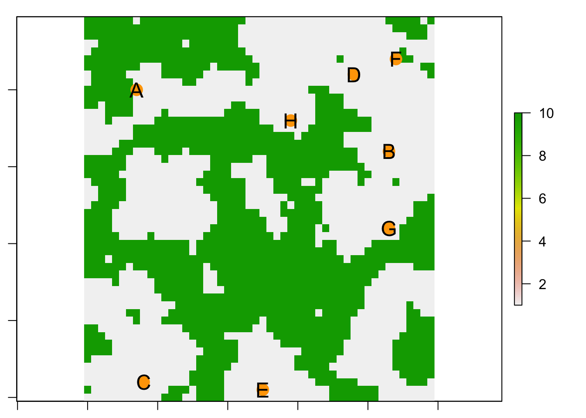
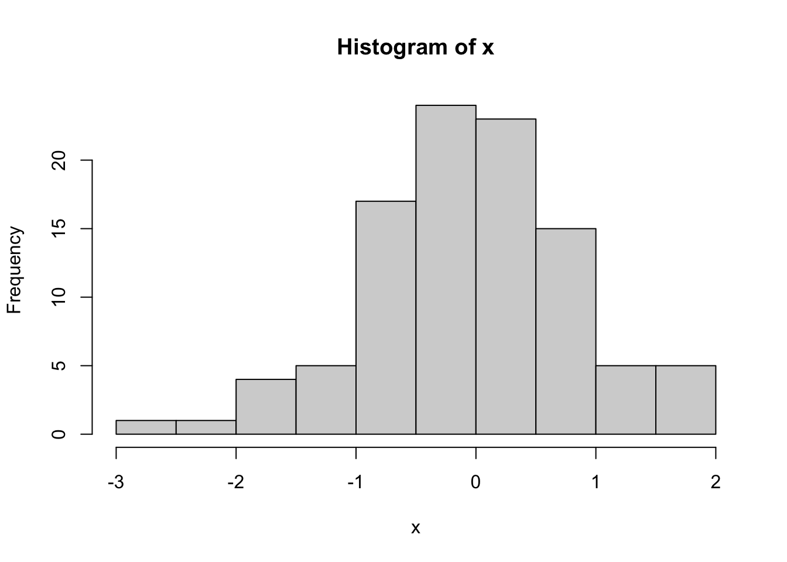
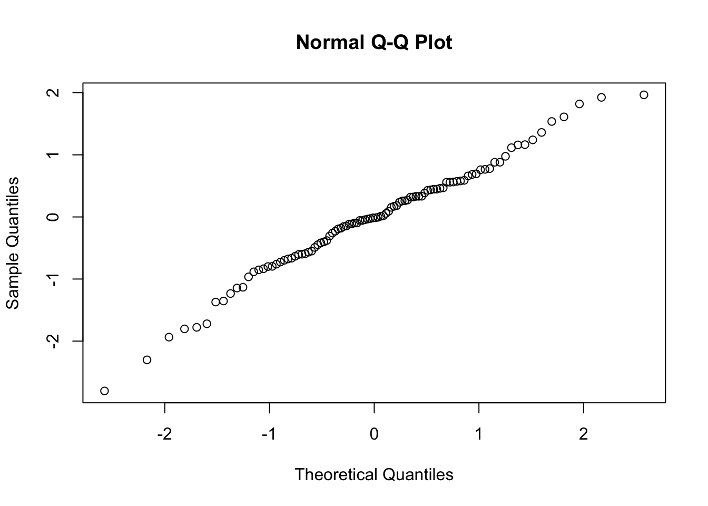

# Week 8: Simulation Experiments {#Week8}


## View Course Video{#video_8}


### Video, Part 1

<iframe width="800" height="513" src="https://sho.co/1A44W" frameborder="0" allowfullscreen></iframe>

### Video, Part 2

<iframe width="800" height="513" src="https://sho.co/1ADVK" frameborder="0" allowfullscreen></iframe>


### Preview Slides

[Download]("https://github.com/hhwagner1/DGS_LG_Labs/raw/master/docs/Video_slides/Week8_Slides.pdf")


## Interactive Tutorial 8{#tutorial_8}

### List of R commands used

<table class="table table-bordered table-striped table-condensed table-responsive table" style="margin-left: auto; margin-right: auto; width: auto !important; margin-left: auto; margin-right: auto;">
 <thead>
  <tr>
   <th style="text-align:left;position: sticky; top:0; background-color: #FFFFFF;"> Function </th>
   <th style="text-align:left;position: sticky; top:0; background-color: #FFFFFF;"> Package </th>
  </tr>
 </thead>
<tbody>
  <tr>
   <td style="text-align:left;"> expand.grid </td>
   <td style="text-align:left;"> base </td>
  </tr>
  <tr>
   <td style="text-align:left;"> seq </td>
   <td style="text-align:left;"> base </td>
  </tr>
  <tr>
   <td style="text-align:left;"> plot(asp=1) </td>
   <td style="text-align:left;"> graphics </td>
  </tr>
  <tr>
   <td style="text-align:left;"> coord_fixed </td>
   <td style="text-align:left;"> ggplot2 </td>
  </tr>
  <tr>
   <td style="text-align:left;"> rnorm </td>
   <td style="text-align:left;"> stats </td>
  </tr>
  <tr>
   <td style="text-align:left;"> runif </td>
   <td style="text-align:left;"> stats </td>
  </tr>
  <tr>
   <td style="text-align:left;"> LETTERS </td>
   <td style="text-align:left;"> base </td>
  </tr>
  <tr>
   <td style="text-align:left;"> paste </td>
   <td style="text-align:left;"> base </td>
  </tr>
  <tr>
   <td style="text-align:left;"> paste0 </td>
   <td style="text-align:left;"> base </td>
  </tr>
  <tr>
   <td style="text-align:left;"> sprintf </td>
   <td style="text-align:left;"> base </td>
  </tr>
  <tr>
   <td style="text-align:left;"> grep </td>
   <td style="text-align:left;"> base </td>
  </tr>
  <tr>
   <td style="text-align:left;"> substr </td>
   <td style="text-align:left;"> base </td>
  </tr>
  <tr>
   <td style="text-align:left;"> strsplit </td>
   <td style="text-align:left;"> base </td>
  </tr>
  <tr>
   <td style="text-align:left;"> gsub </td>
   <td style="text-align:left;"> base </td>
  </tr>
</tbody>
</table>

### Instructions

#### a) How to access tutorials:

Through RStudio Add-in:

- Install course Addins in RStudio: `library(LandGenCourse)`
- In RStudio, click on `Addins` (top menu bar)
- Follow instructions in the Console:
  - type: `require(swirl)` 
  - type: `swirl()` 
  - follow prompts 
  - select course ("Landscape_Genetics_R_Course") and tutorial (Weeks 1 - 8)


#### b) How to complete tutorial:

Follow prompts in the RStudio Console.

To stop and resume a tutorial: 

 - to stop and exit swirl, type: `bye()` 
 - to resume where you stopped, type: `swirl()` 

To restart tutorial from beginning: 

 - type:` swirl()` 
 - use a different name 
   (simply add a number, like this: 'MyName2')

#### c) How to submit answers (participating institutions only):

The last prompt will ask whether you would like to submit the log of your tutorial session to Google Forms so that your instructor may evaluate your progress. **This feature is only available for students from participating institutions.**

If you choose 'yes', a form will open in your web browser. Complete and submit the form. 
    
You can submit multiple attempts and the best attempt will be graded. You will receive full marks as long as you answered all questions (i.e. did not use 'skip'). If you used 'skip' because you could not answer a question, please contact your instructor for advice.


## Worked Example{#WE_8}


### 1. Overview of Worked Example

#### a. Goals 

This worked example shows:

- Simulate a metapopulation on a resistance landscape
- Evaluate the power of a partial Mantel test
- Compare partial Mantel test to 'Sunder'
- Run many simulations and synthesize results

#### b. Data set

We will simulate data using the 'landgenreport' function of the package 'PopGenReport'. See: www.popgenreport.org

#### c. Required R libraries


```r
library(LandGenCourse)
library(PopGenReport )   #load the package
library(secr)            #to create a random habitat
#library(gdistance)
#library(mmod)
library(raster)
#library(tibble)
#library(here)
#library(ggplot2)
#library(Sunder)   # requires mnormt
```

Package 'secr' not automatically installed with 'LandGenCourse':


```r
if(!require(secr)) install.packages("secr", repos='http://cran.us.r-project.org')
#library(secr)
```

The following 'setup chunk' is used to set the root address of file paths to the root of the project folder.


```r
knitr::opts_knit$set(root.dir = normalizePath("..")) 
```

### 2. Initialize a landscape

#### a. Create a random landscape 

We will use the 'randomHabitat' function from the 'secr' package to create a random habitat map and assign resistance values to habitat and non-habitat. There are many alternative ways to define your map, e.g. simply load a png file or any other file format using the 'raster' function from package 'raster' (?raster::raster, see the examples in there). If your map is categorical, assign resistance values to the different values in the raster as shown below for the missing values. If your map is already a resistance surface, skip this step.

Here we use the function 'set.seed' at the beginning of the simulation to make sure we get the same sequence of random numbers everytime we run this code. This makes the exact results reproducible even though we use a random process.

The function 'make.grid' here creates a landscape of nx=50 times xy=50 gridpoints spaced 1 unit (meter) apart. This is returned as a data frame 'tempgrid' with two columns that represent 'x' and 'y' grid coordinates.


```r
nx=50
ny=50
set.seed(555) #(to make sure we have the same example running)
#tempmask<-secr::make.mask(nx=nx,ny=ny,spacing=1)
tempgrid<-secr::make.grid(nx=nx,ny=ny,spacing=1)
```

In the function 'randomHabitat', the argument 'A' specifies the expected proportion of habitat, and 'p' controls the level of fragmentation, i.e., degree of spatial aggregation (sorry this is naming may be a bit confusing, but that's what it says in the help file: ?randomHabitat). The function simulates a map with these parameters and returns a data frame with only those points from 'tempgrid' that are habitat. It expects an input object of class 'mask' (an object type specific to the 'secr' package), hence we pass 'as.mask(tempgrid)'. 

The function 'raster' of the 'secr' package (NOT from the 'raster' package) converts the data frame into a raster object. This object has one numeric variable that is 1 for habitat cells and missing for all other cells, we verify this with 'table'. 

Note: there may be a warning about non-missing arguments, you can ignore it.


```r
#r <- raster(secr::randomHabitat(secr::as.mask(tempgrid), p = 0.5, A = 0.5))
#table(values(r), exclude="")
```

NOTE: April 2021: This does not seem to work anymore. Workaround:


```r
tmp <- secr::randomHabitat(secr::as.mask(tempgrid), p = 0.5, A = 0.5)
r <- as.data.frame(tempgrid) 
r$resistance <- 10
r$resistance[as.numeric(row.names(tmp))] <- 1
r <- rasterFromXYZ(r)
```

Now we set all missing values (i.e., non-habitat) to 10 and verify this again with 'table'.  


```r
#values(r)[is.na(values(r))==T]<-10
table(values(r), exclude="")
```

```
## 
##    1   10 
## 1308 1192
```

```r
par(mar=c(1,1,1,1))
plot(r)
```


We have thus created a numeric raster with a resistance surface where habitat cells (grey) have a resistance value of 1 and non-habitat cells (green) have a resistance value of 10.

#### b. Add populations to the landscape (using minimal distance)

We create a function that allows us to set up 'n' subpopulations in the habitat only (grid cells with value = 1). The subpopulations should be at least 'minDist' units apart, given any resistance surface 'landscape'. We also include an option to plot a raster map with the sampled locations of the populations. 

We define a few variables within the function that help keep track. Note that we keep track of the cells by their raster cell number (which goes from 1:ncells). Here's what the code does:

- Extract all cells that are habitat and store cell number in **HabitatCells**.
- Randomly sample one habitat cell and store its cell number in **Selected**.
- Store cell numbers of all remaining habitat cells in **Remaining**.
- Create a 'while' loop that continues until one of two things happens:
    - Sample size 'n' is reached.
    - There are no cells left in Remaining.
- Inside the loop:
    - Randomly sample one habitat cell and store its number in **Candidate**.
    - Remove the Candidate from Remaining (we don't want to consider it twice).
    - Calculate the **Distance** between Candidate and all populations in Selected. The function 'xyFromCell' gets the cell coordinates for each cell number, and the function 'pointDistance' calculates the distance between two sets of coordinates, here the coordinates for Candidate and for all cells in Selected. The argument 'lonlat=FALSE' tells 'pointDistance' that the coordinates are Euclidean.
    - If the minimum of Distance is larger than 'minDist', add a population. This is done by appending the value in Candidate to the vector Selected.
    - Repeat.
- If requested, the raster map is plotted, cell coordinates for all populations (Selected) are extracted and added to the map as points with point symbol pch=16 (filled circle).


```r
createpops <- function(n=10, minDist=5, landscape=r, habitat=1, plot=TRUE)
{ 
  HabitatCells <- c(1:length(landscape))[values(landscape)==habitat]
  Selected <- sample(HabitatCells, 1)
  Remaining <- HabitatCells[!is.element(HabitatCells, Selected)]
  while (length(Selected) < n & length(Remaining) > 0)
  {
    Candidate <- sample(Remaining, 1)
    Remaining <- Remaining[!is.element(Remaining, Candidate)]
    Distances <- raster::pointDistance(raster::xyFromCell(landscape, Candidate), 
                               raster::xyFromCell(landscape, Selected), 
                               lonlat=FALSE)
    if(min(Distances) > minDist)
    {
      Selected <- append(Selected, Candidate)
    }
  }
  if(plot==TRUE) 
  {
    plot(landscape)  
    points(xyFromCell(landscape, Selected), pch=16)
  }
  return(Selected)
}
```

Test the function above:


```r
par(mar=c(1,1,1,1))
createpops(n=8, minDist = 3, landscape = r, plot = TRUE)
```



```
## [1] 1329  477  396 2498  441  692  602 1190
```

#### c. Initialise a metapopulation 

We use the function 'init.popgensim' from package 'PopGenReport' to initialise a metapopulation based on the grid cells that we just selected. To do this we need to initialise a number of parameters (the locations of the subpopulations, the number of individuals per subpopulation, the number of loci and alleles per loci. For a full list check '?init.popgensim').

To store all the parameters we create a list called para where we store all of them

### 3. Define simulation parameters

#### a. Define your metapopulation

Define metapopulation: 


```r
para<- list()
#Define populations (dynamics)
para$n.pops=8
para$n.ind=100

para$sex.ratio <- 0.5
#age distribution....

para$n.cov <- 3 
#number of covariates (before the loci in the data.frame, do not change this!!)
```

Define population dynamics:


```r
#reproduction
para$n.offspring = 2

#migration
para$mig.rate <- 0.1 

#dispersal: exponential dispersal with maximal distance in map units
para$disp.max=50   #average  dispersal of an individual in meters
para$disp.rate = 0.05 #proportion of dispersing individuals

#Define genetics
para$n.allels <- 10
para$n.loci <- 20
para$mut.rate <- 0.001
```

Define cost distance method:


```r
par(mar=c(1,1,1,1))
para$method <- "leastcost" #rSPDdistance, commute
para$NN <- 8  #number of neighbours for the cost distance method

# Initialize simulation of populations from scratch

 landscape<- r  #<-raster(system.file("external/rlogo.grd", package="raster"))

# Define x and y locations
 
 para$cells <- createpops(n=para$n.pops, minDist = 3, 
                         landscape = landscape, plot = FALSE)
 para$locs <- raster::xyFromCell(landscape, para$cells)
 
 #give the population some names 
 rownames(para$locs) <- LETTERS[1:para$n.pops]
  
  
# Create a matrix of pairwise cost distances...  
 
  cost.mat <- PopGenReport::costdistances(landscape, para$locs, 
                                          para$method, para$NN)
  
# ... and a matrix of pairwise Euclidean distances
  
  eucl.mat <- as.matrix(dist(para$locs))  #needed for the analysis later

# Plot your landscape with the populations....
  plot(landscape)
  points(para$locs[,1], para$locs[,2], pch=16, cex=2, col="orange")
  text(para$locs[,1],para$locs[,2], row.names(para$locs), cex=1.5)
```


```r
# Check the parameter list
  
  para
```

```
## $n.pops
## [1] 8
## 
## $n.ind
## [1] 100
## 
## $sex.ratio
## [1] 0.5
## 
## $n.cov
## [1] 3
## 
## $n.offspring
## [1] 2
## 
## $mig.rate
## [1] 0.1
## 
## $disp.max
## [1] 50
## 
## $disp.rate
## [1] 0.05
## 
## $n.allels
## [1] 10
## 
## $n.loci
## [1] 20
## 
## $mut.rate
## [1] 0.001
## 
## $method
## [1] "leastcost"
## 
## $NN
## [1] 8
## 
## $cells
## [1]  458  894 2359  389 2426  295 1394  680
## 
## $locs
##    x  y
## A  7 40
## B 43 32
## C  8  2
## D 38 42
## E 25  1
## F 44 44
## G 43 22
## H 29 36
```

#### b. Initialise your population on the landscape  

Now finally we can initialise our population using the init function. We'll call it 'simpops.0' to indicate that this is the initial generation.


```r
simpops.0 <- PopGenReport::init.popgensim(para$n.pops, para$n.ind, 
                           para$sex.ratio, para$n.loci, 
                           para$n.allels, para$locs, para$n.cov )  
```

You may want to check the simpops object, which is simply a list of our subpopulation and each individual is coded in a single run in one of the subpopulations.


```r
names(simpops.0)  #the names of the subpopulations
```

```
## [1] "A" "B" "C" "D" "E" "F" "G" "H"
```

```r
head(simpops.0$A[,1:6]) ## a.list of the first 6 individuals and columns of population A
```

```
##   pop    sex age locus1A locus1B locus2A
## 1   1 female  NA       6      10       2
## 2   1 female  NA       4       3       6
## 3   1 female  NA       2      10       9
## 4   1 female  NA       7       9       5
## 5   1 female  NA       3       1       9
## 6   1 female  NA       6       7       3
```

We can also analyse our simpop  object. (e.g. calculate the pairwise Fst value between all the populations).

To be able to do that we first need to convert it into a genind object (because many functions need this type of object as input).


```r
gsp <- PopGenReport::pops2genind(simpops.0, locs =para$locs)
gsp #check the genind object
```

```
## /// GENIND OBJECT /////////
## 
##  // 800 individuals; 20 loci; 200 alleles; size: 738.5 Kb
## 
##  // Basic content
##    @tab:  800 x 200 matrix of allele counts
##    @loc.n.all: number of alleles per locus (range: 10-10)
##    @loc.fac: locus factor for the 200 columns of @tab
##    @all.names: list of allele names for each locus
##    @ploidy: ploidy of each individual  (range: 2-2)
##    @type:  codom
##    @call: df2genind(X = res, sep = "/", ind.names = rownames(res), pop = combine$pop)
## 
##  // Optional content
##    @pop: population of each individual (group size range: 100-100)
##    @other: a list containing: xy
```

```r
summary(gsp)  #some summary statistics
```

```
## 
## // Number of individuals: 800
## // Group sizes: 100 100 100 100 100 100 100 100
## // Number of alleles per locus: 10 10 10 10 10 10 10 10 10 10 10 10 10 10 10 10 10 10 10 10
## // Number of alleles per group: 200 200 200 200 200 200 200 200
## // Percentage of missing data: 0 %
## // Observed heterozygosity: 0.9 0.89 0.89 0.89 0.9 0.89 0.9 0.92 0.9 0.9 0.91 0.9 0.9 0.88 0.9 0.9 0.91 0.9 0.89 0.88
## // Expected heterozygosity: 0.9 0.9 0.9 0.9 0.9 0.9 0.9 0.9 0.9 0.9 0.9 0.9 0.9 0.9 0.9 0.9 0.9 0.9 0.9 0.9
```

```r
round(mmod::pairwise_Gst_Nei(gsp),5)
```

```
##          A        B        C        D        E        F        G
## B -0.00012                                                      
## C  0.00006  0.00001                                             
## D -0.00019 -0.00060  0.00022                                    
## E  0.00010 -0.00030 -0.00014 -0.00058                           
## F  0.00016 -0.00031  0.00002 -0.00019 -0.00009                  
## G -0.00020 -0.00046  0.00022 -0.00023 -0.00027 -0.00013         
## H -0.00045 -0.00013 -0.00009 -0.00008 -0.00007 -0.00033 -0.00020
```

Is there an effect of the landscape on the population structure (there should not be after initialisation)?

The function 'pairwise.fstb' is around 150 times faster than mmod::pairwise_Gst_Nei, but slightly different.


```r
gen.mat <- PopGenReport::pairwise.fstb(gsp)  
round(gen.mat ,5)
```

```
##         A       B       C       D       E       F       G       H
## A 0.00000 0.00239 0.00256 0.00231 0.00260 0.00266 0.00231 0.00205
## B 0.00239 0.00000 0.00252 0.00191 0.00220 0.00220 0.00205 0.00238
## C 0.00256 0.00252 0.00000 0.00273 0.00237 0.00253 0.00273 0.00241
## D 0.00231 0.00191 0.00273 0.00000 0.00193 0.00232 0.00228 0.00243
## E 0.00260 0.00220 0.00237 0.00193 0.00000 0.00241 0.00224 0.00244
## F 0.00266 0.00220 0.00253 0.00232 0.00241 0.00000 0.00237 0.00218
## G 0.00231 0.00205 0.00273 0.00228 0.00224 0.00237 0.00000 0.00230
## H 0.00205 0.00238 0.00241 0.00243 0.00244 0.00218 0.00230 0.00000
```

Now we perform a two partial Mantel tests, one for the effect of the cost distance partialling out the effect of Euclidean distance (Gen ~cost | Euclidean), and one the other way round. The method 'wassermann' from the 'PopGenReport' package returns a data frame with two rows (one for each test) and three columns (model, r = Mantel r statistic, p = p-value), following this method:

- Wassermann, T.N., Cushman, S. A., Schwartz, M. K. and Wallin, D. O. (2010). Spatial scaling and multi-model inference in landscape genetics: Martes americana in northern Idaho. Landscape Ecology, 25(10), 1601-1612.


```r
PopGenReport::wassermann(eucl.mat = eucl.mat, cost.mats = list(cost=cost.mat), 
                           gen.mat = gen.mat, plot=F)$mantel.tab
```

```
##                   model      r     p
## 2 Gen ~Euclidean | cost 0.1578 0.248
## 1 Gen ~cost | Euclidean  0.151 0.268
```

Check the pairwise Fst values, why are they so low? Hints:

- How were genotypes assigned to the initial generation
- How many generations have we simulated thus far?
- At this point in the simulation, do you expect to see an effet of IBD, IBR, or neither?

### 4. Run simulations and analyze results

#### a. Run your simulation over multiple time steps (years) 

Now we can run our simulation by simply passing our object 'simpops' to the function 'run.popgensim', with some additional parameters that are needed for the simulation. We specify the number of generations the simulation should run with the steps parameter. (Check ?run.popgensim for a description of all parameters).

Important to understand is the idea of the cost.mat (which is the cost matrix that is used for the distance between subpopulation). The n.alleles, n.ind cannot be different from the initialisation.


```r
simpops <- PopGenReport::run.popgensim(simpops.0, steps=3, cost.mat, 
                         n.offspring=para$n.offspring, n.ind=para$n.ind,
                         para$mig.rate, para$disp.max, para$disp.rate, 
                         para$n.allels, para$mut.rate,
                         n.cov=para$n.cov, rec="none")
```

In essence we were running a metapopulation with 100 individuals per subpopulation on our resistance landscape for 3 generations. The question is now was that enough time to create an effect on population structure?

#### b. Analyse your simulated population with a partial Mantel test

Let's check the pairwise Fst values and then do a landscape genetic analysis using partial Mantel tests.

Convert to genind to calculate pairwise Fst.


```r
gsp <- PopGenReport::pops2genind(simpops, para$locs, para$n.cov)
```

Calculate your genetic distance matrix e.g. fst or D.


```r
gen.mat <- PopGenReport::pairwise.fstb(gsp)   
round(gen.mat ,3)
```

```
##       A     B     C     D     E     F     G     H
## A 0.000 0.008 0.008 0.006 0.008 0.006 0.007 0.008
## B 0.008 0.000 0.008 0.007 0.009 0.007 0.008 0.008
## C 0.008 0.008 0.000 0.008 0.009 0.007 0.008 0.007
## D 0.006 0.007 0.008 0.000 0.008 0.006 0.007 0.007
## E 0.008 0.009 0.009 0.008 0.000 0.009 0.009 0.010
## F 0.006 0.007 0.007 0.006 0.009 0.000 0.007 0.006
## G 0.007 0.008 0.008 0.007 0.009 0.007 0.000 0.007
## H 0.008 0.008 0.007 0.007 0.010 0.006 0.007 0.000
```

Partial Mantel test:


```r
PopGenReport::wassermann(eucl.mat = eucl.mat, cost.mats = list(cost=cost.mat), 
             gen.mat = gen.mat, plot=F)$mantel.tab
```

```
##                   model       r     p
## 1 Gen ~cost | Euclidean  0.5525 0.025
## 2 Gen ~Euclidean | cost -0.3513 0.911
```
We can extract a specific value from this result, e.g., the p-value of the test "Gen ~cost | Euclidean". (Note that every time we call the function 'wassermann', a permutation test is performed (default: 'nperm = 999'), and the p-value may thus vary somewhat).


```r
res <- PopGenReport::wassermann(eucl.mat = eucl.mat, 
                                cost.mats = list(cost=cost.mat), 
                                gen.mat = gen.mat, plot=F)$mantel.tab
res[res$model == "Gen ~cost | Euclidean", "p"]
```

```
## [1] "0.035"
```

#### c. Optional: Analyze your simulated populations using 'Sunder'

See: http://www.nbi.dk/~botta/Sunder.html#overview

Sunder is an alternative (faster) implementation of BEDASSLE, which uses molecular covariance analysis as an alternative to partial Mantel test. All we want from this method for now is the best-model (note that there is no alternative 'none'):

- **G**: Geographic distance model (IBD)
- **G**: Ecological distance model (IBR)
- **G+E**: Both

To perform the Sunder analysis, we need to reformat the allele frequencies into a three-dimensional array (site x locus x allele). Here we define a function that takes as argument a 'genind' object and reformats it as needed.


```r
getArray <- function(gen)
{
  tmp <- Reduce(rbind,lapply(split(data.frame(gen@tab), gen@pop), 
                               colSums, na.rm=TRUE))
  row.names(tmp) <- levels(gen@pop)
  tmp <- split(data.frame(t(tmp)), gen@loc.fac)
  Array <- array(0, dim=c(ncol(tmp[[1]]), length(tmp), nrow(tmp[[1]])))
  for(i in 1:length(tmp))
  {
    Array[,i,] <- t(tmp[[i]])
  }
  return(Array)
}
```

Apply the function to the genind object 'gsp' with the simulated genotypes:


```r
Array <- getArray(gsp)
dim(Array)
```

```
## [1]  8 20 10
```

Run the analysis (parameter settings: http://www.nbi.dk/~botta/Sunder.html#overview)


```r
D.G <- as.matrix(dist(para$locs))
D.E <- cost.mat
nit <- 10^2   ### j.st for the example, should be much larger, e.g. 50000
output <- Sunder::MCMCCV(Array,D.G,D.E,
                     nit=nit,thinning=max(nit/10^3,1),
                     theta.max=c(10,10*max(D.G),10*max(D.E),1,0.9),
                     theta.init=c(1,2,1,1,0.01),
                     run=c(1,1,1), ud=c(0,1,1,0,0),
                     n.validation.set=dim(Array)[1]*dim(Array)[2]/10,
                     print.pct=FALSE)
```

```
## Computations for model 'geog+envi'
## Computations for model 'geog'
## Computations for model 'envi'
```

Quick answer: the winner (best supporte model) is ...


```r
names(which.max(output$mod.lik))
```

```
## [1] "G+E"
```

What did we just do? We extracted the log-likelihood values for the three models 'G', 'E' and 'G+E', determined which value was the highest, and extracted the name of the winning model. Let's verify this by printing the log-likelihood values. The best model has the highest (= least negative) log-likelihood.


```r
print(output$mod.lik)
```

```
##       G+E         G         E 
## -8983.219 -8991.129 -9009.385
```

Let's combine all of this into our own function to convert the genind object, calculate Sunder and extract the name of the best fitting model


```r
getSunder <- function(gen=gsp, locs=para$locs, cost=cost.mat, nit=10^2)
{
  Array <- getArray(gen)
  D.G <- as.matrix(dist(locs))
  D.E <- cost
  output <- Sunder::MCMCCV(Array,D.G,D.E,
                     nit,thinning=max(nit/10^3,1),
                     theta.max=c(10,10*max(D.G),10*max(D.E),1,0.9),
                     theta.init=c(1,2,1,1,0.01),
                     run=c(1,1,1), ud=c(0,1,1,0,0),
                     n.validation.set=dim(Array)[1]*dim(Array)[2]/10,
                     print.pct=FALSE)
  return(names(which.max(output$mod.lik)))
}
```

Let's test it:


```r
getSunder()
```

```
## Computations for model 'geog+envi'
## Computations for model 'geog'
## Computations for model 'envi'
```

```
## [1] "G+E"
```

### 5. Run simulator using a previously defined parameter set

Once the simulator works and you are certain that you understand how the simulator needs to be set up for a single run, in almost all studies on simulations you want to be able to re-run the simulator in an automatized way. There are several reasons why you want to do that.

1. You want to perform a sensitivity analysis on a single parameter, which means, try to find how much does the output (e.g. pairwise Fst between subpopulations) change when you vary an input parameter (e.g. number of loci). 
2. You want to explore the "complete" parameter space, which means, instead of changing  values of a single input parameter you want to change all parameters (within certain levels) and run their combinations. 
3. Another reason is that you want to create a simulated test data set that forms the backbone of your future studies.

So we would like to do the following. 

- a) Specify and record all the parameter combinations that you would like to run.  
- b) Run the simulator with every combination 
- c) [Optional] save your complete simulation run (recommended, but sometimes prohibitive due to needed resources) or only a calculated summary.
- d) Read in your simulations, analyse them and synthesize your results via additional statistics, tests, plots.
- e) Publish an enormously important paper....


Admittedly there are several different approaches and as it seems every modeller has a slightly different way to achieve these steps. One approach is to create a parameter file that records all the parameter setting for each run. Another approach is to create so called scripts for every single run. The advantage here is that scripts can be easily distributed across different cores and machines and therefore this approach is easy to parallelise your runs, which sometimes is necessary. Finally the approach I will present here (also because of practical reasons) is to create an R data.frame that stores all the parameter settings and we run all combinations in serial mode instead of in parallel. 

Okay before we start we need to think about what kind of parameters we want to explore. I would like to do the following runs:

- Run our simulations as above (same parameter settings) for varying time steps (say between 5 to 45 years in steps of 20). We'll keep the number of levels and the maximum number of steps low in this example to limit computation time. Feel free to expand! 
- As output I would still like to record the Fst value, but also the full genetic data set and the parameters used to run the simulation.
- In addition I want to repeat each run 5 times (most often you would do more repetitions) to check how much general variation there is between runs with exactly the same parameter combination. 

#### a. Specify and record the parameter combinations

Let's define the varying numbers of time steps we would like to run the simulations. Here we define a sequence from 5 to 45 in steps of 20, which results in a series c(5, 25, 45). We will interpret these values as numeric, therefore we don't convert to 'factor'. 


```r
timesteps <- seq(from=5 , to=45, by=20)
```

We also specify the number of repeats (replicate simulation runs). We want to do five replicate simulation runs per for each level of 'time', and we will label replicates from 1 through 5. These are essentially labels and we'll save them as a factor:


```r
repeats <- factor(1:5)
```

Now we would like to have a data frame that stores all possible combinations for those two parameters. As simple way to do that in R, is to use the 'expand.grid' function.


```r
para.space <- expand.grid(rep=repeats, time=timesteps)
tibble::as_tibble(para.space)
```

```
## # A tibble: 15 x 2
##    rep    time
##    <fct> <dbl>
##  1 1         5
##  2 2         5
##  3 3         5
##  4 4         5
##  5 5         5
##  6 1        25
##  7 2        25
##  8 3        25
##  9 4        25
## 10 5        25
## 11 1        45
## 12 2        45
## 13 3        45
## 14 4        45
## 15 5        45
```

As you can see this results in 15 combinations (3 time steps x 5 repeats). The beauty of this approach is that it is very flexible and adaptable to runs over other parameter combinations, as you can provide more than two parameter variables to 'expand.grid'.

#### b. Run the simulator over every parameter combination.

Remember our parameters are all defined in the 'para' object (a list) and we want to keep them constant, except for running the simulation for different number of years. This means that we only need to modify the argument 'steps'.

Summarizing the code from above, a single run of our simulator runs via:


```r
#initialize
simpops.0 <- PopGenReport::init.popgensim(para$n.pops, para$n.ind,
                           para$sex.ratio, para$n.loci, 
                           para$n.allels, para$locs, para$n.cov )  
#run for 20 generations
simpops <- PopGenReport::run.popgensim(simpops.0, steps=20, cost.mat, 
                         n.offspring=para$n.offspring, n.ind=para$n.ind,
                         para$mig.rate, para$disp.max, para$disp.rate, 
                         para$n.allels, para$mut.rate,
                         n.cov=para$n.cov, rec="none")
```

We adapt this code as follows:

- Create a 'for' loop that cycles through every row 'i' in 'para.space'
- For each value of 'i':
    - Initialize population 'simpops.0.'
    - Run the simulation with argument 'steps = para.space$time[i]'.

We are not running the code just yet, hence it is commented-out with '#'.


```r
#for (i in 1:nrow(para.space))
#{
#  #initialize
#  simpops.0 <- PopGenReport::init.popgensim(para$n.pops, para$n.ind, 
#                           para$sex.ratio, para$n.loci, para$n.allels, 
#                           para$locs, para$n.cov )
#  
#  #run for para.space$time[i] generations
#  simpops <- PopGenReport::run.popgensim(simpops.0, 
#                           steps=para.space$time[i], cost.mat,
#                           n.offspring=para$n.offspring, n.ind=para$n.ind,
#                           para$mig.rate, para$disp.max, para$disp.rate, 
#                           para$n.allels, para$mut.rate,
#                           n.cov=para$n.cov, rec="none")
#}
```

Have a close look at the change.

Question: what changes between replicate runs, and what not? Consider the following aspects:

- Landscape
- Population locations
- Pairwise distances (cost, Euclidean)
- Initial populations with initial genotypes
- Migration and gene flow

#### c. Save your complete simulation run (input and output)

Simply running the simulation 15 times (number of rows in 'para.space') by itself is not useful yet. We need to store the simulation runs somehow, so we can collect them afterwards to calculate summary statistics and analyse the runs. 

How do we store the repeats seperately in a file? One approach would be to have a different file name for every repeat, but in my view, a cleaner approach is to store all simulation outputs and also store the complete parameter and input information in a file, so everything that is need is in one place. A nice way to do that in R is to create a 'list' object that stores all in a single object, which can be saved (and is automatically packed) and re-loaded as an R object. This is convenient as long as I only want to analyze the results in R, not export to other software. 

Here we do the following:

- Create a timer with the function 'proc.time' so that we know roughly how long the computations take.
- For each line 'i' in 'para.space':
    - Initialize simpops.0.
    - Run the simulation with 'steps=para.space$time[i]'.
    - Convert the resulting 'simpop' to a genind object 'gi' (smaller to store)
    - Create a list 'sim' of all simulation parameters we want to store. 
    - Save the object 'sim' as an 'RData' file with a unique file name in the folder 'output/simout' in the project directory.
    - Print a message after each run to report progress and computation time.
    - Flush the output console to make sure it is current (only relevant for console-based versions of R).

The list 'sim' will contain the following elements. Note: the name is repeated (e.g., 'gi = gi') to create a named list, i.e., to specify the names of the list elements.

- **para.space**: the row 'para.space[i]' with settings of the simulation run.
- **para**: a copy of the list 'para' that contains the other parameters that are the same for all simulation runs.
- **landscape**: the landscape.
- **cost.mat**: the matrix of pairwise cost distances
- **gi**: the genind object that contains the genotypes at the end of the simulation.

First we make sure the folder `simout` exists within the `output` folder in the R project:


```r
if(!dir.exists(paste0(here::here(),"/output"))) 
  dir.create(paste0(here::here(),"/output"))
if(!dir.exists(paste0(here::here(),"/output/simout")))
  dir.create(paste0(here::here(),"/output/simout"))
```


```r
## c.eate a timer (just to know how long it will take roughly)
timer0 <- round(proc.time()[3],2)

for (i in 1:nrow(para.space))
{
  ## i.itialize
  simpops.0 <- PopGenReport::init.popgensim(para$n.pops, para$n.ind, 
                           para$sex.ratio, para$n.loci, para$n.allels, 
                           para$locs, para$n.cov )  
  
  # run for para.space$time[i] generations
  simpops <- PopGenReport::run.popgensim(simpops.0, 
                           steps=para.space$time[i], cost.mat, 
                           n.offspring=para$n.offspring, n.ind=para$n.ind,
                           para$mig.rate, para$disp.max, para$disp.rate, 
                           para$n.allels, para$mut.rate,
                           n.cov=para$n.cov, rec="none")
  
  ## c.nvert to genind object (smaller)
  gi <- PopGenReport::pops2genind(simpops)
  
  ## c.eate a list of all I want to collect
  sim <- list(para.space=para.space[i,], para=para, 
              landscape=landscape, cost.mat=cost.mat, gi=gi)
  
  # save everything in an output folder (with a consecutive number, with three leading zeros, so the file sorting is nicer)

  save(sim, file = paste0(here::here(),"/output/simout/sim_time5-45_rep5_",
                          sprintf("%03i",i) ,".RData"))
  
  cat(paste0("Finished run: ", i," out of ",nrow(para.space),
            ". So far, it took: ", round(proc.time()[3]-timer0,2)," sec.\n"))
  flush.console()
}
```

```
## Finished run: 1 out of 15. So far, it took: 0.37 sec.
## Finished run: 2 out of 15. So far, it took: 0.78 sec.
## Finished run: 3 out of 15. So far, it took: 1.22 sec.
## Finished run: 4 out of 15. So far, it took: 1.65 sec.
## Finished run: 5 out of 15. So far, it took: 2.08 sec.
## Finished run: 6 out of 15. So far, it took: 3.94 sec.
## Finished run: 7 out of 15. So far, it took: 5.75 sec.
## Finished run: 8 out of 15. So far, it took: 7.56 sec.
## Finished run: 9 out of 15. So far, it took: 9.37 sec.
## Finished run: 10 out of 15. So far, it took: 11.23 sec.
## Finished run: 11 out of 15. So far, it took: 14.53 sec.
## Finished run: 12 out of 15. So far, it took: 17.59 sec.
## Finished run: 13 out of 15. So far, it took: 20.62 sec.
## Finished run: 14 out of 15. So far, it took: 23.64 sec.
## Finished run: 15 out of 15. So far, it took: 26.69 sec.
```

#### d. Analyze and synthesize results 

If you check your output folder (simout) you should see 15 files.

Note: File paths can be different when you execute a chunk in an R notebook compared to when you copy-paste the same line into the console! We avoid this problem by using the function 'here' from package 'here'. 


```r
head(dir(paste0(here::here(), "/output/simout")))
```

```
## [1] "sim_time5-45_rep5_001.RData" "sim_time5-45_rep5_002.RData"
## [3] "sim_time5-45_rep5_003.RData" "sim_time5-45_rep5_004.RData"
## [5] "sim_time5-45_rep5_005.RData" "sim_time5-45_rep5_006.RData"
```

Now we are at step D where we need to read in all our files one by one, calculate some summary statistics and plot our results. 

Again, this could be easy, but be aware if you have thousands of files it could take quite some time and memory. The most convenient way is to load everyting and store it in a list, so we can access all of our simulations from memory. I will show how to do this in the example below, but be aware in larger simulations (think millions of runs, or large sample sizes) this is not possible and we would load a single simulation, calculate a statistic, store only the result in a table and free the memory for the next simulation run.

Let's load our simulation runs. There is one caveat: when we load the object 'sim' from the '.RData file', we can't assign it a new object name. I.e., we can't use 'newName <- load("sim.Rdata"). Instead, we can only type 'load("sim.Rdata")' and it will create or overwrite the object 'sim'. Also, R takes the name from the object that was saved, not from the file name. Hence, once we load the object, any existing object of the same name will be overwritten. So if we want to keep, it we need to rename it before using 'load'.

Here we do the following:

- Create an empty table with three columns 'rep', 'time', 'fst' and other columns to collect summary results for the 15 simulation runs. 
- Create a vector that contains all filenames. The function 'list.files' does just that. We specify with path="./simout"' that the files in folder 'simout' should be listed, and with 'pattern="sim" we specify that we want all file names that contain the expression "sim" (we could also have used "time", for example - any component of the file name that is shared by all the files we are interested in but no other files that might be in the same folder).
- Loop through the files. For each filename 'i':
    - Load the file, which will create or overwrite the object 'sim'. We need to supply not only the file name but the path, hence 'paste0("./simout/",filenames[i])' (see Week 8 video for more on file paths).
    - Extract simulation parameters: Copy the ith row from 'para.space' (repeat number, timesteps) into the first two columns of the ith row of 'res'.
    - Extract the genind object 'gi' with the final genotypes.
    - Calculate the mean of pairwise fst values and store in the third column of the ith row of 'res'.
    - Perform partial Mantel tests with function 'wasserman' and store the Mantel r statistics and the p-values in the corresponding columns. Note that this is somewhat tricky because the function 'wasserman' ranks the models and the better fitting model is listed in the first row, so that the order of the models can vary between runs. Therefore we extract the values based on model name.
    - Perform 'Sunder' covariance analysis and extract which model is best supported ('G', 'E' or 'GE').


```r
res <- data.frame(rep=NA, time=NA, fst=NA, r.Eucl=NA, p.Eucl=NA, 
                  r.cost=NA, p.cost=NA, Sunder=NA)

#load all files in the folder
filenames <- list.files(path= paste0(here::here(), "/output/simout"), pattern="sim")

for (i in 1:length(filenames))
{
  #creates a sim object
  load(paste0(here::here(), "/output/simout/",filenames[i]))

  #now let us take what we need from the simulation
  res[i,1:2] <- sim$para.space
  
  #calculate a summary statistic: mean of pairwise fst values
  ## h.re we only take the lower triangle of the matrix to avoid the diagonal values,
  # which are zero by definition (comparing each population to itself)
  gen.mat <- PopGenReport::pairwise.fstb(sim$gi)  
  res [i,3] <- mean(gen.mat[lower.tri(gen.mat)])
  
  #partial Mantel tests
  wass <- PopGenReport::wassermann(eucl.mat = dist(sim$para$locs), 
                                cost.mats = list(cost=sim$cost.mat), 
                                gen.mat = gen.mat, plot=F)$mantel.tab
  res[i,4:5] <- wass[wass$model == "Gen ~Euclidean | cost", 2:3]
  res[i,6:7] <- wass[wass$model == "Gen ~cost | Euclidean", 2:3]
  
  #Sunder
  res[i,8] <- getSunder(gen=sim$gi, locs=sim$para$locs, 
                           cost=sim$cost.mat, nit=10^2) #if you have time, set nit=10^3
}
```

```
## Computations for model 'geog+envi'
## Computations for model 'geog'
## Computations for model 'envi'
## 
## Computations for model 'geog+envi'
## Computations for model 'geog'
## Computations for model 'envi'
## 
## Computations for model 'geog+envi'
## Computations for model 'geog'
## Computations for model 'envi'
## 
## Computations for model 'geog+envi'
## Computations for model 'geog'
## Computations for model 'envi'
## 
## Computations for model 'geog+envi'
## Computations for model 'geog'
## Computations for model 'envi'
## 
## Computations for model 'geog+envi'
## Computations for model 'geog'
## Computations for model 'envi'
## 
## Computations for model 'geog+envi'
## Computations for model 'geog'
## Computations for model 'envi'
## 
## Computations for model 'geog+envi'
## Computations for model 'geog'
## Computations for model 'envi'
## 
## Computations for model 'geog+envi'
## Computations for model 'geog'
## Computations for model 'envi'
## 
## Computations for model 'geog+envi'
## Computations for model 'geog'
## Computations for model 'envi'
## 
## Computations for model 'geog+envi'
## Computations for model 'geog'
## Computations for model 'envi'
## 
## Computations for model 'geog+envi'
## Computations for model 'geog'
## Computations for model 'envi'
## 
## Computations for model 'geog+envi'
## Computations for model 'geog'
## Computations for model 'envi'
## 
## Computations for model 'geog+envi'
## Computations for model 'geog'
## Computations for model 'envi'
## 
## Computations for model 'geog+envi'
## Computations for model 'geog'
## Computations for model 'envi'
```

Look at the 'res' data frame and check the results. 


```r
head(res)
```

```
##   rep time         fst  r.Eucl p.Eucl  r.cost p.cost Sunder
## 1   1    5 0.009340057  0.0455  0.494  0.1492  0.305    G+E
## 2   2    5 0.009210392 -0.1807  0.723  0.4638  0.045      E
## 3   3    5 0.008996691  0.2389  0.198 -0.0054  0.508      G
## 4   4    5 0.010043283 -0.0772  0.624  0.1089  0.356      E
## 5   5    5 0.009755578 -0.1557  0.739    0.21   0.25      G
## 6   1   25 0.022190031  0.0424  0.425  0.5067  0.059    G+E
```

The next step would be to visualise the results (e.g. plot runs over times and color by rep). A quick way to do that is to use the function 'ggplot' from the 'ggplot2' package. Here we add a jitter to keep points from overlapping too much.


```r
ggplot2::ggplot(res, ggplot2::aes(x=time, y=fst)) + 
         ggplot2::geom_point(position = ggplot2::position_jitter(w = 0.5))
```


Now it is again time for you to experiment. For example, why not set up a simulation that varies the number of loci. Or as you may have seen even after 100 generation there was no sign that the mean pairwise Fst value is levelling off. So how long do you have to run a simulation in terms of time to see this (be aware that simulation runs take longer if you increase the number of timesteps)?

Questions:

- How would you set up a simulation experiment to compare type I error rates between partial Mantel test and Sunder?
- How about statistical power? 

Have fun and please give us feed back what you think about this Worked Example. [Bernd Gruber](mailto:bernd.gruber@canberra.edu.au), [Erin Landguth](erin.landguth@gmail.com), [Helene Wagner](mailto:helene.wagner@utoronto.ca).


## R Exercise Week 8

**Task:** Carry out a permutation test for the Mantel rank correlation to test for fine-scale spatial genetic structure in *Pulsatilla vulgaris* adults, using the pooled data from all seven patches. Use a one-sided alternative "greater", as we expect the Mantel rank correlation to be positive.

**Hints:**

  - Exclude all pairs that involve individuals from different patches.
  - Permute individuals only within patches, not between patches. 
  - Calculate the Mantel rank correlation for the observed data (M.rho.obs)
  - For each of R = 499 permutations, calculate M.rho.sim
  - Determine the approximate p-value of the one-sided test with alternative "greater" as the percentage of the 500 values (1 observed, 499 permuted) that are greater or equal to the observed one. 

a) **Load packages**: You may want to load the packages `dplyr` and `gstudio`. Alternatively, you can use `::` to call functions from packages.


b) **Import data, extract adults**. Use the code below to import the data into `gstudio` and extract adults (`OffID == 0`). 


```r
library(dplyr)
Pulsatilla.gstudio <- gstudio::read_population(path=system.file("extdata",
                            "pulsatilla_genotypes.csv", 
                            package = "LandGenCourse"), 
                    type="column", locus.columns=c(6:19), 
                    phased=FALSE, sep=",", header=TRUE)
Adults.gstudio <- Pulsatilla.gstudio %>% filter(OffID == 0)
```

c) **Sort individuals by patch**. Create a new ID variable `Names` that combines the existing variables `Population` and `ID` (starting with population). Then use the function  `dplyr::arrange` to sort `Adults.gstudio` by `Names` (check the help file for `arrange`). This is important here for two reasons:

    - In order to efficiently permute individuals within patches, they need to be sorted by patch.
    - In some cases, the function `gstudio::genetic_distance` will sort the distance matrix alphabetically. To avoid mismatches between the data and the resulting distance matrix, it is best to sort the data alphabetically already. 

d) **Calculate Euclidean distances**: Use the metric coordinates in variables "X" and "Y" to calculate Euclidean distances (see Week 5, section 4). Here it is important to store the distances `Dgeo` in the full matrix format, with `as.matrix`. 

e) **Calculate genetic distances (Dps)**: Use the following code (as needed (adapt if needed) to calculate individual-level genetic distances (proportion of shared alleles) and store them in the full matrix format. We subtract values from 1 to obtain a distance measure. Note: the calculation in `gstudio` is based on Bray distance and the resulting values are proportional to those calculated by `adegenet::propShared`. I.e., the two measures have a correlation of 1 but the actual values differ.

    `Dgen <- 1 - as.matrix(gstudio::genetic_distance(Adults.gstudio, stratum="Names", mode="dps"))`


f) **Plot distances, calculate M.rho**: Create a plot of Dgen vs Dgeo, and calculate the Mantel rank correlation. Note: the function 'cor' with default settings does not allow missing values (NA). This can be changed e.g. with the argument `use`.

    - Use `as.dist` to access only the values from the lower triangle of each matrix. 
    - The function `plot` will do. Inspect the plot. Where would you find the pairs of individuals within the same patch? 
    - Use the function `cor` with `method = "spearman"` to calculate the Mantel rank correlation. Allow for missing values with the argument `use = "complete.obs"`.

g) **Limit to within-patch pairs**: Restrict the analysis to pairs within the same patch.
For this, we want to set all between-site comparisons in `Dgeo` to `NA`. Uncomment the code below to:

    - Create a matrix that is TRUE if the two individuals are in the same patch, and FALSE if not (first line)
    - Change FALSE to NA (second line)
    - Multiply Dgeo by this matrix to set distances between patches to NA (third line).
    - Adapt your code from above to plot the distances Dgen vs. Dgeo.within.
    - Calculate the Mantel rank correlation between Dgen vs. Dgeo.within and store it as `Cor.obs`. 


```r
#SamePatch <- outer(Adults.gstudio$Population, Adults.gstudio$Population, FUN = "==")
#SamePatch[SamePatch == "FALSE"] <- NA
#Dgeo.within <- SamePatch * Dgeo
```

  Note: check the help file or run the following examples to figure out what `outer` does: 
    `outer(c(1:5), c(1:5), FUN = "*")`
    `outer(c(1:5), c(1:5), FUN = "-")`
    `outer(LETTERS[1:5], c(1:5), FUN = "paste0")`
    
h) **Unrestricted permutation test**: Create a variable `Order` with row numbers (from 1 to the number of individuals in `Adults.gstudio`). Then, uncomment the code below (adapt as needed) to carry out a permutation test by permuting the order of individuals, R = 499 times. Notes to permute a distance matrix, we need to permute the rows and columns of the full distance matrix simultaneously with the same order: `Dgen[a,a]`. We only need to permute one of the two matrices (Dgen or Dgeo.within), but not both. The approximate p-value is calculated as the proportion of values (R simulated ones and 1 observed `Cor.obs`) that were as large, or larger, than `Cor.obs`. 


```r
#R = 499
#Cor.perm.unrestricted <- rep(NA, R)
#for(r in 1:R)
#{
#  a <- sample(Order)
#  Cor.perm.unrestricted[r] <- cor(as.dist(Dgen[a,a]),as.dist(Dgeo.within), method="spearman", use="complete.obs")
#}
#approx.p.unrestricted <- mean(c(Cor.obs, Cor.perm.unrestricted) >= Cor.obs)
#approx.p.unrestricted
```

i) **Restricted permutation test**: Adapt the code to permute individuals only within patches. For this, split 'Order' by population, randomize row numbers within groups (list elements = populations) with `sapply`, and use `unlist` to convert to a vector again. Make sure to change object names from 'unrestricted' to 'restricted'.

    - Before the `for` loop, add this code: `b <- split(Order, Adults.gstudio$Population)`
    - Inside the `for` loop, replace the calculation of a : `a <- unlist(sapply(b, sample))`

k) **Compare results**: Create side-by-side boxplots of the simulated Mantel rank correlation values for the unrestricted and the restricted permutation tests. Note: if none of the simulated values was larger than Cor.obs, the approx. p-value will be 1/(R+1). This indicates the resolution of the permutation test, i.e., the smallest possible p-value given R.

**Questions:** 

- Did the direction, size or statistical significance of the observed Mantel rank correlation (as a measure of fine-scale spatial genetic structure in *P. vulgaris*) change between the unrestricted and the restricted permutation test? Why, or why not?
- How did the distributions of the simulated values of the Mantel rank correlation differ between the unrestricted and the restricted test? Can you think of a reason for this?


## Bonus Vignette {#bonus_8a}


### 1. Overview of Bonus Material

#### a. Goals 

This Bonus Material provides some introductory worked examples for:

- Navigating the file system
- Benchmarking file import and export functions
- Profiling an R script
- Creating and executing a Bash R script
- Parallelizing code

#### b. Data set

We will use the wolf SNP data (Schweizer et al., 2016) from the Week 11 worked example. The genetic data are individual-based, and are input as allele counts (i.e. 0/1/2) for each locus. We are using a randomly sampled subset of 10,000 single nucleotide polymorphism (SNP) markers from the full data set (which contains 42,587 SNPs).

#### c. Required R libraries


```r
library(LandGenCourse)
#library(microbenchmark)
#library(profvis)
#library(here)
#library(readr)
#library(data.table)
#library(feather)
#library(rio)
#library(devtools)
#library(parallel)
#library(doParallel)
#library(knitr)
#library(compiler)
```

### 2. Navigating the file system

This Bonus material assumes that you are running R in RStudio within a 'R project'. Therefore, the default workspace when you enter commands in the console should be your R project folder. A discussed in the video, Part 2, the default location when executing code from an R Notebook is the folder where the notebook is stored. If you downloaded this Bonus material from 'LandGenCourse', it should be stored in a folder 'downloads' in your project folder.

More about R projects: https://support.rstudio.com/hc/en-us/articles/200526207-Using-Projects.

#### a. Where am I? 

Let's see where we are. 


```r
getwd()
```

```
## [1] "C:/Users/wagnerh1/Desktop/LandGenCourse_book/vignettes"
```

```r
here::here()
```

```
## [1] "C:/Users/wagnerh1/Desktop/LandGenCourse_book"
```

```r
Sys.getenv("HOME")
```

```
## [1] "C:\\Users\\wagnerh1\\Documents"
```

```r
R.home()
```

```
## [1] "C:/Users/wagnerh1/DOCUME~1/R/R-40~1.5"
```
**Question:** Copy-paste the commands in the chunk above directly into the Console and run them there. Do you get the same paths?

- `getwd()`: If you execute the chunk, or knit the notebook, this will return the locatio of the R Notebook. If you copy-paste it into the console, it will return the project folder. 
- `here::here`: This should return the project folder in both cases. 
- `Sys.getenv("HOME")`: This should return your home directory on the local machine. Note: "HOME" must be in all capitals.
- `R.home`: This shows the location where R is installed on your computer.

#### b. Accessing a system file

The example data set is available in the 'extdata' folder of the 'LandGenCoures' package. This is how we import the data in the Week 11 Worked Example:


```r
gen <- read.csv(system.file("extdata", "wolf_geno_samp_10000.csv", 
                            package = "LandGenCourse"), row.names=1)
dim(gen)
```

```
## [1]    94 10000
```

Let's unpack this code. What does the function `system.file` do? Let's compare it to `R.home`.


```r
R.home()
```

```
## [1] "C:/Users/wagnerh1/DOCUME~1/R/R-40~1.5"
```

```r
system.file()
```

```
## [1] "C:/Users/wagnerh1/DOCUME~1/R/R-40~1.5/library/base"
```

So, `system.file` goes to the R home and, without additional arguments, locates the folder 'library' with the subfolder 'base'. 

What happens when we add the arguments? 

```r
system.file(package = "LandGenCourse")
```

```
## [1] "C:/Users/wagnerh1/Documents/R/R-4.0.5/library/LandGenCourse"
```

```r
system.file("extdata", "wolf_geno_samp_10000.csv", 
                            package = "LandGenCourse")
```

```
## [1] "C:/Users/wagnerh1/Documents/R/R-4.0.5/library/LandGenCourse/extdata/wolf_geno_samp_10000.csv"
```

Compare the paths to those from the previous chunk!

- When we specify the package argument, `system.file` modifies the path to the location where the package is stored.
- The remaining, unnamed arguments are interpreted as a path and added at the end: within package 'LandGenCourse', go to folder 'extdata' and locate file "wolf_geno_samp_10000.csv".

This is pretty cool! To be honest, I have no clue where such files are stored, and the absolute path would be different anyways on my Mac and on my Windows machine.

#### c. File manipulation

We can use R's file manipulation functions to do things with the file before even importing the data. Let's check the file size:


```r
myFile <- system.file("extdata", "wolf_geno_samp_10000.csv", 
                            package = "LandGenCourse")
file.size(myFile)
```

```
## [1] 2078748
```

```r
cat("File size: ", file.size(myFile) / 10^6, " MB")
```

```
## File size:  2.078748  MB
```

The number returned is in byte, hence we divide by 1 million (10^6) to get megabyte (MB).

Other useful functions include (see help file: '?files'):

- `file.create`: creates file, truncates name if name already exists
- `file.exist`: checks whether a file with this name exists at location
- `file.remove`: attempts to delete file 
- `file.rename`: attempts to rename file
- `file.append`: attempts to append one file to another
- `file.copy`: copies file 'from' 'to' (set 'overwrite=TRUE' to allow overwriting an existing file)
- `download.file`: download a file from the internet
- `unzip`: unzip a zip archive (there is also a function `zip`, also `untar` and `tar` for tar archives)
- `dir`: list content of folder (=directory)
- `dir.exist`: check whether a folder with this name exists at location
- `dir.create`: creates a folder (does not work when knitting R Notebook!)

What other files are available? The function `dir` lists all files and subfolders in a specific folder. The question then is which folder to specify?

**Question:** What do you think the following commands will return?

- dir()
- dir(here::here())
- dir(system.file(package = "LandGenCourse"))
- dir(system.file("extdata", package = "LandGenCourse"))
- dir(myFile)

Give it a try:


```r
dir()
```

```
##  [1] "WE12_Fig1.PNG"            "WE13_Fig1.png"           
##  [3] "WE9_Fig1.png"             "WE9_Fig2.png"            
##  [5] "Week0_BasicR.Rmd"         "Week0_Graphics.Rmd"      
##  [7] "Week1_vignette.Rmd"       "Week10_vignette.Rmd"     
##  [9] "Week11_vignette.Rmd"      "Week12_vignette.Rmd"     
## [11] "Week13_vignette.Rmd"      "Week14_vignette.Rmd"     
## [13] "Week2_bonus_vignette.Rmd" "Week2_vignette.Rmd"      
## [15] "Week3_vignette.Rmd"       "Week4_vignette.Rmd"      
## [17] "Week5_vignette.Rmd"       "Week6_vignette.Rmd"      
## [19] "Week7_vignette.Rmd"       "Week8_bonus_vignette.Rmd"
## [21] "Week8_vignette.Rmd"       "Week9_vignette.Rmd"
```

```r
dir(here::here())
```

```
##  [1] "_book"                    "_bookdown.yml"           
##  [3] "_output.yml"              "00-ReviewR.md"           
##  [5] "00-ReviewR.Rmd"           "00-ReviewR.utf8.md"      
##  [7] "00-ReviewR_files"         "01-Week01.md"            
##  [9] "01-Week01.Rmd"            "01-Week01.utf8.md"       
## [11] "01-Week01_files"          "02-Week02.md"            
## [13] "02-Week02.Rmd"            "02-Week02.utf8.md"       
## [15] "02-Week02_files"          "03-Week03.md"            
## [17] "03-Week03.Rmd"            "03-Week03.utf8.md"       
## [19] "03-Week03_files"          "04-Week04.md"            
## [21] "04-Week04.Rmd"            "04-Week04.utf8.md"       
## [23] "04-Week04_files"          "05-Week05.md"            
## [25] "05-Week05.Rmd"            "05-Week05.utf8.md"       
## [27] "05-Week05_files"          "06-Week06.md"            
## [29] "06-Week06.Rmd"            "06-Week06.utf8.md"       
## [31] "06-Week06_files"          "07-Week07.md"            
## [33] "07-Week07.Rmd"            "07-Week07.utf8.md"       
## [35] "07-Week07_files"          "08-Week08.Rmd"           
## [37] "08-Week08_files"          "09-Week09.Rmd"           
## [39] "10-Week10.Rmd"            "11-Week11.Rmd"           
## [41] "12-Week12.Rmd"            "13-Week13.Rmd"           
## [43] "14-Week14.Rmd"            "book.bib"                
## [45] "ChapterDepot.R"           "downloads"               
## [47] "header.html"              "index.md"                
## [49] "index.Rmd"                "index.utf8.md"           
## [51] "js"                       "LandGenCourse_book.rds"  
## [53] "LandGenCourse_book.Rproj" "LICENSE"                 
## [55] "ListOfPackages.nb.html"   "ListOfPackages.Rmd"      
## [57] "my_plot.png"              "output"                  
## [59] "README.md"                "render1aa4676f36d4.rds"  
## [61] "render1e541582584a.rds"   "render2fbc1ad7f46.rds"   
## [63] "render33ed6170c2e4.rds"   "render363c1997640c.rds"  
## [65] "render3894c561f3.rds"     "render3b305196d38.rds"   
## [67] "rendera1ac36509ec1.rds"   "renderf9011b67ac.rds"    
## [69] "rsconnect"                "style.css"               
## [71] "toc.css"                  "tutorials"               
## [73] "vignettes"                "Workflow.nb.html"        
## [75] "Workflow.Rmd"
```

```r
dir(system.file(package = "LandGenCourse"))
```

```
##  [1] "data"        "DESCRIPTION" "extdata"     "help"        "html"       
##  [6] "INDEX"       "Meta"        "NAMESPACE"   "R"           "rstudio"
```

```r
dir(system.file("extdata", package = "LandGenCourse"))
```

```
##  [1] "BashExample.sh"                   "Colortable_LULC.csv"             
##  [3] "CSF_network.csv"                  "dataNm1.str"                     
##  [5] "dataNm10.txt"                     "dataNm2.txt"                     
##  [7] "EnvironmentalData_8pred.csv"      "ExcelTable.png"                  
##  [9] "Frogs_diversity_allpops.csv"      "Index_of_functions_formatted.pdf"
## [11] "myNotebook.Rmd"                   "panel.cor.r"                     
## [13] "pulsatilla_genotypes.csv"         "pulsatilla_momVariables.csv"     
## [15] "pulsatilla_population.csv"        "ralu.loci.csv"                   
## [17] "ralu.rasters.rds"                 "ralu_coords_allpops.csv"         
## [19] "RALU_Dps.csv"                     "ralu_loci_allpops.csv"           
## [21] "RALU_Site.csv"                    "RCommands.doc"                   
## [23] "RCommands.docx"                   "supplemental_R_functions.R"      
## [25] "WE12_Fig1.PNG"                    "WE13_Fig1.png"                   
## [27] "WE9_Fig1.png"                     "WE9_Fig2.png"                    
## [29] "Wetlands.csv"                     "wolf_geno_samp_10000.csv"        
## [31] "WWP_environmental_data.txt"       "WWP_phenotype_data.txt"          
## [33] "WWP_SNP_genotypes.txt"
```

```r
dir(myFile)
```

```
## character(0)
```

- `dir()`: the content of the last folder to which you navigated.
- `dir(here::here())`: the content of your project folder.
- `dir(system.file(package = "LandGenCourse"))`: the content of the package.
- `dir(system.file("extdata", package = "LandGenCourse"))`: the content of the folder 'extdata' in the package.
- `dir(myFile)`: nothing (this is a file, not a folder).

### 3. Benchmarking file import and export options 

See also Chapter 5 in "Efficient R Programming": https://csgillespie.github.io/efficientR/input-output.html

#### a. Benchmark methods for importing csv files

The file 'myFile' has 2MB and thus a reasonable size to compare the speed of different import and export functions.

Let's benchmark the function `read.csv` used in Week 11. We use the function `microbenchmark` from the package `microbenchmark` to compare the speed of four different functions that can import a 'csv' file. 

Note: Here we execute each function only once to save time, typically you would set `times = 10` or so. Also, `read_csv` will print a warning about a missing column name. This is because the first column here contains the row names and does not have a column name. We'll ignore this here, as we can use the first column as an example to compare how character data are being imported.


```r
x = myFile
microbenchmark::microbenchmark(times = 1, unit = "ms", 
          read.csv(x), readr::read_csv(x), data.table::fread(x),
          rio::import(x))
```

```
## Warning: Missing column names filled in: 'X1' [1]
```

```
## Unit: milliseconds
##                  expr       min        lq      mean    median        uq
##           read.csv(x) 4089.3542 4089.3542 4089.3542 4089.3542 4089.3542
##    readr::read_csv(x) 3842.1155 3842.1155 3842.1155 3842.1155 3842.1155
##  data.table::fread(x)   86.3076   86.3076   86.3076   86.3076   86.3076
##        rio::import(x)  152.5283  152.5283  152.5283  152.5283  152.5283
##        max neval
##  4089.3542     1
##  3842.1155     1
##    86.3076     1
##   152.5283     1
```

Would it be faster if we first loaded the packages so that we could call the functions directly?

Note: you can list several independent commands on the same line by separating the with a semi-colon ';'. Also, the chunk setting `message=FALSE` here suppresses the warning message from `read_csv`. 


```r
library(readr); library(data.table); library(rio); library(microbenchmark)

microbenchmark(times = 1, unit = "ms", 
          read.csv(x), read_csv(x), fread(x), import(x))
```

```
## Warning: Missing column names filled in: 'X1' [1]
```

```
## Unit: milliseconds
##         expr       min        lq      mean    median        uq       max neval
##  read.csv(x) 6158.0294 6158.0294 6158.0294 6158.0294 6158.0294 6158.0294     1
##  read_csv(x) 3634.3796 3634.3796 3634.3796 3634.3796 3634.3796 3634.3796     1
##     fread(x)   63.1896   63.1896   63.1896   63.1896   63.1896   63.1896     1
##    import(x)   81.4997   81.4997   81.4997   81.4997   81.4997   81.4997     1
```

Yes, the import was faster when the packages were already loaded.

Overall `fread` and `import` were in the order of 50 times faster than `read.csv` and `read_csv`! The two had practically the same speed, which is little surprising: for 'csv' files, `import` uses the function `fread`. 

The beauty of `import` is that it can handle a wide range of file types (and the list keeps growing): csv, xls, xlsx, html, xml, json, feather, R, RData, rda, rds, psv, tsv, sas7bdat, xpt, sav, dta, xpt, por, rec, mtp, syd, dbf, arff, dif, fwf, csv.gz, CSVY, fst, mat, ods, yml, as well as Fortan files and clipboard imports (Mac and Windows). It recognizes the file type from the extension and uses an appropriate import function.

Note: there is also a fuction `Import` in the `car` package that similarly aims to provide an easy way to import various file formats. However, `car::Import` can be very slow (slower than 'read.csv'), whereas `rio::import` is fast. 

#### b. Check handling of character data

The functions differ not only in their speed but also in how they handle text data (character or factor?), missing values etc. 

The first column in 'myFile' is an ID variable that should be used as row names. Let's compare what the four methods did with this. The following code determines, for each import method, the class of the first column (IDs), and the class (or classes) of the resulting object.

Note: here we use double square brackets to subset the first column. Strictly speaking, we interpret 'gen' as a list of vectors. With a data.frame, we could also access the first column by gen[,1]. However, this would not return what we want for 'tbl' of 'data.table' objects. Always double check.


```r
gen <- read.csv(x); c(class(gen[[1]]), class(gen))
```

```
## [1] "character"  "data.frame"
```

```r
gen <- read_csv(x); c(class(gen[[1]]), class(gen))
```

```
## Warning: Missing column names filled in: 'X1' [1]
```

```
## [1] "character"   "spec_tbl_df" "tbl_df"      "tbl"         "data.frame"
```

```r
gen <- fread(x); c(class(gen[[1]]), class(gen))
```

```
## [1] "character"  "data.table" "data.frame"
```

```r
gen <- import(x); c(class(gen[[1]]), class(gen))
```

```
## [1] "character"  "data.frame"
```

- The function `read.csv` interprets any text as 'factor', the other functions use 'character' as default. Always double check!  
- All of these functions have optional arguments for specifying how each column how it should be interpreted (see help files). 
- With the functions `fread` and `import`, you can set the argument 'stringsAsFactors = TRUE' to import all text data as factors.

#### c. Binary files

Binary files are not readable by users (or other software) but provide an efficient way of storing data. Let's compare file size and input/output speed between text files (csv) and different types of binary files (RData, rds, feather). We'll also export the 'csv' file so that we have it in the same location.

First we make sure an `output` folder exists in the R project:


```r
if(!dir.exists(paste0(here::here(),"/output"))) dir.create(paste0(here::here(),"/output"))
```


```r
gen <- import(myFile)

export(gen, file.path(here::here(), "output", "gen.csv"))
save(gen, file=file.path(here::here(), "output", "gen.RData"))
saveRDS(gen, file=file.path(here::here(), "output", "gen.rds"))
export(gen, file=file.path(here::here(), "output", "gen.feather"))
```

```
## Loading required namespace: feather
```

```r
c(csv=file.size(file.path(here::here(), "output", "gen.csv")),
  RData=file.size(file.path(here::here(), "output", "gen.RData")),
  rds=file.size(file.path(here::here(), "output", "gen.rds")),
  feather=file.size(file.path(here::here(), "output", "gen.feather")))/10^6
```

```
##      csv    RData      rds  feather 
## 2.002586 0.351647 0.351620 4.759960
```

- The 'csv' file is 2 MB (first row). 
- The R binary files 'RData' and 'rds' are much smaller! 
- In contrast, the 'feather' file (last row) is twice as large here than the 'csv' file, and more than 10 times larger than 'rds'! 

Let's benchmark the import again. We can use the function `import` for all of them. This is so fast that we can actually do it 10 times.


```r
microbenchmark(times = 10, unit = "ms", 
          csv= import(file.path(here::here(), "output", "gen.csv")),
          RData=import(file.path(here::here(), "output", "gen.RData")),
          rds=import(file.path(here::here(), "output", "gen.rds")),
          feather=import(file.path(here::here(), "output", "gen.feather")))
```

```
## Unit: milliseconds
##     expr     min      lq     mean   median      uq      max neval cld
##      csv 63.4569 63.9938 66.58658 65.69160 67.8836  73.7174    10   b
##    RData 14.8242 15.5936 17.61876 16.45870 17.6649  27.1556    10  a 
##      rds 14.6430 15.8547 17.55885 16.30420 19.4893  21.9415    10  a 
##  feather 63.2374 65.4977 76.17088 68.28285 86.0144 110.6990    10   b
```

Look at the column 'mean'. Importing any of the binary files was at least twice as fast as importing the 'csv' file with the underlying function `fread` (which was already 50 times faster than `read.csv`). 

Here's my recommendation for saving R objects/data efficiently:

- If object is not in tabular form: rds (can store any R object)
- If storage space is most important: rds 
- If portability with Python is important: feather
- If being able to read text file is important: csv

Note: the developer of `feather` does not recommend using it for long-term data storage since its stability with future updates to R or Python can't be guaranteed: https://github.com/wesm/feather/issues/183

Why 'rds' and not 'RData'? In practice, the main advantage of 'rds' is convenience when importing data. 

- with 'readRDS', you can directly assign the imported data to an object, and thus choose the object name.
- with 'load', you have to do this in two steps. When using 'load', the loaded object will inherit the name from the object that was stored. 


```r
# Let's delete any copy of 'gen' from the workspace:
rm(gen)

# Create object 'myData' in a single step from 'rds' file:
myData <- readRDS(file.path(here::here(), "output", "gen.rds"))

# Two steps when importing 'RData': first, load the stored object:
load(file.path(here::here(), "output", "gen.RData")) 
# then assign to the new object 'myData':
myData <- gen
```

Note that when you use `load`, the object name is NOT taken from the file name! This means that you may not know what object you are loading, if the object and file names are different.

Let's test this. Here we save the object 'gen' in file 'gen2.RData', then load it.


```r
# Export 'gen' to a file with a different name 'gen2.RData':
save(gen, file=file.path(here::here(), "output", "gen2.RData"))
rm(gen)

# Load:
load(file.path(here::here(), "output", "gen2.RData")) 

# What is the name of the loaded object?
exists("gen")
```

```
## [1] TRUE
```

```r
exists("gen2")
```

```
## [1] FALSE
```

We see that an object 'gen' exists (TRUE), but an object 'gen2' does not exist (FALSE). The name of the loaded object is thus 'gen'. 

#### d. Should you save your R workspace?

When you close RStudio, you may be asked whether you want to save your workspace. What happens when you do this, and should you do so?

- When you save your workspace, all objects from the workspace are saved in one binary file '.RData' (unless you provide a name, like 'myWorkspace.Rdata').
- This may result in a large file!
- There are other downsides: you may accidentally overwrite an object. And your code will not be portable because it depends on a copy of the workspace.
- The general recommendation is to NOT save your workspace, but save your dataset and your R scripts (or Notebooks). This means that you can always recreate all the objects needed.

Also, in the vein of reproducible research, do not save multiple copies of your data set. Instead:

- Save the raw data (with the original file name and extension, e.g. if you downloaded it from the internet - this will help identify the source)
- Save all the data manipulation steps (such as checking for errors, excluding rows, recoding variables, etc.) in an R Notebook and document them (what you are doing, why and when).
- Save the 'clean' dataset (result from data manipulation), preferably as a binary file (especially if it is large). Keep only one copy (you can always recreate it).
- Save your data analysis in another R Notebook (or multiple) that starts with importing the 'clean' dataset. If your code runs quickly, this is sufficient to recreate your results.
- If your code takes a lot of computation time, you may want to export the results (see above).
- Backup your data and scripts (R Notebooks)!
- Use version control for your script (R Notebooks)! See Chapter 0 video 'Version Control 101'. The simplest is to include version numbers in the file name: 'myNotebook_v7.Rmd'. A better way is to use e.g. GitHub.

#### e. Compile your functions

A recommended way of keeping your code tidy is to write functions for anything you will do more than once. 

- Collect your functions in a separate file (R script), e.g. `myFunctions.R`.
- At the beginning of your R Notebook, source the R script with the functions with `source("myFunctions.R")`.
- This will make your code much shorter and thus easier to read.
- If you need to change some code inside your function, you only have to change it in one place, hence there is less risk of mistakes.
- Use some kind of version control for your functions file so that you can go back to an older version, and you always know which is the current version.

To further speed up your code, you can compile your function with 'cmpfun':


```r
myFunction <- function() {
    sum(rnorm(1000))/1000
}
myFunction.cmp <- compiler::cmpfun(myFunction)

microbenchmark::microbenchmark(myFunction(), myFunction.cmp())
```

```
## Unit: microseconds
##              expr    min      lq     mean median      uq      max neval cld
##      myFunction() 52.701 53.7010 73.08395 54.202 56.4015 1671.001   100   a
##  myFunction.cmp() 52.802 53.8005 60.37506 54.501 64.2510   99.301   100   a
```

**Question**: Which of the following times are most different between the uncompiled and the compiled versions of this simple function? 

- **min**: minimum time across 'neval' replicates
- **Quartiles**: 'lq' = lower quartile (25%), 'median', 'uq' = upper quartile (75%)
- **mean**: mean time across 'neval' replicates
- **max**: maximum time across 'neval' replicates

In this case, compiling mainly reduced the duration of the longest 25% runs (with longer times than the 75% quartile), which brought down the mean processing time.

### 4. Profiling your code

#### a. Named chunks

An simple way to identify parts of your code that may be slow is to:

- Name each chunk in your R Notebook
- Knit the notebook
- Monitor the R markdown pane while the notebook is knitted: which chunks seem to take a lot of time?

To name a chunk, click on the wheel symbol at the top right of the grey chunk area and enter a one-word name. 

Here's an example of a named chunk: the name 'myChunkName' has been added in the curly brackets `{r, myChunkName}`. You can add a name manually in the same way.


More generally, this is where chunk options are added in the R Notebook. Here's a long list of chunk options: https://yihui.name/knitr/options/

#### b. Profiling some lines of code with 'profvis'

With the `profvis` package (from CRAN), we can provide code as an argument to the `profvis` function. Within the round brackets `profvis()`, use curly brackets to allow for multiple lines of code: `profvis({ })`

Note: here we use the chunk option 'include=FALSE' to suppress the output (figures created by the code), we only want to get the profile for the code.


The results will be opened in a 'Profile' tab. The upper part has again two tabs (the lower part is less intuitive to interpret, we'll ignore it here):

- **Flame Graph**: this plots horizontal bars indicating the amount of memory and time used by each line of code, in the original order of the code.
- **Data**: code is sorted by resource use, with the most 'costly' line `qqnorm` at the top of the list. You can click on the triangle before each line to see more detail.

The results may depend on the speed of your computer. With my machine, I get a value of 20 for `hist` and another 30 for `qqnorm`, but nothing for the other lines. Check the sample interval at the bottom of the 'Profile' tab: time was estimated by observing every 10 milliseconds what the computer was doing. The other lines must have been too fast to be recorded.

RStudio has a built-in menu for profiling that does the same thing. Check it out:

- Select the four lines of code above, from `x <- rnorm(100)` until `qqnorm(x)`
- In RStudio's menu, click on 'Profile' > 'Profile Selected Line(s)'.

#### c. Profiling an R script with 'profvis'

The function `profvis` can also profile an entire R script. To try this, let's first create a small R script with the four lines of code that we profiled above.

Note: Obviously, what we do here is not a recommended way of creating and saving an R script. Normally, you would write the code directly into a script file in the 'Source' tab in RStudio and save it with menu commands.

- We open a file connection, and as the file does not exist yet, it will be created. 
- We use a relative path to save the file in the 'output' folder in the workspace. 
- With `writeLines`, we write each line into the file, but we need to wrap each line in quotes.
- Then we close the file connection.
- Finally, we use `file.show` to show the file in a tab.

Note: An 'output' folder should have been created already when you accessed this worked example with the Addin. We are not creating the folder with 'dir.create' because this would not work when knitting the R Notebook.


```r
myPath <- file.path(here::here(), "output/myScript.R")
fileConn <- file(myPath)
writeLines(c("x <- rnorm(100)",
             "mean(x)",
             "hist(x)",
             "qqnorm(x)"), fileConn)
close(fileConn)
file.show(myPath)
```

Check the tab 'R Information', which should now display the content of the file 'myScript.R'. Are the quotes still there? 

Now we can pass the file to `profvis`:


```r
profvis::profvis(source(myPath))
```


```{=html}
<div id="htmlwidget-33de65d5df039931a737" style="width:100%;height:600px;" class="profvis html-widget"></div>
<script type="application/json" data-for="htmlwidget-33de65d5df039931a737">{"x":{"message":{"prof":{"time":[1,1,1,1,1,2,2,3,3,4,4,4,4,4,4,4,4,4,4,4,4,4,4,4,4,4,4,4,4,4,4],"depth":[5,4,3,2,1,2,1,2,1,22,21,20,19,18,17,16,15,14,13,12,11,10,9,8,7,6,5,4,3,2,1],"label":["profvis::profvis","eval","eval","eval.parent","local",".External2","local",".External2","local","plot.xy","plot.default","qqnorm.default","eval","eval","evaluate_call","evaluate::evaluate","evaluate","eng_r","block_exec","call_block","process_group.block","process_file","knit","FUN","lapply","call_block","process_group.block","process_file","knitr::knit","<Anonymous>","local"],"filenum":[null,null,null,null,null,null,null,null,null,null,null,null,null,null,null,null,null,null,null,null,null,null,null,null,null,null,null,null,null,null,null],"linenum":[null,null,null,null,null,null,null,null,null,null,null,null,null,null,null,null,null,null,null,null,null,null,null,null,null,null,null,null,null,null,null],"memalloc":[139.725372314453,139.725372314453,139.725372314453,139.725372314453,139.725372314453,140.065971374512,140.065971374512,140.065971374512,140.065971374512,140.066741943359,140.066741943359,140.066741943359,140.066741943359,140.066741943359,140.066741943359,140.066741943359,140.066741943359,140.066741943359,140.066741943359,140.066741943359,140.066741943359,140.066741943359,140.066741943359,140.066741943359,140.066741943359,140.066741943359,140.066741943359,140.066741943359,140.066741943359,140.066741943359,140.066741943359],"meminc":[0,0,0,0,0,0.340599060058594,0,0,0,0.00077056884765625,0,0,0,0,0,0,0,0,0,0,0,0,0,0,0,0,0,0,0,0,0],"filename":[null,null,null,null,null,null,null,null,null,null,null,null,null,null,null,null,null,null,null,null,null,null,null,null,null,null,null,null,null,null,null]},"interval":10,"files":[],"prof_output":"C:\\Users\\wagnerh1\\AppData\\Local\\Temp\\1\\RtmpSkRUxh\\file4a4c422dc5.prof","highlight":{"output":["^output\\$"],"gc":["^<GC>$"],"stacktrace":["^\\.\\.stacktraceo(n|ff)\\.\\.$"]},"split":"h"}},"evals":[],"jsHooks":[]}</script>
```

- The 'Flame Graph' should look the same as before. 
- The content of the 'Data' tab is different. Click on the triangle before 'source' to navigate to: 'source' > 'withVisible' > 'eval' > 'eval'.
- That's where the actual lines of code are profiled. 

#### d. Converting an R Notebook to an R script

Unfortunately, we can't profile an entire R Notebook (as far as I know). However, we can extract the R code as a script file, then profile the script file. 

The file 'myNotebook.Rmd' contains the same R code as our file 'myScript.R', but in the format of an R Notebook, with R markdown text (e.g. titles) and several chunks of code. 

Note: With 'file.show', the Notebook is opened with a simple text editor (without the coloring etc.). Alternatively, you could run 'file.edit' to open it with the familiar RStudio editor.


```r
inFile <- system.file("extdata", "myNotebook.Rmd", package = "LandGenCourse")
file.show(inFile)
#file.edit(inFile)
```

We can use the function 'purl' from the 'knitr' package to extract the R code from the R Notebook file 'myNotebook.Rmd':


```r
outFile <- file.path(here::here(), "output/myNotebook.R")
knitr::purl(inFile, output=outFile, quiet=TRUE)
```

```
## [1] "C:/Users/wagnerh1/Desktop/LandGenCourse_book/output/myNotebook.R"
```

```r
file.show(outFile)
```

**Question**: Compare the two files (they should be open, check the tabs of the source pane). 

- How are the chunks from the Notebook file divided in the new script file? 
- What happened to the titles and text?
- What about the header information?

Now we can pass the file to `profvis':


```r
profvis::profvis(source(outFile), prof_output=file.path(here::here(), "output/output.prof"))
```

```
## profvis: code exited with error:
## C:/Users/wagnerh1/Desktop/LandGenCourse_book/output/myNotebook.R:8:6: unexpected symbol
## 7: 
## 8: This file
##         ^
```

```{=html}
<div id="htmlwidget-7ece7cccec775b3a474d" style="width:100%;height:600px;" class="profvis html-widget"></div>
<script type="application/json" data-for="htmlwidget-7ece7cccec775b3a474d">{"x":{"message":{"prof":{"time":[1,1,1,1,1],"depth":[5,4,3,2,1],"label":["profvis::profvis","eval","eval","eval.parent","local"],"filenum":[null,null,null,null,null],"linenum":[null,null,null,null,null],"memalloc":[139.794128417969,139.794128417969,139.794128417969,139.794128417969,139.794128417969],"meminc":[0,0,0,0,0],"filename":[null,null,null,null,null]},"interval":10,"files":[],"prof_output":"C:/Users/wagnerh1/Desktop/LandGenCourse_book/output/output.prof","highlight":{"output":["^output\\$"],"gc":["^<GC>$"],"stacktrace":["^\\.\\.stacktraceo(n|ff)\\.\\.$"]},"split":"h"}},"evals":[],"jsHooks":[]}</script>
```

**Question**: Which lines of code took the longest to run in this example?

### 5. Creating and executing a Bash R script

#### a. Run R script directly in the Terminal

Now that we have a stand-alone R script 'myScript.R', we can run it from the command line in the terminal (shell). After navigating to the correct folder, type:

`Rscript myScript.R`

This will source the file and execute the R code. 

- Numerical output will be printed in the termminal. Here, a random number should be returned.
- Best include code in your R script to export any R objects, data tables or figures that you want to retain. These will be saved in the same folder as the R script (unless you specify file paths).

#### b. Create a Bash R script

If you want to run your code on a node or cluster, you may need to take this one step further and include the R code in a bash Rscript. In a bash script, you can add bash commands that govern resource use to submit a job to a node or cluster. Bash scripts are the way of giving instructions to the scheduler of the cluster (e.g. SLURM) for how to manage input and output files.

To execute our R script 'myScript.R' as a Bash script, we need to add a few lines.

- The 'shebang' line `#!/bin/bash` that tells the computer that this is a Bash script, and where to find Bash. Note that here the hashtag symbol does NOT mean that the line is commented out (this line is Unix code, not R code).
- The line `R --slave << EOF` that declares the rest of the file (until `EOF`) as R code.
- The end of file `EOF` marker.

Let's modify the previous code and write it into a Bash file. As an additional challenge, our code contains two figures, which won't be written anywhere unless we change the code to write them into a file:

- We create a graphics file 'my_plot.png' that is 800 pixels wide and 400 pixels high. 
- With `par(mfrow=c(1,2))`, we specify that the two plots should be plotted side-by-side. Then we create the plots. 
- We close the graphics device (png file) with `dev.off`. 

Note: We use single quotes for the file name here, 'my_plot.png', as they are nested within a set of double quotes. R pretty much considers single and double quotes as synonyms, which allows us to nest them either way: '""' or "''".


```r
myPath <- file.path(here::here(), "output/myBashScript.sh")
fileConn <- file(myPath)
writeLines(c("#!/bin/bash",
             "R --slave << EOF",
             "x <- rnorm(100)",
             "mean(x)",
             "png('my_plot.png', height = 400, width = 800)",
             "par(mfrow=c(1,2))", 
             "hist(x)", 
             "qqnorm(x)",
             "dev.off()",
             "EOF"), fileConn)
close(fileConn)
file.show(myPath)
```

#### c. Executing a Bash R script

On Mac / Unix / Linux, this is straight-forward:

1. **Open terminal**:
    - From the RStudio menu, select 'Tools' > 'Terminal' > 'New Terminal'. This will open an Terminal tab in RStudio. Alternatively, you could select 'Tools' > 'Shell' to open a Shell in a new window outside RStudio.
    - Check the prompt: it should start with the name of your computer, then a colon, then the name of your project folder, then your use name followed '$'.
2. **Navigate to Bash file**:    
    - Enter `ls` to list the content of the project folder.
    - Enter `cd output` to change directory to the subfolder 'output'.
    - Repeat `ls` to list the content of the 'output' folder. The Bash script 'myBashScript.sh' should be listed there.
3. **Execute Bash file**:
    - Enter `chmod +x myBashScript.sh` to change file permission for the script.
    - Enter `./myBashScript.sh` to execute the script.
4. **Find output**:
    - The output from `mean(x)` is printed in the terminal, it should look like this: `[1] -0.07731751`.
    - This is followed 'null device' and the number 1, which tells us that a graphics device has been closed.
    - Enter `ls` to list the content of the project folder. The graphics file 'my_plot.png' should now be listed. 

Use R again to open the graphics file (the code here first checks whether the file exists):


```r
myPNG <- file.path(here::here(), "output/my_plot.png")
if(file.exists(myPNG))
{
  file.show(myPNG)
}
```

#### d. Moving to a node or cluster?

The example bash file and advice in this section have been provided by Hossam Abdel Moniem, thanks!

Here's an annotated example of a bash file that contains instructions for submitting a job to a single node (a single machine with multiple/many cores). 

Note: A copy of the file 'BashExample.sh' should also have been copied into the downloads folder inside your project folder.   


```r
writeLines(readLines(system.file("extdata", "BashExample.sh", package = "LandGenCourse")))
```

```
## #!/bin/bash 
## 
## #SBATCH --nodes=1                                 # Number of Nodes 
## #SBATCH --mail-type=ALL                           # Mail events (NONE, BEGIN, END, FAIL, ALL)
## #SBATCH --mail-user=myEmail@gmail.com             # Where to send mail
## #SBATCH --ntasks=1                                # Run a single task
## #SBATCH --cpus-per-task=24                        # Number of CPU cores per task
## #SBATCH --mem-per-cpu=8000			  # allocated memory for the task
## #SBATCH -p nodename				  # name of cluster node
## #SBATCH --requeue                                 # Allow the job to be requeued
## #SBATCH -e myJob.err 				  # File to which STDERR will be written 
## #SBATCH -o myJob.out 				  # File to which STDOUT will be written 
## #SBATCH -J myJob 				  # Job name 
## 
## module load R/MS3.4.1				  # call a preinstalled module(program) on the cluster
## 
## Rscript connect_calc_25.R			  # Run the R script in bash 
## 
```

Instead of including the R code directly in the bash file, the last line here executes an R script with the `Rscript` command.

Notice the second-last line. Obviously, on the node, R and any relevant packages need to be pre-installed. Different users may need different configurations (different packages or versions) installed, hence each installation has a name, which needs to be specified in the bash script.

Note: Make sure that all packages that you need (and their dependencies), as well as the package `unixtools`, have been installed on the node or cluster (i.e., they are part of the installation you will be using). Install `unixtools` with: `install.packages("unixtools",,"http://rforge.net/")`

Further reading:

- Bash script tutorial: https://ryanstutorials.net/bash-scripting-tutorial/
- Scheduling a job with SLURM commands: https://www.rc.fas.harvard.edu/resources/documentation/convenient-slurm-commands/

#### e. Store your session info and package versions

If you use any R packages, load them at the beginning of your script file with `library`. Make sure the packages are installed on the system where you will be running the Bash R script.

A big issue with R is that package updates may make your code break. At least at the end of any project (such as the analyses for a manuscript), save your session information.

Here we use the function `session_info` from the `devtools` package (preferred over the R base function `sessionInfo`). We store the information as an object, 'Session', of class 'session_info' that has two list elements:

- **platform**: Information about R version, your computer's operating system, etc.
- **packages**: List of all packages, including their version, installation date and repository (CRAN, Github etc.). All packages that are currently loaded will be marked with an asterisk.

Platform:


```r
Session <- devtools::session_info()
Session$platform
```

```
##  setting  value                       
##  version  R version 4.0.5 (2021-03-31)
##  os       Windows 10 x64              
##  system   x86_64, mingw32             
##  ui       RTerm                       
##  language (EN)                        
##  collate  English_United States.1252  
##  ctype    English_United States.1252  
##  tz       America/New_York            
##  date     2021-05-06
```

Packages: here we display only the first six lines, as the list may be long.


```r
head(Session$packages)
```

```
##  package  * version date       lib source        
##  abind      1.4-5   2016-07-21 [1] CRAN (R 4.0.3)
##  ade4       1.7-16  2020-10-28 [1] CRAN (R 4.0.5)
##  adegenet   2.1.3   2020-05-10 [1] CRAN (R 4.0.5)
##  ape        5.5     2021-04-25 [1] CRAN (R 4.0.5)
##  bitops     1.0-7   2021-04-24 [1] CRAN (R 4.0.5)
##  bookdown   0.22    2021-04-22 [1] CRAN (R 4.0.5)
## 
## [1] C:/Users/wagnerh1/Documents/R/R-4.0.5/library
```

Exporting the session information is a bit tricky because 'Session' is not in tabular format, and what we want to export is the formatted output, not the object itself. 

Also, we will add a time stamp to the file name. This achieves two goals: avoid overwriting earlier files, and keep a record of the date of the session information.

- `capture.output`: captures the output of a function (here: `devtools::session_info()`)
- `writeLines`: writes the captured output into a file, here a text file.
- `Sys.Date`: returns the current date. Here we specify the format as "%Y-%m-%d", i.e., 'Year-month-day'.


More advanced ways for handling the problem of package versions to make sure you can run your code in the future without compatibility issues include:

- Package 'packrat': bundle all your current package version. This can become quite large.
- Package 'checkpoint': access daily snapshots of CRAN for any given date. Note that checkpoint only covers packages from CRAN, not other repositories like GitHub. 

More on the topic: https://timogrossenbacher.ch/2017/07/a-truly-reproducible-r-workflow/

#### f. Potential Windows issues

Check that Bash is installed and ready to use with RStudio:

- In the RStudio menu, select 'Tools' > 'Global options' > 'Terminal'. 
- Make sure some form of Bash (e.g., Git Bash) is listed under 'Shell: New terminals open with:'.

If this does not work, try installing 'Git for Windows', which will also install Bash: http://neondataskills.org/setup/setup-git-bash-R


Here's a detailed multi-part tutorial on running R from the command line, with R scripts and Bash R scripts, with some additional information on Windows:

- **Introduction**: https://github.com/gastonstat/tutorial-R-noninteractive/blob/master/01-introduction.Rmd
- **Batch mode**: https://github.com/gastonstat/tutorial-R-noninteractive/blob/master/02-batch-mode.Rmd
- **Executing R scripts**: https://github.com/gastonstat/tutorial-R-noninteractive/blob/master/03-rscript.Rmd
- **Bash R scripts**: https://github.com/gastonstat/tutorial-R-noninteractive/blob/master/04-shell-script.Rmd
- **Redirection**: https://github.com/gastonstat/tutorial-R-noninteractive/blob/master/05-redirection.Rmd

### 6. Parallelizing code

Note that the following issues may create problems when developing Bash R scripts on Windows that you want to run e.g. on a Linux cluster or another Unix-type system;

- File paths are different, and system files are stored in a different place.
- End-of-line symbols are different

#### a. Replace 'lapply' by 'mclapply' with package 'parallel'

Note: while this will run on a Windows without causing an error, it will only be faster on Mac / Unix.

With the package 'parallel', it is really easy to use all cores of your local machine (as long as you are on a Mac / Unix / Linux system). Let's check the number of cores available:


```r
library(parallel)
detectCores()
```

```
## [1] 8
```

**Question**: How many cores does your machine have?

Note: Here we check whether the operating system is 'Windows', in which case we set `nCores = 1`. This means that we will use all cores on Mac or Linux, but only one core on Windows. This is to avoid problems on Windows machines.  


```r
nCores <- detectCores()
if(Sys.info()[['sysname']]=="Windows") nCores = 1
nCores
```

```
## [1] 1
```

- Code your analysis with `lapply` (and related functions).
- Replace `lapply` by `mclapply` (and related functions). Use the argument `mc.cores=detectCores()` to automatically detect the number of cores in your machine. 

NOTE: April 2021: package build does not work with multiple cores, changing nCores to 1.


```r
x <- gen[,-1]
m1 <- lapply(x, mean, na.rm=TRUE)
#m2 <- mclapply(x, mean, na.rm=TRUE, mc.cores=nCores)  # Use this line when running the code yourself
m2 <- mclapply(x, mean, na.rm=TRUE, mc.cores=1)        # Replace this line with the previous line
```

Let's benchmark four ways of calculating the mean of each column in our example data set 'gen' with 94 rows and 10,000 columns (SNPs):

- **Method 1**: The dedicated function `colMeans` from base R. 
- **Method 2**: A `for` loop.
- **Method 3**: Vectorization with `lapply`
- **Method 4**: Multi-core with `mclapply`.


```r
method1 <- function(x) {colMeans(x, na.rm=TRUE)}
method2 <- function(x) {for(i in 1:ncol(x)) mean(x[,i], na.rm=TRUE)}
method3 <- function(x) {lapply(x, mean, na.rm=TRUE)}
#method4 <- function(x) {mclapply(x, mean, na.rm=TRUE, mc.cores=nCores)} # Use this line when running the code yourself
method4 <- function(x) {mclapply(x, mean, na.rm=TRUE, mc.cores=1)}  # Replace this line with the previous line

microbenchmark::microbenchmark(times = 10, unit = "ms",
                               method1(x), method2(x), method3(x), method4(x))
```

```
## Unit: milliseconds
##        expr      min       lq      mean    median       uq      max neval cld
##  method1(x)  32.3949  33.9040  40.22506  38.55670  42.1175  63.5020    10  a 
##  method2(x) 141.1125 147.1310 162.98625 159.65360 171.5732 206.5166    10   b
##  method3(x)  31.1686  31.9549  38.49423  35.69275  39.2687  55.0241    10  a 
##  method4(x)  31.8154  33.1824  35.68784  34.96180  38.5448  41.2885    10  a
```

**Question**: Compare the mean

- Which method was the fastest? Can you explain this?
- Which method was slowest?
- Was `mclapply` faster than `lapply` in this example? 

Note: Obviously you might only expect to see a gain in speed if nCores > 1.

#### b. Replace 'for' by 'foreach' with package 'doParallel'

On Windows, it is easier to use the package 'doParallel' with the function 'foreach'. Here's a detailed introduction: http://127.0.0.1:26758/help/library/doParallel/doc/gettingstartedParallel.pdf.	

- Use `makeCluster` to specify the number of cores to be used. The default is half the number of cores. 
- Check number of clusters by printing `cl`.
- Register the cluster with `registerDoParallel`. If you omit this step, the code will not use parallel computing.

The following code is commented out to avoid problems when knitting the Notebook. You may uncomment and run it.


```r
library(doParallel)
```

```
## Loading required package: foreach
```

```
## Loading required package: iterators
```

```r
#cl <- makeCluster(2)
#cl
#registerDoParallel(cl)
```

Now we adapt the code in two steps:

- The code is a little different with `foreach` than with `for`, as we use a pipe-like syntax with `%do%`, which means, for each value of *i*, do the following.
- Thus, `%do%` is only a pipe operator, it does not result in parallelisation yet. 
- To make this parallel, replace `%do%` by `%dopar%`.


```r
m1 <- for(i in 1:ncol(x)) mean(x[,i], na.rm=TRUE)
m2 <- foreach(i = 1:ncol(x)) %do% (mean(x[,i], na.rm=TRUE))
#m3 <- foreach(i = 1:ncol(x)) %dopar% (mean(x[,i], na.rm=TRUE))
```

Let's benchmark this again. We'll only do 3 replicates this time (uncomment before running this code).


```r
#method1 <- function(x) {colMeans(x, na.rm=TRUE)}
#method2 <- function(x) {for(i in 1:ncol(x)) mean(x[,i], na.rm=TRUE)}
#method3 <- function(x) {lapply(x, mean, na.rm=TRUE)}
#method4 <- function(x) {mclapply(x, mean, na.rm=TRUE, mc.cores=nCores)}
#method5 <- function(x) {foreach(i = 1:ncol(x)) %do% (mean(x[,i], na.rm=TRUE))}
#method6 <- function(x) {foreach(i = 1:ncol(x)) %dopar% (mean(x[,i], na.rm=TRUE))}

#microbenchmark::microbenchmark(times = 3, unit = "ms",method1(x), method2(x), method3(x), method4(x), method5(x), method6(x))
```

Whether parallelisation is faster depends on the type of task and on your system. In this case, both versions that used parallelisation were actually slower than the sequential code (at least on my system). 

Of course, this will not always be the case, it may depend on:

- What type and size of computational task you are running.
- How many nodes you can use in parallel. The initial 'cost' of coordinating the task among cores may not be worth it if you only have two cores to use anyways, but with 20 cores, the gain will be higher.
- Whether all cores are in the same node, or whether you distribute the work among multiple nodes (this will increase the cost of coordination, but potentially also give you access to many more cores).


