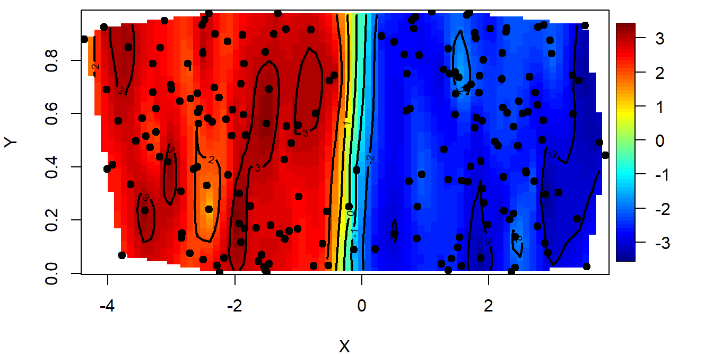
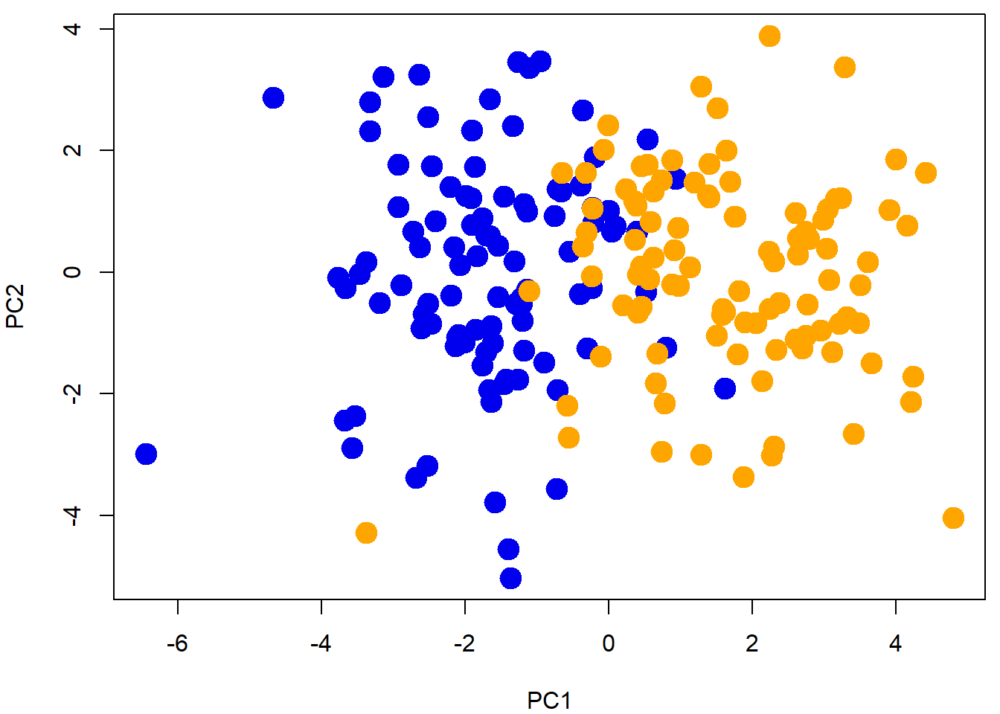
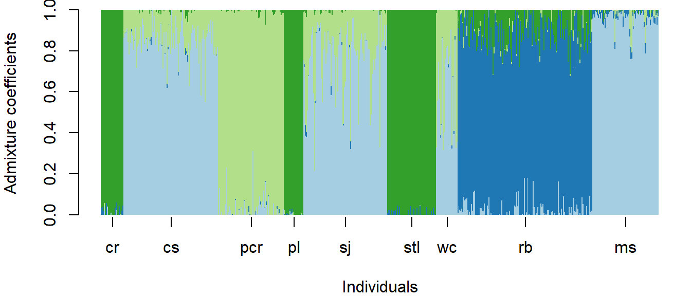

# (PART\*) Advanced Topics {-}
# Week 9: Population Structure {#Week9}


## Worked Example{#WE_9}


### 1. Overview of Worked Example

#### a. Goals 

The goals of this lab are to:

- Assess how patterns of genetic variation can be used to delimit natural populations.
- Compare methods that assess population structure.
- Understand how population structure can be used to interpret biogeographic history.


#### b. Data sets

All files are distributed as system files with the 'LandGenCourse' package (folder 'extdata').

- Simulated data using the two-island model and admixture model.
- SNP data from Catchen et al. 2013 Catchen et al. 2013. The population structure and recent colonization history of Oregon threespine stickleback determined using restriction-site associated DNA-sequencing. Molecular Ecology 22:1365-294X. http://dx.doi.org/10.1111/mec.12330

#### c. Required R libraries

Note: the function 'library' will always load the package, even if it is already loaded, whereas 'require' will only load it if it is not yet loaded. Either will work.


The package 'LEA' is available from the 'Bioconductor' repository. Also, package 'fields' was not installed with 'LandGenCourse' automatically due to compatibility issues. 


The data are in a data package:


### 2. Simulated data: 2-island model

We simulated data under a classic two-island model, using the coalescent simulation program 'ms', developed by Richard Hudson. The program simulates a coalescent tree under various demographic models, and uses those trees to create allelic data. For those interested in using 'ms', the source code is available here:  http://home.uchicago.edu/rhudson1/source/mksamples.html

We simulated 200 haploid individuals genotyped at 100 loci. The effective mutation rate was 'μ = 0.5'. We sampled 2 islands with 100 individuals in each. The effective migration rate was 'Nm 2' ('N' is the effective size in each of the two island, 'm' is the bidirectional rate of gene flow). 

Our ms command was as follows:
 ms 200 100 -t .5 -I 2 100 100 -ma x 2 2 x > dataNm2.txt 
 
These raw data need to be converted in a format amenable to statistical analyses in R. 

#### a. Import data


```
## [1] 200 100
```

Now we have a new data file, genotype, loaded in R. This file contains 200 rows and 100 columns. Each row corresponds to a simulated individual. The columns code for their multi-locus genotypes. 

#### b. Perform Principal Components Analysis (PCA)

Our first objective is to use ordination (Principal components analysis, or PCA) to examine population structure for the Nm = 2 data set. 

The R command for PCA is fairly simple and fast:


In order to visualize how the first two eigenvectors capture genotype variation, we will color each population.


**Question 1:** 

- Is population structure (genetic differentiation) evident? 
- How much of the genetic variance can be explained by our first two components? 

To answer the second part of this question, use: 


```
## Importance of components:
##                            PC1     PC2    PC3     PC4     PC5     PC6     PC7
## Standard deviation     2.77699 1.65283 1.5587 1.53452 1.48944 1.48496 1.46718
## Proportion of Variance 0.07712 0.02732 0.0243 0.02355 0.02218 0.02205 0.02153
## Cumulative Proportion  0.07712 0.10443 0.1287 0.15228 0.17446 0.19651 0.21804
##                            PC8     PC9    PC10    PC11    PC12    PC13    PC14
## Standard deviation     1.43774 1.41957 1.40980 1.40041 1.38541 1.37335 1.35879
## Proportion of Variance 0.02067 0.02015 0.01988 0.01961 0.01919 0.01886 0.01846
## Cumulative Proportion  0.23871 0.25886 0.27874 0.29835 0.31754 0.33640 0.35487
##                           PC15    PC16   PC17    PC18    PC19    PC20    PC21
## Standard deviation     1.35395 1.31441 1.3078 1.30115 1.29493 1.26846 1.26525
## Proportion of Variance 0.01833 0.01728 0.0171 0.01693 0.01677 0.01609 0.01601
## Cumulative Proportion  0.37320 0.39048 0.4076 0.42451 0.44128 0.45737 0.47338
##                           PC22    PC23    PC24    PC25    PC26    PC27    PC28
## Standard deviation     1.23786 1.23212 1.22814 1.20358 1.18924 1.17923 1.17139
## Proportion of Variance 0.01532 0.01518 0.01508 0.01449 0.01414 0.01391 0.01372
## Cumulative Proportion  0.48870 0.50388 0.51896 0.53345 0.54759 0.56150 0.57522
##                           PC29    PC30    PC31    PC32    PC33    PC34    PC35
## Standard deviation     1.16216 1.12304 1.10610 1.10157 1.09177 1.07816 1.05735
## Proportion of Variance 0.01351 0.01261 0.01223 0.01213 0.01192 0.01162 0.01118
## Cumulative Proportion  0.58873 0.60134 0.61357 0.62571 0.63763 0.64925 0.66043
##                           PC36    PC37    PC38    PC39    PC40    PC41    PC42
## Standard deviation     1.04793 1.02672 1.01936 1.01364 1.00225 0.99349 0.98594
## Proportion of Variance 0.01098 0.01054 0.01039 0.01027 0.01005 0.00987 0.00972
## Cumulative Proportion  0.67141 0.68195 0.69235 0.70262 0.71267 0.72254 0.73226
##                           PC43    PC44   PC45    PC46    PC47    PC48    PC49
## Standard deviation     0.96673 0.96357 0.9485 0.94380 0.92308 0.91570 0.90220
## Proportion of Variance 0.00935 0.00928 0.0090 0.00891 0.00852 0.00839 0.00814
## Cumulative Proportion  0.74160 0.75089 0.7599 0.76879 0.77731 0.78570 0.79384
##                           PC50    PC51    PC52    PC53    PC54    PC55    PC56
## Standard deviation     0.89163 0.88277 0.86488 0.84941 0.83872 0.83328 0.82304
## Proportion of Variance 0.00795 0.00779 0.00748 0.00721 0.00703 0.00694 0.00677
## Cumulative Proportion  0.80179 0.80958 0.81706 0.82427 0.83131 0.83825 0.84503
##                           PC57    PC58    PC59    PC60    PC61    PC62   PC63
## Standard deviation     0.81748 0.80746 0.79085 0.77042 0.76650 0.76104 0.7553
## Proportion of Variance 0.00668 0.00652 0.00625 0.00594 0.00588 0.00579 0.0057
## Cumulative Proportion  0.85171 0.85823 0.86448 0.87042 0.87629 0.88209 0.8878
##                           PC64   PC65    PC66    PC67    PC68    PC69    PC70
## Standard deviation     0.72978 0.7279 0.72353 0.70575 0.69818 0.68517 0.68335
## Proportion of Variance 0.00533 0.0053 0.00523 0.00498 0.00487 0.00469 0.00467
## Cumulative Proportion  0.89312 0.8984 0.90365 0.90863 0.91351 0.91820 0.92287
##                           PC71    PC72    PC73    PC74    PC75    PC76    PC77
## Standard deviation     0.67501 0.65756 0.63896 0.62114 0.61388 0.60925 0.60217
## Proportion of Variance 0.00456 0.00432 0.00408 0.00386 0.00377 0.00371 0.00363
## Cumulative Proportion  0.92743 0.93175 0.93583 0.93969 0.94346 0.94717 0.95080
##                           PC78    PC79    PC80    PC81    PC82    PC83    PC84
## Standard deviation     0.58408 0.56742 0.55817 0.54962 0.53610 0.52625 0.52442
## Proportion of Variance 0.00341 0.00322 0.00312 0.00302 0.00287 0.00277 0.00275
## Cumulative Proportion  0.95421 0.95743 0.96054 0.96356 0.96644 0.96921 0.97196
##                           PC85    PC86   PC87    PC88    PC89    PC90    PC91
## Standard deviation     0.50528 0.49755 0.4798 0.46734 0.45256 0.44882 0.44121
## Proportion of Variance 0.00255 0.00248 0.0023 0.00218 0.00205 0.00201 0.00195
## Cumulative Proportion  0.97451 0.97699 0.9793 0.98147 0.98352 0.98554 0.98748
##                           PC92    PC93    PC94    PC95    PC96    PC97    PC98
## Standard deviation     0.41786 0.41163 0.39781 0.37758 0.36923 0.36602 0.34913
## Proportion of Variance 0.00175 0.00169 0.00158 0.00143 0.00136 0.00134 0.00122
## Cumulative Proportion  0.98923 0.99092 0.99251 0.99393 0.99529 0.99663 0.99785
##                           PC99   PC100
## Standard deviation     0.34128 0.31336
## Proportion of Variance 0.00116 0.00098
## Cumulative Proportion  0.99902 1.00000
```

Next we would like to see how population genetic structure relates to geographic space. To this aim, we could display PC maps. A PC map is a spatial interpolation of a particular component. Let's map PC 1. 

#### c. Create synthetic spatial coordinates (X,Y) and map them



This map predicts the value of the first principal component at each location in our study area. We observe that the study area is partitioned into two zones that correspond to the 2 clusters visible from PC 1. We have superimposed individual sample sites to see our species distribution. 

To check that the PC map is consistent with having 2 islands, we can examine the PC assignment vs the sampling location. Remember that, in the data sets, the 100 first individuals were sampled from island 1 and the last 100 were sampled from island 2. We compare these assignments to the PCA classification as follows. 


```
## 
## FALSE  TRUE 
##     1   199
```
In this example, we found that only one individual was not assigned to its island of origin. Well, this individual might be a migrant from the last generation. These results indicated that a very simple method based on principal component analysis can correctly describe spatial population genetic structure.  

**Question 2:** Does PCA provide an accurate description of population genetic structure when the genetic differentiation between the 2 islands is less pronounced? 

To answer this question, re-run the first analytical steps up to PCA for data simulated with Nm = 10 (a higher value of gene flow), which is stored in datafile "dataNm10.txt". This was generated with the following ms command:

  ms 200 100 -t .5 -I 2 100 100 -ma x 10 10 x > dataNm10.txt 
  
You can import the file as:


### 3. Simulated data: 2-island model with admixture


A 2-island model is a relatively simple scenario and unlikely to capture the variation we will see in empirical studies. Will our very basic assignment method based on PCA hold up to more complex scenarios? 

Let's consider a scenario where the 2 populations had been evolving for a long time under an equilibrium island model, and then their environment suddenly changed. Our 2 populations had to move to track their shifting habitat, and after these movements they come into contact in an intermediate region. This contact event resulted in an admixed population with the density of mixed individuals greater in the center of the contact zone than at the ancestral origins at the edges of the landscape. 

Using R and our previous simulation, a multi-locus cline that resumes this scenario can be simulated has follows. The source population data are in the file "dataNm1.str".

First we define a function for the shape of a cline:


Our admixed genotypes are built from a 2 island model with low gene flow (Nm=1)


Now our data set is the R object 'res'. The next exercise is to apply PCA to these data to evaluate how geographical genetic variation can be captured by this approach. In comparison with the previous example where we had two geographically discrete populations, we now have a "continuous" population in a landscape. Geographical genetic variation is thus expected to be more gradual than in the previous example. Generate and examine the PC 1 map. 



Look at the PC Map


```
## Warning: 
## Grid searches over lambda (nugget and sill variances) with  minima at the endpoints: 
##   (REML) Restricted maximum likelihood 
##    minimum at  right endpoint  lambda  =  0.05291003 (eff. df= 190 )
```


**Question 3:** How does admixture change our prediction of population structure (PCA plot)? Is genomic ancestry correlated with geographical location? 

To answer this latter part, check the R2 and significance of statistical association between PC1 component scores and geographical position (p1): 


```
## 
## Call:
## lm(formula = pcA$x[, 1] ~ p1)
## 
## Residuals:
##      Min       1Q   Median       3Q      Max 
## -2.46152 -0.75641 -0.05249  0.75278  2.16294 
## 
## Coefficients:
##             Estimate Std. Error t value Pr(>|t|)    
## (Intercept)  -3.9204     0.1683  -23.30   <2e-16 ***
## p1            7.6644     0.2991   25.62   <2e-16 ***
## ---
## Signif. codes:  0 '***' 0.001 '**' 0.01 '*' 0.05 '.' 0.1 ' ' 1
## 
## Residual standard error: 0.9898 on 198 degrees of freedom
## Multiple R-squared:  0.7683,	Adjusted R-squared:  0.7671 
## F-statistic: 656.5 on 1 and 198 DF,  p-value: < 2.2e-16
```

### 4. Empirical data: Threespine sticklebacks

The Threespine stickleback (Gasterosteus aculeatus) is a fish that has emerged as a model of rapid and parallel adaptation. Catchen et al. (2013) were interested in how populations colonize freshwater habitats in the Pacific Northwest, USA. These sticklebacks have diversified into three life history forms, one exclusively dwelling in the ocean, another being adapted to freshwater habitats, and one unusual population that can utilize both habitats. It was unclear if this one particular population (Riverbend), from a stream in central Oregon, was introduced due to unintentional human transport, and if this could be an example of rapid adaptation to freshwater from oceanic populations. Single nucleotide polymorphism data were generated using genotyping-by-sequencing, for 9 populations occupying coastal areas and inland streams. 


In this tutorial, we will analyze the genetic data generated by Catchen et al. (2013) using a few exploratory methods to quantify and visualize genetic differentiation among the stickleback populations sampled. By the end of this tutorial, hopefully you will be able to make a convincing argument for the regional origin of the recently-introduced inland stickleback population.

#### a. Import the data:


Create a list of population IDs:


To understand the experimental design a bit better, let's look at the sample size at each site.


```
##  cr  cs pcr  pl  sj stl  wc  rb  ms 
##  23  97  67  20  86  50  22 138  68
```

#### b. Examine population structure with PCA

Let's start examining population structure, first using PCA. We'll look at the amount of variation explained in the first few components, and then we'll plot individuals for four components, coloring them by population.


Get % variance explained for first few PCs:


```
##   PC1   PC2   PC3   PC4   PC5   PC6   PC7   PC8   PC9  PC10 
## 37.47  3.78  2.55  0.88  0.76  0.44  0.44  0.39  0.37  0.32
```

Use the RColorBrewer package to select a color palette:


Plot first three PCs with colored symbols:


**Question 4:**

- Do you see evidence of population structure? 
- Is the number of components (here 4) a good representation of the number of populations? 

#### c. Clustering with SNMF (similar to 'STRUCTURE')

Now we are going to use a clustering method to examine population structure. There are many approaches, with various assumptions, and it is important to consider the underlying biology of your research organism (and your dataset size) before choosing an appropriate method. 

Here, we will use sparse negative matrix factorization (SNMF) because it is fast to compute for large datasets and it approximates the results of the well-known STRUCTURE algorithm. Notably, it relaxes population genetic assumptions such as Hardy-Weinberg proportions, so it may not converge on the same results as other programs.  

We can use SNMF to estimate the number of genetic clusters (K) among our sampled populations. However, this may take a long time. If you want to run the analysis, un-comment the lines by removing the '#' symbol at the beginning of each line.

We use SNMF's cross-entropy criterion to infer the best estimate of K. The lower the cross-entropy, the better our model accounts for population structure. Sometimes cross-entropy continues to decline, so we might choose K where cross entropy first decreases the most.


INSERT FIGURE WITH RESULT?

The number of clusters is hard to determine, but four seems to be important and is similar to the results revealed by PCA. I will proceed assuming K=4. We will rerun SNMF using this setting.


```
## The project is saved into :
##  nCourseData/extdata/stickleback.snmfProject 
## 
## To load the project, use:
##  project = load.snmfProject("nCourseData/extdata/stickleback.snmfProject")
## 
## To remove the project, use:
##  remove.snmfProject("nCourseData/extdata/stickleback.snmfProject")
## 
## [1] "*************************************"
## [1] "* sNMF K = 4  repetition 1      *"
## [1] "*************************************"
## summary of the options:
## 
##         -n (number of individuals)             571
##         -L (number of loci)                    10000
##         -K (number of ancestral pops)          4
##         -x (input file)                        /Library/Frameworks/R.framework/Versions/4.0/Resources/library/LandGenCourseData/extdata/stickleback.geno
##         -q (individual admixture file)         /Library/Frameworks/R.framework/Versions/4.0/Resources/library/LandGenCourseData/extdata/stickleback.snmf/K4/run1/stickleback_r1.4.Q
##         -g (ancestral frequencies file)        /Library/Frameworks/R.framework/Versions/4.0/Resources/library/LandGenCourseData/extdata/stickleback.snmf/K4/run1/stickleback_r1.4.G
##         -i (number max of iterations)          200
##         -a (regularization parameter)          100
##         -s (seed random init)                  140421621346717
##         -e (tolerance error)                   1E-05
##         -p (number of processes)               1
##         - diploid
## 
## Read genotype file /Library/Frameworks/R.framework/Versions/4.0/Resources/library/LandGenCourseData/extdata/stickleback.geno:		OK.
## 
## 
## Main algorithm:
## 	[                                                                           ]
## 	[==========]
## Number of iterations: 28
## 
## Least-square error: 722698.109676
## Write individual ancestry coefficient file /Library/Frameworks/R.framework/Versions/4.0/Resources/library/LandGenCourseData/extdata/stickleback.snmf/K4/run1/stickleback_r1.4.Q:		OK.
## Write ancestral allele frequency coefficient file /Library/Frameworks/R.framework/Versions/4.0/Resources/library/LandGenCourseData/extdata/stickleback.snmf/K4/run1/stickleback_r1.4.G:	OK.
## 
## The project is saved into :
##  nCourseData/extdata/stickleback.snmfProject 
## 
## To load the project, use:
##  project = load.snmfProject("nCourseData/extdata/stickleback.snmfProject")
## 
## To remove the project, use:
##  remove.snmfProject("nCourseData/extdata/stickleback.snmfProject")
```

#### d. Plot ancestry proportions

Create matrix of ancestry proportions: 


Plot results with a barplot similar to that used to represent STRUCTURE results



#### e. Visualize admixture proportions on a map

Import geographical coordinates for the populations: 


Calculate population average ancestry proportions and create an array with population coordinates:


Create map with pie charts depicting ancestry proportions:


**Question 5:** 

- How does the pattern of clustering vary in space? 
- Is there evidence of population admixture? 
- How do you interpret this pattern biologically?

**Question 6:** 

- Based on the analyses done in this tutorial, where do you hypothesize the "Riverbend" ("rb") population originated from? 
- What evidence supports your rationale?


