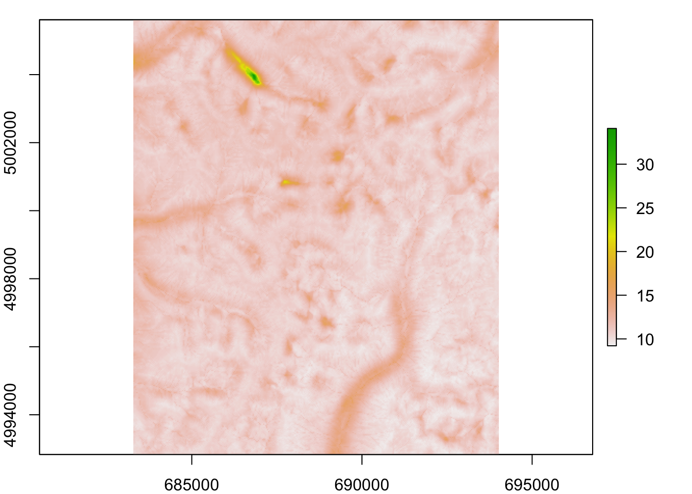
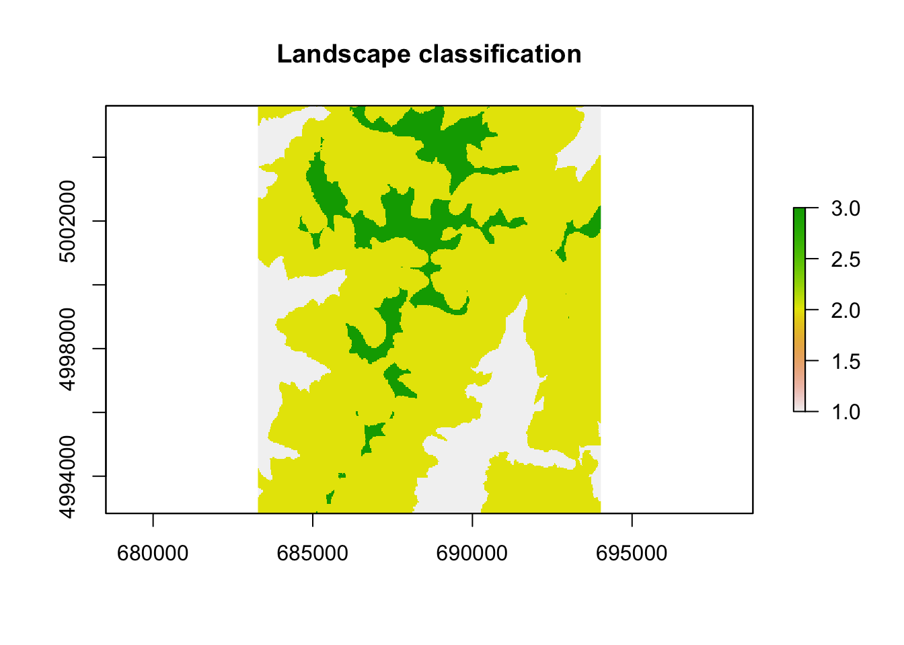

# Week 10: Landscape Resistance {#Week10}

This week's lab shows how to define cost surfaces and calculate cost distances. 

- [Worked Example](#WE_10)
- [Bonus Vignette](#bonus-10a): `radish` tutorial

Note: The worked examples in the Advanced Topics section require the R skills developed in the Basic Topics (Weeks 1 - 8).  

## Worked Example{#WE_10}

Melanie Murphy, Jeff Bowman, Robby Marrotte and Helene Wagner


### 1. Overview of Worked Example {-}

#### a. Goals {-} 

This worked example shows how to:

- Convert spatial data into weights ("costs") based on different weighting approaches.
- Calculate landscape resistance using least-cost and commute time (analogous to circuit theory) approaches.

**Bonus Materials**:

The Week 10 bonus vignette is a tutorial for the R package `radish`, which provides a user-friendly interface for optimizing landscape resistance models. 

#### b. Data set {-}

This code builds on the data from the 'GeNetIt' package by Jeff Evans and Melanie Murphy that we've used already in the Week 2 Worked Example. We will use spatial data from central Idaho for Columbia spotted frogs (Murphy et al. 2010). 

**Raster data**: A raster is essentially a georeferenced matrix (i.e., a matrix with geographical co-ordinates). Here we'll analyze raster data that are available in the 'GeNetIt' packages in the form of a SpatialPixelsDataFrame called 'rasters' (for meta data, type: ?GeNetIt::rasters). These data include classified Landsat land-cover data (NLCD), spline-based climate predictions (Rehfeldt et al. 2006), and topographically derived variables (Moore et al. 1993, Evans 1972). Landscape variables were selected based on knowledge of species' ecology and previous research (Murphy et al. 2010, Pilliod et al. 2002, Funk et al. 2005):  

- cti:   Compound Topographic Index ("wetness")
- err27: Elevation Relief Ratio 
- ffp:   Frost Free Period
- gsp:   Growing Season Precipitation
- hli:   Heat Load Index
- nlcd:  USGS Landcover (categorical map)

**Sampling locations**: We will model landscape resistance between the ponds from which Colombia spotted frogs were sampled. The spatial coordinates and site data are available in the 'GeNEtIt' package in the form of a SpatialPointsDataFrame 'ralu.site'. The slot `@coords` contains UTM coordinates (zone 11), and the slot `@data` contains 17 site variables for 31 sites. For meta data type: ?GeNetIt::ralu.site. 

#### c. Required R packages {-} 

Install some packages needed for this worked example.


```r
if(!requireNamespace("GeNetIt", quietly = TRUE)) remotes::install_github("jeffreyevans/GeNetIt")
```


```r
require(LandGenCourse)
#require(GeNetIt)
#require(raster)
#require(gdistance)
```

#### d. Import rasters (gsp, err, cti, and ffp) {-} 

Here we load the raster data as a SpatialPixelsDataFrame and convert them in to a raster stack.


```r
data(rasters, package="GeNetIt")
RasterMaps <- raster::stack(rasters)
```

#### e. Import site data with sampling locations {-}

In addition to spatial data, sample locations are also needed. Sample locations are located in the data folder (RALU_UTM.csv). Read in site locations (wetlands with Columbia spotted frogs).


```r
data(ralu.site, package="GeNetIt")
sites <- ralu.site
```

**Question 1**: What are UTMs and why might it be important to work in UTMs (as opposed to latitude and longitude)?

### 2. Explore the data set {-}

Explore these rasters by plotting them. As you go through this exercise, use the plot function at each step to make sure your outputs "make sense".

#### a. Plot all rasters {-}


```r
raster::plot(RasterMaps)
```


#### b. Plot spatial points over 'ffp' raster {-}

These are the locations of the ponds where Columbia spotted frogs were sampled within the study area. 


```r
par(mar=c(2,2,1,1))
raster::plot(RasterMaps$ffp)
points(sites, pch=3)
```


### 3. Setting cost values and calculating conductance {-}

#### a. Resistance vs. conductance values {-} 

The next step involves creating cost categories from the continuous data. For the purposes of this exercise, a single "landscape resistance" cost surface will be created, based on merging the 4 variables, and employing expert opinion.

Rescaling the grids will take some processor time (depending on your computer).

First, use a relative ranking of the costs of the landscape variables based on expert opinion. Higher rank indicates more resistance as follows.

Landscape resistances:

	1) err27, 2) ffp, 3) gsp, 4) cti

Important considerations: 

1. The transition matrix in package 'gdistance' is based on conductance and not resistance.
2. If we are going to create a single landscape resistance (i.e., add the costs together to create one synthetic landscape variable), costs need to represent relative importance of the variables. 

Keep in mind there are a variety of approaches for creating landscape resistance values. This exercise implements one simplistic approach.

To create relative conductance values, reverse the rank order of the resistance values:

	1) cti, 2) gsp, 3) ffp, 4) err27 

#### b. As needed: Get all rasters at the same scale {-} 

Note: this step is not needed here as all rasters do already have the same resolution.

Originally, the topographic variables were calculated off a 10 m DEM. The climate variables are at a 30 m resolution. In order to calculate costs, all of the rasters need to have exactly the same resolution, dimensions, and co-ordinate locations (i.e., the cells need to match up perfectly. The method of resampling (bilinear vs nearest-neighbor) depends on the type of data. Nearest-neighbor is for categorical data whereas bilinear interpolation is for continuous data.

Here is some sample code to show how you would resample a raster 'cti' (assumed to have 10 m resolution) to the dimensions of a raster 'gsp' (with 30 m resolution):


```r
#cti <- raster::resample(cti, gsp, method= "bilinear")
```

#### c. Calculate conductance values {-}

Functions (e.g., 1/err, ffp/5) rescale the raw data from each raster to represent costs that correspond to perceived differences among variables arising from expert opinion. A wide variety of functions could be used to achieve a variety of cost structures in order to test alternative hypotheses. 
The err function is inverted compared to the other variables because the raw err data have low values relative to the other variables (< 1). 

To use the below tools, conductance values must be calculated. First, look at the range of the variable in a given raster. Then apply a function to get the desired
relative conductance values. Make sure to use the plot function and visually inspect your conductance surfaces.


```r
RasterMaps$err27
```

```
## class      : RasterLayer 
## dimensions : 426, 358, 152508  (nrow, ncol, ncell)
## resolution : 30, 30  (x, y)
## extent     : 683282.5, 694022.5, 4992833, 5005613  (xmin, xmax, ymin, ymax)
## crs        : +proj=utm +zone=11 +ellps=GRS80 +towgs84=0,0,0,0,0,0,0 +units=m +no_defs 
## source     : memory
## names      : err27 
## values     : 0.03906551, 0.7637643  (min, max)
```

Elevation relief ratio ('err27') is identifying major topographic features. In this first case, the goal is for 'err27' to have the lowest conductance values compared to our other landscape variables. Greater 'err27' means more change in topography in a given area. So, the higher the value, the more resistance to a Columbian spotted frog. 
Note that the function below gives a linear relationship between the raw value and the cost. Any type of functional relationship could be used however.


```r
err.cost <- (1/RasterMaps$err27)
err.cost
```

```
## class      : RasterLayer 
## dimensions : 426, 358, 152508  (nrow, ncol, ncell)
## resolution : 30, 30  (x, y)
## extent     : 683282.5, 694022.5, 4992833, 5005613  (xmin, xmax, ymin, ymax)
## crs        : +proj=utm +zone=11 +ellps=GRS80 +towgs84=0,0,0,0,0,0,0 +units=m +no_defs 
## source     : memory
## names      : err27 
## values     : 1.309305, 25.59803  (min, max)
```


```r
RasterMaps$ffp
```

```
## class      : RasterLayer 
## dimensions : 426, 358, 152508  (nrow, ncol, ncell)
## resolution : 30, 30  (x, y)
## extent     : 683282.5, 694022.5, 4992833, 5005613  (xmin, xmax, ymin, ymax)
## crs        : +proj=utm +zone=11 +ellps=GRS80 +towgs84=0,0,0,0,0,0,0 +units=m +no_defs 
## source     : memory
## names      : ffp 
## values     : 0, 51  (min, max)
```


```r
ffp.cost <- (RasterMaps$ffp/5)
ffp.cost
```

```
## class      : RasterLayer 
## dimensions : 426, 358, 152508  (nrow, ncol, ncell)
## resolution : 30, 30  (x, y)
## extent     : 683282.5, 694022.5, 4992833, 5005613  (xmin, xmax, ymin, ymax)
## crs        : +proj=utm +zone=11 +ellps=GRS80 +towgs84=0,0,0,0,0,0,0 +units=m +no_defs 
## source     : memory
## names      : ffp 
## values     : 0, 10.2  (min, max)
```


```r
RasterMaps$gsp
```

```
## class      : RasterLayer 
## dimensions : 426, 358, 152508  (nrow, ncol, ncell)
## resolution : 30, 30  (x, y)
## extent     : 683282.5, 694022.5, 4992833, 5005613  (xmin, xmax, ymin, ymax)
## crs        : +proj=utm +zone=11 +ellps=GRS80 +towgs84=0,0,0,0,0,0,0 +units=m +no_defs 
## source     : memory
## names      : gsp 
## values     : 227, 338.0697  (min, max)
```


```r
gsp.cost <- (RasterMaps$gsp-196)/15
gsp.cost
```

```
## class      : RasterLayer 
## dimensions : 426, 358, 152508  (nrow, ncol, ncell)
## resolution : 30, 30  (x, y)
## extent     : 683282.5, 694022.5, 4992833, 5005613  (xmin, xmax, ymin, ymax)
## crs        : +proj=utm +zone=11 +ellps=GRS80 +towgs84=0,0,0,0,0,0,0 +units=m +no_defs 
## source     : memory
## names      : gsp 
## values     : 2.066667, 9.471311  (min, max)
```


```r
RasterMaps$cti
```

```
## class      : RasterLayer 
## dimensions : 426, 358, 152508  (nrow, ncol, ncell)
## resolution : 30, 30  (x, y)
## extent     : 683282.5, 694022.5, 4992833, 5005613  (xmin, xmax, ymin, ymax)
## crs        : +proj=utm +zone=11 +ellps=GRS80 +towgs84=0,0,0,0,0,0,0 +units=m +no_defs 
## source     : memory
## names      : cti 
## values     : 0.8429851, 23.71476  (min, max)
```


```r
cti.cost <- RasterMaps$cti/5
cti.cost
```

```
## class      : RasterLayer 
## dimensions : 426, 358, 152508  (nrow, ncol, ncell)
## resolution : 30, 30  (x, y)
## extent     : 683282.5, 694022.5, 4992833, 5005613  (xmin, xmax, ymin, ymax)
## crs        : +proj=utm +zone=11 +ellps=GRS80 +towgs84=0,0,0,0,0,0,0 +units=m +no_defs 
## source     : memory
## names      : cti 
## values     : 0.168597, 4.742952  (min, max)
```

#### d. Create a single landscape conductance raster {-}

Testing variables independently may be more appropriate depending on the research question but for the purposes of today's lab, a single conductance raster will be employed.


```r
cost1 <- (gsp.cost + cti.cost + err.cost + ffp.cost)
cost1
```

```
## class      : RasterLayer 
## dimensions : 426, 358, 152508  (nrow, ncol, ncell)
## resolution : 30, 30  (x, y)
## extent     : 683282.5, 694022.5, 4992833, 5005613  (xmin, xmax, ymin, ymax)
## crs        : +proj=utm +zone=11 +ellps=GRS80 +towgs84=0,0,0,0,0,0,0 +units=m +no_defs 
## source     : memory
## names      : layer 
## values     : 9.012874, 35.90095  (min, max)
```

**Question 2**: Plot your cost surface with your sample locations on top. What does this tell you?

### 4. Convert conductance into effective distance {-} 

The higher the conductance, the lower the cost or resistance of a cell, and vice versa. We want to integrate conductance across cells to derive some measure of effective (or ecological) distance. 

#### a. Create a transition layer {-}

Transition layers are constructed from a raster, and they take the geographic references (projection, resolution, extent) from the original raster object. They also contain a matrix of probability of movement between cells which can be interpreted as "conductance". Each cell in the matrix represents a cell in the original raster object.

The first step is to construct a transition object based on 'cost1' (which is a conductance layer as calculated). This step is computationally intensive and make take a few minutes to run.

Connections can be set based on 4, 8, or 16 neighbor rules. A value of 8 connects all adjacent cells in 8 directions. 


```r
tr.cost1 <- gdistance::transition(cost1, transitionFunction=mean, directions=8) 
tr.cost1
```

```
## class      : TransitionLayer 
## dimensions : 426, 358, 152508  (nrow, ncol, ncell)
## resolution : 30, 30  (x, y)
## extent     : 683282.5, 694022.5, 4992833, 5005613  (xmin, xmax, ymin, ymax)
## crs        : +proj=utm +zone=11 +ellps=GRS80 +towgs84=0,0,0,0,0,0,0 +units=m +no_defs 
## values      : conductance 
## matrix class: dsCMatrix
```

#### b. Visually inspect the raster {-}


```r
par(mar=c(2,2,1,1))
raster::plot(raster::raster(tr.cost1))
```


#### c. Correct for geometric distortion {-}

Transition values are calculated based on values of adjacent cells in the cost raster. However, we used an 8 neighbor rule and the center of diagonally connected
raster cells are farther apart from each other than the orthogonally connected cells. We are using UTM co-ordinates; however, in lat-long projections, cell sizes become smaller as you move poleward.

Values of the matrix have to be corrected for the first type of distortion for our analysis (and we would need to correct for the second type of distortion if we were using lat-longs).


```r
tr.cost1 <- gdistance::geoCorrection(tr.cost1,type = "c",multpl=FALSE)
```

#### d. Plot shortest paths in space {-}

Here we do the following:

- Plot site locations on top of conductance raster 'tr.cost1'
- Calculate 'AtoB' as the shortest path (least cost path) between sites 1 and 2 
- Plot the shortest path onto the map

Note: the path is stored as a 'SpatialLines' object (package 'spdep'). A path is a sequence of coordinate pairs, which is stored in the `@lines` slot. Like a 'SpatialPointsDataFrame', a 'SpatialLines' object has a 'proje4string' attribute that stores the projection information. This means that we can easily plot it on top of a raster map. 


```r
par(mar=c(2,2,1,2))
AtoB <- gdistance::shortestPath(tr.cost1, origin=sites[1,], 
                                goal=sites[2,], output="SpatialLines")
raster::plot(raster::raster(tr.cost1), xlab="x coordinate (m)", 
             ylab="y coordinate (m)",legend.lab="Conductance")
lines(AtoB, col="red", lwd=2)
points(sites[1:2,])
```



That's nice, but it shows only the shortest path between sites 1 and 2. It would not be very useful to plot all pairwise shortest paths. Here we do the following:

- Plot site locations on top of conductance raster 'tr.cost1'
- Use Delaunay triangulation to define neighbors (we want to retain only those paths that won't cross each other, though they may merge)
- Plot grey lines between neighbours
- For each unique pair of neighbours, calculate 'AtoB' as the shortest path  
- Plot the shortest paths onto the map in red

Note: this may take a while. If it does not show up nicely in the notebook, copy and paste the code to the console and watch how the plot is evolving in the Plots tab (nothing beats being able to actually watch R do the work for you).


```r
par(mar=c(2,2,1,2))
raster::plot(raster::raster(tr.cost1), xlab="x coordinate (m)", 
             ylab="y coordinate (m)", legend.lab="Conductance")
points(sites)

Neighbours <- spdep::tri2nb(sites@coords, row.names = sites$SiteName)

plot(Neighbours, sites@coords, col="darkgrey", add=TRUE)
for(i in 1:length(Neighbours))
{
  for(j in Neighbours[[i]][Neighbours[[i]] > i])
  {
    AtoB <- gdistance::shortestPath(tr.cost1, origin=sites[i,], 
                                goal=sites[j,], output="SpatialLines")
    lines(AtoB, col="red", lwd=1.5)
  }
}
```


**Question 3**: Do the shortest paths (red) deviate from the Euclidean distances (grey)? Why? 

**Question 4**: Are there paths that merge? How would you explain this? 

### 5. Create cost-distance matrices {-}

#### a. Least cost distance {-}

The cost-distance matrix is based on the corrected transition layer and the site locations (here we supply a 'SpatialPointsDataFrame' object). The 'costDistance' function requires conductance values, even though cost distance will be 1/conductance (i.e., resistance). The cost distance is a function of the transition (tr.cost1, a transition object) and spatial locations (sites, a spatial object). 
This is a single least-cost path (accumulated cost units as opposed to length units) between each pair of sites..


```r
cost1.dist <- gdistance::costDistance(tr.cost1,sites)
```

#### b. Cost-distance matrix based on random paths (similar to Circuitscape) {-}

Commute-time distance is an alternative to effective resistance from circuit theory. Commute-time is the expected time it takes for a random walk between nodes, and has been shown to correlate highly with effective resistance (Marrotte and Bowman 2017).


```r
comm1.dist <- gdistance::commuteDistance(x = tr.cost1, coords = sites)
```

#### c. Compare cost distances {-}

Create a distance table to compare different cost distance estimates:


```r
dist_df <- data.frame("cost1.dist"=as.numeric(cost1.dist),
                      "comm1.dist"=as.numeric(comm1.dist))
```

Look at the correlation between the two different cost distances:


```r
corr.LCD.comm <- cor(dist_df$cost1.dist, dist_df$comm1.dist, method = "spearman")
corr.LCD.comm
```

```
## [1] 0.9519704
```

```r
plot(cost1.dist~comm1.dist)
```


**Question 5**: Are the distance measures similar or different? Why? 

**Question 6**: What is the major difference? What are the implications of this difference? When might you use one or other of the methods? 

### 6. How does changing resolution affect these metrics? {-} 

Create a loop that runs through a sequential coarsening of the raster and calculate 
these metrics and compare them to the finer resolution raster metric using a Spearman correlation. The loop will take a few minutes to run.

#### a. Create loop {-}


```r
cor_cost <- c()
cor_comm <- c()
res_fact <- seq(2,20,2)
for(fac in res_fact){
  cost1_agg <- raster::aggregate(cost1, fact = fac)
  tr.cost_agg <- gdistance::transition(cost1_agg, 
                 transitionFunction=mean, directions=8)
  tr.cost_agg <- gdistance::geoCorrection(tr.cost_agg,type = "c",multpl=FALSE)
  cost.dist_agg <- gdistance::costDistance(tr.cost_agg,sites)
  comm.dist_agg <- gdistance::commuteDistance(x = tr.cost_agg, coords = sites)
  cost.dist_agg <- as.numeric(cost.dist_agg)
  comm.dist_agg <- as.numeric(comm.dist_agg)
  cor_cost <- c(cor_cost,cor(dist_df$cost1.dist, cost.dist_agg, 
                             method = "spearman"))
  cor_comm <- c(cor_comm,cor(dist_df$comm1.dist, comm.dist_agg, 
                             method = "spearman"))
}
```

#### b. Plot the results {-}


```r
par(mar=c(4,4,1,1))
plot(y = cor_cost, x = res_fact, col = "red", pch = 19, 
     ylim = c(0.9,1), xlab = "Aggregation factor", ylab = "Spearman correlation")
points(y = cor_comm, x = res_fact, col = "blue", pch = 19)
legend("bottomleft", legend = c("Costdist","Commdist"), 
       pch = 19, col = c("red", "blue"))
```


**Question 7**: What effect does changing resolution have on these metrics? 


### 7. References {-}

Evans IS (1972) General geomorphometry, derivatives of altitude, and descriptive statistics. In: Chorley RJ (ed) Spatial analysis in geomorphology. Harper & Row, New York.

Funk WC, Blouin MS, Corn PS, Maxell BA, Pilliod DS, Amish S, Allendorf FW (2005) Population structure of Columbia spotted frogs (Rana luteiventris) is strongly affected by the landscape. Mol Ecol 14(2): 483-496

Marrotte RR, Bowman J (2017) The relationship between least-cost and resistance distance. PLOS ONE 12(3): e0174212

McRae BH, Dickson BG, Keitt TH, Shah VB (2008) Using circuit theory to model connectivity in ecology, evolution, and conservation. Ecology 89 (10):2712-2724

Moore I, Gessler P, Nielsen G, Petersen G (eds) (1993) Terrain attributes and estimation methods and scale effects. Modeling change in environmental systems. Wiley, London.

Murphy MA, Dezanni RJ, Pilliod D, Storfer A (2010) Landscape genetics of high mountain frog populations. Mol Ecol 19:3634-3649.

Pilliod DS, Peterson CR, Ritson PI (2002) Seasonal migration of Columbia spotted frogs (Rana luteiventris) among complementary resources in a high mountain basin. Can J Zool 80: 1849-1862

Rehfeldt GE, Crookston NL, Warwell MV, Evans JS (2006) Empirical analysis of plan-climate relationships for western United States. International Journal of Plan Sciences 167: 1123-1150


## Bonus: 'radish' tutorial {#bonus-10a}

Nate Pope and Bill Peterman


### 1. Overview of Bonus Materials {-}

This short tutorial provides an overview of the in-development R package `radish` created by Nate Pope and Bill Peterman.

#### a. What is the package 'radish'? {-}

From the `README` file of the [Github repository](https://github.com/nspope/radish):

*`radish` is an R package for maximum likelihood estimation of isolation-by-resistance models, where conductance is a function of spatial covariates, the observed data are genetic distances, and the likelihood of the "measurement process" is cheap to compute (e.g. regression of distance matrices, or generalized Wishart). It also provides fast computation of the gradient, Hessian matrix, and derivative-based leverage/influence measures. As currently implemented it is intended for moderate-sized problems (e.g. rasters with less than 1mil cells, where a sparse Cholesky decomposition of the graph Laplacian is feasible). Larger problems are possible (with sufficient memory), but slow.*

Ultimately, `radish` provides a user-friendly interface for optimizing landscape resistance models. Using this framework, the effects and contributions of independent landscape surfaces are estimated. In landscape genetics, we are frequently interested in how spatial covariates (temperature, altitude, and so on) influence the movement of organisms. One way to approach this problem is to discretize the landscape as a raster, model movement as a random walk between raster cells, and write the rates of transition between cells as a parameterized function of spatial covariates. For example, the resistance models in this tutorial have the form,

    log(conductance[cell]) = coef_1 * covariate_1[cell] + coef_2 * covariate_2[cell] + ...

where `conductance[cell] = 1/resistance[cell]`. The parameters `coef_i` have a clear biological interpretation: if `coef_i > 0`, then the associated covariate facilitates movement; if `coef_i < 0` then it impedes movement; and if `coef_i = 0` then it has no effect on movement. "Isolation by distance" is the special case where `coef_i = 0` for all `i`: in other words, the landscape has no impact on movement.

For a particular choice of values for `coef`, the "resistance distances" between cells on this raster can be calculated and compared to observed genetic distances via some sort of regression. This regression is referred to as a "measurement process" in the quote above, but maybe "error model" is a better term. The measurement/error model may involve any number of nuisance parameters (e.g. slope, intercept, and residual error), and provides a way to measure of goodness-of-fit between genetic and resistance distances (e.g. via the log-likelihood of the regression fit). `radish` optimizes the parameters of interest (e.g. `coef`) so as to maximize goodness-of-fit, while profiling out the nuisance parameters.

A visualization of this framework is shown in Figures 1 & 2. This is a depiction of parameter space for a landscape resistance model with two spatial covariates: the x-axis/y-axis are values of `coef[1]` and `coef[2]` in the equation above. At any given point in this space, resistance distance can be calculated and regressed with observed genetic distance (or a measure of divergence like Fst). Thus for the two sub-panels in Figure 1, the regressions use the same dependent variable (in this case Fst) but different resistance distances (corresponding to the values of `coef` at each point). The likelihood (goodness-of-fit) of the regressions over the entire parameter space creates a likelihood surface. The values of `coef` that maximize this likelihood surface are the maximum likelihood estimates (MLE) of the parameters. Reduced models follow from restricting one or both of `coef` to 0, effectively dropping the associated spatial covariates from the model. Rather than exhaustively searching parameter space for the MLE, `radish` uses an efficient optimization algorithm.


```
## Warning in knitr::include_graphics("/Users/hhwagner1/Desktop/R_GitHub_Projects/
## LandGenCourse_book/vignettes/radish_tutorial_fig1A.png"): It is highly
## recommended to use relative paths for images. You had absolute paths: "/
## Users/hhwagner1/Desktop/R_GitHub_Projects/LandGenCourse_book/vignettes/
## radish_tutorial_fig1A.png"
```

<div class="figure">

<p class="caption">(\#fig:figure1)*Points in parameter space for a loglinear conductance model with two spatial covariates. At each point, resistance distance can be calculated and regressed with genetic distance/divergence.*</p>
</div>


```
## Warning in knitr::include_graphics("/Users/hhwagner1/Desktop/R_GitHub_Projects/
## LandGenCourse_book/vignettes/radish_tutorial_fig1B.png"): It is highly
## recommended to use relative paths for images. You had absolute paths: "/
## Users/hhwagner1/Desktop/R_GitHub_Projects/LandGenCourse_book/vignettes/
## radish_tutorial_fig1B.png"
```

<div class="figure">

<p class="caption">(\#fig:figure2)*If the log-likelihood (goodness-of-fit) of the regression is measured across parameter space, this creates a likelihood surface. The parameter values at the maximum of the surface are the maximum likelihood estimates. Reduced models follow from restricting one or both parameters to 0.*</p>
</div>

If the "measurement process" accounts for the complex covariance structure of pairwise genetic distances, then standard likelihood-based approaches like AIC or likelihood ratio tests can be used for model selection (see Week 12). "Maximum likelihood population effects" (MLPE) regression ([Clarke et al. 2003](https://link.springer.com/article/10.1198/108571102320)) provides a simple way to capture dependence between genetic distances that involve the same populations/spatial locations, and is used in this tutorial. However, there is some indication that MLPE overestimates the amount of information in the data ([Peterman & Pope 2021](https://onlinelibrary.wiley.com/doi/full/10.1111/mec.15716)), resulting in high rates of Type-I errors in the context of model selection with `radish`. In general, maximum likelihood-based model selection with MLPE and `radish` should be taken with a grain of salt. Non-parametric approaches like cross-validation and permutation tests are more robust, and work is ongoing to make a user-friendly interface for these. So for now, this package and framework should be viewed as a tool for resistance surface optimization only.

#### b. Data {-}

This example uses the data from the `GeNetIt` package by Jeff Evans and Melanie Murphy that we've used already in the Week 2 and Week 10 Worked Examples. We will use spatial data from central Idaho for Columbia spotted frogs ([Murphy et al. 2010](https://onlinelibrary.wiley.com/doi/full/10.1111/j.1365-294X.2010.04723.x)). Raster and Sampling location text below is copied from Week 10.

**Raster data:** A raster is essentially a georeferenced matrix (i.e., a matrix with geographical co-ordinates). Here we'll analyze raster data that are available in the `GeNetIt` packages in the form of a `SpatialPixelsDataFrame` called 'rasters' (for meta data, type: `?GeNetIt::rasters`). These data include classified Landsat land-cover data (NLCD), spline-based climate predictions (Rehfeldt et al. 2006), and topographically derived variables (Moore et al. 1993, Evans 1972). Landscape variables were selected based on knowledge of species' ecology and previous research (Murphy et al. 2010, Pilliod et al. 2002, Funk et al. 2005):

- `cti`: Compound Topographic Index ("wetness")
- `err27`: Elevation Relief Ratio
- `ffp`: Frost Free Period
- `gsp`: Growing Season Precipitation
- `hli`: Heat Load Index
- `nlcd`: USGS Landcover (categorical map)

**Sampling locations:** We will model landscape resistance between the ponds from which Colombia spotted frogs were sampled. The spatial coordinates and site data are available in the `GeNEtIt` package in the form of a `SpatialPointsDataFrame` `ralu.site`. The slot `@coords` contains UTM coordinates (zone 11), and the slot `@data` contains 17 site variables for 31 sites. For meta data type: `?GeNetIt::ralu.site`.

#### c. Required R packages {-}

Both `corMLPE` and `radish` packages require compiling. 

Note: If using a Windows machine, this requires Rtools. Thus, if you get error messages, install [Rtools](https://cran.r-project.org/bin/windows/Rtools/rtools40.html). Be sure to follow the necessary steps so that Rtools is in your system `PATH`


```r
if(!requireNamespace("GeNetIt", quietly = TRUE)) remotes::install_github("jeffreyevans/GeNetIt")

if(!requireNamespace("corMLPE", quietly = TRUE)) remotes::install_github("nspope/corMLPE")

if(!requireNamespace("radish", quietly = TRUE)) remotes::install_github("nspope/radish")

library(radish)
```

```
## Loading required package: Matrix
```

```r
library(raster)
```

```
## Loading required package: sp
```

### 2. Import data {-}

#### a. Import raster data {-}

Load the raster data as a `SpatialPixelsDataFrame` and convert them in to a raster stack. As of this writing, `radish` requires that raster surfaces be provided as a `RasterStack`. The names of the layers within the stack will be your independent variable(s) when fitting the `radish` model. We'll make an object called `covariates` for use with `radish`.


```r
data(rasters, package="GeNetIt")
covariates <- raster::stack(rasters)
```

#### b. Import sampling location data {-}


```r
data(ralu.site, package="GeNetIt")
sites <- ralu.site
```

#### c. Import genetic data {-}

Using the raw genetic data (i.e. `ralu.loci`) from the `LandGenCourse` package, we created a `genpop` data object and then calculated Chord Distance using the `adegenet` package. Load this square distance matrix.


```r
ralu.dc <- as.matrix(read.csv(system.file("extdata", "ralu_dc.csv", 
                            package = "LandGenCourse")))
```

#### d. Selecting sites {-}

Because the genetic data are a subset of the larger data set, we need to select the 12 sites (ponds) from the `sites` point object that match those included in our genetic distance matrix. We'll then convert the `SpatialPointsDataFrame` to a `SpatialPoints` object and map our results to confirm everything lines up.


```r
sites_select <- sites[c(1:3,5:6,8,11:12,21,23,25:26),]

## Must be a SpatialPoints object
sites_select <- SpatialPoints(sites_select)

plot(covariates$hli, legend=FALSE)
points(sites_select, pch = 19)
```


### 3. Basic model fitting {-}

#### a. Preparing 'radish' objects {-}

To fit a `radish` model, we need to create a parameterized conductance surface. Before doing so, we are going to scale our covariates. This will (hopefully) reduce numeric overflow issues during optimization as well as make effect sizes of parameter estimates of the final model comparable.


```r
scale_covs <- stack(scale(covariates)) ## Must be a raster stack

surface <- conductance_surface(covariates = scale_covs,
                               coords = sites_select,
                               directions = 8)
```

We're now ready to use `radish` to fit a measurement model and optimize landscape conductance values!

#### b. Fitting 'radish' models {-}

`radish` currently supports the fitting a few different measurement models (`?radish_measurement_model`). We'll first use the MLPE model ([Clarke et al. 2002](https://link.springer.com/article/10.1198/108571102320)) with a loglinear link of the spatial data to conductance. Note: this is quite a few covariates to estimate with only 12 populations sampled!


```r
fit_mlpe <- radish(ralu.dc ~ cti + err27 + ffp + hli,
                   data = surface, 
                   conductance_model = radish::loglinear_conductance, 
                   measurement_model = radish::mlpe)
```

```
## Warning in assemble_model_matrix(formula, x): Removed unused spatial covariates:
## gsp nlcd
```

```
## Projected Newton-Raphson with Hager-Zhang line search
## [1] f(x) = 1.551e+02   |f(x)-fold(x)| = 0.000e+00   max|f'(x)| = 2.921e+01   |f''(x)| = 2.244e+07 
## [2] f(x) = 1.583e+02   |f(x)-fold(x)| = 3.190e+00   max|f'(x)| = 3.078e+01   |f''(x)| = 4.608e+06 
## [3] f(x) = 1.614e+02   |f(x)-fold(x)| = 3.022e+00   max|f'(x)| = 4.309e+00   |f''(x)| = 4.752e+07 
## [4] f(x) = 1.635e+02   |f(x)-fold(x)| = 2.125e+00   max|f'(x)| = 1.218e+01   |f''(x)| = -1.279e+06 
## [5] f(x) = 1.639e+02   |f(x)-fold(x)| = 4.128e-01   max|f'(x)| = 8.961e-01   |f''(x)| = -2.238e+06 
## [6] f(x) = 1.639e+02   |f(x)-fold(x)| = 3.142e-02   max|f'(x)| = 2.206e-01   |f''(x)| = -1.455e+06 
## [7] f(x) = 1.639e+02   |f(x)-fold(x)| = 1.130e-04   max|f'(x)| = 1.971e-04   |f''(x)| = -1.464e+06 
## [8] f(x) = 1.639e+02   |f(x)-fold(x)| = 5.864e-10   max|f'(x)| = 8.798e-10   |f''(x)| = -1.464e+06 
## Solution on interior with `max(abs(gradient))` == 8.797941e-10 and `diff(f)` == 5.863967e-10
```

Now lets look at the fitted model:


```r
summary(fit_mlpe)
```

```
## Conductance surface with 152508 vertices (12 focal) estimated by maximum likelihood
## Call:   radish(formula = ralu.dc ~ cti + err27 + ffp + hli, data = surface, 
##     conductance_model = radish::loglinear_conductance, measurement_model = radish::mlpe)
## 
## Loglikelihood: 163.9248 (8 degrees freedom)
## AIC: -311.8495 
## 
## Number of function calls: 28 
## Number of Newton-Raphson steps: 8 
## Norm of gradient at MLE: 1.069791e-09 
## 
## Nuisance parameters:
##   alpha     beta      tau      rho  
##  0.0267   1.3956   5.8721  -1.1409  
## 
## Coefficients:
##       Estimate Std. Error z value Pr(>|z|)   
## cti     0.5015     0.2418   2.074   0.0381 * 
## err27   0.3411     0.1332   2.561   0.0104 * 
## ffp     0.0416     0.1465   0.284   0.7765   
## hli    -1.0959     0.3922  -2.794   0.0052 **
## ---
## Signif. codes:  0 '***' 0.001 '**' 0.01 '*' 0.05 '.' 0.1 ' ' 1
## 
## Correlation of Coefficients:
##               cti       err27         ffp
## err27  0.68421668                        
## ffp   -0.01937005 -0.14091533            
## hli    0.03908435 -0.54352073  0.13982299
```

Remember that we are modeling conductances. Therefore positive coefficient estimates indicate increasing conductance (e.g. rates of movement/gene flow) at higher values of the covariate, while negative coefficients indicate lower conductance at higher values of the covariate. The coefficient estimates and standard errors suggest that higher Compound Topographic Index and Elevation Relief Ratio facilitate movement, higher Heat Load Index impedes movement, and Frost Free Period has no effect.

**A biological interpretation of these results:**

Temperature on the landscape, as measured by the heat load index, has the greatest effect on rates of movement between sampled populations. However, wetness (CTI) and elevational relief also affect movement. Movement rates (i.e. conductance) are estimated to be greatest in areas with lower temperatures, high moisture, and steeper slopes. These results are somewhat counter to the predictions and results of Murphy et al. (2010) in their more extensive analysis of these data using a different framework. Keeping in mind that genetic distances measured between populations are a reflection of a movement, survival, and demographic processes over multiple generations. As such, the long-term effects of landscape features on gene flow can result in unexpected patterns relative to our predictions and intuitions about the system (e.g., [Peterman et al. 2014](https://onlinelibrary.wiley.com/doi/full/10.1111/mec.12747)). In particular, there is opportunity for our understanding of processes that occur over short temporal scales (e.g., annual reproduction, individual dispersal ability) to not be reflected in the landscape-scale processes that encompass multiple generations. This is one reason why optimization of landscape conductance/resistance values can be so enlightening. We are not constrained to only assessing *a priori* hypotheses about the direction and/or magnitude of effect that landscape variables have.

**Questions**:

- The example above models connectivity across the landscape following the 'queen's rule', meaning that movement can occur into any of the 8 adjacent cells. If we simplify and limit connectivity to 4 cells (rook's rule), does this change the inferred effects of landscape covariates on conductance?

#### c. Model interactions {-}

`radish` provides a flexible user formula interface allowing for the easy fitting of interaction terms


```r
fit_mlpe.int <- radish(ralu.dc ~ cti*hli,
                       data = surface, 
                       conductance_model = radish::loglinear_conductance, 
                       measurement_model = radish::mlpe)
```

```
## Warning in assemble_model_matrix(formula, x): Removed unused spatial covariates:
## err27 ffp gsp nlcd
```

```
## Projected Newton-Raphson with Hager-Zhang line search
## [1] f(x) = 1.551e+02   |f(x)-fold(x)| = 0.000e+00   max|f'(x)| = 1.408e+01   |f''(x)| = 7.245e+03 
## [2] f(x) = 1.558e+02   |f(x)-fold(x)| = 6.670e-01   max|f'(x)| = 6.968e-01   |f''(x)| = 1.078e+04 
## [3] f(x) = 1.569e+02   |f(x)-fold(x)| = 1.101e+00   max|f'(x)| = 1.361e+00   |f''(x)| = -4.976e+01 
## [4] f(x) = 1.572e+02   |f(x)-fold(x)| = 2.492e-01   max|f'(x)| = 3.029e-01   |f''(x)| = -3.147e+02 
## [5] f(x) = 1.572e+02   |f(x)-fold(x)| = 2.707e-02   max|f'(x)| = 1.265e-02   |f''(x)| = -3.950e+02 
## [6] f(x) = 1.572e+02   |f(x)-fold(x)| = 1.800e-05   max|f'(x)| = 2.224e-05   |f''(x)| = -4.003e+02 
## [7] f(x) = 1.572e+02   |f(x)-fold(x)| = 1.515e-11   max|f'(x)| = 4.425e-11   |f''(x)| = -4.002e+02 
## Solution on interior with `max(abs(gradient))` == 4.425045e-11 and `diff(f)` == 1.514877e-11
```

**Questions**:

- Is there support for fitting for this model that includes interactions between `cti` and `hli`? 
- What is the interpretation of the interaction in the context of animal movement?

### 4. Advanced modeling topics {-}

#### a. Isolation-by-Distance {-}

We can also fit an isolation-by-distance model (our canonical null model in landscape genetics) and compare its fit to our model with spatial covariates.


```r
fit_ibd <- radish(ralu.dc ~ 1,
                  data = surface, 
                  conductance_model = radish::loglinear_conductance, 
                  measurement_model = radish::mlpe)
anova(fit_ibd, fit_mlpe)
```

```
## Likelihood ratio test
## Null: ~ 1
## Alt: ~ cti + err27 + ffp + hli
##      logLik Df  ChiSq Df(ChiSq) Pr(>Chi)   
## Null 155.14  4                             
## Alt  163.93  8 17.564         4 0.001501 **
## ---
## Signif. codes:  0 '***' 0.001 '**' 0.01 '*' 0.05 '.' 0.1 ' ' 1
```

There is clearly greater support for the inclusion of spatial covariates. **Please note that likelihood ratio tests and/or model selection depend heavily on the choice of measurement process/error model (`radish::mlpe` in the above). If the measurement process is misspecified, likelihood-based model selection is inappropriate. Cross-validation is a more robust (but computationally expensive) option.**

#### b. Visualizing results {-}

First, let's take a look at the relationship between the genetic distance (chord distance) and the optimized resistance distance from our MLPE model.


```r
plot(fitted(fit_mlpe, "distance"), ralu.dc, pch = 19,
     xlab = "Optimized resistance distance", ylab = "Dc")
```


There's a pretty clear positive relationship between chord distance and resistance distance. We can also visualize the optimized conductance surface. We'll plot the log values of these to aid in visualization.


```r
## Plot fitted conductance surface
fitted_conductance <- conductance(surface, fit_mlpe, quantile = 0.95)

plot(log(fitted_conductance[["est"]]), 
     main = "Fitted conductance surface\n(cti + err27 + hli + ffp)")
```


#### c. Plot effects {-}

Using the coefficient estimates from the model, we can generate effects plots to better visualize how conductance estimates vary across the range of our covariates. To do so, we need to extract the coefficient estimates, get the range of values for each covariate, then estimate the conductance for each. Because we scaled and centered our covariates, the mean value for each is 0. As such, estimating the effects of one covariate while holding others at the mean value effectively drops the others from the equation. Heat load index had the greatest effect size in our model; let's visualize that response plot below.


```r
## Get fitted parameter estimates
mod_tab <- summary(fit_mlpe)
mod_tab <- as.data.frame(mod_tab$ztable[,1:2])

## Get ranges of values for covariates
## Using scaled values here
hli_rng <- seq(cellStats(scale_covs$hli, min),
               cellStats(scale_covs$hli, max), length = 100)

## Calculate estimated mean across range of values
plot_hli <- data.frame(mean = exp(mod_tab$Estimate[4] * hli_rng),
                       hli_rng)

library(ggplot2)
(hli_effect <- ggplot(plot_hli, aes(hli_rng, mean)) +
  geom_line(size = 1) + 
  xlab("Heat Load Index") + ylab("Estimated conductance") +
  theme_classic())
```


#### d. Other measurement models: Generalized Wishart and least squares {-}

MLPE regression has become one of the most widely used error models when fitting models of pairwise genetic distance and effective landscape distance, but its justification is heuristic and not based on any explicit genetic or spatial process. The generalized Wishart is a less intuitive but more principled alternative (e.g., [Hanks & Hooten 2013](https://www.tandfonline.com/doi/abs/10.1080/01621459.2012.724647)). Fitting of the generalized Wishart with `radish` is similar to the MLPE, except that we need to specify the number of loci measured as the `nu` argument.


```r
fit_wish <- radish(ralu.dc ~ cti + err27 + ffp + hli,
                   data = surface, 
                   nu = 8, # msat loci in original data
                   conductance_model = radish::loglinear_conductance, 
                   measurement_model = radish::generalized_wishart)
```

```
## Warning in assemble_model_matrix(formula, x): Removed unused spatial covariates:
## gsp nlcd
```

```
## Projected Newton-Raphson with Hager-Zhang line search
## [1] f(x) = 3.198e+01   |f(x)-fold(x)| = 0.000e+00   max|f'(x)| = 1.321e+00   |f''(x)| = -1.155e+02 
## [2] f(x) = 3.265e+01   |f(x)-fold(x)| = 6.655e-01   max|f'(x)| = 4.669e-01   |f''(x)| = -2.153e-02 
## [3] f(x) = 3.284e+01   |f(x)-fold(x)| = 1.881e-01   max|f'(x)| = 2.740e-01   |f''(x)| = -8.498e-02 
## [4] f(x) = 3.291e+01   |f(x)-fold(x)| = 7.648e-02   max|f'(x)| = 2.067e-01   |f''(x)| = -5.140e-02 
## ... switched to backtracking
```

```
## Warning in .local(object, ...): Cholmod warning 'not positive definite' at
## file ../Cholesky/t_cholmod_rowfac.c, line 430
```

```
## [5] f(x) = 3.305e+01   |f(x)-fold(x)| = 1.335e-01   max|f'(x)| = 9.604e-02   |f''(x)| = -3.017e+00 
## [6] f(x) = 3.305e+01   |f(x)-fold(x)| = 6.131e-03   max|f'(x)| = 5.234e-03   |f''(x)| = -5.369e+00 
## [7] f(x) = 3.305e+01   |f(x)-fold(x)| = 1.510e-05   max|f'(x)| = 1.838e-05   |f''(x)| = -5.323e+00 
## [8] f(x) = 3.305e+01   |f(x)-fold(x)| = 1.255e-10   max|f'(x)| = 6.127e-11   |f''(x)| = -5.322e+00 
## Solution on interior with `max(abs(gradient))` == 6.127307e-11 and `diff(f)` == 1.254818e-10
```

```r
summary(fit_wish)
```

```
## Conductance surface with 152508 vertices (12 focal) estimated by maximum likelihood
## Call:   radish(formula = ralu.dc ~ cti + err27 + ffp + hli, data = surface, 
##     conductance_model = radish::loglinear_conductance, measurement_model = radish::generalized_wishart, 
##     nu = 8)
## 
## Loglikelihood: 33.05447 (6 degrees freedom)
## AIC: -54.10893 
## 
## Number of function calls: 29 
## Number of Newton-Raphson steps: 8 
## Norm of gradient at MLE: 7.729658e-11 
## 
## Nuisance parameters:
##    tau   sigma  
##  1.535  -3.306  
## 
## Coefficients:
##       Estimate Std. Error z value Pr(>|z|)
## cti    0.94537    0.99686   0.948    0.343
## err27  0.46718    0.55134   0.847    0.397
## ffp   -0.03184    0.86815  -0.037    0.971
## hli   -0.92432    1.99688  -0.463    0.643
## 
## Correlation of Coefficients:
##               cti       err27         ffp
## err27  0.59009882                        
## ffp   -0.04473058 -0.33159309            
## hli    0.48199758 -0.20689370  0.35756758
```

Similarily, we could use a least squares regression instead of MLPE: this optimization problem is equivalent to maximizing the Pearson correlation between resistance distance and genetic distance. With least squares regression, the model assumes that pairwise genetic distances are *independent*, which is clearly not the case -- thus, standard errors will be far too small (e.g. the measurement model assumes the data contain more information than is actually the case).


```r
fit_lsq <- radish(ralu.dc ~ cti + err27 + ffp + hli,
                  data = surface, 
                  conductance_model = radish::loglinear_conductance, 
                  measurement_model = radish::leastsquares)
```

```
## Warning in assemble_model_matrix(formula, x): Removed unused spatial covariates:
## gsp nlcd
```

```
## Projected Newton-Raphson with Hager-Zhang line search
## [1] f(x) = 1.522e+02   |f(x)-fold(x)| = 0.000e+00   max|f'(x)| = 5.627e+01   |f''(x)| = 7.833e+07 
## [2] f(x) = 1.587e+02   |f(x)-fold(x)| = 6.527e+00   max|f'(x)| = 2.318e+01   |f''(x)| = -1.073e+10 
## [3] f(x) = 1.599e+02   |f(x)-fold(x)| = 1.246e+00   max|f'(x)| = 1.543e+01   |f''(x)| = 1.844e+07 
## [4] f(x) = 1.615e+02   |f(x)-fold(x)| = 1.608e+00   max|f'(x)| = 2.522e+01   |f''(x)| = -1.724e+07 
## [5] f(x) = 1.623e+02   |f(x)-fold(x)| = 7.987e-01   max|f'(x)| = 2.462e+00   |f''(x)| = -2.250e+07 
## [6] f(x) = 1.624e+02   |f(x)-fold(x)| = 1.865e-02   max|f'(x)| = 4.643e-02   |f''(x)| = -1.796e+07 
## [7] f(x) = 1.624e+02   |f(x)-fold(x)| = 2.001e-05   max|f'(x)| = 4.417e-05   |f''(x)| = -1.806e+07 
## [8] f(x) = 1.624e+02   |f(x)-fold(x)| = 4.633e-12   max|f'(x)| = 3.133e-11   |f''(x)| = -1.806e+07 
## Solution on interior with `max(abs(gradient))` == 3.133086e-11 and `diff(f)` == 4.632739e-12
```

```r
summary(fit_lsq)
```

```
## Conductance surface with 152508 vertices (12 focal) estimated by maximum likelihood
## Call:   radish(formula = ralu.dc ~ cti + err27 + ffp + hli, data = surface, 
##     conductance_model = radish::loglinear_conductance, measurement_model = radish::leastsquares)
## 
## Loglikelihood: 162.3573 (7 degrees freedom)
## AIC: -310.7146 
## 
## Number of function calls: 30 
## Number of Newton-Raphson steps: 8 
## Norm of gradient at MLE: 3.791526e-11 
## 
## Nuisance parameters:
##  alpha    beta     tau  
## 0.0218  1.3399  5.9199  
## 
## Coefficients:
##       Estimate Std. Error z value Pr(>|z|)   
## cti    0.42086    0.17517   2.403  0.01628 * 
## err27  0.27834    0.10539   2.641  0.00826 **
## ffp    0.04731    0.11128   0.425  0.67073   
## hli   -0.88504    0.33408  -2.649  0.00807 **
## ---
## Signif. codes:  0 '***' 0.001 '**' 0.01 '*' 0.05 '.' 0.1 ' ' 1
## 
## Correlation of Coefficients:
##              cti      err27        ffp
## err27  0.7000843                      
## ffp   -0.1758757 -0.2851106           
## hli   -0.1788347 -0.7266491  0.3044288
```

**Questions**:

- How do parameter estimates change when using the generalized Wishart/least squares error models? 
- Is the direction of effect sizes consistent? What about standard errors?


**Takeaway**: We can't say which choice of measurement process/error model is right or wrong. The impact of the choice of error model on model selection was noted by Peterman & Pope ([2021](https://onlinelibrary.wiley.com/doi/full/10.1111/mec.15716)) when analyzing data simulated using CDPOP. In that analysis the generalized Wishart generally had lower error rates and correctly identified the data generating model in 94% of model selection scenarios. **This highlights the need for further exploration of the impact of the choice of measurement model on inference within the `radish` framework.**

#### e. Categorical surfaces {-}

`radish` can be used to model the conductance of difference categories within raster surfaces too. This requires that the raster be provided with an associated RAT, see `?raster::ratify` . We're going to discretize the continuous gsp (growing season precipitation) surface to have 3 categories: low, medium, & high precipitation


```r
lc <- cut(raster::values(covariates$gsp), breaks = c(0, 260, 300, Inf)) 
gsp_cat <- 
  raster::ratify(raster::setValues(covariates$gsp, as.numeric(lc)))

RAT <- levels(gsp_cat)[[1]]
RAT$VALUE <- c("low precip.", "med precip.", "high precip.")
levels(gsp_cat) <- RAT
plot(gsp_cat, main = "Landscape classification")
```



Now we need to put everything together.


```r
surface_gsp <- conductance_surface(covariates = stack(gsp_cat),
                                   coords = sites_select,
                                   directions = 8)
```

```
## Warning in conductance_surface(covariates = stack(gsp_cat), coords =
## sites_select, : Treating covariates "gsp" as factors
```

```r
fit_mlpe_cat <- radish(ralu.dc ~ gsp,
                       data = surface_gsp, 
                       conductance_model = radish::loglinear_conductance, 
                       measurement_model = radish::mlpe)
```

```
## Projected Newton-Raphson with Hager-Zhang line search
## [1] f(x) = 1.551e+02   |f(x)-fold(x)| = 0.000e+00   max|f'(x)| = 2.588e+00   |f''(x)| = -2.204e-01 
## [2] f(x) = 1.631e+02   |f(x)-fold(x)| = 7.978e+00   max|f'(x)| = 1.312e+00   |f''(x)| = 1.615e-01 
## [3] f(x) = 1.639e+02   |f(x)-fold(x)| = 8.103e-01   max|f'(x)| = 6.628e-01   |f''(x)| = 2.692e-01 
## [4] f(x) = 1.641e+02   |f(x)-fold(x)| = 1.854e-01   max|f'(x)| = 1.903e-01   |f''(x)| = 2.920e-01 
## [5] f(x) = 1.646e+02   |f(x)-fold(x)| = 5.060e-01   max|f'(x)| = 1.087e+00   |f''(x)| = -4.649e-01 
## [6] f(x) = 1.650e+02   |f(x)-fold(x)| = 4.261e-01   max|f'(x)| = 1.631e-01   |f''(x)| = -5.350e-01 
## [7] f(x) = 1.651e+02   |f(x)-fold(x)| = 1.317e-02   max|f'(x)| = 8.459e-03   |f''(x)| = -4.571e-01 
## [8] f(x) = 1.651e+02   |f(x)-fold(x)| = 5.410e-05   max|f'(x)| = 1.326e-05   |f''(x)| = -4.553e-01 
## [9] f(x) = 1.651e+02   |f(x)-fold(x)| = 1.078e-10   max|f'(x)| = 2.418e-11   |f''(x)| = -4.553e-01 
## Solution on interior with `max(abs(gradient))` == 2.417573e-11 and `diff(f)` == 1.077751e-10
```

```r
summary(fit_mlpe_cat)
```

```
## Conductance surface with 152508 vertices (12 focal) estimated by maximum likelihood
## Call:   radish(formula = ralu.dc ~ gsp, data = surface_gsp, conductance_model = radish::loglinear_conductance, 
##     measurement_model = radish::mlpe)
## 
## Loglikelihood: 165.062 (6 degrees freedom)
## AIC: -318.124 
## 
## Number of function calls: 30 
## Number of Newton-Raphson steps: 9 
## Norm of gradient at MLE: 2.966873e-11 
## 
## Nuisance parameters:
##     alpha       beta        tau        rho  
##   0.02835   11.22434    6.00188  -43.46944  
## 
## Coefficients:
##                Estimate Std. Error z value Pr(>|z|)  
## gsplow precip.    2.544      1.655   1.537   0.1244  
## gspmed precip.    2.727      1.222   2.231   0.0257 *
## ---
## Signif. codes:  0 '***' 0.001 '**' 0.01 '*' 0.05 '.' 0.1 ' ' 1
## 
## Correlation of Coefficients:
##                gsplow precip.
## gspmed precip.     -0.6809079
```

```r
fitted_conductance_gsp <- conductance(surface_gsp, fit_mlpe_cat)
plot(fitted_conductance_gsp[["est"]], main = "Fitted conductance surface\n(~gsp)")
```


Let's interpret these results. Inclusion of a categorical covariate in `radish` is just like including a categorical variable in any other linear model. The first level of the covariate is estimated as the intercept, while all other levels are estimated as differences from this 'baseline'. `radish` holds the first level of the categorical surface (in this case, 'high precip' as it is the first factor alphabetically) to a value of 0 (`exp(0) = 1`). In this (contrived) example, rates of movement are inferred to be substantially higher in the low/medium precipitation classes as opposed to the high precipitation class.

**Questions**:

- How does the fit of this categorical model differ from one where the original, continuous covariate is used? 
- Which is the simpler model (in terms of number of parameters)? 
- What would the response plot (gsp vs conductance) look like when gsp is discretized and used as a categorical covariate?

### 5. Summary {-}

`radish` provides a framework for fast gradient-based optimization of landscape conductance values. The only approach for similar landscape effect optimization is `ResistanceGA` ([Peterman 2018](https://besjournals.onlinelibrary.wiley.com/doi/full/10.1111/2041-210X.12984)). However, ResistanceGA relies on a genetic algorithm to identify optimal resistance values. As a result, `ResistanceGA` is extremely computationally intensive and time consuming. In principle, `ResistanceGA` and `radish` can provide similar solutions, but it should be noted that `radish` currently fits a loglinear relationship between spatial covariates and conductance/resistance. In contrast, `ResistanceGA` allows for the fitting of more complex non-linear relationships. There is no reason that more complex relationships between spatial covariates and conductance cannot be modeled with `radish`, but this functionality is not yet documented.

### 6. References {-}

Clarke, R. T., Rothery, P., & Raybould, A. F. (2002). Confidence limits for regression relationships between distance matrices: estimating gene flow with distance. *Journal of Agricultural, Biological, and Environmental Statistics*, *7*(3), 361-372.

Evans IS (1972) General geomorphometry, derivatives of altitude, and descriptive statistics. In: Chorley RJ (ed) Spatial analysis in geomorphology. Harper & Row, New York.

Funk WC, Blouin MS, Corn PS, Maxell BA, Pilliod DS, Amish S, Allendorf FW (2005) Population structure of Columbia spotted frogs (*Rana luteiventris*) is strongly affected by the landscape. *Mol Ecol* 14(2): 483-496

Hanks, E.M. and M.B. Hooten (2013) Circuit Theory and Model-Based Inference for Landscape Connectivity, *Journal of the American Statistical Association*, 108:501, 22-33, DOI: 10.1080/01621459.2012.724647

Moore I, Gessler P, Nielsen G, Petersen G (eds) (1993) Terrain attributes and estimation methods and scale effects. Modeling change in environmental systems. Wiley, London.

Murphy, M.A., Dezzani, R., Pilliod, D.S. and Storfer, A. (2010), Landscape genetics of high mountain frog metapopulations. *Molecular Ecology*, 19: 3634-3649. <https://doi.org/10.1111/j.1365-294X.2010.04723.x>

Peterman, WE. ResistanceGA: An R package for the optimization of resistance surfaces using genetic algorithms. *Methods Ecol Evol*. 2018; 9: 1638-- 1647. <https://doi.org/10.1111/2041-210X.12984>

Peterman, W. E., G. M. Connette, R. D. Semlitsch, and L. S. Eggert. (2014) Ecological resistance surfaces predict fine-scale genetic differentiation in a terrestrial woodland salamander. Molecular Ecology 23:2402--2413.

Peterman, WE, Pope, NS. (2021) The use and misuse of regression models in landscape genetic analyses. *Molecular Ecology*, 30: 37-- 47. <https://doi.org/10.1111/mec.15716>

Pilliod DS, Peterson CR, Ritson PI (2002) Seasonal migration of Columbia spotted frogs (*Rana luteiventris*) among complementary resources in a high mountain basin. *Can J Zool* 80: 1849-1862

Rehfeldt GE, Crookston NL, Warwell MV, Evans JS (2006) Empirical analysis of plan-climate relationships for western United States. *International Journal of Plan Sciences* 167: 1123-1150


