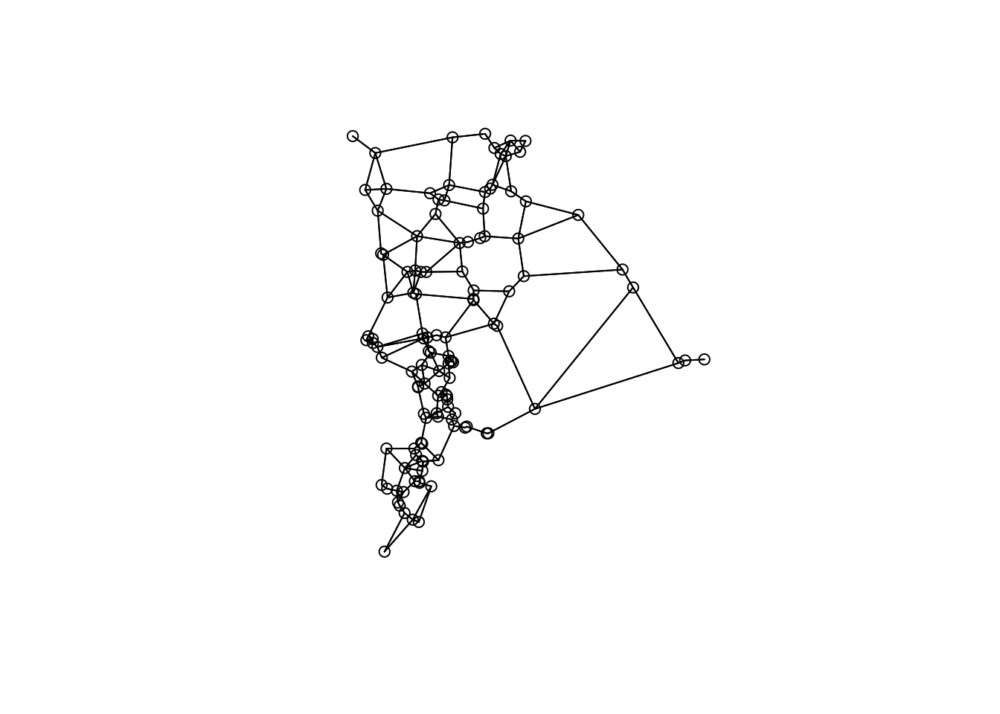
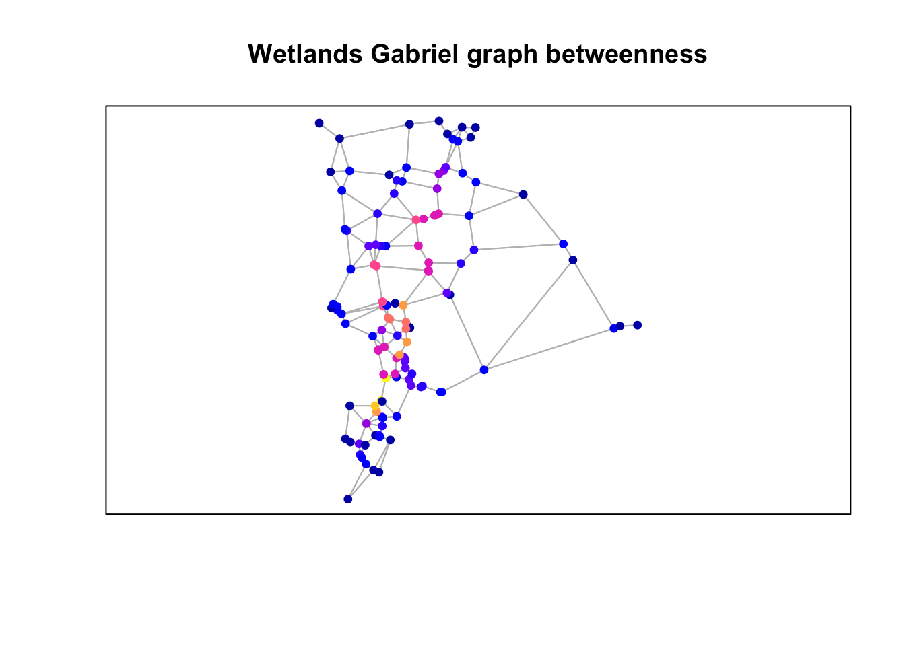
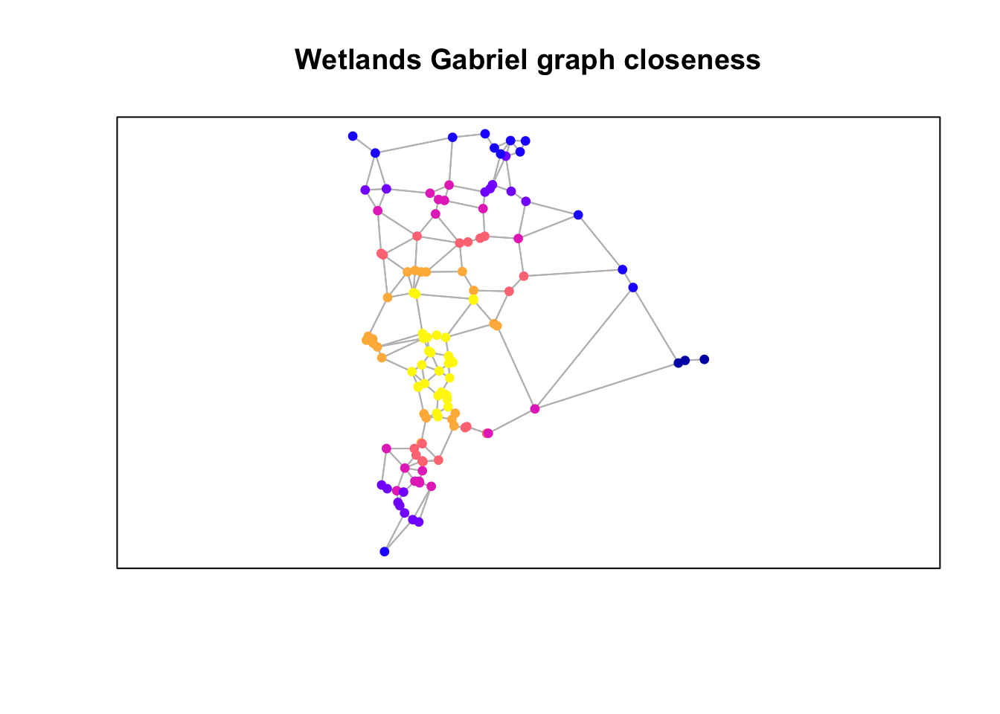
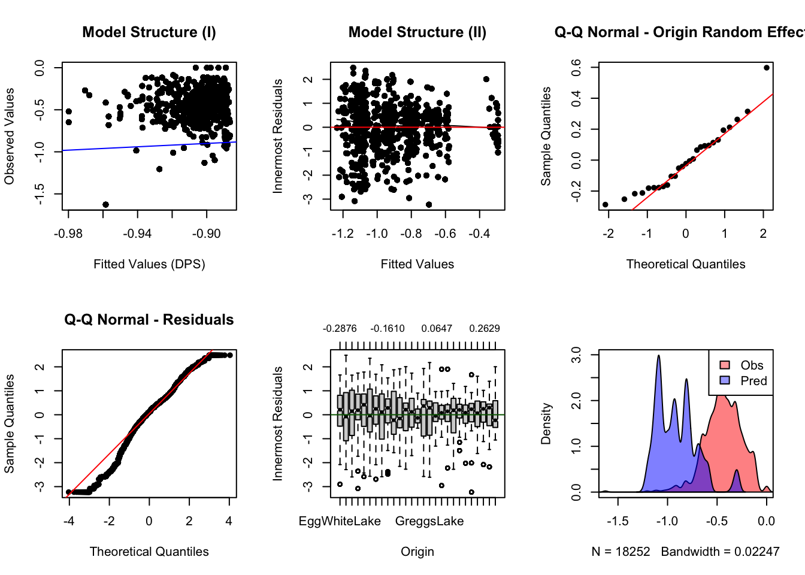
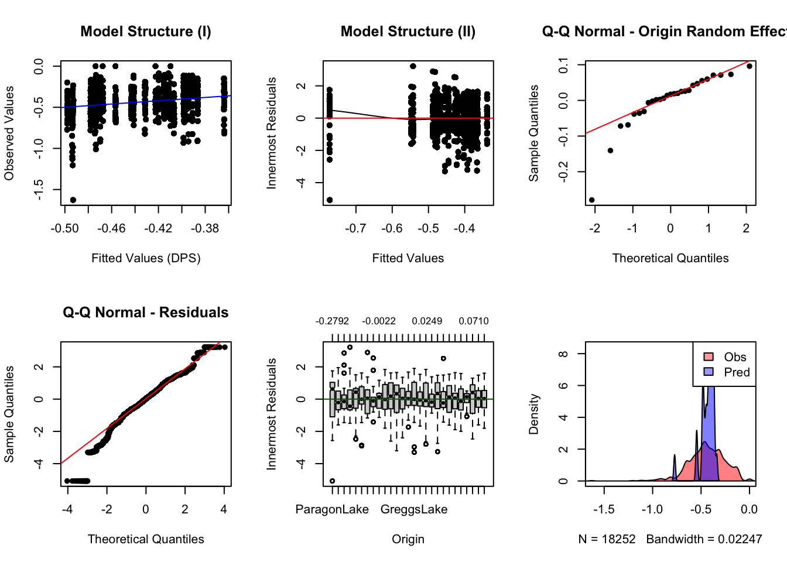

# Week 13: Gravity Models {#Week13}

This week's lab applies graph theory to fit a gravity model that includes both at-site and between-site landscape data. 

- [Worked Example](#WE_13)

## Worked Example{#WE_13}

Melanie A. Murphy & Jeffrey S. Evans


### 1. Overview of Worked Example {-}

#### a. Background {-}

There are many ways graphs can be implemented to understand population structure and relate that structure to landscape characteristics (see Dyer and Nason 2004). In this exercise, we will calculate various graph metrics and apply graphs to fit a gravity model.

Gravity models are a type of inferential model that exploit graph characteristics. Gravity models include both at-site and between-site landscape data. They are a type of graph consisting of nodes and edges. These nodes and edges represent landscape characteristics associated with these graph elements.

#### b. Data set {-}

In this exercise, you will use the gravity model framework to build an empirical model of gene flow for the Columbia spotted frog dataset in central Idaho that you have used for several other exercises (Murphy et al. 2010).

### 2. Setup {-}

#### Add required packages {-}

This code checks of all required packages are installed, and if so, loads them. If any are missing, it will return a message that identifies the packages that need to be installed. If that happens, install the packages and run the code again.

The package then checks if your version of the `GeNetIt` package is up-to-date (at least 0.1-5), and if not, installs the latest version.


```r
p <- c("raster", "rgdal", "igraph", "sp", "GeNetIt", "spatialEco", "leaflet",
       "sf", "terra", "sfnetworks", "spdep", "dplyr", "tmap", "devtools") 
  if(any(!unlist(lapply(p, requireNamespace, quietly=TRUE)))) { 
    m = which(!unlist(lapply(p, requireNamespace, quietly=TRUE)))
	  suppressMessages(invisible(lapply(p[-m], require,    
	                   character.only=TRUE)))
    stop("Missing library, please install ", paste(p[m], collapse = " "))
  } else {
    if(packageVersion("GeNetIt") < "0.1-5") {
      remotes::install_github("jeffreyevans/GeNetIt")
	} 
    suppressMessages(invisible(lapply(p, require, character.only=TRUE)))
  }
```

#### Prepare work environment {-}


```r
# Get the path to your project folder
Path <- here::here()

## i.dicates UTM 11 NAD83 projection
prj = 32611 

# Some needed functions
back.transform <- function(y) exp(y + 0.5 * stats::var(y))
rmse = function(p, o){ sqrt(mean((p - o)^2)) }
```

#### Download data {-}

This may take a moment as the file is large (148.7 MB).


```r
if(!file.exists(file.path(Path, "data", "Wetlands.csv")))
{
  d = "https://spatialr.s3.us-west-2.amazonaws.com/Gravity/data.zip"
  download.file(d, destfile=file.path(Path, "data.zip"), mode="wb")
  unzip(file.path(Path, "data.zip"))
  file.remove(file.path(Path, "data.zip"))
}
```

### 3. Wetland complex data preparation {-}

In this sections, we will read in all wetland locations in the study area and calculate a few graph-based metrics to assign to wetland sites that data was collected at. This allows us to put our samples into the context of the larger wetland system thus, accounting for proximity and juxtaposition. 

#### a. Read in wetlands data {-} 

Read file "Wetlands.csv".


```r
wetlands <- read.csv(file.path(Path, "data", "Wetlands.csv"), 
                    header = TRUE)
head(wetlands)
```

```
##   ID      X       Y RALU          SiteName
## 1  1 688835 5002939    y      AirplaneLake
## 2  2 687460 4994400    n  AlpineInletCreek
## 3  3 687507 4994314    n AlpineInletMeadow
## 4  4 687637 4994117    n        AlpineLake
## 5  5 688850 4997750    n   AxeHandleMeadow
## 6  6 688500 4998900    y    BachelorMeadow
```

Make it a spatial object.


```r
wetlands <- st_as_sf(wetlands, coords = c("X", "Y"), 
                     crs = 32611, agr = "constant") 
str(wetlands)
```

```
## Classes 'sf' and 'data.frame':	121 obs. of  4 variables:
##  $ ID      : int  1 2 3 4 5 6 7 8 9 10 ...
##  $ RALU    : chr  "y" "n" "n" "n" ...
##  $ SiteName: chr  "AirplaneLake" "AlpineInletCreek" "AlpineInletMeadow" "AlpineLake" ...
##  $ geometry:sfc_POINT of length 121; first list element:  'XY' num  688835 5002939
##  - attr(*, "sf_column")= chr "geometry"
##  - attr(*, "agr")= Factor w/ 3 levels "constant","aggregate",..: 1 1 1
##   ..- attr(*, "names")= chr [1:3] "ID" "RALU" "SiteName"
```

#### b. Create wetlands graph {-} 

Create Gabriel graph from the wetlands to represent a "realization" of connectivity and spatial arrangement. 

Derive Gabriel graph


```r
gg <- graph2nb(gabrielneigh(st_coordinates(wetlands)),sym=TRUE)

plot(gg, coords=st_coordinates(wetlands))
```



**Questions**: 

- This graph may or may not be the best representation of wetland connectivity.  What other types of graphs could you build? 
- What wetlands are connected to each other based on the graph?

#### c. Graph metrics {-}

To calculate graph metrics, we need to do a few steps:

Coerce to sf line object (will be used to create igraph object)


```r
gg <- nb2lines(gg, coords = sf::st_coordinates(wetlands), 
	             proj4string = prj, as_sf=TRUE)
```

Coerce to a `sfnetwork`, which is an `igraph` object:


```r
wg <- as_sfnetwork(gg, edges=gg, nodes=wetlands, directed = FALSE,
                  node_key = "SiteName", length_as_weight = TRUE, 
				          edges_as_lines = TRUE)
```

Calculate weights


```r
w <- wg %>% activate("edges") %>% pull(weight) %>% as.numeric()
w[w <= 0] <- 1 
w = w / sum(w)
```


Calculate graph metrics of betweenness and closeness with weights and degree. We'll add these as attributes (columns) to the wetlands `sf` object.   

- **degree** - the number of connections a node has 
- **betweenness** - the number of shortest paths going through a node
- **closensess** - the average of the shortest path length from the node to every other node in the network
  

```r
wetlands$betweenness <- igraph::betweenness(wg, directed=FALSE, weights=w)
wetlands$degree <- igraph::degree(wg)
wetlands$closeness <- igraph::closeness(wg, weights=w)
wetlands
```

```
## Simple feature collection with 121 features and 6 fields
## Attribute-geometry relationship: 3 constant, 0 aggregate, 0 identity, 3 NA's
## Geometry type: POINT
## Dimension:     XY
## Bounding box:  xmin: 686244 ymin: 4993077 xmax: 695699 ymax: 5004317
## Projected CRS: WGS 84 / UTM zone 11N
## First 10 features:
##    ID RALU          SiteName               geometry betweenness degree
## 1   1    y      AirplaneLake POINT (688835 5002939)         288      8
## 2   2    n  AlpineInletCreek POINT (687460 4994400)         443      6
## 3   3    n AlpineInletMeadow POINT (687507 4994314)         332      4
## 4   4    n        AlpineLake POINT (687637 4994117)         220      6
## 5   5    n   AxeHandleMeadow POINT (688850 4997750)        1690      6
## 6   6    y    BachelorMeadow POINT (688500 4998900)         195      4
## 7   7    y    BarkingFoxLake POINT (687944 5000006)        1323      6
## 8   8    n BarkingFoxWetland POINT (687872 5000041)        1291     10
## 9   9    n          BartPond POINT (687150 4995850)           0      6
## 10 10    n      BigClearLake POINT (690888 5004126)           0      4
##    closeness
## 1  0.3538381
## 2  0.3407043
## 3  0.3352415
## 4  0.3226762
## 5  0.5426490
## 6  0.5334932
## 7  0.5094841
## 8  0.5066511
## 9  0.3783181
## 10 0.2706522
```

#### d.  Plot graph metric {-} 

Plot results using the graph edges and wetlands points with the attributes "betweenness", "closeness" and "degree".

Plot betweenness


```r
plot(st_geometry(gg), col="grey")
  plot(wetlands["betweenness"], pch=19,  
       cex=0.75, add=TRUE)
     box()
	 title("Wetlands Gabriel graph betweenness")
```



Plot closeness


```r
plot(st_geometry(gg), col="grey")
plot(wetlands["closeness"], pch=19,  
     cex=0.75, add=TRUE)
box()
title("Wetlands Gabriel graph closeness")
```



Plot degree


```r
plot(st_geometry(gg), col="grey")
plot(wetlands["degree"], pch=19,  
     cex=0.75, add=TRUE)
box()
title("Wetlands Gabriel graph degree")
```


**Questions:** Consider the three figures above and how the graph was constructed.

- In what way(s) is the resulting graph potentially ecologically meaningful?
- How might it not be ecologically or biologically meaningful?
  

### 4. Wetland field-data preparation {-} 

In this section we will read the field data and add the node metrics we just calculated.

Using `RALU_Site.csv`, we read in the data, add the node data (betweenness and degree), create a spatial object that includes the node data. 

Read in site data


```r
sites <- read.csv(file.path(Path, "data", "RALU_Site.csv"), 
                  header = TRUE)
sites$SiteID <- as.character(sites$SiteID)
```

Add the node data.

Note: using names is dangerous as, small changes in names can result in  non-matches. In this case, the ID fields are not consistent (data were collected at different times for different purposes originally). However, names are standardized in a drop-down list of a database. So they are a matching field. My recommendation to you all is to do to this type of operation on a numeric field.


```r
nodestats <- st_drop_geometry(wetlands[,c(3,5:7)])
  nodestats <- nodestats[which(nodestats$SiteName %in% sites$SiteName),] 
sites <- merge(nodestats, sites, by="SiteName")
```

Convert data frame to `sf` object.


```r
sites <- st_as_sf(sites, coords = c("X", "Y"), 
                 crs = prj, agr = "constant") 
head(sites)
```

```
## Simple feature collection with 6 features and 14 fields
## Attribute-geometry relationship: 14 constant, 0 aggregate, 0 identity
## Geometry type: POINT
## Dimension:     XY
## Bounding box:  xmin: 687944 ymin: 4996458 xmax: 690127 ymax: 5002939
## Projected CRS: WGS 84 / UTM zone 11N
##         SiteName betweenness degree closeness SiteID     Elev Length    Area
## 1   AirplaneLake         288      8 0.3538381     27 2564.381    390 62582.2
## 2 BachelorMeadow         195      4 0.5334932     15 2591.781      0   225.0
## 3 BarkingFoxLake        1323      6 0.5094841     19 2545.275    160 12000.0
## 4        BobLake         116      4 0.4652124     16 2649.125    143  4600.0
## 5      CacheLake         673      4 0.5189996     10 2475.829     75  2268.8
## 6        DoeLake         758      6 0.4710215      8 2463.006    170 13034.9
##    Perim Depth  pH Dforest Drock Dshrub               geometry
## 1 1142.8 21.64 6.5   0.398 0.051   0.00 POINT (688835 5002939)
## 2   60.0  0.40 6.1   0.000 0.000   0.20 POINT (688500 4998900)
## 3  435.0  5.00 6.5   0.400 0.250   0.05 POINT (687944 5000006)
## 4  321.4  2.00 7.0   0.550 0.000   0.05 POINT (690127 4999150)
## 5  192.0  1.86 6.5   0.508 0.000   0.00 POINT (688777 4997264)
## 6  463.2  6.03 7.6   0.254 0.000   0.00 POINT (688968 4996458)
```

**Question**:

- What are the fields here? What data are included in `sites`?   

### 5. Saturated Graph {-}

#### a. Create graph from site locations {-} 

To assess connectivity using a gravity model, we need to build a graph from the occupied frog sites create a graph. This could be any type of graph, but I generally use saturated (essentially a full genetic distance matrix) or pruned by some maximum distance.


```r
dist.graph <- knn.graph(sites, row.names = sites$SiteName)
dist.graph <- merge(dist.graph, st_drop_geometry(sites), 
                      by.y="SiteName", by.x="from_ID")
dist.graph <- dist.graph[,-c(11:19)] ## d.op extra columns
```

Note: Can create a distance-constrained graph with max.dist arg (not run)


```r
## d.st.graph <- knn.graph(sites, row.names = sites$SiteName, max.dist=5000)
```


#### b.  Merge the graph with genetic distance {-} 

Read in the genetic distance data and make a matrix, gdist, then unfold data


```r
gdist <- read.csv(file.path(Path, "data", "RALU_Dps.csv"), header=TRUE) 
  rownames(gdist) <- t(names(gdist))
gdist <- dmatrix.df(as.matrix(gdist)) 
names(gdist) <- c("FROM", "TO", "GDIST") #unfold the file
gdist <- gdist[!gdist$FROM == gdist$TO ,]
gdist[,1] <-sub("X", "", gdist[,1])
gdist[,2] <-sub("X", "", gdist[,2])
gdist <- cbind(from.to=paste(gdist[,1], gdist[,2], sep="."), gdist)
```

Transform genetic distance to genetic flow (1-distance)


```r
gdist$GDIST <- flow(gdist$GDIST)
```

Merge graph with genetic distances, based on from node - to node combination 


```r
dist.graph$from.to <- paste(dist.graph$i, dist.graph$j, sep=".")
dist.graph <- merge(dist.graph, gdist, by = "from.to")
```

**Question**: 

- What is in the resulting object?

### 6. Spatial model data prepration {-}

#### a.  Read raster data using 'terra' {-}


```r
list.files(file.path(Path,"data"), "tif$")
```

```
## [1] "cti.tif"     "dd5.tif"     "ffp.tif"     "gsp.tif"     "hli.tif"    
## [6] "nlcd.tif"    "pratio.tif"  "rough27.tif" "srr.tif"
```

```r
xvars <- rast(list.files(file.path(Path, "data"), "tif$", 
                        full.names = TRUE))
```

#### b. Reclassify wetlands {-}

NLCD is land cover data.  The wetland classes are 11 and 90-95 (for this system and vintage NLCD data)


```r
m <- c(0,10.8, 0,10.9,12.1,1,12.9,89.5,0, 89.1,95.1,1,95.9,100,0 )
  reclass <- matrix(m, ncol=3, byrow=TRUE)
  
wetlnd <- classify(xvars[["nlcd"]], reclass)
  names(wetlnd) <- "wetlnd"
    xvars <- c(xvars, wetlnd)
```


#### c.  Calculate the proportion of the landscape around sites {-}

Assign proportion of landcover that is wetland to sites as pwetland.  You could create a binary raster for any cover type of interest and calculate this parameter.

**Question**:

- You want to know if areas of dense wetlands produce more frogs. What buffer distance will you use?

Create function to extract the proportion of wetland.


```r
## method 1 (can result in Inf if all zero)
#  prop.land <- function(x) {
#   length(x[x==1]) / length(x)  
#  }

## method 2 (no divide by zero error)
prop.land <- function(x) {
prop.table(table(factor(x, levels=c(0,1))))[2]
}
```

Apply the function to extract the proportion of wetland within a buffer (here: 300 m).


```r
b <- st_buffer(sites, 300)
pwetland <- extract(wetlnd, vect(b))
pwetland <- tapply(pwetland[,2], pwetland[,1], prop.land)
```

Add the proportion of wetland back to the dataframe.


```r
sites$pwetland <- as.numeric(pwetland)
head(sites$pwetland)
```

```
## [1] 0.196036801 0.015929204 0.050991501 0.000000000 0.004247788 0.107916223
```

**Challenge**:
  
- What happens if you change this radius?
- What radius do you think makes the most sense ecologically?
 
Alternatively, you can use the `landscapemetrics` package (see Week 2) to calculate a broader set of landscape metrics. Here is an example for calculating `pland`.  

Note: as per help file, the argument `y` of the function `sample_lsm` can accept an `sf` points object (e.g., `sites`). This returned an error though, hence we first convert `sites` to an `sp` object, using the function `as_Spatial`. 


```r
sites.sp <- as_Spatial(sites)
nlcd_sampled <- landscapemetrics::sample_lsm(landscape = xvars[["wetlnd"]], 
                                             what = "lsm_c_pland",
                                             shape = "circle",
                                             y = sites.sp, 
                                             size = 300, 
                                             return_raster = FALSE,
                                             plot_id=sites.sp@data$SiteID)
pwetland <- dplyr::select(dplyr::filter(nlcd_sampled, class == 1, 
                                        metric == "pland"), plot_id, value)  
names(pwetland) <- c("SiteID", "pwetland")
pwetland$pwetland <- pwetland$pwetland/100

head(pwetland)
```

Note: these values are sorted by `SiteID` and are not in the same order as the `sf` object `sites`, that's why the first six values may not be the same.


#### d.  Add values of rasters to sample sites {-} 

This adds potential "at site" variables, keep as sf POINT class object.  We are removing raster 6 as knowing the cover class from NLCD that intersects the same points is not very useful information. 


```r
stats <- extract(xvars[[-6]], vect(sites))
sites <- st_sf(data.frame(as.data.frame(sites), stats), 
                 geometry=sites$geometry)
```


#### e.  Add raster covariates to graph edges (lines) {-} 

Remove `nlcd` and `wetlnd` rasters before calculating statistics, as calculating statistics on categorical data is nonsensical.   

Calculating stats - this will take a while!


```r
idx <- which(names(xvars) %in% c("nlcd","wetlnd"))
suppressWarnings(
  stats <- graph.statistics(dist.graph, r = xvars[[-idx]], 
                            buffer= NULL, stats = c("min",         
                            "mean","max", "var", "median")))
```

Add statistics to graph.


```r
dist.graph <- st_sf(data.frame(as.data.frame(dist.graph), stats), 
                    geometry=dist.graph$geometry)
```

#### f.  What about categorical variables? {-} 

Statistical moments (mean, variance, etc.) are nonsensical for categorical variables. Here we create a function for returning the percent wetland between sites. Then we use it to calculate an additional statistic and add the result to the graph. 
 
**Question**:

- Are there other categorical variables that you think may be ecologically important?

Function to calculate percent wetland between pairs of sites:


```r
wet.pct <- function(x) {
  x <- ifelse(x == 11 | x == 12 | x == 90 | x == 95, 1, 0)
    prop.table(table(factor(x, levels=c(0,1))))[2] 
} 
```

Calculate statistic and add it to graph.


```r
suppressWarnings(
  wetstats <- graph.statistics(dist.graph, r=xvars[["nlcd"]], 
                               buffer= NULL, stats = c("wet.pct")) )
dist.graph$wet.pct.nlcd <- as.numeric(wetstats[,1]) 
```

#### g.  Evaluate node and edge correlations {-}
 
We need to evaluate correlations in the data to avoid overdispersion in our models (remember lab from Week 12, where we calculated the variance inflation factor, VIF). 

Note, we are not going to actually remove the correlated variables but, just go through a few methods of evaluating them. The code to remove colinear variables is commented out for reference. We do have to log transform the data as to evaluate the actual model structure. 

Create data frame with the node variables to be evaluated.


```r
node.var <- c("degree", "betweenness", "Elev", "Length", "Area", "Perim", 
              "Depth", "pH","Dforest","Drock", "Dshrub", "pwetland", "cti",
			  "dd5", "ffp","gsp","pratio","hli","rough27","srr")
s <- st_drop_geometry(sites)[,node.var]
```

Log-transform values, set log of negative values or zero (where log is not defined) to 0.00001.


```r
for(i in 1:ncol(s)) 
{
  s[,i] <- ifelse(s[,i] <= 0, 0.00001, log(s[,i]))
}
```

Site correlations:


```r
p = 0.8 # Set upper limit of for collinearity
site.cor <- cor(s, y = NULL, 
                use = "complete.obs", 
                method = "pearson")
diag(site.cor) <- 0			  		

cor.idx <- which(site.cor > p | site.cor < -p, arr.ind = TRUE)
cor.names <- vector()
cor.p <- vector()

for(i in 1:nrow(cor.idx)) 
{
	 cor.p[i] <- site.cor[cor.idx[i,][1], cor.idx[i,][2]]
  cor.names [i] <- paste(rownames(site.cor)[cor.idx[i,][1]],
                         colnames(site.cor)[cor.idx[i,][2]], sep="_")
}	
data.frame(parm=cor.names, p=cor.p)
```

```
##            parm          p
## 1      dd5_Elev -0.8924399
## 2      ffp_Elev -0.8873475
## 3      gsp_Elev  0.8728832
## 4   pratio_Elev -0.8659980
## 5   Area_Length  0.8715535
## 6  Perim_Length  0.8392532
## 7   Length_Area  0.8715535
## 8    Perim_Area  0.9912114
## 9  Length_Perim  0.8392532
## 10   Area_Perim  0.9912114
## 11     Elev_dd5 -0.8924399
## 12      ffp_dd5  0.9787231
## 13      gsp_dd5 -0.9843433
## 14   pratio_dd5  0.8965794
## 15     Elev_ffp -0.8873475
## 16      dd5_ffp  0.9787231
## 17      gsp_ffp -0.9705124
## 18   pratio_ffp  0.8553544
## 19     Elev_gsp  0.8728832
## 20      dd5_gsp -0.9843433
## 21      ffp_gsp -0.9705124
## 22   pratio_gsp -0.8820946
## 23  Elev_pratio -0.8659980
## 24   dd5_pratio  0.8965794
## 25   ffp_pratio  0.8553544
## 26   gsp_pratio -0.8820946
```

This returns a list of pairwise correlations that are than the threshold p. Instead of doing this manually, we can use the function collinear to check this. It will make a suggestions which variable to drop.


```r
node.cor <- spatialEco::collinear(s, p=p)
```

```
## Collinearity between Area and Perim correlation = 0.9912
```

```
##   Correlation means: 0.407 vs 0.272
```

```
##    recommend dropping Area
```

```
## Collinearity between Area and Length correlation = 0.8716
```

```
##   Correlation means: 0.407 vs 0.274
```

```
##    recommend dropping Area
```

```
## Collinearity between Perim and Length correlation = 0.8393
```

```
##   Correlation means: 0.402 vs 0.274
```

```
##    recommend dropping Perim
```

```
## Collinearity between Elev and dd5 correlation = 0.8924
```

```
##   Correlation means: 0.384 vs 0.273
```

```
##    recommend dropping Elev
```

```
## Collinearity between Elev and ffp correlation = 0.8873
```

```
##   Correlation means: 0.384 vs 0.274
```

```
##    recommend dropping Elev
```

```
## Collinearity between Elev and gsp correlation = 0.8729
```

```
##   Correlation means: 0.384 vs 0.274
```

```
##    recommend dropping Elev
```

```
## Collinearity between Elev and pratio correlation = 0.866
```

```
##   Correlation means: 0.384 vs 0.275
```

```
##    recommend dropping Elev
```

```
## Collinearity between dd5 and ffp correlation = 0.9787
```

```
##   Correlation means: 0.38 vs 0.274
```

```
##    recommend dropping dd5
```

```
## Collinearity between dd5 and gsp correlation = 0.9843
```

```
##   Correlation means: 0.38 vs 0.274
```

```
##    recommend dropping dd5
```

```
## Collinearity between dd5 and pratio correlation = 0.8966
```

```
##   Correlation means: 0.38 vs 0.275
```

```
##    recommend dropping dd5
```

```
## Collinearity between ffp and gsp correlation = 0.9705
```

```
##   Correlation means: 0.363 vs 0.274
```

```
##    recommend dropping ffp
```

```
## Collinearity between ffp and pratio correlation = 0.8554
```

```
##   Correlation means: 0.363 vs 0.275
```

```
##    recommend dropping ffp
```

```
## Collinearity between gsp and pratio correlation = 0.8821
```

```
##   Correlation means: 0.357 vs 0.275
```

```
##    recommend dropping gsp
```

It also returns a vector of correlated variables:


```r
node.cor
```

```
## [1] "Elev"  "Area"  "Perim" "dd5"   "ffp"   "gsp"
```

#### h.  Add node data {-} 
 
Build and add node (at-site) level data to graph, then merge edge (distance graph) and edge (between-site) data.   


```r
node.var <- c("degree", "betweenness", "Elev", "Length", "Area", "Perim", 
              "Depth", "pH","Dforest","Drock", "Dshrub", "pwetland", "cti",
			  "dd5", "ffp","gsp","pratio","hli","rough27","srr")  

node <- build.node.data(st_drop_geometry(sites), group.ids = "SiteID", 
                        from.parms = node.var)
```

Merge node and edges for model data.frame


```r
gdata <- merge(st_drop_geometry(dist.graph)[c(1,2,5,11,14,7)], node, 
               by.x="SiteID", by.y="SiteID")
gdata <- merge(gdata, st_drop_geometry(dist.graph)[c(11, 8:10, 15:55)], 
	               by.x="SiteID", by.y="SiteID") 
# log transform matrix
for(i in 5:ncol(gdata)) 
{
  gdata[,i] <- ifelse(gdata[,i] <= 0, 0.00001, log(gdata[,i]))
}
```

### 7. Gravity model {-}

#### a. Develop hypothesis {-}   

What type of gravity model do you wish to run (production or attraction constraint)?  Think about what hypotheses that you want to test. Write out model statements that group parameters into hypotheses and run models. Remember to run a NULL that is just distance. 

**At-site (node) potential parameters.**  These are all at-site variables. Remember that we pulled all raster variables. We want to critically think about hypotheses and not use all of these parameters.

- `degree` - graph degree
- `betweenness` - graph betweeness
- `Elev` - elevation (see comments below)
- `Length` - geographic distance
- `Area` - wetland area (field)
- `Perim` - wetland perimeter (field)
- `Depth` - wetland depth (field)- highly correlated with predatory fish presence/abundance
- `pH` - wetland pH (field)
- `Dforest` - distance to forest (field)
- `Drock` - distance to rock (field)
- `Dshrub` - distance to shrub (field)
- `pwetland` - proportion of wetland in X buffer (calculated above)
- `cti` - compound topographic wetness index - steady-state measure of wetness based on topography (raster data)
- `dd5` - degree days >5 C (sum of temp) - (raster data)
- `ffp` - frost free period (raster data)
- `gsp` - growing season precipitation (raster data)
- `pratio` - ratio of growing season precip to annual precip (raster data) - can indicate amount of snow to rain
- `hli` - heat load index - topographic measure of exposure, related to productivity (ice-off and primary productivity) in this system (raster data)
- `rough27` - unscale topographic variation at a 27 X 27 (cells) window size (raster data)
- `ssr` - measure of topographic variation at a 27X27 (cells) windo size - for this system pulling out ridgelines (raster data)

NOTE: we are adding elevation here as a covariate. HOWEVER - elevation does not represent ecological processes in and of itself. I strongly encourage using the components (temp, moisture, rainfall, vegetation, accessibility, etc.) directly and not elevation as a surrogate parameter.

**Between site (edge) potential parameters include:**

- `cti`, `dd5`, `ffp`, `gsp`, `pratio`, `hli`, `rough27`, `ssr` (min, mean, max, var, median for each)
- `wet.pct.nlcd` - percent of cells that are wetland class


```r
# null model (under Maximum Likelihood) 
( null <- gravity(y = "GDIST", x = c("length"), d = "length", group = "from_ID", 
                  data = gdata, fit.method = "ML") )
```

```
## [1] "Running singly-constrained gravity model"
```

```
## Gravity model
## 
## Linear mixed-effects model fit by maximum likelihood
##   Data: gdata 
##        AIC      BIC    logLik
##   20554.37 20585.62 -10273.18
## 
## Random effects:
##  Formula: GDIST ~ 1 | from_ID
##         (Intercept)  Residual
## StdDev:   0.2009152 0.4232432
## 
## Fixed effects:  stats::as.formula(paste(paste(y, "~", sep = ""), paste(x, collapse = "+"))) 
##                  Value  Std.Error    DF    t-value p-value
## (Intercept) -1.2019984 0.07467247 18224 -16.096941       0
## length       0.1418157 0.03059252 18224   4.635633       0
##  Correlation: 
##        (Intr)
## length -0.854
## 
## Standardized Within-Group Residuals:
##        Min         Q1        Med         Q3        Max 
## -3.2285925 -0.5168847  0.1184083  0.6182159  2.4848654 
## 
## Number of Observations: 18252
## Number of Groups: 27
```

```r
# Fish hypothesis (under Maximum Likelihood) 
( depth <- gravity(y = "GDIST", x = c("length","from.Depth"), d = "length", 
                   group = "from_ID", data = gdata, fit.method = "ML", ln = FALSE) )
```

```
## [1] "Running singly-constrained gravity model"
```

```
## Gravity model
## 
## Linear mixed-effects model fit by maximum likelihood
##   Data: gdata 
##         AIC       BIC  logLik
##   -13067.22 -13028.16 6538.61
## 
## Random effects:
##  Formula: GDIST ~ 1 | from_ID
##         (Intercept) Residual
## StdDev:  0.08102556 0.168483
## 
## Fixed effects:  stats::as.formula(paste(paste(y, "~", sep = ""), paste(x, collapse = "+"))) 
##                  Value   Std.Error    DF    t-value p-value
## (Intercept) -0.4101360 0.028357541 18224 -14.463032  0.0000
## length      -0.0002202 0.001624886 18224  -0.135530  0.8922
## from.Depth  -0.0200540 0.014527936    25  -1.380377  0.1797
##  Correlation: 
##            (Intr) length
## length     -0.462       
## from.Depth -0.693 -0.002
## 
## Standardized Within-Group Residuals:
##         Min          Q1         Med          Q3         Max 
## -5.07683320 -0.58959052  0.02162005  0.65913788  3.21875035 
## 
## Number of Observations: 18252
## Number of Groups: 27
```

```r
# Productivity hypothesis (under Maximum Likelihood) 
( production <- gravity(y = "GDIST", x = c("length", "from.ffp", "from.hli"), 
                     d = "length",  group = "from_ID", data = gdata, 
					 fit.method = "ML", ln = FALSE) )
```

```
## [1] "Running singly-constrained gravity model"
```

```
## Gravity model
## 
## Linear mixed-effects model fit by maximum likelihood
##   Data: gdata 
##         AIC       BIC   logLik
##   -13069.56 -13022.69 6540.779
## 
## Random effects:
##  Formula: GDIST ~ 1 | from_ID
##         (Intercept) Residual
## StdDev:  0.07472813 0.168483
## 
## Fixed effects:  stats::as.formula(paste(paste(y, "~", sep = ""), paste(x, collapse = "+"))) 
##                 Value Std.Error    DF    t-value p-value
## (Intercept)  7.844732  3.217229 18224  2.4383506  0.0148
## length      -0.000216  0.001625 18224 -0.1327679  0.8944
## from.ffp    -0.182845  0.092655    24 -1.9734052  0.0601
## from.hli     9.858960  3.806810    24  2.5898215  0.0161
##  Correlation: 
##          (Intr) length frm.ff
## length   -0.001              
## from.ffp -0.873 -0.002       
## from.hli  1.000  0.003 -0.858
## 
## Standardized Within-Group Residuals:
##         Min          Q1         Med          Q3         Max 
## -5.07745485 -0.59059645  0.02038188  0.65656315  3.21927307 
## 
## Number of Observations: 18252
## Number of Groups: 27
```

```r
# Climate hypothesis (under Maximum Likelihood) 
( climate <- gravity(y = "GDIST", x = c("length", "median.ffp", "median.pratio"), 
                     d = "length", group = "from_ID", data = gdata, 
					 fit.method = "ML",  ln = FALSE) )
```

```
## [1] "Running singly-constrained gravity model"
```

```
## Gravity model
## 
## Linear mixed-effects model fit by maximum likelihood
##   Data: gdata 
##        AIC       BIC   logLik
##   -13063.4 -13016.53 6537.699
## 
## Random effects:
##  Formula: GDIST ~ 1 | from_ID
##         (Intercept) Residual
## StdDev:  0.08379164 0.168483
## 
## Fixed effects:  stats::as.formula(paste(paste(y, "~", sep = ""), paste(x, collapse = "+"))) 
##                    Value Std.Error    DF    t-value p-value
## (Intercept)   -0.3764155 0.4324059 18222 -0.8705143  0.3840
## length        -0.0002220 0.0016250 18222 -0.1365944  0.8914
## median.ffp    -0.0015543 0.0123722 18222 -0.1256312  0.9000
## median.pratio  0.0719090 0.5093743 18222  0.1411713  0.8877
##  Correlation: 
##               (Intr) length mdn.ff
## length        -0.030              
## median.ffp    -0.921  0.000       
## median.pratio  0.999  0.000 -0.914
## 
## Standardized Within-Group Residuals:
##         Min          Q1         Med          Q3         Max 
## -5.07813375 -0.58911378  0.02085691  0.65932821  3.22058420 
## 
## Number of Observations: 18252
## Number of Groups: 27
```

```r
# Wetlands hypothesis (under Maximum Likelihood) 
( wetlands <- gravity(y = "GDIST", x = c("length", "from.degree", "from.betweenness", "from.pwetland"), 
                      d = "length", group = "from_ID", data = gdata, fit.method = "ML",
					  ln = FALSE) )
```

```
## [1] "Running singly-constrained gravity model"
```

```
## Gravity model
## 
## Linear mixed-effects model fit by maximum likelihood
##   Data: gdata 
##         AIC       BIC   logLik
##   -13061.71 -13007.03 6537.856
## 
## Random effects:
##  Formula: GDIST ~ 1 | from_ID
##         (Intercept) Residual
## StdDev:  0.08333405 0.168483
## 
## Fixed effects:  stats::as.formula(paste(paste(y, "~", sep = ""), paste(x, collapse = "+"))) 
##                       Value  Std.Error    DF   t-value p-value
## (Intercept)      -0.3992700 0.10461517 18224 -3.816559  0.0001
## length           -0.0002201 0.00162516 18224 -0.135444  0.8923
## from.degree      -0.0016877 0.01219259    23 -0.138422  0.8911
## from.betweenness -0.0211050 0.05709693    23 -0.369635  0.7150
## from.pwetland    -0.0042020 0.00998733    23 -0.420733  0.6779
##  Correlation: 
##                  (Intr) length frm.dg frm.bt
## length           -0.129                     
## from.degree      -0.273  0.013              
## from.betweenness -0.770 -0.006 -0.335       
## from.pwetland     0.015 -0.002  0.348 -0.015
## 
## Standardized Within-Group Residuals:
##         Min          Q1         Med          Q3         Max 
## -5.07678625 -0.58904996  0.02101676  0.65966584  3.21863968 
## 
## Number of Observations: 18252
## Number of Groups: 27
```

```r
# Topography hypothesis (under Maximum Likelihood) 
( topo <- gravity(y = "GDIST", x = c("length", "median.srr", "median.rough27"), d = "length", 
                  group = "from_ID", data = gdata, fit.method = "ML",
				  ln = FALSE) )
```

```
## [1] "Running singly-constrained gravity model"
```

```
## Gravity model
## 
## Linear mixed-effects model fit by maximum likelihood
##   Data: gdata 
##         AIC       BIC   logLik
##   -13063.38 -13016.51 6537.691
## 
## Random effects:
##  Formula: GDIST ~ 1 | from_ID
##         (Intercept) Residual
## StdDev:  0.08384168 0.168483
## 
## Fixed effects:  stats::as.formula(paste(paste(y, "~", sep = ""), paste(x, collapse = "+"))) 
##                     Value   Std.Error    DF    t-value p-value
## (Intercept)    -0.4362752 0.028684761 18222 -15.209304  0.0000
## length         -0.0002219 0.001624950 18222  -0.136584  0.8914
## median.srr      0.0000915 0.012808227 18222   0.007141  0.9943
## median.rough27 -0.0001394 0.002224808 18222  -0.062664  0.9500
##  Correlation: 
##                (Intr) length mdn.sr
## length         -0.458              
## median.srr      0.449  0.000       
## median.rough27 -0.574  0.000 -0.132
## 
## Standardized Within-Group Residuals:
##        Min         Q1        Med         Q3        Max 
## -5.0777083 -0.5892049  0.0209408  0.6596691  3.2190372 
## 
## Number of Observations: 18252
## Number of Groups: 27
```

```r
# Habitat hypothesis (under Maximum Likelihood) 
( habitat <- gravity(y = "GDIST", x = c("length", "wet.pct.nlcd", "median.gsp"), 
                     d = "length", group = "from_ID", data = gdata, fit.method = "ML",
					 ln = FALSE, method="ML") )
```

```
## [1] "Running singly-constrained gravity model"
```

```
## Gravity model
## 
## Linear mixed-effects model fit by maximum likelihood
##   Data: gdata 
##         AIC       BIC   logLik
##   -13063.38 -13016.51 6537.689
## 
## Random effects:
##  Formula: GDIST ~ 1 | from_ID
##         (Intercept) Residual
## StdDev:  0.08385112 0.168483
## 
## Fixed effects:  stats::as.formula(paste(paste(y, "~", sep = ""), paste(x, collapse = "+"))) 
##                   Value Std.Error    DF    t-value p-value
## (Intercept)  -0.4347231 0.3358747 18222 -1.2943015  0.1956
## length       -0.0002220 0.0016250 18222 -0.1365927  0.8914
## wet.pct.nlcd  0.0000233 0.0008368 18222  0.0278113  0.9778
## median.gsp   -0.0004444 0.0592399 18222 -0.0075024  0.9940
##  Correlation: 
##              (Intr) length wt.pc.
## length       -0.039              
## wet.pct.nlcd -0.131  0.000       
## median.gsp   -0.998  0.000  0.137
## 
## Standardized Within-Group Residuals:
##         Min          Q1         Med          Q3         Max 
## -5.07735336 -0.58922468  0.02089058  0.65952539  3.21896772 
## 
## Number of Observations: 18252
## Number of Groups: 27
```

```r
# Global model (under Maximum Likelihood) 

( global <- gravity(y = "GDIST", x = c("length", "wet.pct.nlcd", "median.gsp", 
                    "from.Depth", "from.ffp", "from.hli", "from.pratio", "from.degree", 
					"from.betweenness", "from.pwetland", "median.srr", "median.rough27"), 
					d = "length", group = "from_ID", data = gdata, fit.method = "ML",
					ln = FALSE) )
```

```
## [1] "Running singly-constrained gravity model"
```

```
## Gravity model
## 
## Linear mixed-effects model fit by maximum likelihood
##   Data: gdata 
##         AIC       BIC   logLik
##   -13054.63 -12937.45 6542.316
## 
## Random effects:
##  Formula: GDIST ~ 1 | from_ID
##         (Intercept) Residual
## StdDev:  0.07055036 0.168483
## 
## Fixed effects:  stats::as.formula(paste(paste(y, "~", sep = ""), paste(x, collapse = "+"))) 
##                      Value Std.Error    DF    t-value p-value
## (Intercept)       7.594838  3.142709 18220  2.4166536  0.0157
## length           -0.000222  0.001626 18220 -0.1363422  0.8916
## wet.pct.nlcd      0.000015  0.000848 18220  0.0182482  0.9854
## median.gsp        0.006423  0.074369 18220  0.0863647  0.9312
## from.Depth       -0.028416  0.016951    19 -1.6763414  0.1100
## from.ffp         -0.160716  0.092478    19 -1.7378814  0.0984
## from.hli          9.870505  3.708767    19  2.6613980  0.0154
## from.pratio       0.021924  0.044485    19  0.4928338  0.6278
## from.degree      -0.002106  0.010941    19 -0.1924986  0.8494
## from.betweenness  0.041878  0.059756    19  0.7008170  0.4919
## from.pwetland     0.004308  0.009342    19  0.4611556  0.6499
## median.srr        0.000243  0.012888 18220  0.0188312  0.9850
## median.rough27   -0.000201  0.002850 18220 -0.0705163  0.9438
##  Correlation: 
##                  (Intr) length wt.pc. mdn.gs frm.Dp frm.ff frm.hl frm.pr frm.dg
## length           -0.004                                                        
## wet.pct.nlcd     -0.006  0.000                                                 
## median.gsp       -0.130  0.000  0.018                                          
## from.Depth        0.062 -0.001 -0.002 -0.001                                   
## from.ffp         -0.861  0.001  0.006  0.017 -0.179                            
## from.hli          0.985  0.001 -0.004  0.002  0.035 -0.858                     
## from.pratio       0.015  0.007 -0.009  0.015 -0.076 -0.132  0.120              
## from.degree      -0.114  0.016 -0.005 -0.004 -0.074  0.084 -0.075  0.300       
## from.betweenness  0.054 -0.007  0.003 -0.012 -0.533 -0.009  0.062 -0.159 -0.292
## from.pwetland     0.085  0.000  0.005  0.000 -0.339 -0.070  0.117  0.254  0.379
## median.srr        0.001  0.000 -0.075  0.077  0.005 -0.009  0.007  0.001  0.010
## median.rough27    0.085  0.000  0.150 -0.603 -0.004 -0.010  0.009 -0.015  0.009
##                  frm.bt frm.pw mdn.sr
## length                               
## wet.pct.nlcd                         
## median.gsp                           
## from.Depth                           
## from.ffp                             
## from.hli                             
## from.pratio                          
## from.degree                          
## from.betweenness                     
## from.pwetland     0.137              
## median.srr        0.002 -0.006       
## median.rough27    0.003  0.004 -0.161
## 
## Standardized Within-Group Residuals:
##         Min          Q1         Med          Q3         Max 
## -5.07862043 -0.59088464  0.02199601  0.65522607  3.22091896 
## 
## Number of Observations: 18252
## Number of Groups: 27
```

#### b.  Compare competing models {-} 

Should you use ML or REML? Create diagnostic plots.

Can you directly compare ML and REML? Why not?


```r
compare.models(null, depth, production, climate, wetlands, 
               topo, habitat, global)
```

```
##        model       AIC       BIC log.likelihood   RMSE nparms     deltaAIC
## 1       null  20554.37  20585.62     -10273.185 0.5386      0 33623.927613
## 2      depth -13067.22 -13028.16       6538.610 0.1779      2     2.339018
## 3 production -13069.56 -13022.69       6540.779 0.1765      3     0.000000
## 4    climate -13063.40 -13016.53       6537.699 0.1785      3     6.160553
## 5   wetlands -13061.71 -13007.03       6537.856 0.1784      4     7.846638
## 6       topo -13063.38 -13016.51       6537.691 0.1786      3     6.176597
## 7    habitat -13063.38 -13016.51       6537.689 0.1786      3     6.179621
## 8     global -13054.63 -12937.45       6542.316 0.1757     12    14.926651
##       deltaBIC
## 1 33613.776566
## 2     0.000000
## 3     5.473012
## 4    11.633565
## 5    21.131680
## 6    11.649610
## 7    11.652634
## 8    90.707933
```


```r
par(mfrow=c(2,3))
   for (i in 1:6) { plot(null, type=i) } 
```



#### c.  Fit final model(s) and calculate effect size {-}

To calculate effect size, we refit the models with REML.


```r
# productivity fit (under REML)
h <- c("length", "from.ffp", "from.hli")
production_fit <- gravity(y = "GDIST", x = h, d = "length", group = "from_ID",
                      data = gdata, ln=FALSE)
```

```
## [1] "Running singly-constrained gravity model"
```

```r
## g.obal fit (under REML)
g <-  c("length", "wet.pct.nlcd", "median.gsp", "from.Depth", "from.ffp",
        "from.hli", "from.pratio",  "from.degree", "from.betweenness",  
        "from.pwetland", "median.srr",  "median.rough27")
global_fit <- gravity(y = "GDIST", x = g, d = "length", 
                      group = "from_ID", data = gdata, ln=FALSE)
```

```
## [1] "Running singly-constrained gravity model"
```

Effect size calculation: global model


```r
gravity.es(global_fit)
```

```
##                      t.value    df       cohen.d  p.value      low.ci
## length           -0.12995103 18220 -0.0019254646 0.896607 -0.02246144
## wet.pct.nlcd      0.01285573 18220  0.0001904814 0.989743 -0.02034549
## median.gsp        0.06080170 18220  0.0009008895 0.951518 -0.01963508
## from.Depth       -1.40651839    19 -0.6453548981 0.175716 -1.33971267
## from.ffp         -1.45856008    19 -0.6692332641 0.161020 -1.36495273
## from.hli          2.23310806    19  1.0246202508 0.037767  0.30328454
## from.pratio       0.41324402    19  0.1896093623 0.684054 -0.48802350
## from.degree      -0.16130151    19 -0.0740102093 0.873559 -0.75028579
## from.betweenness  0.58817704    19  0.2698741332 0.563340 -0.40939769
## from.pwetland     0.38694297    19  0.1775416115 0.703098 -0.49989408
## median.srr        0.01325052 18220  0.0001963309 0.989428 -0.02033964
## median.rough27   -0.04964361 18220 -0.0007355618 0.960407 -0.02127153
##                       up.ci
## length           0.01861051
## wet.pct.nlcd     0.02072645
## median.gsp       0.02143686
## from.Depth       0.04900287
## from.ffp         0.02648620
## from.hli         1.74595596
## from.pratio      0.86724222
## from.degree      0.60226537
## from.betweenness 0.94914596
## from.pwetland    0.85497730
## median.srr       0.02073230
## median.rough27   0.01980041
```

```r
par(mfrow=c(2,3))
   for (i in 1:6) { plot(global_fit, type=i) } 
```


Production model:


```r
gravity.es(production_fit)
```

```
##             t.value    df      cohen.d  p.value      low.ci      up.ci
## length   -0.1307727 18224 -0.001937426 0.895957 -0.02247115  0.0185963
## from.ffp -1.8607323    24 -0.759640789 0.075078 -1.37514450 -0.1441371
## from.hli  2.4419572    24  0.996924848 0.022351  0.36605297  1.6277967
```

```r
par(mfrow=c(2,3))
   for (i in 1:6) { plot(production_fit, type=i) } 
```




#### d.  Back predict global_fit model {-} 

Feel free to add other top models.


```r
gd <- back.transform(gdata$GDIST)

# Make individual-level (group) predictions (per slope) and show RMSE 
global.p <- predict(global_fit, y = "GDIST", x = g,  
                    newdata=gdata, groups = gdata$from_ID,
				    back.transform = "simple")
```

```
## Making individual-level (per-slope group) 
## 		  constrained predictions
```

```
## Back-transforming exp(y-hat)*0.5*variance(y-hat), 
## 		  assumes normally distributed errors
```

```r
production.p <- predict(production_fit, y = "GDIST", x = h,  
                     newdata=gdata, groups = gdata$from_ID,
			         back.transform = "simple")
```

```
## Making individual-level (per-slope group) 
## 		  constrained predictions
## Back-transforming exp(y-hat)*0.5*variance(y-hat), 
## 		  assumes normally distributed errors
```

```r
cat("RMSE of global", rmse(global.p, gd), "\n")
```

```
## RMSE of global 0.1104084
```

```r
cat("RMSE of production", rmse(production.p, gd), "\n")
```

```
## RMSE of production 0.1104098
```

#### e.  Aggregrate estimates and plot {-} 

We can aggregrate estimates back to the edges and nodes. An interactive map can be created using the `tmap` package (see Week 2 Bonus vignette).

Aggregate estimates to graph and node.


```r
global.p <- data.frame(EID = gdata$from.to,
                       NID = gdata$from_ID,  
                       p=global.p)

edge.p <- tapply(global.p$p, global.p$EID, mean)
  dist.graph$global.flow <- edge.p
  
node.p <- tapply(global.p$p, global.p$NID, mean)
node.var <- tapply(global.p$p, global.p$NID, var)

idx <- which(sites$SiteName %in% names(node.p))
sites$global.flow[idx] <- node.p
sites$global.var[idx] <- node.var
```

Define the map and store it in object `Map`.


```r
pal <- colorRampPalette(rev(c("red","orange","blue")), bias=0.15)

Map <- 
  tm_shape(dist.graph) +
  tm_lines("global.flow", palette=pal(10), title.col="Edges: global.flow") +
  tm_shape(sites) +
  tm_symbols(col = "global.flow", size = "global.var", 
	           shape = 20, scale = 0.75, palette=pal(10), 
             title.col="Nodes: global.flow", title.size="Nodes: global.var") 
```

Plot static map: here we tell R to plot the legend outside of the map.


```r
tmap_mode(c("plot", "view")[1])
```

```
## tmap mode set to plotting
```

```r
Map + tm_layout(legend.outside=TRUE, legend.position = c("right", "top"))
```

```
## Legend labels were too wide. Therefore, legend.text.size has been set to 0.49. Increase legend.width (argument of tm_layout) to make the legend wider and therefore the labels larger.
```


Plot interactive map: this may not render e.g. in Bookdown or when you knit your notebook to output formats other than `.html`. 


```r
#tmap_mode(c("plot", "view")[2])
#Map 
```


