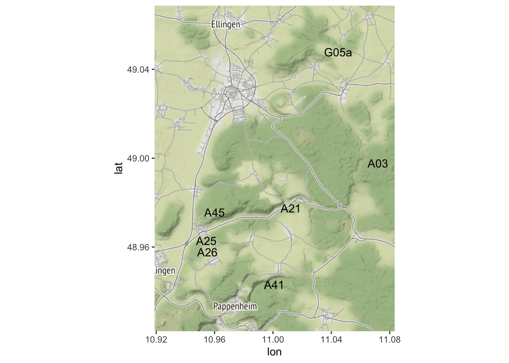
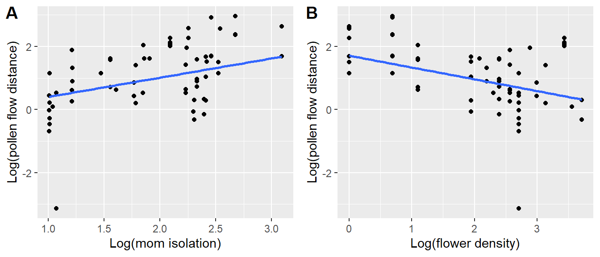

# Week 14: Contemporary Gene Flow {#Week14}


## Worked Example{#WE_14}


### 1. Overview

#### a. Background and Goals

In this lab, you will use the `gstudio` package to analyse parent-offspring data for the wildflower *Pulsatilla vulgaris*. You will learn: 

- how to conduct landscape genetic analyses on pollen pools,
- how to conduct paternity analysis to quantify contemporary pollen flow, and 
- how to relate realized pollen flow events to landscape variables.

The data are from DiLeo et al. (in press). The data include genotypes from seeds, mothers, and all potential fathers from seven focal populations. The study area in the Franconian Jura in Germany is the same as for the *Dianthus carthusianorum* data from Week 7 (see introductory video by Yessica Rico for the Dianthus data set to learn more about the system). 

Here, we will recreate one analysis from DiLeo et al. (in press), looking at the ecological factors that best explain pollen immigration rates of the seven populations. 

#### b. Data set

There are three data files associated with this lab: 

- "pulsatilla_genotypes.csv", which contains the genotypes of offspring, mothers, and potential fathers from seven populations,
- "pulsatilla_momVariables.csv", which contains ecological variables collect for each mother, and 
- "pulsatilla_population.csv", which contains landscape and population size information for each of the seven populations. 

#### c. Required packages

Install some packages needed for this worked example.


```r
if(!requireNamespace("popgraph", quietly = TRUE)) remotes::install_github("dyerlab/popgraph")
if(!requireNamespace("gstudio", quietly = TRUE)) remotes::install_github("dyerlab/gstudio")
```


```r
library(LandGenCourse)
library(dplyr)
```

```
## 
## Attaching package: 'dplyr'
```

```
## The following objects are masked from 'package:stats':
## 
##     filter, lag
```

```
## The following objects are masked from 'package:base':
## 
##     intersect, setdiff, setequal, union
```

```r
library(ggplot2)
library(ggmap)
```

```
## Google's Terms of Service: https://cloud.google.com/maps-platform/terms/.
```

```
## Please cite ggmap if you use it! See citation("ggmap") for details.
```

```r
#library(gstudio)
#library(pegas)
#library(vegan)
#library(purrr)
#library(MuMIn)
#library(lme4)
#library(cowplot)
```

### 2. Import Genotypes

The package `gstudio` makes it very easy to import genotype data (see Week 1). Typically, we store our genotype data in a spreadsheet with one line per individual and two columns per locus. Using the `read_population` function, we tell `gstudio` which columns contain our loci. The argument `type="column"` indicates that our raw text file stores genotypes in two columns per locus.

#### a. Import genotype data


```r
dat <- gstudio::read_population(system.file("extdata",              
        "pulsatilla_genotypes.csv", package="LandGenCourse"), 
        type = "column", locus.columns = 6:19)
dat$ID <- as.factor(dat$ID)
```

Let's take a look at the data:


```r
head(dat)
```

```
##   ID OffID Population       X       Y  loc1_a  loc2_a  loc3_a  loc4_a  loc5_a
## 1 62     0        A21 4426941 5427173 340:340 422:422 413:425 446:448 121:121
## 2 64     0        A21 4426933 5427178 334:334 424:424 417:434 444:449 122:133
## 3 65     0        A21 4426936 5427173 338:340 417:422 417:419 446:452 135:137
## 4 66     0        A21 4426937 5427174 340:344 422:422 411:431 446:448 122:126
## 5 68     0        A21 4426934 5427171 336:342 417:422 423:438 448:448 119:123
## 6 69     0        A21 4426933 5427166 336:346 422:422 417:421 444:452 122:124
##    loc6_a  loc7_a
## 1 155:157 242:244
## 2 155:161 242:252
## 3 153:157 244:246
## 4 157:159 242:252
## 5 155:155 244:256
## 6 155:161 256:256
```

There are 12 columns:

- **ID**: A unique identifier for every adult.
- **OffID**: Zero if the sample is an adult and > 0 if the sample is an offspring.
- **Population**: The population of origin.
- **2 coordinate columns, X & Y**: The geographic coordinates of the sample (Euclidean coordinate system Gauss-Krueger GK4 with CRS("+init=epsg:31468")).
- **7 locus columns**: For each locus, the microsatellite genotype is stored in a single column with alleles separated by ":".

#### b. Plot map of sampling locations

To create a map with `qmplot` (see Week 4), here we do the following:

- Use functions from `dplyr` to get mean coordinates per population
- Convert the coordinates to lat-lon coordinates with `sf_project` from the `sf` package. We use the EPSG reference numbers (http://epsg.io/) to specify the 'from' and 'to' coordinate systems. 
- Download a "terrain" map from "stamen", with zoom level 12.
- Add population labels with `geom_text`. We specify an offset along the x-axis,`nudge_x`, and for sites 'A25' and 'A26' also an offset along the y-axis to prevent labels from overlapping.


```r
Coords <- dat %>% group_by(Population) %>% 
          summarize(X = mean(X), Y = mean(Y))
Coords <- data.frame(Coords, sf::sf_project(from = "+init=epsg:31468", 
          to = "+init=epsg:4326", pts = Coords[c("X", "Y")]))
names(Coords)[4:5] <- c("Longitude", "Latitude")

bbox <- make_bbox(lon = Longitude, lat = Latitude, data = Coords, f=0.2)

MyMap <- ggmap(get_stamenmap(bbox, maptype="terrain", zoom=12, force=TRUE)) 
```

```
## Source : http://tile.stamen.com/terrain/12/2172/1405.png
```

```
## Source : http://tile.stamen.com/terrain/12/2173/1405.png
```

```
## Source : http://tile.stamen.com/terrain/12/2174/1405.png
```

```
## Source : http://tile.stamen.com/terrain/12/2172/1406.png
```

```
## Source : http://tile.stamen.com/terrain/12/2173/1406.png
```

```
## Source : http://tile.stamen.com/terrain/12/2174/1406.png
```

```
## Source : http://tile.stamen.com/terrain/12/2172/1407.png
```

```
## Source : http://tile.stamen.com/terrain/12/2173/1407.png
```

```
## Source : http://tile.stamen.com/terrain/12/2174/1407.png
```

```
## Source : http://tile.stamen.com/terrain/12/2172/1408.png
```

```
## Source : http://tile.stamen.com/terrain/12/2173/1408.png
```

```
## Source : http://tile.stamen.com/terrain/12/2174/1408.png
```

```r
MyMap + geom_text(data = Coords, mapping = aes(Longitude, Latitude, 
              label = Population), size = 4, col = "black", hjust = 0, 
              nudge_x = 0.005, nudge_y = c(0,0,0.002,-0.001,0,0,0)) 
```



### 3. Pollen pool genetic structure

#### a. Subtract maternal contribution to offspring genotype

Let's look at the data for the mother with the ID=3083 and her associated offspring:


```r
dat[dat$ID == "3083",]
```

```
##       ID OffID Population       X       Y  loc1_a  loc2_a  loc3_a  loc4_a
## 207 3083     0        A25 4422659 5425370 338:340 417:424 392:392 452:452
## 208 3083     1        A25 4422659 5425370 338:340 417:424 392:409 446:452
## 209 3083     3        A25 4422659 5425370 338:338 417:424         452:452
## 210 3083     4        A25 4422659 5425370 340:340 417:422 392:411 448:452
## 211 3083     5        A25 4422659 5425370 340:340 417:424 392:392 452:452
## 212 3083     6        A25 4422659 5425370 338:338 422:424 392:411 452:452
## 213 3083     7        A25 4422659 5425370 338:340 424:424 392:392 452:452
## 214 3083     8        A25 4422659 5425370 340:340 417:417 392:417 452:452
##      loc5_a  loc6_a  loc7_a
## 207 121:121 157:157 244:252
## 208 121:121 157:157 240:244
## 209 121:121 157:157        
## 210 121:121 155:157 236:252
## 211 121:121 157:157 244:244
## 212 121:121 157:159 242:244
## 213 121:121 157:157 244:244
## 214 121:121 155:157 242:244
```

The first row is the mother and the subsequent rows are her offspring with OffIDs 1-8.

Now, use the `minus_mom` function to remove the mother's contribution to the offspring genotypes. You will be left with just the paternal contribution. The allele frequecies of all paternal contributions associated with a single mother is called a "pollen pool". 

In some cases, the pollen contribution is ambiguous when the offspring has both alleles in common with the mother (e.g. see OffID 1, loc1_a and loc2_a). In such cases, both alleles are retained. 


```r
pollen <- gstudio::minus_mom(dat, MomCol = "ID", OffCol = "OffID")
pollen[pollen$ID == "3083",]
```

```
##       ID OffID Population       X       Y  loc1_a  loc2_a loc3_a loc4_a loc5_a
## 208 3083     1        A25 4422659 5425370 338:340 417:424    409    446    121
## 209 3083     3        A25 4422659 5425370     338 417:424           452    121
## 210 3083     4        A25 4422659 5425370     340     422    411    448    121
## 211 3083     5        A25 4422659 5425370     340 417:424    392    452    121
## 212 3083     6        A25 4422659 5425370     338     422    411    452    121
## 213 3083     7        A25 4422659 5425370 338:340     424    392    452    121
## 214 3083     8        A25 4422659 5425370     340     417    417    452    121
##     loc6_a loc7_a
## 208    157    240
## 209    157       
## 210    155    236
## 211    157    244
## 212    159    242
## 213    157    244
## 214    155    242
```

The pollen pool data can be analysed as any other population genetic data. 

Note: There are some missing genotypes for the offspring that trigger warnings, which you may ignore. Here we suppressed the warnings to reduce output.

#### b. 'TwoGener' analysis (AMOVA of pollen pool data)

For example, we can conduct an AMOVA (see Week 4) to test if pollen pools belonging to different mothers are signficantly differentiated from one another. When an AMOVA is applied to pollen pools it is called a 'TwoGener' analysis (Two-generational analysis; Smouse et al. 2001, Dyer et al. 2004). 

Here we use the `amova` function from the `pegas` package to perform a hierarchical analysis of variance on genetic distance matrices (AMOVA), with moms nested within patches (this may take a while).


```r
D <- gstudio::genetic_distance(pollen,mode="amova")
D <- as.dist(D)
Moms <- pollen$ID
Populations <- as.factor(pollen$Population) 
amova.result <- pegas::amova(D ~ Populations/Moms, nperm=500)
```

```
## Registered S3 method overwritten by 'spdep':
##   method   from
##   plot.mst ape
```

```
## Registered S3 method overwritten by 'pegas':
##   method      from
##   print.amova ade4
```

```r
amova.result
```

```
## 
## 	Analysis of Molecular Variance
## 
## Call: pegas::amova(formula = D ~ Populations/Moms, nperm = 500)
## 
##                   SSD        MSD  df
## Populations  664.3079 110.717976   6
## Moms        1252.7296  36.844988  34
## Error       1895.1503   6.916607 274
## Total       3812.1878  12.140725 314
## 
## Variance components:
##             sigma2 P.value
## Populations 1.6747       0
## Moms        3.9278       0
## Error       6.9166        
## 
## Phi-statistics:
## Populations.in.GLOBAL (Phi_CT)        Moms.in.GLOBAL (Phi_ST) 
##                      0.1337729                      0.4475164 
##   Moms.in.Populations (Phi_SC) 
##                      0.3621954 
## 
## Variance coefficients:
##         a         b         c 
##  7.619648  7.920406 43.405291
```

Calculate phi from the variance components:


```r
phi <- amova.result$varcomp[1]/sum(amova.result$varcomp[1])
names(phi) <- "phi"
phi
```

```
##                   phi
## Populations 0.1337729
## Moms        0.3137434
## Error       0.5524836
```

Looking at the variance components and the phi-statistics (analogue to F-statistics), what can be said about differentiation among pollen pools?

**Questions:**

- Are pollen pools more differentiated among populations or among mothers within populations?
- What does this mean biologically?

#### c. Including space: Isolation by distance

The 'TwoGener' analysis gives a summary statistic describing overall differentiation, but this does not tell us anything about **why** the pollen pools are differentiated. In order to better understand **why**, we can analyse the data spatially just like any other landscape genetic dataset. 

For example, we can test a basic hypothesis of isolation by distance by asking: are pollen pools from mothers that are geographically close more similar than those that are far? We test this by calculating pairwise genetic similarity (proportion of shared alleles) and relate this to geographic distance. For a more sophistocated analysis, the data could also be analysed as a "pollination graph" (Dyer et al. 2012), which is similar to population graphs that will be included in the Bonus Material for Week 13, but we will not do this here.

First, calculate matrix of pairwise genetic similarity among pollen pools.


```r
dps <- 1 - gstudio::genetic_distance(pollen, stratum = "ID", mode = "Dps")
```

```
## Bray distance will be assumed to be entirely additive across loci.
```

Note: the proportion of shared alleles is a measure of genetic similarity, hence we expect it to decrease with geographic distance. We convert this into a measure of genetic distance by subtracting it from 1 (see Week 5).

Calculate matrix of pairwise geographic distance among pollen pools: 


```r
xy <- unique(data.frame(pollen$X, pollen$Y))
xy.dist <- as.matrix(dist(xy))
```

Plot 'dps' against geographic distance. 


```r
par(mar=c(4,4,0,0))
plot(xy.dist[lower.tri(xy.dist)], dps[lower.tri(dps)], 
    xlab = "Geographic distance (m)", 
     ylab = "1 - Proportion of shared alleles (dps)")
abline(lm(dps[lower.tri(dps)]~xy.dist[lower.tri(xy.dist)]))
```


We see that pollen pools belonging to mothers that are spatially close are more similar. Let's quantify the strength of this relationship using a Mantel test.


```r
vegan::mantel(xy.dist, dps)
```

```
## 
## Mantel statistic based on Pearson's product-moment correlation 
## 
## Call:
## vegan::mantel(xdis = xy.dist, ydis = dps) 
## 
## Mantel statistic r: 0.4432 
##       Significance: 0.001 
## 
## Upper quantiles of permutations (null model):
##   90%   95% 97.5%   99% 
## 0.113 0.153 0.198 0.225 
## Permutation: free
## Number of permutations: 999
```

Note: it seems that the `mantel` function in `vegan` automatically tests a one-sided alternative that the Mantel correlation is greater than zero. This means that if we had used 'Dps' as a measure of genetic similarity, the default setting would have resulted in a p-value of 0.999. Unfortunately, for now, this is not discussed in the help file and there is no option to change the alternative. 

### 4. Paternity analysis

'TwoGener' and related methods are sensitive to inbreeding and strong genetic structure of adult populations, although methods exist to correct for some of these things (e.g. Dyer et al. 2004). However, it is often the best (or only) option for quantifying pollen flow for high density species where other analyses such as paternity assignment cannot be conducted. 

In our case, we have complete sampling of potential fathers within the seven populations (i.e., patches) from which mothers and their offspring were sampled. Therefore, we are able to conduct a paternity analysis, which will give us more detailed information about contemporary pollen flow. 

Note that we do not have complete sampling of all potential fathers within the larger study region, and so we assume that any seed that is not assigned to a father is a pollen immigration event. In this section, we will conduct a paternity analysis using the `gstudio` package and relate the results to landscape variables.

#### a. Exclusion probabilities

First let's check if our genetic markers have sufficient information (genetic resolution) to discriminate among alternative fathers by calculating exclusion probabilites.


```r
## e.clusion probabilities
pollen.freqs <- gstudio::frequencies(dat)
p.excl <- gstudio::exclusion_probability( pollen.freqs )
p.excl
```

```
##    Locus     Pexcl  PexclMax  Fraction
## 1 loc1_a 0.6817515 0.8926727 0.7637194
## 2 loc2_a 0.3359125 0.7434082 0.4518547
## 3 loc3_a 0.7614844 0.9218755 0.8260165
## 4 loc4_a 0.5451972 0.7718336 0.7063663
## 5 loc5_a 0.5984514 0.8981062 0.6663481
## 6 loc6_a 0.5998659 0.8537849 0.7025960
## 7 loc7_a 0.7002772 0.8424075 0.8312808
```

The second column, 'Pexcl', gives us the information we need. We can see that certain loci have poor ability to exclude alternative potential fathers (e.g. 'loc2') and others are much more informative (e.g. 'loc3'). Luckily, we have multiple loci to use and the multilocus exclusion probability can be calculated by multiplying across loci.

The code below does the following:

- `1 - unlist(p.excl$Pexcl)`: extract the elements of `p.excl.Pexcl` (the exclusion probabilities for all loci) as a vector and calculage for each locus, the complement of the exclusion probability.  
- `1 - prod()`: multiplies the probabilities, and take the complement to get the multilocus exculsion probability.


```r
1- prod((1-unlist(p.excl$Pexcl)))
```

```
## [1] 0.9988959
```

We see that when using all seven loci, we achieve a very high exlusion probability, and that on average we should be able to exclude 99.9 of alternative fathers.

#### b. Paternity analysis

We will use the `gstudio` function `paternity`, which conducts a fractional-allocation paternity analyis. This approach is useful when full exclusion cannot be achieved. In case multiple potential fathers cannot be exluded for a particular offspring, a likelihood of paternity is calculated for each non-excluded father based on Mendelian transition probabilites. 

Note that in the original paper from which these data originate, we used a more sophisticated approach implemented in the program 'COLONY2'. 'COLONY2' can account for genotyping errors, whereas the `gstudio` function `paternity` approach cannot and so we had to throw out some of our data here.

Now let's conduct a paternity analysis for the seeds from mother 3083:


```r
# Select all offspring of mom 3083:
offspring.3083 <- subset(dat, OffID!=0 & ID == "3083")
# Select mom 3083:
mother.3083 <- subset(dat, ID == "3083" & dat$OffID == 0 )
# Select all potential fathers in the same population as mom 3083:
fathers.3083 <- subset(dat, OffID == 0 & Population %in% offspring.3083$Population)
# Paternity analysis: 
pat.3083 <- gstudio::paternity(offspring.3083, mother.3083, fathers.3083 )
pat.3083
```

```
##    MomID OffID DadID        Fij
## 1   3083     1   212 1.00000000
## 2   3083     3  3083 0.55172414
## 3   3083     3   218 0.13793103
## 4   3083     3   230 0.13793103
## 5   3083     3  3084 0.06896552
## 6   3083     3   255 0.03448276
## 7   3083     3   261 0.03448276
## 8   3083     3  3081 0.03448276
## 9   3083     5  3083 0.72727273
## 10  3083     5   234 0.18181818
## 11  3083     5   219 0.04545455
## 12  3083     5   239 0.04545455
## 13  3083     6   215 1.00000000
## 14  3083     7  3083 0.88888889
## 15  3083     7   219 0.05555556
## 16  3083     7   239 0.05555556
## 17  3083     8   212 1.00000000
```

The output shows the probability of paternity (Fij) for each offspring-father pair, which is calcualted from Mendelian inheritance transition probabilities. Some offspring have multiple potential fathers and so appear in the table more than once (e.g. Offsprings 3 and 5). A higher 'Fij' value indcates that the Offspring-father pair is more likely.

Now let's do the paternity analysis for the entire data set. First, we define a function `get.parentage` that does the paternity analysis for the offspring of one mom (i.e., one family). 


```r
# make a dataframe just for the offspring:
offspring <- subset(dat, OffID!=0)

## h.re is the function that we will apply to all mothers:
get.parentage <- function(x){
  tmp.offspring <- subset(offspring, ID == x)
  tmp.mother <- subset(dat, ID == x & OffID == 0)
  tmp.fathers <- subset(dat, OffID == 0 & Population %in% tmp.offspring$Population)
  return(gstudio::paternity(tmp.offspring, tmp.mother, tmp.fathers ))
}
```

We could use `lapply` to apply `get.parentage` to each mom and her offspring. Here, we use an alternative function `map` from package `purr` (which is part of the new 'tidyverse' set of packages by Hadley Wickham). This allows us to address the following issue: Because we have not sampled all potential fathers in the larger study region, `paternity` will return an error when all offspring of a certain mother cannot be assigned to any father. 

To get around this, we will use the `possibly` function from the library `purrr`. When an error occurs, it will simply return `NA` instead of stopping our function.  The function `map` knows how to apply a 'purrr-ified' function to an object.

This will take about a minute to run:


```r
# purrr-ify the function so that NA is returned when an error pops up:
possible_pat <- purrr::possibly(get.parentage, otherwise = NA_real_)

# run the function and store the output:
# list of results for each mother:
pat.all <- purrr::map(unique(offspring$ID), possible_pat)
## c.nvert the list to a dataframe:
pat.all <- do.call(rbind, pat.all[!is.na(pat.all)]) 
```

For the purposes of this tutorial, we will keep only the highest-probability father for each offspring. With your own data, you should choose some sort of threshold (e.g. keep only those with probability > 0.9) or you can conduct analyses using the probability as weights.


```r
## c.eate a temporary ID that combines the MomID and the OffID
pat.all$tmpID <- paste(pat.all$MomID, pat.all$OffID, sep="_")
## g.t rid of all rows with duplicated tmpIDs, leaving just the first entry for each
pat.sub <- pat.all[!duplicated(pat.all$tmpID),]
## g.t rid of the tmpID column
pat.sub <- pat.sub[,1:4] ## g.t rid of the tmp_ID column
```

#### c. Visualize reconstructed pollen flow events in space

We can use the `spiderplot_data` function from `gstudio` to visualize the paternity assignments. `spiderplot_data` takes the output from `paternity` and combines it with spatial XY coordinate information. The output includes the coordinates of both mother (X, Y) and father (Xend, Yend) for each offspring. Here we will also add in the population IDs so that we can visualize each of the seven populations separately. Note that the function asks for "longitude" and "latitude" but any form of spatial XY coordinates will do.


```r
pat.sub <- gstudio::spiderplot_data(pat.sub, dat, longitude = "X", latitude = "Y")
# Join data to add population IDs
pat.sub <- merge(pat.sub, dat[, c("Population", "ID" ,"OffID")],
                 by.x=c("MomID", "OffID"), by.y=c("ID", "OffID"), all.x=T)

head(pat.sub)
```

```
##   MomID OffID DadID Fij       X    Xend       Y    Yend Population
## 1  3080     1   211   1 4422657 4422658 5425371 5425371        A25
## 2  3080    10   211   1 4422657 4422658 5425371 5425371        A25
## 3  3080     2   214   1 4422657 4422658 5425371 5425370        A25
## 4  3080     3   214   1 4422657 4422658 5425371 5425370        A25
## 5  3080     4   211   1 4422657 4422658 5425371 5425371        A25
## 6  3080     5   211   1 4422657 4422658 5425371 5425371        A25
```

Use `ggplot2` to visualize the reconstructed pollen flow events. Let's look at population 'A25' first. The arrows point to mothers, and arrows without lines indicate selfing events. The darkness of the lines is proportional to the number of pollen flow events between a particular mother and father.


```r
pop <- "A25"
ggplot() +
  geom_point(data=dat[dat$Population==pop,], 
             aes(X,Y),size=3, color="red") +
  geom_segment(data=pat.sub[pat.sub$Population==pop,], 
       aes(x=X, y=Y, xend=Xend, yend=Yend), size=0.5, alpha=0.2, 
       arrow = arrow(ends = "first", length = unit(0.3, "cm"))) +
  theme(legend.position = "none")
```


Try modifying the code to look at patterns from other populations.

**Questions:**

- Do pollen flow events appear to be amongst near-neigbours?
- Are there clear differences in pollen flow patterns among populations?

#### d. Visualize dispersal kernel

We can calculate the distance of each pollen flow event, and then plot the distribution to visualize the dispersal kernel.

Calculate distance for each event: 


```r
pat.sub$pollen.dist <- unlist(lapply(1:nrow(pat.sub),
    function(x) dist(rbind(c(pat.sub$X[x], pat.sub$Y[x]), 
                c(pat.sub$Xend[x], pat.sub$Yend[x]))) ))
```

Plot the distribution of pollination events that are greater than 0 m (i.e. excluding selfing):


```r
ggplot(pat.sub[pat.sub$pollen.dist >0,]) +
  geom_histogram( aes(x=pollen.dist),  bins=20) +
  xlab("Distance from pollen source (m)")  +
  ylab("Number of pollen flow events")
```


### 5. Linking paternity to ecological variables

Now that we have conducted our paternity analysis, we can ask which ecological factors explain the patterns that we see. 

- First we will look within populations: what factors explain pollen flow distances within populations? 
- Second, we will look at the population level: what factors explain pollen immigration rates?

#### a. Explain pollen flow within populations

We have collected some information about mothers, which we now add to the 'pat.sub' dataframe. Specifically, we have measured:

- **Mother isolation**: how far a mom is from other conspecifics, and 
- **Local floral density**: how many flowers are within 2 m of mother plants. 

We are only interested in outcrossed pollen events, so we make a new data frame that excludes selfing.


```r
# read in the data
mom.vars <- read.csv(system.file("extdata",                 
 "pulsatilla_momVariables.csv", package="LandGenCourse"))

## e.clude selfing
pat.outcrossed <- subset(pat.sub, MomID != DadID)
## a.d mom variables to pat.outcrossed
pat.outcrossed <- merge(pat.outcrossed, mom.vars, by.x = "MomID", 
                        by.y = "ID", all.x=T)
# look at the data
head(pat.outcrossed)
```

```
##   MomID OffID DadID Fij       X    Xend       Y    Yend Population pollen.dist
## 1  3080     1   211   1 4422657 4422658 5425371 5425371        A25   0.8632989
## 2  3080    10   211   1 4422657 4422658 5425371 5425371        A25   0.8632989
## 3  3080     2   214   1 4422657 4422658 5425371 5425370        A25   1.3829147
## 4  3080     3   214   1 4422657 4422658 5425371 5425370        A25   1.3829147
## 5  3080     4   211   1 4422657 4422658 5425371 5425371        A25   0.8632989
## 6  3080     5   211   1 4422657 4422658 5425371 5425371        A25   0.8632989
##   mom.isolation flower.density
## 1      10.97917             11
## 2      10.97917             11
## 3      10.97917             11
## 4      10.97917             11
## 5      10.97917             11
## 6      10.97917             11
```

Let's run some models to test if `mom.isolation` or `flower.density` explain pollen flow distances. We used mixed models with population and mother ID as random effects to control for multiple sampling from the same mom and populations (see Week 6 videos for linear mixed models).

Note: for model selection with varying fixed effects and constant random effects, we fit the models with maximum likelihood ML, hence we set `REML=F` (see Week 12). 


```r
# specify the model
mod <- lme4::lmer(log(pollen.dist) ~ scale(log(flower.density)) + 
            scale(log(mom.isolation)) + (1|Population/MomID),
            data=pat.outcrossed, na.action = "na.fail", REML=F)
```

```
## boundary (singular) fit: see ?isSingular
```

Here we use the function `dredge` from package `MuMIn` to compare all nested submodels and select the 'best' model. This is not generally recommended (see Week 12), as submodels may not be biologically meaningful. In this case, there is good reason to hypothesize that either mom isolation or local flower density, or both, would affect pollination distance. 


```r
MuMIn::dredge(mod)
```

```
## Fixed term is "(Intercept)"
```

```
## boundary (singular) fit: see ?isSingular
## boundary (singular) fit: see ?isSingular
## boundary (singular) fit: see ?isSingular
```

```
## Global model call: lme4::lmer(formula = log(pollen.dist) ~ scale(log(flower.density)) + 
##     scale(log(mom.isolation)) + (1 | Population/MomID), data = pat.outcrossed, 
##     REML = F, na.action = "na.fail")
## ---
## Model selection table 
##   (Int) scl(log(flw.dns)) scl(log(mom.isl)) df   logLik  AICc delta weight
## 4 1.075           -0.3609            0.3493  6 -102.581 218.0  0.00  0.698
## 2 1.076           -0.5151                    5 -105.193 221.0  2.99  0.157
## 3 1.094                              0.5977  5 -105.280 221.1  3.16  0.144
## 1 1.081                                      4 -110.975 230.3 12.35  0.001
## Models ranked by AICc(x) 
## Random terms (all models): 
## '1 | Population/MomID'
```

We see that the best model includes both flower density and mom isolation (for model selection, see Week 12 worked example and Week 7 video). 

Note: we should follow up with residual analysis etc., which we'll skip here to keep it short.

Let's plot the relationships:


```r
Mom.isolation.plot <- ggplot(pat.outcrossed, 
       aes(x=log(mom.isolation), y=log(pollen.dist))) + 
       geom_point() + stat_smooth(method="lm", se=F) + 
       xlab("Log(mom isolation)") +
       ylab("Log(pollen flow distance)")

Flower.density.plot <- ggplot(pat.outcrossed, 
       aes(x=log(flower.density), 
       y=log(pollen.dist))) + geom_point() +
       stat_smooth(method="lm", se=F) + 
       xlab("Log(flower density)") +
       ylab("Log(pollen flow distance)")

cowplot::plot_grid(Mom.isolation.plot, Flower.density.plot, 
                   labels = c("A", "B"))
```

```
## `geom_smooth()` using formula 'y ~ x'
## `geom_smooth()` using formula 'y ~ x'
```



**Questions:**

- Which moms (isolated/non-isolated, surrounded by more/less flowers) tend to receive pollen from further away?
- What biological processes might explain these patterns?

#### b. Explain pollen flow at the population level

Now let's look at the population level. First we need to calculate how many offspring were unable to be assigned a father. We do this by adding the first four columns of the paternity analysis output (which contains only successful assignments) to the offspring dataframe (which includes all offspring, regardless of assignment). If there is no assigment, 'Fij' will be NA in the newly merged data frame.


```r
offspring <- merge(offspring, pat.sub[,1:4], by.x=c("ID", "OffID"), 
                   by.y=c("MomID", "OffID"), all.x=T)
head(offspring)
```

```
##     ID OffID Population       X       Y  loc1_a  loc2_a  loc3_a  loc4_a  loc5_a
## 1 3080     1        A25 4422657 5425371 334:358 417:424 392:411 446:448 121:121
## 2 3080     2        A25 4422657 5425371 334:358 422:424 392:434 442:446 121:121
## 3 3080     3        A25 4422657 5425371 334:354 422:424 392:434 446:446 118:121
## 4 3080     4        A25 4422657 5425371 334:354 422:424 392:392 446:446 121:121
## 5 3080     5        A25 4422657 5425371 352:358 417:424 392:411 446:446 121:121
## 6 3080     6        A25 4422657 5425371 352:354 417:424 392:392 446:446 121:121
##    loc6_a  loc7_a DadID Fij
## 1 157:165 242:258   211   1
## 2 157:157 252:258   214   1
## 3 157:157 236:258   214   1
## 4 153:157 242:258   211   1
## 5 157:165 240:258   211   1
## 6 153:157 240:256   211   1
```

Calculate the number of outside pollination events per population by counting the number of NAs in the 'Fij' column:


```r
num.out <- sapply(split(offspring$Fij, offspring$Population),
                  function(x) sum(is.na(x)))
```

Total number of pollination events per population (should be same as the number of seeds sampled):


```r
num.tot <- table(offspring$Population)
```

Let's put this information into a data frame and add ecological information that we have gathered about each population. 

Specifically we have measured the proportion of forest cover within radii of 50, 100, 250, 500, and 1000 metres from population centroids, and have measured population size as the total number of flowering *P. vulgaris* plants per population.


```r
# turn it into a dataframe:
pop.df <- data.frame(Population=names(num.out), 
    num.out=as.vector(num.out), num.tot=as.vector(num.tot))

# read in the population variable data:
pop.vars <- read.csv(system.file("extdata", 
  "pulsatilla_population.csv", package="LandGenCourse"))

## a.d the population variables to our outside pollination data:
pop.df <- merge(pop.df, pop.vars, by="Population")
pop.df
```

```
##   Population num.out num.tot forest.50 forest.100 forest.250 forest.500
## 1        A03       2      13 0.3531695  0.5305529  0.8116160  0.8809752
## 2        A21      17      48 0.6036269  0.5291262  0.5581914  0.6131979
## 3        A25      22      72 0.3622251  0.2200647  0.2445019  0.2904836
## 4        A26      13      57 0.4948187  0.4838188  0.5212385  0.4778212
## 5        A41      11      57 0.6843467  0.8159172  0.9087349  0.7966062
## 6        A45      15      53 0.3824289  0.4297280  0.4747971  0.4027923
## 7       G05a       4      15 0.6152850  0.4102232  0.3046323  0.2119176
##   forest.1000 population.size
## 1   0.8723172              44
## 2   0.4553216              21
## 3   0.2106881              57
## 4   0.2314417              22
## 5   0.6717830              15
## 6   0.2988908              22
## 7   0.2810409              46
```

Now we can run a model to see which variables best explain the proportion of immigrated pollen per population. Because we only have n=7 populations, we limit the models to a single explanatory variable.

Our response variable is a proportion, so we use a glm (generalized linear model) with binomial error distribution. This model does not include any random effects.

To automatize this, we first fit a 'full' model with all six potential predictors. We won't interpret this model as it would be overfitted, but we'll use it as input for the next step.


```r
# specify the model
mod2 <- glm(cbind(num.out, num.tot-num.out) ~ forest.50 + forest.100 +
              forest.250 + forest.500 + forest.1000 + population.size,
              family = binomial(link = "logit"), data = pop.df, 
              na.action = "na.fail")
```

We use the function `dredge` again to select the best model among those with only a single predictors (plus the intercept-only model). This is specified with the argument `m.lim=c(0,1)`.


```r
MuMIn::dredge(mod2,m.lim=c(0,1))
```

```
## Fixed term is "(Intercept)"
```

```
## Global model call: glm(formula = cbind(num.out, num.tot - num.out) ~ forest.50 + 
##     forest.100 + forest.250 + forest.500 + forest.1000 + population.size, 
##     family = binomial(link = "logit"), data = pop.df, na.action = "na.fail")
## ---
## Model selection table 
##      (Int) frs.100 frs.1000 frs.250  frs.50 frs.500 ppl.siz df  logLik AICc
## 1  -1.0120                                                   1 -16.061 34.9
## 5  -0.5516                  -0.8899                          2 -14.866 36.7
## 2  -0.5758 -0.9236                                           2 -15.118 37.2
## 17 -0.6049                                  -0.8182          2 -15.268 37.5
## 3  -0.7071          -0.8159                                  2 -15.318 37.6
## 33 -1.1830                                          0.00555  2 -15.807 38.6
## 9  -0.7084                          -0.6136                  2 -15.877 38.8
##    delta weight
## 1   0.00  0.392
## 5   1.81  0.158
## 2   2.31  0.123
## 17  2.62  0.106
## 3   2.71  0.101
## 33  3.69  0.062
## 9   3.83  0.058
## Models ranked by AICc(x)
```

We see that the best model is the intercept-only (null) model, suggesting that none of the predictors fit the data very well. However, the next-best model includes 'forest.250' with a delta AICc of less than 2, and we take this model to be equally likely. 

Note: Interestingly, in our original paper with found that forest.500 was the best predictor, followed by population size. This suggests that the choice of paternity analysis method really can make a difference.

Let's plot the model including forest.250:


```r
forest.250.mod <- glm(cbind(num.out, num.tot-num.out) ~ forest.250,
                family=binomial(link="logit"), data=pop.df)

ggplot(pop.df, aes(x=forest.250, y=num.out/num.tot)) + geom_point() +
  geom_line(aes(x=forest.250, y=predict(forest.250.mod, type="response"))) +
  xlab("Proportion of forest at 250 m") +
  ylab("Proportion of immigrant pollen")
```


We see that populations surrounded by more forest receive less outside pollen, although it is apparent that there is one outlier (population A21) with a high proportion of immigration pollen but intermediate levels of surrounding forest. This is likely also a product of our choice of paternity anlaysis - in our original paper (DiLeo et al. in press) we were able to assign a much higher proportion of fathers in popualtion A21, giving us lower pollen immigration rates. 

### 6. References

- DiLeo MF, R Holderegger and HH Wagner (*in press*). Contemporary pollen flow as a multiscale process: evidence from the insect-pollinated herb *Pulsatilla vulgaris*. Journal of Ecology. https://doi.org/10.1111/1365-2745.12992

- Dyer RJ, RD Westfall, VL Sork VL and PE Smouse (2004). Two-generation analysis of pollen flow across a landscape V: a stepwise approach for extracting factors contributing to pollen structure. Heredity 92: 204-211.

- Dyer RJ, Chan DM, Gardiakos VA, Meadows CA (2012) Pollination graphs: quantifying pollen pool covariance networks and the influence of intervening landscape on genetic connectivity in the North American understory tree, Cornus florida L. Landscape ecology 27:239-51.

- Smouse PE,  RJ Dyer, RD Westfall and VL Sork (2001). Two‐generation analysis of pollen flow across a landscape. I. Male gamete heterogeneity among females. Evolution 55: 260–271. 


